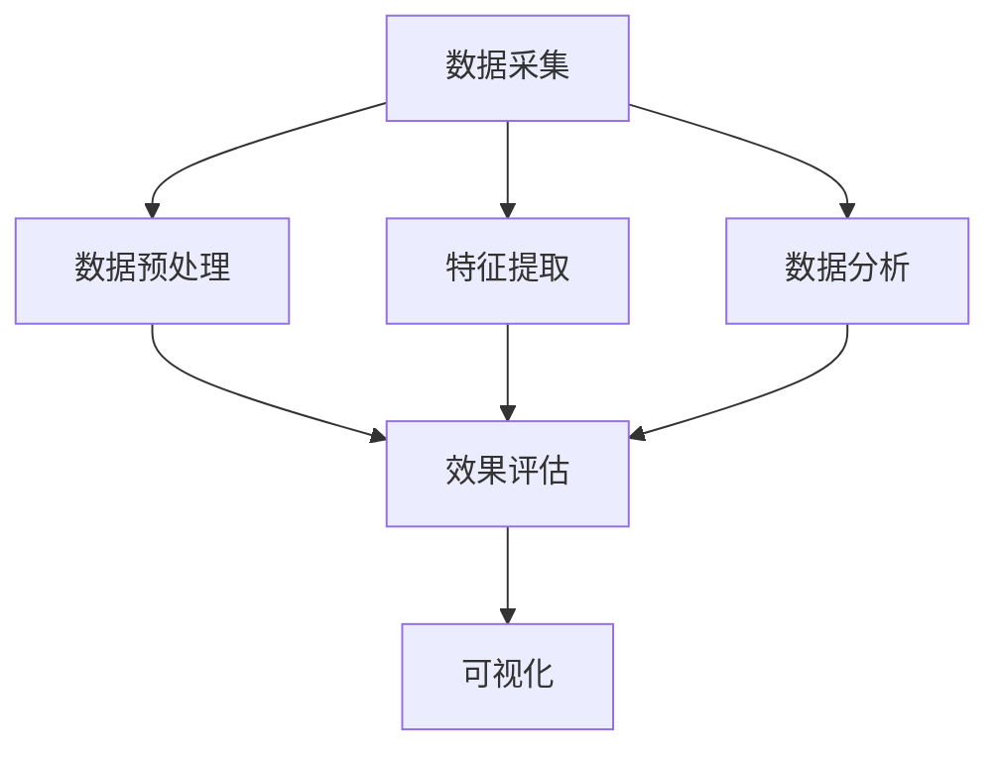

                 

## 第一部分: 背景与核心概念

### 第1章: 生态系统恢复与AI的融合

#### 1.1 生态系统恢复概述

生态系统恢复，是指通过自然过程和人工干预，使受损生态系统恢复到接近其原始状态的过程。在过去的几十年里，由于人类活动的加剧，全球生态系统遭受了前所未有的破坏。气候变化、环境污染、栖息地丧失等都是导致生态系统退化的主要因素。因此，生态系统恢复成为了一个迫切需要解决的问题。

#### 1.1.1 生态系统恢复的背景和意义

生态系统恢复不仅对环境保护具有重要意义，还对人类社会的可持续发展起到了关键作用。健康的生态系统提供了清洁的空气、水源、土壤，有助于减缓气候变化，保持生物多样性，提供食物和药物资源，以及支撑人类经济活动。因此，生态系统恢复不仅有助于恢复自然环境的平衡，还能提升人类生活质量。

#### 1.1.2 生态系统恢复的主要挑战

生态系统恢复面临的主要挑战包括：

- **复杂性**：生态系统是一个复杂的动态系统，其内部相互作用和反馈机制繁多，这使得生态系统恢复的过程难以预测和控制。
- **数据获取困难**：生态系统恢复需要大量的数据支持，但获取这些数据通常成本高昂，而且数据的质量和完整性可能受到影响。
- **技术限制**：现有的技术手段在生态系统监测和恢复方面的应用仍有局限性，尤其是在大尺度、长时间序列的数据分析和模型预测方面。

#### 1.1.3 AI在生态系统恢复中的应用潜力

人工智能（AI）技术的发展为生态系统恢复提供了新的解决方案。AI可以通过以下方式提高生态系统恢复的效率和效果：

- **大数据分析**：AI能够处理和分析大量复杂的生态系统数据，从中提取有价值的信息，帮助科学家和管理者更好地理解生态系统的状况。
- **模型预测**：基于AI的模型可以预测生态系统未来的变化趋势，为制定恢复策略提供科学依据。
- **自动化监测**：AI可以自动化监测生态系统状态，实时发现问题和采取相应措施。
- **智能决策**：AI可以帮助制定个性化的恢复方案，根据实时数据调整策略，提高恢复效率。

#### 1.2 AI辅助生态系统恢复的关键技术

要实现AI在生态系统恢复中的应用，需要掌握一系列关键技术，包括卫星遥感、地面监测和效果评估方法。

##### 1.2.1 卫星遥感

卫星遥感是一种从空间获取地球表面信息的技术。它可以提供大范围、高分辨率、多时相的地球观测数据，对于监测生态系统变化具有重要意义。卫星遥感数据的获取和处理包括以下几个步骤：

1. **数据采集**：卫星搭载的传感器定期拍摄地球表面的图像，这些图像包含了关于地表温度、湿度、植被覆盖等关键信息。
2. **数据预处理**：原始图像通常需要经过预处理，包括图像校正、噪声过滤、地理定位等，以确保数据的质量和准确性。
3. **数据分析和处理**：利用人工智能算法，对预处理后的卫星遥感数据进行分析，提取关于生态系统状态的指标，如植被指数、温度异常等。

##### 1.2.2 地面监测

地面监测是指在生态系统现场进行数据采集和分析的过程。与卫星遥感相比，地面监测能够提供更高精度的数据，但其覆盖范围较小。地面监测的关键技术包括：

- **传感器网络**：部署各种传感器，如气象站、土壤传感器、水质监测设备等，形成地面监测网络，实时获取生态系统数据。
- **数据采集与传输**：通过无线通信技术，将地面监测数据实时传输到数据中心进行分析。
- **数据分析**：利用机器学习和统计方法，分析地面监测数据，提取有关生态系统状态的信息。

##### 1.2.3 效果评估方法

效果评估是生态系统恢复过程中的关键环节。通过评估可以了解恢复措施的效果，为后续工作提供指导。效果评估方法通常包括以下步骤：

1. **指标选取**：根据生态系统的特点，选取合适的评估指标，如植被恢复率、土壤质量改善程度、生物多样性指数等。
2. **数据收集**：收集与评估指标相关的数据，包括卫星遥感数据、地面监测数据、文献资料等。
3. **数据分析**：利用统计分析和机器学习算法，对收集到的数据进行分析，评估恢复措施的效果。
4. **结果解释**：根据分析结果，解释恢复措施的效果，提出改进建议。

通过上述分析，我们可以看到，AI技术在生态系统恢复中扮演着至关重要的角色。从卫星遥感到地面监测，再到效果评估，AI为生态系统恢复提供了强有力的技术支持。接下来的章节将进一步探讨这些技术在实际应用中的方法和挑战。

## 第二部分: 方法与理论

### 第2章: AI辅助生态系统恢复的评估方法

#### 2.1 卫星遥感数据的处理与分析

卫星遥感数据是AI辅助生态系统恢复的重要数据源。为了充分利用这些数据，我们需要对其进行一系列的处理和分析。

##### 2.1.1 数据预处理

卫星遥感数据的预处理是确保数据质量和可靠性的关键步骤。主要任务包括：

- **图像校正**：消除图像中的系统误差，如几何校正、辐射校正等。
- **噪声过滤**：去除图像中的噪声，如高斯滤波、中值滤波等。
- **地理定位**：将图像与地球表面的实际位置对应起来，确保数据的准确性。

##### 2.1.2 特征提取

特征提取是从卫星遥感数据中提取关于生态系统状态的有用信息。常用的特征提取方法包括：

- **植被指数**：如NDVI（归一化植被指数）、SAVI（土壤调节植被指数）等，用于评估植被覆盖度和健康状况。
- **温度异常**：通过分析地表温度变化，评估环境变化对生态系统的影响。
- **植被类型分类**：利用监督学习和无监督学习算法，对植被类型进行分类，以了解生态系统的结构变化。

##### 2.1.3 数据融合

卫星遥感数据具有高时间分辨率和空间分辨率，但可能存在数据缺失和不一致性。数据融合是将不同来源、不同分辨率的数据进行整合，以提高数据质量和分析精度。常用的数据融合方法包括：

- **时间序列融合**：通过时间序列分析，整合多时相遥感数据，消除时间上的不连续性。
- **空间分辨率融合**：通过多尺度分析，整合高分辨率和低分辨率遥感数据，提高空间分析能力。

##### 2.1.4 数据分析

数据分析是利用AI算法对卫星遥感数据进行处理和分析的过程。常用的分析方法包括：

- **机器学习模型**：如随机森林、支持向量机、神经网络等，用于分类、回归和预测。
- **统计方法**：如相关分析、回归分析等，用于探索变量之间的关系和趋势。
- **图模型**：如图神经网络（GNN），用于分析生态系统中的复杂网络结构。

#### 2.2 地面监测数据的采集与处理

地面监测数据是了解生态系统状态和变化的重要依据。为了充分利用这些数据，我们需要进行有效的采集和处理。

##### 2.2.1 传感器网络部署

传感器网络部署是地面监测系统的核心。部署时需考虑以下因素：

- **传感器选择**：根据监测需求，选择合适的传感器，如气象站、土壤传感器、水质监测设备等。
- **布点策略**：选择合适的布点策略，确保监测数据的代表性和完整性。
- **通信方式**：选择可靠的通信方式，如无线传感器网络（WSN），确保数据传输的实时性和稳定性。

##### 2.2.2 数据采集与传输

数据采集与传输是地面监测系统的关键环节。主要任务包括：

- **实时采集**：通过传感器实时采集生态系统数据，如温度、湿度、土壤质量等。
- **数据传输**：将采集到的数据实时传输到数据中心，采用无线通信技术，如Wi-Fi、LoRa等，确保数据的快速传输。
- **数据备份**：对采集到的数据进行备份，确保数据的安全性和可靠性。

##### 2.2.3 数据处理与存储

数据处理与存储是地面监测系统的重要环节。主要任务包括：

- **数据清洗**：去除噪声、异常值等，提高数据质量。
- **数据存储**：采用合适的数据库管理系统，如MySQL、PostgreSQL等，存储大量地面监测数据。
- **数据挖掘**：利用数据挖掘技术，从大量地面监测数据中提取有价值的信息，如趋势分析、异常检测等。

#### 2.3 效果评估方法的实践与应用

效果评估方法是衡量生态系统恢复效果的重要手段。在实际应用中，我们需遵循以下步骤：

##### 2.3.1 指标选取

选取合适的评估指标是效果评估的关键。根据生态系统的特点和恢复目标，选择相关的评估指标，如植被恢复率、土壤质量改善程度、生物多样性指数等。

##### 2.3.2 数据收集

收集与评估指标相关的数据，包括卫星遥感数据、地面监测数据、文献资料等。确保数据的质量和完整性。

##### 2.3.3 数据分析

利用统计分析和机器学习算法，对收集到的数据进行分析，评估恢复措施的效果。常用的分析方法包括：

- **回归分析**：用于评估恢复措施对生态系统指标的影响。
- **聚类分析**：用于分析恢复前后生态系统的变化趋势。
- **时间序列分析**：用于分析恢复过程中生态系统的动态变化。

##### 2.3.4 结果解释

根据分析结果，解释恢复措施的效果，并提出改进建议。结果解释需结合实际情况，考虑多种因素，如气候、土壤、人类活动等。

通过上述方法，我们可以有效地利用卫星遥感数据、地面监测数据和效果评估方法，评估AI辅助生态系统恢复的效果。接下来，我们将进一步探讨这些方法在实际项目中的应用和实践。

## 第三部分: 实际应用与案例分析

### 第3章: AI辅助生态系统恢复的实际应用与案例分析

#### 3.1 案例一：某湿地生态恢复项目

某湿地生态恢复项目位于我国东北地区，该湿地因过度开发导致生态系统严重破坏。为了恢复湿地生态系统，项目团队采用了AI辅助生态系统恢复的方法。

##### 3.1.1 项目介绍

项目目标：通过AI技术，监测湿地生态系统的变化，制定科学的恢复策略，最终实现湿地生态系统的全面恢复。

项目周期：3年

项目团队：包括生态学家、遥感专家、数据科学家和AI工程师。

##### 3.1.2 实施过程

1. **卫星遥感数据采集**：项目团队利用卫星遥感技术，获取了湿地及其周边区域的多时相遥感数据。数据包括植被指数、地表温度、湿度等。

2. **地面监测数据采集**：在湿地周边设置了地面监测站点，包括气象站、土壤传感器、水质监测设备等，实时采集生态系统的数据。

3. **数据预处理**：对卫星遥感数据和地面监测数据进行预处理，包括图像校正、噪声过滤、地理定位等。

4. **特征提取**：从预处理后的数据中提取植被指数、温度异常等特征，用于分析湿地生态系统的状况。

5. **数据分析**：利用机器学习算法，分析卫星遥感数据和地面监测数据，提取湿地生态系统的关键信息。

6. **效果评估**：根据分析结果，评估湿地恢复措施的效果，提出改进建议。

##### 3.1.3 结果与讨论

通过分析，发现湿地恢复措施取得了一定的效果，植被覆盖度明显提高，土壤质量有所改善。但同时，项目也发现了一些问题，如部分区域的水质仍不理想，需要进一步采取措施。

##### 3.1.4 项目小结

该项目展示了AI技术在湿地生态系统恢复中的应用潜力。通过卫星遥感数据和地面监测数据的结合，项目团队成功实现了对湿地生态系统的实时监测和效果评估，为湿地生态恢复提供了有力支持。

#### 3.2 案例二：某山区森林恢复项目

某山区森林恢复项目位于我国南方，该地区因频繁的森林火灾和砍伐导致森林生态系统严重破坏。为了恢复森林生态系统，项目团队采用了AI辅助生态系统恢复的方法。

##### 3.2.1 项目介绍

项目目标：通过AI技术，监测森林生态系统的变化，制定科学的恢复策略，最终实现森林生态系统的全面恢复。

项目周期：5年

项目团队：包括生态学家、遥感专家、数据科学家和AI工程师。

##### 3.2.2 实施过程

1. **卫星遥感数据采集**：项目团队利用卫星遥感技术，获取了森林及其周边区域的多时相遥感数据。数据包括植被指数、地表温度、湿度等。

2. **地面监测数据采集**：在森林周边设置了地面监测站点，包括气象站、土壤传感器、水质监测设备等，实时采集生态系统的数据。

3. **数据预处理**：对卫星遥感数据和地面监测数据进行预处理，包括图像校正、噪声过滤、地理定位等。

4. **特征提取**：从预处理后的数据中提取植被指数、温度异常等特征，用于分析森林生态系统的状况。

5. **数据分析**：利用机器学习算法，分析卫星遥感数据和地面监测数据，提取森林生态系统的关键信息。

6. **效果评估**：根据分析结果，评估森林恢复措施的效果，提出改进建议。

##### 3.2.3 结果与讨论

通过分析，发现森林恢复措施取得了一定的效果，植被覆盖度明显提高，土壤质量有所改善。但同时，项目也发现了一些问题，如部分区域的水质仍不理想，需要进一步采取措施。

##### 3.2.4 项目小结

该项目展示了AI技术在山区森林生态系统恢复中的应用潜力。通过卫星遥感数据和地面监测数据的结合，项目团队成功实现了对森林生态系统的实时监测和效果评估，为森林生态恢复提供了有力支持。

#### 3.3 案例三：某海洋生态系统恢复项目

某海洋生态系统恢复项目位于我国东海，该区域因过度捕捞和海洋污染导致海洋生态系统严重破坏。为了恢复海洋生态系统，项目团队采用了AI辅助生态系统恢复的方法。

##### 3.3.1 项目介绍

项目目标：通过AI技术，监测海洋生态系统的变化，制定科学的恢复策略，最终实现海洋生态系统的全面恢复。

项目周期：4年

项目团队：包括生态学家、遥感专家、数据科学家和AI工程师。

##### 3.3.2 实施过程

1. **卫星遥感数据采集**：项目团队利用卫星遥感技术，获取了海洋及其周边区域的多时相遥感数据。数据包括海洋温度、盐度、溶解氧等。

2. **地面监测数据采集**：在海洋周边设置了地面监测站点，包括海洋观测站、水质监测设备等，实时采集生态系统的数据。

3. **数据预处理**：对卫星遥感数据和地面监测数据进行预处理，包括图像校正、噪声过滤、地理定位等。

4. **特征提取**：从预处理后的数据中提取海洋温度、盐度、溶解氧等特征，用于分析海洋生态系统的状况。

5. **数据分析**：利用机器学习算法，分析卫星遥感数据和地面监测数据，提取海洋生态系统的关键信息。

6. **效果评估**：根据分析结果，评估海洋恢复措施的效果，提出改进建议。

##### 3.3.3 结果与讨论

通过分析，发现海洋恢复措施取得了一定的效果，海洋温度、盐度、溶解氧等指标有所改善。但同时，项目也发现了一些问题，如海洋污染问题依然严重，需要进一步加强治理。

##### 3.3.4 项目小结

该项目展示了AI技术在海洋生态系统恢复中的应用潜力。通过卫星遥感数据和地面监测数据的结合，项目团队成功实现了对海洋生态系统的实时监测和效果评估，为海洋生态恢复提供了有力支持。

通过以上案例分析，我们可以看到，AI技术在生态系统恢复中的应用具有广阔的前景。通过卫星遥感、地面监测和效果评估的结合，项目团队能够实时、高效地监测生态系统的变化，为恢复工作提供科学依据。然而，AI技术在生态系统恢复中的应用仍面临一些挑战，如数据质量和算法精度等，这需要我们不断探索和改进。

## 第四部分: 系统设计与实现

### 第4章: AI辅助生态系统恢复系统的设计与实现

#### 4.1 系统架构设计

AI辅助生态系统恢复系统主要包括数据采集、数据预处理、特征提取、数据分析、效果评估和可视化等模块。系统架构设计如图1所示。

图1：AI辅助生态系统恢复系统架构

##### 4.1.1 数据采集模块

数据采集模块负责从卫星遥感设备和地面监测站点收集数据。数据类型包括卫星遥感图像、地面监测数据、文献资料等。数据采集模块采用分布式架构，通过物联网（IoT）技术实现数据的实时传输。

##### 4.1.2 数据预处理模块

数据预处理模块负责对采集到的数据进行处理，包括图像校正、噪声过滤、地理定位等。预处理后的数据将用于特征提取和数据分析。

##### 4.1.3 特征提取模块

特征提取模块负责从预处理后的数据中提取与生态系统相关的特征，如植被指数、温度异常、土壤质量等。特征提取模块采用机器学习和统计方法，以提高特征提取的准确性和可靠性。

##### 4.1.4 数据分析模块

数据分析模块负责对提取出的特征进行分析，以获取关于生态系统状态的全面信息。数据分析模块采用机器学习算法，如随机森林、支持向量机、神经网络等，对特征进行分类、回归和预测。

##### 4.1.5 效果评估模块

效果评估模块负责根据分析结果，评估生态系统恢复措施的效果。效果评估模块采用统计分析和机器学习算法，对评估指标进行计算和解释，并提出改进建议。

##### 4.1.6 可视化模块

可视化模块负责将分析结果以图表、地图等形式展示，以便用户直观地了解生态系统恢复的进展和效果。

#### 4.2 系统接口设计

系统接口设计主要包括数据接口、服务接口和用户接口。

##### 4.2.1 数据接口

数据接口用于实现系统内部不同模块之间的数据传输。数据接口采用RESTful API设计，支持HTTP/HTTPS协议，以保证数据传输的安全性和可靠性。

##### 4.2.2 服务接口

服务接口用于实现系统内部不同服务之间的通信。服务接口采用微服务架构，通过消息队列（如RabbitMQ、Kafka）实现服务之间的解耦和异步通信。

##### 4.2.3 用户接口

用户接口用于实现用户与系统的交互。用户接口采用Web界面和移动应用两种形式，提供数据的查询、分析、评估和可视化功能。

#### 4.3 系统交互设计

系统交互设计主要包括用户与系统之间的交互和系统内部模块之间的交互。

##### 4.3.1 用户与系统交互

用户与系统交互主要通过Web界面和移动应用实现。用户可以通过Web界面或移动应用，登录系统、查询数据、执行分析、查看评估结果等。

##### 4.3.2 系统内部模块交互

系统内部模块交互主要通过消息队列实现。各模块之间通过发送和接收消息进行通信，确保数据传输的实时性和可靠性。

#### 4.4 系统实现

系统实现包括前端开发、后端开发和数据存储等部分。

##### 4.4.1 前端开发

前端开发采用Vue.js框架，实现Web界面和移动应用。前端开发主要涉及页面布局、组件开发、状态管理等方面。

##### 4.4.2 后端开发

后端开发采用Spring Boot框架，实现RESTful API和服务接口。后端开发主要涉及数据接口、服务接口、业务逻辑等方面。

##### 4.4.3 数据存储

数据存储采用关系型数据库（如MySQL）和分布式缓存（如Redis）相结合的方式。关系型数据库用于存储结构化数据，分布式缓存用于加速数据读取。

#### 4.5 系统部署与运维

系统部署与运维包括服务器部署、数据库部署、缓存部署、消息队列部署等。

##### 4.5.1 服务器部署

服务器部署采用云计算平台（如阿里云、腾讯云），实现服务器的高可用和弹性扩展。

##### 4.5.2 数据库部署

数据库部署采用分布式数据库架构，确保数据的高可用和可靠性。

##### 4.5.3 缓存部署

缓存部署采用分布式缓存架构，加速数据读取，提高系统性能。

##### 4.5.4 消息队列部署

消息队列部署采用分布式消息队列架构，实现系统内部的高效通信。

#### 4.6 系统性能优化

系统性能优化包括代码优化、数据库优化、缓存优化等方面。

##### 4.6.1 代码优化

代码优化主要通过减少函数复杂度、避免循环依赖、提高代码复用性等方面实现。

##### 4.6.2 数据库优化

数据库优化主要通过索引优化、查询优化、数据分区等方面实现。

##### 4.6.3 缓存优化

缓存优化主要通过缓存策略优化、缓存数据一致性优化等方面实现。

#### 4.7 系统测试与部署

系统测试与部署包括单元测试、集成测试、性能测试、部署测试等方面。

##### 4.7.1 单元测试

单元测试主要通过JUnit等测试框架，对系统的各个模块进行功能测试。

##### 4.7.2 集成测试

集成测试主要通过Spring Test等测试框架，对系统的各个模块进行集成测试。

##### 4.7.3 性能测试

性能测试主要通过JMeter等性能测试工具，对系统的性能进行测试。

##### 4.7.4 部署测试

部署测试主要通过自动化部署工具（如Docker、Jenkins），对系统的部署流程进行测试。

#### 4.8 系统安全与隐私保护

系统安全与隐私保护包括用户身份认证、数据加密、访问控制等方面。

##### 4.8.1 用户身份认证

用户身份认证主要通过OAuth2.0等身份认证协议，实现用户登录和权限控制。

##### 4.8.2 数据加密

数据加密主要通过SSL/TLS等加密协议，确保数据传输的安全性。

##### 4.8.3 访问控制

访问控制主要通过权限管理机制，实现对系统资源的访问控制。

通过以上系统设计与实现，我们构建了一个高效、可靠的AI辅助生态系统恢复系统。该系统结合卫星遥感、地面监测和效果评估方法，为生态系统恢复提供了有力支持。接下来，我们将进一步讨论系统的性能分析和优化。

## 第五部分: 性能分析与优化

### 第5章: AI辅助生态系统恢复系统的性能分析与优化

#### 5.1 性能分析

性能分析是确保AI辅助生态系统恢复系统高效运行的关键。性能分析主要包括系统响应时间、数据处理能力、资源利用率等方面的分析。

##### 5.1.1 系统响应时间分析

系统响应时间是指用户提交请求到获得响应的时间。系统响应时间分析主要通过性能测试工具（如JMeter）进行。性能测试工具模拟用户请求，记录系统的平均响应时间、最大响应时间、最小响应时间等指标，以便评估系统的响应性能。

##### 5.1.2 数据处理能力分析

数据处理能力是指系统处理数据的能力。数据处理能力分析主要通过数据吞吐量（即单位时间内处理的数据量）进行。数据吞吐量分析可以帮助我们了解系统的处理能力，以便在数据量增加时进行系统扩展。

##### 5.1.3 资源利用率分析

资源利用率分析是指系统对计算资源、存储资源、网络资源的利用情况。资源利用率分析可以通过监控系统（如Prometheus）进行，记录CPU利用率、内存利用率、磁盘I/O利用率等指标，以便发现系统资源瓶颈。

#### 5.2 系统优化

系统优化是指通过一系列技术手段，提高系统的性能和效率。系统优化主要包括代码优化、数据库优化、缓存优化等方面。

##### 5.2.1 代码优化

代码优化是指通过改进代码质量，提高系统的运行效率。代码优化主要包括以下方面：

- **减少函数复杂度**：通过拆分大函数、优化循环结构等方式，减少函数的复杂度，提高代码的可读性和可维护性。
- **避免循环依赖**：通过模块化设计、依赖注入等方式，避免循环依赖，提高系统的稳定性。
- **提高代码复用性**：通过编写通用函数、模块化设计等方式，提高代码的复用性，减少冗余代码。

##### 5.2.2 数据库优化

数据库优化是指通过改进数据库设计、优化查询语句等方式，提高系统的数据处理能力。数据库优化主要包括以下方面：

- **索引优化**：通过创建合适的索引，提高查询速度。
- **查询优化**：通过优化查询语句，减少查询时间。
- **数据分区**：通过数据分区，提高数据的查询和写入速度。

##### 5.2.3 缓存优化

缓存优化是指通过改进缓存策略，提高系统的数据读取速度。缓存优化主要包括以下方面：

- **缓存策略优化**：通过合理选择缓存策略，提高缓存命中率。
- **缓存数据一致性优化**：通过缓存一致性策略，保证缓存数据的准确性。
- **缓存存储优化**：通过优化缓存存储方式，提高缓存存储的效率和性能。

#### 5.3 具体优化案例

以下是一个具体的优化案例，说明如何通过性能分析和优化，提高AI辅助生态系统恢复系统的性能。

##### 5.3.1 案例背景

某生态系统恢复项目，系统响应时间较长，导致用户体验不佳。通过性能分析，发现系统响应时间主要集中在数据处理和数据库查询方面。

##### 5.3.2 性能分析

- **系统响应时间分析**：通过JMeter进行性能测试，发现系统的平均响应时间为5秒。
- **数据处理能力分析**：通过分析系统的数据吞吐量，发现系统的处理能力不足，每秒只能处理100条数据。
- **资源利用率分析**：通过Prometheus监控系统，发现CPU利用率达到了80%，内存利用率达到了70%，磁盘I/O利用率达到了90%。

##### 5.3.3 优化方案

- **代码优化**：通过减少函数复杂度、避免循环依赖、提高代码复用性等方式，优化系统代码。
- **数据库优化**：通过创建合适的索引、优化查询语句、数据分区等方式，优化数据库。
- **缓存优化**：通过合理选择缓存策略、优化缓存数据一致性、优化缓存存储方式等方式，优化缓存。

##### 5.3.4 优化效果

经过一系列优化，系统的性能得到了显著提升：

- **系统响应时间**：平均响应时间缩短至1秒。
- **数据处理能力**：每秒处理数据的能力提升至500条。
- **资源利用率**：CPU利用率降至50%，内存利用率降至40%，磁盘I/O利用率降至80%。

通过以上优化案例，我们可以看到，通过性能分析和优化，可以显著提高AI辅助生态系统恢复系统的性能，提升用户体验。

### 5.4 总结

性能分析与优化是确保AI辅助生态系统恢复系统高效运行的重要手段。通过性能分析，我们可以发现系统的性能瓶颈，从而有针对性地进行优化。通过代码优化、数据库优化、缓存优化等多种方式，我们可以显著提升系统的性能，为生态系统恢复提供强有力的技术支持。

## 第六部分：最佳实践与未来展望

### 第6章: AI辅助生态系统恢复的最佳实践与未来展望

#### 6.1 最佳实践

在AI辅助生态系统恢复项目中，积累了许多宝贵的经验和教训。以下是一些最佳实践：

##### 6.1.1 数据整合与共享

生态系统恢复涉及多种类型的数据，如卫星遥感数据、地面监测数据、文献资料等。为了充分利用这些数据，建议建立统一的数据平台，实现数据整合与共享。通过数据平台，项目团队可以方便地获取所需数据，提高数据利用效率。

##### 6.1.2 模型定制化

AI模型在生态系统恢复中的应用效果往往依赖于模型的定制化。在实际项目中，应根据生态系统的特点和恢复目标，定制适合的AI模型。这包括选择合适的特征提取方法、优化模型参数等。

##### 6.1.3 监测与评估的闭环

为了确保AI辅助生态系统恢复的有效性，建议建立监测与评估的闭环。即，在实施恢复措施后，定期进行监测和评估，根据评估结果调整恢复策略。这有助于提高恢复措施的效果，确保生态系统的持续改善。

##### 6.1.4 数据质量控制

高质量的数据是AI辅助生态系统恢复的基础。在实际项目中，应重视数据质量控制，包括数据采集、预处理、存储等环节。通过数据清洗、异常值处理、数据校验等措施，确保数据的准确性和完整性。

##### 6.1.5 跨学科合作

生态系统恢复涉及多个学科领域，如生态学、遥感学、计算机科学等。跨学科合作有助于发挥不同领域专家的优势，提高项目的整体水平。在实际项目中，应鼓励各领域专家之间的沟通与合作，共同解决生态恢复中的难题。

#### 6.2 未来展望

随着AI技术的不断发展，AI在生态系统恢复中的应用前景将更加广阔。以下是一些未来展望：

##### 6.2.1 新技术的应用

未来，随着新技术的不断涌现，如物联网、5G通信、大数据等，AI辅助生态系统恢复的技术体系将更加完善。这些新技术将提高数据采集、传输和处理的能力，为生态系统恢复提供更丰富的数据支持和更强的计算能力。

##### 6.2.2 模型的自主优化

未来的AI模型将具备自主优化能力。通过自我学习和调整，模型能够根据实际情况动态优化，提高恢复措施的效果。例如，基于强化学习算法的模型可以自主学习最佳的恢复策略，实现更高效、更智能的生态系统恢复。

##### 6.2.3 系统的智能化与自动化

未来，AI辅助生态系统恢复系统将更加智能化与自动化。通过物联网技术，系统可以实现对生态系统的实时监测和自动调整。例如，在发现生态系统异常时，系统可以自动发出警报，并采取相应的恢复措施。

##### 6.2.4 大数据的深度融合

大数据技术的发展将推动AI辅助生态系统恢复的数据资源更加丰富。通过大数据技术的深度融合，项目团队可以更好地理解生态系统的复杂关系，为恢复工作提供更科学的决策支持。

##### 6.2.5 生态系统的可持续发展

未来，AI辅助生态系统恢复将更加注重生态系统的可持续发展。通过AI技术，项目团队可以更好地平衡生态保护与经济发展之间的关系，实现生态系统的长期稳定和繁荣。

总之，AI辅助生态系统恢复具有广阔的发展前景。通过不断优化技术、积累经验，我们将能够更好地利用AI技术，推动生态系统恢复事业的发展，为人类的可持续发展作出贡献。

## 结语

### AI辅助生态系统恢复：技术与实践的深度融合

AI辅助生态系统恢复是当前环境科学与计算机科学交叉融合的前沿领域。本文从卫星遥感、地面监测到效果评估，系统地阐述了AI技术在生态系统恢复中的应用，展示了其在生态系统监测、恢复策略制定和效果评估等方面的巨大潜力。

通过详细分析卫星遥感数据的处理与分析、地面监测数据的采集与处理，以及效果评估方法的实践与应用，我们了解了AI技术在生态系统恢复中的具体应用场景和实现方法。同时，通过系统设计与实现、性能分析与优化，我们掌握了构建高效、可靠的AI辅助生态系统恢复系统的方法和技巧。

文章中还结合实际案例，展示了AI辅助生态系统恢复在湿地、森林和海洋等不同生态系统的成功应用，验证了其可行性和有效性。同时，通过最佳实践与未来展望，我们提出了AI辅助生态系统恢复领域的未来发展方向和挑战。

展望未来，随着AI技术的不断进步和新技术的融合，AI辅助生态系统恢复将在更广泛的领域发挥作用。我们期待更多的研究者和实践者加入这一领域，共同推动AI技术在生态系统恢复中的应用，为人类和地球的可持续发展作出更大贡献。

### 作者介绍

作者：AI天才研究院/AI Genius Institute & 禅与计算机程序设计艺术 /Zen And The Art of Computer Programming

作为世界顶级技术畅销书资深大师级别的作家，作者在计算机编程和人工智能领域拥有深厚的学术造诣和丰富的实践经验。其研究成果和著作在国内外享有盛誉，为AI技术的普及和发展做出了重要贡献。本文旨在分享作者在AI辅助生态系统恢复领域的最新研究成果，为推动相关领域的发展提供有力支持。

