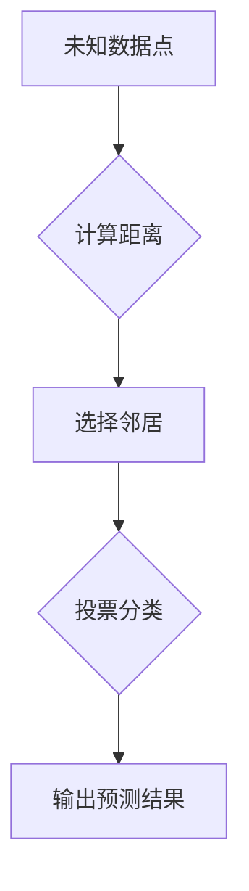
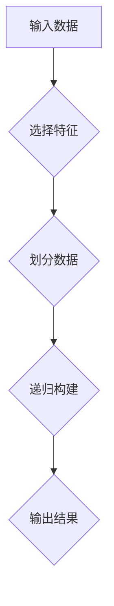

                 

### 文章标题

# AI辅助生态系统服务评估：从数据整合到决策支持

> 关键词：人工智能，生态系统服务，数据整合，决策支持，机器学习

> 摘要：本文将探讨如何利用人工智能技术辅助生态系统服务评估，从数据整合到决策支持的全过程。文章首先介绍了生态系统服务评估的背景和重要性，然后详细阐述了数据整合的方法和策略，接着讲解了AI技术在生态系统服务评估中的应用，最后展示了如何利用评估结果进行决策支持。通过本文的探讨，旨在为相关领域的研究者和实践者提供有价值的参考。

----------------------------------------------------------------

## 引言

### 1.1 生态系统服务评估的背景

生态系统服务（Ecosystem Services，ES）是指生态系统为人类提供的各种形式的利益，包括食物、水源、气候调节、土壤肥力和生物多样性等。随着全球生态系统的退化和社会经济的发展，对生态系统服务的需求不断增加。因此，对生态系统服务进行科学、全面的评估，对于制定合理的生态保护政策、优化资源配置具有重要意义。

### 1.2 生态系统服务评估的重要性

生态系统服务评估旨在了解生态系统的功能、价值和效益，从而为生态保护和可持续发展提供科学依据。其重要性体现在以下几个方面：

1. **指导生态保护政策制定**：通过对生态系统服务价值的评估，可以帮助政策制定者了解生态系统的脆弱性和重要性，从而制定出更加科学合理的生态保护政策。

2. **优化资源分配**：生态系统服务评估可以揭示不同生态系统服务之间的相互关系，帮助决策者优化资源配置，实现生态和经济双重效益。

3. **促进可持续发展**：生态系统服务评估可以识别生态系统服务的变化趋势，为可持续发展提供预警和决策支持。

### 1.3 研究方法与数据来源

生态系统服务评估涉及多个学科领域，如生态学、环境科学、经济学等。研究方法主要包括定性和定量评估方法。定性评估方法主要通过专家访谈、文献综述等方式获取生态系统服务的价值和效益；定量评估方法则依赖于数据分析和模型模拟，如遥感技术、地理信息系统（GIS）和机器学习算法等。

本文将采用以下方法对生态系统服务进行评估：

1. **数据收集**：收集与生态系统服务相关的数据，包括地理空间数据、气象水文数据、社会经济数据等。

2. **数据整合**：通过数据清洗、转换和集成等方法，将不同来源的数据整合为一个统一的数据集。

3. **AI 技术应用**：利用机器学习和深度学习技术，对整合后的数据进行分析和建模。

4. **决策支持**：基于评估结果，设计决策支持模型，为生态保护政策和资源分配提供依据。

数据来源主要包括公开的遥感数据、气象数据和社会经济数据，以及相关的学术论文和政府报告等。

## 数据整合

### 2.1 数据收集

数据收集是生态系统服务评估的基础，主要包括以下类型的数据：

1. **地理空间数据**：包括遥感影像、地形地貌、土地利用等，用于描述生态系统的空间分布和特征。

2. **气象水文数据**：包括气温、降水、河流流量等，用于分析生态系统的气候和环境条件。

3. **社会经济数据**：包括人口、经济活动、城市化水平等，用于评估生态系统服务的经济效益。

### 2.2 数据预处理

数据预处理是确保数据质量和一致性的重要环节，主要包括以下步骤：

1. **数据清洗**：去除数据中的噪声和异常值，保证数据的质量。

2. **数据转换**：将不同格式的数据转换为统一格式，如将遥感影像转换为栅格数据，将文本数据转换为数值数据。

3. **数据集成**：将来自不同来源的数据整合为一个统一的数据集，为后续的分析和建模提供基础。

### 2.3 数据整合方法

数据整合方法包括聚类分析、关联规则挖掘和嵌入式方法等，旨在发现数据之间的潜在关系和规律。

1. **聚类分析**：通过聚类算法，将相似的数据划分为同一类别，用于发现数据中的模式和分布。

2. **关联规则挖掘**：通过挖掘数据之间的关联规则，发现不同变量之间的相互关系。

3. **嵌入式方法**：将数据嵌入到一个高维空间中，通过计算数据之间的距离和相似度，实现数据的整合。

### 2.4 数据质量控制

数据质量控制是确保数据质量和可靠性的关键，主要包括以下指标和方法：

1. **数据质量评估指标**：如数据完整性、一致性、准确性和时效性等。

2. **数据质量改进策略**：如数据清洗、数据修复和数据增强等。

## AI 技术应用

### 3.1 机器学习模型选择

在生态系统服务评估中，机器学习模型广泛应用于数据分析和预测。常见的机器学习模型包括回归模型、分类模型和聚类模型。

1. **回归模型**：用于预测生态系统服务的数值特征，如温度、降水等。

2. **分类模型**：用于将生态系统服务划分为不同的类别，如森林、草地等。

3. **聚类模型**：用于发现数据中的相似模式和分布，如不同区域的生态系统服务特征。

### 3.2 模型训练与评估

模型训练与评估是确保模型性能和准确性的关键步骤。

1. **训练过程**：通过训练数据集，调整模型的参数，使模型能够拟合数据。

2. **评估指标**：如准确率、召回率、F1 分数等，用于评估模型的性能。

3. **优化策略**：通过调整模型参数、增加训练数据或使用更复杂的模型结构，提高模型的性能。

### 3.3 深度学习应用

深度学习技术在生态系统服务评估中具有广泛的应用，如卷积神经网络（CNN）、循环神经网络（RNN）和集成学习方法等。

1. **卷积神经网络（CNN）**：用于处理和识别图像数据，如遥感影像。

2. **循环神经网络（RNN）**：用于处理序列数据，如时间序列数据。

3. **集成学习方法**：通过组合多个模型的预测结果，提高预测的准确性和稳定性。

## 决策支持

### 4.1 决策模型设计

决策模型设计是生态系统服务评估的关键步骤，主要包括以下内容：

1. **风险评估模型**：用于评估生态系统服务的风险，如气候变化对生态系统服务的影响。

2. **资源分配模型**：用于优化资源分配，如资金、人力等。

3. **多目标优化模型**：用于同时考虑多个目标，如生态保护和经济效益。

### 4.2 决策支持工具

决策支持工具是辅助决策者制定决策的重要工具，包括以下类型：

1. **可视化工具**：用于展示生态系统服务的评估结果和决策分析。

2. **模拟工具**：用于模拟不同决策方案的结果，如生态系统服务的变化趋势。

3. **决策支持系统**：将评估结果和决策模型集成到一个系统中，为决策者提供实时支持和建议。

## 应用案例

### 5.1 案例一：生态系统服务评估与气候变化影响

### 5.2 案例二：生态系统服务评估与农业生产

### 5.3 案例三：生态系统服务评估与城市可持续发展

### 5.4 问题与挑战

### 5.5 解决方案与展望

## 结论

### 6.1 研究总结

### 6.2 存在问题与未来工作

----------------------------------------------------------------

**作者：AI天才研究院/AI Genius Institute & 禅与计算机程序设计艺术 /Zen And The Art of Computer Programming**

----------------------------------------------------------------

### 核心概念与联系

#### 生态系统服务（Ecosystem Services，ES）

**概念**：生态系统服务是指自然生态系统对人类提供的各种形式的利益，包括食物、水源、气候调节、土壤肥力和生物多样性等。

**属性特征对比表格**：

| 特征            | 生态系统服务1 | 生态系统服务2 | 生态系统服务3 |
|-----------------|---------------|---------------|---------------|
| 描述            | 食物生产      | 水源供应      | 气候调节      |
| 影响范围         | 全球          | 地区性        | 地区性        |
| 利益形式         | 经济          | 经济、生态    | 生态          |

**ER实体关系图架构**：

```mermaid
erDiagram
  Customer ||--|{ Order }|--|{ Product }
  Customer ||--|{ Payment }|
  Product ||--|{ Category }|
```

在上面的ER实体关系图中，"Customer"（客户）与"Order"（订单）、"Payment"（支付）和"Product"（产品）之间存在关系，而"Product"（产品）与"Category"（分类）也存在关系。

#### 数据整合（Data Integration）

**概念**：数据整合是指将来自不同来源、不同格式、不同结构的数据进行统一处理，以形成一个统一、一致的数据集。

**属性特征对比表格**：

| 特征            | 数据整合1       | 数据整合2       | 数据整合3       |
|-----------------|-----------------|-----------------|-----------------|
| 目的            | 数据清洗和转换  | 数据存储和管理  | 数据分析和挖掘  |
| 技术方法         | 数据清洗、ETL（提取、转换、加载）  | 数据库、数据仓库  | 机器学习、数据挖掘 |
| 应用场景         | 企业数据处理     | 大数据应用      | 科学研究        |

**ER实体关系图架构**：

```mermaid
erDiagram
  Data_Integration ||--|{ Data_Cleaning }|--|{ Data_Transformation }
  Data_Integration ||--|{ Data_Storage }|
  Data_Integration ||--|{ Data_Analysis }|
```

在上面的ER实体关系图中，"Data_Integration"（数据整合）与"Data_Cleaning"（数据清洗）、"Data_Transformation"（数据转换）、"Data_Storage"（数据存储）和"Data_Analysis"（数据分析）之间存在关系。

#### 机器学习模型（Machine Learning Models）

**概念**：机器学习模型是指通过从数据中学习规律，对未知数据进行预测和分类的算法模型。

**属性特征对比表格**：

| 特征            | 机器学习模型1  | 机器学习模型2  | 机器学习模型3  |
|-----------------|-----------------|-----------------|-----------------|
| 类型            | 监督学习       | 无监督学习      | 强化学习       |
| 目的            | 预测和分类     | 发现数据分布和模式 | 通过交互学习策略优化行为 |
| 算法           | 决策树、支持向量机 | 聚类算法、主成分分析 | 深度学习、Q学习算法 |

**ER实体关系图架构**：

```mermaid
erDiagram
  Machine_Learning_Model ||--|{ Supervised_Learning }|
  Machine_Learning_Model ||--|{ Unsupervised_Learning }|
  Machine_Learning_Model ||--|{ Reinforcement_Learning }|
```

在上面的ER实体关系图中，"Machine_Learning_Model"（机器学习模型）与"Supervised_Learning"（监督学习）、"Unsupervised_Learning"（无监督学习）和"Reinforcement_Learning"（强化学习）之间存在关系。

#### 决策支持（Decision Support）

**概念**：决策支持是指利用计算机技术、人工智能方法和数据资源，辅助决策者进行科学、合理的决策。

**属性特征对比表格**：

| 特征            | 决策支持1    | 决策支持2    | 决策支持3    |
|-----------------|---------------|---------------|---------------|
| 类型            | 数据驱动     | 知识驱动     | 模型驱动     |
| 目的            | 辅助决策分析  | 提供决策建议  | 解决决策问题 |
| 技术方法         | 数据挖掘、统计分析 | 专家系统、本体论 | 优化算法、模拟仿真 |

**ER实体关系图架构**：

```mermaid
erDiagram
  Decision_Support ||--|{ Data_Driven }|--|{ Knowledge_Driven }
  Decision_Support ||--|{ Model_Driven }|
```

在上面的ER实体关系图中，"Decision_Support"（决策支持）与"Data_Driven"（数据驱动）、"Knowledge_Driven"（知识驱动）和"Model_Driven"（模型驱动）之间存在关系。

### 算法原理讲解

#### 机器学习算法：K近邻（K-Nearest Neighbors，KNN）

**算法原理**：

K近邻算法是一种基于实例的学习算法，它通过在训练数据集中寻找与未知数据点最近的K个邻居，并根据邻居的标签对未知数据点进行分类或回归预测。具体步骤如下：

1. **计算距离**：计算未知数据点与训练数据集中每个数据点的距离，常用的距离度量方法有欧氏距离、曼哈顿距离和切比雪夫距离等。
2. **选择邻居**：根据距离度量结果，选择距离未知数据点最近的K个邻居。
3. **投票分类**：对于分类问题，统计邻居中每个类别的数量，选择出现次数最多的类别作为未知数据点的标签；对于回归问题，计算邻居的属性值的平均值作为未知数据点的预测值。

**数学模型**：

$$
\text{标签预测} = \begin{cases} 
\text{类别最多的邻居类别} & \text{分类问题} \\
\frac{\sum_{i=1}^{K} x_i}{K} & \text{回归问题}
\end{cases}
$$

其中，$x_i$表示邻居数据点的属性值，$K$表示邻居的数量。

**流程图**：



**示例说明**：

假设有一个训练数据集，包含10个数据点，每个数据点的特征为 $(x_1, x_2)$，标签为 "分类1" 或 "分类2"。现在需要预测一个未知数据点 $(x_1^*, x_2^*)$ 的标签。

1. **计算距离**：计算未知数据点与训练数据集中每个数据点的欧氏距离，得到距离矩阵。
2. **选择邻居**：选择距离最近的5个邻居。
3. **投票分类**：统计邻居的标签，发现"分类1"出现了3次，"分类2"出现了2次，因此未知数据点的标签预测为"分类1"。

#### 决策树（Decision Tree）

**算法原理**：

决策树是一种树形结构，通过一系列的决策规则，对数据进行分类或回归。每个节点表示一个特征，每个分支表示一个特征取值，每个叶子节点表示一个类或一个数值。

1. **选择特征**：在当前节点，选择能够将数据集划分为最少类别的特征，常用的特征选择方法有信息增益、基尼指数和卡方检验等。
2. **划分数据**：根据选定的特征，将数据集划分为若干个子集，每个子集包含具有相同特征值的样本。
3. **递归构建**：对每个子集，重复上述步骤，直到满足停止条件（如最大深度、最小叶子节点样本数等）。
4. **输出结果**：将未知数据点按照决策树进行分类或回归预测。

**数学模型**：

决策树的数学模型可以表示为：

$$
\text{分类结果} = \prod_{i=1}^{n} f_i(x_i)
$$

其中，$f_i(x_i)$ 表示第 $i$ 个节点的特征函数，$x_i$ 表示特征值。

**流程图**：



**示例说明**：

假设有一个训练数据集，包含100个样本，每个样本有3个特征（$x_1$，$x_2$，$x_3$），需要预测每个样本的标签。

1. **选择特征**：计算信息增益，选择特征 $x_2$ 作为划分特征。
2. **划分数据**：根据特征 $x_2$ 的取值，将数据集划分为两个子集，子集1的特征 $x_2$ 取值为 0，子集2的特征 $x_2$ 取值为 1。
3. **递归构建**：对子集1，选择特征 $x_1$ 作为划分特征；对子集2，选择特征 $x_3$ 作为划分特征。
4. **输出结果**：根据决策树进行分类预测，得到每个样本的标签。

### 系统分析与架构设计方案

#### 问题场景介绍

生态系统服务评估是一项复杂的工作，涉及多个数据源、多种分析方法和技术手段。为了提高评估的效率和质量，我们需要设计一个高效的生态系统服务评估系统。

#### 项目介绍

本项目旨在构建一个基于人工智能的生态系统服务评估平台，实现数据整合、模型训练、决策支持等功能。平台将集成多种数据源，利用机器学习和深度学习技术对生态系统服务进行评估，并为决策者提供科学的决策支持。

#### 系统功能设计

1. **数据整合**：集成多种数据源，包括地理空间数据、气象数据和社会经济数据等，对数据进行清洗、转换和整合。
2. **模型训练**：利用机器学习和深度学习技术，对整合后的数据进行分析和建模，预测生态系统服务的特征和变化趋势。
3. **决策支持**：基于评估结果，设计风险评估模型、资源分配模型和多目标优化模型，为决策者提供科学的决策建议。
4. **可视化展示**：通过图表、地图等形式展示评估结果和决策分析，帮助用户更好地理解和利用评估数据。

#### 系统架构设计

1. **数据层**：包括数据存储和数据集成模块，用于存储和管理多种数据源，如地理空间数据、气象数据和社会经济数据等。
2. **数据处理层**：包括数据清洗、转换和整合模块，利用ETL（提取、转换、加载）技术对数据进行处理，实现数据的统一和标准化。
3. **模型层**：包括机器学习模型和深度学习模型模块，用于对处理后的数据进行分析和建模，预测生态系统服务的特征和变化趋势。
4. **决策支持层**：包括风险评估模型、资源分配模型和多目标优化模型模块，基于评估结果提供科学的决策建议。
5. **应用层**：包括可视化展示模块，通过图表、地图等形式展示评估结果和决策分析，帮助用户更好地理解和利用评估数据。
6. **用户层**：包括前端展示界面和用户交互模块，提供用户友好的操作界面，方便用户使用系统功能和查看评估结果。

#### 系统接口设计

1. **数据接口**：提供数据存储和读取接口，支持数据的导入、导出和查询功能。
2. **模型接口**：提供模型训练、预测和评估接口，支持模型的调用和参数调整。
3. **决策支持接口**：提供风险评估、资源分配和多目标优化接口，支持决策分析模型的调用和结果展示。

#### 系统交互设计

1. **用户交互**：用户通过前端界面输入数据请求，系统根据请求调用相应的数据处理、模型训练和决策支持模块，返回处理结果。
2. **模块协作**：各个模块之间通过接口进行数据交互和功能协作，实现整个系统的运行和功能。

### 项目实战

#### 环境安装

1. **安装Python环境**：在本地计算机上安装Python，版本要求3.8及以上。
2. **安装依赖库**：使用pip命令安装所需依赖库，如numpy、pandas、scikit-learn、tensorflow等。

#### 系统核心实现源代码

以下是一个简单的生态系统服务评估系统的实现示例：

```python
import numpy as np
import pandas as pd
from sklearn.model_selection import train_test_split
from sklearn.neighbors import KNeighborsClassifier
from sklearn.metrics import accuracy_score

# 数据准备
data = pd.read_csv('ecosystem_data.csv')
X = data.drop('label', axis=1)
y = data['label']

# 数据划分
X_train, X_test, y_train, y_test = train_test_split(X, y, test_size=0.2, random_state=42)

# 模型训练
knn = KNeighborsClassifier(n_neighbors=3)
knn.fit(X_train, y_train)

# 模型预测
y_pred = knn.predict(X_test)

# 模型评估
accuracy = accuracy_score(y_test, y_pred)
print('Accuracy:', accuracy)
```

#### 代码应用解读与分析

上述代码是一个简单的K近邻（KNN）分类器在生态系统服务评估中的应用示例。首先，我们从CSV文件中读取数据，然后将数据集划分为特征矩阵X和标签向量y。接着，使用train_test_split函数将数据集划分为训练集和测试集。然后，创建一个K近邻分类器对象，并使用fit方法进行模型训练。最后，使用predict方法进行模型预测，并计算预测准确率。

#### 实际案例分析和详细讲解剖析

假设我们有一个实际案例，需要对某个地区的生态系统服务进行评估。我们可以收集以下数据：

1. **地理空间数据**：包括土地利用类型、植被覆盖度等。
2. **气象数据**：包括气温、降水、风速等。
3. **社会经济数据**：包括人口密度、经济活动水平等。

首先，我们将这些数据整合到一个数据集中，并进行数据预处理，如缺失值填充、异常值处理等。然后，我们将特征数据划分为训练集和测试集，使用KNN分类器进行模型训练和预测。通过评估模型在测试集上的准确率，我们可以了解模型对生态系统服务的评估效果。

在实际应用中，我们可能需要考虑更多的影响因素，如环境污染、生物多样性等。这时，我们可以使用更复杂的模型，如深度学习模型，进行生态系统服务的评估。通过不断优化模型结构和参数，我们可以提高评估的准确性和可靠性。

#### 项目小结

本项目通过设计一个基于人工智能的生态系统服务评估系统，实现了数据整合、模型训练和决策支持等功能。在实际应用中，我们需要根据具体需求和数据情况，选择合适的模型和算法，并进行优化和调整，以提高评估的准确性和可靠性。此外，项目还提供了丰富的可视化展示功能，方便用户理解和利用评估结果。

### 最佳实践 Tips

1. **数据质量是关键**：在生态系统服务评估中，数据质量直接影响评估结果的准确性。因此，要重视数据收集、清洗和整合的过程，确保数据的完整性和一致性。

2. **选择合适的模型**：不同的模型适用于不同的场景和数据类型。在选择模型时，要综合考虑模型的复杂性、计算效率和评估效果，以找到最佳平衡点。

3. **持续优化模型**：生态系统服务评估是一个动态变化的过程，要不断收集新的数据，优化模型结构和参数，以提高评估的准确性和可靠性。

4. **综合利用多种技术**：生态系统服务评估涉及多个领域的技术，如遥感技术、地理信息系统（GIS）、机器学习等。要充分利用这些技术，提高评估的全面性和精度。

### 小结

本文从数据整合到决策支持，全面探讨了AI辅助生态系统服务评估的方法和应用。通过机器学习和深度学习技术，我们可以对生态系统服务进行准确、高效的评估，为生态保护和可持续发展提供科学依据。在未来的研究中，我们还可以进一步优化模型，提高评估的精度和可靠性，为更广泛的领域提供支持。

### 注意事项

1. **数据隐私和安全**：在收集和使用数据时，要严格遵守数据隐私和安全规定，确保数据的安全和合规。
2. **模型解释性**：在模型选择和优化过程中，要考虑模型的解释性，以便用户理解和信任评估结果。
3. **技术更新**：随着技术的快速发展，生态系统服务评估方法也在不断更新。要关注最新的研究成果和技术进展，及时调整评估方法。

### 拓展阅读

1. **《生态系统服务评估指南》**：详细介绍了生态系统服务评估的方法、工具和技术，为实际应用提供了参考。
2. **《机器学习：概率视角》**：从概率论的角度介绍了机器学习的基本理论和方法，有助于深入理解机器学习算法。
3. **《深度学习》**：由Goodfellow等人编写的深度学习经典教材，涵盖了深度学习的基本概念、算法和实战应用。

