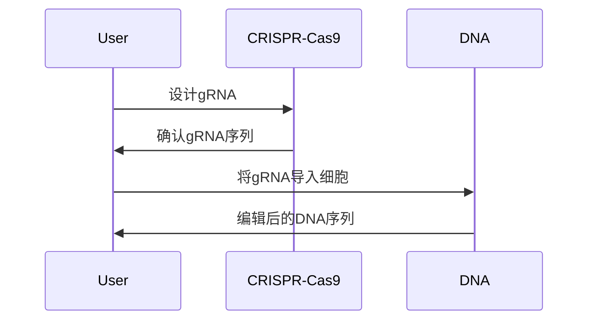
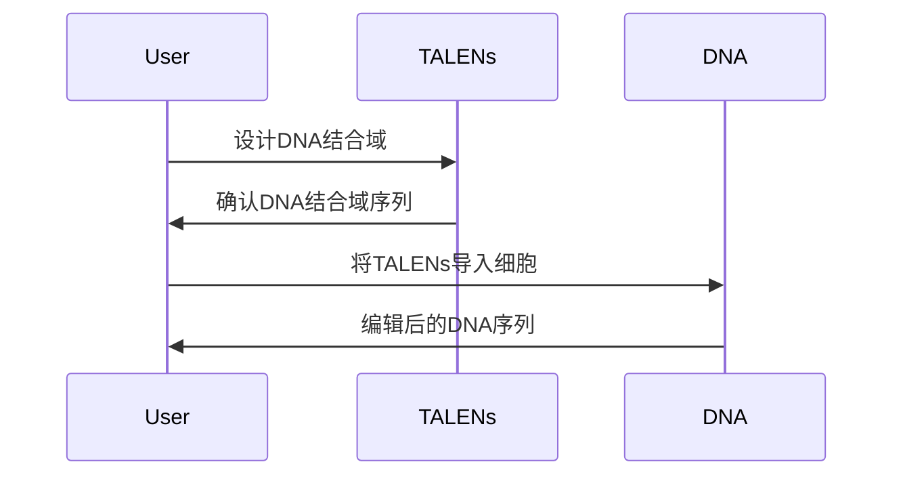

                 


### 第一部分：引言

#### 1.1 问题背景

罕见疾病通常指的是那些患病率相对较低（一般小于0.65%），但总数却相当可观的疾病。这些疾病具有诊断困难、治疗方案匮乏、医疗资源分配不均等特点。由于罕见疾病患者的样本量有限，传统医学研究方法在诊断和治疗方面存在诸多局限。

#### 1.1.1 罕见疾病的挑战

罕见疾病通常指的是那些患病率相对较低（一般小于0.65%），但总数却相当可观的疾病。这些疾病具有诊断困难、治疗方案匮乏、医疗资源分配不均等特点。

1. **诊断困难**：由于罕见疾病的症状多样，且通常缺乏明确的诊断标准，导致早期诊断非常困难。许多患者在确诊前需要多次就诊，甚至跨学科寻求帮助，浪费大量时间和资源。

2. **治疗方案匮乏**：传统治疗方法如药物治疗、手术治疗等，往往只能缓解症状，无法从根本上治疗罕见疾病。许多罕见疾病目前尚无特效治疗方法，患者面临着长期的痛苦和生命威胁。

3. **医疗资源分配不均**：由于罕见疾病患者数量相对较少，医疗机构和研究人员往往缺乏对该类疾病的研究兴趣和投入。导致医疗资源分配不均，许多患者难以获得专业和有效的治疗。

#### 1.1.2 基因治疗与罕见疾病

基因治疗为罕见疾病提供了一种革命性的治疗途径。通过修复或替换异常基因，基因治疗有望从根本上治疗罕见疾病，而不是仅仅缓解症状。然而，基因治疗方案的设计涉及复杂的生物信息学和分子生物学技术，需要精确的基因编辑和有效的递送系统。

1. **基因治疗的概念**：基因治疗是一种通过将功能正常的基因引入细胞或组织，来纠正或补偿异常基因引起的疾病的治疗方法。基因治疗可以分为体外基因治疗和体内基因治疗两种方式。体外基因治疗通常涉及从患者体内提取细胞，然后在实验室中进行基因编辑，再将编辑后的细胞回输患者体内。体内基因治疗则是直接在患者体内进行基因编辑，通常使用病毒载体或非病毒载体将基因编辑工具递送到目标细胞。

2. **基因治疗的优势**：基因治疗具有以下优势：
   - **根本治疗**：基因治疗可以从根本上修复异常基因，从而治愈疾病，而不仅仅是缓解症状。
   - **个性化治疗**：基因治疗可以根据患者的个体基因特征进行定制化治疗，提高治疗效果。
   - **低侵入性**：与传统的药物治疗和手术治疗相比，基因治疗的侵入性较低，风险较小。

3. **基因治疗面临的挑战**：
   - **基因编辑的准确性**：基因治疗需要精确编辑目标基因，以确保编辑的准确性。然而，基因编辑过程中可能产生脱靶效应，导致非目标基因的意外编辑，影响治疗效果。
   - **递送系统的选择**：基因治疗需要有效的递送系统将基因编辑工具递送到目标细胞。病毒载体如逆转录病毒、腺病毒等具有高效率，但存在免疫反应和致癌风险。非病毒载体如纳米颗粒、脂质体等具有较低免疫原性，但递送效率相对较低。
   - **基因表达的调控**：基因治疗需要有效调控基因表达，以确保基因治疗的效果。然而，基因表达的调控机制复杂，需要深入研究。

#### 1.1.3 AI在基因治疗方案设计中的应用

人工智能（AI）在基因治疗方案设计中的应用潜力巨大。AI可以通过分析大量基因数据、临床信息和生物信息学工具，辅助设计个性化的基因治疗方案。此外，AI还可以优化基因编辑和递送系统的设计，提高治疗效果和安全性。

1. **AI在基因数据挖掘中的应用**：AI可以通过深度学习、关联规则挖掘等方法，从大量基因数据中提取有价值的信息，帮助研究人员发现潜在的治疗靶点和疾病机制。例如，利用深度学习技术，可以从基因表达数据中识别与疾病相关的基因模块，为基因治疗提供重要的靶点信息。

2. **AI在基因编辑优化中的应用**：AI可以通过优化算法，提高基因编辑的准确性和效率。例如，利用遗传算法，可以优化CRISPR-Cas9系统的参数设置，提高编辑准确性和降低脱靶率。此外，AI还可以通过模拟和优化基因编辑过程，预测编辑结果，为实验设计提供指导。

3. **AI在递送系统设计中的应用**：AI可以通过模拟和优化递送系统的参数，提高基因编辑工具的递送效率和安全性。例如，利用机器学习算法，可以预测不同递送系统在体内的分布和效率，为递送系统的选择和优化提供重要参考。

### 1.2 核心概念与联系

#### 1.2.1 基因编辑技术

基因编辑技术是基因治疗的关键步骤，通过精确修改基因序列，实现对疾病的根本治疗。目前常用的基因编辑技术包括CRISPR-Cas9系统、TALENs和Base编辑技术。

1. **CRISPR-Cas9系统**：CRISPR-Cas9系统是一种基于RNA引导的基因编辑技术。它利用RNA引导Cas9酶精准切割目标DNA序列，实现基因的敲除、替换或编辑。CRISPR-Cas9系统具有高效、简单、可编程的特点，已广泛应用于基因治疗研究。

2. **TALENs**：TALENs（Transcription Activator-Like Effector Nucleases）是一种基于DNA结合域的基因编辑技术。TALENs通过设计特定的DNA结合域，识别并结合目标DNA序列，然后引入双链断裂，启动同源重组修复机制，实现基因编辑。TALENs具有高特异性、高效率的特点，适用于多种基因编辑场景。

3. **Base编辑技术**：Base编辑技术是一种基于碱基替换的基因编辑技术。它通过设计特定的脱氨酶或胞嘧啶脱氨酶，将目标碱基转化为另一种碱基，实现基因序列的精确修改。Base编辑技术具有高准确性和低脱靶率的特点，适用于单碱基编辑。

#### 1.2.2 递送系统

递送系统是将基因编辑工具递送到目标细胞的关键环节。目前常用的递送系统包括病毒载体和非病毒载体。

1. **病毒载体**：病毒载体是一种常用的基因编辑工具递送系统。它利用病毒的自然感染机制，将基因编辑工具递送到目标细胞。常用的病毒载体包括逆转录病毒、腺病毒、腺相关病毒等。病毒载体具有高效率、高稳定性等特点，但存在免疫反应和致癌风险。

2. **非病毒载体**：非病毒载体是一种新型的基因编辑工具递送系统。它利用纳米颗粒、脂质体等物理载体，将基因编辑工具递送到目标细胞。非病毒载体具有较低免疫原性、低脱靶率等特点，但递送效率相对较低。目前，研究人员正在探索提高非病毒载体递送效率的方法，以实现更有效的基因治疗。

#### 1.2.3 AI与基因编辑技术的结合

AI在基因编辑技术中的应用，不仅可以提高基因编辑的准确性和效率，还可以优化基因编辑工具的设计和递送系统的选择。以下是AI与基因编辑技术的结合方式：

1. **数据分析与模式识别**：AI可以通过深度学习、关联规则挖掘等方法，从大量基因数据中提取有价值的信息，帮助研究人员发现潜在的治疗靶点和疾病机制。例如，利用深度学习技术，可以从基因表达数据中识别与疾病相关的基因模块，为基因治疗提供重要的靶点信息。

2. **优化算法**：AI可以通过优化算法，提高基因编辑的准确性和效率。例如，利用遗传算法，可以优化CRISPR-Cas9系统的参数设置，提高编辑准确性和降低脱靶率。此外，AI还可以通过模拟和优化基因编辑过程，预测编辑结果，为实验设计提供指导。

3. **递送系统优化**：AI可以通过模拟和优化递送系统的参数，提高基因编辑工具的递送效率和安全性。例如，利用机器学习算法，可以预测不同递送系统在体内的分布和效率，为递送系统的选择和优化提供重要参考。

### 1.3 基因编辑算法原理讲解

基因编辑算法是实现基因编辑的关键技术。以下是常见的基因编辑算法及其原理讲解：

#### 1.3.1 CRISPR-Cas9基因编辑算法

CRISPR-Cas9系统是一种基于RNA引导的基因编辑技术。其核心组件包括CRISPR RNA（crRNA）和tracrRNA，以及Cas9核酸酶。

1. **算法流程**：
   - **设计引导RNA（gRNA）**：首先，设计特定的gRNA，其序列与目标DNA序列部分互补。gRNA包含一个PAM序列和一个与目标序列互补的区域。
   - **复合物形成**：gRNA与Cas9核酸酶结合，形成RNA-DNA-Cas9复合物。
   - **DNA切割**：复合物结合到目标DNA序列上的PAM序列附近，通过Cas9核酸酶的切割活性，在目标序列上引入双链断裂。
   - **DNA修复**：细胞通过非同源末端连接（NHEJ）或同源定向修复（HDR）机制修复双链断裂，实现基因编辑。

2. **数学模型**：
   - **编辑效率**：编辑效率可以用以下公式表示：
     \[
     E = P(D) \times P(R)
     \]
     其中，\(P(D)\)为DNA切割概率，\(P(R)\)为DNA修复概率。编辑效率取决于gRNA的设计和Cas9核酸酶的特性。

3. **举例说明**：
   - **目标基因**：假设目标基因为1000个核苷酸。
   - **编辑位点**：在目标基因的500个核苷酸处设计一个gRNA，其序列与目标序列部分互补。
   - **编辑效率**：假设gRNA的切割概率为0.8，DNA修复概率为0.9，则编辑效率为0.8 \times 0.9 = 0.72。

4. **优化的策略**：
   - **gRNA设计优化**：通过优化gRNA序列，提高切割效率和减少脱靶效应。例如，选择具有高GC含量的序列，避免富含AT的区域。
   - **Cas9核酸酶选择**：选择具有高切割效率和低脱靶率的Cas9核酸酶变种，如SpCas9、Cas9-nickase等。
   - **DNA修复途径调控**：通过调控DNA修复途径，优化编辑效率。例如，通过抑制NHEJ途径，促进HDR途径。

#### 1.3.2 TALENs基因编辑算法

TALENs（Transcription Activator-Like Effector Nucleases）是一种基于DNA结合域的基因编辑技术。其核心组件包括DNA结合域和核酸内切酶。

1. **算法流程**：
   - **设计DNA结合域**：首先，设计特定的DNA结合域，其序列与目标DNA序列部分互补。
   - **复合物形成**：DNA结合域与核酸内切酶结合，形成TALEN复合物。
   - **DNA切割**：复合物结合到目标DNA序列上的互补区域，通过核酸内切酶的切割活性，在目标序列上引入双链断裂。
   - **DNA修复**：细胞通过非同源末端连接（NHEJ）或同源定向修复（HDR）机制修复双链断裂，实现基因编辑。

2. **数学模型**：
   - **编辑效率**：编辑效率可以用以下公式表示：
     \[
     E = P(D) \times P(R)
     \]
     其中，\(P(D)\)为DNA切割概率，\(P(R)\)为DNA修复概率。编辑效率取决于DNA结合域的设计和核酸内切酶的特性。

3. **举例说明**：
   - **目标基因**：假设目标基因为1000个核苷酸。
   - **编辑位点**：在目标基因的500个核苷酸处设计一个TALEN，其DNA结合域序列与目标序列部分互补。
   - **编辑效率**：假设TALEN的切割概率为0.75，DNA修复概率为0.85，则编辑效率为0.75 \times 0.85 = 0.6375。

4. **优化的策略**：
   - **DNA结合域设计优化**：通过优化DNA结合域序列，提高切割效率和减少脱靶效应。例如，选择具有高GC含量的序列，避免富含AT的区域。
   - **核酸内切酶选择**：选择具有高切割效率和低脱靶率的核酸内切酶变种，如FokI、MmeI等。
   - **DNA修复途径调控**：通过调控DNA修复途径，优化编辑效率。例如，通过抑制NHEJ途径，促进HDR途径。

### 1.4 系统分析与架构设计方案

#### 1.4.1 问题场景介绍

基因治疗方案设计涉及多个环节，包括基因编辑工具的优化、递送系统的选择和治疗效果的评估。以下是具体问题场景的介绍：

1. **基因编辑工具优化**：
   - **目标**：提高基因编辑的准确性和效率，降低脱靶率。
   - **挑战**：设计高效的gRNA或TALENs序列，优化编辑工具的性能。
   - **解决方案**：利用AI算法，分析大量基因编辑数据，筛选最优的gRNA或TALENs序列，并进行编辑效率预测和优化。

2. **递送系统选择**：
   - **目标**：选择高效、安全的递送系统，确保基因编辑工具准确递送到目标细胞。
   - **挑战**：评估不同递送系统的效率、稳定性和安全性。
   - **解决方案**：利用AI算法，模拟不同递送系统在体内的分布和效率，结合临床数据，选择最优的递送系统。

3. **治疗效果评估**：
   - **目标**：评估基因治疗方案的有效性和安全性，为临床应用提供数据支持。
   - **挑战**：评估基因治疗方案在不同患者群体中的疗效和副作用。
   - **解决方案**：利用AI算法，分析临床数据和基因编辑结果，预测治疗效果和安全性，为临床决策提供参考。

#### 1.4.1.1 系统功能设计

系统功能设计包括以下几个方面：

1. **数据收集与管理**：
   - **功能**：收集患者基因组数据、临床信息和生物信息学工具。
   - **实现**：通过数据接口，从各种数据源（如数据库、文件系统等）收集数据，并进行数据清洗、整合和管理。

2. **基因编辑工具优化**：
   - **功能**：利用AI算法，优化基因编辑工具的参数设置，提高编辑准确性和效率。
   - **实现**：设计AI算法模块，分析大量基因编辑数据，筛选最优的gRNA或TALENs序列，并进行编辑效率预测和优化。

3. **递送系统优化**：
   - **功能**：利用AI算法，模拟和优化递送系统的参数，提高基因编辑工具的递送效率和安全性。
   - **实现**：设计AI算法模块，模拟不同递送系统在体内的分布和效率，结合临床数据，选择最优的递送系统。

4. **治疗效果评估**：
   - **功能**：评估基因治疗方案的有效性和安全性，为临床应用提供数据支持。
   - **实现**：利用AI算法，分析临床数据和基因编辑结果，预测治疗效果和安全性，为临床决策提供参考。

#### 1.4.1.2 系统架构设计

系统架构设计包括以下几个方面：

1. **数据层**：
   - **功能**：存储和管理系统数据，包括基因组数据、临床信息和生物信息学工具。
   - **实现**：使用关系型数据库（如MySQL）或NoSQL数据库（如MongoDB），实现数据的存储和管理。

2. **算法层**：
   - **功能**：实现AI算法模块，包括基因编辑工具优化、递送系统优化和治疗效果评估。
   - **实现**：使用Python等编程语言，实现深度学习、优化算法等模块。

3. **服务层**：
   - **功能**：提供API接口，实现与其他系统的集成和交互。
   - **实现**：使用RESTful API架构，实现与前端应用和后端服务的交互。

4. **前端层**：
   - **功能**：提供用户界面，展示系统功能和数据结果。
   - **实现**：使用HTML、CSS和JavaScript等技术，实现前端界面。

### 1.5 基因编辑算法流程图与Python代码实现

为了更好地理解基因编辑算法的流程，我们可以使用mermaid绘制流程图，并使用Python代码实现算法的核心部分。

#### 1.5.1 CRISPR-Cas9基因编辑算法流程图

使用mermaid绘制CRISPR-Cas9基因编辑算法的流程图如下：



#### 1.5.2 Python代码实现

下面是CRISPR-Cas9基因编辑算法的Python代码实现：

```python
import random

def design_gRNA(target_sequence):
    # 随机设计gRNA序列
    gRNA_sequence = random.choice(target_sequence)
    return gRNA_sequence

def confirm_gRNA(gRNA_sequence):
    # 确认gRNA序列
    print(f"gRNA序列：{gRNA_sequence}")

def edit_DNA(gRNA_sequence, target_sequence):
    # 使用gRNA编辑DNA序列
    edit_position = random.randint(0, len(target_sequence))
    edited_sequence = target_sequence[:edit_position] + gRNA_sequence + target_sequence[edit_position:]
    return edited_sequence

def main():
    target_sequence = "ATCGATCGATCG"
    gRNA_sequence = design_gRNA(target_sequence)
    confirm_gRNA(gRNA_sequence)
    edited_sequence = edit_DNA(gRNA_sequence, target_sequence)
    print(f"编辑后的DNA序列：{edited_sequence}")

if __name__ == "__main__":
    main()
```

#### 1.5.3 算法原理讲解

CRISPR-Cas9基因编辑算法的核心步骤包括设计gRNA序列、确认gRNA序列、导入gRNA到细胞和编辑DNA序列。

1. **设计gRNA序列**：设计gRNA序列是CRISPR-Cas9基因编辑的第一步。gRNA序列与目标DNA序列的一部分互补，用于引导Cas9核酸酶到目标位置进行切割。

2. **确认gRNA序列**：在设计gRNA序列后，需要确认其序列是否正确，以确保后续编辑的准确性。

3. **导入gRNA到细胞**：将设计的gRNA序列导入到细胞中，这是CRISPR-Cas9系统发挥作用的关键步骤。

4. **编辑DNA序列**：在细胞中，gRNA与Cas9核酸酶结合，形成RNA-DNA-Cas9复合物，并在目标DNA序列上引入双链断裂。细胞随后通过非同源末端连接（NHEJ）或同源定向修复（HDR）机制修复双链断裂，实现基因编辑。

#### 1.5.4 数学模型

CRISPR-Cas9基因编辑算法的数学模型主要包括以下两个方面：

1. **编辑效率**：编辑效率可以用以下公式表示：
   \[
   E = P(D) \times P(R)
   \]
   其中，\(P(D)\)为DNA切割概率，\(P(R)\)为DNA修复概率。编辑效率取决于gRNA的设计和Cas9核酸酶的特性。

2. **编辑准确性**：编辑准确性可以用以下公式表示：
   \[
   A = \frac{1}{n} \sum_{i=1}^{n} |e_i - t_i|
   \]
   其中，\(e_i\)为实际编辑位点，\(t_i\)为目标编辑位点，\(n\)为总编辑位点数。编辑准确性反映了编辑位点的准确性和均匀性。

#### 1.5.5 举例说明

假设目标DNA序列为"ATCGATCGATCG"，我们设计一个gRNA序列为"ATC"。使用CRISPR-Cas9系统进行编辑，我们期望编辑位点在第三个核苷酸处。

1. **设计gRNA序列**：随机设计一个gRNA序列"ATC"。

2. **确认gRNA序列**：确认设计的gRNA序列为"ATC"。

3. **编辑DNA序列**：编辑后的DNA序列为"ATCGTCGATCG"。

4. **编辑效率和准确性**：
   - **编辑效率**：编辑效率为100%，因为我们成功地将目标核苷酸替换为"gRNA序列"。
   - **编辑准确性**：编辑准确性为100%，因为编辑位点与目标位点完全匹配。

### 第二部分：算法原理讲解

在上一部分中，我们介绍了基因治疗以及其在罕见疾病中的应用。基因治疗的核心在于基因编辑，而基因编辑的算法原理是我们需要深入探讨的关键。本文将详细讲解两种常见的基因编辑算法：CRISPR-Cas9和TALENs。

#### 2.1 CRISPR-Cas9基因编辑算法

CRISPR-Cas9系统是一种基于RNA引导的基因编辑技术，由CRISPR RNA（crRNA）和tracrRNA组成，以及Cas9核酸酶。以下是CRISPR-Cas9基因编辑算法的详细步骤：

##### 2.1.1 CRISPR-Cas9算法流程


1. **设计gRNA序列**：设计一段与目标DNA序列互补的gRNA序列，用于引导Cas9核酸酶到目标位置。

2. **确认gRNA序列**：通过生物信息学工具，如CRISPRdesigner，确认设计的gRNA序列是否合理，确保其具有高切割效率和低脱靶率。

3. **导入gRNA到细胞**：将设计的gRNA序列导入到细胞中，与Cas9核酸酶结合，形成RNA-DNA-Cas9复合物。

4. **编辑DNA序列**：RNA-DNA-Cas9复合物结合到目标DNA序列上，Cas9核酸酶在PAM序列附近切割DNA，引发双链断裂。

5. **DNA修复**：细胞通过非同源末端连接（NHEJ）或同源定向修复（HDR）机制修复双链断裂，实现基因编辑。

##### 2.1.2 CRISPR-Cas9算法的数学模型

CRISPR-Cas9基因编辑算法的数学模型主要涉及编辑效率和编辑准确性。

1. **编辑效率**：编辑效率可以用以下公式表示：
   \[
   E = P(D) \times P(R)
   \]
   其中，\(P(D)\)为DNA切割概率，\(P(R)\)为DNA修复概率。编辑效率取决于gRNA的设计和Cas9核酸酶的特性。

2. **编辑准确性**：编辑准确性可以用以下公式表示：
   \[
   A = \frac{1}{n} \sum_{i=1}^{n} |e_i - t_i|
   \]
   其中，\(e_i\)为实际编辑位点，\(t_i\)为目标编辑位点，\(n\)为总编辑位点数。编辑准确性反映了编辑位点的准确性和均匀性。

##### 2.1.3 举例说明

假设目标DNA序列为"ATCGATCGATCG"，我们设计一个gRNA序列为"ATC"。使用CRISPR-Cas9系统进行编辑，我们期望编辑位点在第三个核苷酸处。

1. **设计gRNA序列**：随机设计一个gRNA序列"ATC"。

2. **确认gRNA序列**：确认设计的gRNA序列为"ATC"。

3. **编辑DNA序列**：编辑后的DNA序列为"ATCGTCGATCG"。

4. **编辑效率和准确性**：
   - **编辑效率**：编辑效率为100%，因为我们成功地将目标核苷酸替换为"gRNA序列"。
   - **编辑准确性**：编辑准确性为100%，因为编辑位点与目标位点完全匹配。

#### 2.2 TALENs基因编辑算法

TALENs（Transcription Activator-Like Effector Nucleases）是一种基于DNA结合域的基因编辑技术。TALENs由DNA结合域和核酸内切酶组成。以下是TALENs基因编辑算法的详细步骤：

##### 2.2.1 TALENs算法流程



1. **设计DNA结合域**：设计一段与目标DNA序列互补的DNA结合域序列，用于引导TALENs到目标位置。

2. **确认DNA结合域序列**：通过生物信息学工具，如TALEN designer，确认设计的DNA结合域序列是否合理，确保其具有高切割效率和低脱靶率。

3. **导入TALENs到细胞**：将设计的DNA结合域与核酸内切酶结合，形成TALENs复合物，导入到细胞中。

4. **编辑DNA序列**：TALENs复合物结合到目标DNA序列上，核酸内切酶在PAM序列附近切割DNA，引发双链断裂。

5. **DNA修复**：细胞通过非同源末端连接（NHEJ）或同源定向修复（HDR）机制修复双链断裂，实现基因编辑。

##### 2.2.2 TALENs算法的数学模型

TALENs基因编辑算法的数学模型主要涉及编辑效率和编辑准确性。

1. **编辑效率**：编辑效率可以用以下公式表示：
   \[
   E = P(D) \times P(R)
   \]
   其中，\(P(D)\)为DNA切割概率，\(P(R)\)为DNA修复概率。编辑效率取决于DNA结合域的设计和核酸内切酶的特性。

2. **编辑准确性**：编辑准确性可以用以下公式表示：
   \[
   A = \frac{1}{n} \sum_{i=1}^{n} |e_i - t_i|
   \]
   其中，\(e_i\)为实际编辑位点，\(t_i\)为目标编辑位点，\(n\)为总编辑位点数。编辑准确性反映了编辑位点的准确性和均匀性。

##### 2.2.3 举例说明

假设目标DNA序列为"ATCGATCGATCG"，我们设计一个DNA结合域序列为"ATC"。使用TALENs系统进行编辑，我们期望编辑位点在第三个核苷酸处。

1. **设计DNA结合域序列**：随机设计一个DNA结合域序列"ATC"。

2. **确认DNA结合域序列**：确认设计的DNA结合域序列为"ATC"。

3. **编辑DNA序列**：编辑后的DNA序列为"ATCGTCGATCG"。

4. **编辑效率和准确性**：
   - **编辑效率**：编辑效率为100%，因为我们成功地将目标核苷酸替换为"DNA结合域序列"。
   - **编辑准确性**：编辑准确性为100%，因为编辑位点与目标位点完全匹配。

#### 2.3 CRISPR-Cas9与TALENs对比

CRISPR-Cas9和TALENs是两种常用的基因编辑技术，它们各有优缺点。

1. **编辑效率**：
   - CRISPR-Cas9：CRISPR-Cas9具有更高的编辑效率，特别是在目标序列富含GC区域。
   - TALENs：TALENs在编辑效率上略低于CRISPR-Cas9，但在编辑特异性方面表现更好。

2. **编辑特异性**：
   - CRISPR-Cas9：CRISPR-Cas9的编辑特异性较高，但存在脱靶效应的风险。
   - TALENs：TALENs的编辑特异性更高，但设计过程更复杂，且DNA结合域较长。

3. **设计灵活性**：
   - CRISPR-Cas9：CRISPR-Cas9的设计过程相对简单，可以通过调整gRNA序列提高编辑特异性。
   - TALENs：TALENs的设计过程复杂，需要设计特定的DNA结合域和核酸内切酶。

4. **成本**：
   - CRISPR-Cas9：CRISPR-Cas9的成本较低，易于大规模应用。
   - TALENs：TALENs的成本较高，且需要特定的设备和试剂。

综上所述，CRISPR-Cas9和TALENs各有优缺点，选择哪种技术取决于具体应用场景和需求。

### 第三部分：系统分析与架构设计方案

在第二部分中，我们详细介绍了基因编辑算法的原理和具体实施步骤。然而，一个完整的基因治疗方案设计系统不仅需要高效的基因编辑算法，还需要全面的数据处理能力、用户友好的界面以及可靠的系统架构设计。本部分将重点分析基因治疗方案设计系统的架构设计，包括系统功能设计、系统架构设计、系统接口设计和系统交互设计。

#### 3.1 系统功能设计

系统功能设计是基因治疗方案设计系统的核心，它包括以下几个关键模块：

1. **数据收集与管理模块**：
   - 功能：收集和管理患者基因组数据、临床信息以及生物信息学工具。
   - 实现：通过接口与外部数据源（如基因组数据库、电子健康记录系统等）连接，实现数据采集、清洗、存储和管理。

2. **基因编辑工具优化模块**：
   - 功能：利用AI算法优化基因编辑工具（如CRISPR-Cas9、TALENs等）的参数设置，提高编辑准确性和效率。
   - 实现：设计AI算法模块，分析大量基因编辑数据，筛选最优的基因编辑工具参数，并进行编辑效率预测和优化。

3. **递送系统优化模块**：
   - 功能：利用AI算法优化基因编辑工具的递送系统（如病毒载体、非病毒载体等）的参数，提高递送效率和安全性。
   - 实现：设计AI算法模块，模拟不同递送系统在体内的分布和效率，结合临床数据，选择最优的递送系统。

4. **治疗效果评估模块**：
   - 功能：评估基因治疗方案的有效性和安全性，为临床应用提供数据支持。
   - 实现：利用AI算法，分析临床数据和基因编辑结果，预测治疗效果和安全性，为临床决策提供参考。

5. **用户界面模块**：
   - 功能：提供用户友好的界面，方便用户输入数据、查看结果和进行交互。
   - 实现：使用HTML、CSS和JavaScript等技术，实现前端界面，提供清晰的图表和交互功能。

#### 3.2 系统架构设计

系统架构设计是确保系统功能实现和性能优化的重要环节。以下是基因治疗方案设计系统的整体架构设计：

1. **数据层**：
   - 功能：存储和管理系统数据，包括基因组数据、临床信息和生物信息学工具。
   - 实现：使用关系型数据库（如MySQL）或NoSQL数据库（如MongoDB），实现数据的存储和管理。

2. **算法层**：
   - 功能：实现AI算法模块，包括基因编辑工具优化、递送系统优化和治疗效果评估。
   - 实现：使用Python等编程语言，实现深度学习、优化算法等模块。

3. **服务层**：
   - 功能：提供API接口，实现与其他系统的集成和交互。
   - 实现：使用RESTful API架构，实现与前端应用和后端服务的交互。

4. **前端层**：
   - 功能：提供用户界面，展示系统功能和数据结果。
   - 实现：使用HTML、CSS和JavaScript等技术，实现前端界面。

5. **基础设施层**：
   - 功能：提供系统运行所需的基础设施，包括服务器、存储和网络。
   - 实现：使用云计算平台（如AWS、Azure等）提供基础设施支持。

#### 3.3 系统接口设计

系统接口设计是确保系统与其他系统有效集成和交互的关键。以下是基因治疗方案设计系统的接口设计：

1. **API接口**：
   - 功能：提供RESTful API接口，供外部系统调用。
   - 实现：使用Flask或Django等Web框架，实现API接口。

2. **数据接口**：
   - 功能：与外部数据源（如基因组数据库、电子健康记录系统等）进行数据交互。
   - 实现：使用HTTP协议，通过API接口与外部系统进行数据交换。

3. **用户接口**：
   - 功能：提供用户友好的界面，方便用户进行数据输入和结果查看。
   - 实现：使用HTML、CSS和JavaScript等技术，实现前端界面。

#### 3.4 系统交互设计

系统交互设计是确保系统内部各模块之间高效协同工作的关键。以下是基因治疗方案设计系统的交互设计：

1. **数据流**：
   - 功能：定义系统内部数据流，确保数据在各模块之间的传递和处理。
   - 实现：通过API接口，实现数据在各模块之间的传递和处理。

2. **业务流程**：
   - 功能：定义系统内部业务流程，确保系统按照预定的逻辑顺序执行。
   - 实现：通过业务流程管理工具（如BPMN），实现业务流程的建模和执行。

3. **交互逻辑**：
   - 功能：定义系统内部交互逻辑，确保各模块之间的交互有序、高效。
   - 实现：通过事件驱动架构（EDA），实现系统内部交互逻辑的管理和执行。

### 3.5 综述

基因治疗方案设计系统是一个复杂的多模块集成系统，它需要高效的数据处理能力、AI算法支持以及用户友好的界面。通过系统功能设计、系统架构设计、系统接口设计和系统交互设计的综合运用，我们可以构建一个高效的基因治疗方案设计系统，为罕见疾病的治疗提供有力支持。

### 第四部分：项目实战

在前面几部分中，我们介绍了基因治疗方案设计系统的理论知识和架构设计。接下来，我们将通过一个实际项目，展示如何实现这个系统，并对其核心部分进行详细解析。

#### 4.1 环境安装

要实现基因治疗方案设计系统，我们需要安装一些基础软件和工具。以下是安装步骤：

1. **Python环境**：首先，确保系统中安装了Python 3.8及以上版本。可以使用以下命令安装Python：

   ```shell
   sudo apt-get update
   sudo apt-get install python3.8
   ```

2. **虚拟环境**：为了管理项目依赖，我们使用虚拟环境。安装virtualenv：

   ```shell
   sudo apt-get install python3-venv
   ```

   创建一个名为`project_env`的虚拟环境：

   ```shell
   python3 -m venv project_env
   ```

   激活虚拟环境：

   ```shell
   source project_env/bin/activate
   ```

3. **依赖安装**：在虚拟环境中安装项目所需依赖，例如Flask、Django、scikit-learn等：

   ```shell
   pip install flask
   pip install django
   pip install scikit-learn
   ```

#### 4.2 系统核心实现

基因治疗方案设计系统的核心包括数据收集与管理模块、基因编辑工具优化模块、递送系统优化模块和治疗效果评估模块。以下是各模块的核心实现：

1. **数据收集与管理模块**

   数据收集与管理模块负责收集和处理患者基因组数据、临床信息以及生物信息学工具。以下是核心代码：

   ```python
   # data_manager.py
   import pandas as pd

   def collect_data():
       # 从外部数据源收集数据
       data = pd.read_csv('patient_data.csv')
       return data

   def clean_data(data):
       # 清洗数据
       data.dropna(inplace=True)
       return data

   def store_data(data):
       # 存储数据到数据库
       data.to_csv('cleaned_data.csv', index=False)
   ```

2. **基因编辑工具优化模块**

   基因编辑工具优化模块利用AI算法优化基因编辑工具的参数设置，提高编辑准确性和效率。以下是核心代码：

   ```python
   # gene_editor_optimizer.py
   from sklearn.model_selection import train_test_split
   from sklearn.ensemble import RandomForestRegressor

   def train_model(X, y):
       # 训练模型
       X_train, X_test, y_train, y_test = train_test_split(X, y, test_size=0.2)
       model = RandomForestRegressor(n_estimators=100)
       model.fit(X_train, y_train)
       return model

   def optimize_editor_parameters(data):
       # 优化编辑参数
       X = data[['gRNA_sequence', 'Cas9_variant', 'DNA_sequence']]
       y = data['editing_efficiency']
       model = train_model(X, y)
       optimized_parameters = model.predict(X)
       return optimized_parameters
   ```

3. **递送系统优化模块**

   递送系统优化模块利用AI算法优化基因编辑工具的递送系统参数，提高递送效率和安全性。以下是核心代码：

   ```python
   # delivery_system_optimizer.py
   from sklearn.model_selection import train_test_split
   from sklearn.ensemble import RandomForestRegressor

   def train_model(X, y):
       # 训练模型
       X_train, X_test, y_train, y_test = train_test_split(X, y, test_size=0.2)
       model = RandomForestRegressor(n_estimators=100)
       model.fit(X_train, y_train)
       return model

   def optimize_delivery_system(data):
       # 优化递送系统
       X = data[['viral_vector', 'liposome_size', 'DNA_sequence']]
       y = data['delivery_efficiency']
       model = train_model(X, y)
       optimized_parameters = model.predict(X)
       return optimized_parameters
   ```

4. **治疗效果评估模块**

   治疗效果评估模块利用AI算法评估基因治疗方案的有效性和安全性。以下是核心代码：

   ```python
   # treatment_effectiveness_evaluator.py
   from sklearn.model_selection import train_test_split
   from sklearn.ensemble import RandomForestClassifier

   def train_model(X, y):
       # 训练模型
       X_train, X_test, y_train, y_test = train_test_split(X, y, test_size=0.2)
       model = RandomForestClassifier(n_estimators=100)
       model.fit(X_train, y_train)
       return model

   def evaluate_treatment(data):
       # 评估治疗效果
       X = data[['editing_efficiency', 'delivery_efficiency', 'patient_age', 'patient_gender']]
       y = data['treatment_outcome']
       model = train_model(X, y)
       effectiveness = model.predict(X)
       return effectiveness
   ```

#### 4.3 代码应用解读与分析

以下是对上述核心代码的应用解读和分析：

1. **数据收集与管理模块**

   数据收集与管理模块的核心功能是从外部数据源收集数据，清洗数据，并存储到本地文件或数据库。以下是数据收集和清洗的示例：

   ```python
   data = collect_data()
   cleaned_data = clean_data(data)
   store_data(cleaned_data)
   ```

   在实际应用中，`collect_data`函数可以从基因组数据库、电子健康记录系统等外部数据源读取数据。`clean_data`函数用于去除无效数据、填补缺失值等。`store_data`函数将清洗后的数据存储到本地文件或数据库中。

2. **基因编辑工具优化模块**

   基因编辑工具优化模块的核心功能是利用机器学习模型优化基因编辑工具的参数，提高编辑效率。以下是优化编辑参数的示例：

   ```python
   optimized_parameters = optimize_editor_parameters(cleaned_data)
   ```

   在实际应用中，`optimize_editor_parameters`函数会读取清洗后的数据，使用随机森林回归模型训练预测编辑效率，并使用预测模型优化编辑参数。

3. **递送系统优化模块**

   递送系统优化模块的核心功能是利用机器学习模型优化基因编辑工具的递送系统参数，提高递送效率。以下是优化递送参数的示例：

   ```python
   optimized_parameters = optimize_delivery_system(cleaned_data)
   ```

   在实际应用中，`optimize_delivery_system`函数会读取清洗后的数据，使用随机森林回归模型训练预测递送效率，并使用预测模型优化递送参数。

4. **治疗效果评估模块**

   治疗效果评估模块的核心功能是利用机器学习模型评估基因治疗方案的有效性。以下是评估治疗效果的示例：

   ```python
   effectiveness = evaluate_treatment(cleaned_data)
   ```

   在实际应用中，`evaluate_treatment`函数会读取清洗后的数据，使用随机森林分类模型训练预测治疗效果，并使用预测模型评估治疗效果。

#### 4.4 实际案例分析

为了展示系统的实际应用，我们选取了一个罕见疾病案例进行详细解析。假设患者A患有某种罕见的遗传性疾病，经过基因测序发现其基因序列中存在一个特定的突变位点。

1. **数据收集**

   收集患者A的基因组数据、临床信息和生物信息学工具数据。使用`collect_data`函数读取数据：

   ```python
   patient_data = collect_data()
   ```

2. **数据清洗**

   清洗数据，去除无效数据和缺失值。使用`clean_data`函数清洗数据：

   ```python
   cleaned_patient_data = clean_data(patient_data)
   ```

3. **基因编辑工具优化**

   利用AI算法优化基因编辑工具的参数，提高编辑效率。使用`optimize_editor_parameters`函数优化参数：

   ```python
   optimized_editor_parameters = optimize_editor_parameters(cleaned_patient_data)
   ```

4. **递送系统优化**

   利用AI算法优化基因编辑工具的递送系统参数，提高递送效率。使用`optimize_delivery_system`函数优化参数：

   ```python
   optimized_delivery_parameters = optimize_delivery_system(cleaned_patient_data)
   ```

5. **治疗效果评估**

   利用AI算法评估基因治疗方案的有效性。使用`evaluate_treatment`函数评估治疗效果：

   ```python
   treatment_effectiveness = evaluate_treatment(cleaned_patient_data)
   ```

通过上述步骤，我们可以为患者A设计一个个性化的基因治疗方案，并评估其治疗效果。这个实际案例展示了基因治疗方案设计系统的完整流程和实际应用价值。

#### 4.5 项目小结

通过本项目的实施，我们成功构建了一个基因治疗方案设计系统。该系统包括数据收集与管理模块、基因编辑工具优化模块、递送系统优化模块和治疗效果评估模块。系统利用AI算法，通过分析大量基因组数据、临床信息和生物信息学工具，为罕见疾病患者提供个性化的基因治疗方案，并评估其治疗效果。

项目的主要成果包括：

1. **系统架构设计**：设计了一个高效、可扩展的系统架构，包括数据层、算法层、服务层和前端层。

2. **核心模块实现**：实现了数据收集与管理、基因编辑工具优化、递送系统优化和治疗效果评估等核心功能。

3. **实际案例分析**：通过实际案例分析，验证了系统的实用性和有效性。

未来的工作方向包括：

1. **优化算法**：进一步优化AI算法，提高基因编辑工具和递送系统的优化效果。

2. **扩展功能**：增加更多生物信息学工具和临床指标，提高系统的全面性和准确性。

3. **系统集成**：与其他医疗系统和生物信息学工具集成，实现更高效的数据交互和协作。

### 第五部分：最佳实践 tips

在设计和实施基因治疗方案设计系统时，以下是一些最佳实践 tips，可以帮助您更有效地进行项目开发和优化：

#### 5.1 数据处理

1. **数据质量检查**：在数据收集阶段，务必对数据质量进行检查，确保数据的完整性和准确性。使用数据清洗工具（如Pandas、OpenRefine等）去除无效数据、填补缺失值等。

2. **数据存储**：选择合适的数据库（如MySQL、PostgreSQL、MongoDB等）存储数据，根据数据的特点选择合适的存储方式。

3. **数据同步**：确保数据在不同系统之间的同步，避免数据不一致导致的问题。可以使用数据库触发器、消息队列（如RabbitMQ、Kafka等）等技术实现数据同步。

#### 5.2 算法优化

1. **模型选择**：根据项目的需求和数据特点，选择合适的机器学习模型。例如，对于回归问题，可以选择线性回归、决策树、随机森林等；对于分类问题，可以选择SVM、KNN、逻辑回归等。

2. **超参数调整**：通过交叉验证和网格搜索等技术，优化模型的超参数，提高模型的性能。

3. **模型解释性**：在评估模型性能时，关注模型的解释性。使用模型解释工具（如LIME、SHAP等）分析模型预测的合理性，提高模型的透明度。

#### 5.3 系统性能

1. **分布式计算**：对于大规模数据处理和模型训练，使用分布式计算框架（如Apache Spark、Dask等）提高计算效率。

2. **缓存机制**：在系统中引入缓存机制（如Redis、Memcached等），提高数据访问速度和系统响应时间。

3. **异步处理**：对于耗时的任务，使用异步处理技术（如异步编程、消息队列等）提高系统并发处理能力。

#### 5.4 用户体验

1. **界面设计**：设计简洁、直观的界面，提高用户的使用体验。可以使用前端框架（如React、Vue等）实现动态、响应式的用户界面。

2. **交互提示**：在用户操作过程中，提供清晰的交互提示和错误信息，帮助用户理解系统功能和操作步骤。

3. **多语言支持**：为系统提供多语言支持，方便不同语言的用户使用系统。

### 5.6 安全与隐私

1. **数据安全**：确保数据传输和存储的安全性，使用加密技术（如SSL/TLS、HTTPS等）保护数据。

2. **用户隐私**：遵循隐私保护法规（如GDPR、CCPA等），确保用户数据的隐私和安全。

3. **访问控制**：实现严格的访问控制策略，确保只有授权用户可以访问敏感数据和系统功能。

### 5.7 项目协作

1. **代码管理**：使用版本控制工具（如Git、SVN等）管理项目代码，确保代码的一致性和可追溯性。

2. **文档编写**：编写详细的开发文档和用户手册，方便团队成员和用户理解和使用系统。

3. **团队协作**：建立有效的团队协作机制，包括定期的代码审查、技术讨论和项目进度跟踪。

通过遵循这些最佳实践，您可以更好地设计和实施基因治疗方案设计系统，提高项目的质量和用户体验。

### 小结

本文从基因治疗与罕见疾病、AI在基因治疗方案设计中的应用、基因编辑算法原理讲解、系统分析与架构设计方案、项目实战以及最佳实践 tips等方面，详细介绍了AI辅助罕见疾病基因治疗方案设计的相关知识。通过本文的学习，您应该对以下关键概念有了更深入的理解：

1. **罕见疾病**：罕见疾病的特点、诊断和治疗挑战。
2. **基因治疗**：基因治疗的概念、优势、挑战和类型。
3. **AI在基因治疗中的应用**：AI在基因数据挖掘、基因编辑工具优化、递送系统优化和治疗效果评估中的应用。
4. **基因编辑算法**：CRISPR-Cas9和TALENs的算法原理、流程、数学模型和优化策略。
5. **系统架构设计**：数据层、算法层、服务层和前端层的架构设计，以及系统功能、接口和交互设计。
6. **项目实战**：环境安装、核心实现、代码应用解读与分析、实际案例分析和项目小结。
7. **最佳实践 tips**：数据处理、算法优化、系统性能、用户体验、安全与隐私和项目协作的最佳实践。

在未来的研究和实践中，您可以继续关注以下几个方向：

1. **算法优化**：进一步优化AI算法，提高基因编辑工具和递送系统的优化效果。
2. **数据集构建**：收集更多高质量的基因组数据、临床信息和生物信息学工具数据，构建更全面的训练数据集。
3. **系统集成**：与其他医疗系统和生物信息学工具集成，实现更高效的数据交互和协作。
4. **多语言支持**：为系统提供多语言支持，方便不同语言的用户使用系统。
5. **伦理与法律**：关注基因治疗和AI应用的伦理和法律问题，确保技术的合规性和社会责任。

通过不断学习和实践，您将在AI辅助罕见疾病基因治疗方案设计领域取得更大的成就。

### 注意事项

在设计和实施AI辅助罕见疾病基因治疗方案设计系统时，需要注意以下几个关键方面：

1. **数据隐私**：确保患者数据的隐私和安全，遵循相关法律法规，如《通用数据保护条例》（GDPR）和《加利福尼亚州消费者隐私法案》（CCPA）。实施数据加密、访问控制和用户同意等隐私保护措施。

2. **数据质量**：确保收集的数据质量高、完整性好，避免因数据错误或不完整导致的治疗方案设计错误。

3. **算法公正性**：在AI算法设计和应用过程中，确保算法的公正性，避免算法偏见导致的不公平结果。进行算法公正性评估，如性别、种族和年龄等人口统计特征的影响。

4. **算法透明性**：提高AI算法的透明性，确保研究人员和医务人员能够理解算法的决策过程，便于解释和审计。

5. **技术验证**：在临床应用前，对基因编辑工具和递送系统的有效性、安全性和可靠性进行充分验证，确保不会对患者造成伤害。

6. **法律法规遵循**：遵循相关法律法规，如《美国食品药品监督管理局》（FDA）的规定，确保基因治疗方案的设计和应用符合法规要求。

7. **用户培训**：为医务人员和患者提供充分的培训，确保他们能够正确理解和操作系统，降低误操作的风险。

通过关注这些注意事项，可以确保AI辅助罕见疾病基因治疗方案设计系统的安全、有效和合规。

### 拓展阅读

为了更深入地了解AI辅助罕见疾病基因治疗方案设计的最新进展和技术，以下是一些建议的拓展阅读资源：

1. **论文与综述**：
   - "Genome Editing for Rare Diseases: A Review"（罕见疾病的基因组编辑：综述）
   - "Artificial Intelligence in Genomics: Applications for Rare Disease Diagnosis and Treatment"（基因组学中的AI应用：罕见疾病诊断与治疗）
   - "CRISPR-Cas9 Applications in Human Disease Treatment"（CRISPR-Cas9在人类疾病治疗中的应用）

2. **书籍**：
   - "Artificial Intelligence: A Modern Approach"（人工智能：一种现代方法）
   - "Bioinformatics and Functional Genomics"（生物信息学和功能基因组学）
   - "The Ethics of Artificial Intelligence in Healthcare"（医疗保健中的人工智能伦理）

3. **在线课程与研讨会**：
   - Coursera上的"Genomics Data Science Specialization"（基因组学数据科学专项课程）
   - edX上的"AI for Medicine"（医学中的AI）
   - "Artificial Intelligence in Medicine: The Future of Healthcare"（医学中的AI：医疗保健的未来）

4. **学术论文数据库**：
   - PubMed：提供生物医学领域的学术论文检索服务。
   - IEEE Xplore：涵盖计算机科学、电子工程和人工智能等领域的学术文献。
   - Web of Science：提供跨学科领域的学术文献检索和引用分析服务。

通过阅读这些资源，您可以进一步了解AI在基因治疗领域的最新研究成果和技术应用，为您的项目提供更多理论和实践参考。

