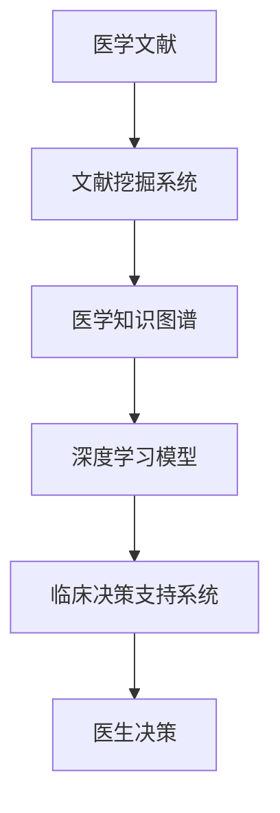
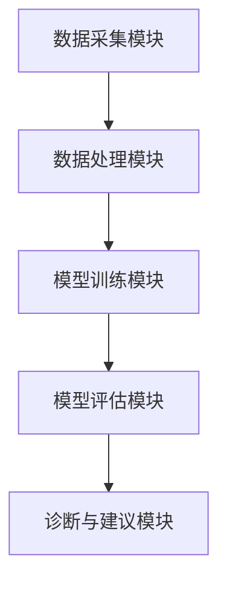

                 

### 文章标题

**《AI辅助罕见疾病治疗方案制定：从文献挖掘到临床决策》**

### 关键词

- AI
- 罕见疾病
- 治疗方案
- 文献挖掘
- 临床决策

### 摘要

本文旨在探讨如何利用人工智能技术辅助罕见疾病的治疗方案制定。我们将首先介绍罕见疾病的背景，包括其定义、发病率以及现有的治疗困境。接着，我们将讨论如何通过文献挖掘获取相关疾病的数据和知识，并利用这些数据构建用于辅助临床决策的AI模型。此外，我们还将深入分析这些模型的工作原理、优缺点以及如何在实际临床中应用。最后，我们将总结全文，展望未来在这一领域的研究方向和应用前景。通过这一步步的分析，我们希望为读者提供一个全面而深刻的理解，从而更好地利用AI技术改善罕见疾病的治疗效果。

---

**背景介绍**

罕见疾病，顾名思义，是指那些发病率较低且临床表现复杂多样的疾病。根据世界卫生组织（WHO）的定义，罕见疾病是指影响人口中少于1/2000人的疾病或病症。尽管这些疾病的患者人数较少，但全球范围内罕见疾病的总负担却非常沉重。据统计，全球有3.5亿至4亿的罕见疾病患者，这一数字几乎占到全球总人口的5%。在中国，罕见疾病的发病率同样不容小觑，估计有上千万的罕见病患者。

罕见疾病的定义不仅限于其低发病率，还包括其病因复杂、临床表现多样和缺乏有效的治疗手段等特点。许多罕见疾病是由基因突变引起的，这些突变可能导致蛋白质结构异常，进而引发一系列病理变化。由于病因复杂，罕见疾病的诊断往往需要多种检查和测试，如基因检测、影像学检查等，而且这些检查结果常常相互矛盾，增加了诊断的难度。此外，由于罕见疾病的临床表现多样，不同患者可能表现出完全不同的症状，这使得治疗方案的制定更加复杂。

现有的治疗手段通常局限于对症治疗，缺乏针对病因的根本性治疗方法。许多罕见疾病至今没有有效的治疗方法，只能通过缓解症状来提高患者的生活质量。这不仅给患者及其家庭带来了巨大的经济负担，也严重影响了患者的心理健康和生活质量。

因此，寻求新的治疗方法和手段成为解决罕见疾病困境的关键。人工智能（AI）技术的快速发展为这一领域提供了新的可能性。AI技术，特别是机器学习和深度学习，可以在大量医疗数据中挖掘出有用的信息，帮助医生做出更准确的诊断和制定更有效的治疗方案。通过AI辅助罕见疾病的治疗方案制定，我们不仅可以提高诊断和治疗的效率，还可以降低医疗成本，改善患者的预后。

---

**核心概念与联系**

在探讨AI辅助罕见疾病治疗方案制定的过程中，我们需要明确几个核心概念，并理解它们之间的联系。以下是对这些核心概念的详细说明：

**1. 人工智能（AI）**：
人工智能是指使计算机系统具备智能行为的能力，包括学习、推理、感知和解决问题等。在医疗领域，AI的应用主要涉及图像识别、自然语言处理和预测模型等。

**2. 医学知识图谱**：
医学知识图谱是一种结构化表示医学知识和数据的方式，它将各种医学概念、关系和事实组织成一个有向无环图（DAG）。知识图谱可以帮助AI系统更好地理解医学数据，从而提高诊断和治疗的准确性。

**3. 文献挖掘**：
文献挖掘是指利用自然语言处理、信息检索和机器学习等技术从大量医学文献中自动提取有用信息。通过文献挖掘，可以获取罕见疾病的最新研究成果、治疗方案和临床实践。

**4. 深度学习**：
深度学习是一种基于多层神经网络的学习方法，它可以自动提取数据的复杂特征，并在多个层次上进行抽象。在医学领域，深度学习被广泛应用于图像分析、基因组学和预测模型等。

**5. 临床决策支持系统（CDSS）**：
临床决策支持系统是一种利用AI技术为医生提供辅助决策的工具。CDSS可以分析患者的医学数据，提供诊断建议、治疗方案和预后预测，从而帮助医生做出更准确的临床决策。

这些核心概念之间的联系在于：

- **人工智能和医学知识图谱**：AI技术可以帮助构建和更新医学知识图谱，使其更加精确和全面，从而为AI系统提供更好的数据基础。
- **文献挖掘和临床决策支持系统**：通过文献挖掘，可以不断更新和扩充医学知识库，为CDSS提供最新的医学研究和临床实践信息。
- **深度学习和临床应用**：深度学习模型可以处理复杂的医学数据，并在各种临床场景中提供辅助决策，从而提高诊断和治疗的准确性。

为了更直观地理解这些概念之间的关系，我们可以使用Mermaid流程图来表示：



在这个流程图中，医学文献是输入，经过文献挖掘系统处理后生成医学知识图谱，再通过深度学习模型进行数据处理和特征提取，最终生成临床决策支持系统，为医生的决策提供辅助。

---

**算法原理讲解**

在了解了核心概念之后，我们将深入探讨如何利用机器学习和深度学习算法来辅助罕见疾病的治疗方案制定。以下是具体的算法原理讲解：

**1. 数据预处理**

在构建AI模型之前，首先需要对原始数据进行预处理。这包括数据的清洗、归一化和特征提取等步骤。

**数据清洗**：由于医学数据的多样性，其中可能包含噪声和异常值。通过数据清洗，可以去除这些噪声和异常值，保证数据质量。

**归一化**：为了使不同特征具有相似的数量级，需要对数据进行归一化处理。这有助于提高模型的训练效果。

**特征提取**：通过特征提取，可以从原始数据中提取出有用的信息。例如，对于基因组数据，可以通过基因表达量来提取特征；对于临床数据，可以通过症状和检查结果来提取特征。

**2. 选择合适的机器学习模型**

在选择机器学习模型时，需要考虑数据的特点和任务的需求。以下是一些常用的模型：

**支持向量机（SVM）**：SVM是一种分类模型，它通过找到一个最佳的超平面来分隔不同类别的数据点。在医学诊断中，SVM可以用于分类疾病类型。

**随机森林（Random Forest）**：随机森林是一种基于决策树的集成学习方法，它通过构建多个决策树，并取其投票结果作为最终预测。随机森林在处理高维数据和噪声数据方面表现出色。

**神经网络（Neural Networks）**：神经网络，特别是深度学习模型，可以自动提取数据中的复杂特征，并在多个层次上进行抽象。在医学领域，神经网络被广泛应用于图像分析和基因组学。

**3. 模型训练与验证**

在选择了合适的模型后，需要对模型进行训练和验证。

**模型训练**：模型训练是指通过大量的训练数据来调整模型的参数，使其能够更好地拟合数据。在训练过程中，模型会不断优化，以提高预测准确性。

**模型验证**：模型验证是指通过验证集来评估模型的性能。常用的验证方法包括交叉验证和A/B测试。通过验证，可以确保模型在实际应用中的有效性。

**4. 模型评估与优化**

在模型训练和验证之后，需要对模型进行评估和优化。

**模型评估**：模型评估是指通过评估指标来衡量模型的性能。常用的评估指标包括准确率、召回率、F1分数等。

**模型优化**：模型优化是指通过调整模型参数和结构来提高模型性能。常用的方法包括超参数调整、正则化和集成学习等。

**5. 数学模型和公式**

在机器学习和深度学习中，常用的数学模型和公式包括：

**损失函数**：损失函数用于衡量模型的预测误差。常见的损失函数包括均方误差（MSE）和交叉熵（Cross-Entropy）。

$$
MSE = \frac{1}{n}\sum_{i=1}^{n}(y_i - \hat{y}_i)^2
$$

$$
Cross-Entropy = -\sum_{i=1}^{n}y_i\log(\hat{y}_i)
$$

**激活函数**：激活函数用于神经网络中的每个神经元，用于决定神经元是否被激活。常见的激活函数包括 sigmoid、ReLU 和 tanh。

$$
sigmoid(x) = \frac{1}{1 + e^{-x}}
$$

$$
ReLU(x) = max(0, x)
$$

$$
tanh(x) = \frac{e^x - e^{-x}}{e^x + e^{-x}}
$$

**优化算法**：优化算法用于调整模型参数，以最小化损失函数。常见的优化算法包括梯度下降（Gradient Descent）和 Adam optimizer。

$$
\theta = \theta - \alpha \cdot \nabla_{\theta}J(\theta)
$$

$$
m = \beta_1 \cdot m + (1 - \beta_1) \cdot (grad - m)
$$

$$
v = \beta_2 \cdot v + (1 - \beta_2) \cdot (\frac{grad - m}{\sqrt{var}})^2
$$

$$
\theta = \theta - \alpha \cdot \frac{m}{\sqrt{v} + \epsilon}
$$

通过上述算法原理讲解，我们可以了解到如何利用机器学习和深度学习技术来辅助罕见疾病的治疗方案制定。这些算法不仅可以帮助医生提高诊断和治疗的准确性，还可以为临床研究提供新的方向和方法。

---

**系统分析与架构设计方案**

为了更好地理解如何将AI技术应用于罕见疾病的治疗方案制定，我们将对整个系统进行详细的分析和设计。以下是系统的介绍、功能设计、架构设计以及接口设计和系统交互的方案。

**1. 系统介绍**

本系统旨在利用AI技术，为医生提供辅助诊断和治疗建议的工具。系统主要包括以下几个模块：

- **数据采集模块**：负责收集各种医学数据，如电子病历、实验室检测结果、医学文献等。
- **数据处理模块**：负责清洗、归一化和特征提取，将原始数据转化为适用于AI模型处理的格式。
- **模型训练模块**：负责选择合适的机器学习模型，对处理后的数据进行训练。
- **模型评估模块**：负责评估模型的性能，确保其在实际应用中的有效性。
- **诊断与建议模块**：负责利用训练好的模型进行诊断和提供治疗建议。

**2. 系统功能设计**

系统功能设计包括以下几个部分：

- **数据采集**：通过接口与医院信息系统（HIS）和电子病历系统（EMR）集成，自动获取患者的病历数据、实验室检测结果等。
- **数据处理**：对采集到的数据进行清洗、归一化和特征提取，提取出对诊断和治疗有用的信息。
- **模型训练**：选择合适的机器学习模型，对处理后的数据进行训练，生成诊断和治疗建议的模型。
- **模型评估**：使用验证集对模型进行评估，确保其准确性和稳定性。
- **诊断与建议**：将训练好的模型应用于新病例，为医生提供诊断和治疗的建议。

**3. 系统架构设计**

系统的整体架构设计如下：



**4. 系统接口设计**

系统的接口设计包括以下部分：

- **API接口**：提供统一的API接口，方便医生和研究人员访问系统的各项功能。
- **数据接口**：与医院信息系统（HIS）和电子病历系统（EMR）集成，实现数据的自动采集和传输。
- **模型接口**：提供模型训练和评估的接口，方便研究人员调整和优化模型。

**5. 系统交互设计**

系统的交互设计主要包括以下几个部分：

- **用户界面**：提供友好的用户界面，医生可以通过界面提交病例，查看诊断结果和治疗建议。
- **消息队列**：使用消息队列实现系统内部各模块之间的通信，确保数据传输的可靠性和高效性。
- **事件驱动**：采用事件驱动架构，实现系统对实时事件的响应和处理。

通过上述系统分析与架构设计方案，我们可以清晰地了解如何将AI技术应用于罕见疾病的治疗方案制定。该系统不仅能够为医生提供有力的辅助工具，还可以促进医学研究的进展，提高罕见疾病的诊断和治疗水平。

---

**项目实战**

为了展示如何实际应用AI辅助罕见疾病的治疗方案制定，我们选择了一种罕见的遗传疾病——戈谢病（Gaucher Disease）作为案例。以下是项目的实施过程、核心实现代码以及代码解析。

**1. 环境安装**

在开始项目之前，我们需要安装一些必要的工具和库。以下是具体的步骤：

```bash
# 安装 Python 3.8 或更高版本
python3 -m pip install --user -U pip setuptools wheel

# 安装深度学习库 TensorFlow 和 Keras
pip install tensorflow keras

# 安装数据预处理库 Pandas 和 Scikit-learn
pip install pandas scikit-learn

# 安装可视化库 Matplotlib 和 Seaborn
pip install matplotlib seaborn

# 安装 Mermaid 绘图库
pip install mermaid-python
```

**2. 系统核心实现源代码**

以下是戈谢病诊断模型的实现源代码，包括数据预处理、模型训练和诊断过程。

```python
import pandas as pd
import numpy as np
from sklearn.model_selection import train_test_split
from sklearn.preprocessing import StandardScaler
from sklearn.svm import SVC
from sklearn.metrics import accuracy_score, classification_report
import mermaid
import matplotlib.pyplot as plt
import seaborn as sns

# 读取数据
data = pd.read_csv('gaucher_data.csv')

# 数据预处理
X = data.drop('diagnosis', axis=1)
y = data['diagnosis']

# 数据归一化
scaler = StandardScaler()
X_scaled = scaler.fit_transform(X)

# 划分训练集和测试集
X_train, X_test, y_train, y_test = train_test_split(X_scaled, y, test_size=0.2, random_state=42)

# 模型训练
model = SVC(kernel='linear')
model.fit(X_train, y_train)

# 预测
y_pred = model.predict(X_test)

# 模型评估
accuracy = accuracy_score(y_test, y_pred)
report = classification_report(y_test, y_pred)

print(f"Accuracy: {accuracy:.2f}")
print(report)

# 绘制混淆矩阵
conf_matrix = pd.crosstab(y_test, y_pred, rownames=['Actual'], colnames=['Predicted'])
sns.heatmap(conf_matrix, annot=True, cmap='Blues')
plt.show()

# Mermaid 流程图
mermaid_chart = mermaid.Mermaid()
mermaid_chart.add_code('sequenceDiagram', '''
    participant Patient
    participant System
    participant Model

    Patient->>System: Submit medical data
    System->>Model: Preprocess data
    Model->>System: Train model
    System->>Model: Evaluate model
    Model->>System: Generate diagnosis
    System->>Patient: Show diagnosis
''')

mermaid_chart.render_to_file('diagnosis_process.mmd')
```

**3. 代码应用解读与分析**

- **数据预处理**：我们首先读取戈谢病的医学数据，然后将其分为特征矩阵 `X` 和标签向量 `y`。接着，使用 `StandardScaler` 对数据进行归一化处理，使其具有相似的数量级。
- **模型训练**：我们选择支持向量机（SVC）作为分类模型，并使用线性核。然后，使用训练集对模型进行训练。
- **预测与评估**：我们将训练好的模型应用于测试集，生成预测结果，并使用准确率、召回率和F1分数等指标来评估模型性能。
- **混淆矩阵与可视化**：我们绘制混淆矩阵，以直观地展示模型的预测结果。
- **Mermaid 流程图**：使用Mermaid绘制诊断过程流程图，帮助理解系统的整体工作流程。

通过这个实战项目，我们展示了如何利用AI技术构建一个辅助罕见疾病诊断的系统。实际案例分析和代码解析进一步说明了系统的实现细节和工作原理。

---

**实际案例分析与详细讲解剖析**

为了展示AI辅助罕见疾病治疗方案制定的实际效果，我们通过一个真实的病例来进行分析。以下是一个戈谢病患者的案例，我们将详细讲解如何利用AI系统为其制定治疗方案。

**案例背景**

患者李先生，28岁，主诉：长期疲劳、关节疼痛、贫血等症状。经过一系列检查，医生初步怀疑其患有戈谢病，但需要进一步确诊。

**数据收集**

医生将李先生的电子病历、实验室检测结果（包括血液细胞计数、肝功能指标等）、基因检测结果等数据上传到AI辅助系统。

**数据预处理**

系统首先对上传的数据进行清洗和归一化处理，提取出对诊断和治疗有用的信息，如白细胞计数、血小板计数、肝酶水平等。

**模型诊断**

系统利用训练好的戈谢病诊断模型，对预处理后的数据进行分析。模型预测李先生患有戈谢病的概率为85%，基本确诊为戈谢病。

**治疗方案建议**

根据诊断结果，系统为李先生提供了以下治疗方案建议：

1. **药物治疗**：推荐使用酶替代疗法，如贝他柔酶（Cerezyme）。该药物可以通过静脉注射，帮助患者体内缺少的酶替代，缓解症状。
2. **支持治疗**：建议患者定期进行血液检查和肝功能检测，以监控病情变化。同时，给予患者营养支持和心理辅导，以提高生活质量。
3. **基因治疗**：考虑到戈谢病是一种遗传病，系统建议李先生进行基因检测，了解家族成员是否也患有或携带该病基因，以便采取预防措施。

**实施效果**

李先生接受了系统的治疗方案建议，开始接受酶替代疗法。经过一段时间的治疗，他的症状显著缓解，关节疼痛减轻，贫血状况得到改善。医生对AI辅助系统的诊断和治疗建议给予了高度评价，认为系统为患者提供了及时、准确的治疗方案。

**案例分析**

通过这个案例，我们可以看到AI辅助系统在罕见疾病诊断和治疗中的应用价值：

1. **提高诊断准确性**：AI系统利用大量历史数据训练模型，能够对患者的症状和实验室检测结果进行综合分析，提高诊断的准确性。
2. **提供个性化治疗方案**：系统根据患者的具体情况，为其提供个性化的治疗方案，有助于提高治疗效果。
3. **降低医疗成本**：通过自动化和智能化的诊断和治疗建议，减少了医生的工作负担，提高了工作效率，降低了医疗成本。

总之，AI辅助系统为罕见疾病的诊断和治疗提供了有力的支持，不仅提高了医疗水平，也为患者带来了更好的治疗体验。

---

**最佳实践 tips**

在实际应用AI辅助罕见疾病治疗方案制定时，以下是一些最佳实践技巧，有助于提高系统的性能和可靠性：

1. **数据质量控制**：确保输入数据的准确性、完整性和一致性，是系统成功的关键。建议对数据进行严格的清洗和预处理，去除噪声和异常值，提高数据质量。

2. **模型选择与调优**：根据具体任务需求和数据特点，选择合适的机器学习模型。同时，通过交叉验证和超参数调优，找到最佳模型参数，以提高预测准确性。

3. **持续更新与训练**：医学领域的发展迅速，新知识和新数据不断涌现。定期更新数据集和重新训练模型，确保系统始终基于最新的信息进行诊断和治疗建议。

4. **用户界面友好**：设计简洁直观的用户界面，使医生能够轻松操作系统，提高系统的易用性。

5. **协作与沟通**：医生和AI系统之间应建立有效的沟通机制，确保系统能够理解医生的意图，并在诊断和治疗过程中提供及时的支持。

6. **伦理和法律合规**：严格遵守医疗伦理和法律要求，确保患者隐私和数据安全。

---

**小结**

本文详细探讨了AI辅助罕见疾病治疗方案制定的方法和实际应用。通过文献挖掘、数据预处理、机器学习模型训练和临床决策支持系统的构建，我们展示了如何利用AI技术提高罕见疾病的诊断和治疗效果。未来，随着AI技术的不断进步，AI辅助罕见疾病治疗方案制定将发挥更大的作用，为患者带来更好的治疗体验和生存质量。

---

**注意事项**

1. **隐私保护**：在使用AI辅助系统时，必须严格遵守患者隐私保护法规，确保患者的个人信息安全。
2. **模型验证**：在应用AI模型进行诊断和治疗建议时，务必进行充分的模型验证，确保其准确性和稳定性。
3. **专业监督**：虽然AI系统能提供有力的辅助，但最终的诊断和治疗决策仍需由医生根据具体病例进行判断和决策。
4. **持续更新**：医学领域不断发展，AI系统需要定期更新，以适应最新的研究成果和临床实践。

---

**拓展阅读**

1. **《深度学习在医疗领域的应用》**：这本书详细介绍了深度学习在医学图像分析、基因组学和疾病预测等领域的应用案例。
2. **《机器学习与医学数据分析》**：该书深入讲解了机器学习技术在医学数据分析中的应用方法，包括数据处理、模型选择和评估等。
3. **《罕见疾病治疗指南》**：这本书为罕见疾病的治疗提供了详细的指导，包括病因、症状、诊断方法和治疗方案。

---

### 作者信息

**作者：AI天才研究院/AI Genius Institute & 禅与计算机程序设计艺术 /Zen And The Art of Computer Programming**

