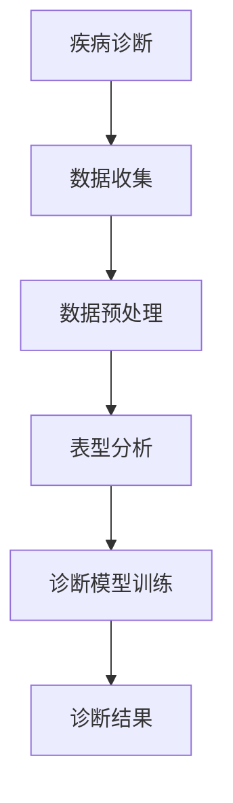
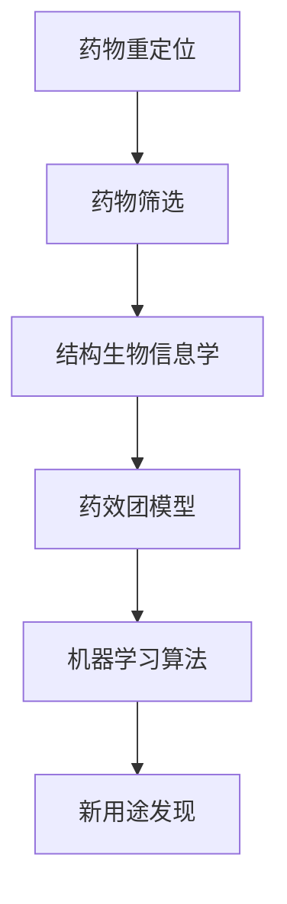

                 

# AI辅助罕见疾病诊断与治疗方案制定：从表型分析到药物重定位

关键词：人工智能、罕见疾病、诊断、治疗方案、药物重定位

摘要：本文将探讨人工智能（AI）在罕见疾病诊断和治疗中的潜力。通过介绍AI的基本原理和应用，分析罕见疾病的定义和挑战，详细讨论从表型分析到药物重定位的整个过程，最终展望AI在罕见疾病治疗领域的未来发展方向。

## 引言：AI在医疗保健与罕见疾病中的应用

随着人工智能技术的发展，医疗保健领域正在经历深刻的变革。AI作为一种强大的工具，其在疾病诊断、治疗计划和药物研发等环节中的应用日益广泛。特别是在罕见疾病领域，由于患者数量较少，传统的诊断和治疗方法常常无法满足需求，因此AI的应用显得尤为重要。

### 1.1 AI在医疗保健：基础与应用

人工智能是指由人制造出来的系统能够表现出智能行为。这些行为通常包括学习、推理、规划和问题解决。在医疗保健领域，AI的应用主要体现在以下几个方面：

1. **疾病预测与诊断**：利用机器学习算法分析大量的医疗数据，提前预测疾病的发病风险，或准确诊断病情。
2. **个性化治疗**：基于患者的基因信息和生活习惯，制定个性化的治疗方案。
3. **药物研发**：通过模拟药物与生物大分子的相互作用，加速新药的研发过程。
4. **医疗机器人**：在手术、康复等领域提供精准的辅助，提高医疗服务的质量。

### 1.2 罕见疾病的定义与挑战

罕见疾病是指发病率较低的疾病，通常定义为在特定人群中发病率不超过1/1,000的疾病。由于患者数量较少，罕见疾病的研究和诊断一直面临着诸多挑战：

1. **诊断困难**：罕见疾病的症状复杂且不典型，容易与其他疾病混淆，导致误诊和漏诊。
2. **治疗选择有限**：由于患者数量少，针对罕见疾病的药物研发投入较少，治疗选择有限。
3. **数据缺乏**：罕见疾病的数据相对较少，限制了研究的发展。

### 1.3 AI在罕见疾病中的应用

AI在罕见疾病中的应用潜力巨大。通过大数据分析和机器学习算法，AI可以辅助医生进行疾病诊断，制定个性化治疗方案，甚至发现新的治疗药物。以下是一些具体的应用场景：

1. **疾病识别**：利用深度学习算法，从患者的影像学数据中自动识别罕见疾病。
2. **基因组分析**：通过分析患者的基因组数据，发现与罕见疾病相关的基因突变。
3. **预测疾病进展**：利用时间序列分析，预测罕见疾病的病情进展。
4. **药物重定位**：通过分析药物与生物分子的相互作用，发现新的治疗药物。

## 表型分析

### 2.1 数据收集与预处理

在罕见疾病研究中，表型分析是一个关键环节。表型是指个体的外部表现，包括临床特征、生物标志物和基因组特征等。表型分析的第一步是数据收集。

#### 2.1.1 数据来源

数据来源主要包括以下几个方面：

1. **电子健康记录**：包括患者的历史病历、检查报告和诊断记录。
2. **基因组数据**：包括全基因组测序、外显子测序等。
3. **影像学数据**：包括CT、MRI、PET等影像数据。
4. **生物标志物数据**：包括血液、尿液等样本中的生物标志物。

#### 2.1.2 数据质量评估

数据质量直接影响分析结果的准确性。评估数据质量主要包括以下几个方面：

1. **完整性**：确保数据缺失最小化。
2. **准确性**：确保数据没有错误或偏差。
3. **一致性**：确保不同数据源之间的数据可以相互匹配。

#### 2.1.3 数据预处理技术

数据预处理是表型分析的基础。主要技术包括：

1. **数据清洗**：删除重复数据、纠正错误数据。
2. **数据整合**：将不同来源的数据进行整合，形成统一的视图。
3. **特征选择**：从大量数据中筛选出对分析有重要意义的特征。
4. **数据标准化**：将不同数据源的数据进行标准化处理，以便于后续分析。

### 2.2 表型识别与分析

#### 2.2.1 表型定义

表型是指个体的外部表现，包括临床特征、生物标志物和基因组特征等。在罕见疾病研究中，表型分析旨在识别患者的特征，以便进行准确的诊断和个性化的治疗。

#### 2.2.2 表型检测方法

表型检测方法主要包括以下几个方面：

1. **机器学习算法**：利用机器学习算法对大量数据进行分类和聚类，识别患者的特征。
2. **生物信息学方法**：通过生物信息学方法分析基因组数据，识别与罕见疾病相关的基因变异。
3. **多模态数据融合**：将不同类型的数据进行融合，以提高分析结果的准确性。

#### 2.2.3 表型分析技术

表型分析技术主要包括以下几个方面：

1. **主成分分析（PCA）**：用于降维和可视化，帮助识别患者的特征。
2. **支持向量机（SVM）**：用于分类，帮助医生进行疾病诊断。
3. **随机森林（RF）**：用于分类和回归，帮助预测疾病进展。

## AI辅助诊断

### 3.1 机器学习算法在诊断中的应用

机器学习算法是AI的核心技术之一，其在疾病诊断中的应用非常广泛。根据算法的不同类型，可以分为以下几类：

#### 3.1.1 监督学习

监督学习是指利用标记好的数据来训练模型，然后使用模型对新数据进行预测。在疾病诊断中，监督学习算法可以用于分类和回归任务。

1. **分类算法**：如支持向量机（SVM）、决策树、随机森林等。
2. **回归算法**：如线性回归、岭回归、LASSO回归等。

#### 3.1.2 无监督学习

无监督学习是指在没有标记数据的情况下，通过算法自动识别数据中的模式。在疾病诊断中，无监督学习算法可以用于聚类和降维。

1. **聚类算法**：如K均值聚类、层次聚类等。
2. **降维算法**：如主成分分析（PCA）、线性判别分析（LDA）等。

#### 3.1.3 半监督学习

半监督学习是指利用少量标记数据和大量未标记数据来训练模型。在疾病诊断中，半监督学习算法可以用于提高诊断的准确性。

1. **标签传播算法**：如标签传播、图模型等。

### 3.2 AI模型在诊断中的实现

实现AI模型进行疾病诊断需要以下几个步骤：

#### 3.2.1 模型选择

根据疾病诊断的需求，选择合适的机器学习算法。例如，对于分类任务，可以选择SVM或随机森林；对于回归任务，可以选择线性回归或岭回归。

#### 3.2.2 模型训练与验证

使用标记好的数据对模型进行训练，然后使用验证集来评估模型的性能。常见的评估指标包括准确率、召回率、F1值等。

#### 3.2.3 诊断流程与整合

将训练好的模型集成到诊断系统中，形成完整的诊断流程。例如，可以设计一个用户界面，让医生输入患者的临床表现，然后系统自动给出诊断结果。

## 治疗计划制定

### 4.1 预测分析在治疗中的应用

预测分析是利用历史数据和机器学习算法，对患者的疾病进展和治疗效果进行预测。在制定治疗计划时，预测分析可以帮助医生做出更明智的决策。

#### 4.1.1 预测模型

常用的预测模型包括：

1. **时间序列分析**：用于预测疾病的进展趋势。
2. **回归模型**：用于预测治疗效果。
3. **生存分析**：用于预测患者的生存时间。

#### 4.1.2 风险评估

通过预测模型，可以对患者的疾病进展和治疗效果进行风险评估。这有助于医生制定个性化的治疗方案。

#### 4.1.3 个人化医学

个人化医学是指根据患者的个体特征，制定个性化的治疗方案。通过预测分析和表型分析，可以为患者提供更精准的治疗方案。

### 4.2 制定有效的治疗计划

制定有效的治疗计划需要考虑以下几个因素：

#### 4.2.1 治疗选项

根据患者的病情和疾病类型，选择合适的治疗方法。治疗方法可以包括药物治疗、手术治疗、放疗等。

#### 4.2.2 治疗计划制定

根据预测分析和风险评估，制定个性化的治疗计划。治疗计划应包括治疗目标、治疗策略、监测指标等。

#### 4.2.3 治疗监测

在治疗过程中，应定期监测患者的病情和治疗效果，以便及时调整治疗计划。

## 药物重定位

### 5.1 药物重定位的概念与方法

药物重定位是指将已经上市的药物重新应用于其他疾病的治疗。在罕见疾病领域，药物重定位具有重要的意义，因为针对罕见疾病的药物研发成本高昂，而药物重定位可以降低研发成本。

#### 5.1.1 概念

药物重定位是指通过分析药物与生物分子的相互作用，发现药物在治疗其他疾病中的潜力。

#### 5.1.2 方法

药物重定位的方法主要包括：

1. **结构生物信息学**：通过分析药物的化学结构和生物大分子的结构，预测药物的作用靶点。
2. **药效团模型**：通过分析药物的化学结构，构建药效团模型，用于预测药物的新用途。
3. **机器学习算法**：利用机器学习算法，从大量的药物和生物分子相互作用数据中，发现新的药物作用靶点。

### 5.2 药物重定位的应用案例

以下是一些药物重定位的应用案例：

1. **伊马替尼在GIST治疗中的应用**：伊马替尼最初用于治疗慢性粒细胞白血病，后来发现其对GIST（胃肠道间质瘤）也有显著疗效。
2. **瑞德西韦在COVID-19治疗中的应用**：瑞德西韦最初用于治疗埃博拉病毒感染，后来发现其对COVID-19也有一定的疗效。

## 实践应用与案例分析

### 6.1 实践应用

在罕见疾病诊断和治疗中，AI的应用已经取得了一定的成果。以下是一些实践应用的案例：

1. **罕见病数据库**：通过建立罕见病数据库，收集和整理罕见病的临床特征、基因组信息等数据，为AI分析提供基础数据。
2. **智能诊断系统**：利用AI技术，开发智能诊断系统，帮助医生快速、准确地诊断罕见疾病。
3. **个性化治疗方案**：利用AI技术，为患者制定个性化的治疗方案，提高治疗效果。

### 6.2 案例分析

以下是一个罕见病诊断和治疗的案例分析：

1. **患者信息收集**：医生通过电子病历系统，收集患者的临床特征、基因组数据等。
2. **数据预处理**：对收集到的数据进行清洗、整合和标准化处理。
3. **诊断模型训练**：利用收集到的数据，训练诊断模型，评估模型性能。
4. **诊断结果输出**：医生通过智能诊断系统，输入患者的临床表现，系统自动给出诊断结果。
5. **个性化治疗计划**：根据诊断结果，医生为患者制定个性化的治疗方案。
6. **治疗效果监测**：在治疗过程中，定期监测患者的病情和治疗效果，及时调整治疗计划。

## 结论与未来展望

### 7.1 结论

本文探讨了AI在罕见疾病诊断和治疗中的潜力。通过介绍AI的基本原理和应用，分析罕见疾病的定义和挑战，详细讨论了从表型分析到药物重定位的整个过程，展示了AI在罕见疾病治疗领域的重要作用。

### 7.2 未来展望

随着AI技术的不断进步，其在罕见疾病治疗中的应用前景广阔。未来，我们有望看到：

1. **更加精准的诊断**：利用深度学习和图像处理技术，提高罕见疾病的诊断准确性。
2. **个性化的治疗方案**：基于患者的个体特征，制定更加精准的治疗方案。
3. **药物重定位的突破**：发现更多药物的新用途，降低药物研发成本。
4. **大数据与AI的结合**：通过大数据分析和AI技术，推动罕见疾病研究的深入。

### 7.3 注意事项

尽管AI在罕见疾病治疗中具有巨大的潜力，但在实际应用中仍需注意以下几点：

1. **数据隐私和安全**：确保患者的数据隐私和安全，防止数据泄露。
2. **算法透明性**：确保算法的透明性，使医生和患者能够理解诊断和治疗的决策过程。
3. **伦理问题**：在AI辅助诊断和治疗中，需遵循伦理规范，确保患者的权益。

### 7.4 拓展阅读

1. **《人工智能在医疗保健中的应用》**：详细介绍了AI在医疗保健领域的应用案例和技术原理。
2. **《罕见疾病诊断与治疗指南》**：提供了罕见疾病的诊断和治疗建议。
3. **《药物重定位研究进展》**：总结了药物重定位的最新研究进展和应用案例。

## 附录

### 8.1 数学公式

以下是本文中使用的数学公式：

$$
\begin{align*}
P(D|S) &= \frac{P(S|D)P(D)}{P(S)}
\end{align*}
$$

$$
\begin{align*}
\text{交叉熵} &= -\sum_{i=1}^{n} y_i \log_2 (p_i)
\end{align*}
$$

### 8.2 Mermaid 图

以下是本文中使用的Mermaid图：

## 作者信息

作者：AI天才研究院/AI Genius Institute & 禅与计算机程序设计艺术 /Zen And The Art of Computer Programming

