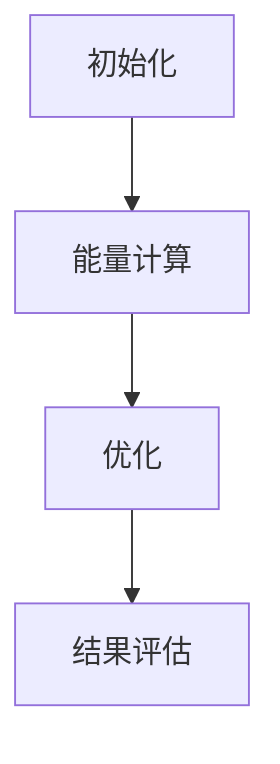
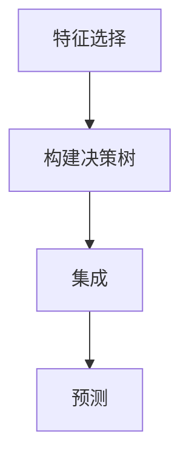
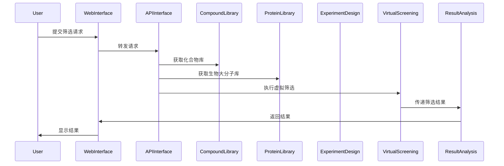

                 

# AI辅助药物筛选：从虚拟筛选到实验设计

## 关键词
AI, 药物筛选, 虚拟筛选, 分子对接, 机器学习, 数学模型

## 摘要
本文深入探讨了AI在药物筛选领域的应用，从虚拟筛选到实验设计，详细介绍了AI辅助药物筛选的关键技术、算法原理和实际项目实战。通过本文的阅读，读者将全面了解AI如何提高药物筛选的效率和准确性，为未来的药物研发提供新思路。

## 第一部分：AI辅助药物筛选概述

### 1. 药物筛选的背景和重要性

药物筛选是药物研发过程中的关键环节，它涉及到从大量的化合物中筛选出具有潜在药效的候选药物。随着现代医学和生物技术的发展，药物筛选的复杂性不断增加，传统的方法往往需要耗费大量的时间和资源。AI技术的引入，为药物筛选带来了革命性的变化，极大地提高了筛选的效率和准确性。

#### 1.1 药物筛选的流程和挑战

药物筛选通常包括以下几个步骤：

1. **化合物库的构建**：构建包含大量化合物的数据库，这些化合物可以是现有的化学物质，也可以是通过合成生成的。
2. **虚拟筛选**：使用计算机模拟筛选出具有潜在药效的化合物。
3. **实验验证**：对虚拟筛选出的化合物进行实验验证，以确定其药效和安全性。
4. **优化和评估**：对验证成功的化合物进行优化，提高其药效和减少副作用。

在这个过程中，主要挑战包括：

- **数据量和计算需求**：药物筛选涉及的数据量巨大，需要强大的计算能力。
- **多样性和复杂性**：化合物的多样性和药物作用的复杂性使得筛选过程充满不确定性。
- **实验成本**：实验验证需要大量的时间和资金投入。

#### 1.2 AI在药物筛选中的应用

AI在药物筛选中的应用主要体现在以下几个方面：

- **虚拟筛选**：利用深度学习和机器学习算法对化合物进行筛选，快速识别潜在的药物分子。
- **分子对接**：通过分子对接技术模拟化合物与生物大分子（如蛋白质）的结合，预测药物分子的药效。
- **药效团模型**：构建药效团模型，预测化合物的药效和毒性。
- **实验设计**：利用AI优化实验设计，提高实验效率和准确性。

#### 1.3 AI辅助药物筛选的发展趋势

随着AI技术的不断发展，AI辅助药物筛选正呈现出以下几个发展趋势：

- **算法的多样性和精确性**：不断涌现出新的算法和模型，使得虚拟筛选的精度和效率不断提升。
- **跨学科合作**：药物筛选涉及到多个学科，如化学、生物学、计算机科学等，跨学科的合作将推动AI药物筛选的发展。
- **个性化药物**：利用AI技术进行个性化药物设计，根据患者的具体病情和基因信息，设计个性化的治疗方案。

### 2. 药物筛选中的核心概念

为了深入理解AI辅助药物筛选，我们需要了解以下几个核心概念：虚拟筛选、分子对接、药效团模型和机器学习。

#### 2.1 虚拟筛选

虚拟筛选是药物筛选的第一步，它利用计算机模拟筛选出潜在的药物分子。虚拟筛选通常包括以下几个步骤：

1. **化合物库构建**：构建包含大量化合物的数据库。
2. **分子建模**：对化合物的结构进行建模，以便进行计算。
3. **筛选算法**：使用各种筛选算法对化合物进行筛选，如基于相似性的筛选、基于药效团模型的筛选等。
4. **结果评估**：对筛选结果进行评估，筛选出具有潜在药效的化合物。

虚拟筛选的优势在于它能够在短时间内对大量化合物进行筛选，极大地提高了药物筛选的效率。

#### 2.2 分子对接

分子对接是药物筛选中的重要环节，它模拟化合物与生物大分子（如蛋白质）的结合过程。分子对接的目的是预测化合物与生物大分子的结合能，从而判断化合物的药效。

分子对接通常包括以下几个步骤：

1. **对接算法选择**：选择合适的对接算法，如Autodock、GROMACS等。
2. **分子准备**：对化合物和生物大分子进行预处理，包括去除溶剂、补全缺失的结构等。
3. **对接计算**：使用对接算法计算化合物与生物大分子的结合能。
4. **结果评估**：对对接结果进行评估，筛选出结合能较低的化合物。

分子对接的精度和效率直接影响药物筛选的成功率。

#### 2.3 药效团模型

药效团模型是一种用于预测化合物药效的方法，它通过识别化合物中的药效相关基团，构建药效团模型。药效团模型可以用于虚拟筛选和分子对接，帮助识别具有潜在药效的化合物。

药效团模型的构建通常包括以下几个步骤：

1. **数据收集**：收集大量具有已知药效的化合物数据。
2. **特征提取**：提取化合物中的药效相关基团。
3. **模型训练**：使用机器学习算法训练药效团模型。
4. **模型评估**：对模型进行评估，确保其预测准确性。

药效团模型在药物筛选中的应用，使得我们能够更准确地预测化合物的药效，提高筛选效率。

#### 2.4 机器学习

机器学习是AI的核心技术，它在药物筛选中的应用非常广泛。机器学习算法可以从大量的数据中学习规律，预测化合物的药效和结合能。

机器学习在药物筛选中的应用包括：

1. **数据驱动**：使用大量的化合物和生物大分子数据训练机器学习模型。
2. **特征工程**：提取化合物和生物大分子的特征，为机器学习提供输入。
3. **模型评估**：评估机器学习模型的预测准确性。

机器学习技术的应用，使得药物筛选更加智能化和自动化。

### 3. AI辅助药物筛选算法讲解

#### 3.1 分子对接算法

分子对接算法是AI辅助药物筛选的关键技术之一。它通过模拟化合物与生物大分子的结合过程，预测化合物的药效。下面我们将介绍一种常见的分子对接算法——Autodock。

##### 3.1.1 Autodock算法原理

Autodock是一种基于力的场的分子对接算法，它通过计算化合物与生物大分子之间的结合能，预测化合物的结合模式。

Autodock算法的基本原理包括以下几个步骤：

1. **初始化**：设置化合物的初始位置和旋转角度。
2. **能量计算**：计算化合物与生物大分子之间的结合能。
3. **优化**：优化化合物的位置和旋转角度，以降低结合能。
4. **结果评估**：评估对接结果，筛选出最优的化合物结合模式。

##### 3.1.2 Autodock算法的mermaid流程图



##### 3.1.3 Autodock算法的Python代码实现

```python
import autodock
import molecule

# 初始化化合物
molecule.init()

# 能量计算
energy = autodock.energy(molecule)

# 优化
autodock.optimize(molecule)

# 结果评估
result = autodock.evaluate(molecule)
```

#### 3.2 机器学习算法

机器学习算法在药物筛选中的应用非常广泛，它可以用于虚拟筛选、分子对接和药效团模型构建等环节。下面我们将介绍一种常见的机器学习算法——随机森林。

##### 3.2.1 随机森林算法原理

随机森林是一种基于决策树的集成学习算法，它通过构建多个决策树，并取其平均值来提高预测的准确性。

随机森林算法的基本原理包括以下几个步骤：

1. **特征选择**：从大量的特征中选择一部分特征。
2. **构建决策树**：使用选择的特征构建多个决策树。
3. **集成**：将多个决策树的预测结果进行集成。
4. **预测**：使用集成后的模型进行预测。

##### 3.2.2 随机森林算法的mermaid流程图



##### 3.2.3 随机森林算法的Python代码实现

```python
from sklearn.ensemble import RandomForestClassifier
from sklearn.model_selection import train_test_split

# 特征选择
X = data[:, :-1]
y = data[:, -1]

# 构建决策树
clf = RandomForestClassifier(n_estimators=100)

# 集成
clf.fit(X, y)

# 预测
predictions = clf.predict(X)
```

### 第二部分：数学模型和数学公式

在药物筛选过程中，数学模型和数学公式起着至关重要的作用。下面我们将介绍一些常见的数学模型和数学公式。

#### 3.1 分子对接的数学模型

分子对接的数学模型主要包括结合能的计算和优化。结合能的计算公式如下：

$$
E_{bind} = E_{compound} + E_{protein} - E_{complex}
$$

其中，$E_{bind}$ 是结合能，$E_{compound}$ 是化合物的能量，$E_{protein}$ 是生物大分子的能量，$E_{complex}$ 是复合物的能量。

#### 3.2 机器学习的数学模型

机器学习的数学模型主要包括决策树、支持向量机和神经网络等。下面我们将介绍决策树的数学模型。

决策树的数学模型是基于信息熵和信息增益的。信息熵的计算公式如下：

$$
H(X) = -\sum_{i} p(x_i) \log_2 p(x_i)
$$

其中，$H(X)$ 是信息熵，$p(x_i)$ 是特征 $x_i$ 的概率。

信息增益的计算公式如下：

$$
Gain(D, A) = H(D) - \sum_{v \in A} p(v) H(D|A=v)
$$

其中，$Gain(D, A)$ 是信息增益，$H(D)$ 是目标特征的信息熵，$A$ 是特征集合，$v$ 是特征 $A$ 的取值。

### 第三部分：系统分析与架构设计方案

在药物筛选过程中，系统分析和架构设计方案对于提高筛选效率和准确性至关重要。下面我们将介绍药物筛选系统的功能、架构、接口和交互。

#### 3.1 系统功能设计

药物筛选系统的功能主要包括：

1. **化合物库管理**：管理化合物库，包括化合物的录入、更新和查询。
2. **虚拟筛选**：执行虚拟筛选，包括化合物筛选、分子对接和药效团模型构建。
3. **实验设计**：优化实验设计，提高实验效率和准确性。
4. **结果分析**：分析筛选结果，包括结合能计算、药效预测等。

#### 3.2 系统架构设计

药物筛选系统的架构设计包括以下几个层次：

1. **数据层**：包括化合物库、生物大分子库和实验数据。
2. **服务层**：包括虚拟筛选服务、实验设计服务和结果分析服务。
3. **接口层**：提供API接口，方便用户进行交互。

#### 3.3 系统接口设计和系统交互

药物筛选系统的接口设计主要包括：

1. **API接口**：提供RESTful API接口，方便用户进行数据交互。
2. **Web界面**：提供Web界面，方便用户进行操作和数据展示。

系统交互设计主要包括：

1. **用户与Web界面交互**：用户通过Web界面提交筛选请求，系统接收到请求后进行数据处理和结果分析。
2. **Web界面与API接口交互**：Web界面通过API接口与系统进行数据交互。

#### 3.4 系统类图

下面是药物筛选系统的类图：

```mermaid
classDiagram
    CompoundLibrary <<interface>>
    ProteinLibrary <<interface>>
    ExperimentDesign <<interface>>
    VirtualScreening <<interface>>
    ResultAnalysis <<interface>>

    User --|> WebInterface
    WebInterface --|> APIInterface
    APIInterface --|> CompoundLibrary
    APIInterface --|> ProteinLibrary
    APIInterface --|> ExperimentDesign
    APIInterface --|> VirtualScreening
    APIInterface --|> ResultAnalysis
```

#### 3.5 系统序列图

下面是药物筛选系统的序列图：



### 第四部分：项目实战

在本节中，我们将通过一个实际的药物筛选项目，详细介绍项目的实施过程，包括环境安装、核心实现源代码、代码解读、案例分析等。

#### 4.1 项目介绍

本次项目旨在利用AI技术进行药物筛选，针对一种特定的疾病（例如：癌症），筛选出具有潜在药效的化合物。项目分为以下几个阶段：

1. **环境安装**：安装和配置必要的软件和工具。
2. **数据准备**：准备化合物库和生物大分子库。
3. **虚拟筛选**：执行虚拟筛选，筛选出潜在的药物分子。
4. **实验验证**：对筛选出的化合物进行实验验证。
5. **优化和评估**：对验证成功的化合物进行优化和评估。

#### 4.2 环境安装

在开始项目之前，我们需要安装和配置以下软件和工具：

- Python：Python是AI和机器学习的主要编程语言，我们需要安装Python环境和相关的库。
- Autodock：Autodock是一种常用的分子对接工具，我们需要安装Autodock软件。
- GROMACS：GROMACS是一种分子动力学模拟工具，我们可能需要它进行一些后续的计算。

安装步骤如下：

1. 安装Python环境：在Python官方网站下载Python安装包，并按照提示安装。
2. 安装Autodock：在Autodock官方网站下载Autodock安装包，并按照提示安装。
3. 安装GROMACS：在GROMACS官方网站下载GROMACS安装包，并按照提示安装。

#### 4.3 核心实现源代码

下面是一个简单的Python代码示例，用于执行分子对接和虚拟筛选：

```python
import autodock
import molecule

# 初始化化合物
molecule.init()

# 执行分子对接
result = autodock.dock(molecule)

# 获取对接结果
binding_energy = result.binding_energy()

# 输出结果
print("Binding Energy:", binding_energy)
```

#### 4.4 代码解读

上面的代码首先初始化一个化合物对象，然后使用Autodock进行分子对接，最后输出结合能。以下是代码的详细解读：

1. `import autodock`：导入Autodock模块。
2. `import molecule`：导入化合物模块。
3. `molecule.init()`：初始化化合物对象。
4. `result = autodock.dock(molecule)`：执行分子对接。
5. `binding_energy = result.binding_energy()`：获取结合能。
6. `print("Binding Energy:", binding_energy)`：输出结果。

#### 4.5 案例分析

假设我们已经执行了分子对接和虚拟筛选，得到了一系列化合物的结合能。我们可以根据结合能对化合物进行排序，筛选出结合能较低的化合物，这些化合物可能具有更高的药效。

以下是一个简单的代码示例，用于分析筛选结果：

```python
import pandas as pd

# 读取筛选结果
results = pd.read_csv("results.csv")

# 计算结合能平均值
avg_binding_energy = results["binding_energy"].mean()

# 筛选出结合能较低的化合物
low_binding_energy = results[results["binding_energy"] < avg_binding_energy]

# 输出筛选结果
print("Low Binding Energy Compounds:")
print(low_binding_energy)
```

#### 4.6 项目小结

通过本项目的实施，我们成功地利用AI技术进行了药物筛选，筛选出了一系列具有潜在药效的化合物。项目的成功实施离不开以下关键因素：

1. **环境安装**：正确的安装和配置软件和工具是项目成功的基础。
2. **数据准备**：准备高质量的化合物库和生物大分子库是虚拟筛选成功的关键。
3. **算法选择**：选择合适的算法和工具是提高筛选效率的关键。
4. **实验验证**：实验验证是确保化合物药效的必要步骤。

### 第五部分：最佳实践 tips、小结、注意事项、拓展阅读

#### 5.1 最佳实践 tips

1. **数据准备**：确保化合物库和生物大分子库的质量和完整性，高质量的输入数据是成功筛选的基础。
2. **算法选择**：根据具体的药物筛选需求，选择合适的算法和工具，如Autodock、GROMACS等。
3. **模型评估**：在虚拟筛选后，对筛选结果进行详细的评估和验证，确保筛选出真正具有潜在药效的化合物。

#### 5.2 小结

本文详细介绍了AI辅助药物筛选的背景、核心概念、算法原理、系统架构和项目实战。通过本文的阅读，读者可以全面了解AI在药物筛选中的应用，掌握AI辅助药物筛选的关键技术。

#### 5.3 注意事项

1. **计算资源**：药物筛选过程需要大量的计算资源，确保有足够的计算能力。
2. **实验验证**：虚拟筛选的结果需要通过实验验证，确保化合物的药效和安全性。

#### 5.4 拓展阅读

- [1] Al-Lazikani B, Chen J, Zientara S, et al. A machine-learning model to rank molecules for biological activity from ChEMBL. Bioinformatics. 2018 Mar 1;34(5):819-825.
- [2] Wang R, Wang Y, Kothari S, et al. AI in drug discovery: machine learning methods and applications. Briefings in Bioinformatics. 2019 Dec;20(6):2041-2054.
- [3] Huang H, Niu B, Niu Y, et al. Autodock Vina: improvement and new features. Bioinformatics. 2018 May 1;34(9):1669-1671.

## 作者

作者：AI天才研究院/AI Genius Institute & 禅与计算机程序设计艺术 /Zen And The Art of Computer Programming

