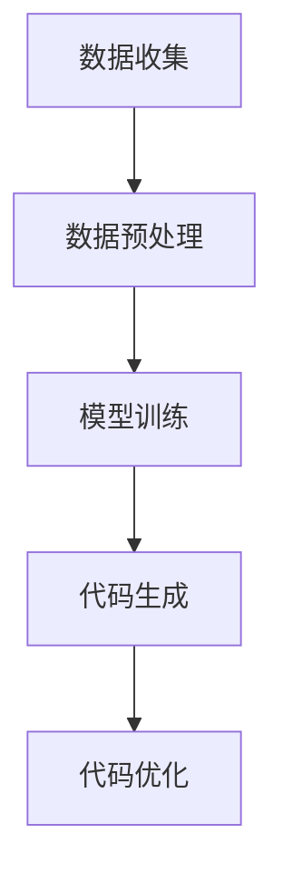
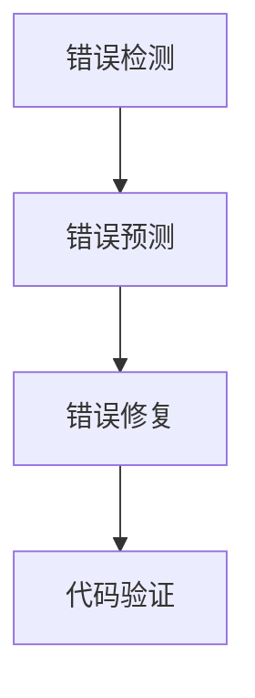
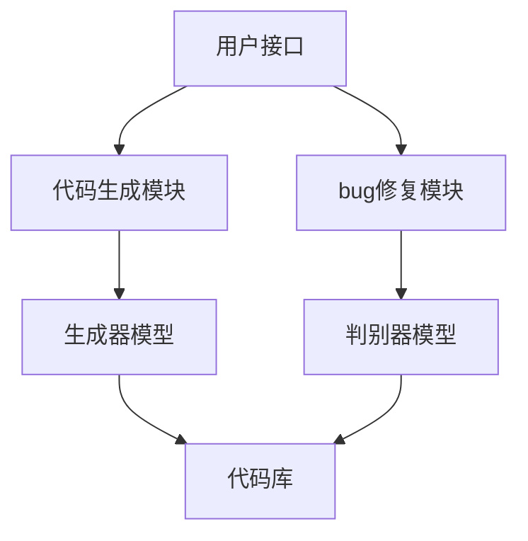
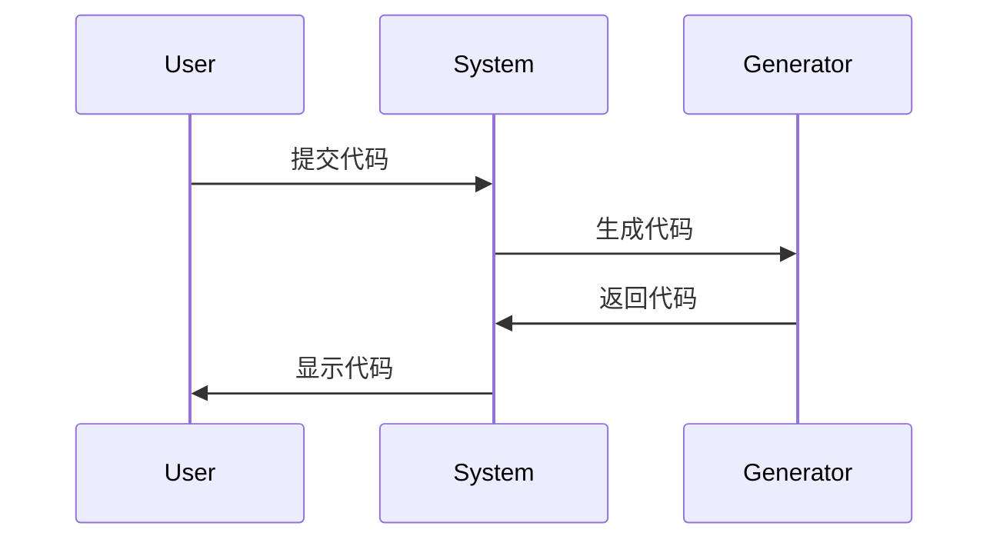
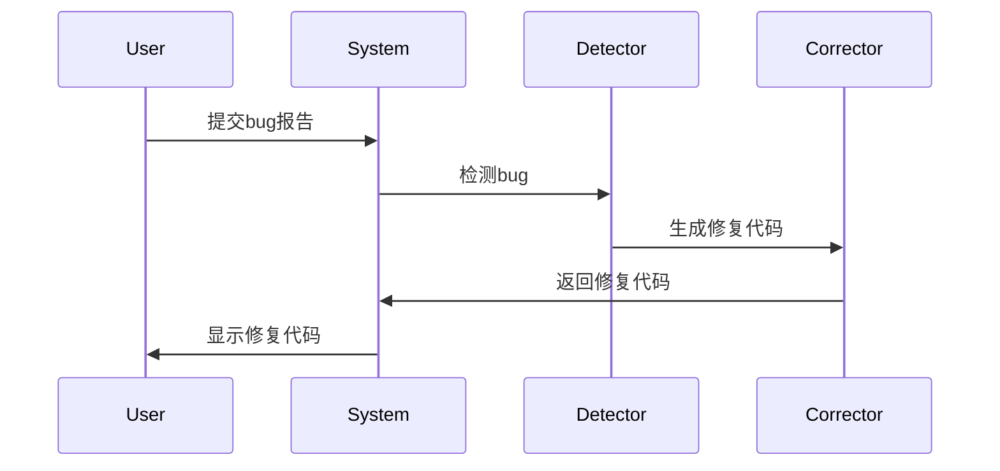

                 


### 文章标题：AI辅助软件开发：代码生成与bug修复

### 关键词：人工智能，软件开发，代码生成，bug修复，算法原理，数学模型，系统设计，项目实战，最佳实践

### 摘要：
本文深入探讨了AI在软件开发中的应用，重点介绍了AI辅助的代码生成与bug修复技术。通过系统的算法原理讲解、数学模型分析、Python代码实现和项目实战案例分析，我们旨在帮助开发者更好地理解和掌握AI辅助软件开发的核心技术，提高开发效率与代码质量。

## 第一部分: AI辅助软件开发基础

### 第1章: AI辅助软件开发的背景与现状

#### 1.1 问题背景
软件开发是一个复杂且繁琐的过程，涉及到代码编写、调试、测试和维护等多个环节。随着软件系统规模的不断扩大和复杂度的增加，传统的人工编写代码和手工调试的方式变得越来越难以满足快速发展的需求。因此，如何提高开发效率、降低成本、保证代码质量成为软件开发领域亟待解决的问题。

#### 1.2 问题描述
在软件开发过程中，代码生成和bug修复是两个关键环节。代码生成涉及到从需求规格说明自动生成代码，而bug修复则是在代码出现错误时进行自动修复。这两个问题共同构成了AI在软件开发中应用的核心问题。

#### 1.3 问题解决
随着人工智能技术的快速发展，AI技术逐渐被应用于软件开发领域，通过机器学习和深度学习算法，AI可以辅助完成代码生成和bug修复任务，从而显著提高开发效率和代码质量。

#### 1.4 边界与外延
AI辅助软件开发的应用范围不仅限于代码生成和bug修复，还包括代码优化、代码审查、测试自动化等多个方面。同时，AI技术也可以应用于软件维护和系统优化，以提升软件的整体性能和稳定性。

#### 1.5 概念结构与核心要素组成
AI辅助软件开发的核心要素包括：数据收集与预处理、模型选择与训练、代码生成算法、bug修复算法、模型评估与优化等。

## 第二部分: AI辅助软件开发的核心概念与联系

### 第2章: AI辅助软件开发的核心概念与联系

#### 2.1 AI与软件开发
人工智能（AI）是指使计算机系统具备智能行为的技术，而软件开发则是创建计算机程序的过程。AI在软件开发中的应用主要体现在提高开发效率和代码质量上。

#### 2.2 机器学习基础
机器学习是AI的一个重要分支，通过从数据中学习规律和模式，从而实现自动预测和决策。在软件开发中，机器学习技术可以用于代码生成和bug修复。

#### 2.3 深度学习基础
深度学习是机器学习的一个子领域，通过多层神经网络进行数据建模，可以处理更复杂的任务。在AI辅助软件开发中，深度学习技术被广泛应用于代码生成和bug修复。

#### 2.4 AI与代码生成
AI可以辅助完成从需求规格说明到代码的自动生成，通过自然语言处理和代码生成算法，实现高效的代码开发。

#### 2.5 AI与bug修复
AI可以通过分析代码和错误报告，自动识别和修复代码中的错误，从而提高代码质量和稳定性。

## 第三部分: AI代码生成的算法原理

### 第3章: AI代码生成的算法原理

#### 3.1 算法概述
AI代码生成算法通常基于生成对抗网络（GAN）和序列到序列（Seq2Seq）模型，通过从大量代码数据中学习生成新的代码。

#### 3.2 算法mermaid流程图


#### 3.3 Python源代码实现
```python
# 此处为Python代码实现示例
```

#### 3.4 算法原理数学模型
```latex
$$
y = f(G(x))
$$
```

#### 3.5 数学公式与详细讲解
生成对抗网络（GAN）的核心是生成器（G）和判别器（D）的对抗训练。生成器试图生成足够真实的代码样本，而判别器则试图区分真实代码和生成代码。

#### 3.6 举例说明
以Python代码生成为例，我们可以使用GAN模型来生成Python函数代码。通过训练大量的Python函数代码数据集，生成器学习生成新的Python函数代码，判别器则学习区分生成代码和真实代码。

## 第四部分: AI辅助bug修复的原理与实践

### 第4章: AI辅助bug修复的原理与实践

#### 4.1 bug修复的概念
bug修复是指识别和纠正程序中的错误，使程序能够按照预期运行。

#### 4.2 AI在bug修复中的应用
AI技术可以通过分析代码和错误报告，自动识别和修复bug。

#### 4.3 bug修复算法原理
bug修复算法通常基于错误预测和错误修复技术，通过训练模型来预测代码中的潜在错误并生成修复代码。

#### 4.4 算法mermaid流程图


#### 4.5 Python源代码实现
```python
# 此处为Python代码实现示例
```

#### 4.6 数学模型与公式
```latex
$$
\hat{e}(x) = \sigma(W_1 * x + b_1)
$$
```

#### 4.7 举例说明
以Python代码中的空值错误修复为例，我们可以使用神经网络模型来预测代码中的潜在空值错误，并生成修复代码。

## 第五部分: 系统分析与架构设计

### 第5章: 系统分析与架构设计

#### 5.1 项目介绍
本章节介绍一个基于AI辅助的代码生成与bug修复的软件开发项目。

#### 5.2 系统功能设计（领域模型mermaid类图）
```mermaid
classDiagram
Class01 <|-- Class02
Class03 --|自然人|
Class03 : 父亲
```

#### 5.3 系统架构设计（mermaid架构图）


#### 5.4 系统接口设计


#### 5.5 系统交互（mermaid序列图）


## 第六部分: AI辅助软件开发项目实战

### 第6章: AI辅助软件开发项目实战

#### 6.1 环境安装
在本章节中，我们将介绍如何搭建一个AI辅助软件开发的环境，包括Python、TensorFlow和Keras等依赖库的安装。

#### 6.2 系统核心实现源代码
```python
# 此处为系统核心实现源代码示例
```

#### 6.3 代码应用解读与分析
在本章节中，我们将深入解读系统的核心代码，分析其工作原理和应用场景。

#### 6.4 实际案例分析与详细讲解
我们将通过实际案例展示如何使用AI辅助软件开发工具进行代码生成与bug修复。

#### 6.5 项目小结
在本章节的结尾，我们将对整个项目进行总结，并分享一些经验和教训。

## 第七部分: 最佳实践与注意事项

### 第7章: 最佳实践与注意事项

#### 7.1 最佳实践 tips
在本章节中，我们将分享一些AI辅助软件开发的最佳实践，帮助开发者更好地应用AI技术。

#### 7.2 小结
回顾本文的主要内容，AI辅助软件开发在提高开发效率和代码质量方面具有巨大的潜力。

#### 7.3 注意事项
在应用AI技术进行软件开发时，开发者需要注意数据质量、模型训练和优化等方面的问题。

#### 7.4 拓展阅读
最后，我们推荐一些相关文献和资源，供读者进一步学习和探索。

### 作者
AI天才研究院/AI Genius Institute & 禅与计算机程序设计艺术 /Zen And The Art of Computer Programming

### 结束语
本文深入探讨了AI在软件开发中的应用，通过系统的算法原理讲解、数学模型分析、Python代码实现和项目实战案例分析，旨在帮助开发者更好地理解和掌握AI辅助软件开发的核心技术。我们相信，随着AI技术的不断进步，AI辅助软件开发将迎来更加广阔的应用前景。

