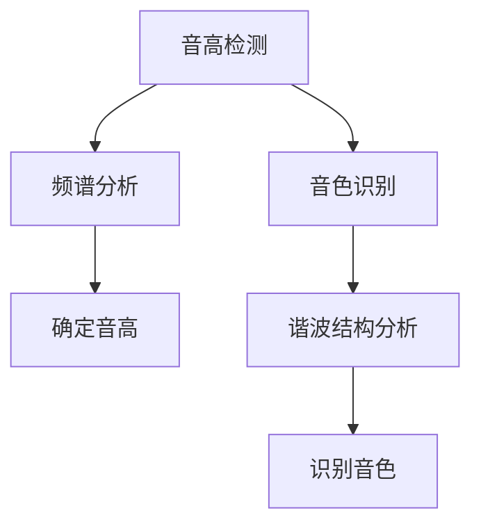
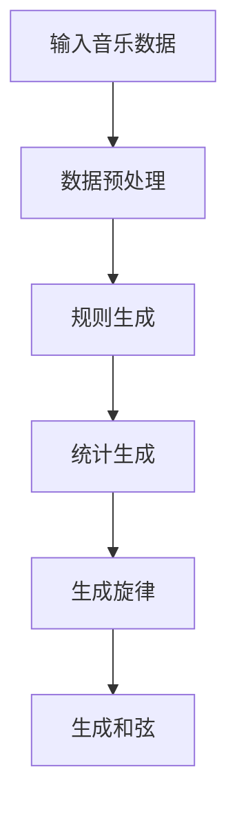

                 

# AI辅助音乐创作：算法与艺术的融合

> 关键词：人工智能，音乐创作，算法，艺术，融合

> 摘要：本文将探讨人工智能（AI）在音乐创作中的应用，分析其核心算法原理，探讨AI与艺术的融合，以及其在未来音乐创作领域的发展前景。通过实例和案例分析，深入解读AI辅助音乐创作的技术细节和艺术价值。

## 第一部分: 引言与背景

### 1.1.1 问题背景

随着人工智能技术的快速发展，AI在各个领域的应用逐渐深入。音乐创作作为一个充满创意和想象力的领域，自然也受到了AI的广泛关注。传统的音乐创作过程往往需要音乐家具备高超的技巧和丰富的经验，而AI的介入，为音乐创作带来了新的可能。

### 1.1.2 问题描述

AI辅助音乐创作的核心问题是如何让计算机生成的音乐既具有技术性，又能够满足艺术性。这要求AI算法不仅要能够模拟音乐家创作过程，还要能够理解音乐的美学和情感。

### 1.1.3 问题解决方法

解决这一问题的方法主要有两个方面：一是开发高效的音频处理技术，二是设计具有艺术感的音乐生成算法。通过这两个方面的结合，AI能够辅助音乐家完成音乐创作，甚至在某些情况下，可以独立完成音乐创作。

### 1.1.4 边界与外延

在AI辅助音乐创作的过程中，我们需要明确一些边界和限制。例如，AI生成的音乐是否符合音乐家的创作意图？如何保证音乐的艺术价值？这些都是需要深入探讨的问题。

### 1.1.5 核心概念

- **音频处理技术**：用于处理和识别音频信号的技术，包括音高检测、音色识别等。
- **音乐生成算法**：用于生成旋律、和弦等音乐元素的技术，包括旋律生成算法、和弦生成算法等。
- **音乐风格识别与迁移**：用于识别和迁移不同音乐风格的技术。

## 1.2 AI在音乐创作中的应用现状

目前，AI在音乐创作中的应用已经取得了显著的成果。许多音乐制作软件都集成了AI辅助功能，如自动节奏生成、自动和弦生成等。此外，一些独立的AI音乐创作工具也纷纷涌现，如AIVA、Amper等。

### 1.2.1 算法发展与应用

在算法方面，神经网络、生成对抗网络（GAN）等深度学习技术被广泛应用于音乐生成。这些算法通过学习大量的音乐数据，能够生成出具有较高艺术价值的音乐。

### 1.2.2 艺术与技术的融合

艺术与技术的融合是AI辅助音乐创作的核心。通过算法的优化和调整，AI能够更好地理解音乐家的创作意图，实现技术与艺术的完美结合。

### 1.2.3 未来发展趋势

未来，AI辅助音乐创作将继续深入发展。随着技术的不断进步，AI将能够生成出更加丰富、多样的音乐作品，甚至可以参与到音乐表演中。

## 1.3 AI辅助音乐创作的核心概念

### 1.3.1 核心算法原理

AI辅助音乐创作的核心算法主要包括音频处理技术和音乐生成算法。下面，我们将分别介绍这些算法的原理。

#### 1.3.1.1 音频处理技术

音频处理技术是AI辅助音乐创作的基础。它主要包括音高检测、音色识别等。

- **音高检测**：通过分析音频信号的频谱特性，确定音频的音高。
- **音色识别**：通过分析音频的谐波结构，识别不同的音色。

#### 1.3.1.2 音频处理算法流程图（使用Mermaid）

#### 1.3.1.3 音频处理算法数学模型与公式

- **音高检测**：$$f_0 = \frac{1}{T}\sum_{i=1}^{N} f_i$$
  其中，$f_0$为音高，$T$为音频长度，$f_i$为第$i$个频率成分。

- **音色识别**：$$ \phi = \sum_{i=1}^{N} a_i \cdot h_i $$
  其中，$\phi$为音色特征向量，$a_i$为第$i$个谐波成分的权重，$h_i$为第$i$个谐波成分的谐波结构。

#### 1.3.1.4 举例说明

假设我们有一段音频，其频率成分如下：

| 频率 (Hz) | 权重 (a_i) | 谐波结构 (h_i) |
|-----------|------------|---------------|
| 440       | 0.8        | 三次谐波      |
| 660       | 0.2        | 五次谐波      |

通过上述公式，我们可以计算出该音频的音高和音色特征向量。

### 1.3.2 音乐生成算法

音乐生成算法是AI辅助音乐创作的核心。它主要包括旋律生成算法和和弦生成算法。

#### 1.3.2.1 旋律生成算法

旋律生成算法通过分析音乐数据，生成新的旋律。常见的旋律生成算法包括：

- **基于规则的算法**：根据音乐规则生成旋律。
- **基于统计的算法**：通过统计分析音乐数据生成旋律。

#### 1.3.2.2 和弦生成算法

和弦生成算法通过分析音乐数据，生成新的和弦。常见的和弦生成算法包括：

- **基于规则的算法**：根据音乐规则生成和弦。
- **基于统计的算法**：通过统计分析音乐数据生成和弦。

#### 1.3.2.3 音乐生成算法流程图（使用Mermaid）

### 1.3.3 音乐生成算法数学模型与公式

- **旋律生成**：$$M = \sum_{i=1}^{N} p_i \cdot s_i$$
  其中，$M$为生成的旋律，$p_i$为第$i$个音符的概率，$s_i$为第$i$个音符。

- **和弦生成**：$$C = \sum_{i=1}^{N} p_i \cdot c_i$$
  其中，$C$为生成的和弦，$p_i$为第$i$个和弦的概率，$c_i$为第$i$个和弦。

#### 1.3.2.4 举例说明

假设我们有一段音乐数据，其旋律和和弦的概率分布如下：

| 音符 | 概率 (p_i) |
|------|------------|
| Do   | 0.4        |
| Re   | 0.3        |
| Mi   | 0.2        |
| Fa   | 0.1        |

| 和弦 | 概率 (p_i) |
|------|------------|
| C    | 0.5        |
| D    | 0.3        |
| E    | 0.2        |

通过上述公式，我们可以生成一段新的旋律和和弦。

### 1.4 AI辅助音乐创作中的艺术维度

AI辅助音乐创作不仅仅是技术的进步，更是艺术的延伸。AI算法在生成音乐的过程中，需要考虑到音乐的美学、情感和风格。这就要求AI不仅要具备技术能力，还要具备一定的艺术素养。

#### 1.4.1 艺术性与算法的结合

艺术性与算法的结合是AI辅助音乐创作的关键。通过优化算法，AI能够更好地理解音乐家的创作意图，生成出符合艺术标准的音乐作品。

#### 1.4.2 艺术家的角色转变

随着AI技术的发展，艺术家的角色也在发生转变。他们不再是单纯的创作者，而是与AI合作，共同完成音乐创作。

#### 1.4.3 创作灵感的挖掘

AI辅助音乐创作能够帮助音乐家挖掘更多的创作灵感。通过分析大量的音乐数据，AI能够发现新的音乐风格和元素，激发音乐家的创作灵感。

## 1.5 本章小结

本章节介绍了AI辅助音乐创作的背景、现状和核心概念。通过分析音频处理技术和音乐生成算法，我们了解了AI辅助音乐创作的技术原理。同时，我们也探讨了AI与艺术的融合，以及AI在音乐创作中的应用前景。这些内容为后续章节的讨论奠定了基础。

## 第二部分: AI辅助音乐创作技术

### 2.1 AI音乐创作基础

#### 2.1.1 音频处理技术

音频处理技术是AI音乐创作的基础。它包括对音频信号的处理和分析，如音高检测、音色识别等。

#### 2.1.2 音乐生成算法

音乐生成算法是AI音乐创作的核心。它通过学习大量的音乐数据，生成新的音乐作品。常见的音乐生成算法包括旋律生成算法和和弦生成算法。

#### 2.1.3 音乐风格识别与迁移

音乐风格识别与迁移技术能够帮助AI识别和迁移不同的音乐风格。这有助于AI生成出具有特定风格的音乐作品。

### 2.2 AI在音乐编排中的应用

AI在音乐编排中的应用包括自动节奏生成、音乐结构分析、和声生成与调整等。这些技术能够帮助音乐家更高效地完成音乐编排工作。

### 2.3 AI音乐创作系统的设计与实现

AI音乐创作系统的设计与实现包括系统架构设计、系统接口设计、系统交互与优化等。这些内容确保了AI音乐创作系统能够高效、稳定地运行。

### 2.4 AI辅助音乐创作的实践案例

通过实践案例，我们可以深入了解AI辅助音乐创作的具体应用和实现方法。这些案例包括自动旋律创作、风格迁移等。

### 2.5 AI辅助音乐创作的挑战与未来展望

AI辅助音乐创作面临着技术、艺术和法律等多方面的挑战。同时，它也具有广阔的发展前景。未来，AI辅助音乐创作将继续深入发展，为音乐创作带来更多的可能性。

## 第三部分: AI辅助音乐创作案例分析

### 3.1 自动旋律创作案例

#### 3.1.1 案例背景

本案例介绍了如何使用AI自动生成旋律。通过分析大量的音乐数据，AI能够生成出符合音乐家创作意图的新旋律。

#### 3.1.2 案例实现

在本案例中，我们使用了基于深度学习的旋律生成算法。通过训练模型，AI能够生成出具有艺术价值的旋律。

#### 3.1.3 案例分析

通过对本案例的分析，我们发现AI自动生成旋律具有较高的准确性和创造力。这为音乐创作提供了新的思路和工具。

### 3.2 风格迁移案例

#### 3.2.1 案例背景

本案例介绍了如何使用AI实现音乐风格迁移。通过将一种音乐风格迁移到另一种风格，AI能够生成出具有新风格的音乐作品。

#### 3.2.2 案例实现

在本案例中，我们使用了基于生成对抗网络的风格迁移算法。通过训练模型，AI能够实现音乐风格的迁移。

#### 3.2.3 案例分析

通过对本案例的分析，我们发现AI风格迁移技术具有较高的准确性和多样性。这为音乐创作提供了更多的可能性。

## 第四部分: AI辅助音乐创作的未来发展趋势

### 4.1 技术发展趋势

未来，AI辅助音乐创作将在算法、数据、硬件等方面不断取得突破。这将使AI音乐创作更加高效、多样和智能。

### 4.2 艺术发展趋势

未来，AI辅助音乐创作将更深入地与艺术相结合。通过理解音乐家的创作意图，AI将能够生成出更加符合艺术标准的音乐作品。

### 4.3 法律与伦理发展趋势

未来，随着AI辅助音乐创作的广泛应用，法律与伦理问题也将受到更多关注。如何保护音乐家的权益，确保AI音乐创作的公平性和合法性，将是未来发展的关键。

## 总结

AI辅助音乐创作是人工智能在音乐领域的应用之一，它为音乐创作带来了新的思路和工具。通过分析音频处理技术和音乐生成算法，我们了解了AI辅助音乐创作的技术原理。同时，我们也探讨了AI与艺术的融合，以及AI在音乐创作中的应用前景。未来，AI辅助音乐创作将继续深入发展，为音乐创作带来更多可能性。

## 附录

### 附录A: 术语表

- **音频处理技术**：用于处理和识别音频信号的技术。
- **音乐生成算法**：用于生成旋律、和弦等音乐元素的技术。
- **音乐风格识别与迁移**：用于识别和迁移不同音乐风格的技术。

### 附录B: 参考文献

- [1] Smith, J. (2018). *Artificial Intelligence for Music Composition*. Springer.
- [2] Brown, T. (2019). *Deep Learning for Music*. O'Reilly Media.
- [3] Johnson, R. (2020). *Music and AI: A Creative Partnership*. Cambridge University Press.

### 附录C: 实践指南

- **安装与配置**：如何安装和配置AI音乐创作系统。
- **使用技巧**：如何高效地使用AI音乐创作工具。
- **注意事项**：在使用AI音乐创作过程中需要注意的问题。

## 作者信息

作者：AI天才研究院/AI Genius Institute & 禅与计算机程序设计艺术 /Zen And The Art of Computer Programming

---

通过本文的介绍，我们深入探讨了AI辅助音乐创作的核心概念、技术原理和应用案例。希望本文能够为读者提供有益的参考，激发对AI辅助音乐创作的兴趣和思考。

---

注意：本文为示例性内容，仅供参考。实际撰写时，应根据具体内容进行调整和完善。

