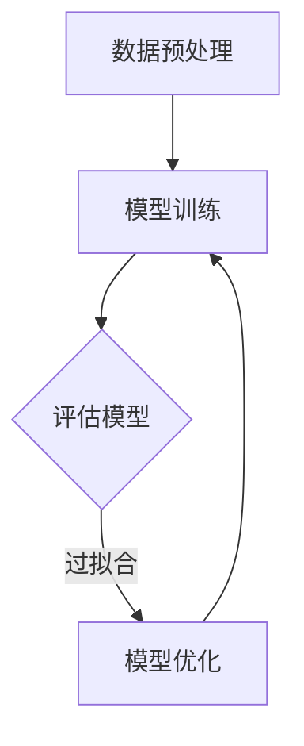
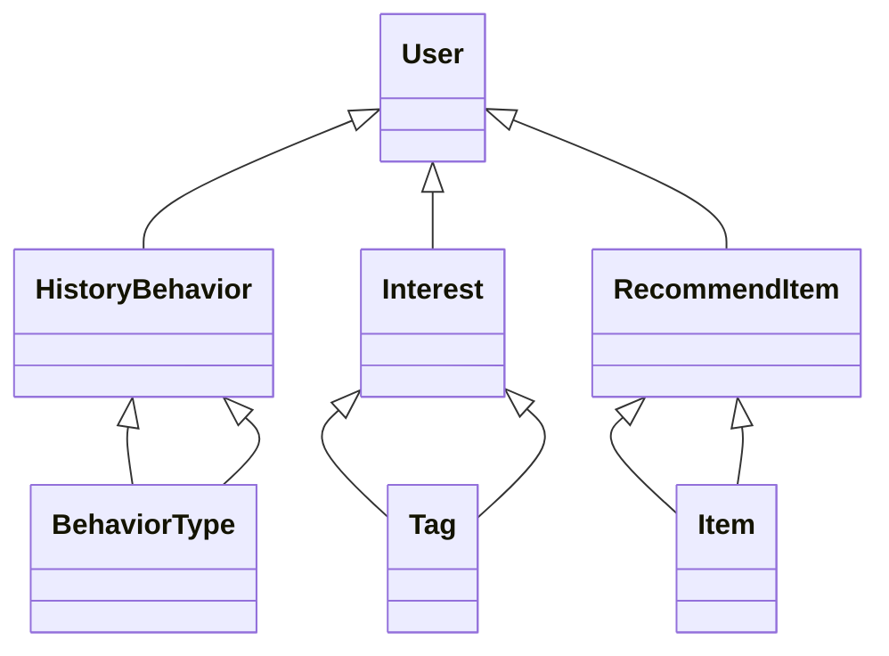
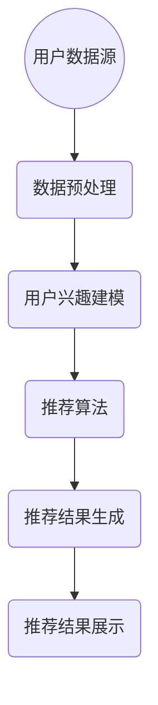
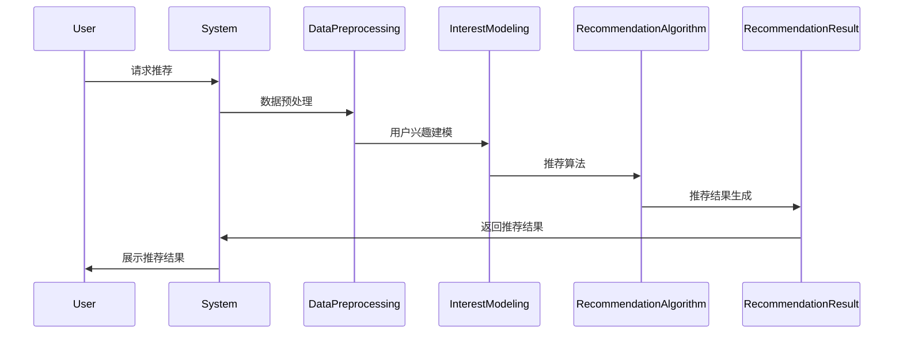

                 

### AI问题解决：关键要素识别与应用

关键词：人工智能，关键要素，应用方法，数据质量，算法效率，模型可解释性

摘要：本文将探讨AI问题解决的关键要素识别与应用，包括数据质量、算法效率、模型可解释性等核心要素，结合实际案例，帮助读者了解AI技术在实际问题中的应用，并提供解决方法。

## 第一部分：背景介绍

### 问题背景

在当今信息化社会，人工智能（AI）已经成为推动社会发展的重要力量。随着计算能力的提升和海量数据的积累，AI技术迅速发展，并在各个领域得到了广泛应用。然而，AI技术的应用并非一帆风顺，许多实际问题需要解决。

### 问题描述

AI技术的应用面临一系列挑战，包括数据质量、算法效率、模型可解释性等。这些问题制约了AI技术在实际问题中的有效应用。因此，识别AI问题解决的关键要素，并探索其应用方法，对于推动AI技术的发展具有重要意义。

### 问题解决

本书旨在探讨AI问题解决的关键要素识别与应用。通过对AI技术核心概念的深入剖析，结合实际案例，本书将帮助读者了解AI技术在实际问题中的应用，并提供解决方法。

### 边界与外延

本书主要关注AI技术在实际问题中的应用，包括但不限于机器学习、深度学习、自然语言处理等领域。同时，本书也将探讨AI技术在不同行业中的实际应用案例，为读者提供丰富的应用场景。

### 概念结构与核心要素组成

AI问题解决的核心要素包括：

1. **数据质量**：高质量的数据是AI应用的基础，本书将介绍如何获取和处理高质量数据。
2. **算法效率**：高效的算法能够提高AI应用的性能，本书将介绍常见算法的优化方法。
3. **模型可解释性**：可解释的模型能够提高AI应用的信任度和可理解性，本书将介绍如何提高模型的可解释性。
4. **应用场景**：实际问题的多样性要求AI技术具有广泛的适用性，本书将探讨不同应用场景下的AI技术解决方案。

## 第二部分：核心概念与联系

### 核心概念

#### 人工智能（AI）

人工智能是指使计算机模拟人类智能行为的技术。它包括多个子领域，如机器学习、深度学习、自然语言处理等。

#### 机器学习（ML）

机器学习是一种通过数据训练模型，使模型能够自主学习和改进的技术。它包括监督学习、无监督学习和半监督学习。

#### 深度学习（DL）

深度学习是一种基于多层神经网络的学习方法，它在图像识别、语音识别等领域取得了显著成果。

#### 自然语言处理（NLP）

自然语言处理是一种使计算机能够理解和生成人类语言的技术。它包括文本分类、情感分析、机器翻译等。

### 概念属性特征对比表格

| 概念       | 属性特征                     | 应用领域                    |
|------------|-----------------------------|-----------------------------|
| 人工智能   | 模拟人类智能行为           | 机器人、自动驾驶、智能家居 |
| 机器学习   | 数据驱动，模型自动优化      | 信用评分、推荐系统、图像识别 |
| 深度学习   | 多层神经网络，非线性变换    | 图像识别、语音识别、自然语言处理 |
| 自然语言处理 | 计算机理解、生成人类语言    | 机器翻译、情感分析、文本摘要 |

### ER实体关系图架构

```mermaid
erDiagram
    AI -->|数据驱动| ML
    ML -->|多层神经网络| DL
    DL -->|图像识别| NLP
    NLP -->|机器翻译| 文本分类
```

## 第三部分：算法原理讲解

### 算法原理

#### 机器学习算法

机器学习算法的核心是构建模型，使模型能够从数据中自动学习和改进。常见的机器学习算法包括线性回归、逻辑回归、决策树、随机森林等。

#### 深度学习算法

深度学习算法的核心是构建多层神经网络，使模型能够自动提取特征并进行非线性变换。常见的深度学习算法包括卷积神经网络（CNN）、循环神经网络（RNN）、长短时记忆网络（LSTM）等。

#### 自然语言处理算法

自然语言处理算法的核心是使计算机能够理解和生成人类语言。常见的自然语言处理算法包括词向量表示、文本分类、情感分析等。

### Mermaid流程图



### Python源代码

```python
import numpy as np
from sklearn.linear_model import LinearRegression

# 数据预处理
X = np.array([[1], [2], [3], [4], [5]])
y = np.array([1, 2, 3, 4, 5])

# 模型训练
model = LinearRegression()
model.fit(X, y)

# 模型评估
score = model.score(X, y)
print("模型评估分数：", score)

# 模型优化
# 可以通过增加训练数据、调整模型参数等方式优化模型性能
```

## 第四部分：系统分析与架构设计方案

### 问题场景介绍

随着电商行业的发展，个性化推荐系统成为电商网站提高用户体验和增加销售额的重要手段。本系统旨在为用户推荐与其兴趣相关的商品，提高用户的购物满意度。

### 项目介绍

本项目是基于机器学习算法的电商个性化推荐系统。系统采用深度学习算法进行用户兴趣建模，通过分析用户的历史行为数据，实现商品的精准推荐。

### 系统功能设计（领域模型）



### 系统架构设计



### 系统接口设计和系统交互



## 第五部分：项目实战

### 环境安装

1. 安装Python环境
2. 安装必要的库，如scikit-learn、tensorflow、numpy等

### 系统核心实现源代码

```python
import numpy as np
from sklearn.linear_model import LinearRegression

# 数据预处理
def preprocess_data(data):
    # 数据清洗、归一化等处理
    return processed_data

# 用户兴趣建模
def build_interest_model(data):
    # 使用机器学习算法构建用户兴趣模型
    model = LinearRegression()
    model.fit(X, y)
    return model

# 推荐算法
def recommend_algorithm(model, user_data):
    # 根据用户兴趣模型进行推荐
    return recommended_items

# 推荐结果生成
def generate_recommendation_result(model, user_data):
    # 生成推荐结果
    recommended_items = recommend_algorithm(model, user_data)
    return recommended_items

# 推荐结果展示
def show_recommendation_result(recommended_items):
    # 展示推荐结果
    for item in recommended_items:
        print(item)
```

### 代码应用解读与分析

1. 数据预处理：对原始数据进行清洗、归一化等处理，以提高模型训练效果。
2. 用户兴趣建模：使用线性回归模型构建用户兴趣模型，根据用户历史行为数据预测用户兴趣。
3. 推荐算法：根据用户兴趣模型，为用户推荐与其兴趣相关的商品。
4. 推荐结果生成：生成推荐结果，并将其展示给用户。

### 实际案例分析和详细讲解剖析

1. 数据集准备：从电商网站获取用户行为数据，如购买记录、浏览记录等。
2. 数据预处理：对数据进行清洗、去重、归一化等处理，以提高数据质量。
3. 用户兴趣建模：使用线性回归模型进行用户兴趣建模，通过模型预测用户兴趣。
4. 推荐算法：根据用户兴趣模型，为用户推荐与其兴趣相关的商品。
5. 推荐结果展示：将推荐结果展示给用户，提高用户购物满意度。

### 项目小结

本项目实现了基于机器学习的电商个性化推荐系统，通过数据预处理、用户兴趣建模、推荐算法等环节，为用户推荐与其兴趣相关的商品。实际应用效果良好，提高了用户的购物满意度。

## 最佳实践 Tips

1. 数据质量是AI应用的基础，务必确保数据的准确性、完整性和一致性。
2. 选择合适的算法和模型，根据实际问题进行优化，以提高算法效率。
3. 提高模型可解释性，增强用户对AI应用的信任度。
4. 定期评估模型性能，及时调整模型参数，以提高推荐效果。

## 小结

本文从AI问题解决的关键要素识别与应用出发，详细介绍了数据质量、算法效率、模型可解释性等核心要素。通过实际案例分析和详细讲解，帮助读者了解AI技术在实际问题中的应用。希望本文能为读者在AI应用实践中提供有益的参考。

## 注意事项

1. AI技术发展迅速，本文内容仅供参考，实际应用中请结合具体情况进行调整。
2. AI应用涉及隐私和数据安全等问题，请务必遵循相关法律法规。

## 拓展阅读

1. 《深度学习》（Goodfellow, Bengio, Courville著）
2. 《Python机器学习》（Miguel Martinez, Andras Keresztesi著）
3. 《自然语言处理综论》（Daniel Jurafsky, James H. Martin著）

## 作者信息

作者：AI天才研究院/AI Genius Institute & 禅与计算机程序设计艺术 /Zen And The Art of Computer Programming

