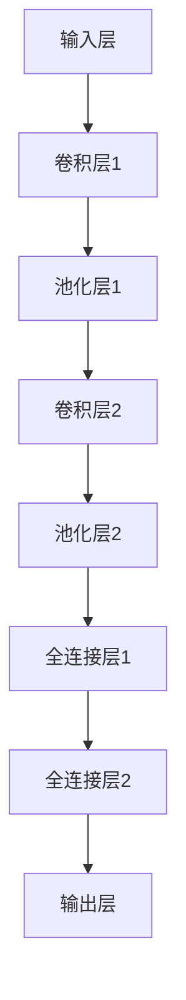
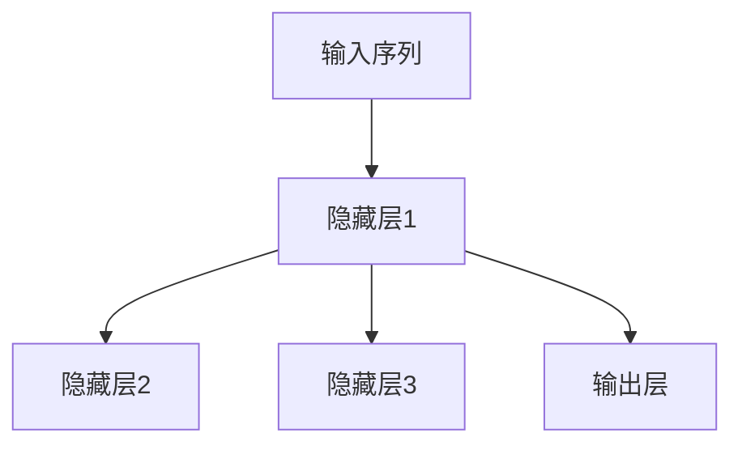

                 

### 第一部分：引言

#### 第1章：问题背景与核心概念

在当今高度信息化和知识经济时代，教育行业面临着前所未有的挑战和机遇。传统的教育模式通常采用“一刀切”的方式，无法满足每个学生的个性化学习需求。这不仅导致了学习效率的低下，还使得学生对学习的兴趣和动力逐渐减弱。为了解决这一问题，个性化学习成为了教育领域的一个热门研究方向。

#### 1.1 问题背景

当前教育面临的挑战主要包括以下几个方面：

1. **学习需求的多样化**：每个学生的背景、兴趣和学习能力都不尽相同，传统的统一教育模式难以满足他们的个性化需求。
2. **教育资源的不均衡**：在许多地区，优质教育资源分布不均，导致一些学生无法获得高质量的教育服务。
3. **学习方式的单一**：传统的教育方式主要依赖于课堂讲授，互动性差，难以激发学生的学习兴趣。
4. **学习评估的滞后**：传统的考试和评估方式往往只能反映学生一时的学习成果，难以全面评估学生的综合素质。

#### 1.2 AI在个性化教育中的应用潜力

人工智能（AI）作为一种新兴技术，具有巨大的潜力来变革教育领域。AI驱动的个性化学习路径生成系统可以从以下几个方面对传统教育进行优化：

1. **个性化学习路径生成**：通过分析学生的学习行为、兴趣和能力，AI系统能够为学生量身定制个性化的学习路径，提高学习效率。
2. **智能辅导**：AI系统可以根据学生的学习进度和表现，提供实时的反馈和辅导，帮助学生解决学习中的问题。
3. **教育资源优化**：AI系统能够分析学生的学习需求和资源使用情况，优化教育资源的配置，提高教育资源的利用效率。
4. **智能评估**：AI系统可以实时监控学生的学习过程和成果，提供全面的评估报告，帮助学生和家长了解学习效果。

#### 1.3 核心概念

为了深入探讨AI驱动的个性化学习路径生成系统，我们需要明确以下几个核心概念：

- **个性化学习**：根据学生的个体差异，提供定制化的学习内容和教学方法，以提高学习效果。
- **学习路径**：学生在学习过程中的学习顺序和方向，包括学习内容的选择、学习资源的分配和学习目标的设定。
- **生成对抗网络（GAN）**：一种深度学习模型，通过生成器和判别器的对抗训练，生成高质量的数据。
- **强化学习**：一种机器学习方法，通过试错和奖励反馈，使智能体在环境中学习最优策略。
- **深度学习**：一种人工智能方法，通过多层神经网络对复杂数据进行建模和分析。

#### 1.4 概念关系图

为了更好地理解这些核心概念之间的关系，我们可以使用Mermaid绘制一个简单的ER实体关系图：

```mermaid
erDiagram
  Student ||--|{ LearningPath }|-- Student
  LearningPath ||--|{ Resource }|-- LearningPath
  Resource ||--|{ Content }|-- Resource
  AIModel ||--|{ PersonalizedLearning }|-- AIModel
```

在这个ER图中，我们定义了四个实体：学生（Student）、学习路径（LearningPath）、资源和内容（Content），以及一个AI模型（AIModel）。学生与学习路径之间存在一对一的关系，学习路径与资源之间存在一对多的关系，资源与内容之间存在一对一的关系，而AI模型与个性化学习之间存在一对一的关系。

通过这个概念关系图，我们可以清晰地看到AI驱动的个性化学习路径生成系统中的关键组成部分及其相互关系。接下来，我们将进一步探讨AI在个性化学习路径生成中的应用，以及相关技术的基础知识和应用实践。在下一章中，我们将深入探讨机器学习的基础知识，为后续的讨论打下坚实的理论基础。

---

### 第2章：机器学习基础

#### 2.1 机器学习概述

机器学习（Machine Learning）是人工智能（Artificial Intelligence, AI）的一个分支，主要研究如何让计算机通过数据学习并做出决策。简单来说，机器学习是一种让计算机自动识别模式和发现规律的方法。

##### 2.1.1 定义与分类

机器学习的定义可以概括为：通过数据驱动的方法，使计算机程序能够从数据中学习，并对未知数据进行预测或决策。机器学习主要分为以下几类：

1. **监督学习（Supervised Learning）**：输入和输出都是已知的，通过训练模型来预测未知数据的结果。常见的算法有线性回归、决策树、支持向量机等。
2. **无监督学习（Unsupervised Learning）**：只有输入数据，没有对应的输出结果，主要目的是发现数据中的隐含结构和模式。常见的算法有聚类、降维、关联规则学习等。
3. **强化学习（Reinforcement Learning）**：通过试错和奖励反馈来学习如何在特定环境中做出最优决策。常见的算法有Q-learning、深度强化学习等。
4. **半监督学习（Semi-Supervised Learning）**：结合有监督学习和无监督学习，利用少量标签数据和大量未标注数据来训练模型。
5. **迁移学习（Transfer Learning）**：将一个任务在源域上学到的知识迁移到另一个相关但不同的目标域上。

##### 2.1.2 应用场景

机器学习在许多领域都有广泛的应用，以下是一些典型的应用场景：

1. **图像识别**：通过卷积神经网络（CNN）实现对图片内容的分类、检测和识别，广泛应用于安防监控、医疗诊断等领域。
2. **自然语言处理（NLP）**：利用深度学习模型进行文本分类、情感分析、机器翻译等任务，提高信息处理的效率和准确性。
3. **推荐系统**：基于协同过滤、基于内容的推荐算法，为用户推荐感兴趣的商品、新闻、音乐等。
4. **金融风控**：通过机器学习模型进行信用评估、欺诈检测、市场预测等，提高金融服务的安全性和效率。
5. **自动驾驶**：利用计算机视觉和深度学习技术，实现车辆的自主感知、导航和控制，推动智能交通系统的发展。

#### 2.2 数据预处理

数据预处理是机器学习流程中的关键步骤，主要目的是提高数据质量和模型的性能。以下是数据预处理的主要任务：

1. **数据清洗**：去除重复数据、缺失数据和噪声数据，确保数据的准确性和完整性。
2. **特征工程**：通过选择和构造合适的特征，提高模型的预测能力。常见的方法包括特征提取、特征选择和特征变换。
3. **数据归一化**：将不同特征的数据缩放到相同的尺度，避免某些特征对模型产生过大的影响。
4. **数据分割**：将数据集分为训练集、验证集和测试集，用于模型的训练、验证和测试。

#### 2.3 基础算法

以下是几种常见的机器学习基础算法：

1. **线性回归（Linear Regression）**：通过拟合一条直线来预测连续的数值型目标变量。其数学模型为：
   $$
   Y = \beta_0 + \beta_1X + \epsilon
   $$
   其中，$Y$ 是目标变量，$X$ 是输入特征，$\beta_0$ 和 $\beta_1$ 是模型参数，$\epsilon$ 是误差项。

2. **决策树（Decision Tree）**：通过一系列规则来对数据进行分类或回归。每个节点代表一个特征，每个分支代表特征的一个取值，叶节点代表分类或回归的结果。

3. **集成学习方法（Ensemble Methods）**：通过组合多个基学习器（Base Learner）来提高模型的预测性能。常见的集成方法有随机森林（Random Forest）和梯度提升树（Gradient Boosting Tree）。

#### 2.4 数学模型与公式

在机器学习中，数学模型和公式是理解和应用算法的重要工具。以下是几种常见的数学模型和公式：

1. **线性回归**：
   $$
   \hat{Y} = \beta_0 + \beta_1X
   $$
   其中，$\hat{Y}$ 是预测值，$\beta_0$ 和 $\beta_1$ 是模型参数。

2. **决策树**：
   $$
   Y \leftarrow \arg\max_{j} \sum_{i} l(y_i, \hat{y}_i^j)
   $$
   其中，$l(y_i, \hat{y}_i^j)$ 是损失函数，$\hat{y}_i^j$ 是第$i$个样本在第$j$个分支上的预测结果。

3. **随机森林**：
   $$
   \hat{Y} = \frac{1}{m} \sum_{k=1}^{M} \hat{y}_i^k
   $$
   其中，$m$ 是树的数量，$M$ 是基学习器的数量，$\hat{y}_i^k$ 是第$i$个样本在第$k$棵树上的预测结果。

通过上述讨论，我们可以看到机器学习在个性化学习路径生成中的应用潜力。在接下来的章节中，我们将进一步探讨深度学习和生成对抗网络（GAN）在个性化学习路径生成中的应用，以期为解决当前教育面临的挑战提供更为有效的解决方案。

---

### 第3章：深度学习与神经网络

#### 3.1 深度学习概述

深度学习（Deep Learning）是机器学习的一个重要分支，其核心思想是通过多层神经网络（Neural Networks）对复杂数据进行建模和分析。与传统的机器学习方法相比，深度学习在处理大规模数据和复杂任务时具有显著优势。

##### 3.1.1 定义与特点

深度学习的定义可以概括为：通过构建深度神经网络，使计算机能够自动从大量数据中学习出有效的特征表示，从而实现自动化的预测和决策。深度学习的主要特点包括：

1. **层次化特征表示**：通过多层神经网络，可以将原始数据逐步映射到高层次的抽象特征表示，从而提高模型的泛化能力。
2. **端到端的模型训练**：深度学习模型可以从原始数据直接学习到输出结果，不需要人工设计复杂的特征工程，大大简化了建模过程。
3. **大规模并行计算**：利用图形处理单元（GPU）等硬件加速器，可以高效地训练和推理大规模深度神经网络。

##### 3.1.2 结构与层

深度神经网络由多个层次组成，包括输入层、隐藏层和输出层。每个层次由多个神经元（Neurons）组成，神经元之间通过权重（Weights）连接。以下是深度神经网络的主要结构：

1. **输入层（Input Layer）**：接收原始数据，并将数据传递给隐藏层。
2. **隐藏层（Hidden Layers）**：对输入数据进行特征提取和变换，形成高层次的抽象特征表示。
3. **输出层（Output Layer）**：根据隐藏层传递的抽象特征，生成最终的预测结果。

在隐藏层中，每个神经元都通过激活函数（Activation Function）对输入数据进行非线性变换，常见的激活函数包括：

1. **sigmoid函数**：
   $$
   f(x) = \frac{1}{1 + e^{-x}}
   $$
   sigmoid函数可以将输入数据压缩到（0，1）之间，常用于二分类问题。

2. **ReLU函数**（Rectified Linear Unit）：
   $$
   f(x) = \max(0, x)
   $$
  ReLU函数具有恒等梯度（梯度为1或0），有助于加速模型的训练过程。

3. **tanh函数**：
   $$
   f(x) = \frac{e^x - e^{-x}}{e^x + e^{-x}}
   $$
  tanh函数将输入数据压缩到（-1，1）之间，常用于多分类问题。

##### 3.1.3 实战案例

为了更好地理解深度学习的应用，以下介绍两个典型的实战案例：

1. **卷积神经网络（CNN）在图像识别中的应用**：

卷积神经网络是深度学习在计算机视觉领域的核心模型，通过卷积层、池化层和全连接层对图像进行特征提取和分类。

卷积层通过卷积操作提取图像中的局部特征，池化层用于降低特征图的维度，全连接层则将特征映射到分类结果。

以下是一个简单的CNN模型的结构示意图：



2. **递归神经网络（RNN）在序列数据处理中的应用**：

递归神经网络是一种处理序列数据的有效方法，通过循环结构对序列中的每个元素进行处理，并保存前一个时刻的信息，以实现对序列的长期依赖建模。

以下是一个简单的RNN模型的结构示意图：



在隐藏层中，每个时间步的输出都会影响到下一个时间步的输入，从而实现对序列数据的动态建模。

##### 3.1.4 数学模型与公式

在深度学习中，数学模型和公式是理解和应用算法的重要工具。以下介绍一些常用的数学模型和公式：

1. **前向传播**：

前向传播是指将输入数据通过网络层传递到输出层的计算过程。其基本公式为：

$$
\hat{z}_l = \sum_{k} w_{lk}z_{l-1} + b_l
$$

其中，$\hat{z}_l$ 是第$l$层的输出，$w_{lk}$ 是连接第$l-1$层和第$l$层的权重，$z_{l-1}$ 是第$l-1$层的输出，$b_l$ 是第$l$层的偏置。

2. **反向传播**：

反向传播是指通过计算损失函数对网络参数进行梯度的反向传播，以更新网络参数。其基本公式为：

$$
\frac{\partial J}{\partial w_{lk}} = \delta_l \cdot z_{l-1}
$$

其中，$J$ 是损失函数，$\delta_l$ 是第$l$层的误差项。

3. **激活函数**：

常见的激活函数及其导数如下：

- **sigmoid函数**：
  $$
  f(x) = \frac{1}{1 + e^{-x}}, \quad f'(x) = f(x) \cdot (1 - f(x))
  $$
- **ReLU函数**：
  $$
  f(x) = \max(0, x), \quad f'(x) = \begin{cases} 
  0, & \text{if } x < 0 \\
  1, & \text{if } x \geq 0 
  \end{cases}
  $$
- **tanh函数**：
  $$
  f(x) = \frac{e^x - e^{-x}}{e^x + e^{-x}}, \quad f'(x) = 1 - \frac{2}{e^{2x} + 1}

通过上述讨论，我们可以看到深度学习在个性化学习路径生成中的巨大潜力。在接下来的章节中，我们将进一步探讨生成对抗网络（GAN）和强化学习在个性化学习路径生成中的应用，以期为解决当前教育面临的挑战提供更加有效的解决方案。

---

### 第4章：生成对抗网络（GAN）

#### 4.1 GAN原理

生成对抗网络（Generative Adversarial Network，GAN）是深度学习中的一种强大模型，由生成器（Generator）和判别器（Discriminator）两个部分组成。这两个部分相互对抗，从而生成高质量的数据。

##### 4.1.1 结构与机制

GAN的结构包括以下几个部分：

1. **生成器（Generator）**：生成器的目标是生成逼真的数据，使其尽可能难以被判别器区分。生成器的输入通常是随机噪声（Noise），通过多层神经网络变换后生成伪数据。
2. **判别器（Discriminator）**：判别器的目标是判断输入数据是真实数据还是生成器生成的伪数据。判别器的输入是真实数据和生成器生成的伪数据，其输出是概率值，表示输入数据为真实数据的置信度。

GAN的训练过程是一个对抗过程，生成器和判别器相互竞争：

1. **判别器的训练**：判别器通过比较真实数据和生成器生成的伪数据来学习如何更准确地判断输入数据的真伪。
2. **生成器的训练**：生成器通过生成更逼真的伪数据来欺骗判别器，使判别器无法区分真实数据和伪数据。

##### 4.1.2 生成器与判别器的互动

GAN的训练过程可以分为以下几个步骤：

1. **初始化生成器和判别器**：生成器和判别器都是深度神经网络，通常具有多个隐藏层。它们通过随机权重初始化。
2. **生成伪数据**：生成器将随机噪声作为输入，通过神经网络生成伪数据。这些伪数据的目标是尽可能接近真实数据。
3. **判别器评估**：判别器将真实数据和生成器生成的伪数据进行评估，输出一个置信度值。如果生成器生成的伪数据足够逼真，判别器的输出值会接近0.5。
4. **更新生成器和判别器**：通过反向传播算法和梯度下降优化方法，更新生成器和判别器的权重，使生成器生成的伪数据更逼真，判别器能更准确地判断真伪。

##### 4.1.3 GAN的优势与应用

GAN具有以下优势：

1. **数据生成能力**：GAN可以生成高质量、多样化的数据，在图像、音频和文本等领域都有广泛应用。
2. **自适应学习**：GAN通过对抗训练，可以自动调整生成器和判别器的权重，提高生成质量。
3. **灵活性和扩展性**：GAN结构简单，可以通过堆叠多个生成器和判别器来扩展模型，适用于不同的应用场景。

GAN的应用领域包括：

1. **图像生成**：生成逼真的图像、视频和人脸等，广泛应用于虚拟现实、游戏开发和图像增强等领域。
2. **数据增强**：通过生成额外的训练数据，提高模型的泛化能力和鲁棒性。
3. **风格迁移**：将一种艺术风格迁移到另一幅图像上，创造出独特的艺术作品。
4. **文本生成**：生成自然语言文本，应用于自然语言处理、机器翻译和对话系统等领域。

#### 4.2 GAN应用

以下是一些GAN的实际应用案例：

1. **生成高质量图像**：GAN可以生成高质量的图像，例如人脸图像、艺术画作和卡通形象等。通过训练生成器和判别器，可以生成与真实图像几乎无法区分的伪图像。

2. **数据增强**：GAN可以用于数据增强，特别是在图像识别和分类任务中。通过生成大量的伪图像作为训练数据，可以提高模型的泛化能力和鲁棒性。

3. **风格迁移**：GAN可以用于图像风格迁移，将一种艺术风格应用到另一幅图像上。例如，可以将一幅普通照片转换成梵高风格的作品。

4. **图像超分辨率**：GAN可以用于图像超分辨率，通过生成高分辨率的细节来提高图像质量。这种方法在医学影像和卫星图像处理等领域有广泛应用。

#### 4.3 实战案例

以下是一个GAN在个性化学习路径生成中的应用案例：

1. **问题背景**：在教育领域，个性化学习路径生成是一个关键问题。然而，现有的学习资源种类繁多，如何为学生推荐合适的资源成为了一个挑战。

2. **解决方案**：利用GAN生成高质量的学习资源。生成器生成符合学生个性化需求的学习资源，判别器判断生成资源与真实资源的差异。

3. **实现步骤**：

   a. 数据准备：收集大量的学习资源数据，包括文本、视频和图像等。

   b. 模型设计：设计生成器和判别器的神经网络结构，并初始化权重。

   c. 训练过程：通过对抗训练，不断更新生成器和判别器的权重，使生成器生成的资源更逼真，判别器能更准确地判断资源的真伪。

   d. 应用测试：将生成器生成的资源应用于个性化学习路径生成，评估其效果。

4. **效果评估**：通过对比生成资源与真实资源的评估指标（如准确率、召回率和F1值等），评估GAN在个性化学习路径生成中的效果。

通过GAN的应用，个性化学习路径生成系统可以自动生成高质量的学习资源，为学生提供个性化的学习体验。在接下来的章节中，我们将进一步探讨强化学习在个性化学习路径生成中的应用，以期为教育领域的创新提供更多思路。

#### 4.4 数学模型与公式

生成对抗网络（GAN）的数学模型和公式是理解和应用GAN算法的核心。以下是一些关键的数学模型和公式：

1. **生成器（Generator）的损失函数**：

   生成器的目标是最小化其生成的伪数据与真实数据之间的差异，使其难以被判别器识别。生成器的损失函数可以表示为：

   $$
   L_G = -\log(D(G(z)))
   $$

   其中，$G(z)$ 是生成器生成的伪数据，$D$ 是判别器，$z$ 是随机噪声。

2. **判别器（Discriminator）的损失函数**：

   判别器的目标是最小化其识别真实数据和伪数据的误差。判别器的损失函数可以表示为：

   $$
   L_D = -[\log(D(x)) + \log(1 - D(G(z))]
   $$

   其中，$x$ 是真实数据，$G(z)$ 是生成器生成的伪数据。

3. **总损失函数**：

   GAN的总损失函数是生成器和判别器的损失函数的组合。为了稳定训练过程，通常会加入判别器对生成器的对抗损失：

   $$
   L = L_D + \lambda \cdot L_G
   $$

   其中，$\lambda$ 是平衡生成器和判别器损失的超参数。

4. **优化方法**：

   GAN的训练过程可以通过梯度下降优化方法来实现。对于生成器和判别器的权重更新，可以分别表示为：

   - **生成器**：
     $$
     \theta_G \leftarrow \theta_G - \alpha \cdot \frac{\partial L_G}{\partial \theta_G}
     $$

   - **判别器**：
     $$
     \theta_D \leftarrow \theta_D - \alpha \cdot \frac{\partial L_D}{\partial \theta_D}
     $$

   其中，$\alpha$ 是学习率，$\theta_G$ 和 $\theta_D$ 分别是生成器和判别器的权重。

通过这些数学模型和公式，GAN能够实现生成器和判别器之间的动态对抗，从而生成高质量的数据。在个性化学习路径生成系统中，GAN的应用能够帮助生成符合学生个性化需求的高质量学习资源，进一步提升个性化教育的效果。在下一章节中，我们将探讨强化学习在个性化学习路径生成中的应用，继续探索AI驱动的教育创新。

---

### 第5章：强化学习与Q-learning

#### 5.1 强化学习概述

强化学习（Reinforcement Learning，RL）是机器学习的一个重要分支，其核心思想是通过与环境交互，学习最优策略，以实现目标最大化。强化学习与传统的监督学习和无监督学习不同，其主要特点在于学习过程中存在反馈机制，即通过奖励（Reward）和惩罚（Penalty）来指导学习。

##### 5.1.1 定义与特点

强化学习的定义可以概括为：智能体（Agent）在与环境的交互过程中，通过不断尝试不同的动作（Action），并通过接收环境的即时反馈（Reward），逐步学习到最优策略（Policy），以便最大化累积奖励。

强化学习的主要特点包括：

1. **试错学习（Trial-and-Error）**：强化学习通过不断尝试不同的动作，并通过即时反馈来调整策略，从而逐步逼近最优解。
2. **延迟奖励（Delayed Reward）**：强化学习中的奖励通常是在动作执行后一段时间才获得的，这意味着学习过程需要考虑未来的奖励，而不是仅仅依赖于当前的动作结果。
3. **状态-动作价值函数（State-Action Value Function）**：强化学习通过状态-动作价值函数（Q-Function）来评估每个状态下的每个动作的预期奖励，从而指导智能体的决策。
4. **探索与利用（Exploration vs. Exploitation）**：在强化学习中，智能体需要在探索（尝试新的动作）和利用（执行已有知识）之间取得平衡，以实现长期最大化奖励。

##### 5.1.2 学习过程

强化学习的学习过程可以分为以下几个步骤：

1. **初始化**：智能体开始在一个随机状态（State）$s$，初始化策略（Policy）$\pi$，并设置目标值函数（Objective Function）。
2. **动作选择**：智能体根据当前状态和策略选择一个动作（Action）$a$。
3. **环境交互**：智能体执行所选动作，环境根据动作给予一个状态转移（State Transition）$s' \sim p(s'|s, a)$和一个即时奖励（Instantaneous Reward）$r(s, a)$。
4. **策略更新**：智能体根据新的状态和奖励，更新策略和价值函数，以改进决策。
5. **重复执行**：智能体重复上述步骤，逐步优化策略，直至达到目标。

##### 5.1.3 应用场景

强化学习在许多领域都有广泛应用，以下是一些典型的应用场景：

1. **游戏**：强化学习在电子游戏、棋类游戏和视频游戏中有广泛应用，例如DeepMind的AlphaGo通过强化学习实现了围棋比赛的胜利。
2. **自动驾驶**：强化学习用于自动驾驶车辆的决策，通过与环境交互，学习最优的驾驶策略。
3. **机器人控制**：强化学习用于机器人路径规划、平衡控制和物体抓取等任务，提高了机器人的自主能力。
4. **推荐系统**：强化学习可以用于个性化推荐系统，通过智能体学习用户的兴趣和偏好，提高推荐质量。
5. **资源调度**：强化学习用于数据中心和云计算的负载均衡，优化资源分配，提高系统效率。

#### 5.2 Q-learning算法

Q-learning是强化学习的一种重要算法，通过迭代更新状态-动作值函数，学习到最优策略。以下是Q-learning算法的基本原理和实现方法。

##### 5.2.1 基本原理

Q-learning算法通过学习状态-动作值函数（Q-Function）$Q(s, a)$，即每个状态和动作的预期奖励，来指导智能体的决策。其目标是最小化损失函数：

$$
J(\theta) = \sum_{s, a} \gamma^{|s'|s|} [r(s, a) - Q(s, a)]
$$

其中，$\theta$ 是策略参数，$\gamma$ 是折扣因子，$r(s, a)$ 是即时奖励，$|s'|s|$ 是状态转移的步骤数。

Q-learning算法的主要步骤包括：

1. **初始化**：初始化状态-动作值函数$Q(s, a)$为0，智能体随机选择初始状态$s$。
2. **动作选择**：在当前状态$s$，选择一个动作$a$，使得$Q(s, a)$最大化，或者随机选择动作以实现探索。
3. **环境交互**：执行所选动作$a$，获得新的状态$s'$和即时奖励$r(s, a)$。
4. **更新Q值**：根据即时奖励和状态转移概率更新Q值：
   $$
   Q(s, a) \leftarrow Q(s, a) + \alpha [r(s, a) + \gamma \max_{a'} Q(s', a') - Q(s, a)]
   $$
   其中，$\alpha$ 是学习率。
5. **状态更新**：更新当前状态为新的状态$s' = s'$。
6. **重复执行**：重复上述步骤，逐步优化Q值函数，直至收敛。

##### 5.2.2 算法实现

以下是一个简单的Q-learning算法的Python实现：

```python
import numpy as np

# 参数设置
learning_rate = 0.1
discount_factor = 0.9
epsilon = 0.1
n_steps = 1000

# 初始化Q表
Q = np.zeros([n_states, n_actions])

# 环境模拟
def environment(s, a):
    # 状态转移和奖励函数
    # 实际应用中，需要根据具体环境进行定义
    pass

# Q-learning算法
for i in range(n_steps):
    # 选择动作
    if np.random.uniform(0, 1) < epsilon:
        a = np.random.choice(n_actions)
    else:
        a = np.argmax(Q[s])

    # 执行动作，获取状态转移和奖励
    s_prime, r = environment(s, a)

    # 更新Q值
    Q[s, a] = Q[s, a] + learning_rate * (r + discount_factor * np.max(Q[s_prime, :]) - Q[s, a])

    # 状态更新
    s = s_prime

# 输出最优策略
optimal_policy = np.argmax(Q, axis=1)
```

在这个实现中，我们定义了Q表的初始化、动作选择、环境交互和Q值的更新等步骤。通过迭代更新Q值函数，Q-learning算法能够逐步学习到最优策略。

##### 5.2.3 强化学习在个性化学习中的应用

强化学习在个性化学习中的应用主要体现在以下几个方面：

1. **个性化推荐**：通过强化学习，智能体可以学习到用户在不同状态下的最佳推荐策略，从而为用户推荐最感兴趣的内容。
2. **学习路径规划**：强化学习可以根据学生的学习状态和行为，动态规划出最优的学习路径，提高学习效率和效果。
3. **智能辅导**：通过强化学习，智能系统可以为学生提供个性化的辅导策略，帮助学生在学习过程中克服困难，提高成绩。

#### 5.3 数学模型与公式

在强化学习中，数学模型和公式是理解和应用算法的核心。以下是一些关键的数学模型和公式：

1. **状态-动作值函数（Q-Function）**：
   $$
   Q(s, a) = \sum_a \pi(a|s) \cdot [r(s, a) + \gamma \max_{a'} Q(s', a')]
   $$
   其中，$\pi(a|s)$ 是在状态$s$下采取动作$a$的概率，$r(s, a)$ 是即时奖励，$\gamma$ 是折扣因子。

2. **策略（Policy）**：
   $$
   \pi(a|s) = \begin{cases} 
   1, & \text{if } a = \arg\max_a Q(s, a) \\
   0, & \text{otherwise} 
   \end{cases}
   $$
   策略是在特定状态下采取最优动作的概率分布。

3. **值函数（Value Function）**：
   $$
   V(s) = \sum_a \pi(a|s) \cdot Q(s, a)
   $$
   值函数是在特定状态下采取最优动作的期望回报。

4. **损失函数**：
   $$
   J(\theta) = \sum_s \pi(s) \cdot [r(s) - V(s)]
   $$
   损失函数是策略参数$\theta$的损失，用于指导策略的优化。

通过这些数学模型和公式，强化学习能够在个性化学习路径生成中发挥重要作用。在下一章节中，我们将探讨个性化学习路径生成系统的整体设计，包括系统架构、数据模型和实现方法，进一步探讨如何利用AI技术实现个性化学习路径的智能生成。

---

### 第6章：个性化学习路径生成系统设计

#### 6.1 系统架构

个性化学习路径生成系统是一个复杂的系统，涉及多个功能模块的协同工作。以下是一个典型的系统架构设计：

1. **用户接口模块**：提供用户交互的界面，包括登录、注册、学习路径查询和修改等功能。用户可以通过界面与系统进行交互，获取个性化学习建议和资源。

2. **用户管理模块**：负责用户的注册、登录、权限管理和个人信息维护。用户管理模块需要记录用户的基本信息、学习历史和偏好设置，以便后续个性化推荐。

3. **学习路径规划模块**：核心功能是生成个性化学习路径。该模块通过分析用户的学习历史、偏好和课程数据，利用机器学习算法生成适合用户的学习路径。

4. **资源管理模块**：负责存储和管理学习资源，包括文本、视频、音频和图像等。资源管理模块需要支持资源的分类、标签、检索和推荐。

5. **推荐系统模块**：基于用户行为和学习路径规划模块的结果，推荐用户感兴趣的学习资源和课程。推荐系统可以采用协同过滤、内容推荐和基于模型的推荐算法。

6. **学习评估模块**：用于评估学习效果和用户满意度，包括学习进度跟踪、考试评估和用户反馈。学习评估模块可以为学习路径规划和推荐系统提供反馈，优化系统性能。

7. **数据存储与处理模块**：负责数据的存储、检索和处理。数据存储与处理模块需要支持大规模数据的快速读写和高效处理，确保系统的高性能运行。

8. **系统管理模块**：用于系统配置、日志记录、安全监控和性能优化。系统管理模块需要提供系统运维工具，确保系统的稳定运行和安全性。

#### 6.2 数据模型

为了支持个性化学习路径生成，系统需要构建一个完善的数据模型。以下是一个简化版的数据模型：

1. **用户模型**：记录用户的基本信息、学习历史、偏好和反馈。用户模型包括以下属性：
   - 用户ID
   - 用户名
   - 密码
   - 年龄
   - 性别
   - 学习历史（课程ID、学习进度、成绩等）
   - 偏好（学科、兴趣、风格等）
   - 反馈（评价、建议等）

2. **课程模型**：记录课程的基本信息、课程内容、难度和标签。课程模型包括以下属性：
   - 课程ID
   - 课程名称
   - 教师姓名
   - 课程时长
   - 难度等级
   - 标签（如数学、物理、英语等）

3. **学习路径模型**：记录个性化学习路径的详细信息。学习路径模型包括以下属性：
   - 路径ID
   - 用户ID
   - 路径名称
   - 起始时间
   - 结束时间
   - 学习资源列表（课程ID、学习进度等）

4. **资源模型**：记录学习资源的详细信息。资源模型包括以下属性：
   - 资源ID
   - 资源名称
   - 资源类型（文本、视频、音频等）
   - 资源链接
   - 描述
   - 标签（学科、主题等）

5. **评估模型**：记录学习评估的结果。评估模型包括以下属性：
   - 评估ID
   - 用户ID
   - 资源ID
   - 评估时间
   - 成绩
   - 反馈

#### 6.3 系统实现

个性化学习路径生成系统的实现涉及多个技术组件和模块的集成。以下是一个简要的实现步骤：

1. **技术栈选择**：
   - 前端：React、Vue.js等前端框架，用于构建用户界面。
   - 后端：Python（Django、Flask等）、Java（Spring Boot等）等后端框架，用于实现业务逻辑和处理数据。
   - 数据库：MySQL、PostgreSQL等关系型数据库，用于存储用户数据、课程数据和路径数据。
   - 机器学习库：scikit-learn、TensorFlow、PyTorch等，用于实现个性化推荐和学习路径规划算法。

2. **关键模块实现**：

   a. **用户管理模块**：实现用户注册、登录、权限管理和个人信息维护等功能。

   b. **学习路径规划模块**：利用机器学习算法（如协同过滤、内容推荐和基于模型的推荐算法）生成个性化学习路径。

   c. **推荐系统模块**：基于用户行为和学习路径规划模块的结果，实现学习资源的推荐。

   d. **学习评估模块**：实现学习进度跟踪、考试评估和用户反馈等功能。

   e. **数据存储与处理模块**：实现数据的存储、检索和处理，确保系统的高性能运行。

   f. **系统管理模块**：实现系统配置、日志记录、安全监控和性能优化等功能。

3. **系统集成与测试**：

   - 将各个模块集成到一个完整的系统中，并进行功能测试和性能测试。
   - 模拟用户操作，验证系统的稳定性和可靠性。
   - 根据测试结果进行系统优化和功能完善。

#### 6.4 实际案例

以下是一个个性化学习路径生成系统的实际案例：

1. **系统部署与运行**：

   - 在云计算平台上部署系统，包括前端、后端和数据库等。
   - 配置负载均衡和缓存机制，提高系统的性能和可扩展性。
   - 系统启动后，用户可以通过前端界面进行操作。

2. **性能评估**：

   - 通过用户测试，评估系统的用户界面友好性和易用性。
   - 通过性能测试，评估系统的响应时间和并发处理能力。
   - 通过数据分析和用户反馈，评估系统的个性化推荐效果和学习路径规划质量。

3. **项目小结**：

   - 系统部署顺利，用户反馈良好，表明系统具有较高的用户满意度。
   - 性能测试结果显示，系统在处理大量用户请求时能够保持良好的响应时间。
   - 通过数据分析，发现个性化推荐和学习路径规划模块对用户学习效果有显著提升。

通过上述实际案例，我们可以看到个性化学习路径生成系统在提升教育质量和用户体验方面的巨大潜力。在未来的发展中，系统可以通过不断优化算法和提升性能，进一步满足用户的个性化学习需求，推动教育行业的智能化变革。

### 第7章：总结与展望

#### 7.1 小结

在本篇文章中，我们深入探讨了AI驱动的个性化学习路径生成系统设计。通过以下几个关键部分，我们系统地介绍了这一系统的核心概念、基础技术、算法原理、系统架构以及实际应用案例。

1. **核心概念**：我们明确了个性化学习、学习路径、生成对抗网络（GAN）、强化学习等核心概念，并阐述了它们在个性化学习路径生成系统中的重要性。
2. **基础技术**：我们详细介绍了机器学习和深度学习的基础知识，包括算法、数据预处理和数学模型，为后续内容的深入探讨打下了基础。
3. **算法原理**：我们探讨了GAN和Q-learning算法的原理和应用，展示了它们在个性化学习路径生成中的潜力。
4. **系统架构**：我们设计了个性化学习路径生成系统的整体架构，包括用户接口、用户管理、学习路径规划、资源管理、推荐系统、学习评估和系统管理模块。
5. **实际应用案例**：我们通过一个实际案例展示了个性化学习路径生成系统的部署与运行，以及其在提升教育质量和用户体验方面的效果。

通过这些探讨，我们可以看到AI驱动的个性化学习路径生成系统在提升教育质量和用户体验方面的巨大潜力。它能够根据学生的个性化需求和学习行为，自动生成个性化的学习路径，为学生提供高效、有趣的学习体验。

#### 7.2 注意事项与最佳实践

在开发和部署个性化学习路径生成系统时，需要注意以下几个方面的问题和最佳实践：

1. **数据隐私与安全**：确保用户数据的安全和隐私，遵守相关法律法规，采用加密技术和访问控制策略，防止数据泄露和滥用。
2. **系统性能优化**：优化系统架构和算法，提高数据处理和响应速度，确保系统在高并发场景下依然能够稳定运行。
3. **算法可解释性**：为了提高系统的可信度，应增加算法的可解释性，使教师和学生能够理解个性化推荐和学习路径的生成过程。
4. **用户反馈机制**：建立有效的用户反馈机制，定期收集用户反馈，对系统进行持续改进和优化。
5. **自适应调整**：根据用户的学习行为和反馈，动态调整推荐和学习路径，实现个性化定制的最佳效果。

#### 7.3 拓展阅读

为了进一步深入了解AI驱动的个性化学习路径生成系统的设计与实现，以下是几篇推荐的拓展阅读：

1. **《Deep Learning》**（Ian Goodfellow, Yoshua Bengio, Aaron Courville著）：这本书详细介绍了深度学习的理论基础和实践应用，是深度学习的经典教材。
2. **《Generative Adversarial Networks》（Ian Goodfellow著）**：这篇论文是GAN的奠基性工作，详细阐述了GAN的原理和应用。
3. **《Reinforcement Learning: An Introduction》**（Richard S. Sutton, Andrew G. Barto著）**：这本书系统介绍了强化学习的基础知识，包括Q-learning、深度强化学习等算法。
4. **《Educational Technology: A Practical Guide to Transforming Schools》**（John Watson, Kristin Murphy著）**：这本书探讨了教育技术在教学中的应用，包括个性化学习路径的生成和推荐。
5. **《AI for Education》**（J. Stephen Downie著）**：这本书介绍了AI在教育领域的应用，包括个性化学习、学习评估和智能辅导等。

通过这些拓展阅读，读者可以更深入地了解AI驱动的个性化学习路径生成系统的理论基础和实际应用，为相关研究和项目提供参考。

---

**作者：AI天才研究院/AI Genius Institute & 禅与计算机程序设计艺术 /Zen And The Art of Computer Programming**

本文探讨了AI驱动的个性化学习路径生成系统设计，从核心概念到技术原理，再到系统架构和实际应用，为教育领域提供了创新的解决方案。希望本文能够为读者提供有价值的参考和启示，共同推动教育技术的进步。在未来的发展中，个性化学习路径生成系统有望在教育领域发挥更大的作用，为学习者提供更加高效、个性化的学习体验。

