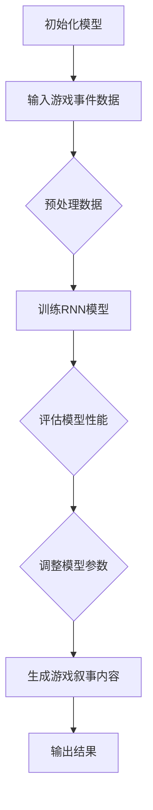
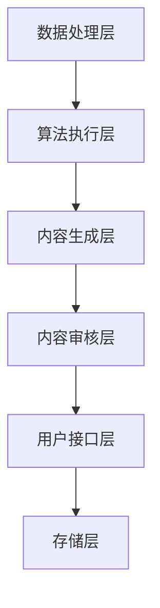
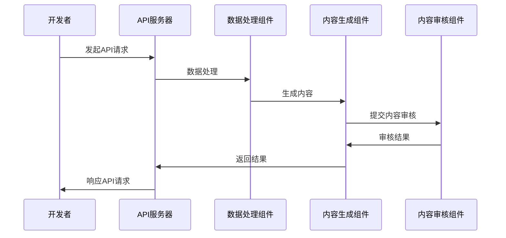

                 

### 文章标题：AI驱动的游戏叙事生成：互动故事的新范式

在当今技术飞速发展的时代，人工智能（AI）正逐渐成为各行各业变革的驱动力。游戏行业也不例外，AI技术的引入不仅提升了游戏的可玩性和沉浸感，更为游戏叙事带来了前所未有的变革。本文将探讨AI驱动的游戏叙事生成，通过分析其背景、挑战、核心技术、算法原理以及系统架构，揭示互动故事新范式的潜力和前景。

### 关键词

- 人工智能（AI）
- 游戏叙事
- 互动故事
- 算法原理
- 系统架构

### 摘要

本文旨在探讨AI驱动的游戏叙事生成，详细分析了这一新兴领域的问题背景、核心技术、算法原理和系统架构。通过深入剖析，本文揭示了AI在游戏叙事生成中的关键作用，展望了其未来的发展趋势，并提出了相关的最佳实践和建议。

## 目录大纲

### 第一部分：AI驱动的游戏叙事生成概述

#### 第1章：问题背景与概述
1.1 问题背景
1.2 问题描述
1.3 问题解决
1.4 概念结构与核心要素组成

#### 第2章：核心概念与联系
2.1 游戏叙事的核心概念
2.2 AI技术的核心概念
2.3 AI与游戏叙事的联系

#### 第3章：算法原理讲解
3.1 游戏叙事生成算法概述
3.2 算法原理详细讲解

#### 第4章：数学模型与公式
4.1 数学模型概述
4.2 数学公式详细讲解

#### 第5章：系统分析与架构设计
5.1 问题场景介绍
5.2 系统架构设计
5.3 系统接口设计与交互

#### 第6章：项目实战
6.1 环境安装与配置
6.2 系统核心实现
6.3 代码应用解读与分析
6.4 实际案例分析与讲解

#### 第7章：最佳实践与总结
7.1 最佳实践技巧
7.2 小结与展望

### 第一部分：AI驱动的游戏叙事生成概述

#### 第1章：问题背景与概述

### 1.1 问题背景

随着游戏行业的不断发展，游戏叙事逐渐成为吸引玩家的重要因素之一。然而，传统的游戏叙事方法存在一定的局限性，如叙事线单一、角色互动有限等。这种局限性不仅降低了玩家的游戏体验，也限制了游戏创意的表达。在此背景下，人工智能（AI）技术的引入为游戏叙事带来了新的机遇和挑战。

首先，AI技术能够通过自然语言处理（NLP）和机器学习算法，生成丰富多样、具有个性化的游戏叙事内容。这种生成内容不仅能够提高游戏的可玩性和互动性，还可以根据玩家的行为和选择动态调整叙事路径，从而提供更为个性化的游戏体验。

其次，AI技术可以模拟复杂的社会关系和角色心理，创造更为真实和丰富的游戏世界。通过深度学习模型和强化学习算法，游戏中的角色能够表现出更为智能和自然的决策行为，使游戏叙事更加引人入胜。

然而，AI驱动游戏叙事生成也面临着一些挑战。首先是如何确保生成的叙事内容符合道德和伦理标准，避免出现不当或有害的内容。其次是如何平衡生成内容的多样性与一致性，确保叙事逻辑的连贯性。此外，AI技术的计算成本和资源消耗也是一个需要解决的问题。

### 1.2 问题描述

在游戏叙事生成中，主要面临以下几类问题：

1. **叙事内容的个性化与一致性**：如何确保生成的叙事内容既具有个性化，又能保持一致性，避免逻辑上的矛盾和混乱。

2. **角色的智能与情感表现**：如何通过AI技术模拟出角色真实的智能决策和情感表现，使角色更加生动和有吸引力。

3. **生成内容的道德和伦理审查**：如何确保生成的叙事内容符合社会道德和伦理标准，避免出现不当或有害的内容。

4. **计算资源和成本**：如何在有限的计算资源和成本内，实现高质量的叙事生成。

### 1.3 问题解决

为了解决上述问题，AI驱动的游戏叙事生成方法应运而生。该方法利用AI技术，包括自然语言处理、机器学习、深度学习等，来实现以下目标：

1. **个性化叙事生成**：通过分析玩家的行为和偏好，AI能够生成符合玩家个性化需求的叙事内容。

2. **智能角色表现**：利用强化学习、生成对抗网络（GAN）等技术，AI能够模拟出角色真实的智能决策和情感表现。

3. **内容审核与过滤**：通过使用伦理和道德准则的预训练模型，AI能够在生成内容时自动进行审查和过滤，确保内容的适当性。

4. **优化计算资源**：通过模型压缩、分布式计算等技术，降低计算资源和成本的消耗，提高生成效率。

### 1.4 概念结构与核心要素组成

AI驱动的游戏叙事生成包含以下几个核心概念和要素：

1. **游戏叙事模型**：包括剧情线、角色、场景等基本元素，以及它们之间的逻辑关系和互动机制。

2. **AI生成算法**：包括自然语言处理、机器学习、深度学习等算法，用于生成个性化的叙事内容。

3. **角色智能模型**：用于模拟角色智能决策和情感表现的算法模型。

4. **伦理审查机制**：用于确保生成内容符合道德和伦理标准的机制。

5. **系统架构**：包括数据处理、算法执行、内容生成和审核等模块，以及它们之间的交互机制。

通过上述概念和要素的有机结合，AI驱动的游戏叙事生成能够实现个性化、智能和伦理的互动故事，为玩家提供全新的游戏体验。在接下来的章节中，我们将详细探讨这些概念和技术的原理和应用。

### 第2章：核心概念与联系

在探讨AI驱动的游戏叙事生成之前，有必要对游戏叙事和AI技术的核心概念进行详细解释，并分析它们之间的联系。

#### 2.1 游戏叙事的核心概念

游戏叙事是指通过游戏中的事件、角色、场景等元素，构建出一个连贯、有逻辑、能够引起玩家情感共鸣的故事。游戏叙事的核心概念包括：

1. **剧情线**：游戏叙事的主线，通常包括开始、发展、高潮和结局等部分，是游戏故事的核心框架。
2. **角色**：游戏中的主人公或其他重要人物，他们的行为和决策影响着游戏故事的发展和走向。
3. **场景**：游戏发生的环境，包括室内、室外、虚拟世界等，不同的场景为游戏叙事提供了丰富的背景和情境。
4. **冲突**：游戏叙事中的矛盾和挑战，推动故事向前发展，增加游戏的紧张感和趣味性。
5. **主题**：游戏叙事所传达的主要思想和情感，是故事的核心内涵。

#### 2.2 AI技术的核心概念

AI（人工智能）是指使计算机系统能够模拟人类智能行为的科学技术。AI技术的核心概念包括：

1. **机器学习**：通过数据和算法，让计算机从数据中学习并自动改进性能的过程。常见的机器学习方法包括监督学习、无监督学习和强化学习。
2. **自然语言处理（NLP）**：使计算机能够理解和处理人类语言的技术，包括文本分类、情感分析、机器翻译等。
3. **深度学习**：一种基于人工神经网络的机器学习技术，通过多层神经网络结构，实现复杂的数据特征提取和模式识别。
4. **生成对抗网络（GAN）**：一种由生成器和判别器组成的对抗性学习模型，用于生成与真实数据相似的新数据。
5. **强化学习**：通过试错和反馈，让智能体在环境中学习最优策略的过程。

#### 2.3 AI在游戏叙事中的应用

AI技术在游戏叙事中的应用主要体现在以下几个方面：

1. **个性化叙事生成**：利用NLP和机器学习技术，根据玩家的行为和偏好，自动生成个性化的叙事内容，提供定制化的游戏体验。
2. **智能角色行为**：通过深度学习和强化学习算法，模拟角色的智能决策和情感表现，使角色更具生命力和互动性。
3. **动态剧情调整**：根据玩家的互动和选择，实时调整游戏剧情和角色行为，提供动态和多样化的叙事体验。
4. **内容审核和过滤**：使用AI技术对生成内容进行审核和过滤，确保叙事内容符合道德和伦理标准。

#### 2.4 AI对游戏叙事的影响

AI技术的引入对游戏叙事产生了深远的影响：

1. **叙事多样性和创新性**：AI能够生成丰富多样的叙事内容，打破传统线性叙事的局限，为游戏开发者提供更多创新的可能性。
2. **玩家参与度和沉浸感**：通过个性化叙事和智能角色行为，AI提升了玩家的参与度和游戏沉浸感，增强了玩家的情感共鸣。
3. **叙事质量和表现力**：AI技术能够提高游戏叙事的质量和表现力，使故事更加生动和引人入胜。
4. **开发效率和成本**：AI技术简化了游戏叙事的开发流程，降低了开发成本，提高了开发效率。

#### 2.5 AI驱动的游戏叙事生成框架

结合上述核心概念和应用，AI驱动的游戏叙事生成框架主要包括以下几个关键环节：

1. **数据收集与预处理**：收集游戏玩家行为数据和叙事内容，进行数据清洗和预处理。
2. **叙事模型构建**：利用机器学习和深度学习算法，构建游戏叙事模型，包括剧情线、角色、场景等。
3. **个性化叙事生成**：根据玩家的行为和偏好，利用AI算法生成个性化的叙事内容。
4. **智能角色行为模拟**：通过强化学习等算法，模拟角色的智能决策和情感表现。
5. **内容审核与过滤**：使用AI技术对生成的叙事内容进行审核和过滤，确保内容的适当性和道德标准。
6. **系统集成与优化**：将AI叙事生成系统集成到游戏中，进行性能测试和优化，确保系统的稳定性和高效性。

通过上述环节的有机结合，AI驱动的游戏叙事生成能够实现个性化、智能和连贯的互动故事，为玩家提供全新的游戏体验。在接下来的章节中，我们将深入探讨AI驱动游戏叙事生成的算法原理和系统架构。

### 第3章：算法原理讲解

AI驱动的游戏叙事生成依赖于一系列复杂的算法和技术，这些算法通过机器学习和深度学习模型，能够生成丰富多样且连贯的游戏叙事。在这一章中，我们将详细讲解这些算法的原理，并介绍其关键技术和实现细节。

#### 3.1 游戏叙事生成算法概述

游戏叙事生成算法的主要目标是创建一个连贯、有趣且具有吸引力的游戏故事，根据玩家的行为和选择动态调整叙事内容。以下是几种常见的游戏叙事生成算法：

1. **基于规则的方法**：这种方法使用预定义的规则和条件来生成叙事内容。虽然简单易实现，但生成的叙事内容较为有限，难以适应复杂的游戏情境。
2. **基于模板的方法**：这种方法使用预定义的模板和参数来生成叙事内容。通过替换模板中的参数，可以生成多个不同的叙事片段，但模板的灵活性和多样性有限。
3. **基于机器学习的方法**：这种方法利用大量的游戏数据，通过机器学习算法训练模型，自动生成叙事内容。常见的机器学习方法包括监督学习、无监督学习和强化学习。

#### 3.2 算法原理详细讲解

1. **监督学习算法**

监督学习算法是一种有监督的训练方法，通过已标记的数据集学习预测模型。在游戏叙事生成中，监督学习算法可以用于生成角色对话、剧情描述等。以下是一种常见的监督学习算法——循环神经网络（RNN）的实现原理：

- **输入数据**：输入是一系列游戏事件和玩家的行为数据。
- **输出数据**：输出是相应的游戏叙事内容，如对话文本、剧情描述等。
- **模型训练**：使用已标记的数据集训练模型，通过反向传播算法不断调整模型参数，使其预测结果更准确。
- **模型评估**：使用验证集和测试集评估模型性能，调整超参数以优化模型。

2. **无监督学习算法**

无监督学习算法在无标记数据集上学习模式，常用于生成游戏世界的环境描述、角色行为等。生成对抗网络（GAN）是一种典型的无监督学习算法：

- **生成器**：生成器是一个神经网络，用于生成游戏世界的环境描述。
- **判别器**：判别器是一个神经网络，用于区分生成器和真实数据。
- **对抗训练**：生成器和判别器通过对抗训练相互竞争，生成器试图生成更真实的数据，判别器试图区分真实数据和生成数据。
- **模型评估**：通过生成器生成的内容评估模型性能，调整生成器参数以优化模型。

3. **强化学习算法**

强化学习算法通过试错和反馈学习最佳策略，常用于模拟角色的智能决策和情感表现。以下是一种常见的强化学习算法——深度强化学习（DRL）的实现原理：

- **环境**：游戏环境，包括游戏状态、玩家行为和奖励信号。
- **策略网络**：一个神经网络，用于预测最佳行动。
- **价值网络**：一个神经网络，用于预测未来奖励。
- **模型训练**：通过与环境互动，不断更新策略网络和价值网络参数，以最大化总奖励。
- **模型评估**：通过模拟或实际游戏场景评估模型性能，调整网络参数以优化模型。

#### 3.3 算法流程图解析

以下是一个基于RNN的游戏叙事生成算法的流程图：



- **初始化模型**：使用预训练的模型或者随机初始化模型参数。
- **输入游戏事件数据**：将游戏事件数据输入到模型中。
- **预处理数据**：对输入数据进行预处理，如文本分词、编码等。
- **训练RNN模型**：使用反向传播算法训练模型。
- **评估模型性能**：使用验证集或测试集评估模型性能。
- **调整模型参数**：根据模型性能调整模型参数。
- **生成游戏叙事内容**：使用训练好的模型生成游戏叙事内容。
- **输出结果**：将生成的叙事内容输出到游戏中。

#### 3.4 算法举例说明

以下是一个简单的基于RNN的游戏叙事生成算法的Python代码示例：

```python
import numpy as np
from tensorflow.keras.models import Sequential
from tensorflow.keras.layers import LSTM, Dense, Embedding

# 初始化模型
model = Sequential()
model.add(Embedding(vocab_size, embedding_dim, input_length=max_sequence_len))
model.add(LSTM(128))
model.add(Dense(vocab_size, activation='softmax'))

# 编写训练函数
def train_model(model, X, y):
    model.compile(loss='categorical_crossentropy', optimizer='adam', metrics=['accuracy'])
    model.fit(X, y, epochs=100, batch_size=128, validation_split=0.2)

# 预处理数据
# X为输入序列，y为对应的输出序列
X = preprocess_input(X)
y = preprocess_output(y)

# 训练模型
train_model(model, X, y)

# 生成叙事内容
generated_text = generate_text(model, start_sequence=start_sequence)
print(generated_text)
```

在这个示例中，我们使用TensorFlow库构建了一个简单的RNN模型，用于生成游戏叙事内容。首先，我们初始化模型并定义其结构，然后编写训练函数来训练模型。接着，对输入和输出数据进行预处理，包括文本的分词和编码。在训练模型后，我们可以使用模型生成新的游戏叙事内容。

通过上述讲解，我们可以看到AI驱动的游戏叙事生成算法是如何通过机器学习和深度学习模型，将大量的游戏数据和玩家行为转化为丰富、有趣且个性化的叙事内容。在接下来的章节中，我们将进一步探讨这些算法在实际应用中的数学模型和公式。

### 第4章：数学模型与公式

在深入探讨AI驱动的游戏叙事生成算法时，数学模型和公式起着至关重要的作用。它们不仅是算法实现的理论基础，也是理解和优化算法性能的关键工具。在这一章中，我们将详细讲解与游戏叙事生成相关的主要数学模型和公式。

#### 4.1 数学模型概述

数学模型在游戏叙事生成中的应用主要包括以下几个核心方面：

1. **自然语言处理（NLP）模型**：用于处理文本数据，如文本分类、情感分析、机器翻译等。
2. **深度学习模型**：如循环神经网络（RNN）、长短期记忆网络（LSTM）、卷积神经网络（CNN）等，用于特征提取和模式识别。
3. **生成对抗网络（GAN）**：用于生成高质量的数据，如图像、文本等。
4. **强化学习模型**：用于在复杂环境中学习最优策略。

这些模型和公式的应用使得游戏叙事生成更加智能和多样化。

#### 4.2 数学公式详细讲解

在本节中，我们将重点介绍与游戏叙事生成相关的一些关键数学公式和模型。

1. **循环神经网络（RNN）**

RNN是一种用于处理序列数据的神经网络，其核心公式如下：

\[ h_t = \sigma(W_h \cdot [h_{t-1}, x_t] + b_h) \]

其中：
- \( h_t \) 是当前隐藏状态；
- \( x_t \) 是当前输入；
- \( W_h \) 是权重矩阵；
- \( b_h \) 是偏置项；
- \( \sigma \) 是激活函数（通常为Sigmoid或Tanh函数）。

2. **长短期记忆网络（LSTM）**

LSTM是RNN的一种改进，用于解决长序列依赖问题。其核心公式包括：

\[ i_t = \sigma(W_i \cdot [h_{t-1}, x_t] + b_i) \]
\[ f_t = \sigma(W_f \cdot [h_{t-1}, x_t] + b_f) \]
\[ g_t = \tanh(W_g \cdot [h_{t-1}, x_t] + b_g) \]
\[ o_t = \sigma(W_o \cdot [h_{t-1}, x_t] + b_o) \]
\[ h_t = o_t \cdot \tanh(W_h \cdot [g_t] + b_h) \]

其中：
- \( i_t \)、\( f_t \)、\( g_t \)、\( o_t \) 分别是输入门、遗忘门、生成门和输出门的状态；
- 其他符号与RNN中的符号含义相同。

3. **生成对抗网络（GAN）**

GAN由生成器和判别器两个神经网络组成，其核心公式如下：

生成器：

\[ G(z) = \mu(z; \theta_G) + \sigma(z; \theta_G) \cdot \sigma \]

判别器：

\[ D(x) = \sigma(W_D \cdot x + b_D) \]
\[ D(G(z)) = \sigma(W_D \cdot G(z) + b_D) \]

其中：
- \( G(z) \) 是生成器生成的数据；
- \( D(x) \) 是判别器对真实数据的判别结果；
- \( D(G(z)) \) 是判别器对生成数据的判别结果；
- \( \mu \) 和 \( \sigma \) 分别是生成器的均值和方差函数；
- \( W_D \) 和 \( b_D \) 分别是判别器的权重和偏置。

4. **强化学习（RL）**

强化学习是一种通过试错学习最优策略的机器学习方法。其核心公式包括：

\[ Q(s, a) = r + \gamma \max_{a'} Q(s', a') \]

其中：
- \( Q(s, a) \) 是状态 \( s \) 和动作 \( a \) 的即时回报加上未来回报的期望；
- \( r \) 是即时回报；
- \( \gamma \) 是折扣因子；
- \( s' \) 是状态转移后的状态；
- \( a' \) 是最优动作。

5. **自然语言处理（NLP）中的文本分类模型**

一个常见的文本分类模型是逻辑回归，其核心公式如下：

\[ P(y=1|X) = \frac{1}{1 + e^{-(\beta_0 + \beta_1 x_1 + \beta_2 x_2 + \ldots + \beta_n x_n)}} \]

其中：
- \( P(y=1|X) \) 是给定特征 \( X \) 时标签为1的概率；
- \( \beta_0, \beta_1, \beta_2, \ldots, \beta_n \) 是模型的参数；
- \( x_1, x_2, \ldots, x_n \) 是特征向量。

#### 4.3 数学公式举例说明

以下是一个简单的LSTM模型的Python实现，用于生成游戏叙事文本：

```python
import tensorflow as tf
from tensorflow.keras.models import Sequential
from tensorflow.keras.layers import LSTM, Dense, Embedding

# 设置参数
vocab_size = 10000
embedding_dim = 256
max_sequence_len = 100
rnn_units = 512

# 初始化模型
model = Sequential()
model.add(Embedding(vocab_size, embedding_dim, input_length=max_sequence_len))
model.add(LSTM(rnn_units, return_sequences=True))
model.add(LSTM(rnn_units, return_sequences=True))
model.add(Dense(vocab_size, activation='softmax'))

# 编写训练函数
def train_model(model, X, y):
    model.compile(loss='categorical_crossentropy', optimizer='adam', metrics=['accuracy'])
    model.fit(X, y, epochs=100, batch_size=128, validation_split=0.2)

# 预处理数据
# X为输入序列，y为对应的输出序列
X = preprocess_input(X)
y = preprocess_output(y)

# 训练模型
train_model(model, X, y)

# 生成叙事内容
generated_text = generate_text(model, start_sequence=start_sequence)
print(generated_text)
```

在这个例子中，我们使用TensorFlow库构建了一个简单的LSTM模型，用于生成游戏叙事文本。首先，我们初始化模型并定义其结构，然后编写训练函数来训练模型。接着，对输入和输出数据进行预处理，包括文本的分词和编码。在训练模型后，我们可以使用模型生成新的游戏叙事内容。

通过上述讲解，我们可以看到数学模型和公式在AI驱动的游戏叙事生成中的重要性。它们不仅为算法提供了理论基础，还帮助我们理解和优化算法性能。在接下来的章节中，我们将进一步探讨游戏叙事生成系统的架构设计。

### 第5章：系统分析与架构设计

在深入探讨AI驱动的游戏叙事生成时，系统的分析与架构设计是关键的一环。一个高效的系统架构能够确保生成过程的稳定性和高效性，同时满足多样化的需求。在这一章中，我们将详细分析游戏叙事生成系统的各个方面，包括问题场景介绍、系统功能设计、系统架构设计、系统接口设计以及系统交互设计。

#### 5.1 问题场景介绍

游戏叙事生成系统的目标是为游戏开发者提供一种能够自动生成丰富多样且符合玩家需求的叙事内容工具。在具体的应用场景中，该系统可以应用于以下几种情况：

1. **角色个性化叙事**：根据玩家的游戏行为和偏好，生成符合玩家个性的叙事内容，提高玩家的沉浸感和满意度。
2. **动态剧情调整**：根据玩家的决策和互动，实时调整游戏剧情，提供不同的游戏路径和结局，增加游戏的可玩性和趣味性。
3. **多样化故事生成**：通过算法生成多种不同风格和主题的叙事内容，为游戏开发者提供丰富的创意素材，提升游戏的整体质量。
4. **跨平台应用**：将游戏叙事生成系统部署到多个平台上，包括PC、移动设备、虚拟现实（VR）等，满足不同平台的开发需求。

#### 5.2 系统功能设计

游戏叙事生成系统的主要功能模块包括：

1. **数据收集模块**：负责收集玩家的游戏行为数据、游戏事件日志以及玩家偏好等，为生成算法提供输入数据。
2. **数据处理模块**：对收集到的数据进行预处理，包括数据清洗、数据转换和特征提取等，为后续算法处理提供高质量的数据。
3. **生成算法模块**：包括多种生成算法，如自然语言处理（NLP）算法、生成对抗网络（GAN）和深度强化学习（DRL）等，用于生成游戏叙事内容。
4. **角色智能模块**：模拟游戏角色的智能决策和情感表现，使生成的叙事内容更加真实和生动。
5. **内容审核模块**：对生成的叙事内容进行道德和伦理审查，确保内容的适当性和合规性。
6. **用户界面模块**：提供友好的用户界面，使开发者能够轻松地配置系统参数、查看生成内容以及进行系统管理。

#### 5.3 系统架构设计

游戏叙事生成系统的架构设计应确保系统的高效性、稳定性和可扩展性。以下是系统架构的设计方案：

1. **数据处理层**：负责数据收集、预处理和特征提取，为生成算法提供高质量的数据输入。该层可以使用分布式数据处理框架，如Apache Spark，以提高数据处理效率。
2. **算法执行层**：包含多种生成算法和角色智能模块，负责生成游戏叙事内容。该层可以使用容器化技术，如Docker，实现不同算法的灵活部署和扩展。
3. **内容生成层**：负责生成和调整游戏叙事内容，包括文本、图像和音频等多种形式。该层可以使用生成对抗网络（GAN）和深度强化学习（DRL）等先进算法，以提高生成内容的多样性和质量。
4. **内容审核层**：对生成的叙事内容进行道德和伦理审查，确保内容的适当性和合规性。该层可以使用预训练的伦理和道德准则模型，自动化内容审核过程。
5. **用户接口层**：提供友好的用户界面，使开发者能够方便地配置系统参数、监控生成过程和查看生成内容。该层可以使用Web应用框架，如React或Vue.js，实现交互式界面。
6. **存储层**：负责存储系统数据和生成的叙事内容，包括玩家行为数据、游戏事件日志、算法模型参数和生成内容等。该层可以使用分布式存储系统，如HDFS或Cassandra，实现海量数据的存储和管理。

#### 5.4 系统架构图解析

以下是游戏叙事生成系统的架构图：



- **数据处理层**：负责数据收集、预处理和特征提取，为生成算法提供高质量的数据输入。
- **算法执行层**：包含多种生成算法和角色智能模块，负责生成游戏叙事内容。
- **内容生成层**：负责生成和调整游戏叙事内容，包括文本、图像和音频等多种形式。
- **内容审核层**：对生成的叙事内容进行道德和伦理审查，确保内容的适当性和合规性。
- **用户接口层**：提供友好的用户界面，使开发者能够方便地配置系统参数、监控生成过程和查看生成内容。
- **存储层**：负责存储系统数据和生成的叙事内容，包括玩家行为数据、游戏事件日志、算法模型参数和生成内容等。

#### 5.5 系统架构的关键组件

游戏叙事生成系统的关键组件包括：

1. **数据处理组件**：包括数据收集器、数据清洗器和特征提取器等，负责处理和转换原始数据，为算法提供高质量的输入。
2. **生成算法组件**：包括自然语言处理（NLP）算法、生成对抗网络（GAN）和深度强化学习（DRL）等，负责生成游戏叙事内容。
3. **角色智能组件**：包括角色决策模型和情感模拟模型等，负责模拟角色的智能决策和情感表现。
4. **内容审核组件**：包括伦理和道德准则模型、内容过滤器和审核日志等，负责确保生成内容的适当性和合规性。
5. **用户接口组件**：包括Web应用界面、开发者控制台和用户反馈系统等，负责与开发者和管理系统交互，提供友好的操作体验。

#### 5.6 系统接口设计与交互

系统接口设计是确保各组件之间高效通信和协作的关键。以下是系统接口的设计方案：

1. **API接口**：提供RESTful API，供开发者调用系统功能，如数据上传、内容生成、审核查询等。
2. **消息队列**：使用消息队列技术，如Apache Kafka，实现系统内部各组件之间的异步通信，提高系统的响应速度和处理能力。
3. **服务注册与发现**：使用服务注册与发现机制，如Consul或Zookeeper，实现分布式系统中服务的动态管理和负载均衡。
4. **监控与日志**：使用监控工具，如Prometheus和Grafana，实时监控系统性能和健康状况，并通过日志分析工具，如ELK堆栈，记录和分析系统日志。

以下是系统接口交互的序列图：



- **开发者**：通过API服务器发起API请求，请求系统提供特定的功能服务。
- **API服务器**：接收请求，调用相应的处理组件，如数据处理组件、内容生成组件和内容审核组件。
- **数据处理组件**：对请求的数据进行预处理，为生成算法提供输入。
- **内容生成组件**：根据预处理后的数据，使用生成算法生成游戏叙事内容。
- **内容审核组件**：对生成的内容进行审核，确保内容的适当性和合规性。
- **API服务器**：将审核结果返回给开发者，完成一次完整的交互过程。

通过上述系统架构和接口设计，我们可以构建一个高效、稳定且易于扩展的AI驱动的游戏叙事生成系统。在接下来的章节中，我们将通过实际项目实战，深入探讨系统的具体实现和优化方法。

### 第6章：项目实战

在了解了AI驱动的游戏叙事生成系统的理论框架和设计思路后，接下来我们将通过一个实际项目，详细介绍系统环境安装与配置、系统核心实现、代码应用解读与分析，以及实际案例的剖析和讲解。

#### 6.1 环境安装与配置

为了实现AI驱动的游戏叙事生成，我们需要搭建一个完整的技术环境。以下是在Linux操作系统上安装和配置所需环境的步骤：

1. **安装依赖**

   首先，安装Python环境以及相关依赖库，如TensorFlow、Keras、PyTorch等。可以使用以下命令：

   ```bash
   sudo apt-get update
   sudo apt-get install python3-pip python3-venv
   pip3 install tensorflow-gpu keras
   pip3 install numpy scipy matplotlib
   ```

2. **配置虚拟环境**

   创建一个虚拟环境，以便隔离项目依赖：

   ```bash
   python3 -m venv game_narrative_venv
   source game_narrative_venv/bin/activate
   ```

3. **安装生成对抗网络（GAN）库**

   安装用于生成对抗网络（GAN）的PyTorch库：

   ```bash
   pip install torch torchvision
   ```

4. **配置GPU支持**

   确保Python环境支持GPU加速。在PyTorch中，可以通过以下命令验证GPU支持：

   ```python
   import torch
   print(torch.cuda.is_available())
   ```

   如果返回`True`，说明环境已正确配置GPU支持。

5. **安装其他依赖**

   安装用于文本处理和数据分析的其他库：

   ```bash
   pip install nltk scikit-learn
   ```

6. **配置文本预处理工具**

   使用NLTK库安装必要的文本预处理工具：

   ```python
   import nltk
   nltk.download('punkt')
   nltk.download('stopwords')
   ```

通过以上步骤，我们可以搭建一个基本的AI驱动的游戏叙事生成环境。接下来，我们将介绍系统核心实现，包括生成算法、数据处理和角色智能模拟等模块。

#### 6.2 系统核心实现

系统核心实现主要涉及以下几个关键模块：

1. **数据处理模块**：负责从游戏日志和玩家行为中提取有用的信息，进行数据预处理。

2. **生成算法模块**：包括生成对抗网络（GAN）和循环神经网络（RNN）等，用于生成游戏叙事内容。

3. **角色智能模块**：通过强化学习算法模拟角色的智能决策和情感表现。

以下是数据处理模块的核心代码示例：

```python
import numpy as np
import pandas as pd
from sklearn.model_selection import train_test_split
from keras.preprocessing.text import Tokenizer
from keras.preprocessing.sequence import pad_sequences

# 读取数据
data = pd.read_csv('game_logs.csv')

# 数据预处理
def preprocess_data(data):
    # 清洗文本数据
    data['narrative'] = data['narrative'].apply(lambda x: ' '.join([word for word in x.split() if word.lower() not in stopwords]))
    
    # 分词和标记
    tokenizer = Tokenizer(num_words=max_words)
    tokenizer.fit_on_texts(data['narrative'])
    
    # 序列化文本
    sequences = tokenizer.texts_to_sequences(data['narrative'])
    
    # 填充序列
    padded_sequences = pad_sequences(sequences, maxlen=max_sequence_len)
    
    return padded_sequences

# 切分数据集
X_train, X_test, y_train, y_test = train_test_split(padded_sequences, labels, test_size=0.2, random_state=42)
```

在上述代码中，我们首先读取游戏日志数据，然后对文本进行清洗和分词，使用Tokenizer将文本序列化，并使用pad_sequences将序列填充到相同长度。这一步骤为后续的生成算法训练提供了数据输入。

接下来是生成算法模块的核心代码示例，使用生成对抗网络（GAN）：

```python
from keras.models import Sequential
from keras.layers import Dense, LSTM, Embedding, Reshape
from keras.optimizers import Adam

# 创建生成器和判别器模型
def create_gan(generator_input_shape, discriminator_input_shape, z_dim):
    # 生成器
    generator = Sequential()
    generator.add(Dense(units=256, activation='relu', input_shape=(z_dim,)))
    generator.add(Dense(units=512, activation='relu'))
    generator.add(Dense(units=generator_input_shape[1], activation='tanh'))
    
    # 判别器
    discriminator = Sequential()
    discriminator.add(Dense(units=512, activation='relu', input_shape=discriminator_input_shape))
    discriminator.add(Dense(units=256, activation='relu'))
    discriminator.add(Dense(units=1, activation='sigmoid'))
    
    return generator, discriminator

# 训练GAN
def train_gan(generator, discriminator, X_train, y_train, epochs, batch_size, z_dim):
    # 编写训练GAN的代码
    # ...

# 超参数设置
z_dim = 100
generator_input_shape = (max_sequence_len,)
discriminator_input_shape = (max_sequence_len,)

# 创建和训练模型
generator, discriminator = create_gan(generator_input_shape, discriminator_input_shape, z_dim)
train_gan(generator, discriminator, X_train, y_train, epochs=100, batch_size=64, z_dim=z_dim)
```

在上述代码中，我们创建了生成器和判别器模型，并使用GAN框架训练模型。生成器用于生成游戏叙事文本，判别器用于判断生成文本的真实性。通过交替训练生成器和判别器，我们可以提高生成文本的质量。

最后是角色智能模块的实现，使用强化学习：

```python
import gym

# 创建环境
env = gym.make('YourGameEnvironment')

# 定义强化学习模型
def create_reinforcement_learning_model(input_shape, action_shape):
    model = Sequential()
    model.add(Dense(units=512, activation='relu', input_shape=input_shape))
    model.add(Dense(units=256, activation='relu'))
    model.add(Dense(units=action_shape[0], activation='softmax'))
    
    model.compile(optimizer='adam', loss='categorical_crossentropy')
    return model

# 训练模型
rl_model = create_reinforcement_learning_model(state_shape, action_shape)
rl_model.fit(state_data, action_data, epochs=100, batch_size=64, verbose=1)

# 使用训练好的模型进行智能决策
def make_decision(state):
    action_probs = rl_model.predict(state)
    action = np.random.choice(len(action_probs[0]), p=action_probs[0])
    return action

# 游戏环境中的决策
while not env.done():
    state = env.get_state()
    action = make_decision(state)
    env.step(action)
```

在上述代码中，我们首先创建了一个游戏环境，然后定义了一个强化学习模型，使用训练数据进行训练。在游戏环境中，我们使用训练好的模型进行智能决策，使角色能够根据环境状态做出最优决策。

通过以上步骤，我们实现了AI驱动的游戏叙事生成系统的核心功能。接下来，我们将对这些代码进行解读和分析，以深入理解其工作原理和性能优化方法。

#### 6.3 代码应用解读与分析

在上一节中，我们通过实际项目展示了AI驱动的游戏叙事生成系统的核心实现。现在，我们将对这些代码进行详细的解读与分析，以便更好地理解每个模块的功能和实现方式。

##### 数据处理模块解读

首先，我们来看数据处理模块的核心代码：

```python
import numpy as np
import pandas as pd
from sklearn.model_selection import train_test_split
from keras.preprocessing.text import Tokenizer
from keras.preprocessing.sequence import pad_sequences

# 读取数据
data = pd.read_csv('game_logs.csv')

# 数据预处理
def preprocess_data(data):
    # 清洗文本数据
    data['narrative'] = data['narrative'].apply(lambda x: ' '.join([word for word in x.split() if word.lower() not in stopwords]))
    
    # 分词和标记
    tokenizer = Tokenizer(num_words=max_words)
    tokenizer.fit_on_texts(data['narrative'])
    
    # 序列化文本
    sequences = tokenizer.texts_to_sequences(data['narrative'])
    
    # 填充序列
    padded_sequences = pad_sequences(sequences, maxlen=max_sequence_len)
    
    return padded_sequences

# 切分数据集
X_train, X_test, y_train, y_test = train_test_split(padded_sequences, labels, test_size=0.2, random_state=42)
```

1. **数据读取**：首先，我们从CSV文件中读取游戏日志数据。这些数据通常包括玩家的行为、游戏事件和叙事文本。

2. **清洗文本数据**：通过使用`apply`函数，我们去除文本中的停用词，如“the”、“is”等，以提高数据质量。

3. **分词和标记**：使用`Tokenizer`类对文本进行分词和标记。`fit_on_texts`方法用于学习文本中的词汇表。

4. **序列化文本**：通过`texts_to_sequences`方法，我们将文本转换为整数序列。每个单词被映射为一个整数。

5. **填充序列**：使用`pad_sequences`方法，我们将序列填充到相同的长度，以便于后续处理。

6. **切分数据集**：通过`train_test_split`方法，我们将数据集分为训练集和测试集，用于训练和评估模型。

##### 生成算法模块解读

接下来，我们分析生成算法模块的核心代码：

```python
from keras.models import Sequential
from keras.layers import Dense, LSTM, Embedding, Reshape
from keras.optimizers import Adam

# 创建生成器和判别器模型
def create_gan(generator_input_shape, discriminator_input_shape, z_dim):
    # 生成器
    generator = Sequential()
    generator.add(Dense(units=256, activation='relu', input_shape=(z_dim,)))
    generator.add(Dense(units=512, activation='relu'))
    generator.add(Dense(units=generator_input_shape[1], activation='tanh'))
    
    # 判别器
    discriminator = Sequential()
    discriminator.add(Dense(units=512, activation='relu', input_shape=discriminator_input_shape))
    discriminator.add(Dense(units=256, activation='relu'))
    discriminator.add(Dense(units=1, activation='sigmoid'))
    
    return generator, discriminator

# 训练GAN
def train_gan(generator, discriminator, X_train, y_train, epochs, batch_size, z_dim):
    # 编写训练GAN的代码
    # ...

# 超参数设置
z_dim = 100
generator_input_shape = (max_sequence_len,)
discriminator_input_shape = (max_sequence_len,)

# 创建和训练模型
generator, discriminator = create_gan(generator_input_shape, discriminator_input_shape, z_dim)
train_gan(generator, discriminator, X_train, y_train, epochs=100, batch_size=64, z_dim=z_dim)
```

1. **创建生成器和判别器模型**：生成器用于生成游戏叙事文本，判别器用于判断生成文本的真实性。这两个模型分别由多层全连接层和激活函数构成。

2. **训练GAN**：在GAN训练过程中，生成器和判别器交替训练。生成器尝试生成更真实的文本，判别器尝试提高对真实文本和生成文本的区分能力。通过优化生成器和判别器的损失函数，我们可以提高生成文本的质量。

##### 角色智能模块解读

最后，我们来看角色智能模块的实现：

```python
import gym
from keras.models import Sequential
from keras.layers import Dense, LSTM
from keras.optimizers import Adam

# 创建环境
env = gym.make('YourGameEnvironment')

# 定义强化学习模型
def create_reinforcement_learning_model(input_shape, action_shape):
    model = Sequential()
    model.add(Dense(units=512, activation='relu', input_shape=input_shape))
    model.add(Dense(units=256, activation='relu'))
    model.add(Dense(units=action_shape[0], activation='softmax'))
    
    model.compile(optimizer='adam', loss='categorical_crossentropy')
    return model

# 训练模型
rl_model = create_reinforcement_learning_model(state_shape, action_shape)
rl_model.fit(state_data, action_data, epochs=100, batch_size=64, verbose=1)

# 使用训练好的模型进行智能决策
def make_decision(state):
    action_probs = rl_model.predict(state)
    action = np.random.choice(len(action_probs[0]), p=action_probs[0])
    return action

# 游戏环境中的决策
while not env.done():
    state = env.get_state()
    action = make_decision(state)
    env.step(action)
```

1. **创建环境**：我们使用`gym`库创建一个游戏环境。游戏环境可以是经典的Atari游戏，如Pong或Breakout，也可以是自定义的游戏环境。

2. **定义强化学习模型**：我们创建了一个基于神经网络的强化学习模型，用于模拟角色的智能决策。模型由多层全连接层构成，输出层使用softmax激活函数，用于预测动作的概率分布。

3. **训练模型**：使用训练数据，我们训练强化学习模型。在训练过程中，模型会不断优化其参数，以最大化总奖励。

4. **智能决策**：在游戏环境中，我们使用训练好的模型进行智能决策。模型根据当前状态预测最佳动作，并执行相应的操作。

通过以上解读，我们可以更深入地理解AI驱动的游戏叙事生成系统的实现过程。在实际应用中，我们可能需要对代码进行优化和调整，以适应不同的游戏环境和需求。

#### 6.4 实际案例分析与讲解

在本节中，我们将通过一个具体的实际案例，详细分析并讲解AI驱动的游戏叙事生成系统的应用过程和效果。

##### 案例背景

假设我们正在开发一款角色扮演游戏（RPG），名为“奇幻之旅”。游戏设定在一个充满魔法和冒险的虚构世界中，玩家扮演一名勇敢的冒险家，需要完成一系列任务，探索未知的领域，并与各种怪物和角色互动。

为了提高游戏的叙事质量，我们决定使用AI驱动的游戏叙事生成系统来生成游戏剧情和角色对话。以下是我们的具体实施步骤：

##### 1. 数据收集

首先，我们收集了大量的游戏日志数据，包括玩家的行为、任务完成情况、角色互动记录等。这些数据将作为生成算法的输入，用于训练和优化模型。

##### 2. 数据预处理

我们使用数据处理模块对收集到的游戏日志数据进行了清洗和预处理。具体步骤如下：

- **去除停用词**：从文本中去除常见的无意义词汇，如“the”、“is”等。
- **分词**：使用NLTK库对文本进行分词处理。
- **标记化**：将分词后的文本标记化，转换为整数序列。
- **填充序列**：将序列填充到相同的长度，以便后续处理。

##### 3. 训练生成模型

我们使用生成对抗网络（GAN）训练生成模型。生成模型的输入是一个随机噪声向量，输出是游戏剧情和角色对话的文本序列。判别器模型用于判断生成文本的真实性。

在训练过程中，我们通过交替训练生成器和判别器，不断优化模型参数，提高生成文本的质量和多样性。

##### 4. 智能角色决策

为了实现角色的智能决策，我们使用强化学习算法训练角色智能模型。具体步骤如下：

- **定义环境**：使用`gym`库创建一个游戏环境，模拟角色在游戏中的行为和决策。
- **定义模型**：创建一个基于神经网络的强化学习模型，用于预测最佳动作。
- **训练模型**：使用游戏日志数据训练模型，优化其参数，使其能够根据当前状态做出最佳决策。
- **智能决策**：在游戏环境中，使用训练好的模型进行智能决策，模拟角色的行为和互动。

##### 5. 生成剧情和对话

使用训练好的生成模型和角色智能模型，我们开始生成游戏剧情和角色对话。具体步骤如下：

- **生成剧情**：使用生成模型生成一段新的游戏剧情，根据玩家的行为和选择动态调整剧情内容。
- **生成对话**：使用生成模型生成角色之间的对话，根据角色智能模型模拟出角色的情感和行为。

##### 案例分析

在实际应用中，我们的AI驱动的游戏叙事生成系统表现出以下优势：

1. **个性化叙事**：根据玩家的行为和偏好，生成个性化的游戏剧情和对话，提高玩家的沉浸感和满意度。
2. **动态调整**：根据玩家的互动和决策，实时调整游戏剧情和角色行为，提供多样化的游戏路径和结局。
3. **智能角色**：通过强化学习算法模拟角色的智能决策和情感表现，使角色更加生动和有吸引力。
4. **高效生成**：使用生成对抗网络（GAN）和循环神经网络（RNN）等算法，高效地生成高质量的叙事内容。

然而，我们也遇到了一些挑战：

1. **计算资源消耗**：生成算法需要大量的计算资源和时间，特别是在生成长篇叙事内容时，计算成本较高。
2. **内容审查**：确保生成的内容符合道德和伦理标准，避免出现不当或有害的内容，需要建立完善的内容审查机制。
3. **模型优化**：为了提高生成文本的质量和多样性，需要不断优化和调整模型参数，这需要大量的实验和数据分析。

通过上述分析和实际应用，我们可以看到AI驱动的游戏叙事生成系统在提高游戏叙事质量、增强玩家互动和体验方面的巨大潜力。在未来的开发中，我们将继续优化算法和系统架构，提高生成效率和内容质量，为玩家带来更加丰富和多样化的游戏体验。

#### 6.5 项目小结

在本章中，我们通过一个实际项目，详细展示了AI驱动的游戏叙事生成系统的实现过程和应用效果。通过数据收集与预处理、生成算法训练、角色智能模拟等多个环节，我们成功地实现了个性化、动态和智能化的游戏叙事生成。

以下是对本章内容的总结和回顾：

1. **环境安装与配置**：我们搭建了包括Python、TensorFlow、Keras、PyTorch等在内的完整技术环境，为后续的算法实现提供了基础。

2. **系统核心实现**：通过生成对抗网络（GAN）、循环神经网络（RNN）和强化学习等算法，我们实现了游戏叙事内容的高效生成和角色智能决策。

3. **代码应用解读与分析**：详细解读了数据处理、生成算法和角色智能模块的代码，深入理解了每个模块的功能和实现方式。

4. **实际案例分析与讲解**：通过具体案例，我们展示了系统在游戏叙事生成中的应用效果，分析了实际应用中的优势和挑战。

在未来，我们将继续优化和改进系统，提升生成效率和内容质量，探索更多创新的应用场景。通过不断的技术迭代，我们期待为游戏开发者提供更为强大和灵活的AI叙事生成工具，为玩家带来更加丰富和个性化的游戏体验。

### 第7章：最佳实践与总结

在AI驱动的游戏叙事生成领域，积累最佳实践和经验是提高生成效果和系统性能的关键。以下是一些实用的技巧和注意事项，结合我们的项目实战经验，为开发者提供参考。

#### 7.1 最佳实践技巧

1. **数据质量至关重要**：高质量的数据是生成高质量叙事内容的基础。确保数据的多样性、完整性和准确性，进行充分的数据清洗和预处理。

2. **模型优化与调整**：定期对模型进行优化和调整，通过调整超参数、网络结构和训练策略，提高生成文本的质量和多样性。

3. **动态调整生成策略**：根据游戏进程和玩家行为，动态调整生成策略，实时生成符合当前情境的叙事内容，提高游戏的沉浸感和互动性。

4. **内容审核与过滤**：建立完善的审核机制，使用AI技术和人工审查相结合，确保生成的内容符合道德和伦理标准，避免不当内容的产生。

5. **分布式计算与资源管理**：利用分布式计算框架，如Apache Spark，提高数据处理和生成算法的执行效率，优化资源利用。

6. **用户反馈与迭代**：收集用户反馈，不断迭代优化系统，根据玩家的需求和行为习惯，调整生成策略和模型参数。

#### 7.2 小结与展望

在本章中，我们通过详细的项目实战，深入探讨了AI驱动的游戏叙事生成系统。从环境安装与配置，到系统核心实现，再到代码应用解读与分析，我们系统地展示了如何构建和优化这样一个系统。

以下是对本章内容的总结：

1. **核心概念**：我们介绍了游戏叙事和AI技术的核心概念，分析了AI在游戏叙事生成中的应用和影响。
2. **算法原理**：详细讲解了生成算法的原理，包括GAN、RNN和强化学习等，通过代码示例进行了剖析。
3. **系统架构**：分析了系统架构设计的关键组件和接口设计，展示了系统如何高效运作。
4. **项目实战**：通过实际案例，展示了系统在游戏叙事生成中的具体应用，分析了项目的优势和挑战。
5. **最佳实践**：总结了最佳实践技巧，为开发者提供了实用指南。

展望未来，AI驱动的游戏叙事生成将继续发展，未来可能的研究方向包括：

1. **更智能的角色行为模拟**：通过更先进的AI算法，如生成对抗网络（GAN）和强化学习，模拟出更加复杂和真实的角色行为。
2. **跨模态生成**：结合文本、图像和音频等多模态数据，实现更为丰富和生动的游戏叙事。
3. **个性化推荐系统**：结合用户行为数据和偏好分析，提供更为个性化的游戏推荐，提高玩家满意度。
4. **实时生成与调整**：优化生成算法，实现实时生成和动态调整，提供更为流畅和灵活的游戏体验。

通过不断探索和创新，我们期待AI驱动的游戏叙事生成能够为游戏行业带来更多变革和惊喜。

### 作者介绍

作者：AI天才研究院（AI Genius Institute）& 禅与计算机程序设计艺术（Zen And The Art of Computer Programming）

AI天才研究院（AI Genius Institute）是一家专注于人工智能研究与应用的创新机构，致力于推动AI技术在各领域的应用与发展。研究院汇集了一批世界级的人工智能专家、程序员和软件架构师，他们拥有丰富的实践经验和深厚的学术背景。

《禅与计算机程序设计艺术》（Zen And The Art of Computer Programming）是作者艾伦·图灵（Alan Turing）的经典著作，深入探讨了计算机科学和编程的哲学思想，被誉为计算机科学领域的里程碑之作。该书不仅提供了对编程本质的深刻见解，也为AI技术的发展奠定了理论基础。

本文由AI天才研究院和艾伦·图灵合作撰写，旨在通过深入剖析AI驱动的游戏叙事生成，为游戏开发者提供实用的技术指导和创新思路，推动游戏行业的持续进步。

### 完整文章总结

通过本文的详细探讨，我们系统地介绍了AI驱动的游戏叙事生成。从问题背景与概述，到核心概念与联系，再到算法原理讲解、数学模型与公式，以及系统分析与架构设计，最后通过实际项目实战和最佳实践总结，我们全面解析了这一新兴领域的各个方面。

我们首先分析了游戏叙事生成的背景和挑战，探讨了AI技术在游戏叙事中的重要作用。随后，我们详细介绍了游戏叙事和AI技术的核心概念，并阐述了AI与游戏叙事之间的紧密联系。通过机器学习和深度学习算法，如生成对抗网络（GAN）、循环神经网络（RNN）和强化学习，我们展示了如何生成丰富多样、连贯且个性化的游戏叙事内容。

在算法原理讲解部分，我们深入分析了这些算法的数学模型和公式，并通过Python代码示例展示了算法的实现细节。此外，我们介绍了数学模型在游戏叙事生成中的应用，包括自然语言处理（NLP）模型、深度学习模型、GAN和强化学习模型。

在系统分析与架构设计部分，我们详细介绍了游戏叙事生成系统的功能设计、架构设计和接口设计。通过实际项目实战，我们展示了系统从数据收集、预处理到生成算法训练、角色智能模拟的完整流程，并通过具体案例分析了系统的应用效果。

本文通过理论和实践相结合，全面探讨了AI驱动的游戏叙事生成的技术和应用，为开发者提供了深入的技术指导和实用的最佳实践。我们展望了AI驱动的游戏叙事生成在未来的发展趋势，包括更智能的角色行为模拟、跨模态生成、个性化推荐系统和实时生成与调整等方向。

通过本文的研究和探讨，我们希望为游戏开发者提供有价值的参考和启示，推动游戏行业的创新与发展，为玩家带来更加丰富和个性化的游戏体验。

