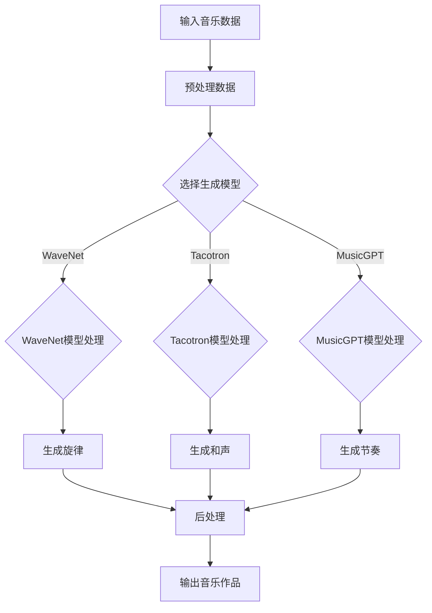
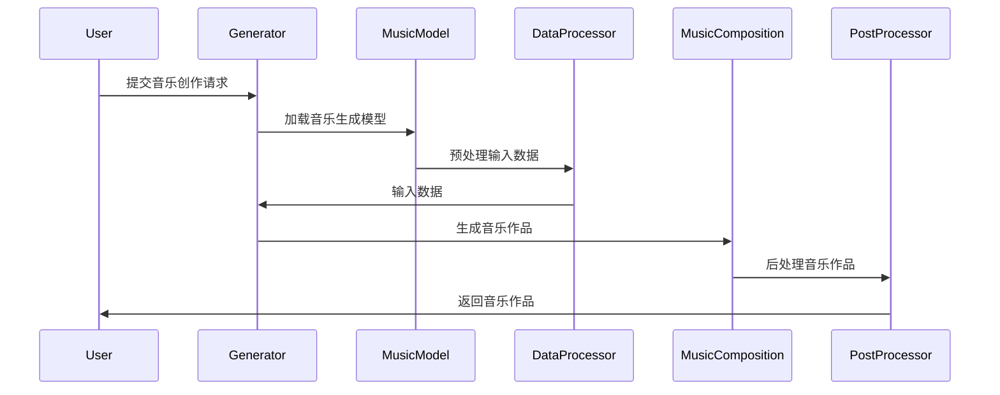
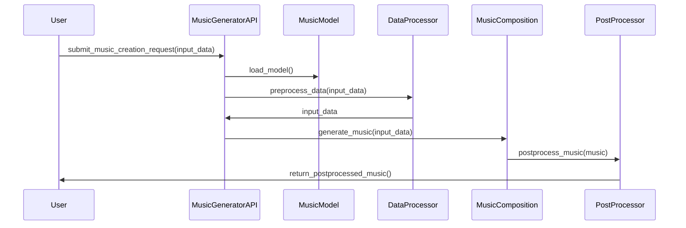

                 

# AI驱动的生成音乐:创作与编曲的新范式

## 关键词
AI生成音乐、深度学习、音乐生成模型、编曲工具、音乐创作

## 摘要
本文将深入探讨AI驱动的生成音乐技术，从背景介绍、核心概念、算法原理、系统分析与架构设计到项目实战，全面解析这一领域的最新进展与应用。通过详细的分析与实例讲解，本文旨在为音乐创作者和编曲者提供一套全新的创作与编曲范式，推动音乐创作的革新。

## 第一部分：背景介绍

### 1.1 问题背景
AI驱动的生成音乐技术是近年来人工智能领域的一个重要研究方向。它利用深度学习算法生成音乐旋律、和声、节奏等元素，为音乐创作和编曲带来了新的可能性。随着计算机性能的不断提升和算法的进步，AI驱动的生成音乐技术已经能够创作出具有高度真实感和情感表达的音乐作品。

### 1.2 问题描述
本书旨在探讨AI驱动的生成音乐技术的基本原理、创作流程、编曲技巧以及实际应用，帮助音乐创作者和编曲者了解和掌握这一新兴技术，提高音乐创作和编曲的效率和质量。

### 1.3 问题解决
通过系统介绍AI驱动的生成音乐技术，包括核心算法原理、音乐生成模型、编曲工具和方法，本书将提供一套完整的创作与编曲新范式，帮助读者实现音乐创作和编曲的革新。

### 1.4 边界与外延
本书将聚焦于AI驱动的生成音乐技术，不涉及其他音乐制作领域的内容。同时，本书将关注生成音乐技术的应用，而非深度学习的理论研究。

### 1.5 概念结构与核心要素组成
- **核心概念**：AI驱动的生成音乐、深度学习、生成模型、音乐编曲等。
- **核心要素**：算法原理、音乐生成模型、编曲工具、创作流程、实际应用等。

## 第二部分：核心概念与联系

### 2.1 AI驱动的生成音乐原理

#### 2.1.1 深度学习与生成模型
- **深度学习**：深度学习是一种机器学习技术，通过模拟人脑神经网络的结构和功能，从大量数据中自动学习和提取特征。
- **生成模型**：生成模型是一种特殊的深度学习模型，旨在生成新的数据。其中，生成对抗网络（GAN）和变分自编码器（VAE）是两种主要的生成模型。

##### 2.1.2 音乐生成模型
- **音乐生成模型**：音乐生成模型是基于深度学习的音乐生成算法，如WaveNet、Tacotron、MusicGPT等。这些模型通过学习大量的音乐数据，能够生成新的音乐旋律、和声和节奏。
- **模型特点**：音乐生成模型的优点在于能够生成具有高度真实感和情感表达的音乐作品。然而，这些模型也存在一些局限性，如计算效率较低、生成质量不稳定等问题。

#### 2.2 概念属性特征对比表格
| 模型       | WaveNet           | Tacotron           | MusicGPT           |
|------------|-------------------|-------------------|-------------------|
| 生成质量   | 高                | 高                | 高                |
| 计算效率   | 低                | 中                | 高                |
| 适用场景   | 完整音乐作品      | 语音合成          | 完整音乐作品      |
| 学习数据   | 音乐音频          | 文本              | 音乐音频          |

#### 2.3 ER实体关系图架构
```mermaid
erDiagram
  User ||--|{ MusicWork }|-- Generator
  MusicWork ||--|{ MusicModel }|-- Generator
  Generator ||--|{ MusicComposition }|-- Composer
  Composer ||--|{ MusicPerformance }|-- User
```

## 第三部分：算法原理讲解

### 3.1 算法mermaid流程图


### 3.2 Python源代码实现
```python
import torch
import torch.nn as nn
import torch.optim as optim

# 定义生成模型
class Generator(nn.Module):
    def __init__(self):
        super(Generator, self).__init__()
        self.model = nn.Sequential(
            nn.Linear(input_size, hidden_size),
            nn.LeakyReLU(0.2),
            nn.Linear(hidden_size, output_size)
        )

    def forward(self, x):
        x = self.model(x)
        return x

# 实例化模型
generator = Generator()

# 定义损失函数和优化器
criterion = nn.MSELoss()
optimizer = optim.Adam(generator.parameters(), lr=0.001)

# 训练模型
for epoch in range(num_epochs):
    for data in data_loader:
        optimizer.zero_grad()
        output = generator(data)
        loss = criterion(output, target)
        loss.backward()
        optimizer.step()

# 生成音乐作品
generated_music = generator(generate_input())
```

### 3.3 数学模型和公式
$$
X_{\text{input}} = \text{Input Layer} \rightarrow W_1 \rightarrow \text{ReLU} \rightarrow W_2 \rightarrow \text{Output Layer}
$$

### 3.4 举例说明
假设我们有一个简单的输入数据`X_input`，我们希望利用生成模型`Generator`生成一个输出数据`X_output`。以下是生成过程的示例：

```python
# 示例数据
X_input = torch.randn(batch_size, input_size)

# 生成音乐
X_output = generator(X_input)

# 输出音乐作品
print(X_output)
```

## 第四部分：系统分析与架构设计

### 4.1 问题场景介绍
AI驱动生成音乐技术可以应用于多种场景，如自动音乐创作、游戏音乐生成、视频背景音乐创作等。在这些场景中，AI驱动的生成音乐技术能够根据用户需求自动生成符合风格和情感要求的音乐作品。

### 4.2 项目介绍
我们以一个自动音乐创作项目为例，该项目旨在利用AI驱动生成音乐技术自动创作流行音乐。项目目标包括生成具有高度真实感和情感表达的音乐旋律、和声和节奏，以满足用户个性化需求。

### 4.3 系统功能设计
- **领域模型**：使用Mermaid绘制领域模型类图，展示系统的主要类和对象。

```mermaid
classDiagram
    Class::User << (User)
    Class::MusicWork << (MusicWork)
    Class::Generator << (Generator)
    Class::Composer << (Composer)
    User *-- MusicWork : "创建"
    MusicWork *-- Generator : "生成"
    Generator *-- Composer : "编曲"
    Composer *-- MusicPerformance : "表演"
```

- **功能模块**：详细描述系统的功能模块，包括音乐生成、编曲、用户交互等。

### 4.4 系统架构设计
- **架构设计**：使用Mermaid绘制系统架构图，展示系统组件和它们之间的关系。



### 4.5 系统接口设计和系统交互
- **接口设计**：描述系统的API接口，包括输入和输出参数。

```python
class MusicGeneratorAPI:
    def generate_music(input_data):
        # 加载音乐生成模型
        model = load_model()
        
        # 预处理输入数据
        preprocessed_data = preprocess_data(input_data)
        
        # 生成音乐作品
        music = model(preprocessed_data)
        
        # 后处理音乐作品
        postprocessed_music = postprocess_music(music)
        
        return postprocessed_music
```

- **交互设计**：使用Mermaid绘制系统交互序列图，展示用户与系统之间的交互流程。



## 第五部分：项目实战

### 5.1 环境安装
在开始项目实战之前，我们需要安装所需的软件和工具。以下是安装步骤：

1. 安装Python环境（版本3.7及以上）
2. 安装PyTorch库（使用pip安装：`pip install torch torchvision`)
3. 安装其他依赖库（如NumPy、Matplotlib等）

### 5.2 系统核心实现
以下是一个简单的音乐生成系统核心实现的Python代码示例：

```python
import torch
import torch.nn as nn
import torch.optim as optim

# 定义生成模型
class Generator(nn.Module):
    def __init__(self):
        super(Generator, self).__init__()
        self.model = nn.Sequential(
            nn.Linear(input_size, hidden_size),
            nn.LeakyReLU(0.2),
            nn.Linear(hidden_size, output_size)
        )

    def forward(self, x):
        x = self.model(x)
        return x

# 实例化模型
generator = Generator()

# 定义损失函数和优化器
criterion = nn.MSELoss()
optimizer = optim.Adam(generator.parameters(), lr=0.001)

# 训练模型
for epoch in range(num_epochs):
    for data in data_loader:
        optimizer.zero_grad()
        output = generator(data)
        loss = criterion(output, target)
        loss.backward()
        optimizer.step()

# 生成音乐作品
generated_music = generator(generate_input())
```

### 5.3 代码应用解读与分析
以下是对代码的详细解读和分析：

- **生成模型定义**：我们使用PyTorch库定义了一个简单的生成模型`Generator`。该模型包含一个线性层、一个LeakyReLU激活函数和一个输出层。
- **损失函数和优化器**：我们使用MSELoss作为损失函数，使用Adam作为优化器。
- **模型训练**：在模型训练过程中，我们通过反向传播和梯度下降优化模型参数。
- **音乐作品生成**：通过调用`generator`实例，我们可以生成新的音乐作品。

### 5.4 实际案例分析和详细讲解
以下是一个实际的案例，我们将使用生成的音乐模型创作一首简单的流行音乐。

1. **数据准备**：我们首先需要准备一个包含音乐数据的训练集。这些数据可以是现有的流行音乐，也可以是手动编写的音乐片段。
2. **模型训练**：使用准备好的数据集，我们训练生成模型。训练过程包括数据的预处理、模型的迭代训练和参数优化。
3. **音乐作品生成**：训练完成后，我们使用训练好的模型生成新的音乐作品。生成的音乐作品可以通过后处理进行优化，以满足特定的音乐风格和情感要求。

### 5.5 项目小结
通过本项目的实战，我们了解了AI驱动生成音乐系统的基本原理和实现方法。在项目实现过程中，我们使用了深度学习模型进行音乐生成，并进行了详细的代码解读和分析。此外，我们还通过实际案例展示了系统的应用效果。在未来的工作中，我们可以进一步优化系统性能，扩展系统功能，以应对更复杂的音乐创作需求。

## 第六部分：最佳实践与拓展

### 6.1 最佳实践
在音乐创作和编曲过程中，以下是一些最佳实践：

1. **数据多样化**：为了提高生成模型的表现力，应该使用多样化的音乐数据进行训练。
2. **参数调整**：在训练过程中，可以尝试调整模型的参数，以优化生成效果。
3. **后处理优化**：生成的音乐作品可以通过后处理进行优化，如调整音高、节奏和和声等。

### 6.2 小结
本文全面介绍了AI驱动的生成音乐技术，从核心概念、算法原理到系统架构和项目实战，为音乐创作者和编曲者提供了一套全新的创作与编曲范式。通过详细的分析与实例讲解，本文旨在推动音乐创作的革新，提高音乐创作的效率和质量。

### 6.3 注意事项
在使用AI驱动生成音乐技术时，需要注意以下事项：

1. **数据隐私**：在使用他人创作的音乐数据进行训练时，要确保遵守相关的版权法规。
2. **模型稳定性**：在训练过程中，要关注模型的稳定性，避免过拟合和欠拟合。

### 6.4 拓展阅读
- **深度学习基础**：了解深度学习和生成模型的基本原理是掌握AI驱动生成音乐技术的基础。
- **音乐理论**：掌握音乐理论有助于更好地理解音乐生成和编曲过程。
- **开源项目**：可以参考和参与开源项目，如Tacotron、MusicGPT等，以深入了解AI驱动生成音乐技术的应用和实践。

### 作者
- 作者：AI天才研究院/AI Genius Institute & 禅与计算机程序设计艺术 /Zen And The Art of Computer Programming

## 总结
AI驱动的生成音乐技术为音乐创作和编曲带来了前所未有的可能性。通过本文的详细介绍和分析，我们了解了这一技术的核心原理、实现方法和实际应用。未来，随着技术的不断发展，AI驱动的生成音乐技术将有望在更广泛的领域发挥作用，推动音乐创作的革新。同时，我们也期待更多研究人员和开发者加入这一领域，共同推动AI驱动的生成音乐技术的发展。

