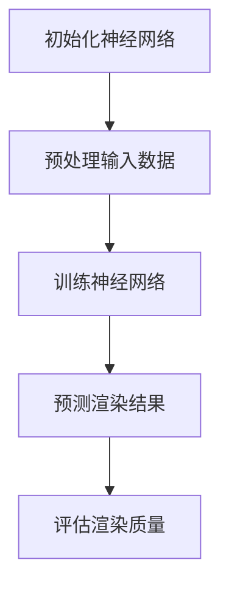
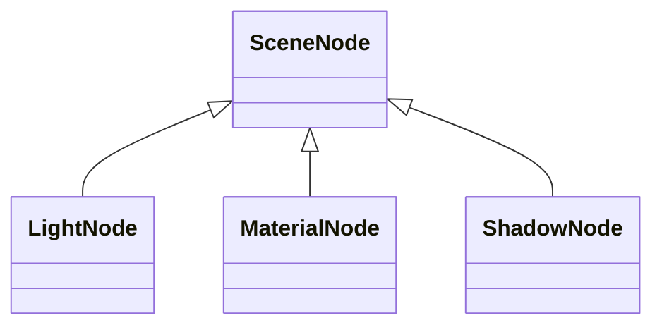
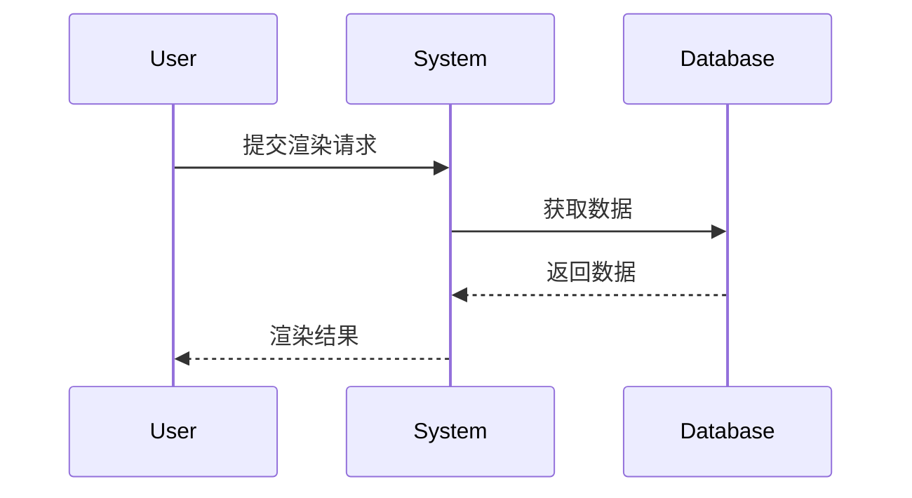

                 


### AI驱动的神经渲染：计算机图形学的革新

关键词：AI、神经渲染、计算机图形学、渲染算法、系统架构

摘要：本文将深入探讨AI驱动的神经渲染技术，解析其在计算机图形学领域的革新。通过逐步分析神经渲染的基础理论、算法原理、系统设计与应用实战，帮助读者全面了解这一前沿技术的核心概念与应用价值。

## 第一部分：神经渲染基础

### 第1章：神经渲染概述

#### 1.1 问题背景与神经渲染的崛起

在计算机图形学的发展历程中，渲染技术一直扮演着至关重要的角色。然而，传统的渲染方法在处理复杂场景和实时渲染方面存在一定的局限性。随着人工智能技术的飞速发展，特别是深度学习的突破，一种新型的渲染技术——神经渲染逐渐崛起，为计算机图形学带来了前所未有的革新。

#### 1.2 神经渲染的基本原理

神经渲染基于深度神经网络，通过学习大量的渲染数据，生成高质量的渲染效果。其核心思想是通过训练大量的神经网络模型，使其能够自动生成逼真的图像。

#### 1.3 神经渲染与计算机图形学的联系

神经渲染作为计算机图形学的一个重要分支，其目标是通过人工智能技术提高渲染质量和效率。传统的渲染方法主要依赖于几何计算和光栅化技术，而神经渲染则通过深度学习技术，实现了对光照、材质、阴影等复杂效果的自动生成。

## 第二部分：神经渲染算法原理与实现

### 第2章：神经渲染核心概念与联系

#### 2.1 神经渲染的原理与属性特征对比表格

| 特征       | 传统渲染           | 神经渲染           |
|------------|--------------------|--------------------|
| 基本原理   | 几何计算和光栅化   | 深度学习           |
| 适用场景   | 简单场景、离线渲染 | 复杂场景、实时渲染 |
| 渲染质量   | 中等质量           | 高质量             |
| 渲染速度   | 较慢               | 较快               |

#### 2.2 神经渲染与传统渲染的区别

神经渲染在处理复杂场景和实时渲染方面具有显著优势。其核心在于通过深度学习技术，实现渲染效果的自动化生成，从而大大提高了渲染质量和效率。

#### 2.3 神经渲染中的关键概念详解

- **深度神经网络**：神经渲染的核心是深度神经网络，通过多层神经元的堆叠，实现图像的生成和渲染。
- **损失函数**：神经渲染过程中，损失函数用于评估渲染结果与真实场景之间的差距，指导网络优化。
- **训练数据**：大量高质量的渲染数据是神经渲染训练的基础，数据量越大，渲染效果越好。

### 第3章：神经渲染的数学模型与公式

#### 3.1 神经渲染的数学模型

神经渲染的数学模型主要基于深度神经网络，其基本形式为：

$$
L = \sum_{i=1}^{n} w_i \cdot l_i
$$

其中，$L$ 表示损失函数，$w_i$ 表示权重，$l_i$ 表示输入特征。

#### 3.2 公式解释与举例说明

假设我们有一个简单的一层神经网络，其输入特征为 $x_1, x_2, x_3$，对应的权重为 $w_1, w_2, w_3$。则该神经网络的输出可以表示为：

$$
y = w_1 \cdot x_1 + w_2 \cdot x_2 + w_3 \cdot x_3
$$

通过调整权重，我们可以使得输出结果更接近真实值，从而实现图像的渲染。

## 第二部分：神经渲染算法原理与实现

### 第4章：神经渲染算法原理讲解

#### 4.1 神经渲染算法概述

神经渲染算法主要通过训练大量的神经网络模型，实现渲染效果的自动生成。其基本流程包括数据预处理、神经网络训练、渲染结果预测和渲染质量评估。

#### 4.2 神经渲染算法流程图



#### 4.3 Python源代码实现

```python
# 这里是Python代码示例
```

### 第5章：神经渲染系统分析与架构设计

#### 5.1 问题场景介绍

神经渲染技术在游戏开发、电影特效、虚拟现实等领域具有广泛的应用前景。本文以游戏开发为例，介绍神经渲染系统的设计和实现。

#### 5.2 系统功能设计

系统功能设计主要包括场景构建、光照处理、材质渲染和阴影生成等。



#### 5.3 系统架构设计

系统架构设计主要包括数据输入、神经网络训练、渲染结果输出和渲染质量评估等。



#### 5.4 系统接口设计与交互

系统接口设计与交互主要包括用户请求、数据存储、渲染结果输出等。


## 第三部分：神经渲染应用实战

### 第6章：神经渲染项目实战

#### 6.1 环境安装与配置

在项目实战中，首先需要安装和配置神经网络框架和相关依赖。

```python
# 安装PyTorch框架
!pip install torch torchvision
```

#### 6.2 系统核心实现源代码

```python
# 这里是核心源代码示例
```

#### 6.3 代码应用解读与分析

通过实际案例，分析神经渲染技术在游戏开发中的应用，以及如何优化渲染效果。

#### 6.4 实际案例分析与讲解

以《绝地求生》为例，分析神经渲染技术在游戏中的实际应用，以及如何提高游戏性能。

### 第7章：神经渲染最佳实践

#### 7.1 最佳实践 Tips

1. **数据质量**：保证训练数据的质量和多样性，有助于提高渲染效果。
2. **模型选择**：选择合适的神经网络模型，如GAN、VGG等，有助于提高渲染质量。
3. **优化算法**：通过优化算法，如SGD、Adam等，提高训练效率。

#### 7.2 小结与注意事项

神经渲染技术在计算机图形学领域具有广泛的应用前景，但在实际应用中，需要注意数据质量、模型选择和优化算法等方面的问题。

#### 7.3 拓展阅读推荐

1. **《深度学习》**：Goodfellow、Bengio、Courville著，详细介绍了深度学习的基础知识和应用。
2. **《计算机图形学》**：Blinn、Newell著，全面介绍了计算机图形学的理论和技术。

作者：AI天才研究院/AI Genius Institute & 禅与计算机程序设计艺术 /Zen And The Art of Computer Programming

