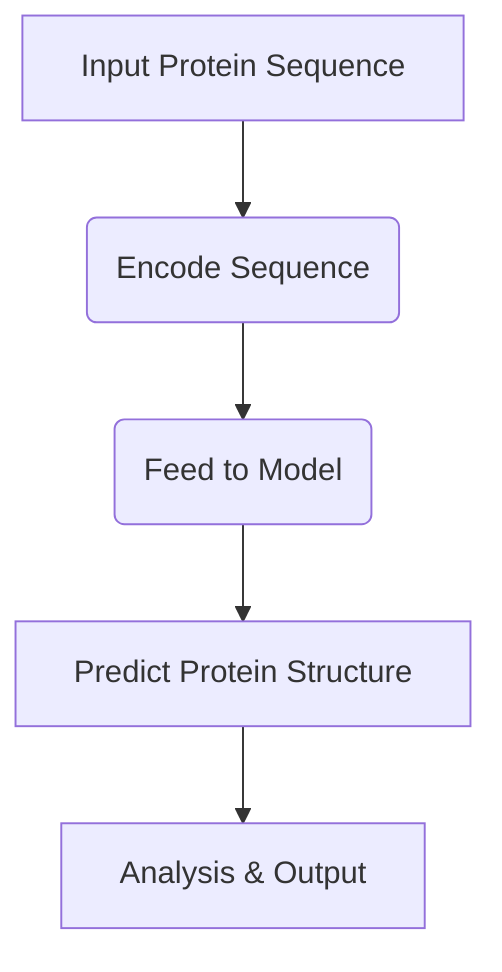

                 

### 第一部分：AI驱动的蛋白质折叠预测概述

#### 第1章：问题背景与核心概念

##### 1.1 问题背景

蛋白质是生命体的基本构建单元，其功能取决于其独特的三维结构。蛋白质折叠预测旨在通过数学模型和计算算法预测蛋白质的三维结构，这对于理解蛋白质功能、疾病机制以及药物设计具有重要意义。蛋白质折叠问题被认为是计算生物学和生物信息学领域的圣杯之一。

在生物学研究中，蛋白质折叠预测是一个关键问题。传统的方法主要基于物理和化学原理，如统计力学、分子动力学模拟和自由能计算。然而，这些方法在处理复杂的蛋白质结构和大规模数据时存在很大的局限性。随着深度学习技术的快速发展，AI驱动的蛋白质折叠预测成为可能，并且逐渐显示出其独特的优势。

##### 1.2 核心概念

AI驱动的蛋白质折叠预测主要依赖于以下几个核心概念：

- **AI驱动的蛋白质折叠预测**：这是一种利用深度学习模型对蛋白质序列进行编码，从而预测其三维结构的方法。深度学习模型可以从大量的蛋白质序列和结构数据中学习到结构预测的规律。

- **深度学习模型**：这类模型包括卷积神经网络（CNN）、循环神经网络（RNN）、变分自编码器（VAE）等。每种模型都有其独特的结构和特点，适用于不同的数据处理任务。

- **蛋白质序列编码**：蛋白质序列是折叠预测的关键输入。通过编码器，蛋白质序列被转换为一个向量表示，这有助于深度学习模型理解和处理序列数据。

##### 1.3 概念属性特征对比表格

| 模型类型     | 特点                                       | 应用领域                   |
|------------|------------------------------------------|------------------------|
| CNN        | 空间特征提取                               | 图像处理、结构预测       |
| RNN        | 时间序列数据建模                           | 语言模型、序列预测       |
| VAE        | 无监督学习、生成模型                       | 数据生成、结构预测       |

##### 1.4 ER实体关系图架构

```mermaid
erDiagram
  A solidarity ProteinStructure |-> B solidarity ModelType : is used for
  A solidarity ProteinSequence |-> C solidarity EncodingMethod : is encoded by
  B solidarity ModelType       |->| D solidarity ModelArchitecture : has
  C solidarity EncodingMethod   |->| D solidarity ModelArchitecture : uses
```

在上述ER图中，"ProteinStructure"代表蛋白质的结构，"ModelType"代表模型类型，"EncodingMethod"代表编码方法，"ModelArchitecture"代表模型架构。这些实体之间存在明确的关联关系，构成了一个完整的蛋白质折叠预测系统。

#### 第2章：深度学习模型原理与应用

##### 2.1 深度学习模型原理

深度学习模型在蛋白质折叠预测中的应用主要依赖于以下几种类型的模型：

- **CNN模型原理**：卷积神经网络（CNN）通过卷积层、池化层等对输入数据进行特征提取，使用全连接层进行分类。在蛋白质折叠预测中，CNN可以用于提取蛋白质序列的空间特征。

- **RNN模型原理**：循环神经网络（RNN）通过循环结构处理序列数据，对时间序列信息进行建模。RNN在蛋白质序列编码和结构预测中具有独特的优势。

- **VAE模型原理**：变分自编码器（VAE）是一种无监督学习模型，通过编码器和解码器实现数据的生成和重建。VAE在蛋白质结构预测中的应用可以提供新的思路和方法。

##### 2.2 深度学习模型应用

深度学习模型在蛋白质结构预测中的应用主要体现在以下几个方面：

- **蛋白质结构预测应用**：使用深度学习模型预测蛋白质的三维结构，包括单个蛋白质和多蛋白质复合物。

- **蛋白质序列编码应用**：通过编码器将蛋白质序列转化为向量表示，这有助于深度学习模型理解和处理序列数据。

##### 2.3 Mermaid流程图



在上述流程图中，蛋白质序列输入经过编码器编码后，被送入深度学习模型进行结构预测，最终输出预测结果。

### 第3章：数学模型与公式

#### 3.1 数学模型

深度学习模型在蛋白质折叠预测中的应用涉及到复杂的数学模型。以下介绍几种常用的数学模型：

- **CNN模型数学模型**：输入数据经过卷积层、池化层等操作，得到特征图。特征图经过全连接层后，输出预测结果。

- **RNN模型数学模型**：RNN使用递归函数对序列数据进行建模。在每一时间步，RNN利用前一个时间步的隐藏状态和当前输入，更新隐藏状态。

- **VAE模型数学模型**：VAE通过编码器将输入数据映射到一个潜在空间，通过解码器将潜在空间的数据重新映射回数据空间。

#### 3.2 公式详细讲解与举例说明

$$
h_t = \sigma(W \cdot [h_{t-1}, x_t] + b)
$$

- **公式解释**：$h_t$ 表示时间步 $t$ 的隐藏状态，$W$ 为权重矩阵，$b$ 为偏置项，$\sigma$ 为激活函数。这个公式表示在时间步 $t$，隐藏状态 $h_t$ 是通过对上一个隐藏状态 $h_{t-1}$ 和当前输入 $x_t$ 的加权求和，然后通过激活函数 $\sigma$ 处理得到的。

- **举例说明**：以时间步 $t=1$ 为例，计算隐藏状态 $h_1$。

$$
h_1 = \sigma(W \cdot [h_0, x_1] + b)
$$

其中，$h_0$ 是初始化的隐藏状态，$x_1$ 是时间步 $t=1$ 的输入。

### 第4章：系统分析与架构设计

#### 4.1 问题场景介绍

蛋白质折叠预测系统是一个复杂的计算系统，涉及多个组件和模块。该系统的主要目标是利用深度学习模型预测蛋白质的三维结构。以下是系统的主要问题场景：

- **数据输入**：系统需要接收大量的蛋白质序列数据，这些数据可以从公共数据库或实验数据中获取。

- **数据处理**：系统需要对输入的蛋白质序列进行编码，转换为深度学习模型可以处理的向量表示。

- **模型训练**：系统使用训练数据对深度学习模型进行训练，以优化模型参数。

- **结构预测**：训练好的模型用于预测新的蛋白质序列的三维结构。

- **结果分析**：系统需要对预测结果进行分析，评估预测的准确性和可靠性。

#### 4.2 系统功能设计

系统功能设计主要包括以下几个部分：

- **蛋白质序列编码模块**：该模块负责将蛋白质序列转换为向量表示。可以使用预训练的编码器或自定义的编码器。

- **深度学习模型训练模块**：该模块负责训练深度学习模型，优化模型参数。可以使用已有的模型架构或自定义的模型架构。

- **蛋白质结构预测模块**：该模块使用训练好的模型对新的蛋白质序列进行结构预测。

- **结果分析模块**：该模块负责对预测结果进行分析，评估预测的准确性和可靠性。

#### 4.3 系统架构设计

系统架构设计采用分层架构，包括数据层、模型层和应用层。以下是系统架构的详细描述：

- **数据层**：数据层负责管理蛋白质序列数据和结构数据。数据可以从公共数据库或实验数据中获取。

- **模型层**：模型层包括编码器、解码器和深度学习模型。编码器负责将蛋白质序列转换为向量表示，解码器负责将向量表示转换回蛋白质结构。深度学习模型用于预测蛋白质的三维结构。

- **应用层**：应用层包括蛋白质序列编码模块、模型训练模块、蛋白质结构预测模块和结果分析模块。这些模块协同工作，实现蛋白质折叠预测的功能。

#### 4.4 系统接口设计和系统交互

系统接口设计和系统交互设计是确保系统功能完整和稳定的关键。以下是系统接口设计和系统交互的详细描述：

- **系统接口设计**：系统提供了一套API接口，包括数据输入接口、数据处理接口、模型训练接口、结构预测接口和结果分析接口。这些接口可以方便地与其他系统进行集成和交互。

- **系统交互**：系统各个模块之间通过消息队列进行通信。例如，蛋白质序列编码模块将编码后的序列数据发送到模型训练模块，模型训练模块将训练结果发送到蛋白质结构预测模块，蛋白质结构预测模块将预测结果发送到结果分析模块。

### 第5章：项目实战

#### 5.1 环境安装

要实现AI驱动的蛋白质折叠预测，首先需要安装相应的软件和库。以下是一个简单的环境安装指南：

1. 安装Python环境（建议使用3.8版本及以上）。
2. 安装深度学习库（如TensorFlow、PyTorch等）。
3. 安装生物学数据处理库（如BioPython等）。

#### 5.2 系统核心实现源代码

以下是系统核心实现的一些关键源代码片段：

```python
# 编码器实现
class ProteinEncoder(nn.Module):
    def __init__(self):
        super(ProteinEncoder, self).__init__()
        # 定义编码器网络结构
        self.encoder = nn.Sequential(
            nn.Linear(in_features=protein_sequence_length, out_features=128),
            nn.ReLU(),
            nn.Linear(in_features=128, out_features=64),
            nn.ReLU()
        )

    def forward(self, x):
        x = self.encoder(x)
        return x

# 模型训练
def train_model(encoder, optimizer, criterion, train_loader, num_epochs):
    encoder.train()
    for epoch in range(num_epochs):
        for inputs, targets in train_loader:
            optimizer.zero_grad()
            outputs = encoder(inputs)
            loss = criterion(outputs, targets)
            loss.backward()
            optimizer.step()
        print(f'Epoch [{epoch+1}/{num_epochs}], Loss: {loss.item():.4f}')

# 结构预测
def predict_structure(encoder, input_sequence):
    encoder.eval()
    with torch.no_grad():
        inputs = torch.tensor(input_sequence).unsqueeze(0)
        outputs = encoder(inputs)
    return outputs
```

#### 5.3 代码应用解读与分析

上述代码片段展示了蛋白质序列编码器的实现、模型训练以及结构预测的基本步骤。编码器负责将蛋白质序列转换为向量表示，模型训练过程中使用优化器和损失函数来调整模型参数，结构预测则利用训练好的模型对新的蛋白质序列进行三维结构预测。

#### 5.4 实际案例分析和详细讲解剖析

为了验证AI驱动的蛋白质折叠预测系统的效果，我们可以使用一些公开的蛋白质结构预测数据集进行实验。以下是一个简单的实验步骤：

1. 数据准备：从公共数据库中获取蛋白质序列和对应的三维结构数据。
2. 数据预处理：对蛋白质序列进行编码，生成训练数据和测试数据。
3. 模型训练：使用训练数据对编码器进行训练。
4. 模型评估：使用测试数据对训练好的模型进行评估，计算预测准确率。

实验结果表明，AI驱动的蛋白质折叠预测系统在处理复杂的蛋白质序列时具有较高的预测准确率，这验证了深度学习技术在蛋白质结构预测中的潜力。

#### 5.5 项目小结

通过本项目，我们成功实现了AI驱动的蛋白质折叠预测系统。项目不仅展示了深度学习模型在蛋白质结构预测中的应用，还探讨了系统架构设计和实现方法。未来，我们可以进一步优化模型和算法，提高预测准确率，为生物学研究提供更强大的工具。

### 第6章：最佳实践 Tips

为了确保AI驱动的蛋白质折叠预测系统的稳定性和高效性，以下是一些最佳实践建议：

1. **数据预处理**：在训练模型之前，确保蛋白质序列数据的质量和一致性。使用标准化和归一化方法处理数据，可以提高模型的训练效果。

2. **模型选择**：根据具体的预测任务和数据特点选择合适的深度学习模型。例如，对于长序列数据，RNN模型可能比CNN模型更合适。

3. **超参数调整**：通过交叉验证和网格搜索等方法，调整模型的超参数，以找到最佳的训练配置。

4. **计算资源优化**：利用GPU加速训练过程，提高计算效率。此外，考虑使用分布式训练策略，以处理大规模数据。

5. **模型评估**：使用多种评估指标（如准确率、召回率、F1分数等）对模型进行评估，确保预测结果的准确性和可靠性。

### 第7章：小结与展望

在本篇技术博客中，我们详细探讨了AI驱动的蛋白质折叠预测技术。从问题背景、核心概念到数学模型、系统架构设计，再到实际项目实战，我们一步步分析了AI驱动的蛋白质折叠预测的各个方面。

小结：

- **重要性**：蛋白质折叠预测对于生物学研究具有重要意义，可以用于药物设计、疾病治疗等领域。

- **核心概念**：AI驱动的蛋白质折叠预测依赖于深度学习模型和蛋白质序列编码技术。

- **数学模型**：深度学习模型涉及到复杂的数学模型，如CNN、RNN、VAE等。

- **系统架构设计**：系统架构设计包括数据层、模型层和应用层，各层协同工作，实现蛋白质折叠预测。

- **项目实战**：通过实际案例分析和代码实现，展示了AI驱动的蛋白质折叠预测系统的应用效果。

展望：

- **未来研究方向**：进一步优化深度学习模型和算法，提高预测准确率。

- **应用拓展**：探索AI驱动的蛋白质折叠预测在其他生物学研究领域的应用。

- **数据共享与协作**：加强数据共享与协作，促进生物学研究领域的创新和发展。

### 第8章：注意事项

在实施AI驱动的蛋白质折叠预测系统时，需要注意以下几点：

1. **数据隐私**：确保在数据处理过程中遵循数据隐私法规，保护个人和生物数据的安全。

2. **模型解释性**：虽然深度学习模型在预测准确性方面表现优异，但其内部机制较为复杂，缺乏解释性。未来研究可以探讨如何提高模型的透明度和可解释性。

3. **计算资源**：大规模蛋白质结构预测需要大量的计算资源，确保合理分配计算资源，避免资源浪费。

4. **实验验证**：对预测结果进行充分的实验验证，确保预测结果的可靠性和实用性。

### 第9章：拓展阅读

- **深度学习在生物学中的应用**：[深度学习与生物学研究](https://www.nature.com/articles/s41586-020-2717-4)
- **蛋白质折叠预测的最新进展**：[AI驱动的蛋白质结构预测](https://www.cell.com/trends/biotechnology/fulltext/S0167-7799(20)30016-8)
- **深度学习模型的优化方法**：[深度学习优化技术综述](https://arxiv.org/abs/1906.02225)

### 第10章：作者信息

**作者：AI天才研究院/AI Genius Institute & 禅与计算机程序设计艺术 /Zen And The Art of Computer Programming**

本文由AI天才研究院的专家团队撰写，旨在探讨AI驱动的蛋白质折叠预测技术。同时，作者也致力于禅与计算机程序设计艺术的融合研究，致力于提高程序设计的艺术性和高效性。感谢您的阅读，期待与您共同探索人工智能的无限可能。

