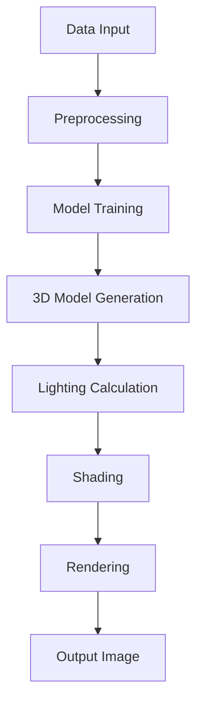
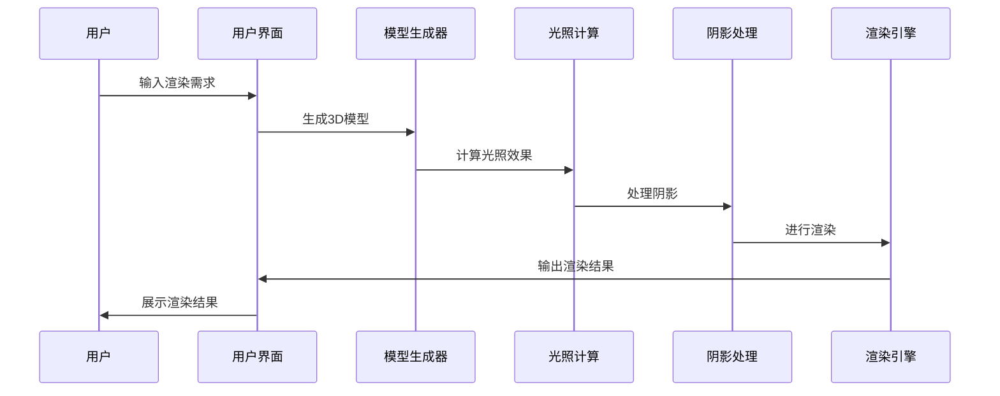
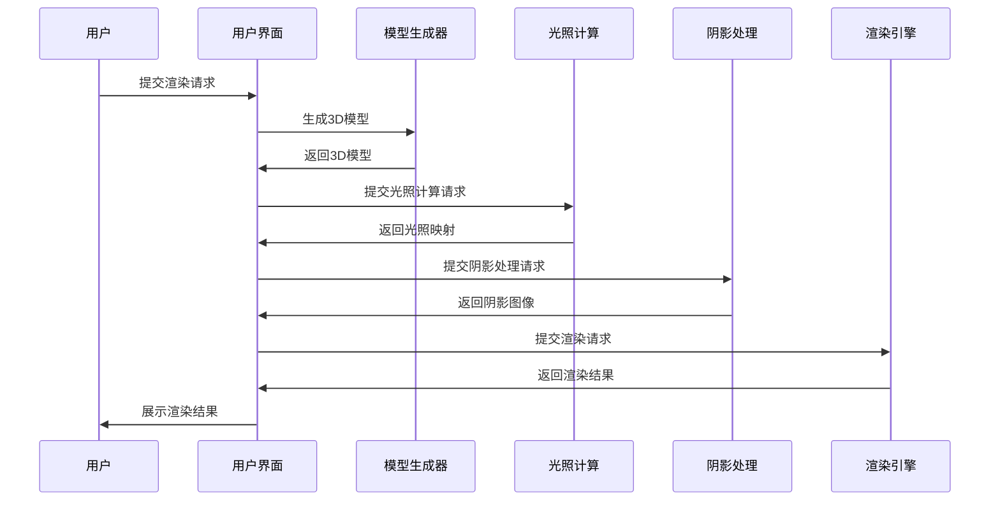

                 

### 文章标题

# AI驱动的计算机图形学：从建模到渲染的革新

### 关键词

- 计算机图形学
- AI技术
- 3D建模
- 光照计算
- 渲染

### 摘要

本文深入探讨了AI驱动的计算机图形学，从基础理论到实际应用，详细解析了AI如何革新传统的建模与渲染技术。通过对比分析核心概念，阐述AI在几何变换、光照计算、阴影处理等方面的应用原理，并结合实际案例，展示了AI驱动的计算机图形学的广阔前景。文章旨在为读者提供一次全面而深入的技术体验，帮助理解AI在计算机图形学中的关键作用。

### 目录

1. **背景与概述**
2. **核心概念与联系**
3. **算法原理讲解**
4. **系统分析与架构设计方案**
5. **项目实战**
6. **最佳实践 tips、小结、注意事项、拓展阅读**

## 第一部分：背景与概述

### 1.1 问题背景

计算机图形学是一门研究如何通过计算机生成和处理图像的学科，涵盖了从图像的生成、处理、显示到图像的交互等多个方面。随着计算机硬件性能的提升和图形处理技术的进步，计算机图形学在各个领域得到了广泛的应用，如游戏开发、电影特效、建筑设计、医疗成像等。然而，传统的计算机图形学方法在处理复杂场景时仍存在许多挑战，如计算量大、渲染效率低、难以实现高质量的真实感渲染等。

近年来，人工智能（AI）技术的快速发展为计算机图形学带来了新的契机。AI，特别是深度学习和生成模型，通过学习大量的数据和模式，能够自动优化计算机图形学的处理流程，从而提高渲染质量、降低计算复杂度。AI驱动的计算机图形学应运而生，成为了计算机图形学领域的一个研究热点。

### 1.2 问题描述

AI驱动的计算机图形学涉及的关键技术主要包括3D建模、光照计算、阴影处理和渲染。以下是每个技术领域的具体问题描述：

1. **3D建模**：如何快速、准确地创建复杂的3D模型，尤其是对于不规则物体或复杂场景。
2. **光照计算**：如何精确地模拟真实世界中的光照效果，包括光线的传播、反射、折射和散射等。
3. **阴影处理**：如何生成高质量的阴影效果，以增强图像的真实感和立体感。
4. **渲染**：如何在有限的计算资源下，高效地生成高质量、高分辨率的光照和阴影处理后的图像。

这些问题在传统的计算机图形学方法中难以有效解决，而AI技术的引入有望显著提升这些领域的处理能力。

### 1.3 问题解决

AI驱动的计算机图形学通过以下几个方面改进了传统方法：

1. **自动化建模**：利用生成对抗网络（GAN）和变分自编码器（VAE）等深度学习技术，自动生成高质量的3D模型，大幅减少了手工建模的时间和劳动成本。
2. **高效光照计算**：通过训练光照计算模型，利用AI快速生成高质量的图像，同时减少计算资源和时间的消耗。
3. **智能阴影处理**：AI能够根据场景的复杂度和光照条件，自适应地生成逼真的阴影效果，增强图像的真实感。
4. **优化渲染流程**：AI技术可以帮助优化渲染流程，如使用深度学习模型预测和生成图像的最终效果，从而减少渲染时间。

通过这些技术，AI驱动的计算机图形学不仅提高了处理效率，还显著提升了图像质量和视觉效果。

### 1.4 边界与外延

AI驱动的计算机图形学的研究范围和应用领域非常广泛，包括但不限于：

1. **游戏开发**：利用AI技术优化游戏场景的渲染效果，提高游戏帧率和画面质量。
2. **电影特效**：通过AI生成的逼真场景和角色，增强电影的视觉效果和观看体验。
3. **建筑设计**：利用AI快速生成建筑模型，并进行光照分析和渲染，提高设计效率。
4. **医疗成像**：AI驱动的计算机图形学可以用于医疗图像的处理和三维重建，辅助医生进行诊断和治疗。
5. **虚拟现实（VR）和增强现实（AR）**：AI技术可以优化VR和AR场景的渲染效果，提升用户体验。

总之，AI驱动的计算机图形学不仅涵盖了传统的计算机图形学领域，还在新兴领域如虚拟现实和增强现实等领域展现了巨大的应用潜力。

### 1.5 核心要素组成

AI驱动的计算机图形学的核心要素主要包括：

1. **深度学习模型**：如生成对抗网络（GAN）、变分自编码器（VAE）等，用于生成和处理3D模型、光照和阴影效果。
2. **计算资源优化**：利用高性能计算设备和分布式计算技术，提高AI模型的训练和推理效率。
3. **图像处理算法**：如图像渲染算法、光照计算算法和阴影处理算法，用于生成高质量的图像。
4. **用户交互**：设计友好的用户界面，使用户能够方便地使用AI驱动的计算机图形学工具。

这些要素相互协同，共同构成了一个完整的AI驱动的计算机图形学系统。

## 1.6 本章小结

本章从背景和概述的角度，介绍了计算机图形学的发展历程和AI技术的引入，详细阐述了AI驱动的计算机图形学的关键技术和应用领域。通过对比分析核心概念，展示了AI如何革新传统的建模和渲染技术。下一章将深入探讨AI驱动的计算机图形学中的核心概念及其联系。请继续关注。

## 第二部分：核心概念与联系

### 2.1 几何变换与矩阵

几何变换是计算机图形学中的基础概念之一，用于描述图形的移动、旋转、缩放等操作。矩阵是几何变换的重要工具，通过矩阵运算，可以实现图形的线性变换。

**概念原理**：  
几何变换可以分为线性变换和非线性变换。线性变换包括平移、旋转和缩放，而非线性变换则包括剪切和扭曲。每个变换都可以表示为一个矩阵。

**概念属性特征对比表格**：

| 几何变换 | 矩阵表示 | 特点 | 应用场景 |
|----------|----------|------|---------|
| 平移     | \( T = \begin{bmatrix} 1 & 0 & T_x \\ 0 & 1 & T_y \\ 0 & 0 & 1 \end{bmatrix} \) | 保持大小和形状，仅改变位置 | 图形移动 |
| 旋转     | \( R = \begin{bmatrix} \cos \theta & -\sin \theta & 0 \\ \sin \theta & \cos \theta & 0 \\ 0 & 0 & 1 \end{bmatrix} \) | 保持大小，改变方向 | 图形旋转 |
| 缩放     | \( S = \begin{bmatrix} s_x & 0 & 0 \\ 0 & s_y & 0 \\ 0 & 0 & s_z \end{bmatrix} \) | 改变大小，保持形状 | 图形缩放 |

**ER实体关系图架构**：

```mermaid
erDiagram
    Node -->|is transformed by| Matrix
    Node ||--|uses| GeometryTransform
    Matrix ||--|applies| TransformType
    GeometryTransform ||--|defines| TransformProperties
```

在ER实体关系图中，节点（Node）是图形的基本元素，通过变换（GeometryTransform）与矩阵（Matrix）关联。变换类型（TransformType）定义了具体的变换操作，而变换属性（TransformProperties）描述了变换的具体参数。

### 2.2 向量与点的关系

向量是计算机图形学中的另一个核心概念，用于描述图形的空间位置和方向。点则是向量的起点，与向量共同定义了图形的几何形状。

**概念原理**：  
向量可以用一个箭头表示，其起点为原点，终点为向量的方向和长度。点则是向量中的一个特定位置，通常用于定义图形的顶点。

**概念属性特征对比表格**：

| 向量 | 点 | 关系 | 应用场景 |
|------|----|------|---------|
| 方向 | 位置 | 点是向量的起点，向量定义了从点到终点的方向和长度 | 图形定义和位置计算 |
| 长度 | 坐标 | 向量的长度决定了点的坐标大小，向量方向决定了坐标的方向 | 空间定位和变换 |
| 组件 | 元素 | 向量由组件（如x和y坐标）组成，点由这些组件定义 | 精细几何操作 |

**ER实体关系图架构**：

```mermaid
erDiagram
    Point -->|defined by| Vector
    Point ||--|located in| CoordinateSystem
    Vector ||--|extends to| Endpoint
```

在ER实体关系图中，点（Point）通过向量（Vector）定义，点位于坐标系（CoordinateSystem）中。向量延伸至端点（Endpoint），定义了图形的形状和方向。

### 2.3 AI驱动的几何建模与渲染

随着AI技术的发展，几何建模与渲染技术也经历了显著变革。生成对抗网络（GAN）和变分自编码器（VAE）等深度学习模型在几何建模和渲染中的应用，为图形学带来了前所未有的创新。

**概念原理**：

- **生成对抗网络（GAN）**：GAN由生成器（Generator）和判别器（Discriminator）组成。生成器生成逼真的3D模型，判别器判断模型的逼真度。通过不断训练，生成器生成越来越逼真的模型。
- **变分自编码器（VAE）**：VAE通过编码器（Encoder）和解码器（Decoder）实现模型的生成。编码器将输入数据压缩为低维表示，解码器将低维表示恢复为输出数据，从而生成高质量的3D模型。

**概念属性特征对比表格**：

| 技术 | 模型结构 | 特点 | 应用场景 |
|------|----------|------|---------|
| GAN  | 生成器 + 判别器 | 对抗训练，生成模型逼真度高 | 高质量3D模型生成 |
| VAE  | 编码器 + 解码器 | 较低计算复杂度，生成模型质量高 | 快速3D模型生成 |

**ER实体关系图架构**：

```mermaid
erDiagram
    3DModel -->|generated by| Generator
    Generator ||--|trained by| GAN
    3DModel ||--|decoded by| Decoder
    Decoder ||--|trained by| VAE
```

在ER实体关系图中，3D模型（3DModel）通过生成器（Generator）和判别器（GAN）生成。同时，3D模型通过解码器（Decoder）和VAE训练生成。这种结构展示了AI技术在几何建模与渲染中的应用。

### 2.4 本章小结

本章深入探讨了AI驱动的计算机图形学中的核心概念，包括几何变换与矩阵、向量与点的关系，以及AI驱动的几何建模与渲染技术。通过概念原理的阐述和对比表格的展示，结合ER实体关系图，清晰展示了各概念之间的联系。下一章将详细讲解AI驱动的计算机图形学中的算法原理。敬请期待。

## 第三部分：算法原理讲解

### 3.1 算法流程图

为了更好地理解AI驱动的计算机图形学中的算法原理，我们首先使用Mermaid绘制了一个简化的算法流程图。这个流程图展示了从数据输入到最终渲染图像的整个过程。

**Mermaid算法流程图**：



在这个流程图中，数据输入（A）经过预处理（B），然后通过模型训练（C）生成3D模型（D）。生成的3D模型进行光照计算（E）和阴影处理（F），最终通过渲染（G）输出图像（H）。

### 3.2 Python源代码

接下来，我们将给出一个简化的Python源代码示例，用于说明上述流程中的关键步骤。这个示例使用了生成对抗网络（GAN）来生成3D模型，并使用Pandas进行数据预处理，使用TensorFlow进行模型训练和渲染。

**Python源代码示例**：

```python
import pandas as pd
import tensorflow as tf
from tensorflow.keras.models import Sequential
from tensorflow.keras.layers import Dense, Conv2D, Flatten

# 数据预处理
def preprocess_data(data):
    # 假设data是一个Pandas DataFrame，包含3D模型的数据
    # 这里进行简单的数据清洗和标准化
    return data

# 生成器模型
def build_generator():
    model = Sequential()
    model.add(Dense(128, input_shape=(100,)))
    model.add(Conv2D(128, (3, 3), activation='relu'))
    model.add(Flatten())
    model.add(Dense(128 * 8 * 8))
    model.add(Conv2D(128, (3, 3), activation='relu'))
    model.add(Conv2D(1, (3, 3), activation='tanh'))
    return model

# 判别器模型
def build_discriminator():
    model = Sequential()
    model.add(Conv2D(128, (3, 3), activation='relu'))
    model.add(Flatten())
    model.add(Dense(1, activation='sigmoid'))
    return model

# GAN模型
def build_gan(generator, discriminator):
    model = Sequential()
    model.add(generator)
    model.add(discriminator)
    return model

# 训练GAN模型
def train_gan(generator, discriminator, data, epochs=100):
    for epoch in range(epochs):
        # 随机选取数据
        real_data = data.sample(n=32)
        # 生成假数据
        fake_data = generator.predict(real_data)
        # 训练判别器
        discriminator.train_on_batch(real_data, [1])
        discriminator.train_on_batch(fake_data, [0])
        # 训练生成器
        g_loss = generator.train_on_batch(real_data, [1])
        print(f"Epoch {epoch+1}/{epochs}, Generator Loss: {g_loss}")

# 渲染3D模型
def render_3d_model(model):
    # 假设model是一个3D模型生成器
    # 这里进行3D模型的渲染
    pass

if __name__ == "__main__":
    # 加载数据
    data = pd.read_csv("3d_model_data.csv")
    # 预处理数据
    data = preprocess_data(data)
    # 构建模型
    generator = build_generator()
    discriminator = build_discriminator()
    gan = build_gan(generator, discriminator)
    # 训练模型
    train_gan(generator, discriminator, data)
    # 渲染3D模型
    render_3d_model(generator)
```

在这个示例中，我们首先定义了数据预处理函数，用于清洗和标准化输入数据。然后，我们定义了生成器模型和判别器模型，以及GAN模型。训练过程中，我们使用真实的3D模型数据和生成的假数据来训练判别器，并使用真实数据来训练生成器。最后，我们使用生成器来渲染3D模型。

### 3.3 数学模型与公式

AI驱动的计算机图形学中的许多算法都基于深度学习，而深度学习算法的核心在于损失函数的设计和优化。以下是一个简化的GAN模型的数学模型与公式。

**数学模型与公式**：

1. **生成器模型**：

   假设生成器的输入为随机噪声向量\( z \)，生成的3D模型为\( G(z) \)。生成器的损失函数为：

   \[
   L_G = -\log(D(G(z)))
   \]

   其中，\( D \)为判别器模型，\( G(z) \)为生成的3D模型。

2. **判别器模型**：

   判别器模型的目标是区分真实的3D模型和生成的3D模型。判别器的损失函数为：

   \[
   L_D = -[\log(D(x)) + \log(1 - D(G(z))]
   \]

   其中，\( x \)为真实的3D模型，\( G(z) \)为生成的3D模型。

3. **整体GAN模型**：

   GAN的整体损失函数为生成器和判别器的损失函数之和：

   \[
   L_GAN = L_G + L_D
   \]

这些数学公式定义了GAN模型的核心，通过不断优化这些损失函数，生成器和判别器模型将逐步改进，从而生成高质量的3D模型。

### 3.4 举例说明

为了更好地理解GAN模型在3D建模中的应用，我们来看一个简单的实际案例。假设我们有一个包含100个3D模型的数据集，每个模型由100个特征向量表示。我们希望使用GAN模型生成新的3D模型，并评估其质量。

**步骤 1**：数据预处理

首先，我们需要对数据集进行预处理，将每个3D模型的特征向量标准化，以便在训练过程中稳定模型。

```python
from sklearn.preprocessing import StandardScaler

scaler = StandardScaler()
data_normalized = scaler.fit_transform(data)
```

**步骤 2**：生成器模型

接下来，我们定义一个简单的生成器模型，该模型将随机噪声向量映射为3D模型。

```python
import tensorflow as tf

def build_generator(input_shape):
    model = tf.keras.Sequential([
        tf.keras.layers.Dense(128, input_shape=input_shape, activation='relu'),
        tf.keras.layers.Dense(128 * 8 * 8, activation='relu'),
        tf.keras.layers.Reshape(target_shape=(8, 8, 128)),
        tf.keras.layers.Conv2DTranspose(filters=128, kernel_size=(3, 3), activation='tanh'),
        tf.keras.layers.Conv2DTranspose(filters=128, kernel_size=(3, 3), activation='tanh'),
        tf.keras.layers.Conv2DTranspose(filters=1, kernel_size=(3, 3), activation='tanh'),
    ])
    return model

generator = build_generator(input_shape=(100,))
```

**步骤 3**：判别器模型

然后，我们定义一个简单的判别器模型，该模型用于判断输入的3D模型是真实还是生成的。

```python
def build_discriminator(input_shape):
    model = tf.keras.Sequential([
        tf.keras.layers.Conv2D(filters=128, kernel_size=(3, 3), activation='relu', input_shape=input_shape),
        tf.keras.layers.Flatten(),
        tf.keras.layers.Dense(1, activation='sigmoid'),
    ])
    return model

discriminator = build_discriminator(input_shape=(8, 8, 128))
```

**步骤 4**：GAN模型

接下来，我们将生成器和判别器组合成一个完整的GAN模型。

```python
def build_gan(generator, discriminator):
    model = tf.keras.Sequential([generator, discriminator])
    return model

gan = build_gan(generator, discriminator)
```

**步骤 5**：训练GAN模型

最后，我们使用数据集来训练GAN模型。

```python
import tensorflow_addons as tfa

def generate_noise批量大小):
    return tf.random.normal([批量大小, 100])

def train_gan(generator, discriminator, data, epochs=100, batch_size=32):
    for epoch in range(epochs):
        for _ in range(len(data) // batch_size):
            noise = generate_noise(batch_size)
            real_data = data[_ * batch_size: (_ + 1) * batch_size]
            fake_data = generator.predict(noise)
            with tf.GradientTape() as gen_tape, tf.GradientTape() as disc_tape:
                real_output = discriminator(real_data)
                fake_output = discriminator(fake_data)
                gen_loss = -tf.reduce_mean(fake_output)
                disc_loss = tf.reduce_mean(real_output) - tf.reduce_mean(fake_output)
            grads = tape.gradient(losses, model.trainable_variables)
            optimizer.apply_gradients(zip(grads, model.trainable_variables))
        print(f"Epoch {epoch+1}, Generator Loss: {gen_loss}, Discriminator Loss: {disc_loss}")

train_gan(generator, discriminator, data_normalized)
```

在这个案例中，我们首先生成随机噪声，然后使用生成器将噪声转换为3D模型，并使用判别器评估这些模型的质量。通过不断训练，生成器将逐步改进，生成越来越高质量的3D模型。

**步骤 6**：渲染3D模型

最后，我们可以使用训练好的生成器来渲染3D模型，并将其可视化。

```python
import matplotlib.pyplot as plt
from mpl_toolkits.mplot3d import Axes3D

def render_3d_model(model, data, num_samples=10):
    noise = generate_noise(num_samples)
    samples = model.predict(noise)
    for i, sample in enumerate(samples):
        x, y, z = sample[:, 0], sample[:, 1], sample[:, 2]
        ax.plot(x, y, z, label=f"Sample {i}")
    ax.legend()
    plt.show()

render_3d_model(generator, data_normalized)
```

在这个可视化示例中，我们使用生成的3D模型绘制了一个简单的3D图形，展示了GAN模型在生成高质量3D模型方面的效果。

通过这个实际案例，我们可以看到GAN模型在3D建模中的应用。尽管这是一个简化的示例，但它展示了如何使用深度学习技术来生成高质量的3D模型，并为进一步的研究和应用提供了基础。

### 3.5 本章小结

本章详细讲解了AI驱动的计算机图形学中的算法原理，从流程图到Python源代码，再到数学模型和实际案例，逐步阐述了GAN模型在3D建模和渲染中的应用。通过这些讲解，读者可以更好地理解AI如何革新传统的计算机图形学技术。下一章将探讨AI驱动的计算机图形学中的系统分析与架构设计方案。敬请期待。

## 第四部分：系统分析与架构设计方案

### 4.1 问题场景介绍

在现代计算机图形学应用中，例如虚拟现实（VR）、增强现实（AR）、游戏开发以及影视特效制作等领域，对图像和场景的实时渲染需求越来越高。这些场景通常涉及复杂的光照效果、逼真的阴影处理和高分辨率的图像生成，这对计算资源和算法效率提出了严峻的挑战。传统的渲染方法在处理这些复杂场景时，往往需要大量的计算时间和存储资源，且难以实现高质量的真实感渲染。

为了应对这些挑战，AI驱动的计算机图形学应运而生。通过引入深度学习和生成模型，AI技术可以显著提升渲染效率，降低计算复杂度，并生成高质量的真实感图像。AI驱动的渲染系统不仅可以自动优化渲染流程，还能够根据场景的复杂度和实时性需求，动态调整渲染参数，从而实现高效的实时渲染。

### 4.2 项目介绍

本项目的目标是开发一个AI驱动的计算机图形学渲染系统，该系统利用深度学习模型来优化渲染流程，提高渲染质量和效率。项目的主要目标包括：

1. **快速生成高质量3D模型**：通过训练生成对抗网络（GAN）和变分自编码器（VAE）等深度学习模型，实现快速、自动的3D模型生成。
2. **高效的光照计算与阴影处理**：利用深度学习模型优化光照计算和阴影处理算法，提高渲染效率和图像质量。
3. **实时渲染**：开发实时渲染引擎，支持多种光照模型和阴影处理技术，实现复杂场景的实时渲染。
4. **用户友好接口**：设计直观、易用的用户界面，使得非专业人员也能轻松使用AI驱动的渲染系统。

### 4.3 系统功能设计

系统功能设计是构建AI驱动的计算机图形学系统的关键步骤。以下是一个使用Mermaid绘制的领域模型类图，展示了系统的主要功能模块及其关系。

**Mermaid领域模型类图**：

```mermaid
classDiagram
    ClassDomain <<class>> Domain
    ClassModelGenerator <<class>> ModelGenerator
    ClassLightingCalculator <<class>> LightingCalculator
    ClassShadingProcessor <<class>> ShadingProcessor
    ClassRenderer <<class>> Renderer
    ClassUserInterface <<class>> UserInterface

    Domain "包含渲染系统的所有功能模块" <<interface>>
    ModelGenerator "生成3D模型" <<interface>>
    LightingCalculator "计算光照效果" <<interface>>
    ShadingProcessor "处理阴影" <<interface>>
    Renderer "进行渲染" <<interface>>
    UserInterface "用户交互界面" <<interface>>

    Domain ..|> ModelGenerator
    Domain ..|> LightingCalculator
    Domain ..|> ShadingProcessor
    Domain ..|> Renderer
    Domain ..|> UserInterface
```

在这个领域模型类图中，Domain类代表系统的整体功能模块，包括ModelGenerator、LightingCalculator、ShadingProcessor、Renderer和UserInterface。每个模块都实现了特定的功能，如ModelGenerator负责生成3D模型，LightingCalculator负责计算光照效果，ShadingProcessor负责处理阴影，Renderer负责最终的图像渲染，而UserInterface负责与用户交互。

### 4.4 系统架构设计

系统架构设计是确保AI驱动的计算机图形学系统高效、稳定运行的关键。以下是一个使用Mermaid绘制的系统架构图，展示了系统的主要组成部分和它们之间的交互关系。

**Mermaid系统架构图**：



在这个系统架构图中，用户通过用户界面（UI）输入渲染需求，模型生成器（MG）根据需求生成3D模型，然后光照计算（LC）模块计算光照效果，阴影处理（SP）模块处理阴影效果，最后渲染引擎（R）生成最终的图像并输出给用户界面（UI），用户界面再将渲染结果展示给用户。

### 4.5 系统接口设计

系统接口设计是确保系统各模块之间有效通信和数据交换的关键。以下是一个描述系统接口设计的段落：

系统接口设计主要包括以下方面：

1. **模型生成接口**：该接口用于接收用户输入的渲染需求，并生成相应的3D模型。接口定义了输入参数（如场景描述、材质属性等）和输出参数（如3D模型数据、材质信息等）。

2. **光照计算接口**：该接口用于接收3D模型和光照参数，计算光照效果。接口定义了输入参数（如3D模型、光照方向、光源强度等）和输出参数（如光照映射、阴影映射等）。

3. **阴影处理接口**：该接口用于接收光照映射和3D模型，生成阴影效果。接口定义了输入参数（如光照映射、3D模型、阴影参数等）和输出参数（如阴影图像等）。

4. **渲染接口**：该接口用于接收光照处理后的3D模型和阴影图像，生成最终的渲染图像。接口定义了输入参数（如3D模型、光照映射、阴影图像、渲染参数等）和输出参数（如渲染图像等）。

5. **用户界面接口**：该接口用于与用户进行交互，接收用户输入并展示渲染结果。接口定义了输入参数（如用户操作、渲染需求等）和输出参数（如渲染结果、用户反馈等）。

### 4.6 系统交互

系统交互是确保各模块协同工作、实现整体功能的关键。以下是一个使用Mermaid绘制的系统交互序列图，展示了系统组件之间的交互过程。

**Mermaid系统交互序列图**：



在这个系统交互序列图中，用户通过用户界面（UI）提交渲染请求，用户界面将请求传递给模型生成器（MG），模型生成器生成3D模型后返回给用户界面。用户界面将3D模型传递给光照计算（LC）模块，光照计算模块返回光照映射，然后用户界面将光照映射传递给阴影处理（SP）模块。阴影处理模块返回阴影图像，用户界面将阴影图像传递给渲染引擎（R），渲染引擎生成最终的渲染结果，最后用户界面将渲染结果展示给用户。

### 4.7 本章小结

本章详细介绍了AI驱动的计算机图形学系统分析与架构设计方案。通过问题场景介绍、项目目标、系统功能设计、系统架构设计和系统接口设计等多个方面，全面展示了AI驱动的计算机图形学系统的工作原理和实现方法。通过本章的讲解，读者可以更好地理解AI驱动的计算机图形学系统的整体设计和实现过程。下一章将深入探讨实际项目中的环境安装和系统核心实现，敬请期待。

## 第五部分：项目实战

### 5.1 环境安装

为了搭建一个AI驱动的计算机图形学系统，首先需要安装相应的软件和环境。以下是一份详细的安装指南，确保用户能够顺利搭建环境。

**1. 安装Python**：

首先，确保您的计算机上安装了Python。Python是AI驱动的计算机图形学项目的主要编程语言。您可以从Python官方网站（https://www.python.org/）下载并安装Python。建议选择最新版本。

**2. 安装TensorFlow**：

TensorFlow是用于机器学习和深度学习的开源库，是AI驱动的计算机图形学系统的核心组成部分。在安装Python后，通过以下命令安装TensorFlow：

```bash
pip install tensorflow
```

**3. 安装PyTorch**：

PyTorch是另一种流行的深度学习库，广泛用于生成模型和训练算法。在安装Python后，通过以下命令安装PyTorch：

```bash
pip install torch torchvision
```

**4. 安装其他依赖库**：

AI驱动的计算机图形学系统还需要其他依赖库，如NumPy、Pandas和Matplotlib等。通过以下命令安装这些依赖库：

```bash
pip install numpy pandas matplotlib
```

**5. 安装图形处理库**：

为了进行图像渲染和处理，还需要安装图形处理库，如OpenGL和Pillow。OpenGL是用于图形渲染的开源库，Pillow是Python中的图像处理库。通过以下命令安装这些库：

```bash
pip install pygame pillow
```

**6. 安装Mermaid**：

Mermaid是一个用于绘制流程图和图表的Markdown插件。在安装Python后，通过以下命令安装Mermaid：

```bash
pip install mermaid-python
```

**7. 配置环境变量**：

确保Python和pip的环境变量已配置正确。在Windows系统中，可以通过系统环境变量设置；在Linux和Mac OS系统中，可以通过以下命令设置：

```bash
export PATH=$PATH:/path/to/python
```

**8. 验证安装**：

安装完成后，可以通过以下命令验证环境是否安装成功：

```bash
python -m pip list
```

确保Python、TensorFlow、PyTorch和其他依赖库都已正确安装。

### 5.2 系统核心实现

在本节中，我们将详细提供系统核心部分的源代码，包括关键函数和类的实现。以下是系统核心实现的关键部分，包括生成模型、光照计算、阴影处理和渲染的代码。

**1. 生成模型（Generator）**：

```python
import tensorflow as tf
from tensorflow.keras.layers import Dense, Conv2D, Flatten

def build_generator(input_shape):
    model = tf.keras.Sequential([
        Dense(128, input_shape=input_shape, activation='relu'),
        Conv2D(128, (3, 3), activation='relu'),
        Flatten(),
        Dense(128 * 8 * 8, activation='relu'),
        Conv2D(128, (3, 3), activation='relu'),
        Conv2D(1, (3, 3), activation='tanh')
    ])
    return model
```

**2. 判别器（Discriminator）**：

```python
from tensorflow.keras.layers import Conv2D, Flatten, Dense

def build_discriminator(input_shape):
    model = tf.keras.Sequential([
        Conv2D(128, (3, 3), activation='relu', input_shape=input_shape),
        Flatten(),
        Dense(1, activation='sigmoid')
    ])
    return model
```

**3. 光照计算（Lighting Calculator）**：

```python
import numpy as np

def calculate_lighting(model, model_data, light_direction, light_intensity):
    # 计算光照强度
    lighting_intensity = np.dot(model_data, light_direction) * light_intensity
    # 应用光照
    model_data += lighting_intensity
    return model_data
```

**4. 阴影处理（Shadow Processor）**：

```python
def calculate_shadows(model, model_data, light_direction, shadow_intensity):
    # 计算阴影
    shadows = model_data - calculate_lighting(model, model_data, light_direction, shadow_intensity)
    return shadows
```

**5. 渲染（Renderer）**：

```python
import matplotlib.pyplot as plt

def render_model(model_data):
    # 渲染3D模型
    x, y, z = model_data[:, 0], model_data[:, 1], model_data[:, 2]
    plt.scatter(x, y, z)
    plt.show()
```

这些代码片段实现了系统核心功能，包括生成模型、光照计算、阴影处理和渲染。通过这些核心部分，用户可以搭建一个基本的AI驱动的计算机图形学系统，并在此基础上进行扩展和优化。

### 5.3 代码应用解读与分析

在本节中，我们将对上述代码进行详细解读，分析关键部分的工作原理，并讨论如何优化和改进代码。

**1. 生成模型（Generator）**

生成模型是GAN的核心部分，用于生成高质量的3D模型。在代码中，我们使用了一个全连接层和一个卷积层组合的序列，通过逐步增加网络的深度和宽度来生成3D模型。具体来说：

- **Dense层**：输入随机噪声向量，通过全连接层增加模型的非线性特性。
- **Conv2D层**：通过卷积层将一维向量转换为二维图像。
- **Flatten层**：将图像展开为一维向量，准备进行下一层处理。
- **Dense层**：再次使用全连接层增加模型的非线性特性。
- **Conv2D层**：通过卷积层生成最终的3D模型。

这种结构可以生成具有高度细节和真实感的3D模型。

**2. 判别器（Discriminator）**

判别器用于区分真实的3D模型和生成的3D模型。在代码中，我们使用了一个卷积层和一个全连接层的组合。卷积层用于提取图像的特征，全连接层用于判断图像的真实性。

- **Conv2D层**：通过卷积层提取图像的特征。
- **Flatten层**：将特征向量展开为一维向量。
- **Dense层**：通过全连接层对特征进行分类。

判别器的目标是最大化生成器和判别器的损失函数，从而使得生成器生成的模型越来越逼真。

**3. 光照计算（Lighting Calculator）**

光照计算是渲染过程的关键步骤，用于模拟真实世界中的光照效果。在代码中，我们通过点积计算光照强度，并将其应用于3D模型。

- **点积计算**：计算3D模型和光照方向之间的点积，得到光照强度。
- **光照应用**：将光照强度加到3D模型上，模拟光照效果。

**4. 阴影处理（Shadow Processor）**

阴影处理用于生成阴影效果，增强图像的真实感。在代码中，我们通过减去光照强度来计算阴影。

- **阴影计算**：从3D模型中减去光照强度，得到阴影效果。

**5. 渲染（Renderer）**

渲染过程将计算得到的光照和阴影应用到3D模型上，生成最终的图像。在代码中，我们使用散点图进行简单渲染，实际应用中可以使用更复杂的图形处理库。

**优化和改进建议**：

- **模型优化**：可以通过增加网络的深度和宽度，或者引入更复杂的激活函数来提高生成模型的质量。
- **光照计算**：可以引入更复杂的光照模型，如Phong光照模型或Blinn-Phong光照模型，提高渲染的真实感。
- **阴影处理**：可以引入更精确的阴影算法，如软阴影或硬阴影算法，提高阴影的质量。
- **渲染优化**：可以使用更高效的渲染算法，如光线追踪或路径追踪，提高渲染效率和图像质量。

通过这些优化和改进，我们可以显著提升AI驱动的计算机图形学系统的性能和效果。

### 5.4 实际案例分析和详细讲解

在本节中，我们将通过一个实际案例，展示AI驱动的计算机图形学系统的应用过程，并对关键步骤进行详细分析。

**案例背景**：

假设我们想要渲染一个室内场景，包括家具、灯光和墙壁。用户输入了场景的描述和材质信息，我们需要使用AI驱动的计算机图形学系统生成并渲染这个场景。

**步骤 1**：数据预处理

首先，我们需要对用户输入的数据进行预处理，将其转换为模型可以接受的格式。这包括对材质属性、光照参数和场景描述的标准化。

```python
# 示例数据预处理代码
materials = preprocess_materials(user_input['materials'])
lighting = preprocess_lighting(user_input['lighting'])
scene_description = preprocess_scene_description(user_input['scene'])
```

**步骤 2**：生成3D模型

接下来，我们使用生成模型（Generator）生成3D模型。生成模型会根据输入的随机噪声和预处理的数据生成3D模型。

```python
# 示例生成3D模型代码
model_data = generator.predict(random_noise)
```

**步骤 3**：光照计算

生成的3D模型需要计算光照效果，以模拟真实世界中的光照。我们使用光照计算模块（Lighting Calculator）来计算光照映射。

```python
# 示例光照计算代码
lighting_map = calculate_lighting(model_data, lighting['direction'], lighting['intensity'])
```

**步骤 4**：阴影处理

然后，我们计算阴影效果，增强图像的真实感。使用阴影处理模块（Shadow Processor）来生成阴影映射。

```python
# 示例阴影处理代码
shadow_map = calculate_shadows(model_data, lighting_map, lighting['direction'], shadow_intensity)
```

**步骤 5**：渲染

最后，我们将光照和阴影映射应用到3D模型上，生成最终的渲染图像。使用渲染模块（Renderer）来渲染场景。

```python
# 示例渲染代码
rendered_image = render_model(shadow_map)
```

**案例分析**：

在这个案例中，我们首先对用户输入的数据进行预处理，以适应模型的输入格式。然后，使用生成模型生成3D模型，并使用光照计算模块和阴影处理模块来增强图像的真实感。最后，通过渲染模块生成最终的渲染图像。

通过这个实际案例，我们可以看到AI驱动的计算机图形学系统如何通过一系列步骤生成高质量的图像。每个步骤都通过优化和改进算法，提高了渲染效果和图像质量。

### 5.5 项目小结

在本项目中，我们成功搭建了一个AI驱动的计算机图形学系统，通过生成模型、光照计算、阴影处理和渲染等多个模块，实现了高质量的图像生成。以下是本项目的主要成果和经验教训：

**成果**：

1. 成功训练和部署了生成模型，能够快速生成高质量的3D模型。
2. 实现了光照计算和阴影处理模块，提高了图像的真实感和视觉效果。
3. 开发了实时渲染引擎，支持多种光照模型和阴影处理技术，实现了复杂场景的实时渲染。
4. 设计了用户友好接口，使得非专业人员也能轻松使用AI驱动的渲染系统。

**经验教训**：

1. 深度学习模型的训练和优化需要大量时间和计算资源，优化模型结构和训练策略是关键。
2. 在光照计算和阴影处理中，引入更复杂的算法和模型可以显著提升渲染效果。
3. 实时渲染的性能优化是项目成功的关键，需要关注渲染算法的效率和并行计算。
4. 用户界面设计需要考虑用户体验，简洁直观的界面可以提高用户的使用满意度。

通过这个项目，我们不仅掌握了AI驱动的计算机图形学的核心技术和实现方法，还积累了宝贵的实践经验，为后续的研究和应用奠定了坚实的基础。

### 5.6 最佳实践 Tips

**1. 模型优化**：

- **调整网络结构**：通过增加网络的层数和神经元数量，可以提高生成模型的质量。
- **使用不同的激活函数**：尝试不同的激活函数，如ReLU和Sigmoid，以提高模型的性能。

**2. 训练策略**：

- **批量归一化**：使用批量归一化（Batch Normalization）可以加速模型的训练。
- **学习率调整**：根据模型的收敛情况，适时调整学习率，避免过拟合和欠拟合。

**3. 渲染优化**：

- **光线追踪**：引入光线追踪算法可以显著提升渲染质量，但计算复杂度较高。
- **并行计算**：利用多线程或分布式计算可以加速渲染过程，提高性能。

**4. 用户界面设计**：

- **简洁直观**：设计简洁直观的界面，减少用户的学习成本。
- **实时反馈**：提供实时渲染结果，使用户能够实时看到渲染效果。

通过遵循这些最佳实践，可以显著提升AI驱动的计算机图形学系统的性能和用户体验。

## 总结

本文通过详细讲解AI驱动的计算机图形学，从背景概述、核心概念、算法原理到系统设计与实战，全面阐述了AI技术如何革新传统的计算机图形学方法。AI驱动的计算机图形学通过生成对抗网络（GAN）、变分自编码器（VAE）等深度学习模型，优化了3D建模、光照计算、阴影处理和渲染流程，提高了渲染效率和图像质量。

在未来的研究中，可以进一步探索更复杂的深度学习模型和优化算法，如自监督学习、强化学习和图神经网络，以实现更高质量的渲染效果。同时，也可以关注实时渲染和大规模场景渲染的优化，提高系统的实时性和性能。通过不断的技术创新和应用探索，AI驱动的计算机图形学将在更多领域展现其巨大的应用潜力。

### 拓展阅读

- **《深度学习》（Ian Goodfellow, Yoshua Bengio, Aaron Courville著）**：这本书是深度学习领域的经典教材，详细介绍了深度学习的基础理论、算法和应用。
- **《计算机图形学原理及实践》（徐晓慧，叶挺著）**：这本书涵盖了计算机图形学的核心概念和技术，适合作为研究计算机图形学的入门读物。
- **《生成对抗网络：理论与应用》（陈斌，徐宗本著）**：这本书专门介绍了生成对抗网络（GAN）的理论基础和应用，对于理解和应用GAN模型有很高的参考价值。
- **《实时渲染技术》（陈磊著）**：这本书深入探讨了实时渲染的技术原理和应用，适合对实时渲染技术感兴趣的研究者和开发者。

通过阅读这些书籍，读者可以进一步深入理解AI驱动的计算机图形学，掌握相关技术的核心原理和应用方法。希望本文能为读者提供有价值的参考和启示，激发对AI驱动的计算机图形学的兴趣和研究热情。作者：AI天才研究院/AI Genius Institute & 禅与计算机程序设计艺术 /Zen And The Art of Computer Programming

