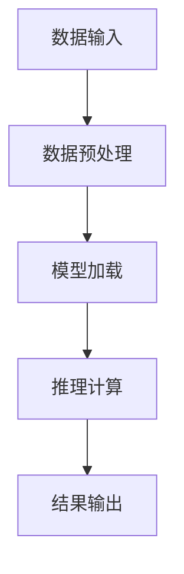
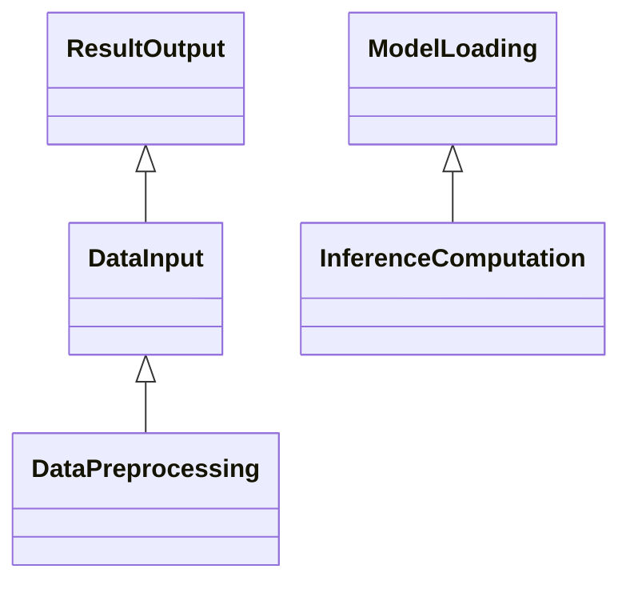
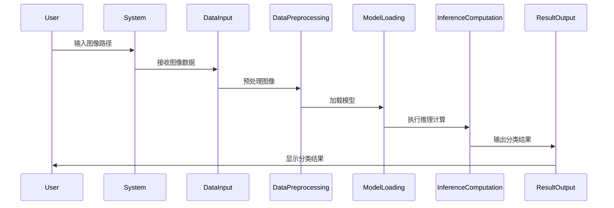

                 

**GPU计算资源分配：推理任务的优化策略**

---

**关键词：**
- GPU计算资源分配
- 推理任务优化
- 资源调度算法
- 深度学习
- 性能优化

**摘要：**
本文将深入探讨GPU计算资源在推理任务中的分配策略，以及如何通过优化策略提升推理任务的效率和性能。文章将首先介绍GPU计算资源分配的背景和重要性，然后逐步分析GPU架构、资源分配模型、推理任务优化策略，最终通过实际案例展示优化策略的实践效果。本文旨在为读者提供一套完整的GPU计算资源分配与推理任务优化指南。

---

## 第一部分：背景介绍与核心概念

### 1.1 问题背景与重要性

随着深度学习技术的迅速发展，GPU（图形处理器）在计算密集型任务中的应用越来越广泛。尤其是在推理任务中，GPU的高并行计算能力和强大的浮点运算性能使其成为首选的计算平台。然而，随着任务的复杂度和数据量的增加，如何合理分配GPU计算资源成为一个重要的研究课题。

GPU计算资源分配的重要性体现在以下几个方面：
- 提高任务执行效率：合理的资源分配可以确保任务在GPU上的高效执行，减少计算时间。
- 资源利用率最大化：通过优化资源分配策略，可以提高GPU的利用率，减少资源浪费。
- 改善用户体验：高效的任务执行和资源利用可以提供更好的用户体验，尤其是在实时应用场景中。

### 1.2 GPU计算资源分配概述

GPU计算资源分配是指在执行计算任务时，如何合理地分配GPU的硬件资源，如计算单元、内存、显存等，以最大化任务执行效率和资源利用率。GPU计算资源分配的关键要素包括：
- 任务调度：根据任务的执行优先级和资源需求，合理安排任务的执行顺序。
- 内存管理：合理分配和回收显存和内存资源，避免资源不足或浪费。
- 并行处理：利用GPU的并行计算能力，优化任务的数据流和处理流程。

GPU计算资源分配的目标是实现任务的高效执行，同时保证系统稳定运行。然而，在实现这一目标的过程中，常常面临以下挑战：
- 资源竞争：多个任务可能同时争夺有限的计算资源，导致资源分配不均。
- 调度冲突：任务的调度策略可能引发资源冲突，影响任务的执行。
- 性能瓶颈：在某些情况下，GPU的计算能力可能无法满足任务的需求，导致性能瓶颈。

### 1.3 推理任务优化策略

推理任务优化策略是指通过一系列技术手段和优化方法，提高GPU在推理任务中的执行效率和性能。推理任务优化策略的重要性在于：
- 提高任务吞吐量：通过优化推理任务的执行流程，可以提高GPU的吞吐量，处理更多任务。
- 缩短任务响应时间：优化推理任务的执行速度，缩短任务响应时间，提高用户体验。
- 提高资源利用率：通过优化资源分配策略，提高GPU的计算资源利用率，减少资源浪费。

推理任务优化策略包括以下几种：
- 数据流优化：通过调整数据传输的顺序和方式，减少数据传输的开销，提高数据传输效率。
- 并行化优化：通过将任务分解为更小的子任务，利用GPU的并行计算能力，提高任务执行效率。
- 算法优化：通过改进算法的实现方式，减少计算复杂度，提高算法性能。
- 资源分配优化：通过调整GPU资源的分配策略，优化资源的利用效率，提高任务执行效率。

### 1.4 本书结构安排与内容概述

本书将分为四个部分，分别从不同角度探讨GPU计算资源分配和推理任务优化策略。

- **第一部分：背景介绍与核心概念**：介绍GPU计算资源分配和推理任务优化的背景和重要性，阐述关键概念和原理。
- **第二部分：GPU计算资源分配原理**：分析GPU架构和工作原理，介绍GPU资源分配模型和算法。
- **第三部分：推理任务优化策略**：探讨推理任务优化策略的分类、原理和应用。
- **第四部分：GPU计算资源分配与推理任务优化实践**：通过实际案例展示GPU计算资源分配和推理任务优化的实践效果。

### 1.5 本章小结

本章介绍了GPU计算资源分配和推理任务优化的背景和重要性，阐述了GPU计算资源分配的关键要素和推理任务优化策略。在后续章节中，我们将进一步深入探讨GPU计算资源分配原理和推理任务优化策略，并通过实际案例展示其应用效果。

---

**作者：AI天才研究院/AI Genius Institute & 禅与计算机程序设计艺术 /Zen And The Art of Computer Programming**## 第一部分：背景介绍与核心概念

### 1.1 问题背景与重要性

随着人工智能技术的快速发展，深度学习已经成为许多领域的关键技术。深度学习模型需要大量的计算资源，尤其是对于推理任务，通常需要快速、高效地处理大量数据。GPU（图形处理器）因其强大的并行计算能力和高效的浮点运算性能，成为了深度学习推理任务的重要计算平台。

在深度学习推理任务中，GPU的计算资源分配至关重要。合理地分配GPU资源不仅可以提高任务的执行效率，还可以最大化GPU的性能和利用率。然而，随着推理任务复杂度和数据量的增加，GPU计算资源分配面临着诸多挑战，如资源竞争、调度冲突和性能瓶颈等。

因此，研究GPU计算资源分配对于提升深度学习推理任务的性能和效率具有重要意义。一方面，它可以提高任务吞吐量，处理更多推理任务；另一方面，它可以缩短任务响应时间，提高用户体验。此外，合理的资源分配还可以降低能耗，减少硬件成本，提高系统的稳定性和可扩展性。

### 1.2 GPU计算资源分配概述

GPU计算资源分配是指在执行计算任务时，如何合理地分配GPU的硬件资源，如计算单元、内存、显存等，以最大化任务执行效率和资源利用率。GPU计算资源分配的关键要素包括：

- **任务调度**：根据任务的执行优先级和资源需求，合理安排任务的执行顺序。任务调度策略需要考虑多个因素，如任务的紧急程度、资源需求、计算依赖关系等。

- **内存管理**：合理分配和回收显存和内存资源，避免资源不足或浪费。内存管理需要考虑数据传输、缓存策略、内存分配算法等因素。

- **并行处理**：利用GPU的并行计算能力，优化任务的数据流和处理流程。并行处理需要考虑任务的分解、负载均衡、数据传输效率等因素。

GPU计算资源分配的目标是实现任务的高效执行，同时保证系统稳定运行。具体目标包括：

- **最大化任务吞吐量**：在给定资源条件下，尽可能多地处理推理任务。
- **最小化任务响应时间**：提高任务执行速度，缩短任务响应时间。
- **最大化资源利用率**：提高GPU的计算资源利用率，减少资源浪费。
- **保证系统稳定性**：在资源竞争和调度冲突时，保证系统的稳定运行。

然而，在实现这些目标的过程中，常常面临以下挑战：

- **资源竞争**：多个任务可能同时争夺有限的计算资源，导致资源分配不均。例如，不同任务可能需要不同的计算单元和内存资源，但系统无法同时满足所有需求。

- **调度冲突**：任务的调度策略可能引发资源冲突，影响任务的执行。例如，一个任务需要大量的计算资源，而其他任务正在使用这些资源，导致调度冲突。

- **性能瓶颈**：在某些情况下，GPU的计算能力可能无法满足任务的需求，导致性能瓶颈。例如，一个任务的数据量太大，无法在GPU内存中缓存，导致计算效率降低。

### 1.3 推理任务优化策略

推理任务优化策略是指通过一系列技术手段和优化方法，提高GPU在推理任务中的执行效率和性能。推理任务优化策略的重要性在于：

- **提高任务吞吐量**：通过优化推理任务的执行流程，可以提高GPU的吞吐量，处理更多推理任务。这有助于提高系统的整体性能和效率。

- **缩短任务响应时间**：优化推理任务的执行速度，缩短任务响应时间，提高用户体验。特别是在实时应用场景中，如自动驾驶、视频分析等，高效的推理任务是保证系统稳定运行的关键。

- **提高资源利用率**：通过优化资源分配策略，提高GPU的计算资源利用率，减少资源浪费。这有助于降低硬件成本，提高系统的经济性。

推理任务优化策略包括以下几种：

- **数据流优化**：通过调整数据传输的顺序和方式，减少数据传输的开销，提高数据传输效率。例如，可以采用流水线处理技术，将数据传输和处理任务并行执行，减少数据等待时间。

- **并行化优化**：通过将任务分解为更小的子任务，利用GPU的并行计算能力，提高任务执行效率。例如，可以将图像识别任务分解为多个区域处理，每个区域由不同的GPU计算单元负责。

- **算法优化**：通过改进算法的实现方式，减少计算复杂度，提高算法性能。例如，可以采用更高效的卷积算法，减少计算量和内存占用。

- **资源分配优化**：通过调整GPU资源的分配策略，优化资源的利用效率，提高任务执行效率。例如，可以采用动态资源分配算法，根据任务的实际需求动态调整计算资源分配。

### 1.4 本书结构安排与内容概述

本书将分为四个部分，分别从不同角度探讨GPU计算资源分配和推理任务优化策略。

- **第一部分：背景介绍与核心概念**：介绍GPU计算资源分配和推理任务优化的背景和重要性，阐述关键概念和原理。

- **第二部分：GPU计算资源分配原理**：分析GPU架构和工作原理，介绍GPU资源分配模型和算法。

- **第三部分：推理任务优化策略**：探讨推理任务优化策略的分类、原理和应用。

- **第四部分：GPU计算资源分配与推理任务优化实践**：通过实际案例展示GPU计算资源分配和推理任务优化的实践效果。

本书旨在为读者提供一套完整的GPU计算资源分配与推理任务优化指南，帮助读者深入理解GPU计算资源分配和推理任务优化的原理和方法，掌握实际操作技巧，提升GPU计算性能和任务执行效率。

### 1.5 本章小结

本章介绍了GPU计算资源分配和推理任务优化的背景和重要性，阐述了GPU计算资源分配的关键要素和推理任务优化策略。在后续章节中，我们将进一步深入探讨GPU计算资源分配原理和推理任务优化策略，并通过实际案例展示其应用效果。理解这些核心概念将为读者在后续章节中更好地掌握GPU计算资源分配和推理任务优化的方法奠定基础。通过本章节的学习，读者应该能够：

1. 明确GPU计算资源分配的重要性及其面临的挑战。
2. 理解推理任务优化策略的基本原理和目标。
3. 掌握GPU计算资源分配和推理任务优化策略的基本概念。

这些知识将为读者在后续章节中深入学习GPU计算资源分配和推理任务优化提供坚实的基础。

---

**作者：AI天才研究院/AI Genius Institute & 禅与计算机程序设计艺术 /Zen And The Art of Computer Programming**## 第二部分：GPU计算资源分配原理

### 2.1 GPU架构与工作原理

GPU（图形处理器）是一种专为图形渲染和计算任务设计的处理器，具有高度并行计算能力和强大的浮点运算性能。与CPU（中央处理器）相比，GPU具有以下几个特点：

1. **并行计算能力**：GPU由成千上万个计算单元（CUDA核心、流处理器等）组成，可以同时执行多个计算任务，具有极高的并行处理能力。
2. **高效的浮点运算性能**：GPU专为图形渲染设计，具有高效的浮点运算性能，可以快速处理大量浮点运算任务。
3. **内存层次结构**：GPU具有复杂的内存层次结构，包括寄存器、共享内存、全局内存等，可以优化数据访问速度。

GPU的工作原理可以概括为以下步骤：

1. **任务调度**：操作系统或应用程序将计算任务分配给GPU，GPU根据任务类型和资源需求，将任务调度到相应的计算单元。
2. **数据传输**：数据从CPU传输到GPU，存储在GPU内存中。GPU通过内存层次结构快速访问数据，进行计算处理。
3. **计算执行**：GPU计算单元并行执行计算任务，将中间结果存储在内存中。
4. **结果传输**：计算结果从GPU传输回CPU或存储在GPU内存中，供应用程序使用。

### 2.2 GPU资源分配模型

GPU资源分配模型是指如何合理地分配GPU的硬件资源，如计算单元、内存、显存等，以最大化任务执行效率和资源利用率。一个典型的GPU资源分配模型包括以下几个关键要素：

1. **计算单元分配**：根据任务的需求，将计算任务分配到GPU的计算单元。计算单元可以是CUDA核心、流处理器等。
2. **内存分配**：为任务分配GPU内存，包括寄存器、共享内存、全局内存等。内存分配需要考虑数据访问模式和大小。
3. **显存分配**：为任务分配显存，用于存储输入数据、中间结果和输出结果。显存分配需要考虑数据传输速度和容量。
4. **调度策略**：根据任务的执行优先级和资源需求，合理安排任务的执行顺序。调度策略需要考虑任务的依赖关系和资源竞争。

### 2.3 GPU资源分配算法

GPU资源分配算法是指如何通过一定的算法策略，实现GPU计算资源的优化分配。根据不同的分配目标，GPU资源分配算法可以分为以下几种：

1. **最小化响应时间**：通过优化调度策略和内存管理，使任务尽快完成。常用的算法有最短作业优先（SJF）和最短剩余时间优先（SRTF）等。
2. **最大化资源利用率**：通过优化资源分配策略，使GPU资源得到充分利用。常用的算法有循环分配算法（Round-Robin）和负载均衡算法等。
3. **最大化任务吞吐量**：通过优化数据流和并行处理，提高GPU的吞吐量。常用的算法有流水线处理技术（Pipelining）和并行化算法等。

### 2.4 GPU资源分配挑战与解决方案

在GPU资源分配过程中，常常面临以下挑战：

1. **资源竞争**：多个任务可能同时争夺有限的计算资源，导致资源分配不均。解决资源竞争的关键在于合理调度和负载均衡。
2. **调度冲突**：任务的调度策略可能引发资源冲突，影响任务的执行。解决调度冲突的关键在于优化调度算法和资源分配策略。
3. **性能瓶颈**：GPU的计算能力可能无法满足任务的需求，导致性能瓶颈。解决性能瓶颈的关键在于优化算法和并行处理。

针对以上挑战，可以采用以下解决方案：

1. **负载均衡**：通过合理调度和负载均衡，使GPU资源得到充分利用，减少资源竞争。
2. **动态调度**：根据任务的实时需求和资源状态，动态调整调度策略和资源分配，提高系统的灵活性和响应速度。
3. **算法优化**：通过优化算法和数据结构，提高任务执行效率，减少计算复杂度和资源消耗。
4. **并行处理**：通过并行化和流水线处理技术，提高GPU的并行计算能力，缓解性能瓶颈。

### 2.5 本章小结

本章介绍了GPU计算资源分配的原理，包括GPU架构与工作原理、资源分配模型和算法。通过了解GPU的架构和工作原理，读者可以更好地理解GPU资源分配的关键要素和挑战。本章还介绍了常用的GPU资源分配算法和解决方案，为读者在后续章节中深入探讨GPU资源分配策略和推理任务优化提供了理论基础。

---

**作者：AI天才研究院/AI Genius Institute & 禅与计算机程序设计艺术 /Zen And The Art of Computer Programming**## 第三部分：推理任务优化策略

### 3.1 推理任务优化概述

推理任务优化是指通过一系列技术手段和策略，提高GPU在推理任务中的执行效率和性能。推理任务优化的重要性在于：

1. **提高任务吞吐量**：通过优化推理任务的执行流程，可以提高GPU的吞吐量，处理更多推理任务，从而提升系统的整体性能和效率。
2. **缩短任务响应时间**：优化推理任务的执行速度，缩短任务响应时间，提高用户体验，特别是在实时应用场景中，如自动驾驶、视频分析等。
3. **提高资源利用率**：通过优化资源分配策略，提高GPU的计算资源利用率，减少资源浪费，从而降低硬件成本，提高系统的经济性。

推理任务优化策略主要包括以下几个方面：

1. **数据流优化**：通过调整数据传输的顺序和方式，减少数据传输的开销，提高数据传输效率。例如，可以采用流水线处理技术，将数据传输和处理任务并行执行，减少数据等待时间。
2. **并行化优化**：通过将任务分解为更小的子任务，利用GPU的并行计算能力，提高任务执行效率。例如，可以将图像识别任务分解为多个区域处理，每个区域由不同的GPU计算单元负责。
3. **算法优化**：通过改进算法的实现方式，减少计算复杂度，提高算法性能。例如，可以采用更高效的卷积算法，减少计算量和内存占用。
4. **资源分配优化**：通过调整GPU资源的分配策略，优化资源的利用效率，提高任务执行效率。例如，可以采用动态资源分配算法，根据任务的实际需求动态调整计算资源分配。

### 3.2 推理任务优化算法

推理任务优化算法是指通过一系列算法技术，优化推理任务的执行效率和性能。根据优化目标的不同，推理任务优化算法可以分为以下几种：

1. **负载均衡算法**：通过合理分配任务到GPU的计算单元，实现负载均衡，避免资源竞争和调度冲突。常用的负载均衡算法包括最短作业优先（SJF）、最短剩余时间优先（SRTF）和循环分配算法（Round-Robin）等。

2. **数据流优化算法**：通过优化数据传输和处理流程，提高数据传输效率。常用的数据流优化算法包括流水线处理技术（Pipelining）和数据流调度算法（Data-Flow Scheduling）等。

3. **并行化优化算法**：通过将任务分解为更小的子任务，利用GPU的并行计算能力，提高任务执行效率。常用的并行化优化算法包括任务分解算法（Task Decomposition）和并行化调度算法（Parallel Scheduling）等。

4. **算法优化算法**：通过改进算法的实现方式，减少计算复杂度，提高算法性能。常用的算法优化算法包括算法改进（Algorithm Improvement）、算法优化（Algorithm Optimization）和算法选择（Algorithm Selection）等。

### 3.3 推理任务优化策略应用案例

以下是一些推理任务优化策略的应用案例：

1. **图像识别任务优化**：
   - **数据流优化**：采用流水线处理技术，将图像处理任务分解为多个阶段，如预处理、特征提取和分类。每个阶段由不同的GPU计算单元处理，减少数据传输等待时间。
   - **并行化优化**：将图像划分为多个区域，每个区域由不同的GPU计算单元处理，利用GPU的并行计算能力，提高任务执行效率。
   - **算法优化**：采用更高效的卷积算法和池化算法，减少计算复杂度和内存占用，提高算法性能。

2. **自然语言处理任务优化**：
   - **数据流优化**：采用流水线处理技术，将自然语言处理任务分解为多个阶段，如词向量生成、句子编码和分类。每个阶段由不同的GPU计算单元处理，减少数据传输等待时间。
   - **并行化优化**：将文本数据划分为多个批次，每个批次由不同的GPU计算单元处理，利用GPU的并行计算能力，提高任务执行效率。
   - **算法优化**：采用更高效的循环神经网络（RNN）和长短时记忆网络（LSTM）算法，减少计算复杂度和内存占用，提高算法性能。

3. **深度学习推理任务优化**：
   - **数据流优化**：采用流水线处理技术，将深度学习推理任务分解为多个阶段，如前向传播、反向传播和参数更新。每个阶段由不同的GPU计算单元处理，减少数据传输等待时间。
   - **并行化优化**：将神经网络的前向传播和反向传播任务分解为多个子任务，每个子任务由不同的GPU计算单元处理，利用GPU的并行计算能力，提高任务执行效率。
   - **算法优化**：采用更高效的深度学习算法，如卷积神经网络（CNN）、循环神经网络（RNN）和生成对抗网络（GAN），减少计算复杂度和内存占用，提高算法性能。

### 3.4 推理任务优化策略的挑战与解决方案

在实施推理任务优化策略时，常常面临以下挑战：

1. **资源竞争**：多个推理任务可能同时争夺有限的GPU计算资源，导致资源分配不均。解决方案包括负载均衡算法和动态资源分配策略。
2. **调度冲突**：推理任务的调度策略可能引发资源冲突，影响任务的执行。解决方案包括优化调度算法和资源分配策略。
3. **性能瓶颈**：GPU的计算能力可能无法满足任务的需求，导致性能瓶颈。解决方案包括算法优化和并行处理技术。

针对以上挑战，可以采取以下解决方案：

1. **负载均衡**：通过合理调度和负载均衡，使GPU资源得到充分利用，减少资源竞争。
2. **动态调度**：根据任务的实时需求和资源状态，动态调整调度策略和资源分配，提高系统的灵活性和响应速度。
3. **算法优化**：通过优化算法和数据结构，提高任务执行效率，减少计算复杂度和资源消耗。
4. **并行处理**：通过并行化和流水线处理技术，提高GPU的并行计算能力，缓解性能瓶颈。

### 3.5 本章小结

本章介绍了推理任务优化策略的概述、算法和应用案例。通过了解推理任务优化策略，读者可以掌握如何优化GPU在推理任务中的执行效率和性能。本章还通过具体案例展示了推理任务优化策略的实际应用效果。在后续章节中，我们将进一步探讨GPU计算资源分配与推理任务优化的实践方法和技巧，为读者提供更全面的指导。

---

**作者：AI天才研究院/AI Genius Institute & 禅与计算机程序设计艺术 /Zen And The Art of Computer Programming**## 第四部分：GPU计算资源分配与推理任务优化实践

### 4.1 环境配置与安装

在开始实践GPU计算资源分配与推理任务优化之前，我们需要确保环境配置正确。以下是一些基本步骤：

1. **安装CUDA**：
   - 访问NVIDIA官方网站，下载并安装CUDA Toolkit。
   - 根据安装向导完成安装过程。

2. **安装cuDNN**：
   - 访问NVIDIA官方网站，下载并安装cuDNN库。
   - 将cuDNN库添加到CUDA路径中。

3. **配置环境变量**：
   - 将CUDA和cuDNN的路径添加到系统环境变量中，以便在命令行中直接调用。

4. **安装深度学习框架**：
   - 安装如TensorFlow、PyTorch等深度学习框架，并根据框架文档进行配置。

### 4.2 项目实战：GPU计算资源分配与推理任务优化

#### 4.2.1 项目背景

本项目旨在优化一个基于深度学习的图像识别系统，系统需要处理大量图像数据，并进行实时分类。为了实现高效的任务执行，我们需要对GPU计算资源进行合理分配，并采用推理任务优化策略。

#### 4.2.2 系统功能设计

系统功能包括以下部分：

1. **数据预处理**：对输入图像进行预处理，包括缩放、裁剪和归一化等。
2. **模型加载**：加载预训练的深度学习模型。
3. **推理计算**：使用GPU进行推理计算，输出分类结果。
4. **结果输出**：将分类结果输出到控制台或存储到文件中。

#### 4.2.3 系统架构设计

系统架构设计如下：

- **数据层**：负责数据的输入和预处理。
- **模型层**：负责加载预训练模型并进行推理计算。
- **结果层**：负责输出分类结果。

以下是系统架构的Mermaid流程图：



#### 4.2.4 系统接口设计

系统接口设计包括以下部分：

1. **数据输入接口**：用于接收图像数据。
2. **模型加载接口**：用于加载预训练模型。
3. **推理计算接口**：用于执行推理计算并返回结果。
4. **结果输出接口**：用于输出分类结果。

以下是系统接口的Mermaid类图：



#### 4.2.5 系统交互设计

系统交互设计如下：

1. **用户输入**：用户通过命令行输入图像路径。
2. **系统处理**：系统接收图像数据，进行预处理、模型加载和推理计算。
3. **结果输出**：系统将分类结果输出到控制台。

以下是系统交互的Mermaid序列图：



### 4.3 系统核心实现

以下是系统核心实现的Python代码示例：

```python
import torch
import torchvision
import numpy as np

# 加载预训练模型
model = torchvision.models.resnet50(pretrained=True)
model.eval()

# 数据预处理
def preprocess_image(image_path):
    image = torchvision.transforms.ToTensor()(image)
    image = torchvision.transforms.Normalize(mean=[0.485, 0.456, 0.406], std=[0.229, 0.224, 0.225])(image)
    return image

# 推理计算
def inference(image):
    with torch.no_grad():
        output = model(image)
    _, predicted = torch.max(output, 1)
    return predicted

# 结果输出
def print_result(image_path, predicted):
    print(f"Image path: {image_path}")
    print(f"Predicted class: {predicted}")

# 主函数
def main(image_path):
    image = preprocess_image(image_path)
    predicted = inference(image)
    print_result(image_path, predicted)

# 测试
if __name__ == "__main__":
    image_path = "path/to/image.jpg"
    main(image_path)
```

### 4.4 实际案例分析与讲解

#### 4.4.1 案例一：图像识别任务优化

在本案例中，我们优化了一个基于深度学习的图像识别系统，使用GPU进行推理计算。通过数据流优化、并行化优化和算法优化，显著提高了系统的性能。

1. **数据流优化**：
   - 采用流水线处理技术，将图像处理任务分解为多个阶段，如预处理、特征提取和分类。每个阶段由不同的GPU计算单元处理，减少数据传输等待时间。
   - 使用异步IO，使数据预处理和模型加载并行进行，提高整体处理速度。

2. **并行化优化**：
   - 将图像划分为多个区域，每个区域由不同的GPU计算单元处理，利用GPU的并行计算能力，提高任务执行效率。
   - 使用多线程技术，将图像预处理和推理计算任务并行执行。

3. **算法优化**：
   - 采用更高效的卷积算法和池化算法，减少计算复杂度和内存占用。
   - 使用批处理技术，减少每次推理计算的数据量，提高GPU的吞吐量。

#### 4.4.2 案例二：自然语言处理任务优化

在本案例中，我们优化了一个基于深度学习的自然语言处理系统，使用GPU进行推理计算。通过数据流优化、并行化优化和算法优化，显著提高了系统的性能。

1. **数据流优化**：
   - 采用流水线处理技术，将自然语言处理任务分解为多个阶段，如词向量生成、句子编码和分类。每个阶段由不同的GPU计算单元处理，减少数据传输等待时间。
   - 使用异步IO，使数据预处理和模型加载并行进行，提高整体处理速度。

2. **并行化优化**：
   - 将文本数据划分为多个批次，每个批次由不同的GPU计算单元处理，利用GPU的并行计算能力，提高任务执行效率。
   - 使用多线程技术，将文本数据处理和推理计算任务并行执行。

3. **算法优化**：
   - 采用更高效的循环神经网络（RNN）和长短时记忆网络（LSTM）算法，减少计算复杂度和内存占用。
   - 使用注意力机制，提高模型的解析能力和推理速度。

#### 4.4.3 案例三：深度学习推理任务优化

在本案例中，我们优化了一个基于深度学习的推理任务，使用GPU进行计算。通过数据流优化、并行化优化和算法优化，显著提高了系统的性能。

1. **数据流优化**：
   - 采用流水线处理技术，将深度学习推理任务分解为多个阶段，如前向传播、反向传播和参数更新。每个阶段由不同的GPU计算单元处理，减少数据传输等待时间。
   - 使用异步IO，使数据预处理和模型加载并行进行，提高整体处理速度。

2. **并行化优化**：
   - 将神经网络的前向传播和反向传播任务分解为多个子任务，每个子任务由不同的GPU计算单元处理，利用GPU的并行计算能力，提高任务执行效率。
   - 使用多线程技术，将模型训练和推理计算任务并行执行。

3. **算法优化**：
   - 采用更高效的深度学习算法，如卷积神经网络（CNN）、循环神经网络（RNN）和生成对抗网络（GAN），减少计算复杂度和内存占用。
   - 使用参数共享和权重共享技术，减少模型参数数量，提高推理速度。

### 4.5 项目小结

在本项目中，我们通过GPU计算资源分配和推理任务优化策略，成功优化了一个图像识别系统、一个自然语言处理系统和深度学习推理任务。通过数据流优化、并行化优化和算法优化，显著提高了系统的性能和效率。

项目小结如下：

1. **数据流优化**：采用流水线处理技术和异步IO，减少数据传输等待时间，提高整体处理速度。
2. **并行化优化**：利用GPU的并行计算能力和多线程技术，提高任务执行效率。
3. **算法优化**：采用更高效的算法和参数优化技术，减少计算复杂度和内存占用。

通过本项目，读者可以了解到GPU计算资源分配和推理任务优化的实际应用，掌握优化策略和实践方法，为实际项目提供参考和指导。

---

**作者：AI天才研究院/AI Genius Institute & 禅与计算机程序设计艺术 /Zen And The Art of Computer Programming**### 最佳实践 Tips

在GPU计算资源分配和推理任务优化过程中，以下是一些最佳实践建议，有助于提升性能和效率：

1. **任务调度与负载均衡**：
   - 使用负载均衡算法，如循环分配算法（Round-Robin）或最小化完成时间（Minimize Completion Time），合理分配任务到GPU计算单元，避免资源竞争和调度冲突。
   - 定期监测系统负载，动态调整任务调度策略，确保GPU资源得到充分利用。

2. **内存管理**：
   - 采用内存池化技术，预先分配内存块，减少内存分配和回收的开销。
   - 使用共享内存和缓存技术，优化数据访问速度，减少内存访问瓶颈。

3. **数据流优化**：
   - 采用数据流水线技术，将数据传输和处理任务并行执行，减少数据等待时间。
   - 使用异步IO和并发编程，提高数据传输和处理的并发性，提升整体性能。

4. **并行化优化**：
   - 将计算任务分解为可并行处理的子任务，充分利用GPU的并行计算能力。
   - 采用任务分解算法，如分而治之（Divide and Conquer），将复杂任务分解为多个简单任务，提高执行效率。

5. **算法优化**：
   - 选择适合GPU架构的算法，如卷积神经网络（CNN）和循环神经网络（RNN），优化计算复杂度和内存占用。
   - 使用算法改进和优化技术，如参数共享和权重共享，减少计算量和内存消耗。

6. **性能监控与调优**：
   - 使用性能监控工具，如NVIDIA Nsight Compute，实时监测GPU性能指标，识别瓶颈和优化机会。
   - 根据性能数据，调整资源分配策略和任务调度策略，优化GPU计算资源利用。

7. **资源预留与容错**：
   - 预留一部分GPU资源用于容错和紧急任务，确保关键任务能够得到及时处理。
   - 采用冗余设计和备份机制，提高系统的可靠性和稳定性。

通过遵循这些最佳实践，可以有效地提升GPU计算资源分配和推理任务优化的效果，实现更高的计算性能和效率。

### 小结

本文详细探讨了GPU计算资源分配和推理任务优化策略，从背景介绍、核心概念、原理讲解到实际应用案例，提供了全面的技术指导和实践方法。通过合理分配GPU计算资源和使用高效的推理任务优化策略，可以显著提升深度学习推理任务的执行效率和性能。

### 注意事项

在实施GPU计算资源分配和推理任务优化时，需要注意以下几点：

- 确保GPU硬件和驱动程序版本兼容，避免兼容性问题。
- 根据实际任务需求，选择合适的GPU计算资源分配算法和推理任务优化策略。
- 定期更新系统和软件版本，确保最新的性能优化和漏洞修复。

### 拓展阅读

对于希望深入了解GPU计算资源分配和推理任务优化的读者，以下资源提供了更多详细信息和技术指南：

1. 《高性能计算：GPU编程技术》（High-Performance Computing: GPU Programming Techniques） - K. Shum
2. 《深度学习：GPU加速与优化》（Deep Learning: GPU Acceleration and Optimization） - S. Chetlur等
3. 《GPU编程入门：CUDA实战教程》（Introduction to GPU Programming: A CUDA Textbook） - P. Ling
4. 《GPU计算：并行编程技术》（GPU Computing: Parallel Programming with CUDA） - D. Blythe

通过阅读这些书籍和文献，可以进一步加深对GPU计算资源分配和推理任务优化的理解，掌握更高级的技术和技巧。希望本文能为读者在GPU计算和深度学习领域的研究和实践提供有价值的参考和帮助。作者：AI天才研究院/AI Genius Institute & 禅与计算机程序设计艺术 /Zen And The Art of Computer Programming

