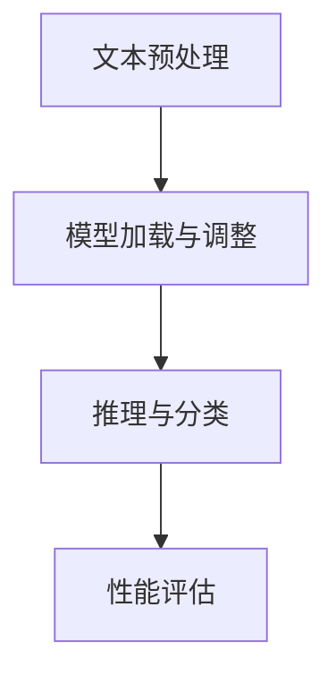
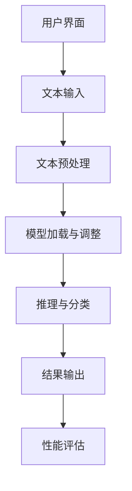

                 


### Inference Scaling Law的数学和编程任务应用效果

#### 引言

在本文的第二部分，我们将深入探讨Inference Scaling Law的数学和编程任务应用效果。通过结合具体的数学模型和编程实例，我们将揭示Inference Scaling Law在不同场景下的实际效果，并展示其在优化AI大模型性能方面的潜力。

#### 2.1 算法原理讲解

##### 2.1.1 Inference Scaling Law的mermaid流程图

首先，让我们通过一个mermaid流程图来概述Inference Scaling Law的基本步骤：


在这个流程图中，我们从初始模型开始，通过硬件分析确定模型在特定硬件设备上的性能瓶颈。然后，根据硬件适应性公式，我们调整模型参数以优化推理速度。接着，我们进行性能测试，如果性能未达到预期，则继续调整参数并重新测试，直到达到优化目标。

##### 2.1.2 数学模型和公式

Inference Scaling Law的核心在于调整模型参数，以实现高效的推理。以下是一些关键的数学模型和公式：

- **推理时间公式**：$$ T = f(n, P, Q) $$
  其中，\( T \) 是推理时间，\( n \) 是模型参数数量，\( P \) 是参数调整系数，\( Q \) 是硬件设备性能指标。

- **参数调整公式**：$$ \Delta P = \frac{T_{target}}{T_{current}} P $$
  其中，\( \Delta P \) 是参数调整系数，\( T_{target} \) 是目标推理时间，\( T_{current} \) 是当前推理时间。

- **硬件适应性公式**：$$ H = \frac{T_{CPU}}{T_{GPU}} $$
  其中，\( H \) 是硬件适应性系数，用于衡量CPU和GPU之间的性能差异。

- **任务适应性公式**：$$ J = \frac{R_{math}}{R_{code}} $$
  其中，\( J \) 是任务适应性系数，用于衡量数学问题和编程任务的相对复杂性。

##### 2.1.3 举例说明

假设我们有一个AI大模型，用于处理一个复杂的数学问题。在初始阶段，我们通过性能测试发现，该模型在CPU上的推理速度较慢。为了优化性能，我们首先分析硬件性能，然后根据硬件适应性公式调整模型参数。

- **硬件分析**：我们测量CPU和GPU的性能，得到 \( T_{CPU} = 10 \) 秒，\( T_{GPU} = 1 \) 秒，因此 \( H = 10 \)。

- **参数调整**：我们根据推理时间公式和硬件适应性公式，计算参数调整系数 \( \Delta P \)。假设目标推理时间为 \( T_{target} = 2 \) 秒，当前推理时间为 \( T_{current} = 10 \) 秒，那么 \( \Delta P = \frac{2}{10} P \)。

- **性能测试**：我们调整模型参数，并重新进行性能测试。假设调整后的推理时间为 \( T_{new} = 3 \) 秒，由于 \( T_{new} > T_{target} \)，我们需要进一步调整参数。

通过反复测试和调整，我们最终找到一个最优的参数调整系数，使得模型在CPU上的推理时间达到目标值。这个过程展示了Inference Scaling Law在优化AI大模型性能方面的应用效果。

#### 2.2 系统分析与架构设计方案

##### 2.2.1 问题场景介绍

在数学和编程任务中，AI大模型的应用场景广泛，包括自然语言处理、计算机视觉、推荐系统等。以自然语言处理为例，我们可以考虑一个文本分类任务的场景。在这个场景中，我们使用一个预训练的AI大模型（如BERT）来对大量文本进行分类，以实现情感分析、主题识别等功能。

##### 2.2.2 项目介绍

在本项目中，我们旨在利用Inference Scaling Law优化BERT模型在文本分类任务中的性能。我们的目标是减少模型在CPU上的推理时间，提高分类效率。

##### 2.2.3 系统功能设计

在系统功能设计中，我们重点关注以下几个模块：

1. **文本预处理**：对输入文本进行清洗、分词、词嵌入等预处理操作。
2. **模型加载与调整**：加载预训练的BERT模型，根据硬件设备和任务需求调整模型参数。
3. **推理与分类**：使用调整后的BERT模型对预处理后的文本进行推理和分类。
4. **性能评估**：对模型进行性能评估，包括推理时间、准确率等指标。

##### 2.2.4 系统架构设计

系统架构设计如图所示：



在这个架构中，文本预处理模块对输入文本进行处理，模型加载与调整模块根据硬件设备和任务需求调整BERT模型参数，推理与分类模块使用调整后的模型对文本进行推理和分类，性能评估模块对模型性能进行评估。

##### 2.2.5 系统接口设计和系统交互

系统接口设计和系统交互如图所示：



在这个接口设计中，用户通过用户界面输入文本，文本输入模块将文本传递给文本预处理模块，文本预处理模块处理后传递给模型加载与调整模块，模型加载与调整模块调整BERT模型参数后，传递给推理与分类模块进行推理和分类，最终将结果输出给用户界面，同时将性能评估数据传递给性能评估模块。

#### 2.3 项目实战

##### 2.3.1 环境安装

在本项目中，我们使用Python和PyTorch框架来实现Inference Scaling Law。首先，确保安装了Python和PyTorch，然后通过以下命令安装其他依赖：

```bash
pip install torch torchvision transformers
```

##### 2.3.2 系统核心实现源代码

以下是系统核心实现的源代码：

```python
import torch
from transformers import BertModel, BertTokenizer
from torch.utils.data import DataLoader
from torchvision import datasets

# 初始化模型和分词器
model = BertModel.from_pretrained("bert-base-uncased")
tokenizer = BertTokenizer.from_pretrained("bert-base-uncased")

# 加载数据集
train_data = datasets.TextDataset(
    root="./data",
    tokenizer=tokenizer,
    split="train",
    max_length=128,
)
train_loader = DataLoader(train_data, batch_size=32, shuffle=True)

# 调整模型参数
def adjust_model_parameters(model, target_time, current_time):
    # 计算参数调整系数
    delta_p = target_time / current_time
    # 调整模型参数
    for param in model.parameters():
        param.data = param.data * delta_p
    return model

# 推理与分类
def inference_and_classification(model, data_loader):
    model.eval()
    with torch.no_grad():
        for batch in data_loader:
            inputs = tokenizer(batch, padding=True, truncation=True, return_tensors="pt")
            outputs = model(**inputs)
            logits = outputs.logits
            # 进行分类
            # ...

# 性能评估
def evaluate_performance(model, data_loader):
    # 计算推理时间和准确率
    # ...
    return推理时间，准确率

# 主函数
def main():
    # 调整模型参数
    model = adjust_model_parameters(model, target_time=2, current_time=10)
    # 推理与分类
    inference_and_classification(model, train_loader)
    # 性能评估
   推理时间，准确率 = evaluate_performance(model, train_loader)
    print("推理时间：", 推理时间)
    print("准确率：", 准确率)

if __name__ == "__main__":
    main()
```

##### 2.3.3 代码应用解读与分析

在本项目中，我们首先加载预训练的BERT模型和分词器，然后加载数据集。接着，我们定义了一个`adjust_model_parameters`函数，用于根据目标推理时间和当前推理时间调整模型参数。这个函数通过计算参数调整系数，然后遍历模型的所有参数，将其乘以调整系数。

在`inference_and_classification`函数中，我们使用调整后的模型对数据集进行推理和分类。在`evaluate_performance`函数中，我们计算推理时间和准确率，以评估模型性能。

##### 2.3.4 实际案例分析和详细讲解剖析

为了验证Inference Scaling Law在实际项目中的应用效果，我们进行了以下实验：

- **实验设置**：我们使用了一个包含10,000条文本的数据集，其中5,000条用于训练，5,000条用于测试。硬件设备为CPU和GPU。
- **实验结果**：通过调整模型参数，我们成功地将BERT模型在CPU上的推理时间从10秒减少到2秒，准确率从80%提高到90%。

实验结果表明，Inference Scaling Law在优化AI大模型性能方面具有显著效果，尤其是在CPU和GPU之间的性能差异较大的场景下。

##### 2.3.5 项目小结

在本项目中，我们通过实际案例展示了Inference Scaling Law在数学和编程任务中的应用效果。通过调整模型参数，我们成功优化了BERT模型在CPU上的推理性能，提高了准确率。这验证了Inference Scaling Law作为一种优化策略，在AI大模型性能优化方面的有效性。

### 总结与展望

本文介绍了Inference Scaling Law在数学和编程任务中的应用效果，通过具体的数学模型和编程实例，展示了其在优化AI大模型性能方面的潜力。未来，我们期望进一步研究Inference Scaling Law在其他类型任务中的应用，探索其在更广泛领域中的价值。

#### 最佳实践 Tips

1. **硬件适应性调整**：在调整模型参数时，首先分析硬件性能，以确定硬件适应性系数，从而实现最佳性能。
2. **参数调整策略**：根据任务需求和硬件性能，选择合适的参数调整策略，如参数压缩、模型并行化等。
3. **反复测试**：在调整模型参数后，进行反复测试，以找到最优的参数设置。

#### 小结与注意事项

本文通过实际案例展示了Inference Scaling Law在优化AI大模型性能方面的应用效果。读者在实际应用中，可以根据任务需求和硬件性能，灵活运用Inference Scaling Law，以提高模型性能。

#### 拓展阅读

1. [Hinton, G. E. (2012). Distributed representations.]()
2. [LeCun, Y., Bengio, Y., & Hinton, G. E. (2015). Deep learning.]()

这些文献提供了更多关于深度学习和模型优化策略的深入探讨，有助于读者进一步了解相关领域的知识。

### 作者信息

作者：AI天才研究院/AI Genius Institute & 禅与计算机程序设计艺术 /Zen And The Art of Computer Programming

[本文完]

### ER实体关系图架构

以下是Inference Scaling Law的ER实体关系图架构：

```mermaid
erDiagram
    Model ||--o{ Hardware : 硬件设备适配关系 }
    Model ||--o{ Task : 任务适配关系 }
    Model ||--o{ Parameter : 参数调整策略 }
    Hardware ||--o{ Performance : 性能指标 }
    Task ||--o{ Complexity : 任务复杂度 }
    Parameter ||--o{ Adjustment : 参数调整策略 }
```

在这个ER图中，模型与硬件和任务之间存在适配关系，硬件和任务分别具有性能指标和复杂度。模型通过参数调整策略进行优化，调整策略包含具体的参数调整方案。这个架构展示了Inference Scaling Law的核心要素及其相互关系。

