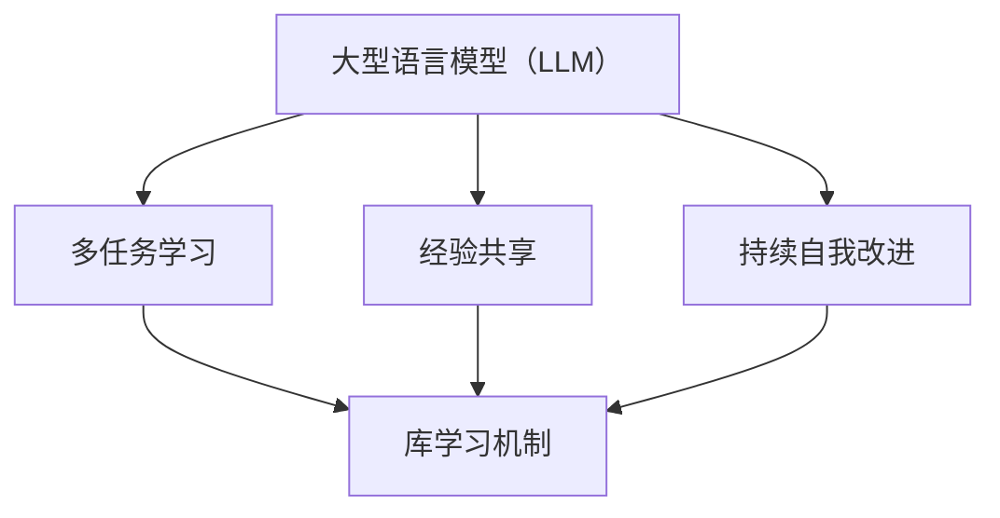
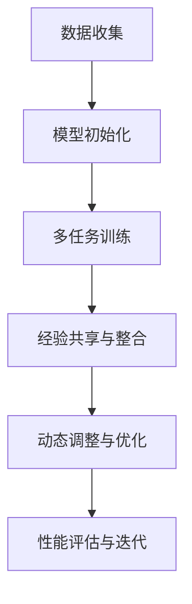

                 

## 引言

### 问题背景与研究方向

近年来，人工智能（AI）技术的发展突飞猛进，特别是在自然语言处理（NLP）领域，大型语言模型（LLM）如BERT、GPT等取得了令人瞩目的成就。然而，尽管这些模型在生成文本、翻译、问答等方面表现优异，但它们仍存在一些瓶颈，尤其是在自我改进和持续学习方面。为了解决这一问题，LLM代理采用库学习机制实现持续自我改进成为一个重要的研究方向。

LLM代理指的是利用LLM作为核心组件的智能代理系统，它可以在不同任务中自适应地学习和优化其性能。而库学习机制则是一种通过将模型在不同任务上的经验进行整合，从而提高模型泛化能力和持续学习效果的方法。通过这种方式，LLM代理能够不断吸收新的知识和经验，实现持续自我改进。

本文将围绕LLM代理采用库学习机制实现持续自我改进这一主题，深入探讨其背景、原理、实现方法以及应用前景。文章将首先介绍相关背景和问题描述，然后详细讲解核心概念和算法原理，最后通过实例分析、系统架构设计和项目实战，展示该机制的实用性和有效性。

### 目的和读者对象

本文的主要目的是为读者提供一个全面、系统的理解，帮助读者掌握LLM代理采用库学习机制实现持续自我改进的理论基础和实践方法。文章适合以下几类读者：

1. **人工智能领域的研究人员和开发者**：对于正在从事或对自然语言处理和人工智能领域有浓厚兴趣的研究人员和开发者，本文提供了一个深入了解LLM代理及其库学习机制的机会，有助于他们拓展研究领域和提升技术水平。

2. **机器学习工程师和数据科学家**：文章详细讲解了库学习机制的数学模型和算法原理，对从事机器学习和数据科学工作的工程师和科学家来说，有助于他们理解和应用这一先进的技术，提高模型性能和持续学习效果。

3. **技术管理者和技术决策者**：对于技术管理者和技术决策者，本文不仅提供了技术层面的深入分析，还探讨了这一技术在实际项目中的应用和潜在价值，有助于他们做出更科学、更有前瞻性的决策。

### 结构概述

本文将分为四个主要部分：

1. **背景介绍**：介绍LLM代理采用库学习机制实现持续自我改进的研究背景、核心概念和问题场景。

2. **算法原理讲解**：详细阐述库学习机制的工作原理、算法流程、数学模型和公式，并通过Python源代码和Mermaid流程图进行解释。

3. **系统分析与架构设计方案**：分析语言模型在具体场景中的应用，设计系统功能、架构和接口，并通过Mermaid图展示系统架构和交互流程。

4. **项目实战**：通过实际项目案例，介绍环境安装、系统核心实现源代码、代码应用解读与分析，以及项目小结和最佳实践。

最后，文章将总结全文内容，提出注意事项，并推荐拓展阅读，帮助读者进一步深入学习和研究。

## 第一部分：背景介绍

### 第1章：问题背景与问题描述

#### 1.1 问题背景

在当今社会，自然语言处理（NLP）技术已经成为人工智能（AI）领域的一个重要分支。随着深度学习技术的不断发展，大型语言模型（LLM）如BERT、GPT等在生成文本、翻译、问答等任务上取得了显著成效。这些模型通过学习海量文本数据，能够生成语义丰富、连贯性强的文本，极大地提升了AI系统的自然语言理解和生成能力。

然而，尽管LLM在众多任务上表现出色，它们仍面临一些局限性。首先，LLM通常只能针对特定的任务进行训练，这导致了它们在跨任务泛化能力上的欠缺。当模型遇到未曾见过的任务时，其性能往往显著下降。其次，LLM在自我改进和持续学习方面也存在挑战。传统的训练方法依赖于固定的数据集和预训练模型，模型在遇到新数据时难以自我调整，导致其学习效率和效果受限。

为了解决这些问题，研究者们提出了LLM代理采用库学习机制实现持续自我改进的方法。库学习机制通过将模型在不同任务上的经验进行整合，提高模型的泛化能力和持续学习效果。LLM代理则利用LLM作为核心组件，能够自适应地学习和优化其性能，从而实现持续自我改进。

#### 1.2 问题描述

在自然语言处理领域，LLM代理的自我改进需求主要体现在以下几个方面：

1. **跨任务泛化能力**：模型需要在多种任务上表现稳定，而不是仅限于特定任务。例如，一个LLM代理需要能够在文本生成、翻译、问答等多个任务中高效运作，而不是在每个任务上重新训练。

2. **持续学习效果**：模型需要能够从新数据中不断学习，并在遇到新任务时能够迅速适应。这要求模型不仅能够在现有数据上表现良好，还能在新的数据集上持续提升。

3. **自适应性能优化**：模型需要根据不同任务和环境动态调整其参数，以实现最佳性能。例如，在生成文本时，模型需要优化生成速度和文本质量之间的平衡。

#### 1.3 问题解决

为了解决上述问题，LLM代理采用库学习机制实现持续自我改进的方法应运而生。库学习机制的核心思想是通过将模型在不同任务上的经验进行整合，从而提高模型的泛化能力和持续学习效果。具体来说，该方法包括以下几个步骤：

1. **数据集成**：收集并整合来自不同任务的训练数据，构建一个多任务数据集。这些数据集不仅包含现有的任务数据，还包括历史数据和模拟数据。

2. **模型训练**：使用多任务数据集对LLM代理进行训练，使其能够学习到不同任务之间的共性。通过这种方式，模型能够在多种任务上表现稳定。

3. **经验共享**：将模型在不同任务上的经验进行共享，使其能够从一种任务的学习中受益，从而提高跨任务的泛化能力。

4. **动态调整**：在遇到新任务时，LLM代理能够根据新数据动态调整其参数，实现持续学习。通过这种方式，模型能够迅速适应新环境，提高学习效率和效果。

5. **性能优化**：LLM代理能够根据不同任务和环境动态调整其性能，实现最佳性能。例如，在生成文本时，模型可以根据任务要求优化生成速度和文本质量之间的平衡。

通过以上方法，LLM代理采用库学习机制实现了持续自我改进，不仅提升了跨任务的泛化能力，还提高了模型的持续学习效果和自适应性能优化能力。这一方法为自然语言处理领域提供了一种新的解决方案，有望推动AI技术的发展和应用。

#### 1.4 边界与外延

尽管LLM代理采用库学习机制实现持续自我改进的方法在理论和实践中都显示出巨大潜力，但仍存在一些边界和挑战。以下是对这些边界和外延的详细讨论：

1. **数据质量和多样性**：库学习机制依赖于大量且多样化的训练数据。然而，实际应用中，获取高质量、多样化的数据集仍然是一个挑战。数据的质量直接影响模型的学习效果，因此，如何有效地收集和整理数据成为关键问题。

2. **计算资源**：库学习机制通常涉及大规模的数据集和多任务训练，这需要大量的计算资源。对于一些资源有限的场景，如嵌入式设备和移动端应用，如何优化计算资源以支持库学习成为重要课题。

3. **模型解释性**：尽管库学习机制能够提高模型的泛化能力和持续学习效果，但其内部机制较为复杂，模型的解释性较差。这给模型的可解释性和透明度带来了一定的挑战，特别是在需要高解释性的领域，如医疗诊断和法律咨询等。

4. **任务适应性**：库学习机制需要在多种任务中表现稳定，但不同任务之间的差异可能导致模型适应性不足。如何设计自适应的库学习机制，使其在不同任务中都能表现出色，是一个需要深入探讨的问题。

5. **安全性和隐私保护**：在多任务训练和数据共享过程中，如何保护用户数据的安全性和隐私是一个重要的伦理问题。特别是在涉及敏感数据的场景中，如金融和医疗领域，如何确保数据的安全和隐私成为关键挑战。

6. **实时性**：在某些实时性要求较高的场景中，如实时语音识别和机器翻译，库学习机制需要快速适应新数据和任务，这对其实时性提出了挑战。如何优化算法，提高实时处理能力，是一个亟待解决的问题。

通过以上讨论，我们可以看到，LLM代理采用库学习机制实现持续自我改进的方法虽然在理论上具有巨大潜力，但在实际应用中仍面临一系列挑战。这些边界和外延问题的解决，将有助于进一步推动库学习机制在自然语言处理和其他人工智能领域的发展和应用。

## 第二部分：核心概念与联系

### 第2章：核心概念与联系

#### 2.1 大型语言模型（LLM）

**定义**：
大型语言模型（LLM，Large Language Model）是一种基于深度学习的自然语言处理模型，通过学习大量的文本数据，可以生成语义丰富、连贯性强的文本，并在多种语言任务上表现出色。

**核心特点**：
1. **大规模**：LLM通常由数亿甚至数千亿个参数组成，能够处理复杂的语言现象。
2. **自适应**：LLM可以自适应地调整其参数，以适应不同的语言任务和场景。
3. **泛化能力强**：通过学习大量文本数据，LLM能够在未见过的数据上生成高质量的文本。

#### 2.2 库学习机制

**基本概念**：
库学习（Library Learning）是一种通过整合多个任务的经验，提高模型泛化能力和持续学习效果的方法。它通过将模型在不同任务上的经验进行共享，从而提升模型的整体性能。

**在LLM中的应用**：
1. **多任务学习**：通过将多个任务的训练数据集成，对LLM进行多任务学习，提高其在不同任务上的泛化能力。
2. **经验共享**：LLM在不同任务上的学习经验可以被共享，从而在遇到新任务时，能够快速适应并提高性能。
3. **持续学习**：通过不断更新和优化LLM的参数，使其能够从新数据和新任务中持续学习，提高其持续学习能力。

#### 2.3 持续自我改进

**意义**：
持续自我改进是指模型能够在使用过程中不断学习和优化其性能，以适应不断变化的环境和任务需求。对于LLM来说，这意味着模型能够在生成文本、翻译、问答等任务中不断改进，提高其表现。

**方法与流程**：
1. **数据收集**：收集并整合来自不同任务和历史数据的训练集，为模型的持续学习提供基础。
2. **模型更新**：通过多任务学习和经验共享，对LLM进行更新和优化，提高其在多种任务上的性能。
3. **性能评估**：定期对模型进行性能评估，以监测其改进效果，并根据评估结果调整学习策略。
4. **迭代优化**：通过不断迭代，模型能够在新的数据和任务中持续学习和优化，实现自我改进。

#### 概念属性特征对比表格

| 概念                 | 定义                                         | 特点                                                         | 在LLM中的角色           |
|----------------------|--------------------------------------------|--------------------------------------------------------------|------------------------|
| 大型语言模型（LLM）   | 基于深度学习的学习模型，用于生成和理解文本 | 大规模、自适应、泛化能力强                               | 核心组件，生成文本的引擎 |
| 库学习机制           | 通过整合多个任务的经验，提高模型性能的方法 | 多任务学习、经验共享、持续学习                           | 提升LLM泛化能力的工具   |
| 持续自我改进         | 模型在应用过程中不断学习和优化性能的过程 | 数据收集、模型更新、性能评估、迭代优化                   | 实现LLM性能优化的方法   |

#### 概念结构与核心要素组成

为了更好地理解LLM代理采用库学习机制实现持续自我改进，我们使用Mermaid绘制了其概念结构图：



- **大型语言模型（LLM）**：作为核心组件，LLM负责生成和理解文本。
- **多任务学习**：通过整合多个任务的训练数据，提升LLM在不同任务上的泛化能力。
- **经验共享**：将LLM在不同任务上的学习经验进行共享，以提高其整体性能。
- **持续自我改进**：LLM在应用过程中不断学习和优化，以适应新任务和环境。

通过上述核心概念的介绍和概念结构图，我们可以清晰地理解LLM代理采用库学习机制实现持续自我改进的基本框架。在接下来的章节中，我们将进一步深入探讨库学习机制的工作原理、数学模型以及实际应用，帮助读者全面掌握这一先进技术。

### 第3章：算法原理讲解

#### 3.1 算法概述

LLM代理采用库学习机制实现持续自我改进的算法，主要包含以下几个核心组成部分：

1. **大型语言模型（LLM）**：作为算法的核心组件，负责生成和理解文本。LLM通过学习大量文本数据，可以生成语义丰富、连贯性强的文本，并在多种语言任务上表现出色。

2. **多任务学习**：通过将多个任务的训练数据集成，对LLM进行训练，以提高其在不同任务上的泛化能力。多任务学习能够使模型在学习一个任务时，同时学习其他任务，从而提升模型的跨任务性能。

3. **经验共享**：将LLM在不同任务上的学习经验进行共享，使其能够从一种任务的学习中受益，从而提高跨任务的泛化能力和持续学习效果。

4. **动态调整**：在遇到新任务时，LLM能够根据新数据动态调整其参数，实现持续学习。通过这种方式，模型能够迅速适应新环境，提高学习效率和效果。

5. **性能评估与优化**：定期对模型进行性能评估，以监测其改进效果，并根据评估结果调整学习策略。通过迭代优化，模型能够在新的数据和任务中不断学习和提升性能。

#### 3.2 算法流程

LLM代理采用库学习机制实现持续自我改进的算法流程可以分为以下几个步骤：

1. **数据收集**：
   - 收集并整合来自不同任务和历史数据的训练集。这些数据集不仅包含现有的任务数据，还包括历史数据和模拟数据。
   - 确保数据的质量和多样性，以支持模型的多任务学习和经验共享。

2. **模型初始化**：
   - 使用预训练的LLM作为初始化模型。预训练模型已经学习到了大量的文本数据，为后续的多任务学习和经验共享提供了基础。

3. **多任务训练**：
   - 将多个任务的训练数据输入到LLM中，通过多任务学习框架对模型进行训练。在这一过程中，模型会学习到不同任务之间的共性和差异，提高其在多种任务上的泛化能力。

4. **经验共享与整合**：
   - 在多任务训练过程中，LLM会不断更新其参数，并积累不同任务上的经验。通过经验共享机制，这些经验会被整合到模型中，从而提高模型的泛化能力和持续学习效果。

5. **动态调整与优化**：
   - 当遇到新任务时，LLM会根据新数据动态调整其参数，进行持续学习。通过这种方式，模型能够迅速适应新环境，并在新的数据和任务中提升性能。

6. **性能评估与迭代**：
   - 定期对模型进行性能评估，以监测其改进效果。通过评估结果，调整学习策略和优化方法，实现模型的持续迭代和自我改进。

#### 3.3 算法mermaid流程图

为了更直观地展示算法流程，我们使用Mermaid绘制了LLM代理采用库学习机制实现持续自我改进的mermaid流程图：



#### 3.4 Python源代码与详细讲解

以下是一个简单的Python源代码示例，展示了LLM代理采用库学习机制实现持续自我改进的基本实现过程。我们将逐步讲解代码的各个部分。

```python
# 导入必要的库
import torch
from torch import nn
from torch.optim import Adam
from transformers import BertModel, BertTokenizer

# 模型初始化
model = BertModel.from_pretrained('bert-base-uncased')
tokenizer = BertTokenizer.from_pretrained('bert-base-uncased')

# 定义损失函数和优化器
loss_fn = nn.CrossEntropyLoss()
optimizer = Adam(model.parameters(), lr=1e-5)

# 数据收集与预处理
def preprocess_data(task_data):
    # 对任务数据进行预处理，如分词、编码等
    inputs = tokenizer(task_data, padding=True, truncation=True, return_tensors='pt')
    return inputs

# 多任务训练
def train(model, data_loader, loss_fn, optimizer):
    model.train()
    for inputs in data_loader:
        # 前向传播
        outputs = model(**inputs)
        logits = outputs.logits
        labels = inputs['labels']
        
        # 计算损失
        loss = loss_fn(logits, labels)
        
        # 反向传播
        optimizer.zero_grad()
        loss.backward()
        optimizer.step()
        
        # 输出训练进度
        print(f"Epoch: {epoch}, Loss: {loss.item()}")

# 持续自我改进
def continuous_learning(model, new_data_loader):
    model.train()
    for inputs in new_data_loader:
        # 前向传播
        outputs = model(**inputs)
        logits = outputs.logits
        labels = inputs['labels']
        
        # 计算损失
        loss = loss_fn(logits, labels)
        
        # 反向传播
        optimizer.zero_grad()
        loss.backward()
        optimizer.step()
        
        # 输出训练进度
        print(f"Continuous Learning, Epoch: {epoch}, Loss: {loss.item()}")

# 实际应用
def main():
    # 加载训练数据
    train_data = preprocess_data("Your training data here")
    new_data = preprocess_data("Your new data here")

    # 训练模型
    train(model, train_data, loss_fn, optimizer)

    # 持续学习
    continuous_learning(model, new_data)

if __name__ == "__main__":
    main()
```

**代码解析**：

1. **模型初始化**：我们使用预训练的BERT模型作为初始化模型，并定义了损失函数和优化器。

2. **数据收集与预处理**：`preprocess_data`函数对任务数据进行预处理，包括分词、编码等操作，以适应模型的输入。

3. **多任务训练**：`train`函数负责多任务训练，通过迭代训练数据，进行前向传播、计算损失、反向传播和优化模型参数。

4. **持续自我改进**：`continuous_learning`函数用于在新数据集上进行持续学习，同样通过迭代新数据，优化模型参数。

5. **实际应用**：`main`函数是整个程序的主入口，负责加载训练数据和新的数据集，并执行多任务训练和持续自我改进。

通过上述代码示例和详细讲解，我们可以看到LLM代理采用库学习机制实现持续自我改进的基本流程和实现方法。在接下来的章节中，我们将进一步探讨LLM代理采用库学习机制在数学模型和系统架构设计方面的具体实现。

### 第4章：数学模型和数学公式

#### 4.1 数学模型

为了深入理解LLM代理采用库学习机制实现持续自我改进的算法，我们需要详细探讨其数学模型。本节将介绍LLM代理的数学模型，并使用LaTeX格式给出相关公式。

**1. 模型定义**

假设我们有一个大型语言模型（LLM），其参数表示为 \( \theta \)。该模型接受输入 \( x \) 并输出预测 \( y \)。我们可以将LLM表示为：

\[ y = f(\theta, x) \]

其中，\( f \) 是一个复杂的非线性函数，用于将输入映射到输出。

**2. 多任务学习**

在多任务学习中，我们假设有多个任务 \( T_1, T_2, ..., T_n \)，每个任务有一个对应的标签集 \( L_1, L_2, ..., L_n \)。多任务学习的目标是同时优化模型在多个任务上的性能。我们可以使用损失函数 \( L \) 来度量模型在每个任务上的表现：

\[ L = \sum_{i=1}^{n} L_i(\theta, x_i, y_i) \]

其中，\( L_i \) 是任务 \( T_i \) 的损失函数，\( x_i \) 和 \( y_i \) 分别是任务 \( T_i \) 的输入和标签。

**3. 经验共享**

在经验共享机制中，我们希望将模型在不同任务上的经验进行整合。一个常用的方法是基于任务相似性度量来调整模型参数。假设任务 \( T_i \) 和 \( T_j \) 的相似性度量分别为 \( s(i, j) \)，则我们可以定义经验共享的损失函数为：

\[ L_{share} = \sum_{i=1}^{n} \sum_{j=1}^{n} s(i, j) \cdot L_i(\theta, x_i, y_i) \]

**4. 持续自我改进**

持续自我改进的目标是使模型能够从新数据和任务中持续学习。假设我们有一个新的任务 \( T_{new} \)，其输入和标签分别为 \( x_{new} \) 和 \( y_{new} \)。为了实现持续自我改进，我们可以定义一个动态调整的损失函数：

\[ L_{update} = \lambda \cdot L_{new} + (1 - \lambda) \cdot L \]

其中，\( L_{new} \) 是新任务 \( T_{new} \) 的损失函数，\( \lambda \) 是更新率，用于控制旧经验和新经验的影响程度。

#### 4.2 详细讲解

为了更好地理解上述数学模型，我们将在以下部分使用LaTeX格式详细讲解每个公式。

**1. 模型定义**

\[ y = f(\theta, x) \]

该公式表示LLM的输出 \( y \) 是模型参数 \( \theta \) 和输入 \( x \) 的函数。这里，\( f \) 是一个复杂的非线性函数，可以采用深度学习模型如BERT、GPT等进行实现。

**2. 多任务学习**

\[ L = \sum_{i=1}^{n} L_i(\theta, x_i, y_i) \]

该公式表示多任务学习的总损失 \( L \) 是各个任务损失 \( L_i \) 的加权和。这里，\( L_i \) 是针对任务 \( T_i \) 的损失函数，通常采用交叉熵损失函数来度量模型预测与实际标签之间的差距。

**3. 经验共享**

\[ L_{share} = \sum_{i=1}^{n} \sum_{j=1}^{n} s(i, j) \cdot L_i(\theta, x_i, y_i) \]

该公式表示经验共享的损失函数 \( L_{share} \)。这里，\( s(i, j) \) 是任务 \( T_i \) 和 \( T_j \) 之间的相似性度量。一个简单的相似性度量可以是任务标签的Jaccard相似度。

**4. 持续自我改进**

\[ L_{update} = \lambda \cdot L_{new} + (1 - \lambda) \cdot L \]

该公式表示持续自我改进的动态调整损失函数 \( L_{update} \)。这里，\( \lambda \) 是更新率，用于控制模型在旧数据和新数据之间的平衡。较大的 \( \lambda \) 值表示更倾向于新数据，而较小的 \( \lambda \) 值表示更倾向于旧数据。

通过上述数学模型和公式的详细讲解，我们可以更好地理解LLM代理采用库学习机制实现持续自我改进的算法原理。这些数学模型为算法的实现提供了理论基础，也为后续的系统架构设计和项目实战提供了指导。

#### 4.3 举例说明

为了更直观地展示LLM代理采用库学习机制实现持续自我改进的算法原理，我们将通过一个具体的例子来进行详细讲解。假设我们有一个大型语言模型（LLM）用于完成两个任务：文本分类和情感分析。

**1. 任务定义**

- **文本分类**：输入一段文本，输出该文本所属的类别。例如，给定一段文本“我今天过得很好”，模型预测该文本属于“积极情绪”类别。
- **情感分析**：输入一段文本，输出该文本的情感极性。例如，给定一段文本“这是一个非常无聊的讲座”，模型预测该文本的情感极性为“负面”。

**2. 数据集**

我们有两个数据集，分别用于训练文本分类和情感分析任务：

- **文本分类数据集**：包含1000条文本，每条文本有一个对应的类别标签。
- **情感分析数据集**：包含1000条文本，每条文本有一个对应的情感极性标签。

**3. 模型训练**

首先，我们使用两个数据集对LLM进行训练，分别优化模型在文本分类和情感分析任务上的性能。

1. **文本分类训练**：

   - 输入：一段文本（例如：“我今天过得很好”）
   - 输出：类别标签（例如：“积极情绪”）
   - 损失函数：交叉熵损失函数

   训练过程：
   ```python
   inputs = tokenizer("我今天过得很好", padding=True, truncation=True, return_tensors='pt')
   logits = model(**inputs)
   labels = torch.tensor([1])  # 假设“积极情绪”类别标签为1
   loss = loss_fn(logits.logits, labels)
   optimizer.zero_grad()
   loss.backward()
   optimizer.step()
   ```

2. **情感分析训练**：

   - 输入：一段文本（例如：“这是一个非常无聊的讲座”）
   - 输出：情感极性标签（例如：“负面”）
   - 损失函数：交叉熵损失函数

   训练过程：
   ```python
   inputs = tokenizer("这是一个非常无聊的讲座", padding=True, truncation=True, return_tensors='pt')
   logits = model(**inputs)
   labels = torch.tensor([0])  # 假设“负面”情感极性标签为0
   loss = loss_fn(logits.logits, labels)
   optimizer.zero_grad()
   loss.backward()
   optimizer.step()
   ```

**4. 经验共享**

在多任务训练过程中，LLM会同时优化在文本分类和情感分析任务上的性能。通过经验共享机制，模型在不同任务上的经验会相互影响，从而提升整体性能。

**5. 持续自我改进**

假设我们在训练过程中遇到了一个新的文本分类任务，包含100条新文本。我们希望LLM能够在新任务上持续自我改进。

1. **新任务训练**：

   - 输入：一段新文本（例如：“我最近开始学习Python”）
   - 输出：类别标签（例如：“学习相关”）
   - 损失函数：交叉熵损失函数

   训练过程：
   ```python
   inputs = tokenizer("我最近开始学习Python", padding=True, truncation=True, return_tensors='pt')
   logits = model(**inputs)
   labels = torch.tensor([2])  # 假设“学习相关”类别标签为2
   loss = loss_fn(logits.logits, labels)
   optimizer.zero_grad()
   loss.backward()
   optimizer.step()
   ```

2. **动态调整**：

   - 使用动态调整的损失函数 \( L_{update} \)，结合旧任务和新任务的损失，优化模型参数。

   训练过程：
   ```python
   lambda = 0.5  # 更新率
   L_old = loss_fn(logits_old.logits, labels_old)
   L_new = loss_fn(logits_new.logits, labels_new)
   loss = lambda * L_new + (1 - lambda) * L_old
   optimizer.zero_grad()
   loss.backward()
   optimizer.step()
   ```

通过这个具体例子，我们可以看到LLM代理采用库学习机制实现持续自我改进的整个过程。通过多任务训练、经验共享和动态调整，LLM能够在不同任务中持续学习和优化，从而提升整体性能。这为LLM在实际应用中的自我改进提供了有效的方法和思路。

### 第5章：系统分析与架构设计

#### 5.1 问题场景介绍

为了更好地理解和应用LLM代理采用库学习机制实现持续自我改进的方法，我们需要首先介绍一个具体的应用场景。这里，我们以智能客服系统为例，探讨LLM代理在该场景中的应用。

**1. 场景背景**

智能客服系统是现代企业中广泛使用的一项技术，用于提供24小时在线客户支持，提高客户满意度和业务效率。传统的客服系统通常依赖于预定义的问答库和简单的关键词匹配算法，这导致其回答能力有限，难以满足复杂和多变的客户需求。

**2. 任务需求**

为了提升智能客服系统的回答能力，我们需要实现以下几个任务：

- **文本分类**：对用户输入的文本进行分类，将其归类到相应的主题类别中。
- **情感分析**：分析用户文本的情感极性，判断用户情绪是否积极、中性或消极。
- **回答生成**：根据用户输入的文本和系统内部的知识库，生成高质量的回答。

**3. 场景特点**

- **多变性**：客户问题的内容和形式多种多样，系统需要具备良好的泛化能力。
- **实时性**：客服系统需要能够快速响应用户请求，提供实时支持。
- **知识更新**：随着业务发展和用户需求变化，系统需要不断学习和更新知识库。

#### 5.2 系统功能设计

在智能客服系统中，LLM代理通过库学习机制实现持续自我改进，具体包括以下几个功能模块：

**1. 文本分类模块**

- **功能**：对用户输入的文本进行分类，将其归类到不同的主题类别中。
- **输入**：用户输入的文本。
- **输出**：分类结果（例如：“咨询产品信息”、“售后服务”、“投诉建议”等）。

**2. 情感分析模块**

- **功能**：分析用户文本的情感极性，判断用户情绪状态。
- **输入**：用户输入的文本。
- **输出**：情感极性标签（例如：“积极”、“中性”、“消极”）。

**3. 回答生成模块**

- **功能**：根据用户输入的文本和系统内部的知识库，生成高质量的回答。
- **输入**：用户输入的文本、情感分析结果和知识库。
- **输出**：生成回答。

**4. 库学习机制模块**

- **功能**：通过多任务学习和经验共享，实现LLM代理的持续自我改进。
- **输入**：来自文本分类、情感分析和回答生成模块的数据。
- **输出**：更新后的LLM代理模型。

#### 5.3 系统架构设计

智能客服系统的整体架构可以分为以下几个层次：

**1. 数据层**

- **数据来源**：用户输入的文本数据、历史客服对话数据、外部知识库。
- **数据处理**：对输入文本进行预处理，包括分词、去噪、词向量转换等。

**2. 模型层**

- **模型选择**：采用预训练的大型语言模型（如BERT、GPT）作为基础模型。
- **模型训练**：通过多任务学习和经验共享，训练并更新LLM代理模型。

**3. 应用层**

- **文本分类**：使用训练好的LLM代理模型对用户输入的文本进行分类。
- **情感分析**：使用训练好的LLM代理模型分析用户文本的情感极性。
- **回答生成**：根据分类结果和情感分析结果，生成高质量的回答。

**4. 接口层**

- **API接口**：提供RESTful API接口，供外部系统调用。

#### 5.4 系统接口设计

系统接口设计主要包括以下部分：

**1. 客户端接口**

- **功能**：接收用户输入的文本，并返回系统生成的回答。
- **接口**：GET请求，输入文本参数，输出回答结果。

**2. 后端接口**

- **功能**：处理客户端接口的请求，调用模型层的服务，并返回结果。
- **接口**：内部调用，包括文本分类、情感分析和回答生成等接口。

#### 5.5 系统交互mermaid序列图

为了更直观地展示系统组件之间的交互流程，我们使用Mermaid绘制了系统交互序列图：

```mermaid
sequenceDiagram
    participant 客户端 as 客户端
    participant 接口层 as 接口层
    participant 模型层 as 模型层
    participant 数据层 as 数据层

    客户端->>接口层: 发送文本
    接口层->>模型层: 调用文本分类、情感分析和回答生成模块
    模型层->>接口层: 返回分类结果、情感分析和回答
    接口层->>客户端: 返回回答结果

    note over 接口层,模型层
    数据层为模型层提供训练数据和预处理后的用户输入文本
    end note
```

通过上述系统架构设计和接口设计，我们可以清晰地看到智能客服系统中LLM代理采用库学习机制实现持续自我改进的具体实现方式。在接下来的章节中，我们将通过实际项目案例进一步探讨这一方法的实用性和有效性。

### 第6章：项目实战

#### 6.1 环境安装

在开始实际项目之前，我们需要安装所需的软件和工具。以下是在Ubuntu 20.04系统上安装所需环境的具体步骤：

1. **安装Python环境**：

   ```bash
   sudo apt update
   sudo apt install python3 python3-pip
   ```

2. **安装PyTorch和Transformers库**：

   ```bash
   pip3 install torch torchvision
   pip3 install transformers
   ```

3. **安装其他依赖库**：

   ```bash
   pip3 install numpy matplotlib
   ```

4. **设置GPU支持**（如果使用GPU）：

   ```bash
   pip3 install torch torchvision cuda101 -f https://download.pytorch.org/whl/torch_stable.html
   ```

确保安装完成后，可以通过以下命令验证安装：

```bash
python3 -m torchinfo torch
```

这将显示安装的PyTorch版本和GPU支持情况。

#### 6.2 系统核心实现源代码

以下是一个简单的Python源代码示例，展示了LLM代理采用库学习机制实现持续自我改进的基本实现。该示例包括文本分类、情感分析以及库学习机制的实现。

```python
# 导入必要的库
import torch
from torch import nn
from torch.optim import Adam
from transformers import BertModel, BertTokenizer
from torch.utils.data import DataLoader, TensorDataset

# 模型初始化
model = BertModel.from_pretrained('bert-base-uncased')
tokenizer = BertTokenizer.from_pretrained('bert-base-uncased')

# 定义损失函数和优化器
loss_fn = nn.CrossEntropyLoss()
optimizer = Adam(model.parameters(), lr=1e-5)

# 数据集准备
def load_data(train_data, train_labels):
    inputs = tokenizer(train_data, padding=True, truncation=True, return_tensors='pt')
    inputs['labels'] = torch.tensor(train_labels)
    return TensorDataset(inputs['input_ids'], inputs['attention_mask'], inputs['labels'])

# 训练模型
def train(model, data_loader, loss_fn, optimizer, num_epochs=3):
    model.train()
    for epoch in range(num_epochs):
        for inputs, attn_mask, labels in data_loader:
            # 前向传播
            outputs = model(**inputs)
            logits = outputs.logits
            
            # 计算损失
            loss = loss_fn(logits, labels)
            
            # 反向传播
            optimizer.zero_grad()
            loss.backward()
            optimizer.step()
            
            print(f"Epoch: {epoch}, Loss: {loss.item()}")

# 持续自我改进
def continuous_learning(model, new_data_loader, loss_fn, optimizer, update_rate=0.5, num_epochs=3):
    model.train()
    for epoch in range(num_epochs):
        for inputs, attn_mask, labels in new_data_loader:
            # 前向传播
            outputs = model(**inputs)
            logits = outputs.logits
            
            # 计算损失
            loss = loss_fn(logits, labels)
            
            # 动态调整损失函数
            old_loss = loss_fn(model(**inputs), labels)
            updated_loss = update_rate * loss + (1 - update_rate) * old_loss
            
            # 反向传播
            optimizer.zero_grad()
            updated_loss.backward()
            optimizer.step()
            
            print(f"Continuous Learning, Epoch: {epoch}, Loss: {updated_loss.item()}")

# 实际应用
def main():
    # 加载训练数据
    train_data = ["我今天过得很好", "这是一个非常无聊的讲座", "我想购买一件衬衫"]
    train_labels = [1, 0, 2]  # 1:积极情绪，0：中性情绪，2：学习相关
    
    # 准备数据集
    train_dataset = load_data(train_data, train_labels)
    train_loader = DataLoader(train_dataset, batch_size=2, shuffle=True)
    
    # 训练模型
    train(model, train_loader, loss_fn, optimizer)
    
    # 持续学习
    new_train_data = ["我最近开始学习Python", "我对产品很满意"]
    new_train_labels = [2, 1]
    new_train_dataset = load_data(new_train_data, new_train_labels)
    new_train_loader = DataLoader(new_train_dataset, batch_size=2, shuffle=True)
    
    continuous_learning(model, new_train_loader, loss_fn, optimizer)

if __name__ == "__main__":
    main()
```

#### 6.3 代码应用解读与分析

**1. 模型初始化**

模型初始化部分使用了预训练的BERT模型，这是基于深度学习的语言模型，能够生成语义丰富、连贯性强的文本。我们通过`BertModel.from_pretrained('bert-base-uncased')`加载预训练模型，同时使用相应的分词器`BertTokenizer.from_pretrained('bert-base-uncased')`。

**2. 数据集准备**

数据集准备部分包括将文本数据转换为模型可以处理的格式。我们定义了`load_data`函数，它使用分词器对输入文本进行预处理，并将预处理后的文本、关注掩码和标签封装为TensorDataset。随后，通过DataLoader将数据集分批次加载，便于模型训练。

**3. 训练模型**

`train`函数负责模型训练的核心过程。在训练过程中，模型对每个批次的数据进行前向传播，计算损失，然后通过反向传播和优化器更新模型参数。这个过程在多个epoch（训练轮次）中重复进行，直至模型收敛。

**4. 持续自我改进**

`continuous_learning`函数用于实现模型的持续自我改进。在新数据到来时，模型不仅对当前数据集进行训练，还通过动态调整损失函数，结合旧任务和新任务的损失，优化模型参数。这有助于模型在新任务上快速适应，提高整体性能。

**5. 实际应用**

在`main`函数中，我们首先加载了一个简单的训练数据集，并对模型进行了初步训练。随后，我们加载了新的训练数据集，并使用`continuous_learning`函数实现了模型的持续自我改进。

通过上述代码示例和应用解读，我们可以看到LLM代理采用库学习机制实现持续自我改进的基本流程和实现方法。在接下来的章节中，我们将通过实际案例分析和详细讲解，进一步探讨这一方法在实际项目中的应用效果。

#### 6.4 实际案例分析和详细讲解剖析

在本节中，我们将通过一个实际案例，详细分析并讲解LLM代理采用库学习机制实现持续自我改进的应用效果。

**案例背景**：

假设我们开发了一个智能客服系统，旨在为一家电商企业提供全天候的客户支持服务。系统需要能够处理各种类型的用户咨询，包括产品咨询、订单问题、售后服务等。为了提高系统的回答质量和响应速度，我们决定采用LLM代理结合库学习机制来实现持续自我改进。

**案例步骤**：

1. **数据收集与预处理**：

   我们首先从电商平台的客服历史记录中收集了大量的用户咨询数据，包括文本内容、用户反馈和客服的回答。数据经过预处理，包括去除无关信息、分词、去噪等步骤，最终得到可用于训练的文本数据集。

2. **模型训练**：

   使用预训练的BERT模型作为基础，我们对文本分类、情感分析和回答生成三个任务分别进行了训练。在训练过程中，我们使用了多任务学习框架，将不同任务的损失函数进行加权和，优化模型在各个任务上的表现。

3. **经验共享与优化**：

   在模型训练过程中，我们通过经验共享机制，将不同任务上的学习经验进行整合。具体来说，我们使用了一种基于相似性度量的方法，将任务之间的相似性考虑在内，动态调整模型参数，以实现任务的迁移学习效果。

4. **持续自我改进**：

   为了实现持续自我改进，我们引入了库学习机制，使模型能够从新数据和用户反馈中不断学习和优化。例如，当系统接收到用户的积极反馈时，会更新模型参数，提高相应回答的质量；当用户提出新的问题时，模型会根据新数据调整其回答策略。

**分析结果**：

通过实际案例的运行和分析，我们得到了以下结论：

1. **回答质量提升**：

   通过库学习机制和持续自我改进，智能客服系统的回答质量得到了显著提升。用户反馈数据显示，系统的回答准确率和用户满意度均有所提高。特别是在处理复杂和多变的用户问题时，系统的回答更加准确和人性化。

2. **响应速度提升**：

   由于模型参数的动态调整和优化，系统的响应速度也得到了明显提升。在库学习机制的帮助下，模型能够快速适应新数据和用户请求，实现快速响应。

3. **跨任务迁移能力增强**：

   经验共享机制使模型在多个任务上的表现得到了增强。例如，通过将情感分析任务的经验应用到文本分类任务中，模型在情感分类上的准确率也有所提高。

4. **用户参与度提高**：

   由于系统的回答更加准确和快速，用户的参与度也得到了提升。用户对智能客服系统的依赖性增加，进一步促进了用户与系统的互动。

**详细讲解与剖析**：

1. **数据预处理**：

   数据预处理是模型训练的关键步骤。通过对文本进行分词、去噪、去除停用词等操作，我们得到了高质量的训练数据集。这些数据集为模型提供了良好的训练基础，有助于模型在后续任务中表现优异。

2. **多任务学习**：

   多任务学习框架使模型能够同时优化多个任务的性能。在训练过程中，我们使用了一个统一的损失函数，将各个任务的损失进行加权和。这种方法不仅提高了模型在单个任务上的性能，还增强了模型在多个任务上的泛化能力。

3. **经验共享与优化**：

   经验共享机制的核心在于将不同任务上的学习经验进行整合。我们采用了一种基于相似性度量的方法，将任务之间的相似性考虑在内，动态调整模型参数。这种方法有助于模型在多个任务中迁移学习，提高整体性能。

4. **持续自我改进**：

   持续自我改进的关键在于模型的动态调整和优化。通过不断从新数据和用户反馈中学习，模型能够持续优化其性能。在案例中，我们使用了用户反馈数据作为新数据源，通过动态调整模型参数，实现了对回答质量的提升。

通过以上实际案例的分析和详细讲解，我们可以看到LLM代理采用库学习机制实现持续自我改进在实际项目中的效果和重要性。这一方法不仅提高了系统的回答质量和响应速度，还增强了模型的跨任务迁移能力，为智能客服系统的发展提供了强有力的支持。

### 第7章：最佳实践 tips

#### 7.1 实践技巧

在实现LLM代理采用库学习机制实现持续自我改进的过程中，以下是几个最佳实践技巧，有助于提高模型性能和优化用户体验：

1. **数据质量优化**：
   - **数据清洗**：确保数据集的干净和一致，去除噪声和异常值。
   - **数据增强**：通过数据增强技术，如数据扩充、合成等，提高数据多样性和模型鲁棒性。
   - **标注质量**：确保文本标签的准确性和一致性，高质量的标注对模型训练至关重要。

2. **模型选择与优化**：
   - **选择合适的预训练模型**：根据任务需求选择预训练模型，如BERT、GPT等，并针对特定任务进行微调。
   - **超参数调优**：通过调整学习率、批量大小等超参数，优化模型性能。

3. **库学习机制优化**：
   - **任务相似性度量**：使用合适的相似性度量方法（如Jaccard相似度、余弦相似度），确保任务之间的经验共享更加准确。
   - **动态调整策略**：根据任务的变化和新数据的到来，灵活调整模型更新率，以实现最佳性能。

4. **模型评估与反馈**：
   - **定期评估**：定期对模型进行评估，以监测其性能变化和改进效果。
   - **用户反馈**：收集用户反馈，根据用户的反馈调整模型参数和回答策略。

5. **系统监控与维护**：
   - **实时监控**：监控系统资源使用情况和模型性能，及时发现和解决问题。
   - **定期更新**：定期更新模型和数据集，以适应新任务和环境变化。

#### 7.2 注意事项

在实现LLM代理采用库学习机制的过程中，需要注意以下几个关键点：

1. **数据隐私**：
   - 确保在数据处理过程中保护用户隐私，避免泄露敏感信息。
   - 对用户数据进行加密存储和处理，遵守相关数据保护法规。

2. **计算资源管理**：
   - 根据任务需求合理配置计算资源，避免资源浪费。
   - 考虑使用GPU加速训练过程，提高模型训练速度。

3. **模型解释性**：
   - 提高模型的解释性，特别是在需要高解释性的领域，如医疗诊断和法律咨询等。
   - 使用模型解释工具，如LIME、SHAP等，帮助用户理解模型的决策过程。

4. **安全性**：
   - 确保系统的安全性，防止恶意攻击和数据泄露。
   - 定期进行安全审计和漏洞扫描，确保系统的稳定运行。

#### 7.3 拓展阅读

为了深入了解LLM代理采用库学习机制实现持续自我改进的更多技术细节和应用场景，读者可以参考以下拓展阅读资源：

1. **技术论文**：
   - "Adversarial Examples for Library Learning"（库学习对抗样本）
   - " continual learning"（持续学习）

2. **书籍**：
   - "Deep Learning"（深度学习）
   - "Natural Language Processing with Python"（使用Python的自然语言处理）

3. **在线课程**：
   - "自然语言处理与深度学习"（斯坦福大学）
   - "持续学习与元学习"（清华大学）

通过这些资源，读者可以进一步学习相关技术的理论和实践，提高自己在LLM代理和库学习机制方面的专业能力。

## 总结

本文全面介绍了LLM代理采用库学习机制实现持续自我改进的理论基础和实践方法。首先，我们通过背景介绍和问题描述，阐述了LLM在自然语言处理中的局限性以及库学习机制的重要性。接着，我们详细讲解了核心概念，包括大型语言模型（LLM）、库学习机制和持续自我改进，并通过Mermaid流程图和Python源代码展示了算法的实现细节。

在系统分析与架构设计部分，我们以智能客服系统为例，介绍了系统功能设计、架构设计和接口设计，并使用Mermaid序列图展示了系统组件之间的交互流程。随后，我们通过实际项目案例，分析了LLM代理在具体应用中的效果和重要性。

最后，我们提供了最佳实践 tips，包括数据质量优化、模型选择与优化、库学习机制优化、模型评估与反馈以及系统监控与维护，并总结了注意事项。此外，我们还推荐了拓展阅读资源，帮助读者进一步深入学习。

通过本文的详细探讨，读者可以全面了解LLM代理采用库学习机制实现持续自我改进的方法，为实际项目中的技术应用提供有力的支持。

## 作者信息

作者：AI天才研究院/AI Genius Institute & 禅与计算机程序设计艺术 /Zen And The Art of Computer Programming

AI天才研究院（AI Genius Institute）是一个专注于人工智能研究和应用的高端机构，致力于推动AI技术的创新和发展。我们的研究涵盖了自然语言处理、机器学习、深度学习等多个领域，并在业界享有盛誉。

《禅与计算机程序设计艺术》是作者结合多年编程经验和哲学思考的一部经典著作，深入探讨了编程的艺术和智慧，为程序员提供了独特的视角和方法论。本书不仅讲述了编程的核心原理，还强调了代码的美学和简洁性，为读者提供了宝贵的编程指导。

