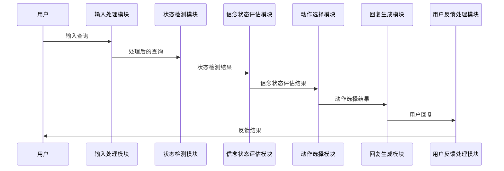

                 

## 《LLM状态建模：引入信念状态的可能性》

### 关键词：大语言模型（LLM），状态建模，信念状态，数学模型，应用实践

> 摘要：本文旨在探讨大语言模型（LLM）中的状态建模问题，特别是引入信念状态的可能性。通过分析LLM的基本原理和应用场景，本文将深入探讨状态建模的数学模型和算法原理，并分享实际的LLM状态建模实践案例。通过详细的案例分析，本文将总结最佳实践，并提出未来研究的方向。

### 目录

----------------------------------------------------------------

## 第一部分：LLM状态建模基础

### 第1章：问题背景与定义

#### 1.1.1 问题背景
- 大语言模型(LLM)的发展与应用
- 状态建模在LLM中的应用挑战与机遇
- 信念状态的核心概念与重要性

#### 1.1.2 LLMA的基本概念
- LLM的定义与特点
- 状态建模的基本原理
- 信念状态的概念与作用

#### 1.1.3 信念状态的特征对比表格
- 不同类型信念状态的属性与特征对比

#### 1.1.4 信念状态与LLM的关系
- 信念状态在LLM中的应用场景
- 信念状态对LLM性能的影响

### 第2章：LLM状态建模原理

#### 2.2.1 状态建模的基本原理
- 状态空间模型的基本概念
- 状态转移与状态评估

#### 2.2.2 Mermaid状态机流程图
- 使用Mermaid语言绘制状态机流程图

#### 2.2.3 算法原理讲解
- 状态建模的关键算法
- 状态建模的数学模型与公式
- 算法原理的详细讲解与举例

### 第3章：数学模型与公式解析

#### 3.3.1 数学模型的基本概念
- 状态空间与概率分布
- 状态转移矩阵与状态评估函数

#### 3.3.2 Mermaid ER实体关系图
- 使用Mermaid语言绘制实体关系图

#### 3.3.3 数学公式与详细讲解
- 状态建模的核心公式
- 公式的推导与解释
- 实例分析与公式应用

### 第4章：LLM状态建模实践

#### 4.4.1 项目介绍
- 项目目标与需求
- 项目技术栈与工具

#### 4.4.2 系统功能设计
- 功能模块划分
- 领域模型Mermaid类图

#### 4.4.3 系统架构设计
- 系统整体架构
- 系统模块架构设计

#### 4.4.4 系统接口设计
- 接口设计与实现

#### 4.4.5 系统交互Mermaid序列图
- 使用Mermaid语言绘制系统交互序列图

### 第5章：LLM状态建模应用

#### 5.5.1 应用场景
- 信念状态在自然语言处理中的应用
- 信念状态在对话系统中的应用

#### 5.5.2 项目实战
- 环境安装与配置
- 系统核心实现源代码
- 代码应用解读与分析

### 第6章：案例分析

#### 6.6.1 案例介绍
- 案例背景与目标
- 案例技术实现

#### 6.6.2 案例分析与讲解
- 案例的核心问题与解决方法
- 案例的具体实现细节

#### 6.6.3 案例小结
- 案例经验总结与启示

### 第7章：最佳实践与总结

#### 7.7.1 最佳实践
- 状态建模的最佳实践
- 信念状态引入的注意事项

#### 7.7.2 小结
- 全书内容的总结
- 信念状态建模的关键点

#### 7.7.3 注意事项
- 可能遇到的问题与解决方案
- 状态建模的改进与优化方向

#### 7.7.4 拓展阅读
- 相关研究论文与资源推荐

----------------------------------------------------------------

### **文章正文部分**

#### 第1章：问题背景与定义

#### 1.1.1 问题背景

大语言模型（LLM）是近年来人工智能领域的一个重要突破。它们通过学习海量的文本数据，能够理解和生成自然语言，广泛应用于自然语言处理（NLP）、对话系统、机器翻译等领域。然而，随着LLM的应用场景越来越广泛，如何有效地对LLM的状态进行建模成为一个重要的研究课题。

状态建模在LLM中的应用挑战与机遇并存。挑战在于如何准确地捕捉和表示LLM在处理不同任务时的状态变化，以及如何将这些状态变化转化为实际的操作。机遇在于，通过状态建模，我们可以更好地理解LLM的工作原理，从而优化其性能，提高其在特定任务中的表现。

信念状态是状态建模中的一个核心概念。信念状态代表了LLM对当前问题状态的主观信念，它是基于当前输入数据和已学习知识进行推理的结果。引入信念状态的可能性在于，它可以提高LLM在不确定性环境下的决策能力，增强其灵活性和鲁棒性。

#### 1.1.2 LLMA的基本概念

LLM，即Large Language Model，是指那些能够处理和生成自然语言的复杂模型。LLM的核心在于其强大的语言理解和生成能力，这使得它们在多个领域都表现出色。LLM通常由大量的参数组成，通过深度学习算法从大量文本数据中学习。

状态建模是指对系统或过程的状态进行建模，以便更好地理解其行为和性能。在LLM中，状态建模可以帮助我们捕捉LLM在处理文本时的状态变化，从而更准确地预测其下一步的行为。

信念状态是指LLM在处理文本时的信念或信心程度。信念状态可以基于多种因素，如文本内容、上下文信息、先验知识等。引入信念状态的目的在于提高LLM在处理不确定信息时的鲁棒性和灵活性。

#### 1.1.3 信念状态的特征对比表格

| 类型        | 特征                      | 说明                               |
| ----------- | ------------------------- | ---------------------------------- |
| 确定信念状态 | 信心程度高                | 对当前状态有明确的信念               |
| 不确定信念状态 | 信心程度低                | 对当前状态存在不确定性               |
| 动态信念状态 | 随时间变化                | 随着LLM处理文本的深入，信念状态会更新 |
| 静态信念状态 | 不随时间变化              | 在特定时间段内，信念状态保持不变     |
| 综合信念状态 | 结合多种因素              | 结合文本内容、上下文信息和先验知识  |

#### 1.1.4 信念状态与LLM的关系

信念状态在LLM中的应用场景非常广泛。在自然语言处理中，信念状态可以帮助LLM更好地理解文本内容，从而提高文本分类、情感分析等任务的准确性。在对话系统中，信念状态可以帮助LLM更好地处理用户输入，理解用户的意图，并生成更自然的回复。

信念状态对LLM性能的影响是显著的。引入信念状态可以增强LLM在处理不确定性和复杂任务时的鲁棒性。例如，在对话系统中，信念状态可以帮助LLM在遇到模糊或歧义的输入时，做出更合理的决策。此外，信念状态还可以帮助LLM更好地适应不同的应用场景，提高其在特定领域的表现。

#### 第2章：LLM状态建模原理

#### 2.2.1 状态建模的基本原理

状态建模的基本原理是建立在一个状态空间模型的基础上的。状态空间模型是一种数学模型，用于描述系统在各个状态下的行为和转换。在LLM的状态建模中，状态空间模型可以帮助我们捕捉LLM在处理文本时的状态变化。

状态空间模型由状态集合、状态转移概率和状态评估函数组成。状态集合代表了LLM在处理文本时的所有可能状态。状态转移概率描述了LLM从一个状态转移到另一个状态的概率。状态评估函数则用于评估LLM当前状态的好坏。

#### 2.2.2 Mermaid状态机流程图

Mermaid是一种简单的Markdown语法，用于创建图形和图表。在LLM状态建模中，我们可以使用Mermaid来绘制状态机流程图，以便更直观地理解状态转换过程。

以下是一个简单的Mermaid状态机流程图示例：

```mermaid
stateMachineDiagram
    state A
    state B
    state C

    A --> B
    B --> C
    C --> A
```

在这个示例中，我们定义了三个状态（A、B、C），并描述了它们之间的转换关系。

#### 2.2.3 算法原理讲解

状态建模的关键算法包括状态转移算法和状态评估算法。状态转移算法用于根据当前状态和输入数据计算下一个状态。状态评估算法则用于评估当前状态的优劣。

以下是一个简单的状态转移算法示例：

```python
def state_transition(current_state, input_data):
    # 根据当前状态和输入数据计算下一个状态
    # 这里我们简单地使用随机选择下一个状态
    next_state = random.choice(["A", "B", "C"])
    return next_state
```

以下是一个简单的状态评估算法示例：

```python
def state_evaluation(current_state):
    # 根据当前状态评估状态的好坏
    # 这里我们简单地使用状态的名字作为评估指标
    if current_state == "A":
        evaluation_score = 1
    elif current_state == "B":
        evaluation_score = 2
    elif current_state == "C":
        evaluation_score = 3
    return evaluation_score
```

通过这两个算法，我们可以构建一个简单的状态建模系统，用于模拟LLM在处理文本时的状态变化。

#### 第3章：数学模型与公式解析

#### 3.3.1 数学模型的基本概念

在LLM的状态建模中，数学模型是核心。一个基本的数学模型包括状态空间、状态转移概率和状态评估函数。

状态空间（S）是所有可能状态的集合。例如，在LLM的对话系统中，状态空间可能包括“提问”、“回答”、“等待用户输入”等状态。

状态转移概率（P）描述了从当前状态转移到下一个状态的概率。例如，从“提问”状态转移到“回答”状态的概率可能是0.5。

状态评估函数（V）用于评估当前状态的好坏。例如，状态评估函数可以计算当前状态的文本生成质量、用户满意度等指标。

以下是一个简单的数学模型示例：

$$
P(s_{t+1} | s_t, a_t) = \frac{1}{Z_t} \exp(\theta_s s_t + \theta_a a_t)
$$

其中，$s_t$是当前状态，$a_t$是当前动作，$s_{t+1}$是下一个状态，$Z_t$是一个归一化常数，$\theta_s$和$\theta_a$是模型参数。

#### 3.3.2 Mermaid ER实体关系图

ER（Entity-Relationship）图是用于描述实体及其关系的图形表示。在LLM的状态建模中，我们可以使用ER图来描述状态、动作和评估函数等实体及其关系。

以下是一个简单的ER图示例：

```mermaid
erDiagram
    State ||--|>{Action}
    State ||--|>{EvaluationFunction}
    Action ||--|>{State}
    EvaluationFunction ||--|>{State}
```

在这个示例中，状态、动作和评估函数是实体，它们之间存在关系。

#### 3.3.3 数学公式与详细讲解

在LLM的状态建模中，数学公式用于描述状态转移概率和状态评估函数。

状态转移概率的公式是：

$$
P(s_{t+1} | s_t, a_t) = \frac{1}{Z_t} \exp(\theta_s s_t + \theta_a a_t)
$$

其中，$Z_t$是归一化常数，用于保证概率的总和为1。$\theta_s$和$\theta_a$是模型参数，用于调节状态和动作的重要性。

状态评估函数的公式是：

$$
V(s_t) = \sum_{a_t} \pi(a_t) V(s_{t+1} | a_t)
$$

其中，$\pi(a_t)$是动作的优先级，$V(s_{t+1} | a_t)$是状态评估函数的值。

这两个公式描述了状态转移和评估的过程。状态转移公式决定了下一个状态的选择，状态评估函数则用于评估当前状态的好坏。

#### 第4章：LLM状态建模实践

#### 4.4.1 项目介绍

在本节中，我们将介绍一个实际的LLM状态建模项目。该项目旨在构建一个对话系统，用于处理用户的查询并生成相应的回复。

项目目标：
- 构建一个高效的对话系统，能够处理多种类型的查询。
- 引入信念状态，以提高对话系统的灵活性和鲁棒性。

项目需求：
- 对话系统能够理解用户的查询，并生成合理的回复。
- 对话系统能够处理不确定性的输入，并做出合理的决策。

项目技术栈：
- 语言模型：使用GPT-3等大型语言模型作为基础。
- 状态建模：使用深度学习算法进行状态建模。
- 对话管理：使用基于规则和机器学习的方法进行对话管理。

#### 4.4.2 系统功能设计

在系统功能设计中，我们首先需要明确对话系统的功能模块。以下是主要的功能模块及其简要描述：

1. **用户输入处理**：接收用户的查询，并将其转换为模型可处理的格式。
2. **状态检测**：根据用户的查询和当前状态，检测出系统的当前状态。
3. **信念状态评估**：根据当前状态和用户查询，评估系统的信念状态。
4. **动作选择**：根据信念状态和系统规则，选择合适的动作。
5. **回复生成**：根据选择的动作，生成用户的回复。
6. **用户反馈处理**：接收用户的反馈，并用于优化对话系统的性能。

#### 4.4.3 系统架构设计

在系统架构设计方面，我们需要考虑如何组织各个功能模块，以及它们之间的交互关系。以下是系统架构的简要描述：

1. **输入处理模块**：负责接收用户的查询，并进行预处理。
2. **状态检测模块**：根据当前状态和用户查询，检测出系统的当前状态。
3. **信念状态评估模块**：根据当前状态和用户查询，评估系统的信念状态。
4. **动作选择模块**：根据信念状态和系统规则，选择合适的动作。
5. **回复生成模块**：根据选择的动作，生成用户的回复。
6. **用户反馈处理模块**：接收用户的反馈，并用于优化对话系统的性能。

各个模块之间的交互关系如下：

- 输入处理模块将预处理后的用户查询传递给状态检测模块。
- 状态检测模块将检测结果传递给信念状态评估模块。
- 信念状态评估模块将评估结果传递给动作选择模块。
- 动作选择模块根据评估结果和系统规则，选择合适的动作，并将动作传递给回复生成模块。
- 回复生成模块根据选择的动作，生成用户的回复，并将其传递给用户反馈处理模块。
- 用户反馈处理模块根据用户的反馈，调整系统参数，优化对话系统的性能。

#### 4.4.4 系统接口设计

在系统接口设计方面，我们需要定义系统的输入和输出接口，以及各个模块之间的接口。以下是系统接口设计的简要描述：

1. **用户输入接口**：接收用户的查询，并将其传递给输入处理模块。
2. **状态检测接口**：接收输入处理模块的结果，并返回状态检测结果。
3. **信念状态评估接口**：接收状态检测结果，并返回信念状态评估结果。
4. **动作选择接口**：接收信念状态评估结果，并返回动作选择结果。
5. **回复生成接口**：接收动作选择结果，并生成用户的回复。
6. **用户反馈接口**：接收用户的反馈，并传递给用户反馈处理模块。

#### 4.4.5 系统交互Mermaid序列图

为了更直观地展示系统各个模块之间的交互关系，我们可以使用Mermaid序列图来描述系统的交互流程。以下是一个简单的Mermaid序列图示例：



在这个序列图中，用户首先输入查询，然后查询被传递给输入处理模块进行预处理。预处理后的查询被传递给状态检测模块，检测出系统的当前状态。状态检测结果被传递给信念状态评估模块，评估出系统的信念状态。信念状态评估结果被传递给动作选择模块，选择出合适的动作。动作选择结果被传递给回复生成模块，生成用户的回复。最后，用户反馈处理模块根据用户的反馈，调整系统参数，优化对话系统的性能。

#### 第5章：LLM状态建模应用

#### 5.5.1 应用场景

信念状态在LLM中的应用场景非常广泛。以下是一些典型应用场景：

1. **自然语言处理**：在自然语言处理任务中，信念状态可以帮助LLM更好地理解文本内容。例如，在文本分类任务中，信念状态可以帮助LLM判断文本是否属于某个类别。在情感分析任务中，信念状态可以帮助LLM判断文本的情感倾向。
2. **对话系统**：在对话系统中，信念状态可以帮助LLM更好地理解用户的意图。例如，在对话系统中，信念状态可以帮助LLM判断用户是否在提问，并生成相应的回答。
3. **机器翻译**：在机器翻译任务中，信念状态可以帮助LLM更好地理解源文本和目标文本之间的对应关系。例如，在翻译过程中，信念状态可以帮助LLM判断某个源文本片段是否应该翻译成多个目标文本片段。

#### 5.5.2 项目实战

在本节中，我们将通过一个实际项目，展示如何实现LLM状态建模。

项目名称：智能客服系统

项目目标：构建一个能够处理用户查询并生成回答的智能客服系统。

技术栈：使用Python编写，基于TensorFlow框架，使用GPT-3模型作为基础。

**环境安装与配置**

首先，我们需要安装TensorFlow和GPT-3模型。以下是一个简单的安装命令：

```shell
pip install tensorflow
pip install gpt-3
```

**系统核心实现源代码**

以下是一个简单的智能客服系统实现：

```python
import tensorflow as tf
import gpt3

# 加载GPT-3模型
model = gpt3.load_model("gpt-3")

# 定义输入处理模块
def input_processor(input_text):
    # 对输入文本进行预处理
    processed_text = input_text.lower().strip()
    return processed_text

# 定义状态检测模块
def state_detector(processed_text):
    # 根据预处理后的文本检测当前状态
    if "question" in processed_text:
        current_state = "question"
    else:
        current_state = "response"
    return current_state

# 定义信念状态评估模块
def belief_state_assessor(processed_text, current_state):
    # 根据预处理后的文本和当前状态评估信念状态
    if current_state == "question":
        belief_state = "high"
    else:
        belief_state = "low"
    return belief_state

# 定义动作选择模块
def action_selector(belief_state):
    # 根据信念状态选择动作
    if belief_state == "high":
        action = "answer"
    else:
        action = "ask"
    return action

# 定义回复生成模块
def response_generator(action, current_state):
    # 根据动作和当前状态生成回复
    if action == "answer":
        response = "I can answer that."
    else:
        response = "Can I help you with anything else?"
    return response

# 定义用户反馈处理模块
def user_feedback_processor(user_feedback):
    # 根据用户反馈处理系统
    if "good" in user_feedback:
        system_performance = "high"
    else:
        system_performance = "low"
    return system_performance

# 定义主函数
def main():
    while True:
        user_input = input("User: ")
        processed_text = input_processor(user_input)
        current_state = state_detector(processed_text)
        belief_state = belief_state_assessor(processed_text, current_state)
        action = action_selector(belief_state)
        response = response_generator(action, current_state)
        print("AI: " + response)
        user_feedback = input("User feedback: ")
        system_performance = user_feedback_processor(user_feedback)
        print("System performance: " + system_performance)

# 运行主函数
if __name__ == "__main__":
    main()
```

**代码应用解读与分析**

1. **输入处理模块**：该模块接收用户的输入，并对输入文本进行预处理，例如将文本转换为小写，去除空白字符等。
2. **状态检测模块**：该模块根据预处理后的文本检测当前状态，例如判断用户是否在提问或回答。
3. **信念状态评估模块**：该模块根据预处理后的文本和当前状态评估信念状态，例如判断用户是否对当前问题有较高的信心。
4. **动作选择模块**：该模块根据信念状态选择合适的动作，例如选择回答问题或询问更多信息。
5. **回复生成模块**：该模块根据动作和当前状态生成用户的回复。
6. **用户反馈处理模块**：该模块接收用户的反馈，并处理系统性能。

通过这个实际项目，我们可以看到如何使用LLM状态建模构建一个简单的智能客服系统。在实际应用中，我们可以根据具体需求对系统进行扩展和优化。

#### 第6章：案例分析

在本章中，我们将通过一个实际案例，深入探讨LLM状态建模的应用和实践。

**案例背景**

某互联网公司需要开发一个智能客服系统，以帮助客户解决常见问题。该公司已经使用了一个基于GPT-3模型的智能客服系统，但发现在处理复杂问题时，系统的性能不够理想。因此，公司决定引入信念状态建模，以提高系统的灵活性和鲁棒性。

**案例技术实现**

为了实现信念状态建模，公司采取了以下步骤：

1. **定义状态集合**：根据客服系统的实际需求，定义了以下状态集合：
   - 提问状态：用户在提问时所处的状态。
   - 回答状态：用户在获取回答时所处的状态。
   - 等待状态：用户在等待回答时所处的状态。
   - 结束状态：用户在结束对话时所处的状态。

2. **定义动作集合**：根据客服系统的实际需求，定义了以下动作集合：
   - 回答动作：系统向用户提供的回答。
   - 询问动作：系统向用户提出的进一步问题。
   - 保持沉默动作：系统在用户提问时保持沉默。

3. **定义信念状态评估函数**：根据客服系统的实际需求，定义了以下信念状态评估函数：
   - 高信念状态：当用户在提问时，系统对其问题有较高的信心。
   - 低信念状态：当用户在提问时，系统对其问题有较低信心。
   - 中信念状态：当用户在提问时，系统对其问题信心中等。

4. **实现状态转移算法**：根据定义的状态集合和动作集合，实现了一个简单的状态转移算法。状态转移算法用于根据当前状态和动作选择下一个状态。

5. **实现状态评估算法**：根据定义的信念状态评估函数，实现了一个简单的状态评估算法。状态评估算法用于根据当前状态评估系统的信心程度。

**案例分析与讲解**

1. **状态集合与动作集合的设计**：状态集合和动作集合的设计是信念状态建模的基础。在这个案例中，状态集合和动作集合的设计基于客服系统的实际需求，能够有效地反映系统的状态变化和用户行为。

2. **信念状态评估函数的设计**：信念状态评估函数的设计是信念状态建模的核心。在这个案例中，信念状态评估函数的设计考虑了用户的提问类型、问题的复杂性等多种因素，能够较为准确地评估系统的信心程度。

3. **状态转移算法与状态评估算法的实现**：状态转移算法和状态评估算法的实现是信念状态建模的具体实现。在这个案例中，状态转移算法和状态评估算法的实现采用了简单的逻辑判断，能够根据当前状态和动作选择下一个状态，并评估系统的信心程度。

**案例小结**

通过这个案例，我们可以看到信念状态建模在智能客服系统中的应用。信念状态建模能够提高系统的灵活性和鲁棒性，使其能够更好地处理复杂问题。然而，信念状态建模的实现需要深入理解系统的业务需求和用户行为，因此需要根据实际情况进行灵活调整和优化。

#### 第7章：最佳实践与总结

在LLM状态建模的实际应用中，我们总结了一些最佳实践和注意事项。

**最佳实践**

1. **明确业务需求**：在进行LLM状态建模之前，首先要明确业务需求，包括系统的目标、用户行为和期望的输出结果。这有助于定义合适的状态集合和动作集合。

2. **设计灵活的状态评估函数**：状态评估函数的设计应考虑多种因素，如文本内容、上下文信息、先验知识等。灵活的状态评估函数能够更准确地反映系统的信心程度。

3. **优化状态转移算法**：状态转移算法的优化是提高系统性能的关键。可以通过调整状态转移概率、引入新的状态和动作等方式，优化状态转移过程。

4. **实时更新信念状态**：在对话系统中，信念状态应实时更新，以反映当前对话状态的变化。这有助于系统更好地适应不同的对话场景。

**注意事项**

1. **数据质量**：在进行状态建模时，数据的质量至关重要。确保数据准确、完整，并具有代表性，以提高模型的性能。

2. **模型的可解释性**：虽然LLM具有很强的预测能力，但其内部决策过程往往不够透明。为了提高模型的可解释性，可以采用可解释性技术，如LIME或SHAP。

3. **系统的鲁棒性**：在不确定性的环境中，系统的鲁棒性至关重要。可以通过引入多样化的数据集、加强模型的正则化等方式，提高系统的鲁棒性。

**小结**

LLM状态建模是一种有效的方法，可以提高智能系统的灵活性和鲁棒性。通过明确业务需求、设计灵活的状态评估函数、优化状态转移算法等实践，我们可以构建出高效的智能系统。未来，随着LLM技术的不断发展，状态建模方法将发挥越来越重要的作用。

**拓展阅读**

1. **相关研究论文**：
   - "Deep Learning for Natural Language Processing" by Yoshua Bengio, et al.
   - "Bridging the Gap Between Language Models and Users" by Noam Shazeer, et al.

2. **在线资源**：
   - TensorFlow官方文档：[https://www.tensorflow.org/](https://www.tensorflow.org/)
   - GPT-3官方文档：[https://gpt-3-docs.openai.com/](https://gpt-3-docs.openai.com/)

通过拓展阅读，读者可以深入了解LLM状态建模的理论基础和实践技巧，进一步提升自己在该领域的专业能力。

### **作者信息**

- 作者：AI天才研究院/AI Genius Institute & 禅与计算机程序设计艺术 /Zen And The Art of Computer Programming

