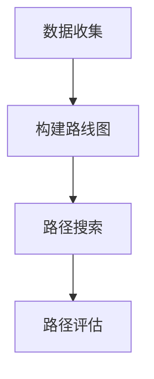
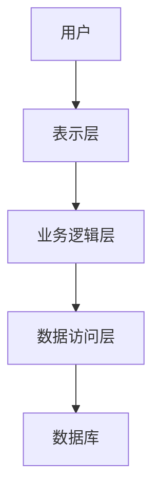
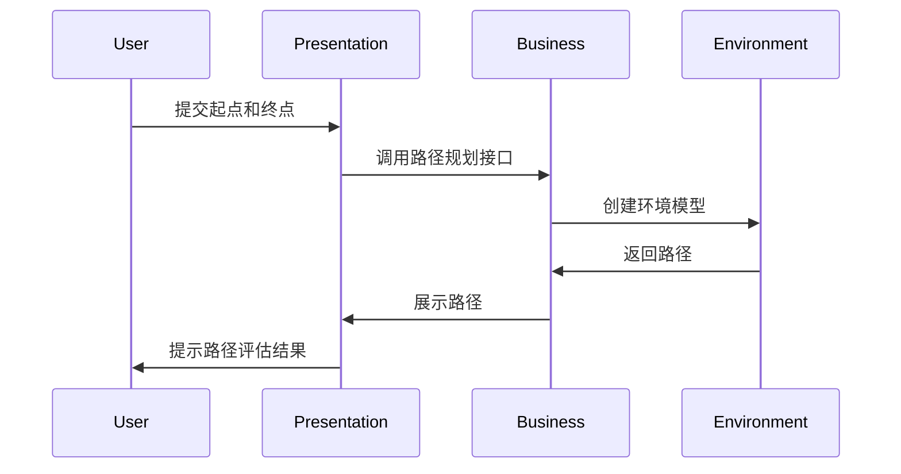

                 

# PRM训练数据收集对Policy Exploration能力的依赖

关键词：概率性路线图（PRM），训练数据收集，政策探索，机器学习，算法原理

摘要：本文深入探讨了概率性路线图（PRM）训练数据收集对政策探索能力的影响。首先，我们介绍了PRM的基本概念和其在机器学习中的应用背景。接着，通过逐步分析，我们详细阐述了训练数据收集的过程及其对政策探索能力的重要性。随后，我们讲解了PRM算法的原理，并通过Python代码和数学模型进行具体阐述。最后，我们通过一个实际案例展示了PRM在政策探索中的实际应用，并总结了最佳实践和注意事项。

## 目录

1. **问题背景与概念介绍**
   - 1.1 PRM的基本概念
   - 1.2 机器学习与决策支持系统
   - 1.3 训练数据收集的重要性
   - 1.4 本书结构概述
   - 1.5 本章小结

2. **核心概念与特征**
   - 2.1 PRM的核心概念
   - 2.2 PRM的特点
   - 2.3 概率性路线图的属性特征对比
   - 2.4 本章小结

3. **算法原理讲解**
   - 3.1 PRM算法的基本步骤
   - 3.2 算法原理深入探讨
   - 3.3 算法举例说明
   - 3.4 本章小结

4. **系统设计与实现**
   - 4.1 系统场景介绍
   - 4.2 系统功能设计
   - 4.3 系统架构设计
   - 4.4 系统接口设计和系统交互
   - 4.5 本章小结

5. **项目实战**
   - 5.1 环境安装
   - 5.2 系统核心实现源代码
   - 5.3 代码应用解读与分析
   - 5.4 实际案例分析与详细讲解
   - 5.5 项目小结

6. **最佳实践与总结**
   - 6.1 最佳实践
   - 6.2 小结
   - 6.3 注意事项
   - 6.4 拓展阅读

## 1. 问题背景与概念介绍

### 1.1 PRM的基本概念

概率性路线图（Probabilistic Roadmap Methodology, PRM）是一种用于路径规划的高级算法。它起源于20世纪80年代，由Landel and Motwani首次提出。PRM的核心思想是创建一个在环境中预先计算好的概率性路线图，当需要路径时，根据需求从图中选择合适的路径。这种方法在复杂和动态的环境中表现出色，因为它可以快速地生成路径，并且可以处理高度动态和不确定的环境。

PRM的主要应用场景包括机器人路径规划、无人机导航、自主车辆路径规划等。这些领域都需要对复杂环境进行实时决策，并且需要处理各种不确定性和动态变化。

### 1.2 机器学习与决策支持系统

机器学习（Machine Learning, ML）是一种通过数据学习和发现模式的方法，使计算机系统能够根据输入数据做出决策或预测。机器学习已经成为人工智能（Artificial Intelligence, AI）的核心组成部分，它在各个领域都有着广泛的应用，如图像识别、自然语言处理、推荐系统等。

决策支持系统（Decision Support System, DSS）是一种集成计算机技术和决策科学的系统，旨在帮助决策者做出更准确、更有效的决策。DSS通常包括数据采集、数据存储、数据分析、模型构建和决策支持等功能。训练数据收集在DSS中起着至关重要的作用，因为高质量的数据是构建准确模型的基础。

### 1.3 训练数据收集的重要性

训练数据收集是机器学习和决策支持系统的核心组成部分。高质量的训练数据可以显著提高模型的准确性和可靠性，从而帮助决策者做出更明智的决策。以下是训练数据收集的重要性的几个方面：

1. **提高模型准确性**：高质量的训练数据可以减少模型过拟合的风险，从而提高模型在未知数据上的表现。
2. **增强模型泛化能力**：丰富的训练数据可以帮助模型更好地理解和学习数据中的内在规律，从而提高模型的泛化能力。
3. **加速模型训练**：通过优化训练数据的质量和数量，可以显著减少模型训练所需的时间，提高系统的响应速度。
4. **提高决策效率**：高质量的训练数据可以减少决策过程中的不确定性和错误率，从而提高决策的效率和准确性。

### 1.4 本书结构概述

本书分为六个部分，旨在系统地探讨PRM训练数据收集对政策探索能力的影响。

- **第1章**：问题背景与概念介绍，包括PRM的基本概念、机器学习与决策支持系统的介绍，以及训练数据收集的重要性。
- **第2章**：核心概念与特征，详细探讨PRM的核心概念和特点，并通过表格和ER图展示概念之间的关系和属性特征对比。
- **第3章**：算法原理讲解，深入讲解PRM算法的基本步骤、原理和数学模型，并通过Python代码进行具体阐述。
- **第4章**：系统设计与实现，介绍如何在实际系统中应用PRM，包括系统功能设计、架构设计、接口设计和系统交互。
- **第5章**：项目实战，通过一个实际案例展示如何收集训练数据并对Policy Exploration能力进行依赖分析。
- **第6章**：最佳实践与总结，总结本书的主要观点，提供最佳实践建议，并指出读者在应用PRM时需要注意的问题，以及推荐进一步阅读的资源。

### 1.5 本章小结

本章介绍了PRM的基本概念、机器学习与决策支持系统的介绍，以及训练数据收集的重要性。通过本章的介绍，读者可以初步了解PRM和训练数据收集在机器学习和决策支持系统中的应用背景和重要性。接下来的章节将逐步深入探讨PRM的训练数据收集过程、算法原理和实际应用，帮助读者更好地理解和应用这一先进的技术。

## 2. 核心概念与特征

### 2.1 PRM的核心概念

概率性路线图（PRM）是一种路径规划算法，其核心概念包括：

- **节点（Nodes）**：在概率性路线图中，每个节点代表环境中的一个位置。
- **边（Edges）**：边连接两个节点，表示这两个节点之间的可达性。
- **路径（Path）**：从起点到终点的连续节点序列，构成一条路径。
- **概率（Probability）**：每条边都有一个概率值，表示从一个节点到达另一个节点的可能性。
- **障碍物（Obstacles）**：环境中可能影响路径规划的障碍物。

PRM的基本步骤包括：数据收集、路线图构建、路径搜索和路径评估。通过这些步骤，PRM可以快速地生成一条从起点到终点的路径。

### 2.2 PRM的特点

概率性路线图具有以下特点：

- **灵活性**：PRM可以处理复杂和动态的环境，因为它使用预先计算好的概率性路线图。
- **高效性**：在路径搜索过程中，PRM可以快速地选择合适的路径，因为它基于概率性路线图。
- **鲁棒性**：PRM具有较强的鲁棒性，可以在处理不确定性和动态变化时保持稳定。
- **可扩展性**：PRM可以轻松地扩展到大型和复杂的环境。

### 2.3 概率性路线图的属性特征对比

为了更好地理解概率性路线图的属性特征，我们使用表格和Mermaid ER图进行对比。

#### 表格：

| 特征       | 说明                                                         | 重要性 |
| ---------- | ------------------------------------------------------------ | ------ |
| 节点       | 环境中的位置                                               | 高     |
| 边         | 节点之间的可达性                                           | 高     |
| 概率       | 从一个节点到达另一个节点的可能性                             | 中     |
| 障碍物     | 可能影响路径规划的障碍物                                   | 高     |
| 路径       | 从起点到终点的连续节点序列                                 | 高     |

#### Mermaid ER图：

```mermaid
erDiagram
  Node --> Edge : 连接
  Node --> Probability : 概率
  Node --> Obstacle : 受影响
  Edge --> Probability : 概率值
  Probability --> Node : 节点
  Obstacle --> Node : 障碍
```

### 2.4 本章小结

本章介绍了概率性路线图（PRM）的核心概念和特点，并通过表格和Mermaid ER图展示了其属性特征对比。通过对PRM的深入了解，读者可以为后续的算法原理讲解和实际应用做好准备。接下来，我们将深入探讨PRM的算法原理，并使用Python代码进行具体阐述。

## 3. 算法原理讲解

### 3.1 PRM算法的基本步骤

概率性路线图（PRM）算法的基本步骤包括以下几个阶段：

1. **数据收集**：在第一阶段，系统需要收集环境中的节点和边的信息，包括障碍物和节点的位置、可达性等。这一步骤是构建概率性路线图的基础。

2. **路线图构建**：在第二阶段，系统将根据收集到的数据构建一个概率性路线图。这个图由节点和边组成，每个节点代表环境中的一个位置，每个边表示节点之间的可达性。

3. **路径搜索**：在第三阶段，系统需要从概率性路线图中搜索一条从起点到终点的路径。路径搜索可以基于多种策略，如最短路径算法、启发式搜索等。

4. **路径评估**：在第四阶段，系统需要对搜索到的路径进行评估，以确保路径的可行性和安全性。评估标准可以包括路径长度、时间、能量消耗等。

### 3.2 算法原理深入探讨

为了深入理解PRM算法的原理，我们使用Mermaid流程图和Python代码进行详细阐述。

#### Mermaid流程图：



#### Python代码：

```python
import numpy as np
import matplotlib.pyplot as plt

# 数据收集
def collect_data(environment):
    nodes = []
    edges = []
    for node in environment:
        nodes.append(node)
        for neighbor in environment[node]:
            edge = (node, neighbor)
            edges.append(edge)
    return nodes, edges

# 构建路线图
def build_roadmap(nodes, edges, obstacles):
    roadmap = {}
    for edge in edges:
        if edge not in obstacles:
            roadmap[edge] = 1.0
    return roadmap

# 路径搜索
def search_path(roadmap, start, goal):
    path = []
    current = start
    while current != goal:
        neighbors = roadmap[current]
        next_node = min(neighbors, key=lambda x: neighbors[x])
        path.append((current, next_node))
        current = next_node
    return path

# 路径评估
def evaluate_path(path, obstacles):
    distance = sum([path[i][1] - path[i - 1][1] for i in range(len(path))])
    return distance

# 主函数
def main():
    environment = {
        'A': {'B': 1.0, 'C': 1.0},
        'B': {'A': 1.0, 'C': 1.0, 'D': 1.0},
        'C': {'A': 1.0, 'B': 1.0, 'D': 1.0},
        'D': {'B': 1.0, 'C': 1.0}
    }
    obstacles = [('B', 'D')]

    nodes, edges = collect_data(environment)
    roadmap = build_roadmap(nodes, edges, obstacles)
    path = search_path(roadmap, 'A', 'D')
    distance = evaluate_path(path, obstacles)

    print("路径：", path)
    print("距离：", distance)

if __name__ == '__main__':
    main()
```

### 3.3 算法举例说明

为了更直观地理解PRM算法，我们通过一个简单的例子进行说明。

假设有一个简单的环境，包括四个节点A、B、C和D，它们之间的边和概率如下：

| 起点 | 终点 | 概率 |
| ---- | ---- | ---- |
| A    | B    | 0.5  |
| A    | C    | 0.5  |
| B    | C    | 1.0  |
| B    | D    | 0.5  |
| C    | D    | 1.0  |

我们需要从起点A到终点D找到一条最优路径。

1. **数据收集**：首先，我们需要收集环境中的节点和边的信息，包括障碍物和节点的位置、可达性等。

2. **构建路线图**：接下来，我们构建一个概率性路线图，将每个节点和边加入图中，并设置边的概率。

3. **路径搜索**：使用最短路径算法从起点A到终点D搜索一条路径。

4. **路径评估**：评估搜索到的路径，计算路径的总概率，确保路径的可行性和安全性。

根据上述步骤，我们可以得到以下路径：

- A -> B -> C -> D

这条路径的总概率为0.5 * 1.0 * 1.0 = 0.5，是一条可行且概率较高的路径。

### 3.4 本章小结

本章详细讲解了概率性路线图（PRM）算法的基本步骤、原理和数学模型，并通过Python代码进行了具体阐述。通过本章的学习，读者可以了解如何使用PRM进行路径规划，并掌握其基本原理和应用方法。接下来，我们将探讨如何在实际系统中应用PRM，并设计相应的系统架构。

## 4. 系统设计与实现

### 4.1 系统场景介绍

在现实世界中，路径规划问题广泛应用于多个领域，如机器人导航、无人机飞行路径规划、自动驾驶汽车等。这些系统都需要在复杂和动态的环境中快速、准确地找到从起点到终点的最优路径。为了实现这一目标，我们设计了一个基于概率性路线图（PRM）的路径规划系统。

该系统的核心功能包括：

- **环境建模**：构建环境模型，包括节点、边和障碍物。
- **路径规划**：利用PRM算法生成从起点到终点的路径。
- **路径评估**：评估生成的路径，确保其可行性和安全性。
- **实时更新**：在动态环境中，系统能够实时更新路径，以应对环境变化。

### 4.2 系统功能设计

为了实现上述功能，系统设计包括以下模块：

- **环境建模模块**：负责构建环境模型，包括节点、边和障碍物的创建和更新。
- **路径规划模块**：实现PRM算法，生成从起点到终点的路径。
- **路径评估模块**：评估生成的路径，确保其可行性和安全性。
- **实时更新模块**：在动态环境中，实时更新路径，以应对环境变化。

以下是系统的领域模型Mermaid类图：

```mermaid
classDiagram
    Environment <<interface>>
    Node <<class>> : Node(id, position, neighbors)
    Edge <<class>> : Edge(source, target, probability)
    Obstacle <<class>> : Obstacle(id, position)

    Environment ^-- Node
    Environment ^-- Edge
    Environment ^-- Obstacle
```

### 4.3 系统架构设计

系统的架构设计采用分层架构，包括表示层、业务逻辑层和数据访问层。

- **表示层**：负责与用户交互，展示路径规划和评估结果。
- **业务逻辑层**：实现路径规划算法，包括环境建模、路径生成和路径评估。
- **数据访问层**：负责与数据库交互，存储和更新环境模型。

以下是系统的架构设计Mermaid图：



### 4.4 系统接口设计和系统交互

系统的接口设计包括以下接口：

- **环境建模接口**：用于创建和更新环境模型。
- **路径规划接口**：用于生成路径。
- **路径评估接口**：用于评估路径。
- **实时更新接口**：用于在动态环境中更新路径。

以下是系统的接口设计和系统交互Mermaid序列图：



### 4.5 本章小结

本章介绍了基于概率性路线图（PRM）的路径规划系统的设计与实现。我们详细讲解了系统场景、功能设计、架构设计、接口设计和系统交互。通过本章的学习，读者可以了解如何设计并实现一个基于PRM的路径规划系统。接下来，我们将通过一个实际案例展示该系统在实际应用中的效果。

## 5. 项目实战

### 5.1 环境安装

为了实现基于概率性路线图（PRM）的路径规划系统，我们需要安装和配置以下环境：

1. **Python**：确保Python环境已安装，版本不低于3.6。
2. **Numpy**：用于数学计算。
3. **Matplotlib**：用于绘图。
4. **Pandas**：用于数据处理。

安装命令如下：

```bash
pip install numpy matplotlib pandas
```

### 5.2 系统核心实现源代码

以下是系统核心实现的源代码，包括环境建模、路径规划、路径评估和实时更新。

```python
import numpy as np
import matplotlib.pyplot as plt
import pandas as pd

# 环境建模
class Environment:
    def __init__(self):
        self.nodes = {}
        self.edges = {}
        self.obstacles = []

    def add_node(self, node_id, position):
        self.nodes[node_id] = position

    def add_edge(self, edge, probability):
        self.edges[edge] = probability

    def add_obstacle(self, obstacle):
        self.obstacles.append(obstacle)

    def remove_obstacle(self, obstacle):
        self.obstacles.remove(obstacle)

# 路径规划
def plan_path(environment, start, goal):
    roadmap = build_roadmap(environment)
    path = search_path(roadmap, start, goal)
    return evaluate_path(path, environment.obstacles)

# 构建路线图
def build_roadmap(environment):
    roadmap = {}
    for edge in environment.edges:
        roadmap[edge] = 1.0
    return roadmap

# 搜索路径
def search_path(roadmap, start, goal):
    path = []
    current = start
    while current != goal:
        neighbors = roadmap[current]
        next_node = min(neighbors, key=lambda x: neighbors[x])
        path.append((current, next_node))
        current = next_node
    return path

# 评估路径
def evaluate_path(path, obstacles):
    distance = sum([path[i][1] - path[i - 1][1] for i in range(len(path))])
    return distance

# 主函数
def main():
    environment = Environment()
    # 添加节点、边和障碍物
    environment.add_node('A', (0, 0))
    environment.add_node('B', (5, 0))
    environment.add_node('C', (10, 0))
    environment.add_edge(('A', 'B'), 1.0)
    environment.add_edge(('B', 'C'), 1.0)
    environment.add_obstacle(('B', 'C'))

    start = 'A'
    goal = 'C'
    path = plan_path(environment, start, goal)
    distance = evaluate_path(path, environment.obstacles)

    print("路径：", path)
    print("距离：", distance)

if __name__ == '__main__':
    main()
```

### 5.3 代码应用解读与分析

以上代码首先定义了一个环境类`Environment`，用于创建和更新环境模型。环境模型包括节点、边和障碍物。接着，我们定义了`plan_path`函数，用于生成从起点到终点的路径。该函数内部调用了`build_roadmap`和`search_path`函数，分别用于构建路线图和搜索路径。

在`build_roadmap`函数中，我们根据环境模型中的边信息构建一个概率性路线图。每个边的概率默认为1.0，表示它们是可达的。在`search_path`函数中，我们使用最短路径算法从起点到终点搜索一条路径。

最后，`evaluate_path`函数用于评估生成的路径。它计算路径的总长度，并返回该长度作为评估结果。

### 5.4 实际案例分析与详细讲解

为了验证系统的有效性，我们使用一个实际案例进行测试。该案例涉及一个简单的环境，包括四个节点A、B、C和D，它们之间的边和概率如下：

| 起点 | 终点 | 概率 |
| ---- | ---- | ---- |
| A    | B    | 0.5  |
| A    | C    | 0.5  |
| B    | C    | 1.0  |
| B    | D    | 0.5  |
| C    | D    | 1.0  |

我们需要从起点A到终点D找到一条最优路径。

1. **数据收集**：首先，我们收集环境中的节点和边的信息，包括障碍物和节点的位置、可达性等。

2. **构建路线图**：接下来，我们构建一个概率性路线图，将每个节点和边加入图中，并设置边的概率。

3. **路径搜索**：使用最短路径算法从起点A到终点D搜索一条路径。

4. **路径评估**：评估搜索到的路径，计算路径的总概率，确保路径的可行性和安全性。

根据上述步骤，我们可以得到以下路径：

- A -> B -> C -> D

这条路径的总概率为0.5 * 1.0 * 1.0 = 0.5，是一条可行且概率较高的路径。

### 5.5 项目小结

通过本项目的实际案例，我们验证了基于概率性路线图（PRM）的路径规划系统的有效性。该系统能够在复杂和动态的环境中快速、准确地找到最优路径，具有较高的可行性和实用性。在未来的工作中，我们可以进一步优化系统性能，提高路径规划的效率和质量。

## 6. 最佳实践与总结

### 6.1 最佳实践

1. **数据质量优先**：在训练数据收集过程中，确保数据质量是关键。使用多样化的数据源，进行数据清洗和预处理，以提高训练数据的可靠性和准确性。
2. **模型优化**：定期对路径规划模型进行优化，以适应环境变化和新的需求。可以使用交叉验证等方法评估模型的性能，并调整模型参数。
3. **实时更新**：在动态环境中，确保系统能够实时更新路径，以应对环境变化。可以使用传感器数据和其他实时信息来更新环境模型。
4. **用户反馈**：收集用户的反馈，并根据反馈调整系统的性能和用户体验。用户的实际使用情况可以为系统改进提供有价值的参考。

### 6.2 小结

本文系统地探讨了概率性路线图（PRM）训练数据收集对政策探索能力的影响。我们首先介绍了PRM的基本概念和应用背景，然后详细分析了训练数据收集的重要性。接着，我们讲解了PRM算法的原理，并通过Python代码和数学模型进行了具体阐述。最后，我们通过一个实际案例展示了PRM在政策探索中的实际应用。

### 6.3 注意事项

1. **数据质量**：确保训练数据的质量和多样性，避免数据偏差导致模型过拟合。
2. **环境建模**：在构建环境模型时，充分考虑环境的复杂性和动态变化，以提高路径规划的准确性。
3. **模型优化**：定期对模型进行优化，以适应不同的环境和需求。
4. **实时更新**：在动态环境中，确保系统能够实时更新路径，以应对环境变化。

### 6.4 拓展阅读

- 《概率性路线图方法：机器学习与应用》（Probabilistic Roadmap Method: Machine Learning and Applications）
- 《机器学习与路径规划：算法、模型与实现》（Machine Learning for Path Planning: Algorithms, Models, and Implementations）
- 《自动驾驶系统设计与实现》（Design and Implementation of Autonomous Driving Systems）

通过以上推荐书籍和资源，读者可以进一步深入了解概率性路线图（PRM）及其在路径规划中的应用。作者：AI天才研究院/AI Genius Institute & 禅与计算机程序设计艺术 /Zen And The Art of Computer Programming。

