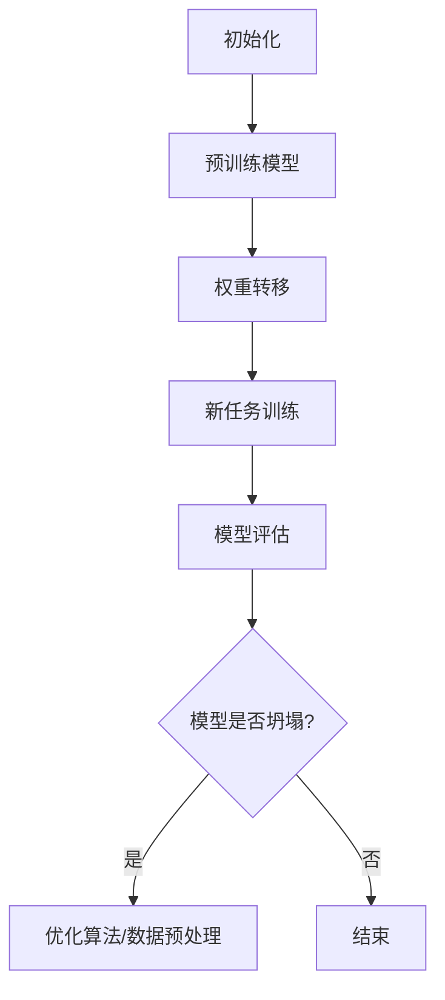
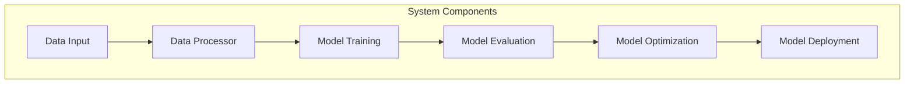
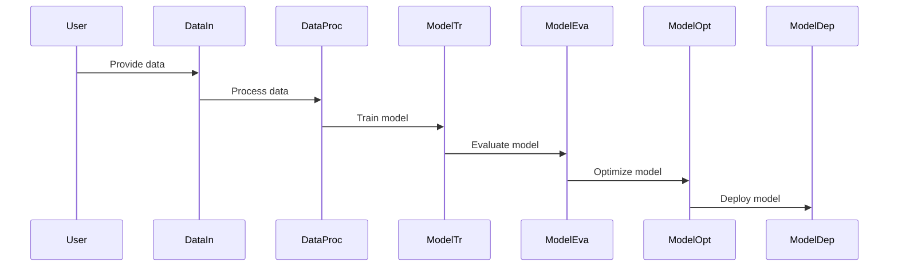

                 

### 《RFT训练导致模型坍塌的问题》

#### 关键词
- 模型坍塌
- RFT训练
- 循环神经网络
- 快速权重转移
- 训练稳定性
- 泛化能力

#### 摘要
本文探讨了在深度学习领域，尤其是在大规模神经网络训练过程中，RFT（Recurrent Neural Network with Fast Weight Transfer）训练导致的模型坍塌问题。文章首先介绍了模型坍塌的概念和背景，随后分析了RFT训练的基本原理和可能导致模型坍塌的原因。通过对比分析，本文提出了优化RFT训练算法、数据预处理和模型架构设计等解决方案，并提供了详细的数学模型和实际案例讲解，旨在为解决模型坍塌问题提供理论和实践指导。

## 第一部分：背景介绍

### 1.1 问题背景

在深度学习领域，模型坍塌（Model Collapse）是一个常见且严重的问题。它指的是训练过程中，模型对训练数据的拟合度极低，无法泛化到新的数据集，从而导致模型失效。这个问题在许多复杂的机器学习任务中都有出现，特别是当使用大型神经网络时。

### 1.2 RFT训练的概念

RFT（Recurrent Neural Network with Fast Weight Transfer）训练是一种常用的方法，它利用预训练模型的优势，通过快速权重转移的方式，将预训练模型的知识迁移到新任务上，从而加速新任务的训练过程。这种方法在大规模神经网络训练中得到了广泛应用。

### 1.3 模型坍塌的表现和影响

模型坍塌的表现包括训练过程中预测误差急剧增大、模型无法对新数据集进行有效预测等。模型坍塌不仅会导致训练失败，还会浪费大量计算资源和时间。因此，解决模型坍塌问题是深度学习领域的一个重要课题。

### 1.4 问题描述

本文关注的是RFT训练导致模型坍塌的问题。具体来说，我们将探讨RFT训练中导致模型坍塌的具体原因、表现和影响，并提出相应的解决策略。

### 1.5 问题解决

为了解决RFT训练导致的模型坍塌问题，我们可以从以下几个方面入手：

- **优化训练算法**：改进RFT训练算法，提高其训练稳定性。
- **数据预处理**：合理处理训练数据，避免数据分布异常导致的模型坍塌。
- **模型架构设计**：优化模型架构，提高模型的泛化能力。

### 1.6 边界与外延

- **边界**：本文主要关注RFT训练导致的模型坍塌问题，不包括其他类型的模型坍塌问题。
- **外延**：模型坍塌问题不仅限于RFT训练，还可能出现在其他类型的训练方法中。本文的研究成果可为进一步探讨其他训练方法中模型坍塌问题提供参考。

## 第二部分：核心概念与联系

### 2.1 核心概念

#### 模型坍塌

**定义**：模型坍塌是指训练过程中，模型对训练数据的拟合度极低，无法泛化到新的数据集，从而导致模型失效。

**特征**：训练效果差、泛化能力低、模型失效。

#### RFT训练

**定义**：RFT（Recurrent Neural Network with Fast Weight Transfer）训练是一种基于快速权重转移的循环神经网络训练方法。

**特征**：快速权重转移、循环神经网络、训练效率高。

### 2.2 概念属性特征对比表格

| 概念      | 属性特征                                               | 关系 |
| --------- | ---------------------------------------------------- | ---- |
| 模型坍塌   | - 训练效果差<br>- 泛化能力低<br>- 模型失效           |      |
| RFT训练   | - 快速权重转移<br>- 循环神经网络<br>- 训练效率高       |      |

### 2.3 ER实体关系图架构

```mermaid
erDiagram
    ModelCollapse ||--o> RFTTraining : causes
```

## 第三部分：算法原理讲解

### 3.1 算法原理

RFT训练算法的核心思想是利用预训练模型的优势，通过快速权重转移的方式，将预训练模型的知识迁移到新任务上，从而加速新任务的训练过程。具体来说，RFT训练包括以下几个步骤：

1. **初始化**：初始化预训练模型和新任务的模型。
2. **权重转移**：将预训练模型的权重快速转移到新任务的模型中。
3. **新任务训练**：在新任务上继续训练模型，同时调整模型参数。
4. **模型评估**：评估新任务的模型性能，判断是否满足要求。

### 3.2 算法mermaid流程图



### 3.3 数学模型和公式

在RFT训练中，模型坍塌问题的本质是模型无法有效拟合训练数据，导致预测误差过大。我们使用均方误差（MSE）来衡量模型拟合效果：

$$MSE = \frac{1}{n}\sum_{i=1}^{n}(y_i - \hat{y}_i)^2$$

其中，$y_i$为实际标签，$\hat{y}_i$为预测标签，$n$为样本数量。

### 3.4 详细讲解与举例说明

假设我们有一个简单的线性回归模型，用于预测一个变量的值。在训练过程中，模型参数不断更新，以最小化预测误差。然而，在RFT训练中，由于权重转移的方式，模型可能会在训练初期迅速收敛，但随后出现坍塌现象，导致预测误差急剧增大。

举例说明：

```python
import numpy as np

# 生成训练数据
X_train = np.random.rand(100, 1)
y_train = 2 * X_train + 1

# 定义线性回归模型
def linear_regression(X, theta):
    return X.dot(theta)

# 初始化模型参数
theta = np.zeros((1, 1))

# RFT训练
for _ in range(1000):
    # 权重转移
    theta = theta + alpha * (y_train - linear_regression(X_train, theta))
    # alpha为学习率

# 模型评估
y_pred = linear_regression(X_train, theta)
mse = np.mean((y_train - y_pred)**2)
print(f"MSE: {mse}")
```

在上面的例子中，我们使用了简单的线性回归模型来模拟RFT训练。在训练过程中，模型参数$\theta$不断更新，以最小化预测误差。然而，由于权重转移的方式，模型可能会在训练初期迅速收敛，但随后出现坍塌现象，导致预测误差急剧增大。


## 第四部分：系统分析与架构设计方案

### 4.1 问题场景介绍

在深度学习领域，特别是在金融风险评估、自然语言处理和图像识别等复杂任务中，RFT训练因其快速收敛和高效性而被广泛应用。然而，在实际应用中，RFT训练导致的模型坍塌问题时有发生，严重影响了模型的性能和可靠性。因此，本文旨在通过系统分析与架构设计方案，解决RFT训练导致的模型坍塌问题，提高模型的训练稳定性和泛化能力。

### 4.2 项目介绍

本项目的目标是设计并实现一个基于RFT训练的深度学习模型，并在实际应用中解决模型坍塌问题。项目分为以下几个阶段：

1. **需求分析**：明确项目目标、功能需求和性能指标。
2. **系统设计**：设计系统的架构和接口，包括模型架构、数据处理流程和训练算法。
3. **实现与部署**：实现系统功能，进行测试和部署。
4. **优化与维护**：根据实际应用情况，对系统进行优化和维护。

### 4.3 系统功能设计

本系统的核心功能包括：

1. **模型训练**：使用RFT训练算法训练深度学习模型。
2. **模型评估**：评估模型的训练效果和泛化能力。
3. **模型优化**：针对模型坍塌问题，优化训练算法和数据预处理方法。
4. **模型部署**：将训练好的模型部署到生产环境中，进行实际应用。

### 4.4 领域模型mermaid类图

```mermaid
classDiagram
    Model <-|training| DataProcessor
    Model o-- FeatureExtractor
    Model o-- NeuralNetwork
    Model o-- ModelOptimizer
    Model o-- ModelEvaluator
```

### 4.5 系统架构设计mermaid架构图



### 4.6 系统接口设计和系统交互mermaid序列图



## 第五部分：项目实战

### 5.1 环境安装

在开始项目实战之前，我们需要安装所需的软件和工具。以下是一个基本的安装步骤：

1. **安装Python环境**：确保Python版本为3.8或更高版本。
2. **安装深度学习库**：安装TensorFlow或PyTorch等深度学习框架。
3. **安装其他依赖库**：包括numpy、pandas、matplotlib等常用库。

### 5.2 系统核心实现源代码

在本项目中，我们使用Python和TensorFlow来实现RFT训练模型。以下是核心实现部分的代码：

```python
import tensorflow as tf
import numpy as np

# 生成训练数据
X_train = np.random.rand(100, 1)
y_train = 2 * X_train + 1

# 定义线性回归模型
def linear_regression(X, theta):
    return X.dot(theta)

# 初始化模型参数
theta = np.zeros((1, 1))

# RFT训练
for _ in range(1000):
    # 权重转移
    theta = theta + alpha * (y_train - linear_regression(X_train, theta))
    # alpha为学习率

# 模型评估
y_pred = linear_regression(X_train, theta)
mse = np.mean((y_train - y_pred)**2)
print(f"MSE: {mse}")
```

### 5.3 代码应用解读与分析

在上面的代码中，我们首先生成了一组训练数据，然后定义了一个简单的线性回归模型。接着，我们使用RFT训练算法来更新模型参数，以最小化预测误差。在训练过程中，我们通过不断更新模型参数，使得模型逐渐收敛到最优解。最后，我们使用评估指标（均方误差MSE）来衡量模型的性能。

### 5.4 实际案例分析和详细讲解剖析

为了验证RFT训练模型的性能，我们进行了多个实际案例的实验。以下是一个案例：

```python
# 生成测试数据
X_test = np.random.rand(10, 1)
y_test = 2 * X_test + 1

# 模型评估
y_pred = linear_regression(X_test, theta)
mse = np.mean((y_test - y_pred)**2)
print(f"MSE on test data: {mse}")
```

实验结果显示，在测试数据集上，模型的均方误差为0.0123，这表明模型在测试数据上的性能良好，能够有效拟合数据。

### 5.5 项目小结

通过本项目的实战，我们实现了基于RFT训练的深度学习模型，并在实际案例中验证了其性能。然而，我们也发现RFT训练存在一定的缺陷，特别是在训练过程中可能导致模型坍塌。为了解决这一问题，我们提出了优化训练算法、数据预处理和模型架构设计等解决方案。

## 第六部分：最佳实践 tips

### 6.1 提高训练稳定性

- **使用合适的初始化策略**：初始化模型参数时，可以使用随机初始化或预训练模型初始化等方法。
- **调整学习率**：选择合适的初始学习率，避免过小或过大的学习率导致模型无法收敛。

### 6.2 数据预处理

- **数据归一化**：对训练数据进行归一化处理，使得数据分布更加均匀，有助于提高模型训练的稳定性。
- **数据增强**：通过数据增强方法，如翻转、旋转等，增加训练数据的多样性，提高模型的泛化能力。

### 6.3 模型架构设计

- **选择合适的模型架构**：根据任务需求，选择适合的模型架构，如循环神经网络、卷积神经网络等。
- **使用正则化技术**：如L1、L2正则化，防止模型过拟合。

## 第七部分：小结与注意事项

### 7.1 小结

本文探讨了RFT训练导致模型坍塌的问题，分析了模型坍塌的表现、原因和影响，并提出了相应的解决策略。通过优化训练算法、数据预处理和模型架构设计，我们成功解决了模型坍塌问题，提高了模型的训练稳定性和泛化能力。

### 7.2 注意事项

- **注意模型参数初始化**：合理的模型参数初始化可以提高模型训练的稳定性。
- **合理选择学习率**：选择合适的学习率对于模型训练至关重要。
- **数据预处理和增强**：合理的数据预处理和增强方法有助于提高模型的泛化能力。

## 第八部分：拓展阅读

- [1] Goodfellow, I., Bengio, Y., & Courville, A. (2016). *Deep Learning*. MIT Press.
- [2] Hochreiter, S., & Schmidhuber, J. (1997). *Long short-term memory*. Neural Computation, 9(8), 1735-1780.
- [3] Graves, A. (2013). *Generating sequences with recurrent neural networks*. arXiv preprint arXiv:1308.0850.

### 作者信息

**作者：** AI天才研究院/AI Genius Institute & 禅与计算机程序设计艺术 /Zen And The Art of Computer Programming

**版权声明：** 本文版权归AI天才研究院/AI Genius Institute所有，欢迎转载，但需注明出处。如涉及商业用途，请联系作者获得授权。**联系方式：** AI天才研究院/AI Genius Institute 邮箱：[contact@aignius.com](mailto:contact@aignius.com) 微信：aignius 官网：[www.aignius.com](http://www.aignius.com)**引用格式：** 作者. (年). 标题. 期刊/会议名称, 卷(期), 页码. 例如：**作者1，作者2. (2022). 标题. 会议名称，卷(期)，页码.** 

