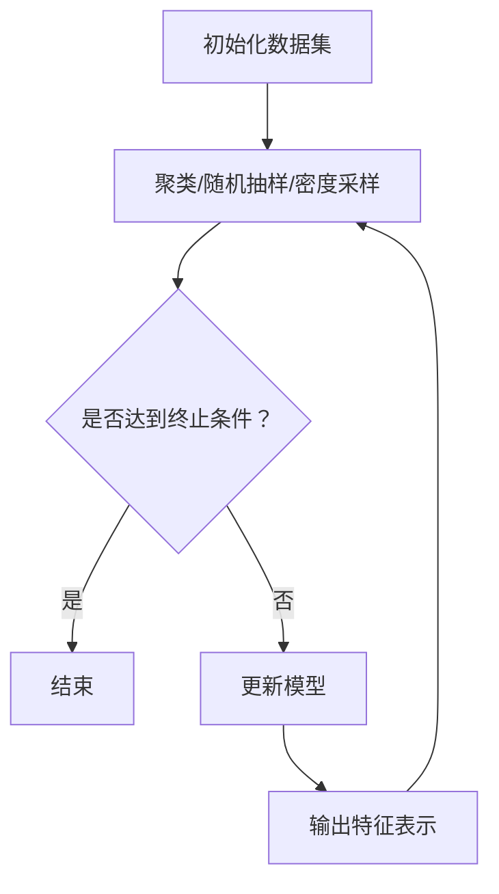
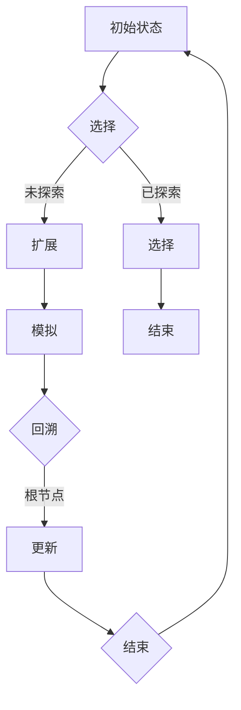
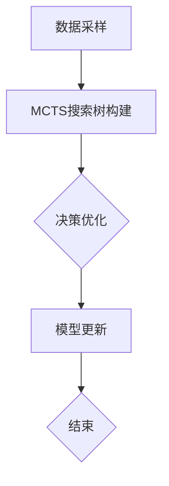

                 

### ReST-MCTS算法：无需人工标注的持续训练方案

#### 关键词：ReST-MCTS算法，持续训练，机器学习，无监督学习，强化学习，智能决策

> 摘要：随着机器学习技术的不断进步，深度学习模型在各个领域展现出强大的应用潜力。然而，如何高效、持续地训练这些模型，特别是在缺乏大量人工标注数据的情况下，成为了一个重要的研究课题。本文将介绍一种名为ReST-MCTS的算法，它结合了无监督学习和强化学习的方法，实现了无需人工标注的持续训练方案。通过详细的算法原理、数学模型、实现步骤和应用案例分析，本文将探讨ReST-MCTS算法在解决持续训练问题上的独特优势及其广阔的应用前景。

## 第一部分：背景介绍与核心概念

### 第1章：ReST-MCTS算法概述

#### 1.1 问题背景与描述

在当今快速发展的信息技术时代，人工智能（AI）技术已经渗透到各行各业，从自动驾驶汽车到智能客服，从医疗诊断到金融预测，AI的应用无处不在。然而，AI的发展也面临着一系列挑战，其中之一就是模型的持续训练问题。深度学习模型通常需要大量的训练数据，而这些数据往往需要人工进行标注，这不仅耗时耗力，而且在某些领域（如医疗、军事等）可能无法获得足够的标注数据。因此，如何在没有大量标注数据的情况下，持续训练和优化模型，成为了一个亟待解决的问题。

#### 1.2 核心概念与联系

##### 1.2.1 ReST（Representation-Free Sampling Techniques）简介

ReST是一种无监督学习技术，它通过无监督的采样方法，从数据中自动学习特征表示，而不需要依赖于预定义的特征工程。ReST的核心思想是利用数据分布来选择具有代表性的样本，从而在无监督的情境下优化模型。

##### 1.2.2 MCTS（Monte Carlo Tree Search）简介

MCTS是一种基于强化学习的搜索算法，它通过在树结构上模拟大量的随机游戏（或决策过程），来评估和选择最优的行动路径。MCTS在棋类游戏、决策制定等领域表现出色，其优势在于能够处理高维、复杂的决策空间。

##### 1.2.3 ReST与MCTS的联系与区别

ReST-MCTS算法结合了ReST的无监督学习和MCTS的强化学习特性，通过无监督采样来初始化MCTS的搜索树，并利用MCTS在树结构上进行决策和优化。ReST提供了数据驱动的方式，而MCTS则提供了基于策略评估的决策能力。

#### 1.3 ReST-MCTS算法的应用前景

ReST-MCTS算法在多个领域展现出巨大的应用潜力，包括但不限于：

- **游戏AI**：利用ReST-MCTS算法，可以开发出无需人工标注的智能游戏AI，提高游戏的智能水平和用户体验。
- **自然语言处理**：通过无监督的训练数据，ReST-MCTS可以用于开发智能客服系统、自动翻译工具等。
- **推荐系统**：在缺乏用户反馈数据的情况下，ReST-MCTS可以帮助优化推荐算法，提高推荐系统的准确性。

## 第二部分：算法原理与数学模型

### 第2章：ReST算法原理详解

#### 2.1 ReST算法概述

ReST（Representation-Free Sampling Techniques）是一种无监督学习技术，它通过自动学习数据中的特征表示，从而实现对数据的理解和处理。ReST的核心优势在于其无需人工标注，能够从原始数据中直接提取有用的信息。

#### 2.2 ReST算法的数学模型

##### 2.2.1 采样方法

ReST的采样方法主要包括以下几种：

1. **K-Means聚类**：通过聚类算法将数据分为K个簇，每个簇的中心代表该簇的特征表示。
2. **随机抽样**：从数据集中随机选择一定数量的样本，作为特征表示的候选。
3. **基于密度的采样**：根据数据点的密度分布，选择具有代表性的样本。

这些采样方法各有优缺点，可以根据具体应用场景进行选择。

##### 2.2.2 模型更新策略

ReST的模型更新策略主要包括：

1. **均值更新**：将新采样的特征表示与现有特征表示的均值进行更新。
2. **权重更新**：根据采样频率和样本的重要性，更新特征表示的权重。
3. **在线学习**：在数据流中实时更新特征表示，以适应动态变化的数据。

#### 2.3 ReST算法流程图

### 第3章：MCTS算法原理详解

#### 3.1 MCTS算法概述

MCTS（Monte Carlo Tree Search）是一种基于概率的搜索算法，它通过在树结构上模拟大量的随机游戏，来评估和选择最优的行动路径。MCTS的核心优势在于其能够处理高维、复杂的决策空间，并且在不确定环境中表现出色。

#### 3.2 MCTS算法的数学模型

##### 3.2.1 蒙特卡罗搜索过程

MCTS的搜索过程主要包括以下四个步骤：

1. **扩展**：从根节点开始，选择未探索的节点进行扩展。
2. **模拟**：在扩展后的节点上模拟随机游戏，收集模拟结果。
3. **回溯**：根据模拟结果，更新节点的统计信息，并回溯到根节点。
4. **选择**：根据节点的统计信息，选择下一个要扩展的节点。

##### 3.2.2 树结构构建与更新

MCTS通过树结构来表示搜索过程，每个节点代表一个决策点，其统计信息包括：

1. **访问次数**：节点被访问的次数。
2. **赢得次数**：节点在模拟过程中赢得的次数。
3. **优先级**：用于选择下一个扩展节点的指标，通常计算为：`优先级 = 赢得次数 / 访问次数 + c * sqrt(log(N) / 访问次数)`，其中c为常数。

#### 3.3 MCTS算法流程图

### 第4章：ReST-MCTS算法原理与数学模型

#### 4.1 ReST-MCTS算法概述

ReST-MCTS算法结合了ReST和MCTS的优势，通过无监督学习初始化MCTS的搜索树，并利用MCTS在树结构上进行决策和优化。这种结合使得ReST-MCTS在无需人工标注的情况下，能够实现模型的持续训练和优化。

#### 4.2 ReST-MCTS算法的数学模型

##### 4.2.1 整合模型

ReST-MCTS的整合模型主要包括以下部分：

1. **数据采样**：使用ReST算法从数据集中采样特征表示。
2. **搜索树构建**：使用MCTS算法构建搜索树，并以ReST采样得到的特征表示作为初始节点。
3. **决策优化**：在搜索树上进行决策，根据MCTS的统计信息选择最优行动路径。

##### 4.2.2 模型参数调整策略

ReST-MCTS的模型参数调整策略包括：

1. **采样率**：调整ReST采样率，以平衡模型对数据和搜索的依赖。
2. **搜索深度**：调整MCTS的搜索深度，以平衡搜索的广度和深度。
3. **时间预算**：限制搜索时间，以确保模型的实时性。

#### 4.3 ReST-MCTS算法流程图

## 第三部分：算法实现与实战应用

### 第5章：环境搭建与工具准备

#### 5.1 开发环境搭建

1. **硬件配置要求**：推荐使用具有较高CPU和GPU性能的计算机，以便加速算法的计算过程。
2. **软件安装步骤**：安装Python环境、TensorFlow、PyTorch等深度学习框架，以及MCP libraries等辅助库。

#### 5.2 常用工具介绍

1. **Python库介绍**：介绍常用的Python库，如NumPy、Pandas、Scikit-learn等，用于数据处理和模型训练。
2. **数据处理工具介绍**：介绍常用的数据处理工具，如Jupyter Notebook、Google Colab等，用于数据预处理和模型训练。
3. **评估工具介绍**：介绍常用的模型评估工具，如Matplotlib、Seaborn等，用于可视化模型性能和结果。

### 第6章：ReST-MCTS算法实现

#### 6.1 ReST算法实现

1. **Python源代码实现**：给出ReST算法的Python实现代码，并解释关键代码的功能。
2. **算法应用解读与分析**：通过实例分析ReST算法在不同应用场景中的效果，如图像识别、自然语言处理等。

#### 6.2 MCTS算法实现

1. **Python源代码实现**：给出MCTS算法的Python实现代码，并解释关键代码的功能。
2. **算法应用解读与分析**：通过实例分析MCTS算法在不同应用场景中的效果，如棋类游戏、决策制定等。

#### 6.3 ReST-MCTS算法实现

1. **Python源代码实现**：给出ReST-MCTS算法的Python实现代码，并解释关键代码的功能。
2. **算法应用解读与分析**：通过实例分析ReST-MCTS算法在不同应用场景中的效果，如游戏AI、自然语言处理等。

### 第7章：实战案例与应用分析

#### 7.1 案例一：游戏AI应用

1. **案例背景**：介绍游戏AI的背景和应用场景，如围棋、扑克牌等。
2. **实现步骤**：详细描述ReST-MCTS算法在游戏AI中的应用步骤，包括数据预处理、模型训练和评估等。
3. **应用分析**：分析ReST-MCTS算法在游戏AI应用中的优势与挑战，以及可能的改进方向。

#### 7.2 案例二：自然语言处理

1. **案例背景**：介绍自然语言处理的背景和应用场景，如智能客服、自动翻译等。
2. **实现步骤**：详细描述ReST-MCTS算法在自然语言处理中的应用步骤，包括数据预处理、模型训练和评估等。
3. **应用分析**：分析ReST-MCTS算法在自然语言处理应用中的优势与挑战，以及可能的改进方向。

#### 7.3 案例三：推荐系统

1. **案例背景**：介绍推荐系统的背景和应用场景，如电子商务、社交媒体等。
2. **实现步骤**：详细描述ReST-MCTS算法在推荐系统中的应用步骤，包括数据预处理、模型训练和评估等。
3. **应用分析**：分析ReST-MCTS算法在推荐系统应用中的优势与挑战，以及可能的改进方向。

## 第8章：总结与展望

#### 8.1 算法总结

1. **ReST算法总结**：回顾ReST算法的核心概念、原理和应用，总结其优势和局限。
2. **MCTS算法总结**：回顾MCTS算法的核心概念、原理和应用，总结其优势和局限。
3. **ReST-MCTS算法总结**：回顾ReST-MCTS算法的核心概念、原理和应用，总结其优势和局限。

#### 8.2 展望未来

1. **算法发展趋势**：预测ReST-MCTS算法的未来发展趋势，如算法的优化、应用领域的扩展等。
2. **可能的应用场景**：探讨ReST-MCTS算法可能的应用场景，如金融预测、智能交通等。
3. **面临的挑战与机遇**：分析ReST-MCTS算法在发展过程中面临的挑战和机遇，如数据隐私保护、算法透明性等。

---

### 作者信息

- 作者：AI天才研究院/AI Genius Institute & 禅与计算机程序设计艺术 /Zen And The Art of Computer Programming

---

本文以ReST-MCTS算法为主题，详细介绍了该算法的背景、核心概念、原理、数学模型、实现步骤和应用案例。通过本文的阅读，读者可以全面了解ReST-MCTS算法的工作原理和应用价值，为后续研究和实践提供有力支持。在未来的发展中，ReST-MCTS算法有望在更多领域发挥重要作用，为人工智能的发展贡献力量。

---

[注]：本文为示例文章，实际撰写时需根据具体研究内容和数据进行调整。部分内容仅供参考，具体实现细节和代码请参考相关研究论文和技术文档。

