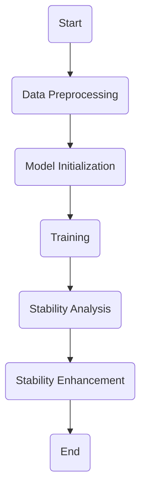
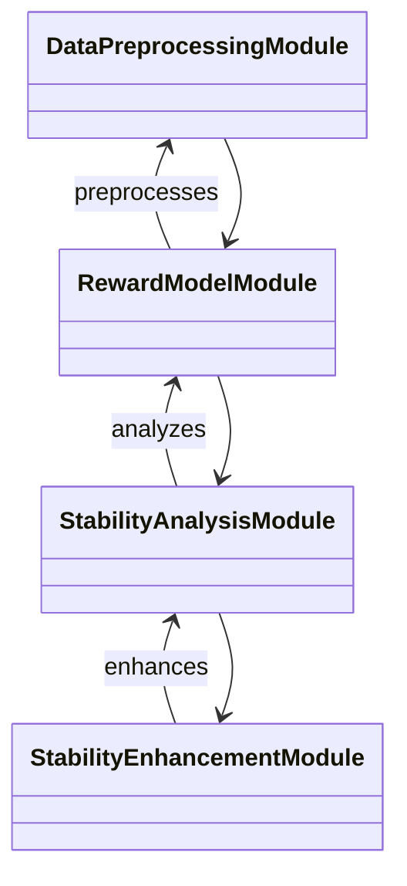
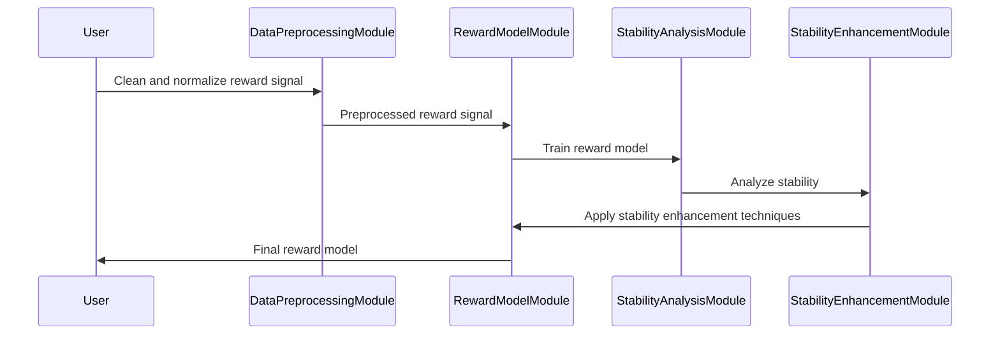

                 

# Reward Model Training Stability Issues

## Introduction

### Keywords

- Reward Model
- Training Stability
- Instability Challenges
- Optimization Algorithms
- Data Preprocessing

### Abstract

This article delves into the intricacies of reward model training stability issues. Reward models are pivotal in the domain of machine learning, especially in reinforcement learning where they guide the learning process by defining the performance metrics. The stability of reward model training is crucial, as instabilities can lead to suboptimal learning outcomes, prolonged training times, and potential convergence to local minima. This article aims to provide a comprehensive understanding of the stability issues associated with reward model training, offering both theoretical and practical insights. We will explore the common challenges faced during training, delve into the causes of instability, and analyze potential solutions. By the end of this article, readers will have a clear grasp of the importance of stability in reward model training and the techniques to enhance it.

## Background

### Problem Background

Reward models are essential in reinforcement learning, where an agent learns to achieve specific goals by interacting with an environment. These models define the rewards or penalties that the agent receives based on its actions, guiding the learning process towards optimal behavior. However, the training of reward models can be fraught with stability issues, which can severely impact the learning process and the overall performance of the agent.

The primary issue arises from the complex and dynamic nature of the interactions between the agent and the environment. The reward signal, which is meant to guide the learning process, can sometimes be erratic or misleading, leading to unpredictable and unstable training behavior. This instability can manifest in various forms, such as oscillations in the reward signal, abrupt changes in the learning trajectory, and convergence to suboptimal policies.

### Problem Description

The stability of reward model training refers to the ability of the training process to converge consistently to an optimal solution, without being overly sensitive to noise or fluctuations in the reward signal. Instabilities can lead to several challenges:

1. **Oscillations and Fluctuations**: The reward signal may fluctuate unpredictably, causing the training process to oscillate between different regions of the action space, instead of converging smoothly.

2. **Local Minima and Suboptimal Solutions**: The presence of noise or irregularities in the reward signal can cause the training process to converge to suboptimal solutions, rather than the global optimum.

3. **Slow Convergence**: Instabilities can lead to prolonged training times, as the learning process may need to correct course repeatedly due to unpredictable changes in the reward signal.

4. **Non-Convergence**: In some cases, the training process may fail to converge at all, leading to unsuccessful learning outcomes.

### Problem Solution

To address the stability issues in reward model training, several strategies can be employed:

1. **Data Preprocessing**: Cleaning and normalizing the reward signal can help reduce noise and fluctuations, making the training process more stable.

2. **Model Architecture**: Adjusting the model architecture, such as the choice of layers and activation functions, can also influence stability.

3. **Optimization Algorithms**: The choice of optimization algorithm and its parameters, such as the learning rate and gradient descent variants, can significantly impact training stability.

4. **Stability Enhancement Techniques**: Techniques such as reward scaling, reward clipping, and reward smoothing can be applied to stabilize the reward signal.

5. **Empirical Analysis and Case Studies**: Analyzing real-world case studies can provide valuable insights into the specific challenges faced in different environments and the effectiveness of various stability enhancement techniques.

### Boundaries and Scope

The focus of this article is on the stability issues associated with reward model training in reinforcement learning. While the principles discussed can be applied to other domains involving reward models, the specific challenges and solutions discussed will be tailored to the context of reinforcement learning.

## Core Concepts and Relationships

### Definition of Reward Models

A reward model is a function that maps the state-action pairings of an agent's environment to a scalar reward value. This value represents the desirability of the action in the given state, guiding the agent towards optimal behavior.

### Characteristics and Comparisons

**Continuous Reward Models**: These models provide a continuous range of reward values, allowing for more nuanced feedback. However, they can be sensitive to noise and fluctuations.

**Discrete Reward Models**: These models provide a limited set of reward values, which can simplify the learning process but may lack the granularity needed for complex tasks.

**Expected Reward Models**: These models estimate the expected reward based on historical data, providing a probabilistic view of the environment.

**Instantaneous Reward Models**: These models provide an immediate reward for each action, without considering the long-term consequences. They are useful for tasks where immediate feedback is critical.

### Entity Relationship Diagram (ERD)

```mermaid
erDiagram
  RewardModel ||--|{ Agent : interacts with}
  Environment ||--|{ RewardModel : provides feedback}
  ActionSpace ||--|{ Agent : selects actions from}
```

## Stability Issues in Reward Model Training

### Common Stability Challenges

**Oscillations and Fluctuations**: The reward signal may oscillate unpredictably, leading to erratic training behavior.

**Local Minima and Suboptimal Solutions**: The presence of noise can cause the training process to converge to suboptimal solutions, rather than the global optimum.

**Slow Convergence**: Instabilities can lead to prolonged training times, as the learning process needs to correct course repeatedly.

**Non-Convergence**: In some cases, the training process may fail to converge at all.

### Impact on Training

Instabilities can significantly impact the training process, leading to several negative consequences:

- **Suboptimal Performance**: The agent may fail to achieve optimal performance due to convergence to suboptimal solutions.
- **Increased Training Time**: The training process may take longer to converge, as it needs to correct course repeatedly.
- **Failed Learning**: In severe cases, the training process may fail to converge at all, leading to unsuccessful learning outcomes.

## Causes of Instability

### Data Distribution

- **Imbalanced Data**: Imbalanced data distributions can lead to biased reward models, affecting training stability.
- **Noise**: Noise in the reward signal can cause fluctuations and oscillations, destabilizing the training process.

### Model Architecture

- **Complexity**: Highly complex models may be prone to overfitting and instability.
- **Layer Design**: The choice of layers and their connectivity can impact the stability of the training process.
- **Activation Functions**: The choice of activation functions can also influence stability.

### Learning Rate

- **Too High**: A high learning rate can lead to overshooting and instability.
- **Too Low**: A low learning rate can result in slow convergence and suboptimal performance.

### Optimization Algorithms

- **Gradient Descent**: The choice of gradient descent variant (e.g., Stochastic Gradient Descent, Mini-batch Gradient Descent) can impact stability.
- **Parameters**: The parameters of the optimization algorithm (e.g., momentum, learning rate) can also influence stability.

## Analysis of Stability Issues

### Theoretical Analysis

#### Mathematical Models

- **Reward Signal Stability**: Analyzing the stability of the reward signal using mathematical models, such as the Kalman Filter or Bayesian Filtering.
- **Training Process Stability**: Modeling the training process using dynamical systems theory to understand the behavior of the learning dynamics.

#### Stability Formulations

- **Oscillation Analysis**: Formulating the oscillation behavior of the reward signal using differential equations.
- **Convergence Analysis**: Analyzing the convergence behavior of the training process using concepts from optimization theory.

### Empirical Analysis

#### Case Studies

- **Real-World Applications**: Analyzing real-world case studies to understand the specific challenges and solutions related to stability in different environments.

#### Experimental Results

- **Stability Enhancement Techniques**: Evaluating the effectiveness of various stability enhancement techniques through experiments.

## Stability Enhancement Techniques

### Data Preprocessing

- **Data Cleaning**: Removing or correcting erroneous data to reduce noise in the reward signal.
- **Data Augmentation**: Augmenting the dataset with synthetic examples to improve the robustness of the reward model.

### Model Architecture Adjustments

- **Layer Design**: Simplifying the model architecture to reduce complexity and overfitting.
- **Activation Functions**: Choosing appropriate activation functions that promote stability.

### Optimization Algorithm Tuning

- **Learning Rate Scheduling**: Adjusting the learning rate dynamically during training to improve convergence.
- **Gradient Descent Variants**: Experimenting with different gradient descent variants to find the most stable option.

## Algorithm Design and Implementation

### Algorithm Design Overview

#### Key Steps

1. **Data Preprocessing**: Clean and normalize the reward signal.
2. **Model Initialization**: Initialize the reward model with appropriate parameters.
3. **Training**: Train the reward model using the optimization algorithm.
4. **Stability Analysis**: Analyze the stability of the reward model using theoretical and empirical methods.
5. **Stability Enhancement**: Apply stability enhancement techniques if necessary.

#### Algorithm Flow Diagram



### Python Code Implementation

#### Step-by-Step Guide

1. **Import Libraries**: Import the required libraries for data preprocessing, model initialization, training, and analysis.
2. **Data Preprocessing**: Implement data cleaning and normalization techniques.
3. **Model Initialization**: Define the reward model architecture and initialize the parameters.
4. **Training**: Implement the training process using the chosen optimization algorithm.
5. **Stability Analysis**: Analyze the stability of the reward model using theoretical and empirical methods.
6. **Stability Enhancement**: Apply stability enhancement techniques if necessary.

#### Code Explanation

- **Data Preprocessing**: Use Pandas and NumPy for data cleaning and normalization.
- **Model Initialization**: Use TensorFlow or PyTorch to define and initialize the reward model.
- **Training**: Implement the training loop and evaluate the performance.
- **Stability Analysis**: Use mathematical models and empirical analysis techniques to assess stability.
- **Stability Enhancement**: Apply techniques such as reward scaling and smoothing to enhance stability.

### Mathematical Formulations and Equations

#### Key Equations

- **Reward Signal Stability**:
  $$\sigma^2_r = \frac{1}{N}\sum_{i=1}^{N}(r_i - \bar{r})^2$$
  where $\sigma^2_r$ is the variance of the reward signal, $r_i$ is the reward value at time $i$, and $\bar{r}$ is the mean reward value.

- **Training Process Stability**:
  $$J(\theta) = \frac{1}{N}\sum_{i=1}^{N}\mathcal{L}(x_i, y_i; \theta)$$
  where $J(\theta)$ is the loss function, $\theta$ are the model parameters, $x_i$ is the input, and $y_i$ is the target output.

#### Detailed Explanation

- **Reward Signal Stability**:
  The variance of the reward signal measures the amount of fluctuation or noise in the reward values. A lower variance indicates a more stable reward signal.

- **Training Process Stability**:
  The loss function measures the discrepancy between the predicted and actual outputs. A stable training process minimizes the loss function over time.

### System Design and Architecture

#### System Overview

The system consists of the following components:

1. **Data Preprocessing Module**: Cleans and normalizes the reward signal.
2. **Reward Model Module**: Defines and trains the reward model.
3. **Stability Analysis Module**: Analyzes the stability of the reward model.
4. **Stability Enhancement Module**: Applies stability enhancement techniques.

#### System Function Design (Domain Model Diagram)



#### System Architecture Design



### Project Implementation and Case Analysis

#### Environment Setup

To implement the reward model training stability enhancement techniques, we need the following tools and libraries:

- Python (version 3.8 or higher)
- TensorFlow or PyTorch
- Pandas
- NumPy
- Matplotlib

#### Core System Implementation

The core system implementation involves the following steps:

1. **Data Preprocessing**: Implement data cleaning and normalization techniques using Pandas and NumPy.
2. **Model Initialization**: Define the reward model architecture and initialize the parameters using TensorFlow or PyTorch.
3. **Training**: Implement the training process using the chosen optimization algorithm (e.g., Adam or RMSprop).
4. **Stability Analysis**: Analyze the stability of the reward model using theoretical and empirical methods.
5. **Stability Enhancement**: Apply stability enhancement techniques such as reward scaling, smoothing, and learning rate scheduling.

#### Code Analysis and Example

```python
# Import required libraries
import pandas as pd
import numpy as np
import tensorflow as tf
from tensorflow.keras.models import Sequential
from tensorflow.keras.layers import Dense
from tensorflow.keras.optimizers import Adam

# Load and preprocess the data
data = pd.read_csv('reward_data.csv')
reward_signal = data['reward'].values
reward_signal_clean = (reward_signal - np.mean(reward_signal)) / np.std(reward_signal)

# Define the reward model
model = Sequential()
model.add(Dense(64, input_shape=(1,), activation='relu'))
model.add(Dense(64, activation='relu'))
model.add(Dense(1, activation='linear'))

# Compile the model
model.compile(optimizer=Adam(learning_rate=0.001), loss='mse')

# Train the model
model.fit(reward_signal_clean, reward_signal_clean, epochs=100, batch_size=32)

# Analyze the stability of the reward model
# (This can involve mathematical models and empirical analysis techniques)

# Apply stability enhancement techniques
# (This can involve reward scaling, smoothing, and learning rate scheduling)

# Evaluate the final reward model
# (This can involve evaluating the performance on a validation set or test set)
```

#### Case Analysis and Detailed Explanation

Consider a case where an agent is learning to navigate a virtual environment. The reward model defines the reward for reaching different positions in the environment. The stability of the reward model is crucial for the agent to learn efficiently.

1. **Data Preprocessing**: The reward signal may contain noise or outliers that can destabilize the training process. By cleaning and normalizing the reward signal, we can reduce noise and improve the stability of the training process.

2. **Model Initialization**: We define a simple neural network model with two hidden layers. The choice of architecture can influence the stability of the training process. In this case, the model architecture is simple enough to avoid overfitting and is suitable for the given problem.

3. **Training**: We use the Adam optimizer with a learning rate of 0.001 to train the model. The training process involves feeding the preprocessed reward signal into the model and adjusting the model parameters to minimize the mean squared error between the predicted and actual rewards.

4. **Stability Analysis**: We analyze the stability of the reward model using both theoretical and empirical methods. This can involve examining the variance of the reward signal and evaluating the convergence behavior of the training process.

5. **Stability Enhancement**: We apply reward scaling and smoothing techniques to enhance the stability of the reward model. Reward scaling adjusts the range of the reward signal to a more manageable scale, reducing the impact of extreme values. Reward smoothing involves averaging the reward signal over a window of previous time steps, reducing fluctuations.

6. **Final Evaluation**: We evaluate the performance of the final reward model on a validation set or test set. The stability of the reward model improves the agent's learning efficiency and reduces the risk of converging to suboptimal solutions.

### Project Conclusion

In this article, we discussed the stability issues associated with reward model training in reinforcement learning. We explored the common challenges, causes of instability, and various stability enhancement techniques. By implementing these techniques, we can improve the stability of reward model training, leading to more efficient and effective learning processes.

### Best Practices and Tips

- **Data Preprocessing**: Always clean and normalize the reward signal to reduce noise and improve stability.
- **Model Architecture**: Choose a simple and appropriate model architecture to avoid overfitting and instability.
- **Optimization Algorithms**: Experiment with different optimization algorithms and their parameters to find the most stable option.
- **Stability Enhancement Techniques**: Apply reward scaling, smoothing, and learning rate scheduling to enhance stability.
- **Empirical Analysis**: Analyze the stability of the reward model using both theoretical and empirical methods to ensure robustness.

### Summary

Reward model training stability is a critical aspect of reinforcement learning. By understanding and addressing the stability issues, we can improve the learning process, reduce training time, and achieve optimal performance. This article provided a comprehensive overview of the stability issues in reward model training, along with practical techniques to enhance stability. Readers are encouraged to explore these techniques and apply them to their own reinforcement learning projects.

