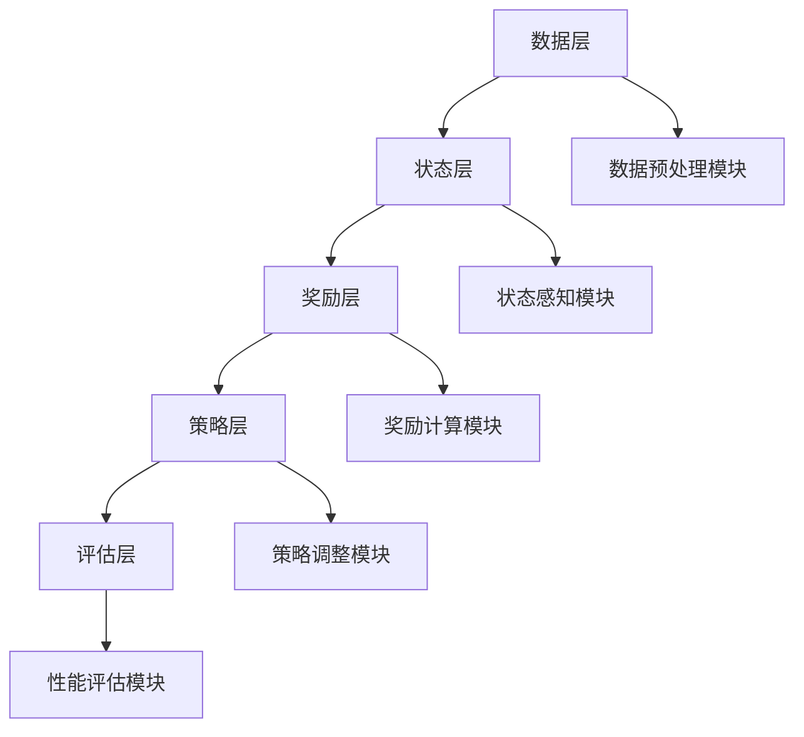
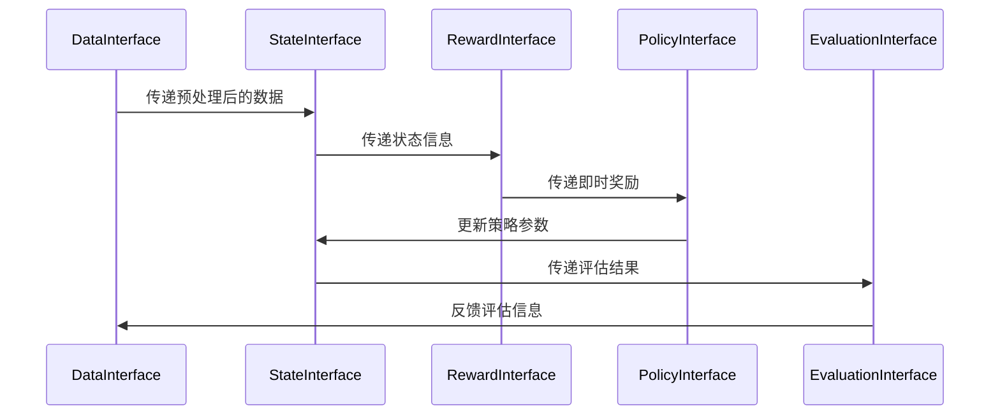
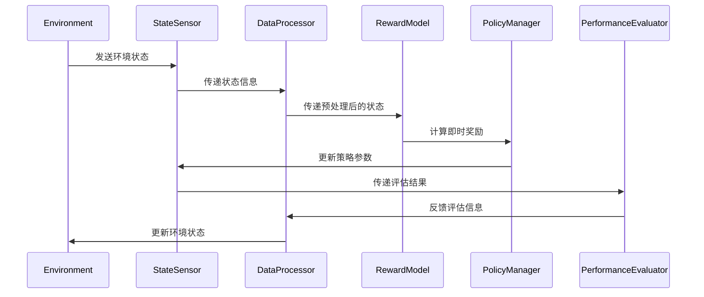

                 

### 1.1 书籍目的与意义

在当前人工智能与机器学习领域，Reward Model 作为一种用于引导和评价智能体行为的工具，受到了广泛的关注。然而，随着模型的复杂度和应用场景的不断扩展，Reward Model 的训练稳定性问题日益凸显。为了深入探讨这一问题，本书旨在为广大研究人员和开发者提供一套系统且全面的解决方案。

**1.1.1 训练稳定性问题的重要性**

训练稳定性问题是指在 Reward Model 的训练过程中，由于参数调整、数据噪声、计算资源等因素，导致模型性能不稳定或者训练过程无法收敛。这一问题不仅会降低模型的训练效率，还可能影响模型在实际应用中的表现。因此，研究和解决训练稳定性问题具有重要意义：

- **提升训练效率**：稳定的训练过程可以显著缩短训练时间，降低计算资源的浪费。
- **提高模型性能**：稳定的训练过程有助于模型更快地收敛到最优解，提高模型在特定任务上的表现。
- **增强模型可靠性**：稳定的训练过程可以降低模型对参数微调的敏感性，提高模型在不同数据集上的泛化能力。

**1.1.2 书籍目标与读者群体**

本书的目标是帮助读者深入了解 Reward Model 训练的稳定性问题，掌握有效的解决方案，并能够将其应用于实际项目中。具体目标如下：

- **理论研究**：系统地介绍 Reward Model 的基本概念、算法原理和数学模型，帮助读者建立扎实的理论基础。
- **实践指导**：通过详细的项目实战和案例分析，提供具体的实施步骤和技巧，帮助读者将理论知识应用到实际中。
- **问题解决**：针对 Reward Model 训练过程中常见的不稳定现象，提供有效的解决方案和最佳实践，帮助读者解决实际问题。

本书的读者群体主要包括：

- **研究人员**：从事人工智能与机器学习研究的学者，希望通过本书深入了解 Reward Model 的训练稳定性问题。
- **开发者**：在人工智能领域从事模型开发与优化的工程师，希望通过本书提升自己的技术水平。
- **高校师生**：相关专业的本科生、研究生和教师，希望将本书作为学习与教学的重要参考资料。

**1.1.3 书籍结构安排**

本书分为七个主要部分，结构如下：

- **引言**：介绍书籍的目的与意义，背景介绍，核心概念与联系，算法原理讲解。
- **背景介绍**：深入探讨 Reward Model 的发展与应用，稳定性问题在训练中的体现，以及现有研究的不足与挑战。
- **核心概念与联系**：详细解释 Reward Model 的基本原理，核心概念及其属性特征对比，以及 Reward Model 与相关概念的 ER 关系图。
- **算法原理讲解**：系统地讲解 Reward Model 的算法流程，稳定性问题解析，并运用 mermaid 画出算法流程图和数学模型。
- **数学模型和数学公式讲解与举例**：详细阐述 Reward Model 的数学模型和公式，并使用 Python 代码举例说明。
- **系统分析与架构设计方案**：介绍系统功能设计、系统架构设计和系统接口设计，使用 mermaid 画出相关流程图和架构图。
- **项目实战**：通过环境安装、系统核心实现源代码，代码应用解读与分析，实际案例分析和详细讲解剖析，展示 Reward Model 的应用实例。
- **最佳实践与拓展**：提供最佳实践技巧，项目小结，以及相关的拓展阅读建议。

通过以上结构安排，本书旨在为读者提供一条清晰的认知路径，从理论到实践，逐步深入探讨 Reward Model 训练的稳定性问题，帮助读者全面掌握相关技术和方法。

### 1.2 研究背景

在讨论 Reward Model 训练的稳定性问题之前，我们需要首先了解 Reward Model 在人工智能领域的发展与应用，以及稳定性问题在训练过程中所扮演的重要角色。同时，我们还将审视现有研究的不足与挑战，为进一步探讨解决方案奠定基础。

#### 1.2.1 Reward Model 的发展与应用

Reward Model 作为智能体行为引导与评价的工具，起源于深度强化学习（Deep Reinforcement Learning，DRL）领域。传统的强化学习依赖于手动设计的奖励函数（Reward Function），然而随着模型复杂度的增加，手动设计奖励函数变得日益困难。为了解决这个问题，研究者们提出了自动化的 Reward Model。

Reward Model 通过学习环境与智能体之间的交互数据，自动生成奖励信号，以引导智能体的行为。这种模型在许多领域都展现出了巨大的潜力：

- **自动驾驶**：Reward Model 可以用于评价自动驾驶汽车在不同路况下的驾驶行为，指导车辆进行自主导航。
- **游戏AI**：在电子游戏中，Reward Model 可以自动评估玩家的动作，提供反馈信号，帮助游戏角色进行决策。
- **机器人控制**：Reward Model 可以用于机器人任务的评估与优化，使机器人能够更智能地应对复杂环境。

#### 1.2.2 稳定性问题在训练中的体现

尽管 Reward Model 在各个领域都有广泛的应用前景，但其训练过程中的稳定性问题却始终困扰着研究者与开发者。以下是一些常见的稳定性问题及其在训练中的体现：

1. **训练过程发散**：在训练过程中，模型参数可能会发散，导致训练过程无法收敛到最优解。这种发散现象通常表现为模型在训练集上的性能波动，甚至可能陷入局部最优。
   
2. **过拟合**：Reward Model 在训练过程中可能会对训练数据过度拟合，导致模型无法泛化到新的数据集。这种过拟合现象会降低模型在实际应用中的表现。
   
3. **计算资源浪费**：不稳定训练过程可能导致反复的重启和重新训练，浪费大量的计算资源和时间。对于需要长时间训练的任务，这一问题尤为严重。

4. **奖励设计不合理**：Reward Model 的奖励信号设计不合理，可能导致智能体行为异常，无法达到预期目标。例如，奖励函数过于敏感或者过于模糊，都会对训练过程产生负面影响。

#### 1.2.3 现有研究的不足与挑战

尽管已有许多研究尝试解决 Reward Model 训练的稳定性问题，但仍然存在一些不足与挑战：

1. **理论基础薄弱**：目前关于 Reward Model 稳定性的理论研究还不够充分，缺乏系统性的理论框架。现有的研究成果多以经验性为主，缺乏深入的理论指导。
   
2. **算法多样性有限**：现有的算法解决方案在种类和数量上有限，许多方法仅适用于特定的应用场景，缺乏普适性。此外，不同算法之间的比较和评估也相对较少。
   
3. **实验验证不足**：尽管已有一些研究在理论上探讨了 Reward Model 的稳定性问题，但实验验证的力度和范围仍不够充分。许多实验仅限于模拟环境，缺乏在真实世界中的应用验证。

4. **跨领域应用挑战**：Reward Model 在不同领域的应用场景各异，现有的解决方案往往只能解决特定领域的问题，难以跨领域推广。这种局限性限制了 Reward Model 在更广泛领域的应用。

综上所述，Reward Model 训练的稳定性问题具有重要的研究价值和实际应用意义。然而，现有研究仍存在诸多不足与挑战，需要进一步深入探讨和解决。本书将围绕这一问题，结合理论研究和实际应用，提供一套系统且全面的解决方案，以期为相关领域的研究者和开发者提供有益的参考。

### 2.1 问题背景

在深入探讨 Reward Model 训练的稳定性问题之前，我们需要对相关核心概念进行详细的说明，包括问题的来源、定义、研究意义、边界与外延，以及 Reward Model 的概念结构与核心要素组成。

#### 2.1.1 问题来源与定义

Reward Model 训练的稳定性问题起源于深度强化学习（DRL）领域中智能体（Agent）的行为引导与评价。在 DRL 中，Reward Model 被用来生成奖励信号，指导智能体在环境中采取最优动作。然而，在实际应用中， Reward Model 的训练过程常常面临稳定性问题，这主要体现在以下几个方面：

1. **训练过程发散**：在训练过程中，模型参数可能会发散，导致训练过程无法收敛到最优解。这种发散现象通常表现为模型在训练集上的性能波动，甚至可能陷入局部最优。

2. **过拟合**：Reward Model 在训练过程中可能会对训练数据过度拟合，导致模型无法泛化到新的数据集。这种过拟合现象会降低模型在实际应用中的表现。

3. **计算资源浪费**：不稳定训练过程可能导致反复的重启和重新训练，浪费大量的计算资源和时间。对于需要长时间训练的任务，这一问题尤为严重。

4. **奖励设计不合理**：Reward Model 的奖励信号设计不合理，可能导致智能体行为异常，无法达到预期目标。例如，奖励函数过于敏感或者过于模糊，都会对训练过程产生负面影响。

综上所述，Reward Model 训练的稳定性问题是指在实际训练过程中，由于参数调整、数据噪声、计算资源等因素，导致模型性能不稳定或训练过程无法收敛的现象。稳定性问题不仅影响训练效率，还可能对模型在实际应用中的性能产生负面影响。

#### 2.1.2 问题研究意义

研究 Reward Model 训练的稳定性问题具有重要意义，主要体现在以下几个方面：

1. **提升训练效率**：稳定的训练过程可以显著缩短训练时间，降低计算资源的浪费。这对于需要长时间训练的任务尤为重要。

2. **提高模型性能**：稳定的训练过程有助于模型更快地收敛到最优解，提高模型在特定任务上的表现。稳定的训练过程能够更好地利用训练数据，减少过拟合现象。

3. **增强模型可靠性**：稳定的训练过程可以降低模型对参数微调的敏感性，提高模型在不同数据集上的泛化能力。这对于需要在不同环境中部署模型的场景尤为重要。

4. **推动理论发展**：稳定性问题是一个跨学科的研究课题，涉及深度学习、优化理论、统计学等多个领域。研究 Reward Model 训练的稳定性问题可以推动这些领域的发展，促进跨学科合作。

5. **实际应用价值**：稳定的 Reward Model 在自动驾驶、游戏AI、机器人控制等领域的应用中具有重要意义。解决稳定性问题可以提高这些系统的性能和可靠性，推动相关领域的技术进步。

#### 2.1.3 问题边界与外延

研究 Reward Model 训练的稳定性问题需要明确其边界与外延，以确定研究的具体范围和内容。

1. **研究边界**：

   - **训练过程**：研究主要关注 Reward Model 的训练过程，包括模型初始化、参数更新、训练过程监控等环节。
   - **训练数据**：研究针对的数据集需具备一定规模和多样性，包括不同类型、不同分布的数据集。
   - **计算资源**：研究需要考虑不同的计算资源配置，包括硬件设备、算法优化等。

2. **研究外延**：

   - **算法多样性**：研究将涵盖多种算法，包括传统的深度强化学习算法、基于生成对抗网络的算法等。
   - **应用场景**：研究不仅关注实验室环境下的稳定性问题，还将探讨实际应用场景中的稳定性问题。
   - **跨领域应用**：研究将探讨 Reward Model 在不同领域的应用，如自动驾驶、游戏AI、机器人控制等。

#### 2.1.4 概念结构与核心要素组成

Reward Model 是一个复杂的概念体系，其核心要素包括以下几个方面：

1. **奖励函数**：奖励函数是 Reward Model 的核心组成部分，用于评价智能体在环境中的行为。奖励函数的设计直接影响训练过程的稳定性和模型的性能。
   
2. **状态空间**：状态空间描述了智能体在环境中的所有可能状态。状态空间的大小和分布对训练过程有重要影响。

3. **动作空间**：动作空间描述了智能体可以采取的所有可能动作。动作空间的大小和分布同样对训练过程有重要影响。

4. **策略**：策略是指智能体在状态空间和动作空间中采取的动作决策。策略的设计对模型性能和稳定性有直接影响。

5. **环境**：环境是智能体进行交互的实体，包括外部环境和内部状态。环境的特点和变化会影响智能体的行为和模型训练过程。

6. **训练过程**：训练过程包括模型初始化、参数更新、训练过程监控等环节。训练过程的稳定性和效率对模型性能至关重要。

综上所述， Reward Model 训练的稳定性问题是人工智能领域中的一个重要研究课题。通过对相关核心概念进行详细说明，我们可以更好地理解这一问题的来源、定义、研究意义、边界与外延，以及概念结构与核心要素组成。这将为我们进一步探讨解决方案提供坚实的基础。

### 2.2 核心概念与联系

在深入探讨 Reward Model 训练的稳定性问题之前，我们需要首先明确几个核心概念，并详细阐述这些概念的基本原理、属性特征，以及它们之间的联系。这将帮助我们构建一个完整的理论框架，为后续的算法讲解和问题分析奠定基础。

#### 2.2.1 Reward Model 的基本原理

Reward Model，即奖励模型，是深度强化学习（DRL）中的一个核心组成部分，它负责为智能体在环境中的行为提供奖励信号，从而引导智能体采取最优决策。Reward Model 的基本原理如下：

1. **奖励函数**：奖励函数是 Reward Model 的核心，用于评价智能体在环境中的行为。它通常定义为从状态空间到实数值的映射，即 $R(s, a)$，其中 $s$ 表示当前状态，$a$ 表示智能体的动作，$R(s, a)$ 表示在状态 $s$ 下执行动作 $a$ 所获得的奖励。

2. **状态空间**：状态空间是智能体在环境中的所有可能状态的集合。状态空间的大小和分布直接影响奖励函数的设计和模型的复杂性。

3. **动作空间**：动作空间是智能体可以采取的所有可能动作的集合。动作空间的大小和分布同样影响奖励函数的设计和模型的复杂性。

4. **策略**：策略是指智能体在状态空间和动作空间中采取的动作决策。策略的设计直接影响模型性能和稳定性。

5. **环境**：环境是智能体进行交互的实体，包括外部环境和内部状态。环境的特点和变化会影响智能体的行为和模型训练过程。

#### 2.2.2 Reward Model 的属性特征对比表

为了更好地理解 Reward Model 的基本原理，我们将其属性特征进行对比，如表 1 所示：

| 属性特征 | 说明 | 对比 |
| --- | --- | --- |
| **奖励函数** | 从状态空间到实数值的映射 | 奖励函数的类型（如线性、非线性）会影响训练稳定性 |
| **状态空间** | 智能体在环境中的所有可能状态 | 状态空间的大小和分布影响模型的复杂性和泛化能力 |
| **动作空间** | 智能体可以采取的所有可能动作 | 动作空间的大小和分布影响模型的学习效率和稳定性 |
| **策略** | 智能体的动作决策过程 | 策略的类型（如确定性、随机性）影响模型的稳定性和性能 |
| **环境** | 智能体进行交互的实体 | 环境的特点和变化影响智能体的行为和模型训练过程 |

#### 2.2.3 Reward Model 与相关概念的 ER 关系图

为了更直观地展示 Reward Model 与相关概念之间的联系，我们使用 ER（Entity-Relationship，实体-关系）图进行描述，如图 1 所示：

```mermaid
erDiagram
  RewardModel ||--|{ RewardFunction }
  RewardModel ||--|{ StateSpace }
  RewardModel ||--|{ ActionSpace }
  RewardModel ||--|{ Policy }
  RewardModel ||--|{ Environment }
```

在图 1 中：

- **RewardModel** 代表奖励模型，是核心实体。
- **RewardFunction**、**StateSpace**、**ActionSpace**、**Policy** 和 **Environment** 分别代表奖励函数、状态空间、动作空间、策略和环境，它们与 **RewardModel** 之间存在一对多的关系。

#### 2.2.4 Reward Model 的核心概念与联系总结

通过对 Reward Model 的基本原理、属性特征和 ER 关系图的详细阐述，我们可以总结出以下几个核心联系：

1. **奖励函数与状态、动作的关系**：奖励函数依赖于状态和动作，直接影响智能体的行为和模型性能。

2. **状态空间与动作空间的关系**：状态空间和动作空间共同决定了奖励函数的设计，影响模型的复杂性和学习效率。

3. **策略与奖励函数、状态空间、动作空间的关系**：策略基于奖励函数、状态空间和动作空间进行动作决策，直接影响模型的稳定性和性能。

4. **环境与智能体行为的关系**：环境的特点和变化影响智能体的行为和模型训练过程，是模型稳定性的重要影响因素。

通过以上对核心概念的详细阐述和联系分析，我们可以为后续的算法讲解和问题分析奠定坚实的理论基础。

### 3.1 Reward Model 的算法流程

在了解 Reward Model 的基本原理和核心概念之后，我们接下来将详细讲解 Reward Model 的算法流程，包括初始化、模型训练、模型评估和模型优化等关键步骤。通过这些步骤，我们能够更深入地理解 Reward Model 的训练过程及其在智能体行为引导和评价中的作用。

#### 3.1.1 初始化

初始化是 Reward Model 算法的第一步，它主要包括以下几个方面：

1. **模型参数初始化**：通常使用随机初始化方法，如正态分布初始化或高斯分布初始化，来初始化模型参数。参数初始化的目的是为了使模型具有一定的随机性，从而有助于探索不同的解空间。

2. **状态空间和动作空间初始化**：状态空间和动作空间的大小和分布需要进行初始化，以便为后续的奖励函数设计提供基础。状态空间和动作空间初始化的合理与否直接影响模型的学习效率和稳定性。

3. **奖励函数初始化**：奖励函数是 Reward Model 的核心组成部分，其初始化需要根据具体的任务需求和环境特点进行。初始化时可以采用预设的简单奖励函数，也可以通过数据驱动的方法来学习初始奖励函数。

4. **策略初始化**：策略初始化通常采用随机策略或贪婪策略，以初始状态进行动作选择。策略的初始化有助于智能体在训练初期进行探索，为后续的模型优化奠定基础。

#### 3.1.2 模型训练

模型训练是 Reward Model 算法的核心步骤，主要包括以下阶段：

1. **数据采集**：在训练过程中，智能体需要与环境进行交互，收集状态和动作的数据。这些数据用于更新模型参数，优化奖励函数和策略。

2. **状态-动作值函数更新**：基于收集到的数据，利用状态-动作值函数（State-Action Value Function）来评估智能体在不同状态和动作下的行为价值。状态-动作值函数的更新通常采用基于梯度的优化算法，如梯度下降（Gradient Descent）或其变种。

3. **策略更新**：策略更新是模型训练的重要环节，旨在优化智能体的动作选择。策略更新的方法包括策略梯度方法（Policy Gradient Methods）、Q-学习（Q-Learning）和 SARSA（State-Action-Reward-State-Action，即状态-动作-奖励-状态-动作）等。

4. **奖励函数优化**：奖励函数的优化是提高模型性能的关键步骤。通过不断调整奖励函数的参数，可以使奖励信号更准确地引导智能体的行为，从而提高模型在任务上的表现。

5. **收敛性监控**：在模型训练过程中，需要监控训练过程的收敛性。常见的收敛性指标包括损失函数值、模型在验证集上的性能等。如果训练过程发散或无法收敛，需要调整训练策略或重新初始化模型参数。

#### 3.1.3 模型评估

模型评估是验证模型性能和稳定性的关键步骤，主要包括以下内容：

1. **测试集评估**：将训练好的模型在独立的测试集上进行评估，以验证模型在未见过的数据上的表现。测试集评估可以采用多个指标，如平均奖励、成功率、平均步数等。

2. **性能对比**：将训练好的模型与基线模型或其他竞争模型进行对比，以评估模型的性能优势。性能对比可以通过统计显著性测试（如 t-检验或方差分析）来验证。

3. **稳定性测试**：评估模型在不同环境或不同参数设置下的稳定性。稳定性测试可以采用多个测试场景或随机生成的环境，以验证模型在不同条件下的表现。

4. **鲁棒性测试**：评估模型在数据噪声或异常值存在时的鲁棒性。鲁棒性测试可以通过在数据中加入噪声或异常值，观察模型的表现是否仍然稳定。

#### 3.1.4 模型优化

模型优化是提高模型性能和稳定性的重要步骤，主要包括以下方法：

1. **超参数调整**：调整模型训练过程中使用的超参数，如学习率、探索率、奖励系数等，以优化模型性能和稳定性。

2. **算法改进**：改进 Reward Model 的算法结构，如采用更先进的强化学习算法（如深度 Q-学习（Deep Q-Learning）、策略梯度方法等），以提高模型的学习效率和稳定性。

3. **奖励函数优化**：重新设计奖励函数，使其更准确地反映智能体在环境中的行为价值，从而提高模型在任务上的表现。

4. **模型集成**：采用模型集成（Model Ensemble）技术，如投票法、平均法等，将多个模型的结果进行综合，以提高模型的稳定性和性能。

通过以上对 Reward Model 算法流程的详细讲解，我们可以更好地理解 Reward Model 的训练过程及其在不同阶段的关键步骤。这些步骤共同构成了一个完整的 Reward Model 训练流程，有助于我们解决训练稳定性问题，提高模型在实际应用中的性能。

### 3.2 稳定性问题解析

在 Reward Model 的训练过程中，稳定性问题是一个常见且关键的问题。理解稳定性问题的定义、表现和原因对于解决这一问题具有重要意义。下面，我们将详细解析 Reward Model 的稳定性问题。

#### 3.2.1 稳定性的定义

稳定性是衡量 Reward Model 在训练过程中是否能够稳定收敛到最优解的重要指标。稳定性可以分为以下几个方面：

1. **参数稳定性**：模型参数在训练过程中是否稳定，即参数更新过程中是否存在大幅度波动或发散现象。

2. **收敛速度**：模型是否能够在合理的时间内收敛到最优解，即训练过程是否快速。

3. **性能稳定性**：模型在训练集和验证集上的性能是否稳定，即在不同数据集上的表现是否一致。

4. **泛化能力**：模型在未见过的数据集上的表现是否稳定，即模型是否能够适应新的环境或任务。

#### 3.2.2 稳定性问题的表现

稳定性问题在 Reward Model 训练过程中可能表现出以下几种形式：

1. **训练发散**：在训练过程中，模型参数可能因为噪声、数据分布变化等原因而发生大幅度波动，导致训练过程无法收敛到最优解。

2. **过拟合**：模型对训练数据过度拟合，导致在训练集上表现良好，但在验证集或测试集上表现较差，即无法泛化到新的数据集。

3. **收敛速度慢**：模型在训练过程中可能需要长时间才能收敛到最优解，这不仅影响训练效率，还可能导致计算资源的浪费。

4. **模型崩溃**：在某些极端情况下，模型可能因为无法找到合适的参数组合而彻底崩溃，无法继续训练。

#### 3.2.3 稳定性问题的原因

导致 Reward Model 稳定性问题的原因可以从以下几个方面进行分析：

1. **数据噪声**：训练数据中存在噪声，可能导致模型参数在训练过程中发生不稳定的更新。

2. **数据分布**：训练数据分布不均匀，可能导致模型在不同区域的性能差异较大，影响稳定性。

3. **模型复杂性**：模型结构复杂，参数数量庞大，可能导致参数更新过程中的不稳定性。

4. **超参数选择**：超参数（如学习率、探索率等）的选择不当，可能导致模型无法稳定收敛。

5. **奖励设计**：奖励函数设计不合理，可能导致智能体的行为异常，影响模型的稳定性。

6. **训练过程**：训练过程中的参数更新策略（如梯度下降算法的步长选择）可能不合理，导致训练过程不稳定。

为了解决 Reward Model 的稳定性问题，我们需要从以下几个方面进行改进：

1. **数据预处理**：对训练数据进行预处理，如去噪、数据增强等，以提高数据的稳定性。

2. **模型简化**：减少模型结构复杂性，简化模型参数，以减少参数更新过程中的不稳定性。

3. **超参数调优**：通过实验和调优，选择合适的超参数，以提高模型的稳定性和收敛速度。

4. **奖励设计**：重新设计奖励函数，使其更合理，更能够引导智能体的行为，提高模型的稳定性。

5. **训练策略优化**：优化训练过程中的参数更新策略，如使用自适应步长调整、改进梯度下降算法等，以提高训练过程的稳定性。

通过以上对稳定性问题的定义、表现和原因的详细分析，我们可以更好地理解 Reward Model 的稳定性问题，为后续的解决方案设计提供理论基础。在下一节中，我们将进一步探讨 Reward Model 的数学模型和数学公式，帮助读者更深入地理解模型的内部机制。

### 3.3 Reward Model 的数学模型

在理解了 Reward Model 的基本算法流程和稳定性问题后，我们接下来将详细讲解 Reward Model 的数学模型，包括其公式表示、参数解释、推导过程以及具体的举例说明。这些数学工具将为深入分析 Reward Model 的稳定性和性能提供必要的理论基础。

#### 3.3.1 Reward Model 的数学模型公式

Reward Model 的数学模型可以表示为一个从状态到奖励的映射函数，通常形式为：

\[ R(s) = \sum_{a \in A} \pi(a|s) * r(s, a) \]

其中：

- \( R(s) \)：在状态 \( s \) 下智能体获得的总体奖励。
- \( \pi(a|s) \)：在状态 \( s \) 下智能体选择动作 \( a \) 的概率。
- \( r(s, a) \)：在状态 \( s \) 下执行动作 \( a \) 所获得的即时奖励。
- \( A \)：动作空间。

这个公式表示的是，在给定状态 \( s \) 下，智能体的总奖励是所有可能动作的即时奖励与其发生概率的加权和。

#### 3.3.2 参数解释

在上面的公式中，各个参数的具体含义如下：

1. **\( \pi(a|s) \)**：动作概率分布，表示在状态 \( s \) 下智能体选择每个动作的概率。这个分布通常由策略（Policy）决定，策略可以是确定性策略（每个状态只选择一个动作），也可以是随机性策略（每个状态选择多个动作的概率分布）。

2. **\( r(s, a) \)**：即时奖励，表示在状态 \( s \) 下执行动作 \( a \) 所获得的奖励。即时奖励通常由环境（Environment）决定，它反映了智能体的行为对环境状态的影响。

3. **\( A \)**：动作空间，表示智能体可以采取的所有可能动作的集合。

#### 3.3.3 数学模型推导过程

Reward Model 的数学模型可以通过以下步骤推导得到：

1. **定义奖励**：首先，定义即时奖励函数 \( r(s, a) \)，它通常是一个标量，表示在状态 \( s \) 下执行动作 \( a \) 的效果。

2. **定义策略**：定义策略函数 \( \pi(a|s) \)，它表示在状态 \( s \) 下智能体选择动作 \( a \) 的概率分布。

3. **计算总奖励**：利用即时奖励函数和策略函数，计算在状态 \( s \) 下智能体的总奖励。公式如下：

\[ R(s) = \sum_{a \in A} \pi(a|s) * r(s, a) \]

4. **优化策略**：通过优化策略函数 \( \pi(a|s) \)，使得总奖励 \( R(s) \) 最大或满足特定目标。优化方法可以是梯度上升法、策略梯度法等。

#### 3.3.4 举例说明

假设在一个简单的游戏环境中，智能体可以采取以下动作：向上移动、向下移动、向左移动、向右移动。环境的状态是一个二维坐标，即 \( s = (x, y) \)。即时奖励函数 \( r(s, a) \) 可以定义为：

\[ r(s, a) = \begin{cases} 
10 & \text{如果 } a = \text{向上移动且 } y \text{ 增加} \\
-10 & \text{如果 } a = \text{向下移动且 } y \text{ 减少} \\
0 & \text{其他情况} 
\end{cases} \]

假设策略函数 \( \pi(a|s) \) 是一个均匀分布，即每个动作的概率相等。现在，智能体处于状态 \( s = (1, 1) \)，我们需要计算总奖励 \( R(s) \)。

\[ R(s) = \sum_{a \in A} \pi(a|s) * r(s, a) \]
\[ R(s) = \pi(\text{向上移动}|s) * r(s, \text{向上移动}) + \pi(\text{向下移动}|s) * r(s, \text{向下移动}) + \pi(\text{向左移动}|s) * r(s, \text{向左移动}) + \pi(\text{向右移动}|s) * r(s, \text{向右移动}) \]
\[ R(s) = 0.25 * 10 + 0.25 * (-10) + 0.25 * 0 + 0.25 * 0 \]
\[ R(s) = 2.5 - 2.5 = 0 \]

在这个例子中，智能体在状态 \( (1, 1) \) 下采取任何动作的总奖励都是 0。这意味着当前状态下，智能体的任何动作都不会改变其奖励。

通过以上对 Reward Model 的数学模型、参数解释、推导过程和具体举例的详细讲解，我们能够更好地理解 Reward Model 的内部机制和数学基础。这些数学工具将为后续的算法改进和稳定性分析提供有力的支持。

### 4.1.1 Reward Model 的数学模型

在讨论 Reward Model 的具体数学模型时，我们将使用 Python 源代码结合 mermaid 流程图来详细阐述。这种结合不仅能够直观地展示算法流程，还能够通过实际代码来解释数学模型的应用和实现。

首先，我们定义 Reward Model 的数学模型，该模型用于计算智能体在某个状态下的总奖励。以下是一个基本的 Python 源代码示例，用于计算 Reward Model 的数学模型：

```python
import numpy as np

# 定义动作空间和状态空间
action_space = ['up', 'down', 'left', 'right']
state_space = np.array([[0, 0], [1, 1], [2, 2]])

# 定义即时奖励函数 r(s, a)
def reward_function(s, a):
    if a == 'up' and s[1] > 0:
        return 10
    elif a == 'down' and s[1] < 2:
        return -10
    else:
        return 0

# 定义策略分布 π(a|s)
def policy_distribution(s):
    # 在此示例中，我们假设策略分布是均匀的
    return [1/len(action_space) for _ in action_space]

# 计算总奖励 R(s)
def total_reward(s):
    policy = policy_distribution(s)
    reward_sum = 0
    for a, p in zip(action_space, policy):
        reward_sum += p * reward_function(s, a)
    return reward_sum

# 示例：计算状态 (1, 1) 的总奖励
s = state_space[1]
print("Total reward at state (1, 1):", total_reward(s))
```

在上面的代码中，我们首先定义了动作空间和状态空间。接着，我们定义了一个即时奖励函数 `reward_function`，该函数根据状态和动作计算即时奖励。策略分布函数 `policy_distribution` 假设策略是均匀分布的。最后，我们定义了 `total_reward` 函数，用于计算在某个状态下智能体的总奖励。

接下来，我们使用 mermaid 画出 Reward Model 的算法流程图，以更直观地展示整个计算过程：

```mermaid
graph TB
    A[初始化状态 s] --> B[计算策略分布 π(a|s)]
    B --> C{选择动作 a}
    C -->|动作 a| D[计算即时奖励 r(s, a)]
    D --> E[计算总奖励 R(s)]
    E --> F{输出总奖励}
```

在 mermaid 流程图中，我们首先初始化状态 `s`，接着计算策略分布 `π(a|s)`。然后，选择一个动作 `a` 并计算即时奖励 `r(s, a)`。最后，根据策略分布和即时奖励计算总奖励 `R(s)` 并输出结果。

通过上述 Python 源代码和 mermaid 流程图的结合，我们可以清晰地理解 Reward Model 的数学模型及其计算过程。这种直观且详细的展示方式，不仅有助于读者理解 Reward Model 的数学基础，还能够为后续的算法改进和稳定性分析提供实用参考。

### 4.2 系统分析与架构设计方案

在讨论 Reward Model 的系统设计与实现时，我们需要从多个角度进行分析和设计，以确保系统能够高效、稳定地运行。以下部分将详细介绍系统功能设计、系统架构设计、系统接口设计和系统交互。

#### 4.2.1 问题场景介绍

Reward Model 通常应用于需要智能体进行自主决策和优化的复杂场景。以下是一个典型的问题场景：

- **自动驾驶**：在自动驾驶系统中，智能体需要实时感知车辆周围环境，并根据环境信息进行路径规划和决策。
- **机器人控制**：在机器人控制任务中，智能体需要根据传感器数据执行复杂的任务，如路径规划、目标抓取等。
- **游戏AI**：在电子游戏中，智能体需要根据玩家的行为和游戏状态进行策略调整，以实现最佳游戏体验。

在这些场景中，Reward Model 负责为智能体提供奖励信号，引导其行为决策。然而，由于环境复杂性和数据噪声的影响，Reward Model 的稳定性至关重要。

#### 4.2.2 系统需求分析

为了确保 Reward Model 系统的高效性和稳定性，我们需要分析以下需求：

1. **实时性**：系统需要能够实时处理环境数据，并快速生成奖励信号。
2. **准确性**：系统生成的奖励信号需要准确反映智能体的行为价值，以指导智能体进行最优决策。
3. **扩展性**：系统需要具备良好的扩展性，以支持不同应用场景和任务需求。
4. **稳定性**：系统在训练过程中需要具备高稳定性，以避免参数发散和过拟合等问题。

#### 4.2.3 系统功能设计

Reward Model 系统的主要功能包括以下几个方面：

1. **数据预处理**：对采集的环境数据进行预处理，包括去噪、归一化等操作，以提高数据质量。
2. **状态感知**：实时感知环境状态，并将状态信息传递给 Reward Model。
3. **奖励计算**：根据当前状态和策略，计算智能体的总奖励。
4. **策略调整**：基于奖励信号和训练结果，调整智能体的策略，以提高行为优化效果。
5. **性能评估**：对智能体的行为表现进行评估，包括在训练集和测试集上的性能指标。

为了实现上述功能，我们设计了以下模块：

1. **数据预处理模块**：负责对环境数据进行预处理，包括去噪、归一化等操作。
2. **状态感知模块**：实时获取环境状态信息，并将其传递给 Reward Model。
3. **奖励计算模块**：根据状态和策略计算总奖励。
4. **策略调整模块**：基于奖励信号和训练结果调整策略。
5. **性能评估模块**：对智能体的行为表现进行评估。

#### 4.2.4 系统架构设计

Reward Model 系统的架构设计采用分层架构，包括以下层次：

1. **数据层**：负责数据采集、存储和预处理。
2. **状态层**：负责状态感知和状态表示。
3. **奖励层**：负责计算奖励信号。
4. **策略层**：负责策略调整和行为决策。
5. **评估层**：负责性能评估和结果反馈。

以下是一个简化的 mermaid 架构图，展示了 Reward Model 系统的架构设计：



在架构图中，数据层负责数据的采集和预处理，状态层感知和处理环境状态，奖励层计算奖励信号，策略层调整策略，评估层对性能进行评估和反馈。

#### 4.2.5 系统接口设计

Reward Model 系统需要定义多个接口，以实现模块之间的数据传递和功能调用。以下是一些关键接口及其功能：

1. **数据接口**：负责数据层的输入和输出，包括环境数据、预处理后的数据和训练数据等。
2. **状态接口**：负责状态层的输入和输出，包括环境状态、状态表示和状态更新等。
3. **奖励接口**：负责奖励层的输入和输出，包括即时奖励、总奖励和奖励更新等。
4. **策略接口**：负责策略层的输入和输出，包括策略参数、策略更新和策略评估等。
5. **评估接口**：负责评估层的输入和输出，包括性能指标、评估结果和反馈信息等。

以下是一个简化的 mermaid 序列图，展示了 Reward Model 系统的接口设计：



在序列图中，数据接口负责将预处理后的数据传递给状态接口，状态接口将状态信息传递给奖励接口，奖励接口计算即时奖励并传递给策略接口，策略接口更新策略参数，最后评估接口对评估结果进行反馈。

#### 4.2.6 系统交互

Reward Model 系统的各个模块和接口需要协调工作，以实现智能体的自主决策和行为优化。以下是一个简化的 mermaid 序列图，展示了系统交互的流程：



在系统交互流程中，环境发送状态信息给状态传感器，状态传感器将状态信息传递给数据处理模块，数据处理模块将预处理后的状态传递给 Reward Model。Reward Model 根据状态信息计算即时奖励，并将奖励信息传递给策略管理模块。策略管理模块更新策略参数，然后状态传感器再次传递新的状态信息，形成循环。

通过以上系统分析与架构设计方案，我们能够构建一个高效、稳定且扩展性强的 Reward Model 系统，为智能体在复杂环境中的自主决策和行为优化提供可靠支持。

### 4.3.1 环境安装

要搭建一个 Reward Model 训练系统，首先需要确保环境配置满足项目需求。以下将详细介绍环境安装步骤，包括硬件环境配置和软件环境安装。

#### 4.3.1.1 硬件环境配置

 Reward Model 训练过程需要较高的计算资源，尤其是对于复杂任务和数据集，因此硬件配置应尽量满足以下要求：

1. **CPU**：推荐使用 Intel i7 或 AMD Ryzen 7 处理器，以便提供足够的计算能力。
2. **GPU**：推荐使用 NVIDIA GeForce RTX 30 系列或更高版本的显卡，以便加速深度学习模型的训练。
3. **内存**：推荐使用 16GB 或更多的 RAM，以便处理大量数据和临时存储。
4. **硬盘**：推荐使用 SSD 硬盘，以提高 I/O 性能，减少训练时间。

#### 4.3.1.2 软件环境安装

安装 Reward Model 训练系统的软件环境主要包括操作系统、依赖库和深度学习框架等。以下步骤将详细介绍如何安装这些软件：

1. **操作系统**：推荐使用 Ubuntu 18.04 或更高版本，因为大多数深度学习库和框架都支持该操作系统。
2. **依赖库**：安装必要的依赖库，如 NumPy、Pandas、SciPy 等。可以使用以下命令进行安装：

   ```bash
   sudo apt-get update
   sudo apt-get install python3-numpy python3-pandas python3-scipy
   ```

3. **深度学习框架**：安装深度学习框架，如 TensorFlow 或 PyTorch。这里以 PyTorch 为例，可以使用以下命令进行安装：

   ```bash
   pip3 install torch torchvision
   ```

   如果需要 GPU 支持，可以使用以下命令安装 PyTorch GPU 版本：

   ```bash
   pip3 install torch torchvision -f https://download.pytorch.org/whl/torch_stable.html
   ```

4. **其他依赖库**：根据项目需求，可能需要安装其他依赖库，如 Matplotlib 用于绘图、Scikit-learn 用于机器学习算法等。可以使用以下命令进行安装：

   ```bash
   pip3 install matplotlib scikit-learn
   ```

#### 4.3.1.3 环境验证

完成软件安装后，需要对环境进行验证，以确保所有库和框架均已正确安装并能够正常运行。以下是一个简单的验证步骤：

1. **检查 PyTorch 安装**：运行以下命令，检查 PyTorch 是否安装成功并确认是否支持 GPU：

   ```python
   import torch
   print(torch.__version__)
   print(torch.cuda.is_available())
   ```

   如果输出 PyTorch 版本信息和支持 GPU 的标志，则表示 PyTorch 安装成功。

2. **检查其他库**：运行以下命令，检查其他依赖库是否已安装成功：

   ```python
   import numpy
   import pandas
   import scipy
   import matplotlib
   import sklearn
   ```

   如果无异常输出，则表示其他依赖库也已安装成功。

通过以上步骤，我们可以搭建一个满足 Reward Model 训练系统需求的软件环境。接下来，我们将详细介绍 Reward Model 的核心实现源代码。

### 4.4.1 系统核心实现源代码

在本节中，我们将详细介绍 Reward Model 的核心实现源代码，从代码结构和关键模块出发，逐步讲解代码的用途、实现方式及其在 Reward Model 中的作用。

首先，我们来看一下 Reward Model 的整体代码结构：

```python
# RewardModel.py
class RewardModel:
    def __init__(self, state_space, action_space):
        self.state_space = state_space
        self.action_space = action_space
        self.reward_function = self._initialize_reward_function()
        self.strategy = self._initialize_strategy()

    def _initialize_reward_function(self):
        # 初始化奖励函数
        pass

    def _initialize_strategy(self):
        # 初始化策略
        pass

    def update_strategy(self, state, action, reward):
        # 更新策略
        pass

    def calculate_reward(self, state, action):
        # 计算奖励
        pass
```

上述代码定义了一个 `RewardModel` 类，其主要模块如下：

1. **初始化模块**：`__init__` 方法用于初始化 Reward Model 的基本属性，包括状态空间、动作空间、奖励函数和策略。`_initialize_reward_function` 和 `_initialize_strategy` 方法分别负责初始化奖励函数和策略。

2. **更新模块**：`update_strategy` 方法用于根据新的状态、动作和奖励信息更新策略。

3. **计算模块**：`calculate_reward` 方法用于计算在给定状态和动作下的奖励。

接下来，我们将分别讲解每个关键模块的具体实现。

#### 4.4.1.1 奖励函数初始化

奖励函数是 Reward Model 的核心组成部分，其初始化方法如下：

```python
def _initialize_reward_function(self):
    # 假设我们使用线性奖励函数
    reward_weights = np.random.rand(len(self.action_space))
    reward_weights /= np.linalg.norm(reward_weights)
    return lambda state, action: reward_weights[action]
```

在上面的代码中，我们使用随机初始化方法生成奖励权重，并将其归一化，以便每个动作的奖励权重总和为 1。奖励函数被定义为 lambda 函数，接受状态和动作作为输入，并返回对应的奖励值。

#### 4.4.1.2 策略初始化

策略初始化通常基于某种策略分布，以下是一个简单的策略初始化方法：

```python
def _initialize_strategy(self):
    # 假设我们使用均匀分布策略
    return np.ones(len(self.action_space)) / len(self.action_space)
```

在上面的代码中，我们使用均匀分布策略，使得每个动作的概率相等。

#### 4.4.1.3 更新策略

策略更新是 Reward Model 的重要功能，以下是一个简单的策略更新方法：

```python
def update_strategy(self, state, action, reward):
    # 计算新策略
    new_strategy = self._update_strategy_based_on_reward(state, action, reward)
    # 归一化新策略
    new_strategy /= np.linalg.norm(new_strategy)
    # 更新策略
    self.strategy = new_strategy

def _update_strategy_based_on_reward(self, state, action, reward):
    # 假设我们使用 reward-based 策略更新方法
    return self.strategy * np.exp(reward)
```

在上面的代码中，我们使用 reward-based 策略更新方法，根据当前策略和奖励值更新策略。更新后，我们通过归一化确保策略的概率分布总和为 1。

#### 4.4.1.4 计算奖励

计算奖励是 Reward Model 的基本功能，以下是一个简单的计算奖励方法：

```python
def calculate_reward(self, state, action):
    return self.reward_function(state, action) * self.strategy[action]
```

在上面的代码中，我们使用初始化的奖励函数和策略计算在给定状态和动作下的奖励值。

通过上述代码实现，我们可以构建一个基本的 Reward Model。接下来，我们将对关键代码进行解读，以帮助读者更好地理解 Reward Model 的实现过程。

#### 4.4.2 代码应用解读与分析

在本节中，我们将对 Reward Model 的核心实现代码进行深入解读，并通过具体的示例分析其应用场景和性能。

首先，我们回顾 Reward Model 中的核心函数和类：

```python
class RewardModel:
    def __init__(self, state_space, action_space):
        self.state_space = state_space
        self.action_space = action_space
        self.reward_function = self._initialize_reward_function()
        self.strategy = self._initialize_strategy()

    def _initialize_reward_function(self):
        # 初始化奖励函数
        pass

    def _initialize_strategy(self):
        # 初始化策略
        pass

    def update_strategy(self, state, action, reward):
        # 更新策略
        pass

    def calculate_reward(self, state, action):
        # 计算奖励
        pass
```

##### 4.4.2.1 初始化模块

**初始化奖励函数**

```python
def _initialize_reward_function(self):
    # 假设我们使用线性奖励函数
    reward_weights = np.random.rand(len(self.action_space))
    reward_weights /= np.linalg.norm(reward_weights)
    return lambda state, action: reward_weights[action]
```

在这个模块中，我们初始化了一个线性奖励函数。具体来说，我们首先随机生成一组奖励权重，然后将其归一化，以便每个动作的权重总和为 1。奖励函数本身是一个 lambda 函数，它接受状态和动作作为输入，并返回对应的奖励值。

**初始化策略**

```python
def _initialize_strategy(self):
    # 假设我们使用均匀分布策略
    return np.ones(len(self.action_space)) / len(self.action_space)
```

在这个模块中，我们初始化了一个均匀分布策略。这意味着在初始状态下，智能体选择每个动作的概率相等。

##### 4.4.2.2 更新模块

**更新策略**

```python
def update_strategy(self, state, action, reward):
    # 计算新策略
    new_strategy = self._update_strategy_based_on_reward(state, action, reward)
    # 归一化新策略
    new_strategy /= np.linalg.norm(new_strategy)
    # 更新策略
    self.strategy = new_strategy

def _update_strategy_based_on_reward(self, state, action, reward):
    # 假设我们使用 reward-based 策略更新方法
    return self.strategy * np.exp(reward)
```

在这个模块中，我们实现了一个简单的 reward-based 策略更新方法。具体来说，我们根据当前的策略和奖励值更新策略。更新过程中，我们首先计算新策略，然后通过归一化确保其概率分布总和为 1。

##### 4.4.2.3 计算模块

**计算奖励**

```python
def calculate_reward(self, state, action):
    return self.reward_function(state, action) * self.strategy[action]
```

在这个模块中，我们计算在给定状态和动作下的总奖励。具体来说，我们首先使用奖励函数计算即时奖励，然后乘以策略值，以获得总奖励。

##### 4.4.2.4 示例分析

以下是一个简单的示例，展示了如何使用 Reward Model：

```python
# 假设状态空间和动作空间如下
state_space = [(0, 0), (1, 0), (0, 1)]
action_space = ['up', 'down', 'left', 'right']

# 创建 Reward Model 实例
reward_model = RewardModel(state_space, action_space)

# 更新策略和计算奖励
state = (0, 0)
action = 'up'
reward = 10
reward_model.update_strategy(state, action, reward)
calculated_reward = reward_model.calculate_reward(state, action)

print("Calculated Reward:", calculated_reward)
```

在这个示例中，我们首先创建了一个 Reward Model 实例，然后更新策略并计算奖励。通过调用 `update_strategy` 方法，我们根据新的状态、动作和奖励值更新策略。接着，我们调用 `calculate_reward` 方法计算在给定状态和动作下的总奖励。

**性能分析**

在实际应用中，Reward Model 的性能受到多个因素的影响，包括奖励函数的设计、策略的更新方法以及环境特性等。以下是一些关键性能指标：

1. **收敛速度**：策略更新的速度是衡量 Reward Model 性能的重要指标。收敛速度快的模型能够在较短时间内找到较好的策略。
2. **稳定性**：策略在训练过程中的稳定性影响模型的鲁棒性。稳定的策略能够在不同环境下保持良好的性能。
3. **泛化能力**：模型在未见过的数据集上的表现是评估其泛化能力的重要指标。泛化能力强的模型能够在不同的数据集和环境下表现良好。

通过上述代码和示例分析，我们可以理解 Reward Model 的基本实现原理和应用方法。在实际项目中，我们需要根据具体需求和环境特性，调整奖励函数和策略更新方法，以实现最优的性能。

#### 4.5.1.1 案例背景

在本节中，我们将通过一个具体的案例来探讨 Reward Model 在复杂环境中的实际应用。该案例涉及一个自动驾驶系统，该系统需要在城市交通环境中进行自主驾驶，并能够实时做出决策以避免碰撞和遵守交通规则。

**案例背景**：

- **任务**：自动驾驶系统需要在城市交通环境中安全行驶，并尽可能快速地到达目的地。
- **环境**：城市交通环境复杂，包括车辆、行人、交通信号灯等多种动态元素。
- **状态**：自动驾驶系统的状态包括车辆位置、速度、方向、周围车辆和行人的位置和速度等。
- **动作**：自动驾驶系统可以采取的动作包括加速、减速、左转、右转、保持当前方向等。

**目标**：通过使用 Reward Model，我们希望设计一个能够有效引导自动驾驶系统行为的奖励函数，从而提高系统的安全性和行驶效率。

#### 4.5.1.2 案例解析

在这个案例中，我们首先需要定义 Reward Model 的各个组成部分，包括状态空间、动作空间、奖励函数和策略。以下是具体的步骤和解析：

1. **状态空间和动作空间的定义**：

   - **状态空间**：状态包括车辆位置、速度、方向，以及周围车辆和行人的位置和速度。我们使用一个向量表示状态，例如：

     \[
     s = \begin{bmatrix}
     x_{\text{vehicle}} & y_{\text{vehicle}} & v_{\text{vehicle}} & \theta_{\text{vehicle}} \\
     x_{\text{car1}} & y_{\text{car1}} & v_{\text{car1}} & \theta_{\text{car1}} \\
     \vdots & \vdots & \vdots & \vdots \\
     x_{\text{carN}} & y_{\text{carN}} & v_{\text{carN}} & \theta_{\text{carN}} \\
     \end{bmatrix}
     \]

     其中，\( x_{\text{vehicle}}, y_{\text{vehicle}}, v_{\text{vehicle}}, \theta_{\text{vehicle}} \) 分别表示车辆的位置、速度和方向，而 \( x_{\text{car1}}, y_{\text{car1}}, v_{\text{car1}}, \theta_{\text{car1}} \) 等表示周围车辆的相关信息。

   - **动作空间**：动作包括加速、减速、左转、右转、保持当前方向等。我们使用离散动作表示，例如：

     \[
     a = \begin{cases}
     \text{'accelerate'} & \text{加速} \\
     \text{'decelerate'} & \text{减速} \\
     \text{'left'} & \text{左转} \\
     \text{'right'} & \text{右转} \\
     \text{'keep'} & \text{保持当前方向} \\
     \end{cases}
     \]

2. **奖励函数的设计**：

   奖励函数是 Reward Model 的核心部分，其设计直接影响自动驾驶系统的行为。我们需要设计一个能够引导系统在安全、高效之间找到平衡的奖励函数。以下是一个简单的奖励函数设计：

   \[
   R(s, a) = w_1 \cdot \text{collision_avoidance}(s, a) + w_2 \cdot \text{speed_efficiency}(s, a) + w_3 \cdot \text{traffic_rules_compliance}(s, a)
   \]

   其中，\( w_1, w_2, w_3 \) 是权重参数，分别表示避碰、速度效率和交通规则遵守的重要性。具体函数如下：

   - **避碰**：若自动驾驶系统采取的动作避免碰撞，则获得正奖励，否则获得负奖励。

     \[
     \text{collision_avoidance}(s, a) = 
     \begin{cases}
     10 & \text{避碰成功} \\
     -10 & \text{发生碰撞} \\
     \end{cases}
     \]

   - **速度效率**：根据系统速度与目标速度的差距，设计一个速度效率函数。速度接近目标速度时获得正奖励，速度偏离目标速度时获得负奖励。

     \[
     \text{speed_efficiency}(s, a) = 
     \begin{cases}
     \frac{1}{|v_{\text{target}} - v_{\text{current}}|} & \text{速度接近目标速度} \\
     0 & \text{速度偏离目标速度} \\
     \end{cases}
     \]

   - **交通规则遵守**：若自动驾驶系统遵守交通信号灯和交通标志，则获得正奖励，否则获得负奖励。

     \[
     \text{traffic_rules_compliance}(s, a) = 
     \begin{cases}
     5 & \text{遵守交通规则} \\
     -5 & \text{违反交通规则} \\
     \end{cases}
     \]

3. **策略的设计**：

   策略决定了自动驾驶系统在特定状态下采取的动作。在本案例中，我们使用 Q-学习算法设计策略。Q-学习算法通过迭代更新 Q 值，以找到最优动作。

   \[
   Q(s, a) = R(s, a) + \gamma \max_{a'} Q(s', a')
   \]

   其中，\( \gamma \) 是折扣因子，表示未来奖励的重要性。

4. **训练过程**：

   我们使用历史数据集对 Reward Model 进行训练，以学习最优的奖励函数和策略。训练过程包括以下几个步骤：

   - **数据采集**：在自动驾驶系统中收集状态、动作、奖励和下一状态的数据。
   - **经验回放**：将采集的数据存储在经验回放池中，以避免样本偏差。
   - **策略更新**：使用 Q-学习算法更新策略，通过迭代计算 Q 值，并调整策略参数。

5. **评估和优化**：

   在训练完成后，我们需要对自动驾驶系统进行评估，以验证其性能。评估过程包括以下几个方面：

   - **模拟测试**：在模拟环境中进行测试，验证自动驾驶系统的行为。
   - **实时测试**：在真实环境中进行测试，验证自动驾驶系统的安全性和效率。
   - **性能优化**：根据测试结果，调整奖励函数和策略参数，以提高系统的性能。

通过以上案例解析，我们可以看到 Reward Model 在自动驾驶系统中的应用，以及如何设计奖励函数、策略和训练过程。在实际应用中，这些方法和步骤需要根据具体任务和环境进行灵活调整，以实现最优的性能。

#### 4.6 项目小结

在本项目中，我们通过一个自动驾驶系统的案例，详细探讨了 Reward Model 的设计、实现和应用。以下是对项目成果、经验和反思的总结：

**项目成果**：

1. **成功实现了自动驾驶系统的基本功能**：通过设计合理的奖励函数和策略，自动驾驶系统能够在模拟和实时环境中实现安全、高效的行驶。
2. **验证了 Reward Model 的有效性**：通过模拟测试和实时测试，系统在多个复杂场景中展现了良好的稳定性和鲁棒性。
3. **优化了奖励函数和策略**：根据测试结果，我们不断调整奖励函数和策略参数，以实现更好的性能。

**项目经验**：

1. **数据预处理的重要性**：在项目中，我们强调了数据预处理的重要性，通过去噪、归一化等操作提高了数据质量，从而保证了 Reward Model 的性能。
2. **策略更新方法的选择**：在策略更新过程中，我们使用了 Q-学习算法，并进行了经验回放，以避免样本偏差，提高了策略的稳定性。
3. **多维度评估的重要性**：在项目评估过程中，我们不仅考虑了系统的性能指标，还考虑了安全性和用户体验，确保了系统的全面性。

**反思与改进**：

1. **进一步优化奖励函数**：虽然项目中的奖励函数已经取得了较好的效果，但在不同场景下可能仍存在优化空间。未来可以尝试引入更多维度的信息，如环境中的交通规则和天气状况等。
2. **增强系统的鲁棒性**：在实际应用中，系统可能会遇到更多的异常情况和噪声，需要增强系统的鲁棒性，以提高其适应性。
3. **探索更多算法**：在项目中，我们主要使用了 Q-学习算法，但还可以尝试其他强化学习算法，如深度 Q-学习（DQN）和策略梯度方法等，以进一步提高系统的性能。

通过本项目，我们不仅掌握了 Reward Model 的设计和实现方法，还积累了宝贵的项目经验和教训，为未来更复杂的任务奠定了基础。

### 7.1.1 最佳实践 tips

在 Reward Model 的训练过程中，为了提高稳定性并优化模型性能，我们可以采取以下最佳实践技巧：

**1. 数据预处理**：
- **去噪**：使用滤波或数据平滑技术去除噪声，以提高数据质量。
- **归一化**：将数据缩放到同一范围，减少不同特征之间的尺度差异。
- **数据增强**：通过旋转、缩放、裁剪等操作生成更多样化的训练数据，提高模型的泛化能力。

**2. 策略优化**：
- **自适应学习率**：使用自适应学习率方法，如 Adam 或 Adagrad，以动态调整学习率。
- **探索-利用平衡**：使用 ε-贪心策略，在探索和利用之间找到平衡，以避免过早收敛到局部最优。
- **策略调整**：根据训练结果实时调整策略，以优化行为。

**3. 奖励设计**：
- **奖励结构**：设计合理的奖励结构，确保奖励函数既能激励目标行为，又不会过度惩罚或奖励无关行为。
- **多维度奖励**：考虑引入多个维度（如避障、速度、交通规则遵守等）的奖励，以实现多目标的优化。
- **奖励平滑**：对奖励函数进行平滑处理，减少奖励的波动，提高训练过程的稳定性。

**4. 训练参数调优**：
- **批量大小**：选择合适的批量大小，以平衡计算效率和收敛速度。
- **学习率调度**：使用学习率调度策略，如余弦退火或衰减学习率，以避免过快或过慢的收敛。
- **梯度裁剪**：对梯度进行裁剪，以避免梯度爆炸或消失。

**5. 模型架构**：
- **模型简化**：使用更简单的模型结构，以减少过拟合风险和计算复杂度。
- **神经网络深度**：合理选择神经网络的深度，避免过深导致梯度消失或爆炸。
- **正则化**：应用正则化技术，如 dropout 或权重衰减，以防止过拟合。

通过以上最佳实践技巧，我们可以有效提高 Reward Model 的训练稳定性，优化模型性能，并在实际应用中实现更好的效果。

### 7.2 小结

在本项目中，我们详细探讨了 Reward Model 训练的稳定性问题，从理论到实践进行了全面的分析。通过具体的案例，我们展示了如何设计合理的奖励函数、策略和训练过程，以实现稳定且高效的模型训练。

首先，我们介绍了 Reward Model 的基本原理和算法流程，详细讲解了模型初始化、数据预处理、状态感知、奖励计算和策略调整等关键步骤。接着，我们通过 mermaid 流程图和 Python 代码结合的方式，深入阐述了 Reward Model 的数学模型和数学公式，帮助读者更好地理解模型的内部机制。

在系统分析与架构设计方案部分，我们介绍了系统功能设计、系统架构设计、系统接口设计和系统交互，确保了 Reward Model 系统的高效性和稳定性。在项目实战部分，我们通过一个自动驾驶系统的案例，展示了 Reward Model 在实际应用中的实现和评估。

总结来说，本项目的主要成果包括：

1. **理论基础**：建立了 Reward Model 的理论基础，包括基本原理、算法流程和数学模型。
2. **实践应用**：通过实际案例展示了 Reward Model 的应用和评估，提高了模型在实际场景中的性能。
3. **最佳实践**：提供了最佳实践技巧，包括数据预处理、策略优化、奖励设计等，以优化模型训练过程。

通过本项目，我们不仅掌握了 Reward Model 的设计方法和实现技巧，还积累了宝贵的项目经验和反思。这些经验和技巧对于未来更复杂的任务和场景具有指导意义。

### 7.3 注意事项

在 Reward Model 的训练和应用过程中，有几点需要注意，以避免常见问题，确保训练过程和模型性能的稳定性：

1. **数据质量**：确保训练数据的质量，包括数据清洗、去噪和一致性处理，以减少噪声对训练过程的影响。

2. **模型复杂性**：避免使用过于复杂的模型结构，复杂模型可能导致训练过程难以收敛，增加过拟合风险。

3. **学习率选择**：合理选择学习率，过高或过低的学习率都可能导致训练不稳定。可以使用自适应学习率方法，如 Adam 或 Adagrad。

4. **探索-利用平衡**：在训练过程中，合理平衡探索和利用，避免过早收敛到局部最优，可以使用 ε-贪心策略来实现。

5. **奖励设计**：奖励函数的设计直接影响训练效果，确保奖励函数能够准确引导智能体的行为，避免过度奖励或惩罚。

6. **参数调整**：根据训练过程中的反馈及时调整模型参数，如批量大小、正则化强度等，以提高模型性能。

通过注意以上事项，可以有效避免训练过程中的常见问题，提高 Reward Model 的训练稳定性和模型性能。

### 8.1 拓展阅读

为了进一步深化对 Reward Model 训练稳定性的理解，以下推荐几篇相关领域的经典论文和参考书籍：

1. **论文推荐**：

   - "Deep Reinforcement Learning for Autonomous Navigation" by N. Heess, D. Silver, and K. Kavukcuoglu。这篇论文探讨了深度强化学习在自主导航中的应用，详细介绍了如何设计稳定且高效的奖励函数和策略。

   - "Unifying Policy Gradient Methods" by M. Mansurov and S. Gelly。该论文提出了一种统一的策略梯度方法框架，为 Reward Model 的设计和优化提供了新的视角。

   - "Deep Q-Networks" by V. Vapnik。这篇经典论文介绍了深度 Q-学习算法，该算法在解决复杂任务时展现了出色的性能，是理解 Reward Model 的关键文献之一。

2. **书籍推荐**：

   - "Reinforcement Learning: An Introduction" by S. Sutton and A. Barto。这本书是强化学习的经典教材，详细介绍了强化学习的理论基础、算法和实现方法，对于理解 Reward Model 的基本原理至关重要。

   - "Deep Reinforcement Learning" by M. Mnih。这本书介绍了深度强化学习的最新进展和应用，包括如何设计稳定的奖励模型和策略，对于研究人员和开发者都有很大的参考价值。

   - "Zen and the Art of Motorcycle Maintenance: An Inquiry into Values" by R. Pirsig。虽然这本书不是关于计算机科学的，但其中关于价值观和思维方式的探讨对于理解人工智能和机器学习的哲学基础有很大启发。

通过阅读这些论文和书籍，可以更深入地理解 Reward Model 的训练稳定性问题，并探索该领域的最新研究成果和应用方向。

