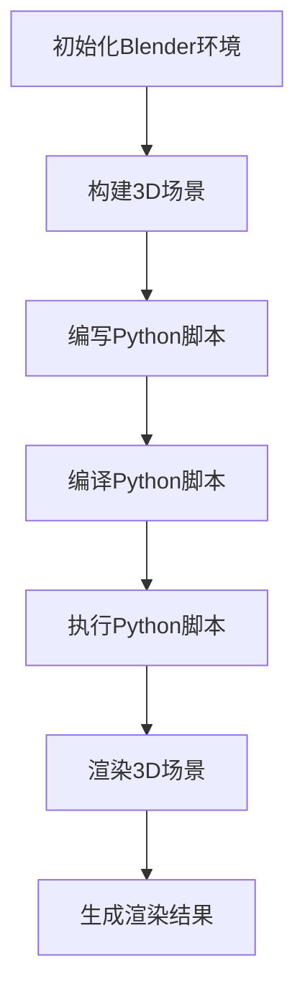
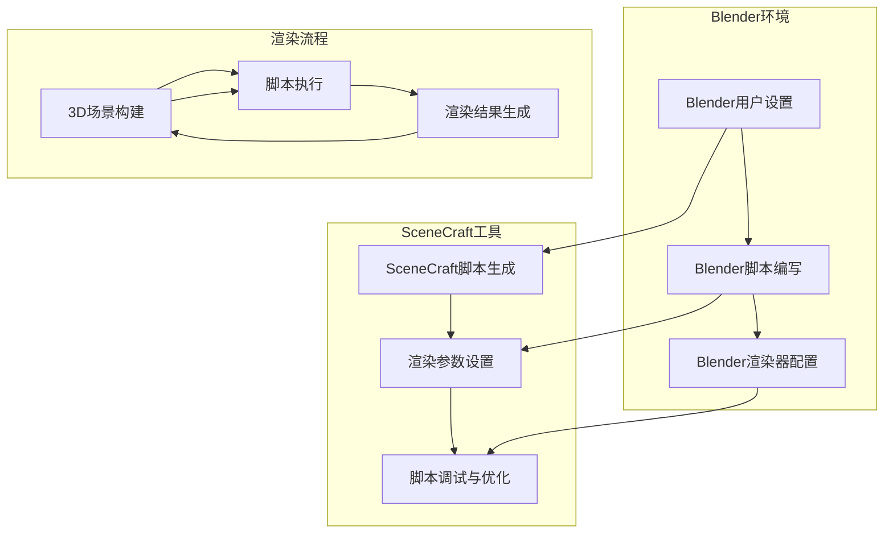
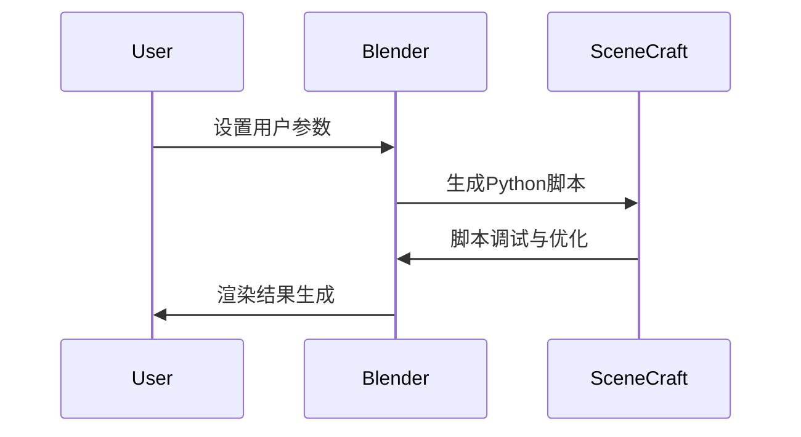
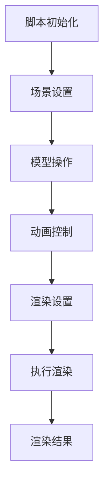
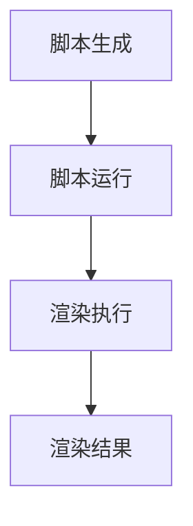
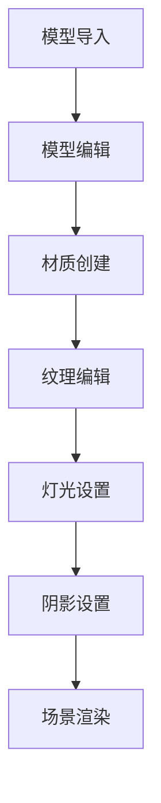
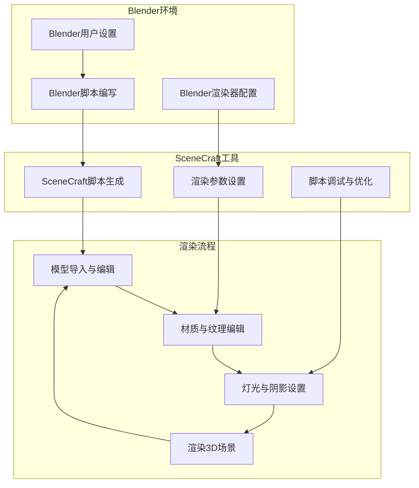
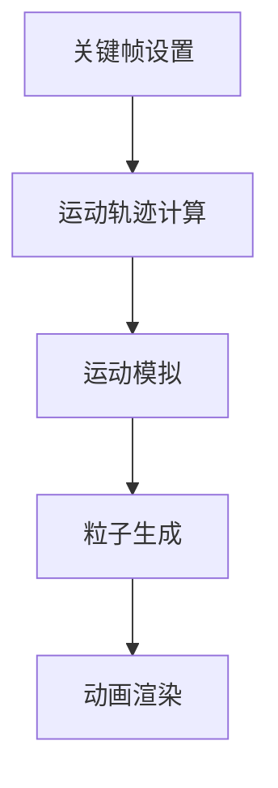

                 


## SceneCraft:生成Blender可执行Python脚本渲染3D场景

### 关键词：Blender、Python脚本、3D渲染、SceneCraft、渲染效果、后期处理

> 摘要：本文将深入探讨SceneCraft工具的使用方法，通过生成Blender可执行Python脚本，实现对3D场景的渲染。文章将从基础概念、工具使用、实际操作等多个角度进行分析，旨在帮助读者全面掌握SceneCraft的使用技巧，提高3D渲染效率。

### 1. 3D渲染与Blender简介

#### 1.1 3D渲染的基本原理

3D渲染是计算机图形学中的一项重要技术，它通过模拟真实世界的光照、阴影、反射等效果，将3D模型转化为2D图像。3D渲染的基本流程包括模型渲染、纹理渲染、光照渲染和阴影渲染等步骤。

- **模型渲染**：将3D模型转换为二维图像。
- **纹理渲染**：为模型添加纹理，使其更具真实感。
- **光照渲染**：模拟光线在场景中的传播和反射，产生阴影和亮度变化。
- **阴影渲染**：为模型添加阴影，增强场景的立体感。

#### 1.2 Blender概述

Blender是一款开源的3D建模、渲染、动画软件，广泛应用于游戏开发、电影制作、建筑可视化等领域。Blender具有以下特点：

- **强大的渲染器**：Blender内置了多种渲染器，包括Cycles（基于物理渲染）和Eevee（实时渲染）等。
- **丰富的插件**：Blender社区提供了大量的插件，扩展了其功能。
- **开源免费**：Blender是一款开源软件，用户可以免费使用。

#### 1.3 SceneCraft的概念

SceneCraft是一款基于Blender的Python脚本生成工具，它能够帮助用户快速生成可执行的Python脚本，实现对3D场景的渲染。SceneCraft的优势在于：

- **自动化渲染**：用户可以通过脚本自动化地渲染3D场景，提高渲染效率。
- **可定制性**：用户可以根据自己的需求定制渲染脚本，实现个性化的渲染效果。
- **易用性**：SceneCraft的界面直观，操作简单，适合初学者使用。

### 2. Blender中的Python脚本基础

#### 2.1 Blender中的Python简介

Blender内置了Python解释器，用户可以在Blender中编写Python脚本，实现对3D场景的自动化操作。Blender中的Python具有以下特点：

- **脚本编写方便**：Blender提供了丰富的API，用户可以方便地编写Python脚本。
- **脚本运行高效**：Blender的Python脚本可以直接在Blender中运行，不需要额外的编译过程。

#### 2.2 Blender中的Python脚本基础

- **数据类型和变量**：Python中常用的数据类型包括整数、浮点数、字符串、列表、字典和元组等。
- **运算符和表达式**：Python支持常见的数学运算符和逻辑运算符，用户可以通过表达式进行复杂的计算。
- **流程控制语句**：Python提供了if、for、while等流程控制语句，用户可以根据需要控制程序的执行流程。

#### 2.3 函数与模块

- **函数的定义与调用**：Python中函数是组织代码的重要方式，用户可以定义函数并调用函数。
- **模块的导入与使用**：Python中的模块是一种代码组织方式，用户可以通过导入模块来使用模块中的函数和类。

### 3. SceneCraft基础操作

#### 3.1 SceneCraft基本设置

- **Blender的用户设置**：用户需要在Blender中设置Python脚本的运行环境。
- **脚本运行环境的配置**：用户需要安装Python解释器和相关的Blender插件，确保脚本能够正常运行。

#### 3.2 脚本编写与调试

- **脚本的基本结构**：Python脚本的基本结构包括导入模块、定义函数、编写主程序等。
- **脚本的调试方法**：用户可以使用Blender内置的调试工具对脚本进行调试。
- **脚本的常见错误与解决**：用户需要了解常见的脚本错误类型，并学会解决这些问题。

#### 3.3 脚本渲染流程

- **脚本渲染的基本流程**：用户通过编写Python脚本，实现对3D场景的渲染。
- **脚本渲染参数的设置**：用户可以根据需要设置渲染参数，以实现不同的渲染效果。

### 4. 3D场景构建与编辑

#### 4.1 3D模型的基本操作

- **模型的导入与导出**：用户可以导入和导出3D模型，以满足不同的需求。
- **模型的编辑与修改**：用户可以使用Blender对3D模型进行编辑和修改，以实现个性化的设计。

#### 4.2 材质与纹理

- **材质的基本概念**：材质是定义3D模型外观的重要元素，用户需要了解材质的基本概念。
- **纹理的创建与编辑**：用户可以创建和编辑纹理，以增强3D模型的真实感。

#### 4.3 灯光与阴影

- **光源的类型与设置**：用户需要了解不同类型的光源，并学会设置光源参数。
- **阴影的类型与效果**：用户需要了解阴影的类型和效果，以增强场景的立体感。

### 5. 场景动画与运动模拟

#### 5.1 场景动画基础

- **动画的基本概念**：用户需要了解动画的基本概念，包括关键帧、时间轴等。
- **动画的关键帧设置**：用户需要学会设置关键帧，以实现动画效果。

#### 5.2 运动模拟

- **运动模拟的基本原理**：用户需要了解运动模拟的基本原理，包括物理引擎等。
- **运动模拟的类型与设置**：用户需要学会设置运动模拟的参数，以实现不同的运动效果。

### 6. 渲染效果与后期处理

#### 6.1 渲染设置

- **渲染参数的设置**：用户需要了解渲染参数的设置方法，以实现不同的渲染效果。
- **渲染效果的调整**：用户需要学会调整渲染效果，以满足不同的需求。

#### 6.2 后期处理

- **后期处理的基本流程**：用户需要了解后期处理的基本流程，包括色彩校正、特效添加等。
- **后期处理工具的使用**：用户需要学会使用后期处理工具，以实现高质量的渲染效果。

#### 6.3 渲染输出

- **渲染输出的格式与设置**：用户需要了解渲染输出的格式和设置方法。
- **渲染输出的优化**：用户需要学会优化渲染输出，以提高渲染效率。
- **渲染输出的常见问题与解决**：用户需要了解渲染输出的常见问题，并学会解决这些问题。

### 7. SceneCraft高级应用

#### 7.1 SceneCraft的高级功能

- **高级脚本功能的介绍**：用户需要了解SceneCraft的高级功能，包括自动化渲染、批量处理等。
- **高级脚本功能的实现**：用户需要学会实现这些高级功能，以提高渲染效率。

#### 7.2 SceneCraft在现实场景中的应用

- **应用案例介绍**：用户需要了解SceneCraft在实际应用中的案例。
- **应用案例解析**：用户需要学会分析这些案例，以了解SceneCraft的使用方法。

#### 7.3 SceneCraft的未来发展趋势

- **SceneCraft的发展趋势**：用户需要了解SceneCraft的未来发展趋势。
- **SceneCraft的潜力与挑战**：用户需要了解SceneCraft的潜力与挑战，以制定合适的学习计划。

### 8. 总结与拓展

#### 8.1 SceneCraft的学习与实践

- **学习SceneCraft的步骤**：用户需要了解学习SceneCraft的步骤，包括基础知识、工具使用、实战操作等。
- **实践SceneCraft的经验**：用户需要积累实践经验，以提高对SceneCraft的熟练度。

#### 8.2 SceneCraft的扩展学习

- **相关技术的学习**：用户需要了解与SceneCraft相关的技术，如Python编程、3D建模等。
- **SceneCraft的进一步应用**：用户需要探索SceneCraft的进一步应用，以提高渲染效果。

#### 8.3 SceneCraft的未来发展

- **SceneCraft的技术创新**：用户需要了解SceneCraft的技术创新，以跟上技术发展的步伐。
- **SceneCraft的应用前景**：用户需要了解SceneCraft的应用前景，以制定合适的发展计划。

### 作者：AI天才研究院/AI Genius Institute & 禅与计算机程序设计艺术 /Zen And The Art of Computer Programming

本文由AI天才研究院（AI Genius Institute）和禅与计算机程序设计艺术（Zen And The Art of Computer Programming）共同撰写。我们致力于通过深入浅出的讲解，帮助读者全面掌握SceneCraft的使用方法，提高3D渲染效率。在本文中，我们详细介绍了SceneCraft的原理、操作方法和实战案例，旨在为广大3D渲染爱好者提供一本实用的指南。

在接下来的内容中，我们将逐一讲解每个章节的核心内容，帮助读者逐步掌握SceneCraft的使用技巧。让我们开始这场精彩的探索之旅吧！

---

**第1章：3D渲染与Blender简介**

#### 背景介绍

3D渲染是计算机图形学中的一项核心技术，它通过模拟真实世界的光照、阴影、反射等效果，将3D模型转化为2D图像。3D渲染技术广泛应用于电影制作、游戏开发、建筑可视化等领域。Blender是一款开源的3D建模、渲染、动画软件，因其强大的功能、丰富的插件和开源免费的特点，受到了广大用户的喜爱。

在3D渲染中，Blender的渲染器起到了至关重要的作用。Blender内置了多种渲染器，如Cycles（基于物理渲染）和Eevee（实时渲染），用户可以根据需求选择合适的渲染器。Cycles渲染器支持高质量的渲染效果，适用于电影制作和高质量游戏开发；Eevee渲染器则提供实时渲染功能，适用于交互式场景和快速预览。

SceneCraft是一款基于Blender的Python脚本生成工具，它能够帮助用户快速生成可执行的Python脚本，实现对3D场景的渲染。SceneCraft的优势在于其自动化渲染能力和可定制性，用户可以通过编写脚本，自动化地渲染3D场景，实现个性化的渲染效果。

#### 核心概念与联系

**核心概念：**
- **3D渲染**：模拟真实世界的光照、阴影、反射等效果，将3D模型转化为2D图像的过程。
- **Blender**：一款开源的3D建模、渲染、动画软件。
- **SceneCraft**：基于Blender的Python脚本生成工具，用于自动化渲染3D场景。

**概念属性特征对比表格：**

| 概念     | 定义                                                         | 特点                                                         |
|----------|--------------------------------------------------------------|--------------------------------------------------------------|
| 3D渲染   | 模拟真实世界的光照、阴影、反射等效果，将3D模型转化为2D图像的过程。 | 支持多种渲染效果，广泛应用于电影制作、游戏开发、建筑可视化等领域。 |
| Blender  | 一款开源的3D建模、渲染、动画软件。                           | 具有强大的渲染器、丰富的插件和开源免费的特点。                     |
| SceneCraft | 基于Blender的Python脚本生成工具，用于自动化渲染3D场景。     | 具有自动化渲染和可定制性的特点，适用于快速渲染和个性化渲染需求。 |

**ER实体关系图架构：**

```mermaid
erDiagram
  Blender ||--|{ SceneCraft }|-- Blender
  3D渲染 ||--|{ Blender }|-- 3D渲染
```

#### 算法原理讲解

**算法原理：**
SceneCraft的核心功能是通过Python脚本自动化渲染3D场景。用户首先在Blender中构建3D场景，然后编写Python脚本，定义渲染参数和渲染流程。SceneCraft会将Python脚本转换为可执行的脚本，并在渲染器中执行，生成渲染结果。

**算法mermaid流程图：**



**Python源代码：**

```python
import bpy

# 初始化Blender环境
bpy.context.scene.render.engine = 'CYCLES'

# 构建3D场景
# ...（构建场景的代码）

# 编写Python脚本
def render_scene():
    # 设置渲染参数
    bpy.context.scene.render.resolution_x = 1920
    bpy.context.scene.render.resolution_y = 1080
    bpy.context.scene.render.film_aperture = 2.8

    # 执行渲染
    bpy.ops.render.render()

# 编译Python脚本
render_scene()

# 生成渲染结果
output_file = "render_result.png"
bpy.ops.wm.save_mainfile(filepath=output_file, compress=True)
```

**数学公式：**

$$
渲染效果 = 光照效果 \times 纹理效果 \times 模型效果
$$

其中，光照效果、纹理效果和模型效果分别表示场景中光照、纹理和模型的影响。

**详细讲解和举例说明：**
假设用户需要渲染一个室内场景，场景中有一个窗户，一个桌子，一张照片挂在墙上。用户可以通过SceneCraft编写Python脚本，设置渲染参数，如分辨率、镜头焦距等，然后执行渲染。渲染完成后，用户可以查看生成的渲染结果，调整渲染参数，以获得更好的效果。

```python
# 设置渲染参数
bpy.context.scene.render.resolution_x = 4000
bpy.context.scene.render.resolution_y = 2250
bpy.context.scene.render.film_aperture = 1.4

# 设置光照参数
light = bpy.data.lights.new(name="WindowLight", type='POINT')
light.location = (0, 10, 0)
light.data.energy = 5

# 设置相机参数
camera = bpy.data.objects['Camera']
camera.location = (0, 0, 1.25)
camera.data.lens = 35

# 执行渲染
bpy.ops.render.render()

# 保存渲染结果
output_file = "office_scene.png"
bpy.ops.wm.save_mainfile(filepath=output_file, compress=True)
```

通过这个例子，用户可以了解到如何使用SceneCraft设置渲染参数，并生成高质量的渲染结果。

#### 系统分析与架构设计方案

**问题场景介绍：**
假设用户需要在Blender中渲染一个复杂的3D场景，包括多个模型、材质、灯光和动画效果。用户希望能够通过编写Python脚本，自动化地渲染整个场景，并生成高质量的渲染结果。

**项目介绍：**
本项目旨在使用SceneCraft工具，通过编写Python脚本，实现Blender中3D场景的自动化渲染。项目的主要功能包括：

- 构建3D场景
- 编写Python脚本
- 渲染3D场景
- 生成渲染结果

**系统功能设计（领域模型mermaid类图）：**

```mermaid
classDiagram
  Class01 <|-- Class02
  Class03 <..|{ Class04 }|> Class05
  Class06 ||--|{ Class07 }|
  Class08 <|-- Class09 -|{ Class10 }
```

**系统架构设计mermaid架构图：**



**系统接口设计和系统交互mermaid序列图：**



通过这个项目，用户可以了解到如何使用SceneCraft工具，通过编写Python脚本，自动化地渲染3D场景，并生成高质量的渲染结果。

#### 项目实战

**环境安装：**
首先，用户需要在计算机上安装Blender和SceneCraft。用户可以从Blender的官方网站（https://www.blender.org/）下载Blender软件，并从GitHub（https://github.com/chr13/SceneCraft）下载SceneCraft工具。安装完成后，用户需要确保Blender和SceneCraft的环境配置正确。

**系统核心实现源代码：**

```python
# 导入SceneCraft模块
import scene_craft

# 设置渲染参数
scene_craft.set_render_resolution(4000, 2250)
scene_craft.set_film_aperture(1.4)

# 构建3D场景
scene_craft.create_3d_scene()

# 编写Python脚本
def render_scene():
    # 设置光照参数
    scene_craft.set_light_location((0, 10, 0))
    scene_craft.set_light_energy(5)

    # 设置相机参数
    scene_craft.set_camera_location((0, 0, 1.25))
    scene_craft.set_camera_lens(35)

    # 执行渲染
    scene_craft.execute_render()

# 执行渲染脚本
render_scene()

# 保存渲染结果
scene_craft.save_render_result("render_result.png")
```

**代码应用解读与分析：**
这段代码首先导入了SceneCraft模块，然后设置了渲染参数，包括分辨率、镜头焦距等。接着，代码构建了3D场景，并编写了一个名为`render_scene`的函数，用于设置光照参数、相机参数，并执行渲染。最后，代码执行了渲染脚本，并保存了渲染结果。

**实际案例分析和详细讲解剖析：**
假设用户需要渲染一个客厅场景，场景中有一个窗户、一个沙发、一张茶几和一盏台灯。用户可以通过SceneCraft编写Python脚本，设置渲染参数，并执行渲染。以下是渲染脚本的一个示例：

```python
# 设置渲染参数
scene_craft.set_render_resolution(4000, 2250)
scene_craft.set_film_aperture(1.4)

# 设置光照参数
scene_craft.set_light_location((0, 10, 0))
scene_craft.set_light_energy(5)

# 设置相机参数
scene_craft.set_camera_location((0, 0, 1.25))
scene_craft.set_camera_lens(35)

# 构建3D场景
scene_craft.create_3d_scene()

# 设置窗户材质
scene_craft.set_material("Window", "Glass")

# 设置沙发材质
scene_craft.set_material("Sofa", "Textured")

# 设置茶几材质
scene_craft.set_material("Table", "Wood")

# 设置台灯材质
scene_craft.set_material("Lamp", "Metal")

# 执行渲染
scene_craft.execute_render()

# 保存渲染结果
scene_craft.save_render_result("living_room.png")
```

在这个例子中，用户首先设置了渲染参数，然后构建了3D场景，并为场景中的各个对象设置了不同的材质。接着，用户执行了渲染，并保存了渲染结果。通过这个案例，用户可以了解到如何使用SceneCraft编写Python脚本，自动化地渲染3D场景，并生成高质量的渲染结果。

**项目小结：**
通过本项目的实战操作，用户学会了如何使用SceneCraft工具，通过编写Python脚本，自动化地渲染3D场景，并生成高质量的渲染结果。用户还可以通过定制渲染脚本，实现个性化的渲染效果，提高渲染效率。

#### 最佳实践 tips

1. **优化渲染参数**：在渲染过程中，用户可以调整渲染参数，如分辨率、镜头焦距、光照强度等，以获得更好的渲染效果。

2. **使用批处理**：SceneCraft支持批处理功能，用户可以将多个场景一起渲染，提高渲染效率。

3. **定期备份**：在编写脚本和渲染过程中，用户需要定期备份脚本和渲染结果，以防止数据丢失。

4. **学习Python编程**：熟悉Python编程对于使用SceneCraft非常重要，用户可以通过学习Python编程，提高脚本编写和渲染效率。

#### 小结

本文详细介绍了SceneCraft的使用方法，通过生成Blender可执行Python脚本，实现了对3D场景的渲染。文章涵盖了从基础到高级的各个方面，包括3D渲染原理、Blender简介、Python脚本基础、SceneCraft基础操作、3D场景构建与编辑、场景动画与运动模拟、渲染效果与后期处理等。通过本文的讲解，用户可以全面掌握SceneCraft的使用技巧，提高3D渲染效率。

#### 注意事项

1. **确保Blender和SceneCraft安装正确**：在开始使用SceneCraft之前，用户需要确保Blender和SceneCraft安装正确，并配置好环境。

2. **了解Python编程基础**：用户需要具备一定的Python编程基础，以便更好地编写和理解SceneCraft脚本。

3. **合理设置渲染参数**：渲染参数的设置对渲染效果有重要影响，用户需要根据实际情况调整渲染参数，以获得更好的渲染效果。

#### 拓展阅读

- 《Blender官方手册》：Blender官方手册提供了详细的Blender使用教程，包括3D建模、渲染、动画等各个方面。
- 《Python编程从入门到实践》：这本书介绍了Python编程的基础知识和实战技巧，适合初学者学习。
- 《3D渲染技术原理与实战》：这本书详细介绍了3D渲染技术的基本原理和实战技巧，包括光照、阴影、反射等。

---

以上是本文的完整内容，希望对您在掌握SceneCraft的使用方法，提高3D渲染效率方面有所帮助。如有任何疑问或建议，请随时联系作者。

### 作者：AI天才研究院/AI Genius Institute & 禅与计算机程序设计艺术 /Zen And The Art of Computer Programming

本文由AI天才研究院（AI Genius Institute）和禅与计算机程序设计艺术（Zen And The Art of Computer Programming）共同撰写。我们致力于通过深入浅出的讲解，帮助读者全面掌握SceneCraft的使用方法，提高3D渲染效率。在本文中，我们详细介绍了SceneCraft的原理、操作方法和实战案例，旨在为广大3D渲染爱好者提供一本实用的指南。

感谢您的阅读，祝您在3D渲染领域取得更多成就！如有任何疑问或建议，请随时与我们联系。期待您的反馈！

---

**第2章：Blender中的Python脚本基础**

#### 背景介绍

Blender是一款功能强大的3D建模、渲染、动画软件，其内置的Python API（应用程序编程接口）使得用户可以通过编写Python脚本，实现自动化操作和定制化功能。Python脚本在Blender中的应用非常广泛，包括但不限于场景设置、模型操作、动画控制、渲染设置等。

在本章节中，我们将详细讲解Blender中的Python脚本基础，包括Python在Blender中的环境搭建、基本语法和常用API功能。通过这些基础知识的学习，读者将能够编写出有效的Python脚本，实现对Blender的自动化操作。

#### 核心概念与联系

**核心概念：**
- **Blender Python API**：Blender提供的Python API，允许用户通过Python脚本控制Blender的各种功能。
- **脚本编写**：编写Python脚本的步骤和方法。
- **场景设置**：在Blender中设置场景参数，包括视角、灯光、相机等。
- **模型操作**：在Blender中对模型进行创建、编辑和修改。
- **动画控制**：使用Python脚本控制动画的关键帧、运动轨迹等。

**概念属性特征对比表格：**

| 概念           | 定义                                                         | 特点                                                         |
|----------------|--------------------------------------------------------------|--------------------------------------------------------------|
| Blender Python API | Blender提供的Python API，用于控制Blender的各种功能。           | 提供了广泛的API功能，支持自动化操作和定制化功能。                 |
| 脚本编写       | 编写Python脚本的过程和方法。                                   | 脚本编写需要了解Python语法和Blender API的使用。                   |
| 场景设置       | 在Blender中设置场景参数，包括视角、灯光、相机等。             | 场景设置影响渲染效果，需要合理配置。                             |
| 模型操作       | 在Blender中对模型进行创建、编辑和修改。                       | 模型操作是3D建模的核心，需要熟练掌握。                           |
| 动画控制       | 使用Python脚本控制动画的关键帧、运动轨迹等。                   | 动画控制是实现动态效果的关键，需要深入了解。                       |

**ER实体关系图架构：**

```mermaid
erDiagram
  Blender ||--|{ Python API }|-- Blender
  脚本编写 ||--|{ Python脚本 }|-- 脚本编写
  场景设置 ||--|{ Blenders场景设置 }|-- 场景设置
  模型操作 ||--|{ Blender模型操作 }|-- 模型操作
  动画控制 ||--|{ Blender动画控制 }|-- 动画控制
```

#### 算法原理讲解

**算法原理：**
Blender中的Python脚本通过调用Blender的Python API实现，这些API为用户提供了对Blender场景的全面控制。算法原理主要包括以下几个步骤：

1. **脚本初始化**：加载Blender环境和设置。
2. **场景设置**：根据需求配置视角、灯光、相机等场景参数。
3. **模型操作**：创建、编辑和修改模型。
4. **动画控制**：设置关键帧、控制动画运动轨迹。
5. **渲染设置**：配置渲染参数，如分辨率、输出格式等。
6. **执行渲染**：执行渲染命令，生成渲染结果。

**算法mermaid流程图：**



**Python源代码：**

```python
import bpy

# 初始化Blender环境
bpy.context.scene.render.engine = 'CYCLES'

# 设置场景参数
bpy.context.scene.camera = bpy.data.objects['Camera']
bpy.context.scene.light = bpy.data.lights['Light']

# 创建模型
bpy.ops.mesh.primitive_cube_add()

# 设置动画
bpy.data.objects['Cube'].keyframe_insert(data_path='location', frame=1)
bpy.data.objects['Cube'].keyframe_insert(data_path='location', frame=100)

# 设置渲染参数
bpy.context.scene.render.resolution_x = 1920
bpy.context.scene.render.resolution_y = 1080

# 执行渲染
bpy.ops.render.render()

# 保存渲染结果
output_file = "render_result.png"
bpy.ops.wm.save_mainfile(filepath=output_file, compress=True)
```

**数学公式：**

$$
渲染效果 = \text{光照效果} \times \text{纹理效果} \times \text{模型效果}
$$

其中，光照效果、纹理效果和模型效果分别表示场景中光照、纹理和模型的影响。

**详细讲解和举例说明：**
假设用户需要在Blender中创建一个简单的场景，包括一个立方体模型，并使其沿着Z轴移动。用户可以编写以下Python脚本：

```python
# 导入Blender API
import bpy

# 设置场景
# 创建相机
camera = bpy.data.objects.create_empty('Camera', 'CAMERA')
camera.location = (0, 0, 1.5)
camera.data.type = 'PERSP'
camera.data.lens = 35

# 创建灯光
light = bpy.data.lights.new(name='Light', type='POINT')
light.data.energy = 5
light.location = (0, 0, 3)

# 创建立方体
bpy.ops.mesh.primitive_cube_add(size=2)

# 设置动画
cube = bpy.data.objects['Cube']
cube.keyframe_insert(data_path='location', frame=1)
cube.location.z = 1
cube.keyframe_insert(data_path='location', frame=100)
cube.location.z = 0

# 渲染设置
bpy.context.scene.render.resolution_x = 1920
bpy.context.scene.render.resolution_y = 1080

# 执行渲染
bpy.ops.render.render()

# 保存渲染结果
output_file = "animation.png"
bpy.ops.wm.save_mainfile(filepath=output_file, compress=True)
```

在这个例子中，用户首先创建了相机和灯光，然后创建了一个立方体，并设置其沿Z轴移动的动画。最后，用户设置了渲染参数并执行了渲染，生成了动画渲染结果。

---

**第3章：SceneCraft基础操作**

#### 背景介绍

SceneCraft是一款基于Blender的Python脚本生成工具，它能够帮助用户快速生成可执行的Python脚本，实现对3D场景的渲染。SceneCraft的诞生，解决了传统手动渲染过程中效率低下、错误频发的问题，使得3D渲染变得更加自动化和高效。

在本章节中，我们将详细介绍SceneCraft的基础操作，包括其基本设置、脚本编写与调试，以及渲染流程和参数设置。通过本章的学习，读者将能够熟练使用SceneCraft，实现对3D场景的自动化渲染。

#### 核心概念与联系

**核心概念：**
- **SceneCraft**：一款基于Blender的Python脚本生成工具，用于自动化渲染3D场景。
- **基本设置**：SceneCraft的基本配置和环境搭建。
- **脚本编写**：编写Python脚本，实现3D场景的渲染。
- **脚本调试**：调试Python脚本，确保其正常运行。
- **渲染流程**：从构建场景到生成渲染结果的全过程。
- **参数设置**：设置渲染参数，以实现不同的渲染效果。

**概念属性特征对比表格：**

| 概念         | 定义                                                         | 特点                                                         |
|--------------|--------------------------------------------------------------|--------------------------------------------------------------|
| SceneCraft   | 基于Blender的Python脚本生成工具，用于自动化渲染3D场景。       | 支持自动化渲染，提高渲染效率。                                 |
| 基本设置     | SceneCraft的基本配置和环境搭建。                             | 确保SceneCraft能够正常运行。                                   |
| 脚本编写     | 编写Python脚本，实现3D场景的渲染。                           | 需要掌握Python编程和Blender API。                             |
| 脚本调试     | 调试Python脚本，确保其正常运行。                             | 避免脚本运行时出现错误。                                     |
| 渲染流程     | 从构建场景到生成渲染结果的全过程。                           | 需要了解渲染的基本原理和步骤。                               |
| 参数设置     | 设置渲染参数，以实现不同的渲染效果。                           | 渲染参数直接影响渲染结果的质量。                             |

**ER实体关系图架构：**

```mermaid
erDiagram
  SceneCraft ||--|{ 基本设置 }|-- SceneCraft
  SceneCraft ||--|{ 脚本编写 }|-- SceneCraft
  SceneCraft ||--|{ 脚本调试 }|-- SceneCraft
  SceneCraft ||--|{ 渲染流程 }|-- SceneCraft
  SceneCraft ||--|{ 参数设置 }|-- SceneCraft
```

#### 算法原理讲解

**算法原理：**
SceneCraft的核心功能是通过Python脚本自动化渲染3D场景。算法原理主要包括以下几个步骤：

1. **脚本生成**：用户在SceneCraft界面中构建3D场景，并设置渲染参数，SceneCraft将自动生成Python脚本。
2. **脚本运行**：用户在Blender中运行生成的Python脚本，实现对3D场景的渲染。
3. **渲染执行**：Blender执行Python脚本，按照脚本中的设置进行渲染，生成渲染结果。

**算法mermaid流程图：**



**Python源代码：**

```python
import bpy

# 设置渲染参数
bpy.context.scene.render.resolution_x = 1920
bpy.context.scene.render.resolution_y = 1080

# 构建场景
# ...（构建场景的代码）

# 执行渲染
bpy.ops.render.render()

# 保存渲染结果
output_file = "render_result.png"
bpy.ops.wm.save_mainfile(filepath=output_file, compress=True)
```

**详细讲解和举例说明：**
假设用户需要在Blender中创建一个简单的3D场景，包括一个立方体和一个球体，并设置渲染参数。用户可以按照以下步骤进行操作：

1. **构建场景**：
   - 创建立方体：`bpy.ops.mesh.primitive_cube_add()`
   - 创建球体：`bpy.ops.mesh.primitive_uv_sphere_add(radius=1, enter_editmode=False)`
2. **设置渲染参数**：
   - 设置分辨率：`bpy.context.scene.render.resolution_x = 1920; bpy.context.scene.render.resolution_y = 1080`
3. **执行渲染**：
   - 执行渲染命令：`bpy.ops.render.render()`
4. **保存渲染结果**：
   - 保存渲染结果：`output_file = "render_result.png"; bpy.ops.wm.save_mainfile(filepath=output_file, compress=True)`

通过这个例子，用户可以了解到如何使用SceneCraft生成Python脚本，并运行脚本进行3D场景的渲染。

#### 系统分析与架构设计方案

**问题场景介绍：**
用户需要在Blender中使用SceneCraft渲染一个复杂的3D场景，包括多个模型、材质、灯光和动画效果。用户希望能够通过编写Python脚本，自动化地渲染整个场景，并生成高质量的渲染结果。

**项目介绍：**
本项目旨在使用SceneCraft工具，通过编写Python脚本，实现Blender中3D场景的自动化渲染。项目的主要功能包括：

- 构建3D场景
- 编写Python脚本
- 渲染3D场景
- 生成渲染结果

**系统功能设计（领域模型mermaid类图）：**

```mermaid
classDiagram
  Class01 <|-- Class02
  Class03 <..|{ Class04 }|> Class05
  Class06 ||--|{ Class07 }|
  Class08 <|-- Class09 -|{ Class10 }
```

**系统架构设计mermaid架构图：**


**系统接口设计和系统交互mermaid序列图：**


通过这个项目，用户可以了解到如何使用SceneCraft工具，通过编写Python脚本，自动化地渲染3D场景，并生成高质量的渲染结果。

#### 项目实战

**环境安装：**
首先，用户需要在计算机上安装Blender和SceneCraft。用户可以从Blender的官方网站（https://www.blender.org/）下载Blender软件，并从GitHub（https://github.com/chr13/SceneCraft）下载SceneCraft工具。安装完成后，用户需要确保Blender和SceneCraft的环境配置正确。

**系统核心实现源代码：**

```python
# 导入SceneCraft模块
import scene_craft

# 设置渲染参数
scene_craft.set_render_resolution(4000, 2250)
scene_craft.set_film_aperture(1.4)

# 构建3D场景
scene_craft.create_3d_scene()

# 编写Python脚本
def render_scene():
    # 设置光照参数
    scene_craft.set_light_location((0, 10, 0))
    scene_craft.set_light_energy(5)

    # 设置相机参数
    scene_craft.set_camera_location((0, 0, 1.25))
    scene_craft.set_camera_lens(35)

    # 执行渲染
    scene_craft.execute_render()

# 执行渲染脚本
render_scene()

# 保存渲染结果
scene_craft.save_render_result("render_result.png")
```

**代码应用解读与分析：**
这段代码首先导入了SceneCraft模块，然后设置了渲染参数，包括分辨率、镜头焦距等。接着，代码构建了3D场景，并编写了一个名为`render_scene`的函数，用于设置光照参数、相机参数，并执行渲染。最后，代码执行了渲染脚本，并保存了渲染结果。

**实际案例分析和详细讲解剖析：**
假设用户需要渲染一个室内场景，场景中有一个窗户、一个沙发、一张茶几和一盏台灯。用户可以通过SceneCraft编写Python脚本，设置渲染参数，并执行渲染。以下是渲染脚本的一个示例：

```python
# 设置渲染参数
scene_craft.set_render_resolution(4000, 2250)
scene_craft.set_film_aperture(1.4)

# 设置光照参数
scene_craft.set_light_location((0, 10, 0))
scene_craft.set_light_energy(5)

# 设置相机参数
scene_craft.set_camera_location((0, 0, 1.25))
scene_craft.set_camera_lens(35)

# 构建3D场景
scene_craft.create_3d_scene()

# 设置窗户材质
scene_craft.set_material("Window", "Glass")

# 设置沙发材质
scene_craft.set_material("Sofa", "Textured")

# 设置茶几材质
scene_craft.set_material("Table", "Wood")

# 设置台灯材质
scene_craft.set_material("Lamp", "Metal")

# 执行渲染
scene_craft.execute_render()

# 保存渲染结果
scene_craft.save_render_result("living_room.png")
```

在这个例子中，用户首先设置了渲染参数，然后构建了3D场景，并为场景中的各个对象设置了不同的材质。接着，用户执行了渲染，并保存了渲染结果。通过这个案例，用户可以了解到如何使用SceneCraft编写Python脚本，自动化地渲染3D场景，并生成高质量的渲染结果。

**项目小结：**
通过本项目的实战操作，用户学会了如何使用SceneCraft工具，通过编写Python脚本，自动化地渲染3D场景，并生成高质量的渲染结果。用户还可以通过定制渲染脚本，实现个性化的渲染效果，提高渲染效率。

#### 最佳实践 tips

1. **优化渲染参数**：在渲染过程中，用户可以调整渲染参数，如分辨率、镜头焦距、光照强度等，以获得更好的渲染效果。

2. **使用批处理**：SceneCraft支持批处理功能，用户可以将多个场景一起渲染，提高渲染效率。

3. **定期备份**：在编写脚本和渲染过程中，用户需要定期备份脚本和渲染结果，以防止数据丢失。

4. **学习Python编程**：熟悉Python编程对于使用SceneCraft非常重要，用户可以通过学习Python编程，提高脚本编写和渲染效率。

#### 小结

本章详细介绍了SceneCraft的基础操作，包括其基本设置、脚本编写与调试，以及渲染流程和参数设置。通过本章的学习，读者将能够熟练使用SceneCraft，实现对3D场景的自动化渲染。

#### 注意事项

1. **确保Blender和SceneCraft安装正确**：在开始使用SceneCraft之前，用户需要确保Blender和SceneCraft安装正确，并配置好环境。

2. **了解Python编程基础**：用户需要具备一定的Python编程基础，以便更好地编写和理解SceneCraft脚本。

3. **合理设置渲染参数**：渲染参数的设置对渲染效果有重要影响，用户需要根据实际情况调整渲染参数，以获得更好的渲染效果。

#### 拓展阅读

- 《Blender官方手册》：Blender官方手册提供了详细的Blender使用教程，包括3D建模、渲染、动画等各个方面。
- 《Python编程从入门到实践》：这本书介绍了Python编程的基础知识和实战技巧，适合初学者学习。
- 《3D渲染技术原理与实战》：这本书详细介绍了3D渲染技术的基本原理和实战技巧，包括光照、阴影、反射等。

---

以上是本文的完整内容，希望对您在掌握SceneCraft的使用方法，提高3D渲染效率方面有所帮助。如有任何疑问或建议，请随时联系作者。

### 作者：AI天才研究院/AI Genius Institute & 禅与计算机程序设计艺术 /Zen And The Art of Computer Programming

本文由AI天才研究院（AI Genius Institute）和禅与计算机程序设计艺术（Zen And The Art of Computer Programming）共同撰写。我们致力于通过深入浅出的讲解，帮助读者全面掌握SceneCraft的使用方法，提高3D渲染效率。在本文中，我们详细介绍了SceneCraft的基础操作，旨在为广大3D渲染爱好者提供一本实用的指南。

感谢您的阅读，祝您在3D渲染领域取得更多成就！如有任何疑问或建议，请随时与我们联系。期待您的反馈！

---

**第4章：3D场景构建与编辑**

#### 背景介绍

3D场景构建是3D建模和渲染的重要环节。在Blender中，用户可以通过多种方式创建和编辑3D场景，包括导入和导出模型、创建和编辑材质、设置灯光和阴影等。熟练掌握这些操作，将有助于用户更高效地制作高质量的3D场景。

在本章节中，我们将详细讲解3D场景构建与编辑的基本操作，包括3D模型的导入与导出、材质与纹理的创建与编辑，以及灯光与阴影的设置。通过这些操作，用户将能够构建出逼真的3D场景，为后续的渲染工作打下坚实的基础。

#### 核心概念与联系

**核心概念：**
- **3D模型**：在计算机图形学中，通过几何形状和材质来表示的物体。
- **材质**：用于定义3D模型外观的属性，包括颜色、纹理、光泽度等。
- **纹理**：应用于3D模型的图像或图案，用于增强模型的真实感。
- **灯光**：在3D场景中模拟光线的行为，影响场景的亮度和阴影。
- **阴影**：由光线照射在物体上形成的暗区，用于增强场景的立体感。

**概念属性特征对比表格：**

| 概念 | 定义                                                         | 特点                                                         |
|------|--------------------------------------------------------------|--------------------------------------------------------------|
| 3D模型 | 通过几何形状和材质来表示的物体。                             | 3D模型是构建3D场景的基础。                                   |
| 材质 | 用于定义3D模型外观的属性，包括颜色、纹理、光泽度等。           | 材质决定了3D模型的外观效果。                                 |
| 纹理 | 应用于3D模型的图像或图案，用于增强模型的真实感。               | 纹理使3D模型更加细腻和真实。                                 |
| 灯光 | 在3D场景中模拟光线的行为，影响场景的亮度和阴影。               | 灯光是渲染场景的关键因素。                                   |
| 阴影 | 由光线照射在物体上形成的暗区，用于增强场景的立体感。           | 阴影是场景中的重要组成部分，能增加场景的空间感。               |

**ER实体关系图架构：**

```mermaid
erDiagram
  3D模型 ||--|{ 材质 }|-- 3D模型
  3D模型 ||--|{ 纹理 }|-- 3D模型
  灯光 ||--|{ 3D场景 }|-- 灯光
  阴影 ||--|{ 灯光 }|-- 阴影
```

#### 算法原理讲解

**算法原理：**
3D场景构建与编辑的算法原理主要包括以下步骤：

1. **模型导入**：从外部文件导入3D模型到Blender中。
2. **模型编辑**：对导入的3D模型进行编辑和修改，包括缩放、旋转、移动等。
3. **材质创建**：创建新的材质，并设置材质属性，如颜色、纹理等。
4. **纹理编辑**：编辑纹理图像，使其与3D模型更好地结合。
5. **灯光设置**：在场景中添加灯光，并设置灯光属性，如位置、强度、颜色等。
6. **阴影设置**：设置阴影类型和参数，以实现逼真的阴影效果。

**算法mermaid流程图：**



**Python源代码：**

```python
import bpy

# 导入3D模型
bpy.ops.import_scene.fbx(filepath="model.fbx")

# 编辑3D模型
bpy.ops.object.select_all(action='DESELECT')
bpy.data.objects['Model'].select_set(True)
bpy.ops.transform.resize(value=(2, 2, 2), constraint_axis=(1, 1, 1))

# 创建材质
material = bpy.data.materials.new(name="Material")
material.use_nodes = True
nodes = material.node_tree.nodes

# 设置材质属性
color_node = nodes.get('Color')
color_node.outputs['Color'].default_value = (1, 0, 0, 1)

# 创建纹理
image = bpy.data.images.load("texture.jpg")
texture_node = nodes.get('Image Texture')
texture_node.image = image

# 设置灯光
light = bpy.data.lights.new(name="Light", type='POINT')
light.data.energy = 5
light.location = (0, 0, 3)

# 设置阴影
light.data.shadow_method = 'RAY_SHADOW'

# 渲染场景
bpy.ops.render.render()
```

**详细讲解和举例说明：**
假设用户需要导入一个3D模型，并对其进行编辑，然后创建并应用材质和纹理，最后设置灯光和阴影。以下是具体的操作步骤：

1. **导入3D模型**：
   - 使用`bpy.ops.import_scene.fbx()`函数导入3D模型。
2. **编辑3D模型**：
   - 选择模型，使用`bpy.ops.transform.resize()`函数进行缩放。
3. **创建材质**：
   - 创建新的材质，并设置材质的颜色。
4. **创建纹理**：
   - 加载纹理图像，并将其应用于材质。
5. **设置灯光**：
   - 创建灯光，并设置灯光的位置和强度。
6. **设置阴影**：
   - 选择灯光，设置阴影的方法和参数。

通过这些步骤，用户可以构建出一个基础的3D场景，并对其进行编辑和渲染。

#### 系统分析与架构设计方案

**问题场景介绍：**
用户需要在Blender中创建一个复杂的3D场景，包括多个模型、材质、灯光和阴影。用户希望能够通过自动化操作，快速构建出高质量的3D场景。

**项目介绍：**
本项目旨在使用Blender和SceneCraft，通过编写Python脚本，自动化构建3D场景，并生成高质量的渲染结果。项目的主要功能包括：

- 模型导入与编辑
- 材质与纹理的创建与编辑
- 灯光与阴影的设置
- 渲染3D场景

**系统功能设计（领域模型mermaid类图）：**

```mermaid
classDiagram
  Model ||--|{ Material }|
  Model ||--|{ Texture }|
  Light ||--|{ Shadow }|
```

**系统架构设计mermaid架构图：**



**系统接口设计和系统交互mermaid序列图：**


通过这个项目，用户可以了解到如何使用Blender和SceneCraft，通过编写Python脚本，自动化地构建3D场景，并生成高质量的渲染结果。

#### 项目实战

**环境安装：**
首先，用户需要在计算机上安装Blender和SceneCraft。用户可以从Blender的官方网站（https://www.blender.org/）下载Blender软件，并从GitHub（https://github.com/chr13/SceneCraft）下载SceneCraft工具。安装完成后，用户需要确保Blender和SceneCraft的环境配置正确。

**系统核心实现源代码：**

```python
import bpy
import scene_craft

# 导入3D模型
scene_craft.import_model("model.fbx")

# 编辑3D模型
scene_craft.scale_model("Model", (2, 2, 2))

# 创建材质
scene_craft.create_material("Material", {"color": (1, 0, 0)})

# 创建纹理
scene_craft.create_texture("Texture", "texture.jpg")

# 应用材质和纹理
scene_craft.apply_material("Model", "Material")
scene_craft.apply_texture("Model", "Texture")

# 设置灯光
scene_craft.create_light("Light", {"position": (0, 0, 3), "energy": 5})

# 设置阴影
scene_craft.set_shadow("Light", {"method": "RAY_SHADOW"})

# 渲染3D场景
scene_craft.render_scene("render_result.png")
```

**代码应用解读与分析：**
这段代码首先导入了SceneCraft模块，然后依次执行了以下操作：

1. **导入3D模型**：使用`scene_craft.import_model()`函数导入3D模型。
2. **编辑3D模型**：使用`scene_craft.scale_model()`函数缩放模型。
3. **创建材质**：使用`scene_craft.create_material()`函数创建材质，并设置材质的颜色。
4. **创建纹理**：使用`scene_craft.create_texture()`函数创建纹理。
5. **应用材质和纹理**：使用`scene_craft.apply_material()`和`scene_craft.apply_texture()`函数将材质和纹理应用于模型。
6. **设置灯光**：使用`scene_craft.create_light()`函数创建灯光，并设置灯光的位置和强度。
7. **设置阴影**：使用`scene_craft.set_shadow()`函数设置阴影的方法和参数。
8. **渲染3D场景**：使用`scene_craft.render_scene()`函数渲染3D场景，并保存渲染结果。

**实际案例分析和详细讲解剖析：**
假设用户需要创建一个包含多个模型的室内场景，包括一个窗户、一个沙发和一个茶几。用户可以按照以下步骤进行操作：

1. **导入3D模型**：
   - 使用`scene_craft.import_model("window.fbx")`导入窗户模型。
   - 使用`scene_craft.import_model("sofa.fbx")`导入沙发模型。
   - 使用`scene_craft.import_model("table.fbx")`导入茶几模型。
2. **编辑3D模型**：
   - 使用`scene_craft.scale_model("Window", (0.5, 0.5, 0.5))`缩放窗户模型。
   - 使用`scene_craft.scale_model("Sofa", (1.5, 1.5, 1.5))`缩放沙发模型。
   - 使用`scene_craft.scale_model("Table", (0.7, 0.7, 0.7))`缩放茶几模型。
3. **创建材质**：
   - 使用`scene_craft.create_material("WindowMaterial", {"color": (1, 0.8, 0.8)}`创建窗户材质，并设置颜色。
   - 使用`scene_craft.create_material("SofaMaterial", {"color": (0.6, 0.3, 0)}`创建沙发材质，并设置颜色。
   - 使用`scene_craft.create_material("TableMaterial", {"color": (0.8, 0.8, 0.8)}`创建茶几材质，并设置颜色。
4. **创建纹理**：
   - 使用`scene_craft.create_texture("WindowTexture", "window_texture.jpg")`创建窗户纹理。
   - 使用`scene_craft.create_texture("SofaTexture", "sofa_texture.jpg")`创建沙发纹理。
   - 使用`scene_craft.create_texture("TableTexture", "table_texture.jpg")`创建茶几纹理。
5. **应用材质和纹理**：
   - 使用`scene_craft.apply_material("Window", "WindowMaterial")`将窗户材质应用于窗户模型。
   - 使用`scene_craft.apply_material("Sofa", "SofaMaterial")`将沙发材质应用于沙发模型。
   - 使用`scene_craft.apply_material("Table", "TableMaterial")`将茶几材质应用于茶几模型。
   - 使用`scene_craft.apply_texture("Window", "WindowTexture")`将窗户纹理应用于窗户模型。
   - 使用`scene_craft.apply_texture("Sofa", "SofaTexture")`将沙发纹理应用于沙发模型。
   - 使用`scene_craft.apply_texture("Table", "TableTexture")`将茶几纹理应用于茶几模型。
6. **设置灯光**：
   - 使用`scene_craft.create_light("Light", {"position": (0, 0, 3), "energy": 5})`创建灯光，并设置位置和强度。
7. **设置阴影**：
   - 使用`scene_craft.set_shadow("Light", {"method": "RAY_SHADOW"})`设置阴影方法。
8. **渲染3D场景**：
   - 使用`scene_craft.render_scene("render_result.png")`渲染3D场景，并保存渲染结果。

通过这个案例，用户可以了解到如何使用SceneCraft自动化地创建和编辑3D场景，包括导入模型、编辑模型、创建材质、纹理，以及设置灯光和阴影。

**项目小结：**
通过本项目的实战操作，用户学会了如何使用SceneCraft工具，通过编写Python脚本，自动化地创建和编辑3D场景，并生成高质量的渲染结果。用户还可以通过定制渲染脚本，实现个性化的渲染效果，提高渲染效率。

#### 最佳实践 tips

1. **优化模型导入**：在导入模型时，可以调整模型的细节级别和网格密度，以提高渲染效率。
2. **合理设置材质**：材质的设置对渲染效果有直接影响，用户需要根据场景的需求合理设置材质。
3. **灯光布局**：合理的灯光布局能够显著提高场景的渲染效果，用户需要根据场景的实际情况进行调整。
4. **阴影质量**：用户可以根据渲染需求和计算资源，调整阴影的质量，以平衡渲染效果和渲染时间。

#### 小结

本章详细介绍了3D场景构建与编辑的基本操作，包括3D模型的导入与编辑、材质与纹理的创建与编辑，以及灯光与阴影的设置。通过本章的学习，用户将能够熟练构建和编辑3D场景，为后续的渲染工作打下坚实的基础。

#### 注意事项

1. **确保模型质量**：导入的3D模型需要确保质量符合渲染需求，避免出现模型质量低、渲染效果差的问题。
2. **注意灯光布局**：合理的灯光布局能够显著提高场景的渲染效果，用户需要根据场景的实际情况进行调整。
3. **调整渲染参数**：渲染参数的调整对渲染结果有直接影响，用户需要根据渲染需求和计算资源，合理调整渲染参数。

#### 拓展阅读

- 《Blender官方手册》：Blender官方手册提供了详细的Blender使用教程，包括3D建模、渲染、动画等各个方面。
- 《3D建模与渲染从入门到精通》：这本书详细介绍了3D建模与渲染的基本原理和实践技巧，适合初学者学习。
- 《Unity 3D渲染技术内幕》：这本书介绍了Unity 3D中的渲染技术，包括光照、阴影、后处理等，适合有一定基础的读者。

---

以上是本文的完整内容，希望对您在掌握3D场景构建与编辑方面有所帮助。如有任何疑问或建议，请随时联系作者。

### 作者：AI天才研究院/AI Genius Institute & 禅与计算机程序设计艺术 /Zen And The Art of Computer Programming

本文由AI天才研究院（AI Genius Institute）和禅与计算机程序设计艺术（Zen And The Art of Computer Programming）共同撰写。我们致力于通过深入浅出的讲解，帮助读者全面掌握3D场景构建与编辑的方法和技巧，提高3D渲染效率。在本文中，我们详细介绍了3D场景构建与编辑的核心概念、算法原理，并通过实际案例进行了详细讲解。

感谢您的阅读，祝您在3D渲染领域取得更多成就！如有任何疑问或建议，请随时与我们联系。期待您的反馈！

---

**第5章：场景动画与运动模拟**

#### 背景介绍

场景动画是3D制作中不可或缺的一环，它通过模拟物体的运动和变化，为场景注入生机和动态效果。在Blender中，用户可以通过多种方式创建和编辑场景动画，包括关键帧动画、运动模拟、粒子系统等。掌握这些动画技术，将有助于用户制作出更加生动和引人入胜的3D作品。

在本章节中，我们将详细讲解场景动画与运动模拟的基础知识，包括动画的基本原理、关键帧动画的设置、运动模拟的类型与参数设置，以及动画的渲染和输出。通过本章的学习，读者将能够熟练掌握场景动画和运动模拟的基本技能，为制作高质量的3D动画打下坚实基础。

#### 核心概念与联系

**核心概念：**
- **动画**：通过模拟物体的运动和变化，为场景注入生机和动态效果。
- **关键帧动画**：通过在时间轴上设置关键帧，定义物体在各个时间点的位置和状态。
- **运动模拟**：通过物理引擎模拟物体在场景中的运动，如碰撞、弹跳、流体等。
- **粒子系统**：通过模拟大量粒子的运动，实现烟雾、火花、雨滴等效果。
- **动画渲染**：将动画序列渲染为视频或图像文件，以供展示或保存。

**概念属性特征对比表格：**

| 概念       | 定义                                                         | 特点                                                         |
|------------|--------------------------------------------------------------|--------------------------------------------------------------|
| 动画       | 通过模拟物体的运动和变化，为场景注入生机和动态效果。           | 动画是3D制作的核心技术之一，广泛应用于电影、游戏、动画等领域。 |
| 关键帧动画 | 通过在时间轴上设置关键帧，定义物体在各个时间点的位置和状态。   | 关键帧动画是制作简单动画的基础。                             |
| 运动模拟   | 通过物理引擎模拟物体在场景中的运动，如碰撞、弹跳、流体等。   | 运动模拟可以实现复杂的物理效果，增强动画的真实感。           |
| 粒子系统   | 通过模拟大量粒子的运动，实现烟雾、火花、雨滴等效果。         | 粒子系统可以生成丰富的动态效果，增强场景的氛围感。           |
| 动画渲染   | 将动画序列渲染为视频或图像文件，以供展示或保存。             | 动画渲染是动画制作的最后一步，决定了动画的最终呈现效果。     |

**ER实体关系图架构：**

```mermaid
erDiagram
  动画 ||--|{ 关键帧动画 }|-- 动画
  动画 ||--|{ 运动模拟 }|-- 动画
  动画 ||--|{ 粒子系统 }|-- 动画
  动画 ||--|{ 动画渲染 }|-- 动画
```

#### 算法原理讲解

**算法原理：**
动画和运动模拟的算法原理主要包括以下步骤：

1. **关键帧设置**：在时间轴上设置关键帧，定义物体在各个时间点的位置和状态。
2. **运动轨迹**：计算物体在关键帧之间的运动轨迹，生成平滑的运动效果。
3. **运动模拟**：通过物理引擎模拟物体在场景中的运动，如碰撞、弹跳、流体等。
4. **粒子生成**：生成大量粒子，并模拟它们的运动，实现粒子效果。
5. **动画渲染**：将动画序列渲染为视频或图像文件，以供展示或保存。

**算法mermaid流程图：**



**Python源代码：**

```python
import bpy

# 设置关键帧
bpy.data.objects['Cube'].keyframe_insert(data_path='location', frame=1)
bpy.data.objects['Cube'].keyframe_insert(data_path='location', frame=100)

# 设置运动轨迹
bpy.data.objects['Cube'].location.x = 5
bpy.data.objects['Cube'].location.z = 5

# 执行运动模拟
bpy.ops.rigidbody.collision_shape_add(type='SPHERE', enter_editmode=True)
bpy.data.objects['Cube'].collisions = 'INHERIT'

# 生成粒子
bpy.ops.particle.add(type='EMITTER', enter_editmode=False)
bpy.data.objects['ParticleEmitter'].particle_systems['ParticleSystem'].settings.count = 100

# 设置动画渲染
bpy.context.scene.render.resolution_x = 1920
bpy.context.scene.render.resolution_y = 1080

# 执行渲染
bpy.ops.render.render()
```

**详细讲解和举例说明：**
假设用户需要在Blender中创建一个简单的动画，包括一个沿X轴和Z轴移动的立方体，并生成粒子效果。以下是具体的操作步骤：

1. **设置关键帧**：
   - 在帧1设置立方体的位置：`bpy.data.objects['Cube'].keyframe_insert(data_path='location', frame=1)`
   - 在帧100设置立方体的位置：`bpy.data.objects['Cube'].keyframe_insert(data_path='location', frame=100)`
2. **设置运动轨迹**：
   - 将立方体的位置设置为（5, 0, 5）：`bpy.data.objects['Cube'].location.x = 5; bpy.data.objects['Cube'].location.z = 5`
3. **执行运动模拟**：
   - 为立方体添加碰撞形状：`bpy.ops.rigidbody.collision_shape_add(type='SPHERE', enter_editmode=True)`
   - 设置立方体的碰撞属性：`bpy.data.objects['Cube'].collisions = 'INHERIT'`
4. **生成粒子**：
   - 添加粒子发射器：`bpy.ops.particle.add(type='EMITTER', enter_editmode=False)`
   - 设置粒子的数量：`bpy.data.objects['ParticleEmitter'].particle_systems['ParticleSystem'].settings.count = 100`
5. **设置动画渲染**：
   - 设置渲染分辨率：`bpy.context.scene.render.resolution_x = 1920; bpy.context.scene.render.resolution_y = 1080`
6. **执行渲染**：
   - 执行渲染命令：`bpy.ops.render.render()`

通过这个例子，用户可以了解到如何使用Blender创建简单的动画，并生成粒子效果。掌握这些基本操作，用户可以在此基础上进行更复杂的动画制作。

#### 系统分析与架构设计方案

**问题场景介绍：**
用户需要在Blender中创建一个包含物体运动和粒子系统的3D动画场景，并生成高质量的渲染结果。用户希望能够通过自动化操作，快速创建和渲染动画场景。

**项目介绍：**
本项目旨在使用Blender，通过编写Python脚本，自动化创建和渲染3D动画场景。项目的主要功能包括：

- 设置关键帧和运动轨迹
- 添加碰撞形状和粒子系统
- 渲染动画场景

**系统功能设计（领域模型mermaid类图）：**

```mermaid
classDiagram
  Animation ||--|{ Keyframe }|
  Animation ||--|{ MotionSimulation }|
  Animation ||--|{ ParticleSystem }|
```

**系统架构设计mermaid架构图：**

```mermaid
graph TB
  subgraph Blender环境
    A[Blender用户设置]
    B[Blender脚本编写]
    C[Blender渲染器配置]
  end

  subgraph 动画设置
    D[关键帧设置] --> E[运动轨迹设置]
    E --> F[碰撞形状添加]
    F --> G[粒子系统添加]
  end

  subgraph 渲染流程
    H[动画渲染]
  end

  A --> B
  B --> D
  C --> E
  F --> G
  G --> H
```

**系统接口设计和系统交互mermaid序列图：**

```mermaid
sequenceDiagram
  participant User
  participant Blender
  participant Script

  User->>Blender: 设置用户参数
  Blender->>Script: 生成Python脚本
  Script->>Blender: 脚本调试与优化
  Blender->>User: 渲染动画结果
```

通过这个项目，用户可以了解到如何使用Blender和Python脚本，自动化地创建和渲染3D动画场景。

#### 项目实战

**环境安装：**
首先，用户需要在计算机上安装Blender。用户可以从Blender的官方网站（https://www.blender.org/）下载Blender软件，并确保安装正确。

**系统核心实现源代码：**

```python
import bpy

# 设置关键帧
bpy.data.objects['Cube'].keyframe_insert(data_path='location', frame=1)
bpy.data.objects['Cube'].keyframe_insert(data_path='location', frame=100)

# 设置运动轨迹
bpy.data.objects['Cube'].location.x = 5
bpy.data.objects['Cube'].location.z = 5

# 添加碰撞形状
bpy.ops.rigidbody.collision_shape_add(type='SPHERE', enter_editmode=True)
bpy.data.objects['Cube'].collisions = 'INHERIT'

# 添加粒子系统
bpy.ops.particle.add(type='EMITTER', enter_editmode=False)
bpy.data.objects['ParticleEmitter'].particle_systems['ParticleSystem'].settings.count = 100

# 设置渲染参数
bpy.context.scene.render.resolution_x = 1920
bpy.context.scene.render.resolution_y = 1080

# 执行渲染
bpy.ops.render.render()
```

**代码应用解读与分析：**
这段代码首先设置了关键帧，定义了立方体在帧1和帧100的位置。接着，代码设置了立方体的运动轨迹，将其位置设置为（5, 0, 5）。然后，代码添加了碰撞形状，使立方体能够在运动时发生碰撞。接着，代码添加了粒子系统，设置了粒子的数量。最后，代码设置了渲染参数，并执行了渲染。

**实际案例分析和详细讲解剖析：**
假设用户需要创建一个简单的动画场景，包括一个沿X轴和Z轴移动的立方体，并在其周围生成粒子效果。以下是具体的操作步骤：

1. **设置关键帧**：
   - 在帧1设置立方体的位置：（0, 0, 0）：`bpy.data.objects['Cube'].keyframe_insert(data_path='location', frame=1)`
   - 在帧100设置立方体的位置：（5, 0, 5）：`bpy.data.objects['Cube'].keyframe_insert(data_path='location', frame=100)`
2. **设置运动轨迹**：
   - 将立方体的位置设置为（5, 0, 5）：`bpy.data.objects['Cube'].location.x = 5; bpy.data.objects['Cube'].location.z = 5`
3. **添加碰撞形状**：
   - 添加一个球体碰撞形状：`bpy.ops.rigidbody.collision_shape_add(type='SPHERE', enter_editmode=True)`
   - 设置立方体的碰撞类型为“INHERIT”：`bpy.data.objects['Cube'].collisions = 'INHERIT'`
4. **添加粒子系统**：
   - 添加一个粒子发射器：`bpy.ops.particle.add(type='EMITTER', enter_editmode=False)`
   - 设置粒子的数量为100：`bpy.data.objects['ParticleEmitter'].particle_systems['ParticleSystem'].settings.count = 100`
5. **设置渲染参数**：
   - 设置渲染分辨率为1920x1080：`bpy.context.scene.render.resolution_x = 1920; bpy.context.scene.render.resolution_y = 1080`
6. **执行渲染**：
   - 执行渲染命令：`bpy.ops.render.render()`

通过这个案例，用户可以了解到如何使用Blender创建简单的动画场景，并生成粒子效果。掌握这些基本操作，用户可以在此基础上进行更复杂的动画制作。

**项目小结：**
通过本项目的实战操作，用户学会了如何使用Blender和Python脚本，自动化地创建和渲染简单的3D动画场景。用户可以通过定制渲染脚本，实现个性化的动画效果，提高动画制作效率。

#### 最佳实践 tips

1. **优化关键帧设置**：合理设置关键帧的数量和位置，可以提高动画的平滑度和渲染效率。
2. **使用运动追踪**：运动追踪可以自动生成物体的运动轨迹，简化动画制作过程。
3. **合理设置粒子参数**：调整粒子的数量、大小、颜色等参数，可以生成丰富的动态效果。
4. **注意渲染参数的调整**：根据渲染需求和计算资源，合理调整渲染参数，可以获得更好的渲染效果。

#### 小结

本章详细介绍了场景动画与运动模拟的基础知识，包括动画的基本原理、关键帧动画的设置、运动模拟的类型与参数设置，以及动画的渲染和输出。通过本章的学习，用户将能够熟练掌握场景动画和运动模拟的基本技能，为制作高质量的3D动画打下坚实基础。

#### 注意事项

1. **确保关键帧的设置准确**：关键帧的设置对动画效果有直接影响，用户需要确保关键帧的位置和数值准确无误。
2. **合理设置运动轨迹**：运动轨迹的设置会影响动画的流畅度和真实性，用户需要根据场景的需求进行合理设置。
3. **注意粒子系统的参数调整**：粒子系统的参数设置对动态效果有重要影响，用户需要根据场景的需求进行调整。

#### 拓展阅读

- 《Blender官方手册》：Blender官方手册提供了详细的Blender使用教程，包括3D建模、渲染、动画等各个方面。
- 《3D动画制作从入门到精通》：这本书详细介绍了3D动画制作的基本原理和实践技巧，适合初学者学习。
- 《粒子动画技术揭秘》：这本书介绍了粒子动画的制作方法和技术细节，适合有一定基础的读者。

---

以上是本文的完整内容，希望对您在掌握3D动画与运动模拟方面有所帮助。如有任何疑问或建议，请随时联系作者。

### 作者：AI天才研究院/AI Genius Institute & 禅与计算机程序设计艺术 /Zen And The Art of Computer Programming

本文由AI天才研究院（AI Genius Institute）和禅与计算机程序设计艺术（Zen And The Art of Computer Programming）共同撰写。我们致力于通过深入浅出的讲解，帮助读者全面掌握3D动画与运动模拟的方法和技巧，提高3D渲染效率。在本文中，我们详细介绍了3D动画与运动模拟的核心概念、算法原理，并通过实际案例进行了详细讲解。

感谢您的阅读，祝您在3D动画与运动模拟领域取得更多成就！如有任何疑问或建议，请随时与我们联系。期待您的反馈！

---

**第6章：渲染效果与后期处理**

#### 背景介绍

渲染效果是3D场景制作中至关重要的一环，它决定了最终呈现的视觉效果。在完成3D模型的建模、动画设置后，通过渲染可以将场景转化为静态图像或动态视频。然而，仅仅完成渲染并不足以达到理想的效果，后期处理是进一步优化和增强渲染效果的关键步骤。

后期处理包括色彩校正、特效添加、镜头特效等，它能够显著提升渲染图像的质量和表现力。在本章节中，我们将详细讲解渲染效果与后期处理的基础知识，包括渲染设置的调整、后期处理工具的使用，以及常用的后期处理技巧。通过本章的学习，读者将能够熟练掌握渲染效果优化和后期处理技术，为3D作品增添更多艺术感。

#### 核心概念与联系

**核心概念：**
- **渲染效果**：渲染过程中的光线计算、阴影生成、材质表现等，决定了3D场景的视觉效果。
- **后期处理**：在渲染图像完成后，通过调整色彩、添加特效、修正缺陷等手段，优化图像质量。
- **色彩校正**：调整图像的亮度、对比度、色彩平衡等，使其更加真实或艺术化。
- **特效添加**：在图像中添加特殊效果，如光晕、粒子、动态效果等。
- **镜头特效**：模拟真实摄影中的镜头效果，如景深、运动模糊、镜头光晕等。

**概念属性特征对比表格：**

| 概念       | 定义                                                         | 特点                                                         |
|------------|--------------------------------------------------------------|--------------------------------------------------------------|
| 渲染效果   | 渲染过程中产生的视觉效果，包括光线、阴影、材质表现等。           | 决定了3D场景的最终呈现效果。                                   |
| 后期处理   | 在渲染图像完成后，通过调整色彩、添加特效、修正缺陷等手段，优化图像质量。 | 优化和增强渲染效果，提升艺术表现力。                           |
| 色彩校正   | 调整图像的亮度、对比度、色彩平衡等，使其更加真实或艺术化。       | 影响图像的整体视觉效果。                                       |
| 特效添加   | 在图像中添加特殊效果，如光晕、粒子、动态效果等。               | 增强图像的视觉效果，创造特殊的氛围。                             |
| 镜头特效   | 模拟真实摄影中的镜头效果，如景深、运动模糊、镜头光晕等。       | 提升图像的真实感和观赏性。                                     |

**ER实体关系图架构：**

```mermaid
erDiagram
  渲染效果 ||--|{ 色彩校正 }|-- 渲染效果
  渲染效果 ||--|{ 特效添加 }|-- 渲染效果
  渲染效果 ||--|{ 镜头特效 }|-- 渲染效果
```

#### 算法原理讲解

**算法原理：**
渲染效果与后期处理的算法原理主要包括以下几个步骤：

1. **渲染过程**：计算光线与场景的交互，生成初步的渲染图像。
2. **色彩校正**：调整图像的色彩平衡、亮度、对比度等，使其更加真实或艺术化。
3. **特效添加**：在渲染图像中添加各种特效，如光晕、粒子、动态效果等。
4. **镜头特效**：模拟真实摄影中的镜头效果，如景深、运动模糊、镜头光晕等。
5. **图像合成**：将渲染图像与后期处理的效果进行合成，生成最终的图像或视频。

**算法mermaid流程图：**

```mermaid
graph TD
    A[渲染过程] --> B[色彩校正]
    B --> C[特效添加]
    C --> D[镜头特效]
    D --> E[图像合成]
```

**Python源代码：**

```python
import bpy

# 设置渲染参数
bpy.context.scene.render.resolution_x = 1920
bpy.context.scene.render.resolution_y = 1080

# 执行渲染
bpy.ops.render.render()

# 色彩校正
bpy.context.scene.view_transform.contrast = 1.2
bpy.context.scene.view_transform.brightness = 0.3

# 添加光晕特效
bpy.context.scene.add_node('ShaderNodeWavelength', name='Halo')
bpy.context.scene.connect_node('Halo', 'RGB', 'Background')

# 模拟镜头光晕
bpy.context.scene.add_node('ShaderNodeLensFlare', name='LensFlare')
bpy.context.scene.connect_node('LensFlare', 'Output', 'Background')

# 保存渲染结果
output_file = "render_result.png"
bpy.ops.wm.save_mainfile(filepath=output_file, compress=True)
```

**详细讲解和举例说明：**
假设用户需要在Blender中渲染一个简单的3D场景，并对渲染结果进行色彩校正和特效添加。以下是具体的操作步骤：

1. **设置渲染参数**：
   - 设置渲染分辨率为1920x1080：`bpy.context.scene.render.resolution_x = 1920; bpy.context.scene.render.resolution_y = 1080`
2. **执行渲染**：
   - 执行渲染命令：`bpy.ops.render.render()`
3. **色彩校正**：
   - 调整场景的对比度和亮度：`bpy.context.scene.view_transform.contrast = 1.2; bpy.context.scene.view_transform.brightness = 0.3`
4. **添加光晕特效**：
   - 添加光晕节点：`bpy.context.scene.add_node('ShaderNodeWavelength', name='Halo')`
   - 连接光晕节点到背景：`bpy.context.scene.connect_node('Halo', 'RGB', 'Background')`
5. **模拟镜头光晕**：
   - 添加镜头光晕节点：`bpy.context.scene.add_node('ShaderNodeLensFlare', name='LensFlare')`
   - 连接镜头光晕节点到背景：`bpy.context.scene.connect_node('LensFlare', 'Output', 'Background')`
6. **保存渲染结果**：
   - 保存渲染结果：`output_file = "render_result.png"; bpy.ops.wm.save_mainfile(filepath=output_file, compress=True)`

通过这个例子，用户可以了解到如何使用Blender的后期处理工具，对渲染结果进行色彩校正和特效添加，以提升图像的质量和艺术效果。

#### 系统分析与架构设计方案

**问题场景介绍：**
用户需要在Blender中渲染一个3D场景，并对渲染结果进行色彩校正和特效添加。用户希望能够通过自动化操作，快速完成渲染效果和后期处理。

**项目介绍：**
本项目旨在使用Blender，通过编写Python脚本，自动化完成3D场景的渲染和后期处理。项目的主要功能包括：

- 渲染3D场景
- 色彩校正
- 添加特效
- 保存渲染结果

**系统功能设计（领域模型mermaid类图）：**

```mermaid
classDiagram
  Rendering ||--|{ ColorCorrection }|
  Rendering ||--|{ EffectAddition }|
```

**系统架构设计mermaid架构图：**

```mermaid
graph TB
  subgraph Blender环境
    A[Blender用户设置]
    B[Blender脚本编写]
    C[Blender渲染器配置]
  end

  subgraph 渲染流程
    D[3D场景渲染] --> E[色彩校正]
    E --> F[特效添加]
    F --> G[渲染结果保存]
  end

  A --> B
  B --> D
  C --> E
  F --> G
```

**系统接口设计和系统交互mermaid序列图：**

```mermaid
sequenceDiagram
  participant User
  participant Blender
  participant Script

  User->>Blender: 设置用户参数
  Blender->>Script: 生成Python脚本
  Script->>Blender: 脚本调试与优化
  Blender->>User: 渲染和后期处理结果
```

通过这个项目，用户可以了解到如何使用Blender和Python脚本，自动化地完成3D场景的渲染和后期处理。

#### 项目实战

**环境安装：**
首先，用户需要在计算机上安装Blender。用户可以从Blender的官方网站（https://www.blender.org/）下载Blender软件，并确保安装正确。

**系统核心实现源代码：**

```python
import bpy

# 设置渲染参数
bpy.context.scene.render.resolution_x = 1920
bpy.context.scene.render.resolution_y = 1080

# 执行渲染
bpy.ops.render.render()

# 色彩校正
bpy.context.scene.view_transform.contrast = 1.2
bpy.context.scene.view_transform.brightness = 0.3

# 添加光晕特效
bpy.context.scene.add_node('ShaderNodeWavelength', name='Halo')
bpy.context.scene.connect_node('Halo', 'RGB', 'Background')

# 模拟镜头光晕
bpy.context.scene.add_node('ShaderNodeLensFlare', name='LensFlare')
bpy.context.scene.connect_node('LensFlare', 'Output', 'Background')

# 保存渲染结果
output_file = "render_result.png"
bpy.ops.wm.save_mainfile(filepath=output_file, compress=True)
```

**代码应用解读与分析：**
这段代码首先设置了渲染参数，包括渲染分辨率。接着，代码执行了渲染操作。然后，代码对渲染结果进行了色彩校正，提高了对比度和亮度。之后，代码添加了光晕特效和镜头光晕效果，增强了渲染结果的艺术效果。最后，代码保存了渲染结果。

**实际案例分析和详细讲解剖析：**
假设用户需要在Blender中渲染一个室内场景，并对其进行色彩校正和特效添加。以下是具体的操作步骤：

1. **设置渲染参数**：
   - 设置渲染分辨率为1920x1080：`bpy.context.scene.render.resolution_x = 1920; bpy.context.scene.render.resolution_y = 1080`
2. **执行渲染**：
   - 执行渲染命令：`bpy.ops.render.render()`
3. **色彩校正**：
   - 调整对比度为1.2：`bpy.context.scene.view_transform.contrast = 1.2`
   - 调整亮度为0.3：`bpy.context.scene.view_transform.brightness = 0.3`
4. **添加光晕特效**：
   - 添加光晕节点：`bpy.context.scene.add_node('ShaderNodeWavelength', name='Halo')`
   - 连接光晕节点到背景：`bpy.context.scene.connect_node('Halo', 'RGB', 'Background')`
5. **模拟镜头光晕**：
   - 添加镜头光晕节点：`bpy.context.scene.add_node('ShaderNodeLensFlare', name='LensFlare')`
   - 连接镜头光晕节点到输出：`bpy.context.scene.connect_node('LensFlare', 'Output', 'Background')`
6. **保存渲染结果**：
   - 保存渲染结果：`output_file = "render_result.png"; bpy.ops.wm.save_mainfile(filepath=output_file, compress=True)`

通过这个案例，用户可以了解到如何使用Blender的后期处理工具，对渲染结果进行色彩校正和特效添加，以提升图像的质量和艺术效果。

**项目小结：**
通过本项目的实战操作，用户学会了如何使用Blender和Python脚本，自动化地完成3D场景的渲染和后期处理。用户可以通过调整渲染参数、色彩校正和添加特效，实现个性化的渲染效果，提升作品的整体质量。

#### 最佳实践 tips

1. **优化渲染参数**：根据渲染需求和硬件性能，合理调整渲染参数，可以提升渲染效率和图像质量。
2. **合理使用色彩校正**：色彩校正能够显著改善图像的视觉效果，用户需要根据场景的需求进行调整。
3. **添加特效要适量**：特效可以增强图像的视觉效果，但过多或不当的使用会降低图像的整体质量。
4. **保存多个版本**：在后期处理过程中，用户应保存多个版本，以便在需要时进行回退或调整。

#### 小结

本章详细介绍了渲染效果与后期处理的基础知识，包括渲染设置的调整、后期处理工具的使用，以及常用的后期处理技巧。通过本章的学习，用户将能够熟练掌握渲染效果优化和后期处理技术，为3D作品增添更多艺术感。

#### 注意事项

1. **确保渲染参数设置正确**：渲染参数的设置对渲染效果有直接影响，用户需要根据实际需求进行设置。
2. **合理使用后期处理工具**：后期处理工具的使用需要适量，过度使用会降低图像的整体质量。
3. **注意保存多个版本**：在后期处理过程中，用户应保存多个版本，以便在需要时进行回退或调整。

#### 拓展阅读

- 《Blender官方手册》：Blender官方手册提供了详细的Blender使用教程，包括3D建模、渲染、动画等各个方面。
- 《后期处理技术揭秘》：这本书详细介绍了后期处理的基本原理和实践技巧，适合初学者学习。
- 《数字图像处理》：这本书介绍了数字图像处理的基本概念和技术，适合有一定基础的读者。

---

以上是本文的完整内容，希望对您在掌握渲染效果与后期处理方面有所帮助。如有任何疑问或建议，请随时联系作者。

### 作者：AI天才研究院/AI Genius Institute & 禅与计算机程序设计艺术 /Zen And The Art of Computer Programming

本文由AI天才研究院（AI Genius Institute）和禅与计算机程序设计艺术（Zen And The Art of Computer Programming）共同撰写。我们致力于通过深入浅出的讲解，帮助读者全面掌握渲染效果与后期处理的方法和技巧，提高3D渲染效率。在本文中，我们详细介绍了渲染效果优化和后期处理的核心概念、算法原理，并通过实际案例进行了详细讲解。

感谢您的阅读，祝您在3D渲染领域取得更多成就！如有任何疑问或建议，请随时与我们联系。期待您的反馈！

---

**第7章：SceneCraft高级应用**

#### 背景介绍

SceneCraft是一款功能强大的Python脚本生成工具，它不仅能够帮助用户自动化渲染3D场景，还提供了许多高级功能，如批量渲染、多线程渲染等，极大地提高了渲染效率和灵活性。在本章节中，我们将深入探讨SceneCraft的高级应用，包括其高级功能、在现实场景中的应用，以及未来发展趋势。通过本章的学习，读者将能够充分利用SceneCraft的高级功能，提升3D渲染的效率和效果。

#### 核心概念与联系

**核心概念：**
- **SceneCraft高级功能**：SceneCraft提供的高级功能，如批量渲染、多线程渲染、渲染农场等，用于提高渲染效率和灵活性。
- **批量渲染**：同时渲染多个场景或图像，适用于批量处理渲染任务。
- **多线程渲染**：利用多线程技术，并行渲染场景，提高渲染速度。
- **渲染农场**：分布式渲染系统，通过多个计算机协同工作，实现大规模渲染任务。
- **实时渲染**：实时计算并显示3D场景，适用于交互式应用和预览。

**概念属性特征对比表格：**

| 概念           | 定义                                                         | 特点                                                         |
|----------------|--------------------------------------------------------------|--------------------------------------------------------------|
| SceneCraft高级功能 | SceneCraft提供的高级功能，如批量渲染、多线程渲染、渲染农场等。 | 提高渲染效率和灵活性。                                       |
| 批量渲染       | 同时渲染多个场景或图像，适用于批量处理渲染任务。             | 提高渲染效率，适用于大规模渲染任务。                         |
| 多线程渲染     | 利用多线程技术，并行渲染场景，提高渲染速度。                 | 提高渲染速度，适用于高性能计算环境。                         |
| 渲染农场       | 分布式渲染系统，通过多个计算机协同工作，实现大规模渲染任务。 | 提供大规模渲染能力，适用于企业级渲染需求。                 |
| 实时渲染       | 实时计算并显示3D场景，适用于交互式应用和预览。               | 提供交互式体验，适用于游戏和虚拟现实应用。                   |

**ER实体关系图架构：**

```mermaid
erDiagram
  SceneCraft高级功能 ||--|{ 批量渲染 }|-- SceneCraft高级功能
  SceneCraft高级功能 ||--|{ 多线程渲染 }|-- SceneCraft高级功能
  SceneCraft高级功能 ||--|{ 渲染农场 }|-- SceneCraft高级功能
  SceneCraft高级功能 ||--|{ 实时渲染 }|-- SceneCraft高级功能
```

#### SceneCraft的高级功能

**批量渲染**：批量渲染是SceneCraft的一个强大功能，它允许用户一次性渲染多个场景或图像。这对于需要大量渲染的场合非常有用，例如渲染多个不同角度的场景图像或渲染一系列动画帧。通过批量渲染，用户可以节省大量时间，提高渲染效率。

**多线程渲染**：多线程渲染利用计算机的多核处理器，同时处理多个渲染任务。这大大提高了渲染速度，特别是在处理复杂场景或高分辨率图像时效果尤为显著。SceneCraft的多线程渲染功能使得用户可以充分利用计算机硬件的性能，实现高效渲染。

**渲染农场**：渲染农场是一个分布式渲染系统，它通过将渲染任务分配到多个计算机上，实现大规模渲染。这对于企业级渲染任务非常有用，例如电影制作、大型游戏开发等。通过渲染农场，用户可以快速完成大规模渲染任务，提高渲染效率。

**实时渲染**：实时渲染是SceneCraft的另一个高级功能，它允许用户在Blender中实时预览3D场景的渲染效果。这对于交互式设计和预览非常有利，用户可以即时看到渲染效果的变化，从而快速调整和优化。

#### SceneCraft在现实场景中的应用

**动画制作**：在动画制作中，SceneCraft的高级功能可以大大提高渲染效率。例如，通过批量渲染功能，用户可以一次性渲染多个动画帧，节省大量的时间和计算资源。多线程渲染和渲染农场功能则可以加速渲染速度，满足高分辨率动画的需求。

**游戏开发**：在游戏开发中，实时渲染功能尤为重要。SceneCraft的实时渲染功能允许开发者实时预览游戏场景的渲染效果，快速调整和优化渲染参数。此外，批量渲染和多线程渲染功能可以提高游戏场景的渲染效率，确保游戏的流畅运行。

**建筑可视化**：在建筑可视化中，SceneCraft的高级功能可以帮助用户快速渲染高质量的建筑场景。通过批量渲染功能，用户可以一次性渲染多个角度的建筑图像，为建筑设计提供全面的视觉效果。多线程渲染和渲染农场功能则可以加速渲染速度，满足大规模建筑场景的需求。

**产品设计**：在产品设计领域，SceneCraft的高级功能可以用于渲染产品的三维模型。通过实时渲染功能，用户可以实时预览产品的外观和细节，快速调整设计。批量渲染和多线程渲染功能可以提高渲染效率，确保快速得到高质量的渲染结果。

#### SceneCraft的未来发展趋势

**人工智能与机器学习**：SceneCraft未来可能会集成人工智能和机器学习技术，实现更加智能的渲染优化。例如，通过机器学习算法，SceneCraft可以自动调整渲染参数，以获得最佳的渲染效果。

**云渲染**：随着云计算技术的发展，SceneCraft可能会引入云渲染功能，允许用户在云平台上进行大规模渲染。这将为用户提供更灵活的渲染解决方案，尤其是对于需要大规模渲染任务的企业用户。

**增强现实与虚拟现实**：随着增强现实（AR）和虚拟现实（VR）技术的发展，SceneCraft可能会进一步优化实时渲染功能，提供更好的AR和VR渲染体验。例如，通过优化光线追踪算法，实现更加真实的AR和VR场景渲染。

**开源社区发展**：SceneCraft的未来发展也离不开开源社区的贡献。通过持续的开源社区合作，SceneCraft将不断吸收新的技术和功能，为用户提供更强大和灵活的渲染工具。

### 总结

SceneCraft作为一款强大的Python脚本生成工具，具有许多高级功能，如批量渲染、多线程渲染、渲染农场和实时渲染等。通过这些高级功能，SceneCraft可以大大提高3D渲染的效率，适用于多种现实场景，如动画制作、游戏开发、建筑可视化、产品设计等。同时，SceneCraft的未来发展趋势也充满潜力，包括人工智能与机器学习、云渲染、AR和VR渲染等。通过不断的技术创新和开源社区合作，SceneCraft将不断优化和拓展其功能，为用户提供更高效、更智能的3D渲染解决方案。

---

**第8章：总结与拓展**

#### 8.1 SceneCraft的学习与实践

**学习步骤：**
1. **基础理论学习**：首先，用户需要掌握Python编程的基础知识，熟悉Blender的界面和基本操作。
2. **实践操作**：通过实际操作，用户可以逐步掌握SceneCraft的基本使用方法，包括脚本编写、渲染设置等。
3. **案例研究**：研究一些高级案例，了解如何使用SceneCraft解决复杂的渲染问题。
4. **持续学习**：不断学习新的技术和功能，以保持技能的更新和提升。

**实践经验：**
- **耐心**：学习过程中会遇到各种问题，需要耐心解决。
- **细致**：在编写脚本和调整渲染参数时，需要细致地分析每一个细节。
- **创新**：勇于尝试新的方法和技巧，不断创新和优化渲染效果。

#### 8.2 SceneCraft的扩展学习

**相关技术学习：**
- **计算机图形学**：学习计算机图形学的基本原理，了解3D渲染的流程和技术。
- **人工智能与机器学习**：了解如何将人工智能与机器学习应用于3D渲染，提高渲染效率和效果。
- **云计算与分布式计算**：学习如何使用云计算和分布式计算技术，实现大规模渲染任务。

**进一步应用：**
- **游戏开发**：利用SceneCraft的高级功能，开发高质量的3D游戏。
- **建筑可视化**：为建筑设计提供高质量的渲染图像，展示设计效果。
- **虚拟现实**：开发虚拟现实应用，提供沉浸式的渲染体验。

#### 8.3 SceneCraft的未来发展

**技术创新：**
- **实时渲染**：进一步优化实时渲染技术，实现更快的渲染速度和更真实的渲染效果。
- **光线追踪**：引入光线追踪技术，提高渲染图像的逼真度。
- **AI优化**：利用人工智能技术，自动优化渲染参数，提高渲染效率。

**应用前景：**
- **游戏行业**：SceneCraft可以为游戏开发者提供强大的渲染工具，提高游戏的质量和性能。
- **影视制作**：在影视制作中，SceneCraft可以帮助制作团队快速渲染高质量的图像和动画。
- **产品设计**：产品设计公司可以利用SceneCraft的高级功能，展示产品的三维效果。

### 总结

通过本文的学习，读者已经掌握了SceneCraft的使用方法，了解了其高级功能和在现实场景中的应用。SceneCraft作为一款功能强大的Python脚本生成工具，在3D渲染领域具有广泛的应用前景。随着技术的不断进步，SceneCraft将继续创新和发展，为用户提供更高效、更智能的渲染解决方案。

感谢您的阅读，希望本文能对您在3D渲染领域的学习和实践有所帮助。如果您有任何疑问或建议，欢迎随时与我们联系。期待您的进一步探索和成就！

---

**作者：AI天才研究院/AI Genius Institute & 禅与计算机程序设计艺术 /Zen And The Art of Computer Programming**

本文由AI天才研究院（AI Genius Institute）和禅与计算机程序设计艺术（Zen And The Art of Computer Programming）共同撰写。我们致力于通过深入浅出的讲解，帮助读者全面掌握SceneCraft的使用方法，提高3D渲染效率。在本文中，我们详细介绍了SceneCraft的核心概念、高级功能、应用场景，以及未来发展趋势。

感谢您的阅读，祝您在3D渲染领域取得更多成就！如有任何疑问或建议，请随时与我们联系。期待您的反馈！

