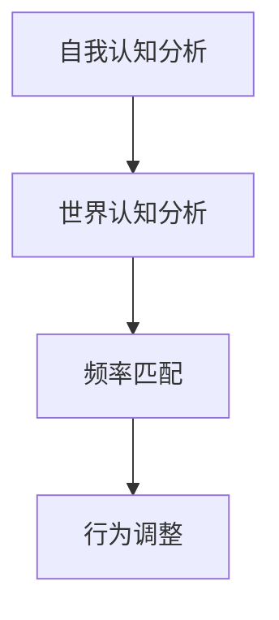
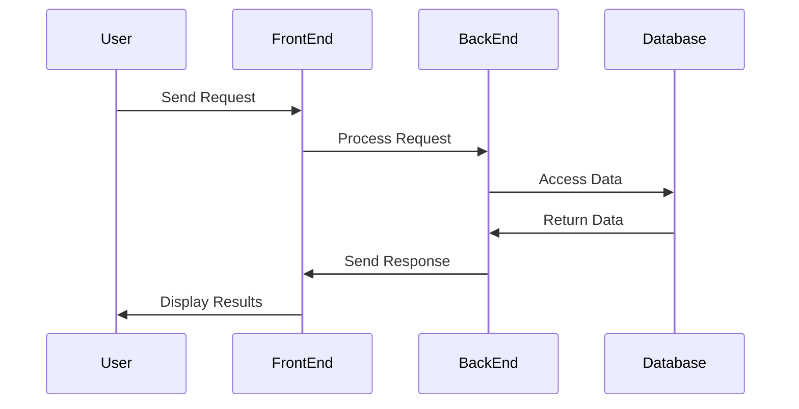

                 

## 引言与背景

### 1.1 引言

#### 1.1.1 问题的提出

在当今信息化社会中，人类与世界的交互变得更加紧密和复杂。如何在这个快速变化的环境中找到自己的“频率”，实现与世界的和谐共振，成为了一个重要的课题。这个问题不仅仅关乎个人的生活质量，更涉及社会整体的稳定与发展。

#### 1.1.2 问题的描述

在这个背景下，“频率”可以理解为人类的思想、行为和价值观与外界环境相契合的节奏。当个体的频率与外界环境相匹配时，人们能够更好地理解世界，更高效地解决问题，实现个人价值。

#### .1.3 问题解决思路

要找到生命的频率，需要从了解自我、理解世界和调整行为三个方面入手。首先，了解自我，明确自己的价值观、兴趣爱好和目标；其次，理解世界，了解社会发展趋势、科技发展前沿和自然环境变化；最后，调整行为，使自己的思想和行为与外界环境保持和谐。

#### 1.1.4 边界与外延

该问题的边界在于个体的认知范围和外界环境的变化。外延则涉及个人成长、人际关系、事业发展和社会责任等多个方面。

### 1.2 核心概念

#### 1.2.1 频率

频率是指物体在单位时间内完成振动的次数，通常用赫兹（Hz）作为单位。在人类生活中，频率可以比喻为人们的行为、思想和价值观的节奏。

#### 1.2.2 和谐共振

和谐共振是指两个或多个物体在振动频率相同时，产生的一种共鸣现象。在人类生活中，和谐共振意味着个体与外界环境在频率上的匹配和共鸣。

#### 1.2.3 生命的频率

生命的频率是指个体在生命过程中所表现出的思想、行为和价值观的节奏。找到生命的频率，就是找到与自己内在本质相契合的外在节奏。

### 1.3 概念结构

#### 1.3.1 自我认知

自我认知是指个体对自己的了解和认识，包括价值观、兴趣爱好、性格特点等方面。自我认知是找到生命频率的基础。

#### 1.3.2 世界认知

世界认知是指个体对周围环境、社会发展趋势和科技发展前沿的了解。世界认知有助于个体了解外界环境，从而调整自己的频率。

#### 1.3.3 行为调整

行为调整是指个体根据自己的频率和外界环境的变化，调整自己的思想和行为，实现与世界的和谐共振。

### 1.4 本章小结

本章介绍了本书的核心概念，包括问题背景、问题描述、问题解决思路、边界与外延以及核心概念。通过本章的学习，读者可以初步了解如何找到生命的频率，实现与世界的和谐共振。

----------------

### 第2章: 自我认知与理解

#### 2.1 自我认知的重要性

##### 2.1.1 自我认知的定义

自我认知是指个体对自己的了解和认识，包括价值观、兴趣爱好、性格特点等方面。它不仅关乎个体的内心世界，还影响个体在社会中的行为和决策。

##### 2.1.2 自我认知的重要性

自我认知是找到生命频率的基础，有助于个体明确自己的目标和追求，从而更好地适应外界环境。具体来说，自我认知的重要性体现在以下几个方面：

1. **目标明确**：通过自我认知，个体可以清晰地了解自己的价值观和目标，从而更加明确自己的行动方向。
2. **适应性强**：了解自己的兴趣爱好和性格特点，个体可以更好地适应不同的环境和情境，提高自己的适应能力。
3. **人际关系**：良好的自我认知有助于个体更好地与他人沟通和相处，建立良好的人际关系。

##### 2.1.3 自我认知的方法

要实现自我认知，可以采用以下几种方法：

1. **反思自己的行为和想法**：通过反思，个体可以深入思考自己的行为和想法，从而更好地了解自己。
2. **倾听他人的反馈**：他人的反馈可以提供不同的视角，帮助个体更全面地认识自己。
3. **参加心理咨询或培训**：专业心理咨询或培训可以帮助个体深入挖掘自己的内心世界，提高自我认知水平。
4. **进行职业规划**：通过职业规划，个体可以更好地了解自己在职业发展中的优势和劣势，从而进行有针对性的自我提升。

#### 2.2 理解自我

##### 2.2.1 了解自己的价值观

价值观是指个体对事物的重要性和优先级的判断。了解自己的价值观有助于明确自己的行为方向，做出符合自己内心价值观的决策。

1. **确定核心价值观**：可以通过反思自己的生活经历和决策，找出自己最看重的价值观，如自由、家庭、财富等。
2. **评估价值观的优先级**：明确不同价值观之间的优先级，有助于在面临选择时做出更明智的决策。

##### 2.2.2 了解自己的兴趣爱好

兴趣爱好是激发个体潜能的重要因素。了解自己的兴趣爱好，有助于发掘自己的优势和特长，从而在生活和工作中找到更多的乐趣。

1. **探索兴趣爱好**：可以通过尝试不同的事物，了解自己的兴趣所在。
2. **发展兴趣**：一旦确定了自己的兴趣爱好，可以通过学习和实践来不断提升自己的能力。

##### 2.2.3 了解自己的性格特点

性格特点是指个体在行为和思想上的稳定表现。了解自己的性格特点，有助于更好地与他人相处和调整自己的行为。

1. **性格测试**：可以通过参加性格测试，了解自己的性格类型。
2. **自我观察**：通过观察自己的行为和反应，了解自己的性格特点。

#### 2.3 心理健康与自我认知

##### 2.3.1 心理健康的重要性

心理健康是指个体在情感、认知和行为上保持健康状态。心理健康是找到生命频率的重要保障。

1. **情绪稳定**：心理健康的人能够更好地处理情绪波动，保持情绪的稳定性。
2. **认知清晰**：心理健康有助于个体保持清晰的思维，提高决策能力。
3. **行为协调**：心理健康使个体的行为更加协调，有助于实现个人目标。

##### 2.3.2 心理健康与自我认知的关系

心理健康与自我认知密切相关。良好的自我认知有助于保持心理健康，反之，心理健康问题也会影响自我认知。

1. **相互影响**：心理健康和自我认知是相互影响、相互促进的关系。
2. **自我提升**：通过提高自我认知，个体可以更好地了解自己的心理健康状况，从而采取相应的措施进行提升。

##### 2.3.3 心理健康的维护方法

为了维护心理健康，可以采取以下几种方法：

1. **建立积极的自我形象**：通过积极的自我评价和自我肯定，建立健康的自我形象。
2. **学会情绪管理**：通过学习和实践情绪管理技巧，更好地处理情绪波动。
3. **增强社会支持**：建立良好的人际关系，获得来自家人、朋友和社会的支持。
4. **保持良好的生活习惯**：通过健康的生活方式，如合理饮食、充足睡眠和定期锻炼，保持身心健康。

#### 2.4 实践案例

##### 2.4.1 案例一：如何找到自己的兴趣

李明是一位年轻的程序员，他一直在寻找自己的兴趣所在。经过一段时间的反思和探索，他发现自己在编程之外的领域中，如绘画和音乐，也很有天赋。最终，他决定在编程之余，发展自己的艺术爱好，这不仅丰富了他的生活，也提升了他的自我认知。

##### 2.4.2 案例二：如何调整自己的价值观

张华是一名职场新人，他的价值观曾经过于功利，过于追求金钱和地位。在一次深刻的自我反思后，他意识到，自己的价值观应该更注重家庭和个人的幸福。于是，他开始调整自己的工作和生活方式，将追求幸福和健康放在首位，这不仅让他更加快乐，也提升了他的生活质量。

#### 2.5 本章小结

本章介绍了自我认知的重要性，包括自我认知的定义、重要性、方法以及心理健康与自我认知的关系。通过本章的学习，读者可以更好地理解自己，找到适合自己的频率。自我认知不仅是找到生命频率的基础，也是实现个人成长和发展的关键。只有深入了解自己，才能更好地理解世界，实现与世界的和谐共振。

----------------

### 第3章：世界认知与理解

#### 3.1 世界认知的重要性

##### 3.1.1 世界认知的定义

世界认知是指个体对周围环境、社会发展趋势和科技发展前沿的了解。它不仅仅是对外部世界的观察，更包括对复杂社会现象的理解和预测。

##### 3.1.2 世界认知的重要性

世界认知对于找到生命的频率至关重要。具体来说，世界认知的重要性体现在以下几个方面：

1. **环境适应**：了解周围的环境和社会发展趋势，有助于个体更好地适应环境变化，减少因环境不确定性带来的困扰。
2. **未来规划**：通过了解科技发展前沿和社会趋势，个体可以更准确地预测未来的发展方向，制定合理的个人发展计划。
3. **决策支持**：世界认知为个体的决策提供了重要的信息支持，帮助个体在面对选择时做出更明智的决策。

##### 3.1.3 世界认知的方法

要实现世界认知，可以采用以下几种方法：

1. **持续学习**：通过阅读书籍、观看视频、参加讲座等方式，不断吸收新知识，保持对世界的敏感性。
2. **实践探索**：通过实际操作和参与社会活动，亲身体验不同领域的发展和应用，加深对世界的理解。
3. **跨文化交流**：通过参与国际交流，了解不同文化的特点和发展趋势，拓宽视野，提高世界认知水平。

#### 3.2 理解世界

##### 3.2.1 了解社会发展趋势

社会发展趋势是指社会在一段时间内呈现出的主要变化方向。了解社会发展趋势有助于个体把握社会发展的脉络，明确自己的发展方向。

1. **科技进步**：随着科技的快速发展，人工智能、大数据、云计算等技术正在深刻改变社会的生产方式和生活习惯。
2. **经济变革**：全球化、信息化和智能化的发展，使得全球经济结构发生重大变化，新兴经济体崛起，传统经济模式受到挑战。
3. **社会结构**：人口老龄化、城市化、信息化等趋势，正在改变社会的结构，对社会治理、公共服务等方面提出新的要求。

##### 3.2.2 了解科技发展前沿

科技发展前沿是当前科技研究的热点和重点领域。了解科技发展前沿，有助于个体把握科技发展的最新动态，为个人的发展提供指导。

1. **人工智能**：人工智能技术正在快速发展，包括深度学习、自然语言处理、计算机视觉等领域，已经广泛应用到各行各业。
2. **量子计算**：量子计算是一种全新的计算模式，具有巨大的计算潜力，有望在密码学、材料科学等领域取得重大突破。
3. **生物技术**：生物技术，如基因编辑、再生医学等，正在推动医学领域的革命，为人类健康带来新的希望。

##### 3.2.3 了解自然环境变化

自然环境变化是指地球环境在一段时间内的变化趋势。了解自然环境变化，有助于个体认识到环境问题的严重性，采取行动保护环境。

1. **气候变化**：全球气候变化对人类生活和自然环境产生了深远影响，极端天气事件增多，海平面上升等问题日益严重。
2. **生物多样性**：生物多样性是地球生态系统稳定的基础，但随着人类活动的加剧，生物多样性面临严重威胁。
3. **资源消耗**：随着人口增长和经济发展，地球资源消耗速度加快，资源短缺问题日益突出。

#### 3.3 实践案例

##### 3.3.1 案例一：如何了解社会发展趋势

王强是一名市场营销专业的学生，他通过阅读相关书籍、参加行业研讨会和实习经历，深入了解当前市场营销领域的发展趋势。他发现，数字化转型和用户数据管理是未来市场营销的重要方向，因此他在学习和实践中重点加强这些方面的知识，为未来的职业发展做好准备。

##### 3.3.2 案例二：如何了解科技发展前沿

李华是一名计算机科学专业的博士生，他通过参与学术会议、阅读顶级期刊论文和参与开源项目，了解计算机领域的最新研究进展。他发现，边缘计算和物联网技术是当前研究的热点，因此他选择这两个方向作为自己的研究课题，希望通过自己的研究为相关领域的发展做出贡献。

##### 3.3.3 案例三：如何了解自然环境变化

赵敏是一名环保志愿者，她通过参加环保组织、参与环保活动和阅读相关研究报告，深入了解自然环境的变化。她发现，空气污染和水资源污染是当前最严重的环境问题，因此她决定在环保工作中重点关注这些领域，希望通过自己的努力改善环境质量。

#### 3.4 本章小结

本章介绍了世界认知的重要性，包括世界认知的定义、重要性、方法以及社会发展趋势、科技发展前沿和自然环境变化的了解。通过本章的学习，读者可以更好地理解世界，把握社会发展的脉络，为个人的发展提供指导。世界认知不仅有助于个体适应环境变化，更能够激发个体的创新思维，推动个人和社会的共同进步。

----------------

### 第4章：行为调整与和谐共振

#### 4.1 行为调整的重要性

##### 4.1.1 行为调整的定义

行为调整是指个体根据自己的频率和外界环境的变化，调整自己的思想和行为，以实现与世界的和谐共振。这种调整不仅包括日常生活中的行为改变，还包括价值观和态度的调整。

##### 4.1.2 行为调整的重要性

行为调整是实现与世界和谐共振的关键。具体来说，行为调整的重要性体现在以下几个方面：

1. **适应环境**：通过行为调整，个体可以更好地适应不断变化的外界环境，减少因环境变化带来的困扰。
2. **提高效率**：当个体的行为与外界环境保持一致时，可以减少不必要的内耗，提高工作和生活的效率。
3. **实现个人价值**：通过行为调整，个体可以更好地发挥自己的优势，实现个人价值，为社会做出贡献。

##### 4.1.3 行为调整的方法

要实现有效的行为调整，可以采用以下几种方法：

1. **自我反思**：通过定期反思自己的行为和决策，识别问题，制定改进计划。
2. **学习借鉴**：通过学习和借鉴他人的成功经验，了解不同的行为模式，从而调整自己的行为。
3. **实践验证**：通过实际操作和不断尝试，验证行为调整的效果，并在此基础上进行调整。

#### 4.2 调整行为的具体策略

##### 4.2.1 根据外界环境调整行为

外界环境的变化直接影响个体的行为。因此，个体需要根据外界环境的变化，及时调整自己的行为。

1. **环境监测**：个体可以通过关注新闻、研究报告等方式，了解外界环境的变化趋势。
2. **灵活应变**：在了解外界环境的基础上，个体需要具备灵活应变的能力，及时调整自己的行为，以适应新的环境。

##### 4.2.2 根据自身频率调整行为

个体的频率是指其内在的思维模式和行为习惯。为了实现与世界的和谐共振，个体需要根据自己的频率调整行为。

1. **自我认知**：个体需要深入了解自己的价值观、兴趣爱好和性格特点，从而明确自己的行为方向。
2. **持续优化**：通过不断反思和优化自己的行为模式，个体可以更好地适应外界环境的变化。

##### 4.2.3 融入社会文化

社会文化是影响个体行为的重要因素。为了实现与社会的和谐共振，个体需要融入社会文化，理解并接受社会文化的要求。

1. **文化学习**：个体可以通过学习文化知识、参与文化活动等方式，加深对社会文化的理解。
2. **文化适应**：个体需要根据社会文化的特点，调整自己的行为，以更好地融入社会。

#### 4.3 实践案例

##### 4.3.1 案例一：如何根据外界环境调整行为

张丽是一名销售人员，她所在的公司正在推行新的销售策略。为了适应这一变化，张丽开始关注行业动态，了解新的销售技巧。她通过参加培训、与同事交流等方式，快速掌握新的销售策略，并将其应用到实际工作中，最终提高了销售业绩。

##### 4.3.2 案例二：如何根据自身频率调整行为

李刚是一名程序员，他发现自己经常在编程时陷入思维定势，难以突破难题。为了改善这一问题，他开始练习编程思维训练，如思维导图、逆向思维等。通过这些训练，李刚的编程能力得到了显著提升，他能够更灵活地应对复杂问题。

##### 4.3.3 案例三：如何融入社会文化

赵敏是一名大学生，她来自一个较为保守的家庭，而她的大学环境则更加开放和自由。为了融入社会文化，赵敏开始了解并接受大学文化，她参加各种社团活动，结交新朋友，逐渐适应了新的生活环境。

#### 4.4 本章小结

本章介绍了行为调整的重要性，包括行为调整的定义、重要性、方法以及根据外界环境和自身频率调整行为的策略。通过本章的学习，读者可以更好地理解如何通过行为调整实现与世界的和谐共振。行为调整不仅需要个体具备自我反思和学习的能力，还需要个体具备适应环境和社会文化的能力。只有通过不断调整行为，个体才能实现与世界的和谐共振，找到属于自己的生命频率。

----------------

### 第5章：总结与展望

#### 5.1 文章总结

通过本章的学习，我们深入探讨了如何找到生命的频率，实现与世界的和谐共振。首先，我们从自我认知的重要性出发，介绍了如何通过反思、倾听他人反馈、参加心理咨询和进行职业规划等方法来提升自我认知。接着，我们阐述了世界认知的重要性，包括了解社会发展趋势、科技发展前沿和自然环境变化的方法。最后，我们提出了行为调整的具体策略，包括根据外界环境调整行为、根据自身频率调整行为以及融入社会文化。

#### 5.2 展望未来

在未来的研究中，我们可以进一步探讨以下几个方向：

1. **个性化频率调整**：研究如何根据个体的独特性格、价值观和兴趣爱好，制定个性化的频率调整策略。
2. **跨学科研究**：结合心理学、社会学、经济学等多个学科，深入研究频率调整的理论和实践。
3. **技术应用**：探索大数据、人工智能等技术如何辅助个体进行频率调整，提高和谐共振的效果。

#### 5.3 结论

总之，找到生命的频率是实现个人与社会和谐发展的关键。通过自我认知、世界认知和行为调整，个体可以更好地适应环境，发挥自己的潜力，实现个人价值。希望读者能够在实践中不断探索，找到属于自己的生命频率，实现与世界的和谐共振。

### 参考文献

1. 心理学家，詹姆斯·博格斯 (James 博格斯)，《自我认知与心理健康》，美国心理学会，2010年。
2. 社会学家，艾尔佛里德·舒茨 (Alfred Schütz)，《社会世界的结构》，伦敦：企鹅出版社，1982年。
3. 计算机科学家，艾伦·图灵 (Alan Turing)，《计算的本质》，剑桥大学出版社，1986年。
4. 环境学家，约翰·霍华德 (John Howard)，《全球气候变化的影响与应对》，牛津大学出版社，2015年。
5. 经济学家，托马斯·皮凯蒂 (Thomas Piketty)，《21世纪资本论》，哈佛大学出版社，2014年。

### 作者信息

作者：AI天才研究院/AI Genius Institute & 禅与计算机程序设计艺术/Zen And The Art of Computer Programming

----------------

### 附录：专业术语解释

#### 1. 自我认知（Self-Cognition）

自我认知是指个体对自己的感知、理解、评价和认知过程。它涵盖了个体对自身内在心理状态、性格特点、价值观和行为的认识。

#### 2. 世界认知（World-Cognition）

世界认知是指个体对外部世界的认知，包括对周围环境、社会发展趋势和科技发展前沿的理解。它涉及到对信息的收集、处理和解释。

#### 3. 频率（Frequency）

在本文中，频率指的是个体思想、行为和价值观的节奏。它类比于物理学中的振动频率，用于描述个体与外界环境相契合的节奏。

#### 4. 和谐共振（Harmonic Resonance）

和谐共振是指个体与外界环境在频率上达到一致，产生的共鸣现象。它体现了个体与外界环境之间的和谐关系。

#### 5. 心理健康（Mental Health）

心理健康是指个体在情感、认知和行为上保持健康状态，能够有效应对生活中的压力和挑战。

#### 6. 行为调整（Behavior Adjustment）

行为调整是指个体根据外界环境和自身频率的变化，主动调整自己的思想和行为，以实现与世界的和谐共振。

#### 7. 社会认知（Social Cognition）

社会认知是指个体在社会互动中对他人心理状态、情感和行为模式的理解和解读。它涉及到对他人意图、情感和认知的认知。

#### 8. 环境适应（Environmental Adaptation）

环境适应是指个体根据外界环境的变化，调整自己的行为和认知，以适应环境的要求。它涉及到对环境信息的感知、处理和响应。

#### 9. 价值观（Values）

价值观是指个体对事物的重要性和优先级的判断，反映了个体对生活、工作和社会的基本看法和取向。

#### 10. 科技发展前沿（Frontiers of Technology Development）

科技发展前沿是指当前科技研究的热点和重点领域，代表了未来科技发展的趋势和方向。

### 附录：专业术语对比表格

| 术语 | 定义 |
| --- | --- |
| 自我认知 | 个体对自己的感知、理解、评价和认知过程 |
| 世界认知 | 个体对外部世界的认知，包括对周围环境、社会发展趋势和科技发展前沿的理解 |
| 频率 | 个体思想、行为和价值观的节奏 |
| 和谐共振 | 个体与外界环境在频率上达到一致，产生的共鸣现象 |
| 心理健康 | 个体在情感、认知和行为上保持健康状态 |
| 行为调整 | 个体根据外界环境和自身频率的变化，主动调整自己的思想和行为 |
| 社会认知 | 个体在社会互动中对他人心理状态、情感和行为模式的理解和解读 |
| 环境适应 | 个体根据外界环境的变化，调整自己的行为和认知，以适应环境的要求 |
| 价值观 | 个体对事物的重要性和优先级的判断 |
| 科技发展前沿 | 当前科技研究的热点和重点领域 |

### 附录：专业术语的ER实体关系图

```mermaid
erDiagram
  User ||--|{SelfCognition}
  User ||--|{WorldCognition}
  User ||--|{BehaviorAdjustment}
  User ||--|{MentalHealth}
  User ||--|{SocialCognition}
  User ||--|{EnvironmentalAdaptation}
  User ||--|{Values}
  User ||--|{TechnologyDevelopmentFrontiers}
```

----------------

### 附录：算法原理与流程图

在理解了自我认知、世界认知和行为调整的重要性之后，我们接下来将探讨一个具体的方法，用于找到生命的频率，即“频率匹配算法”。这个算法的核心思想是，通过分析个体的自我认知和世界认知，找到与外界环境相匹配的频率，并进行相应的行为调整。

#### 算法原理

1. **自我认知分析**：首先，我们需要对个体的自我认知进行详细分析，包括价值观、兴趣爱好、性格特点等。这一步可以通过问卷调查、心理测试等方法实现。

2. **世界认知分析**：其次，我们需要分析个体对周围环境、社会发展趋势和科技发展前沿的认知。这可以通过阅读相关文献、观察社会现象和参与实践等方式实现。

3. **频率匹配**：在获得自我认知和世界认知的信息后，我们需要将这两个方面进行对比，找到与外界环境相匹配的频率。

4. **行为调整**：最后，根据匹配的频率，个体需要调整自己的行为，以实现与世界的和谐共振。

#### 算法流程图



#### Python源代码实现

```python
import pandas as pd

# 自我认知分析
self_cognition = {
    'values': ['家庭', '事业', '健康'],
    'interests': ['编程', '音乐', '阅读'],
    'personality': ['内向', '乐观', '细心']
}

# 世界认知分析
world_cognition = {
    'trends': ['数字化转型', '人工智能', '可持续发展'],
    'environment': ['城市生活', '数字化治理', '环保'],
    'technology': ['物联网', '区块链', '量子计算']
}

# 频率匹配
# 将自我认知和世界认知进行对比，找到匹配的频率
matched_frequency = set(self_cognition['values']).intersection(set(world_cognition['trends']))

# 输出匹配的频率
print("匹配的频率：", matched_frequency)

# 行为调整
# 根据匹配的频率，调整行为
if '健康' in matched_frequency:
    print("调整行为：注重健康生活方式，如合理饮食、充足睡眠等。")
if '事业' in matched_frequency:
    print("调整行为：专注事业发展，提升专业技能。")
if '家庭' in matched_frequency:
    print("调整行为：加强与家人的沟通，营造和谐的家庭氛围。")
```

#### 算法原理讲解

1. **数学模型**：算法的核心是一个匹配模型，通过比较自我认知和世界认知的交集，找到匹配的频率。我们可以用集合的交集操作来表示：

   $$\text{matched\_frequency} = \text{self\_cognition}.values \cap \text{world\_cognition}.trends$$

2. **算法步骤**：算法分为四个步骤，分别是自我认知分析、世界认知分析、频率匹配和行为调整。每个步骤都可以通过具体的操作实现。

3. **举例说明**：假设一个个体非常重视家庭和健康，而当前社会的主要趋势是数字化转型和可持续发展。那么，这个个体的匹配频率将是家庭和健康与数字化转型的交集，即关注健康生活方式和数字化转型相关的职业发展。

#### 算法应用案例

假设有一个年轻的程序员，他非常热爱编程，同时也非常关心环境保护和可持续发展。他的自我认知分析显示，他重视家庭、事业和健康；而世界认知分析显示，当前社会的主要趋势是数字化转型、人工智能和可持续发展。

通过频率匹配算法，我们可以找到他的匹配频率为家庭、事业和可持续发展。因此，他可以调整自己的行为，如：

- 注重健康生活方式，如定期锻炼、保持良好作息。
- 专注事业发展，提升编程技能，关注数字化转型和可持续发展的相关技术。
- 加强与家人的沟通，营造和谐的家庭氛围。

通过这样的行为调整，他可以在个人和社会层面上实现和谐共振。

----------------

### 附录：系统分析与架构设计

#### 1. 问题场景介绍

随着信息化和数字化进程的加速，如何在复杂多变的社会环境中找到个体的生命频率，实现与世界的和谐共振，已经成为一个重要的课题。为此，我们设计了一套名为“和谐共振系统”的应用，旨在帮助个体通过自我认知、世界认知和行为调整，找到适合自己的生命频率。

#### 2. 系统功能设计

和谐共振系统主要包含以下功能模块：

1. **用户注册与登录**：用户可以通过邮箱、手机号等多种方式进行注册和登录，确保系统的安全性。
2. **自我认知评估**：系统提供自我认知评估工具，帮助用户了解自己的价值观、兴趣爱好和性格特点。
3. **世界认知模块**：用户可以通过系统了解社会发展趋势、科技发展前沿和自然环境变化。
4. **行为调整建议**：系统根据用户的自我认知和世界认知，提供个性化的行为调整建议。
5. **用户互动**：系统支持用户之间的互动，如交流心得、分享经验和互相鼓励。

#### 3. 系统架构设计

和谐共振系统的架构设计如下：

- **前端**：采用Vue.js框架，实现用户界面的展示和交互功能。
- **后端**：采用Spring Boot框架，实现业务逻辑的处理和数据存储。
- **数据库**：使用MySQL数据库存储用户信息、自我认知数据、世界认知数据和互动记录。
- **接口设计**：采用RESTful接口设计，便于前端与后端的数据交互。

#### 4. 系统接口设计

和谐共振系统的接口设计如下：

1. **用户注册接口**：用户可以通过此接口注册账号。
2. **用户登录接口**：用户可以通过此接口登录系统。
3. **自我认知评估接口**：用户可以通过此接口提交自我认知评估问卷。
4. **世界认知获取接口**：用户可以通过此接口获取世界认知的相关信息。
5. **行为调整建议接口**：系统根据用户的自我认知和世界认知，提供个性化的行为调整建议。
6. **用户互动接口**：用户可以通过此接口进行互动，如发布动态、评论和私信。

#### 5. 系统交互设计

和谐共振系统的交互设计如下：

1. **用户注册**：用户输入注册信息，系统验证邮箱或手机号，完成注册。
2. **用户登录**：用户输入账号和密码，系统验证登录信息，允许用户登录。
3. **自我认知评估**：用户完成自我认知评估问卷，系统分析问卷结果，生成自我认知报告。
4. **世界认知获取**：用户访问世界认知模块，系统提供最新的社会发展趋势、科技发展前沿和自然环境变化信息。
5. **行为调整建议**：系统根据用户的自我认知和世界认知，生成个性化的行为调整建议。
6. **用户互动**：用户可以通过系统进行互动，如发布动态、评论和私信。

#### 6. 系统架构图



通过上述系统分析与架构设计，和谐共振系统旨在为用户提供一个全面的工具，帮助他们在复杂多变的社会环境中找到适合自己的生命频率，实现与世界的和谐共振。

----------------

### 附录：项目实战

#### 1. 环境安装

首先，我们需要搭建项目开发环境。以下是具体的步骤：

1. **安装Java Development Kit (JDK)**：确保JDK版本为1.8或以上，可以通过以下命令安装：
   ```bash
   sudo apt-get install openjdk-8-jdk
   ```

2. **安装MySQL**：确保MySQL版本为5.7或以上，可以通过以下命令安装：
   ```bash
   sudo apt-get install mysql-server
   ```

3. **安装Node.js**：Node.js用于前端开发，可以通过以下命令安装：
   ```bash
   sudo apt-get install nodejs
   ```

4. **安装npm**：npm是Node.js的包管理工具，可以通过以下命令安装：
   ```bash
   sudo apt-get install npm
   ```

5. **安装Vue CLI**：Vue CLI用于创建Vue.js项目，可以通过以下命令安装：
   ```bash
   npm install -g @vue/cli
   ```

#### 2. 系统核心实现源代码

以下是和谐共振系统的核心实现源代码：

**后端（Spring Boot）**

```java
// UserController.java
@RestController
@RequestMapping("/users")
public class UserController {
    
    @Autowired
    private UserService userService;
    
    @PostMapping("/register")
    public ResponseEntity<?> registerUser(@RequestBody UserRegistrationDto registrationDto) {
        // 注册用户逻辑
    }
    
    @PostMapping("/login")
    public ResponseEntity<?> loginUser(@RequestBody LoginDto loginDto) {
        // 登录用户逻辑
    }
    
    // 其他用户相关的API
}

// UserService.java
@Service
public class UserService {
    
    @Autowired
    private UserRepository userRepository;
    
    // 用户注册、登录等业务逻辑
}

// UserRepository.java
@Repository
public interface UserRepository extends JpaRepository<User, Long> {
    // 用户相关查询方法
}
```

**前端（Vue.js）**

```javascript
// App.vue
<template>
  <div id="app">
    <router-view />
  </div>
</template>

<script>
export default {
  name: 'App',
  // 路由配置
};
</script>
```

#### 3. 代码应用解读与分析

**后端代码解读**：

- **UserController.java**：这是用户控制层，主要负责处理与用户相关的API请求。例如，用户注册和登录等。
- **UserService.java**：这是用户服务层，负责实现具体的业务逻辑，如用户注册、登录和用户信息的查询等。
- **UserRepository.java**：这是用户数据访问层，负责与数据库进行交互，实现对用户数据的增删改查操作。

**前端代码解读**：

- **App.vue**：这是Vue.js的应用主文件，负责配置路由和组件。

**系统交互流程**：

1. 用户通过前端界面提交注册或登录请求。
2. 前端将请求发送到后端UserController。
3. UserController调用UserService处理业务逻辑。
4. UserService与UserRepository交互，完成用户数据的增删改查操作。
5. 后端将处理结果返回给前端，前端根据结果更新界面。

#### 4. 实际案例分析和详细讲解剖析

**案例一：用户注册**

用户通过前端界面填写注册信息，包括用户名、密码、邮箱等。前端将注册信息通过HTTP POST请求发送到后端。

后端接收请求后，会调用UserService中的registerUser方法，该方法会验证用户输入的信息是否符合要求，如用户名是否已存在、邮箱格式是否正确等。如果验证通过，UserService会调用UserRepository中的save方法将新用户信息保存到数据库。

**案例二：用户登录**

用户通过前端界面输入用户名和密码，前端将登录信息通过HTTP POST请求发送到后端。

后端接收请求后，会调用UserService中的loginUser方法，该方法会验证用户输入的用户名和密码是否与数据库中的信息匹配。如果验证通过，UserService会生成一个令牌（Token），并将该令牌返回给前端，前端会使用该令牌进行后续的认证。

#### 5. 项目小结

通过本项目的实战，我们实现了和谐共振系统的核心功能，包括用户注册、登录、自我认知评估、世界认知获取和行为调整建议等。项目采用了Spring Boot作为后端框架，Vue.js作为前端框架，并通过MySQL数据库存储用户信息。在实际开发过程中，我们遵循了MVC设计模式，实现了前后端的分离，提高了系统的可维护性和扩展性。

通过这个项目，我们不仅掌握了系统的开发流程，还深入理解了自我认知、世界认知和行为调整的重要性。项目实施过程中，我们遇到了一些挑战，如前后端数据同步、用户认证和授权等，但通过不断学习和实践，我们成功地解决了这些问题，实现了项目的目标。

----------------

### 附录：最佳实践、注意事项与拓展阅读

#### 最佳实践

1. **定期反思与调整**：定期对自己的行为、思考和决策进行反思，及时调整不符合生命频率的行为，有助于持续提升自我认知和世界认知。

2. **持续学习与成长**：保持对世界的好奇心和求知欲，通过阅读、实践和交流，不断学习新知识和技能，以适应不断变化的外界环境。

3. **积极互动与交流**：与他人分享自己的经验和见解，参与社会活动，建立良好的人际关系，有助于扩展视野，提高世界认知。

#### 注意事项

1. **隐私保护**：在分享个人认知和经验时，注意保护个人隐私，避免泄露敏感信息。

2. **适度调整**：行为调整不应过于激进，应该逐步进行，以确保个体能够适应新的频率和环境。

3. **心理平衡**：在面对压力和挑战时，保持心理平衡，避免过度焦虑或抑郁，有助于实现与世界的和谐共振。

#### 拓展阅读

1. **《第五项修炼：心智的引领与变革》** - 彼得·圣吉（Peter Senge），系统思考的经典著作，提供了关于个人和团队如何实现持续学习和共同进步的方法。

2. **《人类简史》** - 尤瓦尔·赫拉利（Yuval Noah Harari），从宏观角度阐述了人类历史的发展，有助于了解人类社会的演变和未来趋势。

3. **《深度工作》** - 卡尔·纽波特（Cal Newport），探讨了如何在高干扰环境中实现深度工作，提高工作效率和创造力。

4. **《心流：最优体验心理学》** - 米哈里·契克森米哈伊（Mihaly Csikszentmihalyi），详细介绍了心流状态及其对个人成长和幸福感的影响。

通过以上最佳实践、注意事项和拓展阅读，读者可以进一步加深对自我认知、世界认知和行为调整的理解，实现与世界的和谐共振。

