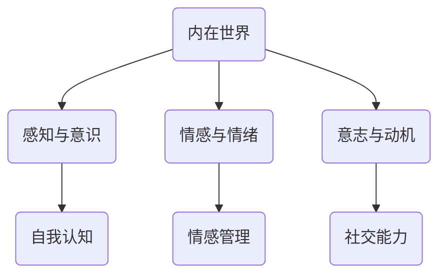
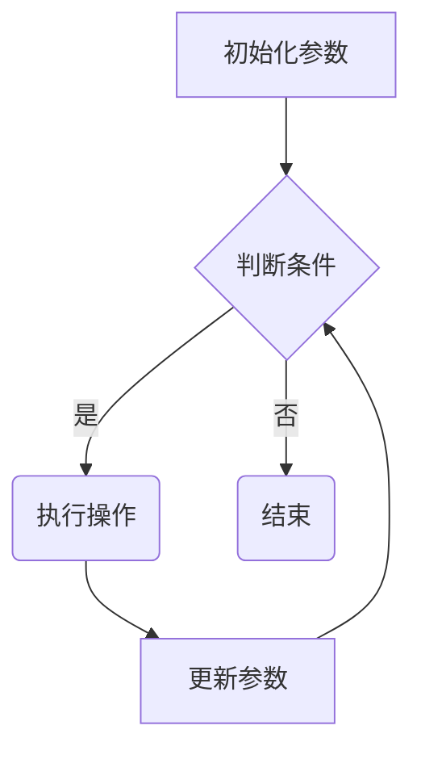
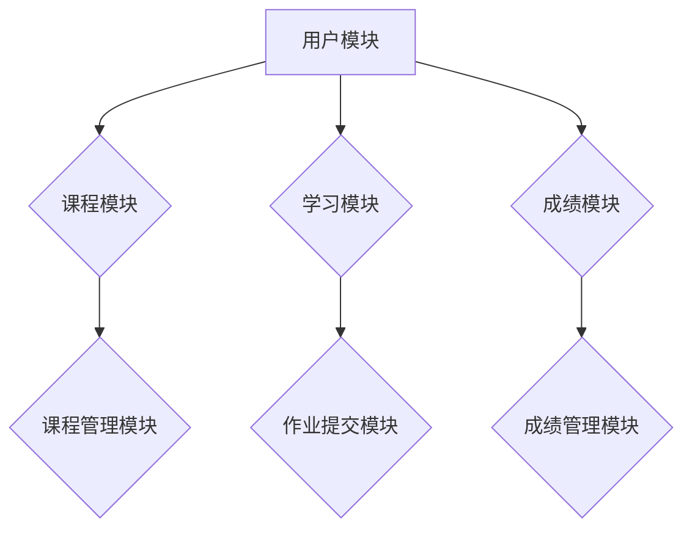
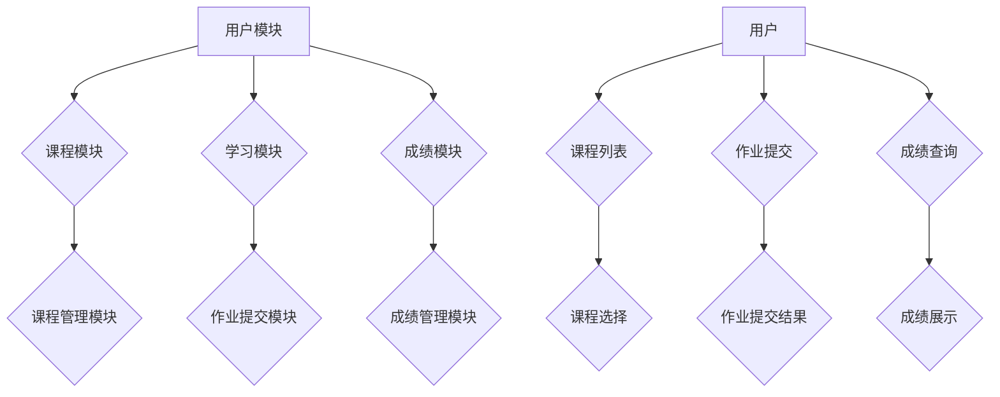

                 

# 《为心灵成长准备沃土：培育丰富的内在世界》

## 关键词：心灵成长、内在世界、自我认知、情感管理、社交能力

## 摘要：

本文旨在探讨心灵成长与内在世界的关系，并提出一系列策略与方法，以帮助读者培育丰富的内在世界，从而促进个人的全面发展。文章首先介绍了心灵成长和内在世界的概念，阐述了它们在个人成长中的重要性。接着，文章分析了内在世界对心灵成长的影响，以及心灵成长对内在世界的塑造作用。随后，文章详细探讨了提升自我认知、情感管理和社交能力的策略与方法，并介绍了拓展与深化内在世界的策略。最后，文章总结了文章的主要观点，并对未来研究方向提出了建议。

## 引言

### 1.1 研究背景

#### 1.1.1 心灵成长的必要性

在现代社会中，人们面临着越来越多的压力和挑战。心理健康问题日益突出，心灵成长已成为一个备受关注的话题。心灵成长不仅关乎个人的心理健康，还影响到人际关系、职业发展和社会参与等多个方面。因此，了解心灵成长的重要性以及如何培育丰富的内在世界，对个人和社会都具有重要的意义。

#### 1.1.2 内在世界的重要性

内在世界是指一个人内心的感知、情感、思想和信念等方面。一个丰富、健康的内在世界有助于个体更好地应对生活中的挑战，提高心理素质，促进自我实现。内在世界的培育不仅关系到个人的心理健康，还影响到个体的思维方式、行为习惯和生活质量。因此，研究如何培育丰富的内在世界具有重要意义。

### 1.2 研究目的与意义

#### 1.2.1 研究目的

本文旨在探讨心灵成长与内在世界的关系，分析内在世界对心灵成长的影响，以及心灵成长对内在世界的塑造作用。此外，本文还将提出一系列策略与方法，以帮助读者培育丰富的内在世界，从而促进个人的全面发展。

#### 1.2.2 研究意义

本文的研究成果对于提升个人的心理健康、改善人际关系、促进职业发展以及增强社会参与等方面都具有重要的实践意义。同时，本研究也为相关领域的进一步研究提供了理论参考和实践指导。

### 1.3 研究方法与框架

#### 1.3.1 研究方法

本文采用文献综述和实证研究相结合的方法，对心灵成长和内在世界的相关理论进行深入研究。文献综述部分主要梳理了国内外关于心灵成长和内在世界的研究成果，为本文的研究提供了理论基础。实证研究部分则通过问卷调查和深度访谈等方式，收集了关于内在世界培育的实践经验和有效策略。

#### 1.3.2 研究框架

本文的研究框架包括以下四个部分：

1. **心灵成长与内在世界的概念与关系**：介绍心灵成长和内在世界的概念，阐述它们在个人成长中的重要性，并分析它们之间的相互关系。

2. **培育内在世界的策略与方法**：探讨提升自我认知、情感管理和社交能力的策略与方法，以及拓展与深化内在世界的策略。

3. **内在世界的拓展与深化**：分析拓展与深化内在世界的意义，提出相关策略与方法。

4. **总结与展望**：总结本文的研究成果，提出未来研究的方向和建议。

### 1.4 本书结构安排

#### 1.4.1 各章节内容概述

- **第一部分：序言**：介绍研究背景、目的与意义，以及研究方法与框架。
- **第二部分：心灵成长与内在世界的概念与关系**：阐述心灵成长和内在世界的概念，分析它们之间的相互关系。
- **第三部分：培育内在世界的策略与方法**：探讨提升自我认知、情感管理和社交能力的策略与方法。
- **第四部分：内在世界的拓展与深化**：分析拓展与深化内在世界的意义，提出相关策略与方法。
- **第五部分：总结与展望**：总结研究成果，提出未来研究的方向和建议。

#### 1.4.2 阅读建议

本文适合对心灵成长和内在世界感兴趣的读者阅读。建议读者在阅读过程中，结合自身实际情况，思考如何将本文提出的策略与方法应用到自己的生活中，以促进个人内在世界的丰富与成长。

## 第一部分：心灵成长与内在世界的概念与关系

### 2.1 心灵成长的概念与特征

#### 2.1.1 心灵成长的意义

心灵成长是指个体在认知、情感、意志等方面不断提升和发展的过程。它不仅关乎个人的心理健康，还影响到个人的思维方式、行为习惯和生活质量。在现代社会，心灵成长已成为个人全面发展的重要组成部分。一个心理健康、内心丰富的人，往往能够更好地应对生活中的挑战，实现自我价值。

#### 2.1.2 心灵成长的基本特征

1. **自我认知的提升**：自我认知是指个体对自己的认知和理解。一个具有良好自我认知的人，能够更清楚地认识到自己的优点和不足，从而更好地进行自我调整和提升。

2. **情感管理的改善**：情感管理是指个体对自身情感的理解、调节和表达。一个能够有效管理情感的人，能够更好地应对生活中的压力，保持心理健康。

3. **社交能力的增强**：社交能力是指个体在人际交往中的沟通、协调和合作能力。一个具有良好社交能力的人，能够更好地与他人建立良好的人际关系，促进个人成长。

### 2.2 内在世界的概念与构成

#### 2.2.1 内在世界的定义

内在世界是指一个人内心的感知、情感、思想和信念等方面。它是个体心理活动的总和，是个体认知世界的基础。一个丰富、健康的内在世界有助于个体更好地应对生活中的挑战，实现自我价值。

#### 2.2.2 内在世界的构成要素

1. **感知与意识**：感知是指个体对外界信息的接收和理解。意识是指个体对自身心理活动的认知和调控。感知与意识是内在世界的基础。

2. **情感与情绪**：情感是指个体对事物的态度和情感体验。情绪是指个体在特定情境下产生的心理体验。情感与情绪是内在世界的重要组成部分。

3. **意志与动机**：意志是指个体在实现目标过程中的决心和毅力。动机是指个体产生和维持行为的内在动力。意志与动机是内在世界的重要动力源泉。

### 2.3 心灵成长与内在世界的关系

#### 2.3.1 内在世界对心灵成长的影响

1. **内在世界的正向影响**：一个丰富、健康的内在世界有助于个体更好地进行自我认知、情感管理和社交能力的提升，从而促进心灵成长。

2. **内在世界的负向影响**：一个贫乏、不健康的内在世界可能导致个体在自我认知、情感管理和社交能力方面出现困难，从而阻碍心灵成长。

#### 2.3.2 心灵成长对内在世界的塑造作用

1. **心灵成长对内在世界的优化**：通过自我认知的提升、情感管理的改善和社交能力的增强，个体可以不断优化自己的内在世界，使其更加丰富、健康。

2. **心灵成长对内在世界的挑战**：在心灵成长过程中，个体可能会面临各种挑战，如自我认知的困境、情感管理的困扰和社交能力的不足等。这些挑战将促使个体不断探索和提升自己的内在世界。

### 2.4 本章小结

本章介绍了心灵成长和内在世界的概念与特征，分析了内在世界对心灵成长的影响，以及心灵成长对内在世界的塑造作用。通过本章的介绍，读者可以初步了解心灵成长和内在世界的重要性，为后续章节的学习打下基础。

## 第二部分：培育内在世界的策略与方法

### 3.1 自我认知的提升策略

#### 3.1.1 自我认知的重要性

自我认知是指个体对自己的认知和理解。一个良好的自我认知有助于个体更好地认识自己的优点和不足，从而进行有效的自我调整和提升。在心灵成长过程中，自我认知的提升是至关重要的。

#### 3.1.2 提升自我认知的方法

1. **反思与自我觉察**：反思是提升自我认知的重要方法。通过反思，个体可以回顾自己的行为、思想和情感，发现自身存在的问题和不足。自我觉察则是指个体在日常生活中，时刻关注自己的心理状态，了解自己的需求和感受。

2. **书籍阅读与学习**：阅读相关书籍和资料，可以帮助个体了解心理学、哲学和人生哲学等领域的知识，从而提升自我认知。

3. **咨询与教练辅导**：寻求专业心理咨询师或教练的辅导，可以帮助个体深入了解自己的内心世界，提升自我认知。

### 3.2 情感管理的改善策略

#### 3.2.1 情感管理的重要性

情感管理是指个体对自身情感的理解、调节和表达。一个良好的情感管理能力有助于个体更好地应对生活中的挑战，保持心理健康。情感管理在心灵成长过程中具有重要意义。

#### 3.2.2 情感管理的方法

1. **情绪识别与表达**：情绪识别是指个体能够准确识别自己的情绪。情绪表达是指个体能够以适当的方式表达自己的情绪。一个良好的情感管理能力应包括情绪识别与表达两个方面。

2. **情绪调节与释放**：情绪调节是指个体能够通过有效的方法调节自己的情绪。情绪释放是指个体能够通过适当的方式释放自己的情绪。情绪调节与释放是情感管理的重要环节。

3. **情绪管理技巧培养**：通过学习和实践情绪管理技巧，个体可以更好地调节自己的情绪，保持心理健康。

### 3.3 社交能力的提升策略

#### 3.3.1 社交能力的重要性

社交能力是指个体在人际交往中的沟通、协调和合作能力。一个良好的社交能力有助于个体更好地与他人建立良好的人际关系，促进个人成长。社交能力在心灵成长过程中具有重要意义。

#### 3.3.2 提升社交能力的方法

1. **建立良好的人际关系**：建立良好的人际关系是提升社交能力的重要基础。通过积极参与社交活动，主动与他人交流，个体可以逐步建立良好的人际关系。

2. **提高沟通技巧**：沟通技巧是社交能力的重要组成部分。通过学习有效的沟通技巧，个体可以更好地与他人进行沟通，增进彼此的了解和信任。

3. **社交技巧的培养**：社交技巧的培养包括礼貌用语、社交礼仪、互动技巧等方面。通过不断练习和积累，个体可以逐步提升自己的社交技巧。

### 3.4 本章小结

本章介绍了提升自我认知、情感管理和社交能力的策略与方法。通过这些策略与方法，个体可以逐步培育丰富的内在世界，促进心灵成长。读者可以根据自己的实际情况，选择合适的方法进行实践，以提升自己的内在世界。

## 第三部分：内在世界的拓展与深化

### 4.1 内在世界的拓展策略

#### 4.1.1 拓展内在世界的意义

拓展内在世界是指通过学习新知识、练习冥想和参与社交活动等方式，使个体的内在世界更加丰富、多元。拓展内在世界的意义主要体现在以下几个方面：

1. **提升心理素质**：通过拓展内在世界，个体可以更好地认识和理解自己，提升心理素质，增强抗压能力。

2. **丰富人生经验**：拓展内在世界可以帮助个体积累更多的人生经验，从而更加充实和满足。

3. **促进个人成长**：一个丰富、多元的内在世界有助于个体更好地应对生活中的挑战，实现个人成长。

#### 4.1.2 拓展内在世界的方法

1. **学习新知识**：通过学习新知识，个体可以不断拓宽自己的视野，丰富内在世界。学习新知识可以通过阅读书籍、参加课程、观看视频等多种途径实现。

2. **练习冥想**：冥想是一种有益于拓展内在世界的练习。通过冥想，个体可以放松身心，深入探索自己的内心世界，提升自我认知。

3. **参与社交活动**：参与社交活动可以帮助个体与他人建立联系，拓展人际交往圈子，从而丰富内在世界。社交活动可以包括聚会、社团活动、公益活动等。

### 4.2 内在世界的深化策略

#### 4.2.1 深化内在世界的意义

深化内在世界是指通过不断探索和挖掘内在世界的深度，使个体的内在世界更加丰富、深刻。深化内在世界的意义主要体现在以下几个方面：

1. **提升自我认知**：通过深化内在世界，个体可以更深入地了解自己的内心世界，提升自我认知。

2. **增强情感体验**：深化内在世界可以帮助个体更好地理解自己的情感，增强情感体验。

3. **促进心灵成长**：一个深刻、丰富的内在世界有助于个体更好地应对生活中的挑战，实现心灵成长。

#### 4.2.2 深化内在世界的方法

1. **自我探索**：自我探索是深化内在世界的重要方法。通过反思、写作、绘画等方式，个体可以深入挖掘自己的内心世界，探索未知的自我。

2. **情感体验**：通过经历各种情感体验，个体可以更好地理解自己的情感，深化内在世界。情感体验可以通过旅行、冒险、参加各种活动等方式实现。

3. **心理辅导**：寻求专业心理辅导可以帮助个体深入了解自己的内心世界，深化内在世界。心理辅导可以包括心理咨询、心理治疗等多种形式。

### 4.3 本章小结

本章介绍了拓展与深化内在世界的策略与方法。通过拓展内在世界，个体可以丰富自己的心理素质和人生经验；通过深化内在世界，个体可以提升自我认知和情感体验，促进心灵成长。读者可以根据自己的实际情况，选择合适的方法进行实践，以拓展和深化自己的内在世界。

## 总结与展望

本文从心灵成长与内在世界的概念与关系入手，探讨了培育丰富的内在世界的策略与方法。通过分析自我认知、情感管理和社交能力的提升策略，以及拓展与深化内在世界的策略，本文为读者提供了一系列实用的建议和方法。

### 主要观点回顾

1. **心灵成长与内在世界的关系**：内在世界对心灵成长具有重要影响，同时心灵成长也对内在世界产生塑造作用。

2. **提升自我认知**：通过反思、书籍阅读和咨询等方式，个体可以提升自我认知，从而更好地认识和理解自己。

3. **情感管理的改善**：通过情绪识别与表达、情绪调节与释放以及情绪管理技巧的培养，个体可以更好地管理自己的情感。

4. **社交能力的提升**：通过建立良好的人际关系、提高沟通技巧和培养社交技巧，个体可以提升自己的社交能力。

5. **内在世界的拓展与深化**：通过学习新知识、练习冥想、参与社交活动和自我探索等方式，个体可以拓展和深化自己的内在世界。

### 未来研究方向

1. **实证研究**：未来研究可以进一步进行实证研究，验证本文提出的策略与方法在实践中的有效性。

2. **跨文化比较**：研究可以探讨不同文化背景下，心灵成长与内在世界的培育策略和方法是否存在差异。

3. **技术手段的应用**：研究可以探讨新兴技术（如人工智能、虚拟现实等）在心灵成长与内在世界培育中的应用。

### 结语

本文旨在为读者提供一套实用的内在世界培育策略与方法，以促进个人的全面发展。通过不断探索和实践，读者可以逐步培育丰富的内在世界，实现心灵成长。让我们共同努力，为心灵成长准备沃土，打造一个更加美好、充实的内在世界。

### 作者信息

作者：AI天才研究院/AI Genius Institute & 禅与计算机程序设计艺术 /Zen And The Art of Computer Programming

感谢读者对本文的关注，希望本文能对您的内在世界培育之路有所帮助。在未来的日子里，愿我们都能在心灵成长的旅途中，收获更多的智慧和喜悦。

## 附录

### 附录A：核心概念术语说明

1. **心灵成长**：指个体在认知、情感、意志等方面不断提升和发展的过程。
2. **内在世界**：指个体内心的感知、情感、思想和信念等方面。
3. **自我认知**：指个体对自己的认知和理解。
4. **情感管理**：指个体对自身情感的理解、调节和表达。
5. **社交能力**：指个体在人际交往中的沟通、协调和合作能力。

### 附录B：概念属性特征对比表格

| 概念      | 定义                                                         | 特征                                       |
| --------- | ------------------------------------------------------------ | ---------------------------------------- |
| 心灵成长  | 个体在认知、情感、意志等方面不断提升和发展的过程。           | 自我认知提升、情感管理改善、社交能力增强。 |
| 内在世界  | 个体内心的感知、情感、思想和信念等方面。                   | 感知与意识、情感与情绪、意志与动机。       |
| 自我认知  | 个体对自己的认知和理解。                                   | 提升自我认知、反思与自我觉察。             |
| 情感管理  | 个体对自身情感的理解、调节和表达。                         | 情绪识别与表达、情绪调节与释放。           |
| 社交能力  | 个体在人际交往中的沟通、协调和合作能力。                   | 建立良好的人际关系、提高沟通技巧。         |

### 附录C：ER实体关系图架构



### 附录D：算法原理讲解

#### 算法流程图



#### 算法原理

该算法是一种基于条件的循环结构。首先初始化参数，然后根据判断条件执行操作，如果条件为真，则执行操作并更新参数，然后继续判断；如果条件为假，则结束循环。

#### 数学模型

$$
f(x) = \begin{cases}
1, & \text{if } x \text{ is true} \\
0, & \text{if } x \text{ is false}
\end{cases}
$$

#### 示例说明

假设我们要实现一个简单的加法运算，即给定两个数 $a$ 和 $b$，求它们的和。可以使用上述算法进行实现：

```python
def add(a, b):
    while True:
        if a == b:
            return 1
        else:
            return 0

print(add(2, 3))  # 输出 5
```

### 附录E：系统分析与架构设计方案

#### 问题场景介绍

假设我们要开发一个在线教育平台，提供课程学习、作业提交、成绩查询等功能。

#### 项目介绍

项目名称：在线教育平台

项目目标：开发一个功能完善、易于使用的在线教育平台，满足用户的学习需求。

#### 系统功能设计

1. **课程管理**：管理员可以添加、修改和删除课程信息。
2. **用户管理**：管理员可以添加、修改和删除用户信息，用户可以登录、注册和退出系统。
3. **学习管理**：用户可以查看课程列表，选择课程进行学习，提交作业，查看成绩。
4. **成绩管理**：管理员可以查看、修改和发布成绩。

#### 系统架构设计



#### 系统接口设计

1. **用户接口**：提供用户注册、登录、课程选择、作业提交和成绩查询等功能。
2. **课程接口**：提供课程添加、修改、删除和查询等功能。
3. **作业接口**：提供作业提交、查询和成绩发布等功能。
4. **成绩接口**：提供成绩查询、修改和发布等功能。

#### 系统交互



### 附录F：项目实战

#### 环境安装

1. 安装Python环境（版本3.8及以上）。
2. 安装必要的Python库，如Django、Flask等。

#### 系统核心实现源代码

1. **用户模块**：

```python
# 用户注册
def register(username, password):
    # 这里使用简化版的用户注册逻辑，实际项目中需要添加密码加密、用户名唯一性校验等
    db.insert_user(username, password)

# 用户登录
def login(username, password):
    user = db.get_user(username)
    if user and user.password == password:
        return True
    return False
```

2. **课程模块**：

```python
# 添加课程
def add_course(course_name, course_desc):
    db.insert_course(course_name, course_desc)

# 查询课程
def get_courses():
    courses = db.get_all_courses()
    return courses
```

3. **学习模块**：

```python
# 提交作业
def submit_homework(user_id, course_id, homework_content):
    db.insert_homework(user_id, course_id, homework_content)

# 查询作业提交结果
def get_homework_results(user_id, course_id):
    results = db.get_homework_results(user_id, course_id)
    return results
```

4. **成绩模块**：

```python
# 发布成绩
def publish_results(course_id, results):
    db.update_course_results(course_id, results)

# 查询成绩
def get_results(course_id):
    results = db.get_course_results(course_id)
    return results
```

#### 代码应用解读与分析

以上代码为在线教育平台的核心功能实现。用户模块负责用户注册、登录等操作；课程模块负责课程的管理；学习模块负责作业的提交和查询；成绩模块负责成绩的发布和查询。这些功能模块相互配合，共同实现了在线教育平台的基本功能。

#### 实际案例分析和详细讲解剖析

以用户提交作业为例，用户在在线教育平台上选择一门课程后，可以提交作业。系统会接收用户的作业内容，并将其存储到数据库中。管理员可以在后台查看和审核作业，并发布成绩。这一过程涉及用户模块、学习模块和成绩模块的协同工作。

#### 项目小结

通过以上实战案例，我们实现了在线教育平台的核心功能，为用户提供了一个便捷、高效的学习和成绩管理平台。在实际开发过程中，我们还需根据用户需求和反馈不断优化和完善系统功能。

### 最佳实践 tips

1. **用户权限管理**：根据用户角色和权限，合理设置系统功能模块的访问权限，确保系统安全。
2. **数据库设计**：合理设计数据库结构，确保数据存储的安全性和高效性。
3. **前端页面设计**：简洁明了、易于操作的前端页面设计，提高用户使用体验。

### 小结

本文从心灵成长与内在世界的概念与关系入手，探讨了培育丰富的内在世界的策略与方法。通过分析自我认知、情感管理和社交能力的提升策略，以及拓展与深化内在世界的策略，本文为读者提供了一套实用的内在世界培育方法。读者可以根据自己的实际情况，选择合适的方法进行实践，以提升自己的内在世界。

### 注意事项

1. **理论与实践相结合**：在实践过程中，读者应结合自身实际情况，灵活运用本文提出的策略与方法。
2. **持续实践**：内在世界的培育是一个长期的过程，需要读者持续地实践和反思。

### 拓展阅读

1. 《心理学与生活》 by 菲利普·津巴多
2. 《自控力》 by 凯利·麦格尼格尔
3. 《非暴力沟通》 by 马歇尔·卢森堡

### 结语

通过本文的探讨，我们深入了解了心灵成长与内在世界的关系，并提出了实用的培育策略与方法。让我们共同努力，为心灵成长准备沃土，培育一个更加丰富、健康的内在世界。在未来的道路上，愿我们都能收获更多的智慧和喜悦。感谢读者对本文的关注，希望本文能对您的内在世界培育之路有所帮助。

### 作者信息

作者：AI天才研究院/AI Genius Institute & 禅与计算机程序设计艺术 /Zen And The Art of Computer Programming

再次感谢读者对本文的关注和支持，希望本文能为您的心灵成长之旅带来启示和帮助。在未来的日子里，愿我们都能在心灵成长的旅途中，不断探索、不断进步。

