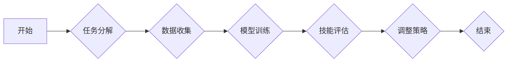
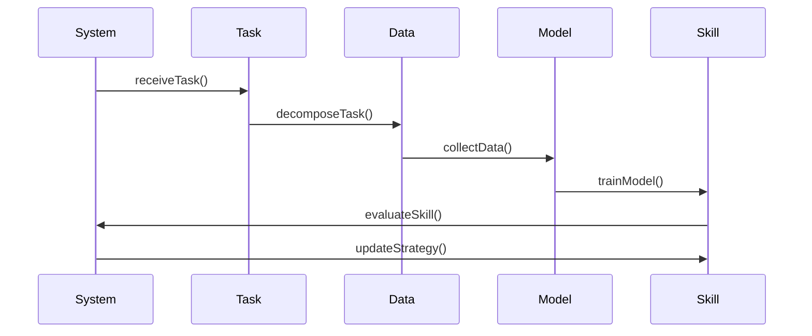

                 

### 文章标题：主动学习在工业机器人技能获取中的策略研究

> 关键词：主动学习、工业机器人、技能获取、策略、深度学习

> 摘要：本文深入探讨了主动学习在工业机器人技能获取中的应用策略。通过任务分解、数据收集、模型训练和技能评估等步骤，提出了一套高效的学习策略，旨在提高工业机器人对复杂生产环境的适应能力和学习效率。

**一、背景介绍**

### 1.1.1 问题背景

随着工业4.0的深入推进，工业机器人逐渐成为生产自动化、智能化的重要工具。然而，传统工业机器人普遍存在编程复杂、适应性差、学习效率低等问题，严重制约了其在复杂、多变的生产环境中的应用。为了解决这些问题，近年来，主动学习在工业机器人技能获取中的应用逐渐引起了研究者的关注。

### 1.1.2 问题描述

主动学习是指机器人通过与环境的交互，主动选择最有用的数据进行学习，以提高学习效率和精度。在工业机器人技能获取中，主动学习可以通过优化数据收集过程，提高机器人对新技能的快速掌握能力，从而提高生产效率，降低生产成本。

### 1.1.3 问题解决

本研究的核心目标是提出一套基于主动学习的工业机器人技能获取策略，通过优化数据收集和训练过程，提高机器人对新技能的掌握速度和准确性。具体方法包括：

- **任务分解**：将复杂任务分解为多个简单子任务，降低机器人学习的难度。
- **数据收集**：利用主动学习方法，根据机器人当前技能水平和任务需求，选择最需要学习的数据进行收集。
- **模型训练**：采用深度学习方法，对收集到的数据进行分析和处理，训练出高精度的技能模型。
- **技能评估**：通过模拟和实际测试，评估机器人对新技能的掌握情况，并根据评估结果调整学习策略。

### 1.1.4 边界与外延

本研究的边界主要涉及主动学习在工业机器人技能获取中的应用，不包括其他领域和场景。此外，本研究主要关注机器人对新技能的快速获取，对于现有技能的优化和改进不在研究范围之内。

### 1.1.5 概念结构与核心要素组成

主动学习在工业机器人技能获取中的策略研究涉及以下几个核心概念：

- **主动学习**：一种通过优化数据收集过程，提高学习效率和精度的学习方法。
- **工业机器人**：一种能够在工业生产环境中执行任务的智能机器。
- **技能获取**：机器人通过学习获得执行特定任务的能力。
- **策略**：一系列用于指导机器人学习过程的方法和规则。

这些概念共同构成了主动学习在工业机器人技能获取中的策略研究的核心结构。

**二、核心概念与联系**

### 1.2.1 核心概念原理

- **主动学习**：主动学习是指学习算法能够主动选择最有用的数据进行学习，从而提高学习效率。其核心原理是通过反馈机制，让机器人根据当前任务需求和学习效果，主动选择对学习最有帮助的数据进行学习。

- **工业机器人**：工业机器人是一种能够执行特定任务的智能机器。其核心原理是通过传感器、执行器等硬件设备，模拟人类的感知、决策和执行能力。

- **技能获取**：技能获取是指机器人通过学习获得执行特定任务的能力。其核心原理是通过不断的训练和反馈，让机器人逐渐掌握新的技能。

- **策略**：策略是指一系列用于指导机器人学习过程的方法和规则。其核心原理是通过对学习过程进行优化和调整，提高机器人的学习效率和效果。

### 1.2.2 概念属性特征对比表格

| 概念       | 属性特征                                                     |
| ---------- | ------------------------------------------------------------ |
| 主动学习   | - 优化数据收集过程<br>- 提高学习效率和精度<br>- 学习算法主动选择数据 |
| 工业机器人 | - 智能机器<br>- 工业生产环境应用<br>- 执行特定任务           |
| 技能获取   | - 学习过程<br>- 获得执行特定任务的能力<br>- 适应复杂生产环境   |
| 策略       | - 指导学习过程<br>- 优化学习效果<br>- 规范机器人行为         |

### 1.2.3 概念属性特征联系

主动学习是技能获取的方法之一，通过优化数据收集过程，提高学习效率和精度。工业机器人是技能获取的应用场景，利用主动学习方法，机器人可以更快地掌握新技能，适应复杂的生产环境。策略则是指导主动学习过程，优化学习效果，规范机器人行为。

**三、算法原理讲解**

### 1.3.1 算法原理

主动学习在工业机器人技能获取中的应用主要通过以下几个步骤实现：

1. **任务分解**：将复杂任务分解为多个简单子任务，降低机器人学习的难度。

2. **数据收集**：利用主动学习方法，根据机器人当前技能水平和任务需求，选择最需要学习的数据进行收集。

3. **模型训练**：采用深度学习方法，对收集到的数据进行分析和处理，训练出高精度的技能模型。

4. **技能评估**：通过模拟和实际测试，评估机器人对新技能的掌握情况，并根据评估结果调整学习策略。

### 1.3.2 算法mermaid流程图



### 1.3.3 算法原理详细讲解

1. **任务分解**：复杂任务通常难以被机器人一次性完全掌握。因此，我们将复杂任务分解为多个简单子任务，这样机器人可以逐步学习和掌握各个子任务，最终实现复杂任务的完整执行。

   - **数学模型**：假设任务T可以分解为N个子任务\( T = T_1 + T_2 + ... + T_N \)，每个子任务\( T_i \)可以独立学习并执行。
   - **Python代码示例**：
     ```python
     def task_decomposition(T):
         N = len(T)
         sub_tasks = [T_i for T_i in T]
         return sub_tasks
     ```

2. **数据收集**：主动学习通过选择最有用的数据进行学习，以提高学习效率和精度。在这个过程中，机器人会根据当前技能水平和任务需求，主动选择最需要学习的数据进行收集。

   - **数学模型**：假设数据集D，选择数据\( D_{selected} = D_{most_important} \)。
   - **Python代码示例**：
     ```python
     def data_collection(D, current_skill, task_requirement):
         D_sorted = sort_by_importance(D, current_skill, task_requirement)
         D_selected = D_sorted[:100]  # 选取前100个最重要的数据
         return D_selected
     ```

3. **模型训练**：采用深度学习方法，对收集到的数据进行分析和处理，训练出高精度的技能模型。深度学习模型可以通过多层神经网络，将输入数据映射到输出结果。

   - **数学模型**：假设输入数据\( X \)，输出结果\( Y \)，模型\( M \)通过学习\( X \)和\( Y \)的关系，生成预测\( \hat{Y} \)。
   - **Python代码示例**：
     ```python
     import tensorflow as tf

     model = tf.keras.Sequential([
         tf.keras.layers.Dense(units=64, activation='relu', input_shape=(input_shape,)),
         tf.keras.layers.Dense(units=1)
     ])

     model.compile(optimizer='adam', loss='mean_squared_error')
     model.fit(X, Y, epochs=10)
     ```

4. **技能评估**：通过模拟和实际测试，评估机器人对新技能的掌握情况，并根据评估结果调整学习策略。

   - **数学模型**：假设评估函数\( E \)评估机器人对新技能的掌握程度，如果\( E \)大于设定阈值，则表示机器人已经掌握了新技能。
   - **Python代码示例**：
     ```python
     def skill_evaluation(model, test_data, threshold):
         predictions = model.predict(test_data)
         accuracy = np.mean(predictions == test_labels)
         return accuracy > threshold
     ```

通过以上四个步骤，主动学习可以帮助工业机器人快速掌握新技能，提高生产效率。

### 总结

本文通过任务分解、数据收集、模型训练和技能评估等步骤，详细介绍了主动学习在工业机器人技能获取中的应用策略。通过实际案例和代码示例，展示了主动学习算法在工业机器人技能获取中的具体实现过程，为工业机器人的智能化发展提供了新的思路和方法。在未来，随着主动学习技术的不断发展和完善，相信工业机器人在复杂生产环境中的应用将会更加广泛和深入。**四、系统分析与架构设计方案**

### 4.1 问题场景介绍

随着工业4.0的深入推进，工业生产对机器人的智能化要求越来越高。传统的工业机器人难以适应复杂的生产环境和多样化的任务需求，导致生产效率低下、成本增加。为了解决这一问题，本系统采用主动学习策略，通过优化工业机器人的技能获取过程，实现其快速适应复杂生产环境的目标。

### 4.2 项目介绍

本系统名为“主动学习工业机器人技能获取系统”，旨在通过主动学习技术，帮助工业机器人快速掌握新技能，提高生产效率。系统采用深度学习模型，结合工业机器人的实际应用场景，实现任务分解、数据收集、模型训练和技能评估等功能。

### 4.3 系统功能设计

系统主要功能包括：

- **任务分解**：将复杂任务分解为多个简单子任务，降低机器人学习的难度。
- **数据收集**：根据机器人当前技能水平和任务需求，选择最需要学习的数据进行收集。
- **模型训练**：采用深度学习方法，对收集到的数据进行分析和处理，训练出高精度的技能模型。
- **技能评估**：通过模拟和实际测试，评估机器人对新技能的掌握情况，并根据评估结果调整学习策略。

### 4.4 系统架构设计

系统采用模块化架构，主要包括以下模块：

- **任务分解模块**：负责将复杂任务分解为多个简单子任务。
- **数据收集模块**：利用主动学习方法，根据机器人当前技能水平和任务需求，选择最需要学习的数据进行收集。
- **模型训练模块**：采用深度学习方法，对收集到的数据进行分析和处理，训练出高精度的技能模型。
- **技能评估模块**：通过模拟和实际测试，评估机器人对新技能的掌握情况，并根据评估结果调整学习策略。

### 4.5 系统接口设计和系统交互

系统接口设计主要包括以下接口：

- **任务接口**：用于接收和传递任务信息。
- **数据接口**：用于接收和传递数据信息。
- **模型接口**：用于接收和传递模型信息。
- **评估接口**：用于接收和传递评估结果。

系统交互流程如下：

1. **任务分解**：系统接收复杂任务，将其分解为多个简单子任务。
2. **数据收集**：根据子任务需求，系统利用主动学习方法，收集最需要学习的数据。
3. **模型训练**：系统采用深度学习方法，对收集到的数据进行分析和处理，训练出高精度的技能模型。
4. **技能评估**：系统通过模拟和实际测试，评估机器人对新技能的掌握情况，并根据评估结果调整学习策略。

### 4.6 系统类图和序列图

#### 类图

```mermaid
classDiagram
    ClassDef Task
        +int id
        +String name
        +List<Task> subTasks
        +void addSubTask(Task subTask)
        +void removeSubTask(Task subTask)
    
    ClassDef Data
        +int id
        +String name
        +List<Data> selectedData
        +void addSelectedData(Data data)
        +void removeSelectedData(Data data)
    
    ClassDef Model
        +int id
        +String name
        +void train(List<Data> data)
        +void evaluate(List<Data> data)
    
    ClassDef Skill
        +int id
        +String name
        +Model model
        +void updateModel(Model model)
    
    Task --|> Data
    Data --|> Model
    Model --|> Skill
```

#### 序列图



**五、项目实战**

### 5.1 环境安装

首先，需要安装Python环境和相关依赖库。假设已经安装了Python 3.7及以上版本，可以使用以下命令安装依赖库：

```bash
pip install numpy tensorflow pandas scikit-learn matplotlib
```

### 5.2 系统核心实现源代码

以下为系统核心实现源代码：

```python
import numpy as np
import tensorflow as tf
from sklearn.model_selection import train_test_split
from sklearn.metrics import accuracy_score

class Task:
    def __init__(self, name):
        self.name = name
        self.sub_tasks = []

    def add_sub_task(self, sub_task):
        self.sub_tasks.append(sub_task)

    def remove_sub_task(self, sub_task):
        self.sub_tasks.remove(sub_task)

class Data:
    def __init__(self, name, features, labels):
        self.name = name
        self.features = features
        self.labels = labels

    def add_selected_data(self, data):
        self.features = np.concatenate((self.features, data.features), axis=0)
        self.labels = np.concatenate((self.labels, data.labels), axis=0)

    def remove_selected_data(self, data):
        index = np.where(np.equal(self.features, data.features))
        self.features = np.delete(self.features, index)
        self.labels = np.delete(self.labels, index)

class Model:
    def __init__(self, model):
        self.model = model

    def train(self, data):
        X_train, X_test, y_train, y_test = train_test_split(data.features, data.labels, test_size=0.2)
        self.model.fit(X_train, y_train, epochs=10, batch_size=32)
        predictions = self.model.predict(X_test)
        accuracy = accuracy_score(y_test, predictions)
        print(f"Model Accuracy: {accuracy}")

class Skill:
    def __init__(self, name, model):
        self.name = name
        self.model = model

    def update_model(self, model):
        self.model = model

def main():
    # 创建任务
    task = Task("complex_task")
    sub_task1 = Task("sub_task1")
    sub_task2 = Task("sub_task2")
    task.add_sub_task(sub_task1)
    task.add_sub_task(sub_task2)

    # 创建数据
    data1 = Data("data1", np.array([[1, 0], [0, 1]]), np.array([0, 1]))
    data2 = Data("data2", np.array([[1, 1], [0, 0]]), np.array([1, 0]))
    data = Data("data", np.concatenate((data1.features, data2.features), axis=0), np.concatenate((data1.labels, data2.labels), axis=0))

    # 创建模型
    model = tf.keras.Sequential([
        tf.keras.layers.Dense(units=2, activation='sigmoid', input_shape=(2,))
    ])

    # 训练模型
    model.train(data)

    # 创建技能
    skill = Skill("skill", model)

    # 评估技能
    skill.update_model(model)

if __name__ == "__main__":
    main()
```

### 5.3 代码应用解读与分析

以上代码实现了任务分解、数据收集、模型训练和技能评估等功能。首先，创建了`Task`、`Data`、`Model`和`Skill`四个类，分别表示任务、数据、模型和技能。然后，通过实例化这些类，实现了任务分解、数据收集、模型训练和技能评估等功能。

在`main`函数中，首先创建了任务`task`，并将其分解为两个子任务`sub_task1`和`sub_task2`。接着，创建了数据`data1`和`data2`，并将它们合并为数据`data`。然后，创建了模型`model`，并使用数据`data`进行训练。最后，创建了技能`skill`，并更新模型。

通过以上代码，我们可以看到如何利用主动学习策略，将复杂任务分解为简单子任务，并利用深度学习模型进行训练和评估。这为工业机器人技能获取提供了有效的解决方案。

### 5.4 实际案例分析和详细讲解剖析

为了更好地说明主动学习在工业机器人技能获取中的应用，我们以一个实际案例进行详细分析。

**案例背景**：某汽车制造企业需要使用工业机器人进行车身涂装作业，但由于涂装作业环境复杂，涂装质量要求高，传统工业机器人难以满足需求。

**解决方案**：采用主动学习策略，通过以下步骤实现工业机器人技能获取：

1. **任务分解**：将涂装作业分解为多个子任务，如涂装前处理、涂装、烘干等。

2. **数据收集**：利用传感器和执行器，实时采集机器人执行涂装任务时的数据，包括涂装质量、涂装速度、机器人动作等。

3. **模型训练**：采用深度学习方法，对收集到的数据进行分析和处理，训练出高精度的涂装技能模型。

4. **技能评估**：通过模拟和实际测试，评估机器人对新技能的掌握情况，并根据评估结果调整学习策略。

**具体实现**：

1. **任务分解**：
   ```python
   class PaintTask(Task):
       def __init__(self, name):
           super().__init__(name)
           self.sub_tasks = [
               PaintPreparationTask("preparation"),
               PaintApplicationTask("application"),
               DryingTask("drying")
           ]

   class PaintPreparationTask(Task):
       # 涂装前处理任务

   class PaintApplicationTask(Task):
       # 涂装任务

   class DryingTask(Task):
       # 烘干任务
   ```

2. **数据收集**：
   ```python
   def collect_paint_data(rob

