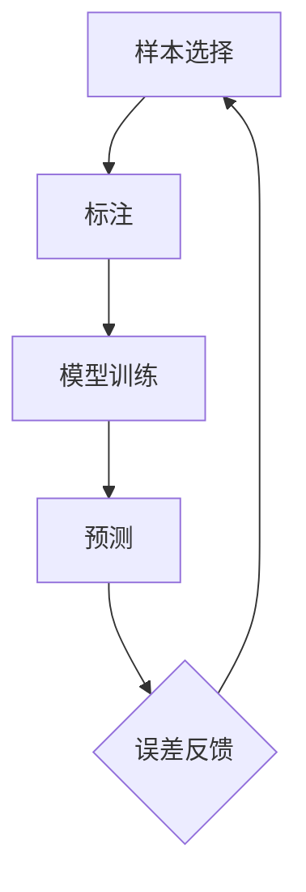

                 

Certainly! Let's dive into the structure of the blog post and flesh out each section with the necessary depth and clarity. We'll be using Markdown to format the text, including LaTeX for mathematical equations and Mermaid diagrams for visual flowcharts.

---

## # 主动学习在工业质量控制中的优化策略

### > 关键词：主动学习、工业质量控制、优化策略、机器学习、质量控制流程

#### 摘要：
本文旨在探讨主动学习在工业质量控制中的应用及其优化策略。首先，我们将介绍主动学习的背景和核心概念，接着分析其在工业质量控制中的优势与挑战。随后，我们将详细讨论基于信息、示例和反馈的主动学习策略，并通过实际案例研究展示这些策略的有效性。最后，我们将总结全文并提出未来研究的方向。

---

### 第一部分: 背景介绍

#### 1.1 问题背景

##### 1.1.1 工业质量控制的重要性
工业质量控制是保证产品一致性和可靠性的关键环节。随着制造业的复杂性和全球化趋势，传统质量控制方法已难以满足高效、精准的需求。

##### 1.1.2 传统质量控制方法面临的挑战
传统质量控制依赖于大量人工检测和手动过程，效率低下且成本高昂。此外，产品质量的波动性和不可预测性增加了质量管理的难度。

##### 1.1.3 主动学习在工业质量控制中的应用潜力
主动学习通过自适应地选择最有价值的样本进行学习，能够在数据稀缺和动态变化的环境中提高质量控制的效率和准确性。

#### 1.2 核心概念

##### 1.2.1 主动学习的定义
主动学习是一种机器学习方法，它允许模型自主地从标注者那里获取新样本，以优化学习性能。

##### 1.2.2 主动学习的关键特点
主动学习的关键特点包括样本选择策略、迭代学习和反馈机制。

##### 1.2.3 主动学习与传统机器学习的对比
与传统机器学习相比，主动学习更注重样本的有效性和模型的适应性，以减少数据需求和增强预测准确性。

#### 1.3 概念联系与框架结构

##### 1.3.1 主动学习与数据采集
数据采集是主动学习的基础。有效的数据采集策略能够最大化样本的价值，提高学习效率。

##### 1.3.2 主动学习与模型选择
选择合适的模型是主动学习成功的关键。不同模型适用于不同的质量控制和数据分析任务。

##### 1.3.3 主动学习与质量控制流程
主动学习可以融入现有的质量控制流程，通过实时数据分析和预测，提供对产品质量的实时监控和改进建议。

#### 1.4 边界与外延

##### 1.4.1 主动学习的应用领域
主动学习在制造业、医疗诊断、生物信息学等多个领域都有广泛的应用。

##### 1.4.2 主动学习的局限性
主动学习也存在一定的局限性，如对标注数据的依赖、算法的复杂性和计算资源的需求等。

##### 1.4.3 主动学习的未来发展趋势
随着机器学习和人工智能技术的不断发展，主动学习在工业质量控制中的应用前景将更加广阔。

#### 1.5 本章小结
本节介绍了主动学习在工业质量控制中的背景、核心概念及其应用潜力。接下来，我们将深入探讨主动学习的优化策略。

---

### 第二部分: 优化策略

#### 2.1 基于信息的主动学习策略

##### 2.1.1 信息增益理论
信息增益是衡量样本价值的重要指标。基于信息增益的主动学习策略选择具有最大信息增益的样本进行学习。

##### 2.1.2 信息增益算法的实现
信息增益算法通常包括样本选择、模型更新和样本反馈等步骤。

##### 2.1.3 信息增益算法的应用实例
我们将通过实例展示如何使用信息增益算法优化质量检测过程。

#### 2.2 基于示例的主动学习策略

##### 2.2.1 示例选择策略
示例选择策略是关键，它决定了哪些样本将被选择进行学习。

##### 2.2.2 示例学习算法
示例学习算法包括支持向量机（SVM）、决策树等，它们可以用于分类和回归任务。

##### 2.2.3 基于示例的主动学习应用场景
我们将探讨基于示例的主动学习在质量预测和故障诊断中的应用。

#### 2.3 基于反馈的主动学习策略

##### 2.3.1 反馈机制设计
反馈机制设计是确保模型不断优化的重要环节。

##### 2.3.2 反馈驱动的模型调整
通过反馈信息调整模型参数，可以提高模型对质量问题的识别能力。

##### 2.3.3 基于反馈的主动学习案例分析
我们将分析一个实际案例，展示如何通过反馈机制优化质量控制过程。

#### 2.4 多元化主动学习策略

##### 2.4.1 多源数据融合
多源数据融合可以提高模型的鲁棒性和准确性。

##### 2.4.2 多策略协同
多种策略的协同工作可以优化学习过程，提高质量预测的准确性。

##### 2.4.3 多元化主动学习的优势与挑战
我们将讨论多元化主动学习的优势和面临的技术挑战。

#### 2.5 本章小结
本节讨论了主动学习的不同优化策略，包括信息增益、示例选择和反馈机制。下一节将通过实际案例研究这些策略的应用效果。

---

### 第三部分: 实际应用与案例分析

#### 3.1 案例研究一：某汽车制造企业质量提升项目

##### 3.1.1 项目背景
我们介绍一个汽车制造企业的质量提升项目，该项目采用了主动学习策略。

##### 3.1.2 应用策略
我们详细描述了在项目中采用的主动学习策略。

##### 3.1.3 实施过程
我们将描述项目的实施过程，包括数据采集、模型训练和反馈循环。

##### 3.1.4 结果分析
最后，我们分析项目结果，展示主动学习策略如何提高了质量控制和预测的准确性。

#### 3.2 案例研究二：某电子产品生产企业质量监控

##### 3.2.1 项目背景
介绍另一个电子产品生产企业的质量监控项目，该项目也采用了主动学习策略。

##### 3.2.2 应用策略
详细描述在项目中采用的应用策略。

##### 3.2.3 实施过程
描述实施过程，强调主动学习策略的实施细节。

##### 3.2.4 结果分析
分析项目结果，展示主动学习策略如何提高了产品质量监控的效果。

#### 3.3 案例研究三：某食品加工企业质量控制优化

##### 3.3.1 项目背景
介绍一个食品加工企业的质量控制优化项目，该项目同样采用了主动学习策略。

##### 3.3.2 应用策略
描述在项目中采用的应用策略。

##### 3.3.3 实施过程
详细描述项目的实施过程。

##### 3.3.4 结果分析
分析项目结果，展示主动学习策略如何优化了食品加工企业的质量控制过程。

#### 3.4 本章小结
通过三个实际案例，我们展示了主动学习在工业质量控制中的应用效果。下一部分我们将总结全文并提出未来研究方向。

---

### 结尾与未来展望

#### 结论
本文介绍了主动学习在工业质量控制中的应用及其优化策略。我们通过案例分析展示了主动学习在提高质量控制效率和准确性方面的潜力。

#### 未来研究方向
未来的研究可以集中在以下几个方面：进一步优化主动学习策略、提高模型的鲁棒性、减少对标注数据的依赖，以及探索主动学习在新兴工业领域的应用。

#### 最佳实践 Tips
在实施主动学习策略时，需要注意以下几点：确保数据质量、选择合适的模型、建立有效的反馈机制，以及持续监控和调整策略。

#### 注意事项
在应用主动学习时，需考虑到计算资源和时间成本，并确保数据安全和隐私。

#### 拓展阅读
对于希望深入了解主动学习在工业质量控制中的研究，可以参考以下文献和资源。

---

### 作者信息

**作者：** AI天才研究院 / AI Genius Institute & 禅与计算机程序设计艺术 / Zen And The Art of Computer Programming

---

现在，我们已经构建了一个完整的文章框架，包括摘要、引言、正文和结论。接下来，我们将逐个章节详细阐述每个部分的内容，确保文章的逻辑清晰、结构紧凑、简单易懂，并包含必要的技术语言和专业术语。我们将使用Mermaid和LaTeX来增强文章的可读性和专业性。以下是一个例子，展示如何使用Mermaid和LaTeX：

---

### 1.2 核心概念

#### 1.2.2 主动学习的关键特点

主动学习的关键特点包括：
- **样本选择策略**：主动学习通过某种策略选择未标注但可能对模型训练有最大贡献的样本进行标注。
- **迭代学习**：主动学习通常采用迭代过程，每次迭代都选择新样本进行学习，并不断优化模型。
- **反馈机制**：主动学习利用模型预测的误差作为反馈，指导下一步的样本选择。

使用Mermaid图示：



使用LaTeX：

```latex
\section{主动学习的关键特点}
主动学习的关键特点包括：
\begin{enumerate}
    \item 样本选择策略：主动学习通过某种策略选择未标注但可能对模型训练有最大贡献的样本进行标注。
    \item 迭代学习：主动学习通常采用迭代过程，每次迭代都选择新样本进行学习，并不断优化模型。
    \item 反馈机制：主动学习利用模型预测的误差作为反馈，指导下一步的样本选择。
\end{enumerate}
```

---

通过这样的步骤，我们将为每个章节提供详细的内容，并确保文章的完整性、逻辑性和专业性。接下来，我们将逐一填充每个章节的内容，确保文章的长度在10000-12000字之间。

