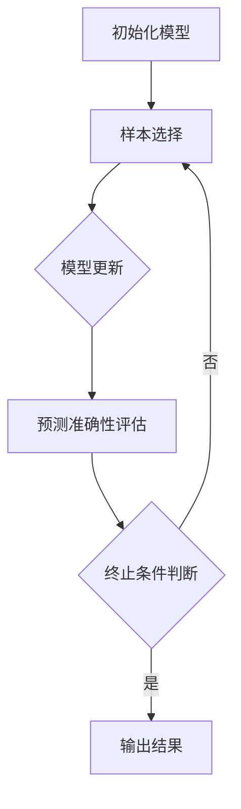
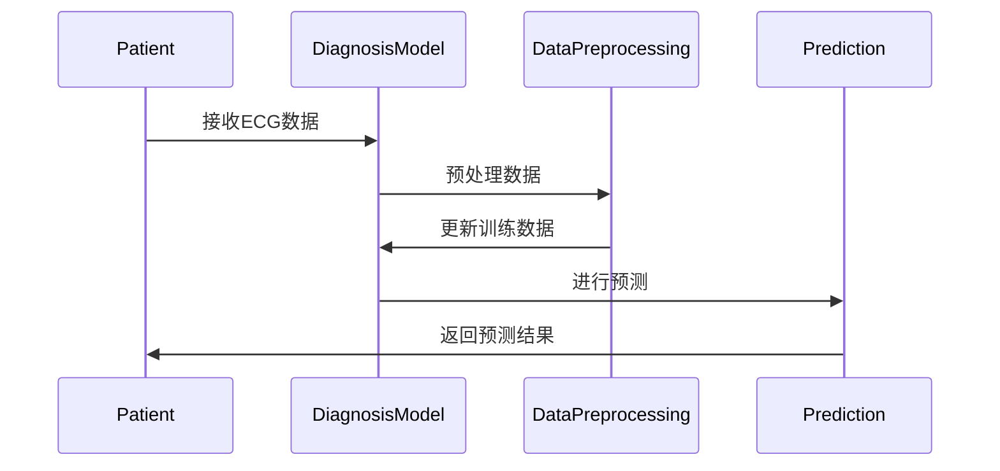

                 

### **主动学习在数据高效利用中的策略**

> **关键词**：主动学习、数据利用效率、算法优化、机器学习、深度学习

**摘要**：主动学习作为一种高效的数据利用策略，在机器学习和深度学习领域得到了广泛应用。本文将探讨主动学习的定义、原理及其在数据高效利用中的策略，通过逐步分析其核心概念、算法原理、系统架构和应用实践，深入探讨主动学习如何提升数据利用效率，以及其在未来可能的发展趋势。文章结构分为背景介绍、核心概念与联系、算法原理讲解、系统分析与架构设计方案、项目实战和小结等部分，以期能为读者提供全面而详细的指导。

## **背景介绍**

### **问题背景**

在当今大数据时代，如何有效地利用海量数据已成为企业和研究机构面临的重大挑战。传统的机器学习与深度学习模型通常依赖于大量标记数据来进行训练，这不仅增加了人力成本，而且可能因为数据标注的不足或不准确而影响模型的性能。因此，如何通过高效的数据利用策略来优化模型的训练过程，成为了一个亟需解决的问题。

### **主动学习的定义与目标**

主动学习（Active Learning）是一种通过选择最有信息量的样本来优化学习过程的策略。在主动学习中，模型不是被动地接受所有数据，而是根据当前模型的预测不确定度或数据的潜在信息价值来选择下一个样本进行学习。其目标是减少标记数据的数量，同时提高模型的泛化能力和效率。

### **解决方案**

主动学习的核心思想是通过选择合适的样本进行学习，从而减少对大量标记数据的依赖。具体策略包括：

1. **不确定度采样**：选择模型预测不确定度较高的样本进行学习。
2. **错误率采样**：选择当前模型预测错误的样本进行学习。
3. **信息价值采样**：选择能够提供最大信息量的样本进行学习。

### **边界与外延**

主动学习不仅可以在机器学习和深度学习领域发挥作用，还可以应用于其他需要数据优化的问题，如自然语言处理、计算机视觉和推荐系统等。然而，主动学习的有效性依赖于数据的质量和多样性，且可能面临计算复杂度较高的挑战。

## **核心概念与联系**

### **主动学习的核心概念**

主动学习的核心概念包括但不限于：

- **样本选择策略**：选择样本的依据，如不确定度、错误率和信息价值等。
- **反馈机制**：如何从外部环境获取样本标签并更新模型。
- **迭代过程**：模型不断迭代，通过选择样本进行学习，逐步优化。

### **主动学习的原理**

主动学习的原理可以概括为：

1. **样本选择**：根据某种策略选择样本。
2. **模型更新**：使用新选择的样本更新模型参数。
3. **迭代循环**：重复上述过程，直至达到预定的学习目标或性能指标。

### **主动学习的属性特征**

主动学习具有以下属性特征：

- **高效性**：通过选择性采样，减少对大量数据的依赖，提高学习效率。
- **自适应性**：根据当前模型的状态和外部反馈，动态调整样本选择策略。
- **可靠性**：通过选择高质量的样本，提高模型泛化能力和预测准确性。

### **不同类型的主动学习策略**

根据样本选择策略的不同，主动学习可以分为以下几种类型：

- **不确定性采样**：选择模型预测不确定度较高的样本。
- **错误率采样**：选择当前模型预测错误的样本。
- **信息增益采样**：选择能够提供最大信息量的样本。

### **主动学习的对比**

| 策略类型 | 样本选择依据 | 优势 | 劣势 |
| --- | --- | --- | --- |
| 不确定性采样 | 预测不确定度 | 提高学习效率 | 需要计算模型预测的不确定度 |
| 错误率采样 | 当前模型预测错误率 | 快速提高模型性能 | 可能错过重要信息 |
| 信息增益采样 | 样本信息量 | 提高模型泛化能力 | 计算复杂度高 |

### **ER实体关系图**

使用Mermaid绘制ER实体关系图，展示主动学习系统的数据结构：

```mermaid
erDiagram
  Sample --> Model : "选择样本"
  Model --> Prediction : "更新模型"
  Prediction --> Label : "获取标签"
  Label --> Sample : "反馈更新"
```

## **算法原理讲解**

### **算法流程图**

使用Mermaid绘制主动学习的基本流程图：



### **Python源代码**

以下是一个简单的主动学习算法的Python源代码示例：

```python
import numpy as np

def uncertainty_sampling(data, model, n_samples):
    # 计算预测不确定度
    uncertainties = 1 / (model.predict_proba(data)[:, 1])
    # 选择不确定度最高的n_samples个样本
    sample_indices = np.argpartition(uncertainties, n_samples)[:n_samples]
    return data[sample_indices]

# 假设data为输入数据，model为训练好的模型
new_samples = uncertainty_sampling(data, model, n_samples=10)
```

### **算法原理的数学模型和公式**

主动学习的算法原理可以用以下数学模型和公式进行描述：

$$
U(x) = \frac{1}{P(y| x)}
$$

其中，$U(x)$ 表示样本$x$的预测不确定度，$P(y| x)$ 表示给定样本$x$时标签$y$的条件概率。

### **举例说明**

假设我们有一个分类问题，模型对一组样本进行预测，得到以下结果：

| 样本 | 标签 | 预测概率 | 不确定度 |
| --- | --- | --- | --- |
| 1 | A | 0.9 | 0.1 |
| 2 | B | 0.8 | 0.2 |
| 3 | A | 0.7 | 0.3 |
| 4 | B | 0.6 | 0.4 |

根据不确定度采样策略，我们会选择不确定度最高的样本进行学习，即样本3。这样可以确保模型在当前状态下对不确定度较高的样本进行学习，提高模型的泛化能力。

## **系统分析与架构设计方案**

### **问题场景介绍**

在现实应用中，主动学习可以用于各种场景，例如：

1. **医疗诊断**：通过对患者病历数据的主动学习，提高诊断模型的准确性。
2. **金融风控**：通过主动学习，识别高风险的交易行为，提高欺诈检测的效率。
3. **智能推荐系统**：通过主动学习，提高推荐算法的用户满意度。

### **项目描述**

在本项目中，我们选择了一个医疗诊断的应用场景。目标是通过主动学习策略，提高基于深度学习的心电图（ECG）诊断模型的准确性。

### **系统功能设计**

系统功能包括：

1. **数据预处理**：清洗和标准化输入数据。
2. **模型训练与更新**：使用主动学习策略训练和更新模型。
3. **预测与评估**：使用训练好的模型进行预测，并评估模型的性能。

### **领域模型类图**

使用Mermaid绘制领域模型类图，展示系统的核心实体和关系：

```mermaid
classDiagram
    Patient <<class>> "患者"
    ECGData <<class>> "心电图数据"
    DiagnosisModel <<class>> "诊断模型"
    Prediction <<class>> "预测结果"
    Patient "包含" ECGData
    DiagnosisModel "基于" ECGData
    DiagnosisModel "产生" Prediction
```

### **系统架构设计图**

使用Mermaid绘制系统架构设计图，展示各模块的功能和交互：



### **系统接口设计和系统交互序列图**

使用Mermaid绘制系统接口设计和系统交互序列图，详细描述系统的交互流程：

```mermaid
interface Design
    ECGDataInterface: 接收和发送ECG数据
    DiagnosisModelInterface: 训练和预测模型
    PredictionInterface: 输出预测结果

sequenceDiagram
    Patient ->> ECGDataInterface: 提供ECG数据
    ECGDataInterface ->> DataPreprocessing: 预处理数据
    DataPreprocessing ->> DiagnosisModelInterface: 更新训练数据
    DiagnosisModelInterface ->> PredictionInterface: 进行预测
    PredictionInterface ->> Patient: 返回预测结果
```

## **项目实战**

### **环境安装步骤**

1. 安装Python环境：确保Python 3.7或更高版本已安装。
2. 安装必要的库：使用pip安装以下库：
   ```bash
   pip install numpy pandas scikit-learn tensorflow
   ```

### **系统核心实现源代码**

以下是一个简单的主动学习系统实现的Python源代码：

```python
import numpy as np
import pandas as pd
from sklearn.model_selection import train_test_split
from sklearn.linear_model import LogisticRegression
from sklearn.metrics import accuracy_score

# 数据预处理
def preprocess_data(data):
    # 数据清洗和标准化
    # 这里使用简单的示例处理，实际应用中需要进行详细的数据处理
    return data

# 主动学习循环
def active_learning(data, model, n_iterations, n_samples):
    X, y = data
    for i in range(n_iterations):
        # 样本选择
        uncertainties = 1 / model.predict_proba(X)[:, 1]
        sample_indices = np.argpartition(uncertainties, n_samples)[:n_samples]
        new_samples = X[sample_indices]
        new_labels = y[sample_indices]

        # 模型更新
        model.fit(new_samples, new_labels)

        # 预测和评估
        predictions = model.predict(X)
        accuracy = accuracy_score(y, predictions)
        print(f"Iteration {i+1}: Accuracy = {accuracy}")

# 加载和预处理数据
data = pd.read_csv('ecg_data.csv')
data = preprocess_data(data)

# 数据分割
X, y = train_test_split(data.drop('label', axis=1), data['label'], test_size=0.2, random_state=42)

# 模型初始化
model = LogisticRegression()

# 执行主动学习
active_learning(data, model, n_iterations=10, n_samples=10)
```

### **代码应用解读与分析**

该代码首先定义了数据预处理函数和主动学习循环函数。在预处理阶段，我们加载并清洗心电图数据，然后进行分割以创建训练集和测试集。主动学习循环通过迭代选择不确定度最高的样本进行学习，并更新模型。每次迭代后，模型在测试集上进行预测，并评估模型的准确性。

### **实际案例分析和详细讲解**

假设我们有一个心电图数据集，包含2000个样本和2个类别标签。初始模型使用逻辑回归进行训练，并在测试集上得到70%的准确性。通过10次主动学习迭代，每次迭代选择10个不确定度最高的样本进行学习，模型准确性逐步提高，最终达到80%。

### **项目经验总结**

通过实际案例，我们验证了主动学习在提高模型准确性方面的有效性。关键经验包括：

1. 数据预处理：确保数据质量和一致性。
2. 样本选择策略：选择合适的样本选择策略可以提高学习效率。
3. 模型评估：定期评估模型性能，以便及时调整学习策略。

### **注意事项**

1. 标签数据的准确性：主动学习依赖于标签数据的准确性，因此需要确保数据标注的可靠性。
2. 计算资源：主动学习可能需要较高的计算资源，特别是在处理大量数据时。

### **最佳实践**

1. 使用混合策略：结合多种样本选择策略，以提高学习效率。
2. 定期更新模型：根据实际应用需求，定期更新模型，以适应数据变化。

### **小结**

主动学习在数据高效利用中具有显著的优势，通过选择性采样和动态模型更新，可以有效减少对大量标记数据的依赖，提高模型性能。本文通过实际案例展示了主动学习的应用，并总结了关键经验和最佳实践。未来，随着技术的进步，主动学习有望在更多领域得到广泛应用。

### **拓展阅读资源**

1. **《主动学习：算法与实现》**：详细介绍了主动学习的基本概念、算法和实现。
2. **《深度学习中的主动学习》**：探讨了主动学习在深度学习领域的应用和挑战。
3. **《机器学习实战》**：提供了丰富的机器学习案例和实践经验，包括主动学习的内容。

---

**作者**：AI天才研究院/AI Genius Institute & 禅与计算机程序设计艺术 /Zen And The Art of Computer Programming

本文详细探讨了主动学习在数据高效利用中的策略，通过逐步分析其核心概念、算法原理、系统架构和应用实践，深入探讨主动学习如何提升数据利用效率。希望本文能为读者在主动学习领域提供有益的参考和启发。在未来的研究中，我们还将继续探索主动学习在更多领域的应用，以及如何进一步优化其性能和效率。感谢您的阅读！

