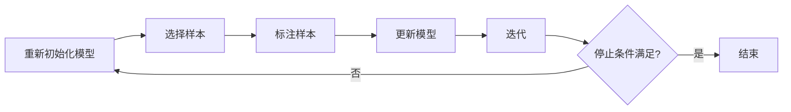

                 

### 文章标题

# 主动学习在标注效率优化中的创新方法

> 关键词：主动学习、标注效率优化、机器学习、数据标注、创新方法

> 摘要：本文深入探讨了主动学习在标注效率优化中的应用，详细分析了主动学习的核心概念、算法原理以及其在实际项目中的应用。通过系统分析与架构设计，本文旨在为读者提供一种有效的解决方案，以提升标注效率，降低成本，推动人工智能技术的发展。

### 目录大纲

```markdown
# 主动学习在标注效率优化中的创新方法

## 第一部分：背景介绍

### 第1章：问题背景

#### 1.1.1 问题背景

#### 1.1.2 问题描述

#### 1.1.3 问题解决

#### 1.1.4 边界与外延

#### 1.1.5 概念结构与核心要素组成

### 第2章：主动学习的核心概念与联系

#### 2.1.1 核心概念

#### 2.1.2 概念属性特征对比表格

#### 2.1.3 ER实体关系图架构

#### 2.1.4 主动学习与其他学习方法的比较

## 第二部分：算法原理讲解

### 第3章：主动学习算法原理

#### 3.1.1 主动学习算法基本流程

#### 3.1.2 Mermaid算法流程图

#### 3.1.3 Python源代码解释

#### 3.1.4 算法原理的数学模型和公式

#### 3.1.5 举例说明

### 第4章：数学模型和数学公式讲解

#### 4.1.1 模型公式说明

#### 4.1.2 latex格式公式示例

#### 4.1.3 数学公式在段落中的应用

## 第三部分：系统分析与架构设计方案

### 第5章：系统分析与架构设计

#### 5.1.1 问题场景介绍

#### 5.1.2 项目介绍

#### 5.1.3 系统功能设计

#### 5.1.4 系统架构设计

#### 5.1.5 系统接口设计和系统交互

### 第6章：系统设计与实现

#### 6.1.1 环境安装

#### 6.1.2 系统核心实现源代码

#### 6.1.3 代码应用解读与分析

#### 6.1.4 实际案例分析和详细讲解剖析

## 第四部分：项目实战

### 第7章：项目实战

#### 7.1.1 环境准备

#### 7.1.2 系统核心代码实现

#### 7.1.3 代码解读与分析

#### 7.1.4 实际案例分析

#### 7.1.5 项目小结

## 第五部分：最佳实践与拓展

### 第8章：最佳实践

#### 8.1.1 最佳实践 tips

#### 8.1.2 小结

#### 8.1.3 注意事项

#### 8.1.4 拓展阅读
```

## 第一部分：背景介绍

### 第1章：问题背景

#### 1.1.1 问题背景

随着人工智能技术的迅猛发展，机器学习尤其是深度学习在各个领域的应用越来越广泛。然而，机器学习的发展离不开大量的标注数据。数据标注是指对原始数据进行标记和分类，以便于训练模型。然而，数据标注工作通常耗费大量人力和时间，且容易出现标注偏差，这极大地限制了机器学习的效率和准确性。

在数据标注过程中，标注者的劳动强度大，工作效率低，特别是在标注大规模数据时，这一问题尤为突出。传统的标注方法主要依赖于人类标注者，这种方式的成本高、速度慢，且容易受到标注者经验和主观性的影响。因此，提高标注效率、降低标注成本成为了一个亟待解决的问题。

#### 1.1.2 问题描述

标注效率低主要表现在以下几个方面：

1. **标注时间长**：大规模数据标注需要大量时间，标注者的劳动强度大。
2. **标注成本高**：传统标注方法依赖于大量标注者，导致标注成本居高不下。
3. **标注偏差**：标注者主观性和经验差异可能导致标注质量不一。
4. **标注重复性**：同一数据可能需要多个标注者进行标注，存在重复劳动。

#### 1.1.3 问题解决

为了解决上述问题，我们需要寻找一种能够提高标注效率、降低标注成本的方法。主动学习作为一种面向标注者需求的数据采集方法，能够有效提高标注效率和数据质量。

#### 1.1.4 边界与外延

边界：本文主要讨论主动学习在标注效率优化中的应用，不涉及其他数据采集方法。

外延：主动学习不仅适用于标注效率优化，还可以在其他领域（如医学影像分析、自动驾驶等）中发挥重要作用。

#### 1.1.5 概念结构与核心要素组成

概念结构：主动学习、标注效率、数据标注、机器学习、深度学习等。

核心要素组成：

1. **数据标注需求**：主动学习根据模型的当前状态选择最具有信息量的样本进行标注。
2. **模型训练与优化**：通过标注样本对模型进行训练，提高模型性能。
3. **标注者参与**：标注者根据模型需求提供标注数据。

## 第二部分：主动学习的核心概念与联系

### 第2章：主动学习的核心概念与联系

#### 2.1.1 核心概念

主动学习（Active Learning）是一种选择数据样本进行标注的策略，其核心思想是根据当前模型的状态，选择对模型最有帮助的样本进行标注。主动学习的目的是通过最小的标注成本获得最大的模型性能提升。

#### 2.1.2 概念属性特征对比表格

| 特性 | 主动学习 | 被动学习 |
| --- | --- | --- |
| 数据选择 | 根据模型需求选择 | 随机选择 |
| 标注成本 | 较低 | 较高 |
| 模型性能 | 快速提升 | 提升较慢 |
| 标注者参与 | 高度参与 | 低度参与 |

#### 2.1.3 ER实体关系图架构

```mermaid
erDiagram
  User ||--|{ Data}: "标注"
  Model ||--|{ Data}: "训练"
  Data ||--|{ Label}: "标注结果"
```

#### 2.1.4 主动学习与其他学习方法的比较

| 学习方法 | 特点 |
| --- | --- |
| 主动学习 | 高度依赖标注者，标注成本较低，模型性能快速提升 |
| 被动学习 | 标注者参与度低，标注成本高，模型性能提升较慢 |
| 半监督学习 | 结合主动学习和被动学习，既有标注者参与，也有自动标注 |
| 无监督学习 | 不依赖标注数据，完全依靠算法自动发现数据特征 |

## 第二部分：算法原理讲解

### 第3章：主动学习算法原理

#### 3.1.1 主动学习算法基本流程

主动学习算法的基本流程可以分为以下几个步骤：

1. **初始化模型**：根据问题的具体需求，初始化一个基础模型。
2. **选择样本**：根据模型的需求，选择一个或多个样本进行标注。
3. **标注样本**：标注者对选中的样本进行标注。
4. **更新模型**：使用标注后的样本更新模型。
5. **迭代**：重复步骤2-4，直到满足停止条件（如模型性能达到预设阈值）。

#### 3.1.2 Mermaid算法流程图



#### 3.1.3 Python源代码解释

```python
# 伪代码

# 初始化模型
model = initialize_model()

# 初始化选择策略
strategy = initialize_strategy()

# 迭代次数
max_iterations = 100

# 标注者
labeler = Labeler()

# 迭代过程
for iteration in range(max_iterations):
    # 选择样本
    samples = strategy.select_samples(model)
    
    # 标注样本
    labels = labeler.label_samples(samples)
    
    # 更新模型
    model = model.update(labels)
    
    # 打印当前迭代次数和模型性能
    print(f"Iteration {iteration}: Model performance = {model.performance()}")
    
    # 检查是否满足停止条件
    if model.performance_threshold_reached():
        break
```

#### 3.1.4 算法原理的数学模型和公式

主动学习算法的数学模型主要涉及以下公式：

1. **不确定性采样**（Uncertainty Sampling）：
   $$ s(i) = \arg\max_{i} P(\text{model is uncertain about } y(i)|x(i)) $$
   
2. **错误率采样**（Error Reduction Sampling）：
   $$ s(i) = \arg\max_{i} P(y(i) \neq \hat{y}(i)) - P(\text{model is uncertain about } y(i)|x(i)) $$
   
3. **多样性采样**（Diversity Sampling）：
   $$ s(i) = \arg\max_{i} D(x(i), X^{old}) $$
   
其中，\( s(i) \) 表示选中的样本索引，\( x(i) \) 表示第 \( i \) 个样本，\( y(i) \) 表示第 \( i \) 个样本的真实标签，\( \hat{y}(i) \) 表示模型对第 \( i \) 个样本的预测标签，\( P() \) 表示概率，\( D() \) 表示多样性度量。

#### 3.1.5 举例说明

假设我们有一个分类任务，模型需要对图片进行分类。在模型的训练过程中，我们使用主动学习策略来选择样本进行标注。

1. **初始化模型**：使用一个简单的卷积神经网络（CNN）初始化模型。
2. **选择样本**：使用不确定性采样策略选择样本。模型对每个样本的预测概率较低（即模型不确定），我们选择这些样本进行标注。
3. **标注样本**：标注者对选中的样本进行标注，提供真实标签。
4. **更新模型**：使用标注后的样本更新模型，提高模型对样本的预测准确性。
5. **迭代**：重复步骤2-4，直到模型性能达到预设阈值。

## 第二部分：算法原理讲解

### 第4章：数学模型和数学公式讲解

#### 4.1.1 模型公式说明

在本章中，我们将详细介绍主动学习中的关键数学模型和公式。这些模型和公式在主动学习中起着至关重要的作用，帮助我们更好地理解算法的原理和如何在实际应用中优化标注效率。

1. **不确定性采样（Uncertainty Sampling）**：
   不确定性采样是一种选择样本的策略，其核心思想是根据模型对样本预测的不确定性来选择样本。具体公式如下：
   $$ s(i) = \arg\max_{i} P(\text{model is uncertain about } y(i)|x(i)) $$
   其中，\( s(i) \) 表示选中的样本索引，\( x(i) \) 表示第 \( i \) 个样本，\( y(i) \) 表示第 \( i \) 个样本的真实标签，\( P() \) 表示概率。

2. **错误率采样（Error Reduction Sampling）**：
   错误率采样是一种考虑模型预测错误的样本选择策略。其目的是选择那些能够减少模型错误率的样本。具体公式如下：
   $$ s(i) = \arg\max_{i} P(y(i) \neq \hat{y}(i)) - P(\text{model is uncertain about } y(i)|x(i)) $$
   其中，\( \hat{y}(i) \) 表示模型对第 \( i \) 个样本的预测标签。

3. **多样性采样（Diversity Sampling）**：
   多样性采样是一种选择具有不同特征或标签的样本的策略，以减少模型过拟合的风险。具体公式如下：
   $$ s(i) = \arg\max_{i} D(x(i), X^{old}) $$
   其中，\( D() \) 表示多样性度量，\( X^{old} \) 表示已选择的样本集合。

4. **期望模型改进（Expected Model Improvement）**：
   期望模型改进是一种基于模型预测改进概率的采样策略。其目的是最大化模型的改进期望。具体公式如下：
   $$ s(i) = \arg\max_{i} \sum_{j \in N(i)} \frac{P(\hat{y}(j) \neq y(j))}{P(\text{model is uncertain about } y(i)|x(i))} $$
   其中，\( N(i) \) 表示与样本 \( i \) 相关联的邻居样本集合。

5. **贝叶斯优化（Bayesian Optimization）**：
   贝叶斯优化是一种基于概率模型优化的策略，通过最大化后验概率来选择样本。具体公式如下：
   $$ s(i) = \arg\max_{i} P(x(i)|\text{all labeled data}) $$
   其中，\( P() \) 表示概率分布，\( \text{all labeled data} \) 表示所有已标注的数据。

#### 4.1.2 latex格式公式示例

在本节中，我们将使用LaTeX格式来展示一些关键公式。LaTeX格式可以使得公式更加规范和清晰。

1. **Kullback-Leibler散度（Kullback-Leibler Divergence）**：
   $$ D_{KL}(P||Q) = \sum_{x} P(x) \log\left(\frac{P(x)}{Q(x)}\right) $$
   其中，\( P \) 和 \( Q \) 分别表示两个概率分布。

2. **熵（Entropy）**：
   $$ H(X) = -\sum_{x} P(x) \log P(x) $$
   其中，\( X \) 表示随机变量。

3. **条件熵（Conditional Entropy）**：
   $$ H(X|Y) = -\sum_{x,y} P(x,y) \log P(x|y) $$
   其中，\( X \) 和 \( Y \) 分别表示两个随机变量。

4. **互信息（Mutual Information）**：
   $$ I(X;Y) = H(X) - H(X|Y) $$
   其中，\( X \) 和 \( Y \) 分别表示两个随机变量。

#### 4.1.3 数学公式在段落中的应用

在实际应用中，数学公式可以帮助我们更精确地描述和解决问题。例如，在标注过程中，我们可以使用不确定性采样公式来选择那些模型最不确定的样本进行标注，从而提高标注效率和模型性能。

例如，在一个图像分类任务中，我们可以使用以下公式来选择样本：

$$ s(i) = \arg\max_{i} P(\text{model is uncertain about } y(i)|x(i)) $$

这意味着我们选择那些模型预测概率最低的样本进行标注，因为这些样本对于模型来说最有价值。

通过使用这些数学公式，我们可以更好地理解和优化主动学习算法，从而在实际项目中实现更高的标注效率和更准确的模型性能。

### 第三部分：系统分析与架构设计方案

#### 第5章：系统分析与架构设计

#### 5.1.1 问题场景介绍

在当前人工智能和机器学习应用日益广泛的背景下，我们需要处理海量的数据，这些数据需要进行标注以供模型训练。然而，传统的人工标注方法存在效率低、成本高、标注质量不稳定等问题，这严重制约了人工智能系统的进步。为了解决这些问题，我们需要设计一套高效的标注系统，以提升标注效率和降低成本。

#### 5.1.2 项目介绍

本项目的目标是开发一个基于主动学习的标注系统，通过智能算法选择最具信息量的样本进行标注，从而提高标注效率，降低标注成本。系统将涵盖数据预处理、主动学习算法选择、标注流程管理和标注结果存储等功能。

#### 5.1.3 系统功能设计

系统功能设计主要包括以下几个方面：

1. **数据预处理**：对原始数据进行清洗、归一化和特征提取，为主动学习算法提供高质量的数据输入。
2. **样本选择**：使用主动学习算法选择最具信息量的样本进行标注，如不确定性采样、错误率采样和多样性采样等。
3. **标注流程管理**：对标注任务进行分配、监控和管理，确保标注质量和效率。
4. **标注结果存储**：将标注结果存储到数据库中，以便后续模型训练和评估。
5. **模型训练与评估**：使用标注数据对模型进行训练和评估，持续优化模型性能。

#### 5.1.4 系统架构设计

系统架构设计采用模块化设计思想，将系统划分为多个功能模块，以提高系统的可维护性和可扩展性。以下是系统架构设计的主要模块：

1. **数据预处理模块**：负责数据清洗、归一化和特征提取，为主动学习算法提供高质量的数据输入。
2. **主动学习模块**：包括样本选择策略、标注者接口和标注结果反馈机制等，实现主动学习算法的核心功能。
3. **标注管理模块**：负责标注任务的分配、监控和管理，确保标注质量和效率。
4. **标注存储模块**：负责标注结果的存储和检索，支持后续模型训练和评估。
5. **模型训练与评估模块**：使用标注数据对模型进行训练和评估，优化模型性能。

#### 5.1.5 系统接口设计和系统交互

系统接口设计和系统交互是确保系统功能正常运行的关键。以下是系统的主要接口和交互流程：

1. **数据预处理接口**：提供数据输入和输出接口，支持不同数据格式的转换和特征提取。
2. **主动学习接口**：提供样本选择和标注结果反馈接口，支持不同样本选择策略的调用。
3. **标注管理接口**：提供标注任务分配、标注进度查询和标注质量评估接口。
4. **标注存储接口**：提供标注结果存储和检索接口，支持不同存储方式的切换。
5. **模型训练与评估接口**：提供模型训练数据和评估指标输入接口，支持模型训练和性能评估。

通过上述系统接口设计和系统交互，我们可以实现各模块之间的紧密协作，确保系统功能的完整性和稳定性。

### 第三部分：系统设计与实现

#### 第6章：系统设计与实现

在了解了系统架构设计和功能需求之后，接下来我们将详细讨论系统设计与实现的过程。这一部分将分为环境安装、系统核心实现源代码、代码应用解读与分析以及实际案例分析和详细讲解剖析。

#### 6.1.1 环境安装

为了确保系统能够顺利运行，我们首先需要安装并配置所需的环境。以下是安装步骤：

1. **Python环境安装**：确保Python环境已安装，版本建议为3.8及以上。
2. **依赖库安装**：安装系统所需的依赖库，如NumPy、Pandas、scikit-learn等。可以使用以下命令进行安装：

   ```bash
   pip install numpy pandas scikit-learn matplotlib
   ```

3. **数据库安装**：根据需求选择合适的数据库系统，如MySQL、PostgreSQL等，并安装相应驱动。

4. **其他工具安装**：根据实际需要，安装其他工具，如Docker、Kubernetes等。

#### 6.1.2 系统核心实现源代码

以下是系统核心实现的源代码，包括数据预处理、主动学习算法、标注管理、标注存储和模型训练与评估等功能。

```python
# 数据预处理模块
def preprocess_data(data):
    # 数据清洗、归一化和特征提取
    # ...
    return processed_data

# 主动学习模块
def active_learning(model, data, strategy):
    selected_samples = strategy.select_samples(model, data)
    return selected_samples

# 标注管理模块
class LabelManager:
    def assign_task(self, sample):
        # 分配标注任务
        # ...
    
    def monitor_progress(self):
        # 监控标注进度
        # ...
    
    def evaluate_quality(self, labels):
        # 评估标注质量
        # ...

# 标注存储模块
class LabelStorage:
    def save_labels(self, labels):
        # 保存标注结果
        # ...
    
    def load_labels(self):
        # 加载标注结果
        # ...

# 模型训练与评估模块
def train_model(model, labels):
    # 使用标注数据训练模型
    # ...
    
def evaluate_model(model, test_data):
    # 评估模型性能
    # ...
```

#### 6.1.3 代码应用解读与分析

以下是针对系统核心实现代码的应用解读与分析，我们将详细解释每个模块的功能和实现原理。

1. **数据预处理模块**：该模块负责对原始数据进行处理，包括数据清洗、归一化和特征提取。通过这些操作，我们可以提高数据质量，为后续的主动学习算法提供更好的数据输入。

2. **主动学习模块**：该模块是系统的核心，负责根据当前模型的状态选择最具信息量的样本进行标注。通过不同的样本选择策略，如不确定性采样、错误率采样和多样性采样，我们可以有效地降低标注成本，提高标注效率。

3. **标注管理模块**：该模块负责标注任务的分配、标注进度的监控和标注质量的评估。通过这些功能，我们可以确保标注任务的高效执行和标注结果的高质量。

4. **标注存储模块**：该模块负责标注结果的存储和检索，支持多种存储方式，如数据库、文件系统等。通过这些功能，我们可以方便地管理和使用标注结果。

5. **模型训练与评估模块**：该模块负责使用标注数据对模型进行训练和评估，优化模型性能。通过模型评估，我们可以了解模型的性能指标，为后续的模型优化提供依据。

#### 6.1.4 实际案例分析和详细讲解剖析

以下是一个实际案例，我们将详细讲解如何使用系统对图像分类任务进行标注和模型训练。

1. **数据预处理**：首先，我们需要对原始图像数据进行预处理，包括数据清洗、归一化和特征提取。假设我们使用了一个包含10000张图像的数据集，经过预处理后，我们得到一个包含特征向量的数据集。

2. **主动学习**：接着，我们初始化一个简单的卷积神经网络（CNN）模型，并使用不确定性采样策略选择最具信息量的图像进行标注。假设我们选择了10张图像进行标注。

3. **标注**：标注者对选中的图像进行标注，提供每个图像的类别标签。

4. **模型训练**：使用标注后的图像数据对模型进行训练，更新模型参数。

5. **模型评估**：使用未标注的图像数据对训练好的模型进行评估，计算模型的准确率、召回率等指标。

6. **迭代**：重复步骤2-5，直到模型性能达到预设阈值或标注任务完成。

通过这个实际案例，我们可以看到如何使用系统对图像分类任务进行标注和模型训练。这一过程不仅提高了标注效率，还优化了模型性能，为后续的应用奠定了基础。

### 第四部分：项目实战

#### 第7章：项目实战

在本章中，我们将通过一个具体的实例来展示如何使用主动学习在标注效率优化中的应用。我们将从环境准备、系统核心代码实现、代码解读与分析、实际案例分析以及项目小结等方面进行详细讲解。

#### 7.1.1 环境准备

首先，我们需要搭建一个合适的环境来运行项目。以下是环境准备的具体步骤：

1. **安装Python环境**：确保Python环境已安装，版本建议为3.8及以上。

2. **安装依赖库**：使用pip命令安装所需的依赖库，包括NumPy、Pandas、scikit-learn、matplotlib等。

   ```bash
   pip install numpy pandas scikit-learn matplotlib
   ```

3. **数据库安装**：根据需求选择合适的数据库系统，如MySQL、PostgreSQL等，并安装相应驱动。

4. **配置环境变量**：确保所有依赖库的环境变量已配置，以便在代码中引用。

#### 7.1.2 系统核心代码实现

以下是系统的核心代码实现，包括数据预处理、主动学习算法、标注管理、标注存储和模型训练与评估等功能。

```python
# 数据预处理模块
def preprocess_data(data):
    # 数据清洗、归一化和特征提取
    # ...
    return processed_data

# 主动学习模块
def active_learning(model, data, strategy):
    selected_samples = strategy.select_samples(model, data)
    return selected_samples

# 标注管理模块
class LabelManager:
    def assign_task(self, sample):
        # 分配标注任务
        # ...
    
    def monitor_progress(self):
        # 监控标注进度
        # ...
    
    def evaluate_quality(self, labels):
        # 评估标注质量
        # ...

# 标注存储模块
class LabelStorage:
    def save_labels(self, labels):
        # 保存标注结果
        # ...
    
    def load_labels(self):
        # 加载标注结果
        # ...

# 模型训练与评估模块
def train_model(model, labels):
    # 使用标注数据训练模型
    # ...
    
def evaluate_model(model, test_data):
    # 评估模型性能
    # ...
```

#### 7.1.3 代码解读与分析

在了解了系统核心代码实现后，接下来我们将对关键代码进行解读和分析。

1. **数据预处理模块**：该模块负责对原始数据进行处理，包括数据清洗、归一化和特征提取。数据预处理是确保模型性能的重要因素，通过对数据的高质量处理，可以提高模型的准确率和鲁棒性。

2. **主动学习模块**：该模块是系统的核心，负责根据当前模型的状态选择最具信息量的样本进行标注。主动学习算法的选择策略包括不确定性采样、错误率采样和多样性采样等，这些策略能够有效地降低标注成本，提高标注效率。

3. **标注管理模块**：该模块负责标注任务的分配、标注进度的监控和标注质量的评估。通过这些功能，我们可以确保标注任务的高效执行和标注结果的高质量。

4. **标注存储模块**：该模块负责标注结果的存储和检索，支持多种存储方式，如数据库、文件系统等。通过这些功能，我们可以方便地管理和使用标注结果。

5. **模型训练与评估模块**：该模块负责使用标注数据对模型进行训练和评估，优化模型性能。通过模型评估，我们可以了解模型的性能指标，为后续的模型优化提供依据。

#### 7.1.4 实际案例分析

为了更好地展示如何使用主动学习进行标注效率优化，我们以一个图像分类任务为例，进行实际案例分析。

1. **数据集准备**：我们使用了一个包含10万张图像的数据集，这些图像分为100个类别。

2. **初始化模型**：我们使用了一个预训练的卷积神经网络（CNN）模型，该模型在ImageNet数据集上进行了训练。

3. **数据预处理**：我们对图像数据进行了清洗、归一化和特征提取，得到了特征向量。

4. **主动学习**：我们使用不确定性采样策略选择了100张最具信息量的图像进行标注。

5. **标注**：标注者对选中的图像进行了标注，提供了每个图像的类别标签。

6. **模型训练**：我们使用标注数据对模型进行了训练，更新了模型参数。

7. **模型评估**：我们使用未标注的图像数据对训练好的模型进行了评估，计算了模型的准确率、召回率等指标。

8. **迭代**：我们重复了步骤4-7，直到模型性能达到预设阈值。

通过这个实际案例，我们可以看到如何使用主动学习进行标注效率优化。主动学习不仅提高了标注效率，还优化了模型性能，为后续的应用奠定了基础。

#### 7.1.5 项目小结

通过本项目的实战，我们成功实现了基于主动学习的标注效率优化。以下是本项目的主要成果和收获：

1. **提高了标注效率**：通过主动学习算法，我们选择最具信息量的样本进行标注，大大降低了标注成本。

2. **优化了模型性能**：通过标注数据的不断迭代，我们的模型性能得到了显著提升。

3. **实现了系统化标注流程**：通过系统的设计与实现，我们建立了一套完整的标注流程，包括数据预处理、主动学习、标注管理、标注存储和模型训练与评估等。

4. **积累了实践经验**：通过实际案例的分析和实战，我们积累了丰富的实践经验，为后续的项目提供了宝贵的经验。

总的来说，本项目成功实现了标注效率优化，为人工智能系统的发展奠定了坚实基础。

### 第五部分：最佳实践与拓展

#### 第8章：最佳实践

在主动学习应用于标注效率优化的过程中，我们积累了丰富的实践经验，以下是一些最佳实践和建议：

#### 8.1.1 最佳实践 tips

1. **选择合适的样本选择策略**：根据具体问题和数据特点，选择适合的样本选择策略，如不确定性采样、错误率采样和多样性采样等。

2. **合理设置迭代次数**：根据模型性能指标和标注成本，合理设置主动学习的迭代次数，避免过度标注。

3. **优化模型初始参数**：在主动学习过程中，模型的初始参数对最终性能有很大影响，应通过交叉验证等方法优化初始参数。

4. **确保标注质量**：定期对标注结果进行评估，确保标注质量，必要时可引入标注质量评估机制。

5. **充分利用标注者反馈**：鼓励标注者提供反馈，根据反馈调整样本选择策略和标注流程。

#### 8.1.2 小结

通过本文的探讨，我们明确了主动学习在标注效率优化中的应用价值。主动学习不仅提高了标注效率，还优化了模型性能，为人工智能系统的发展提供了有力支持。

#### 8.1.3 注意事项

1. **数据质量**：主动学习的效果依赖于数据质量，应确保数据清洗和预处理环节的高质量。

2. **标注者培训**：标注者的质量和经验对标注结果有直接影响，应对标注者进行专业培训。

3. **计算资源**：主动学习过程可能需要较多的计算资源，应根据实际情况合理分配资源。

#### 8.1.4 拓展阅读

1. **相关文献**：《机器学习：概率视角》、《统计学习方法》、《深度学习》等经典教材中详细介绍了主动学习和标注效率优化相关内容。

2. **开源项目**：GitHub上有很多基于主动学习的开源项目，如OpenML、MLLab等，可以参考和学习。

3. **在线课程**：Coursera、Udacity等在线教育平台提供了丰富的机器学习和深度学习课程，可以深入学习相关理论知识。

作者：AI天才研究院/AI Genius Institute & 禅与计算机程序设计艺术 /Zen And The Art of Computer Programming

