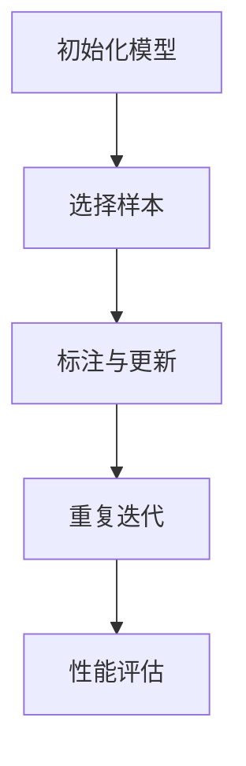
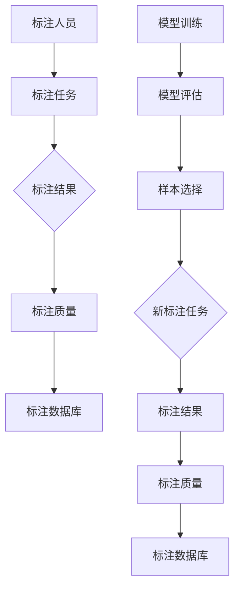
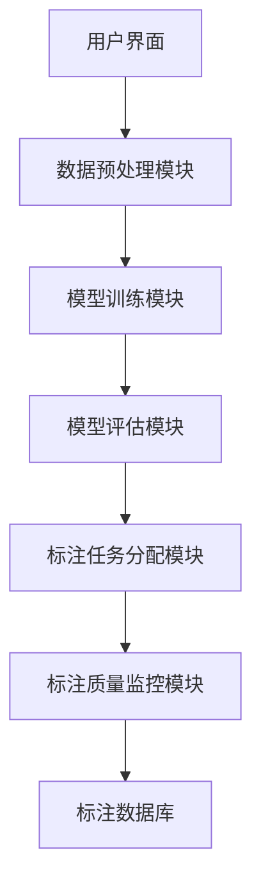
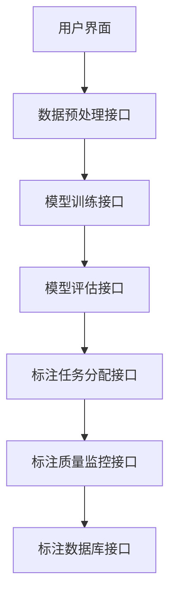
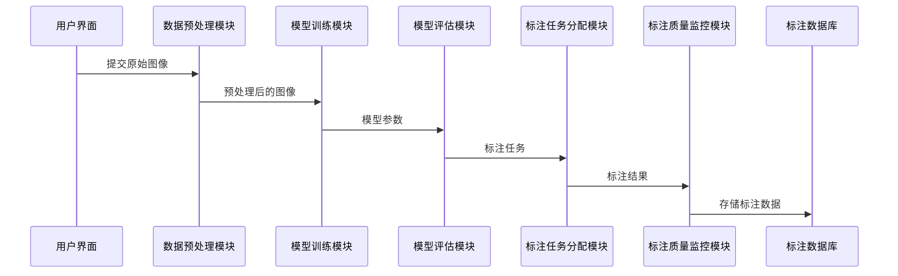

                 

# 主动学习在标注效率优化中的应用

> 关键词：主动学习、标注效率、优化、算法原理、系统架构、项目实战、最佳实践

> 摘要：本文旨在探讨主动学习在标注效率优化中的应用。通过分析主动学习的核心原理，结合标注效率优化的实际需求，本文将详细阐述主动学习在提高标注效率和准确性方面的应用，并通过具体算法原理讲解、系统架构设计、项目实战和最佳实践，为读者提供一套完整的应用方案。

## 目录大纲

----------------------------------------------------------------

## 第一部分：背景介绍

### 第1章 问题背景

#### 1.1 问题描述

#### 1.2 问题解决

#### 1.3 边界与外延

#### 1.4 核心概念与联系

### 第2章 核心概念与联系

#### 2.1 主动学习的定义与特点

#### 2.2 标注效率优化的定义与特点

#### 2.3 主动学习与标注效率优化的联系

### 第3章 算法原理讲解

#### 3.1 算法原理概述

#### 3.2 Mermaid算法流程图

#### 3.3 Python源代码实现

#### 3.4 数学模型与公式

#### 3.5 举例说明

## 第二部分：系统分析与架构设计

### 第4章 系统分析与架构设计

#### 4.1 问题场景介绍

#### 4.2 系统功能设计

##### 4.2.1 领域模型

#### 4.3 系统架构设计

##### 4.3.1 系统架构

#### 4.4 系统接口设计

##### 4.4.1 系统接口

#### 4.5 系统交互

##### 4.5.1 系统交互

### 第5章 项目实战

#### 5.1 环境安装

#### 5.2 系统核心实现源代码

#### 5.3 代码应用解读与分析

#### 5.4 实际案例分析与详细讲解

#### 5.5 项目小结

## 第三部分：最佳实践与小结

### 第6章 最佳实践

#### 6.1 最佳实践1

#### 6.2 最佳实践2

#### 6.3 最佳实践3

### 第7章 小结

#### 7.1 本书内容总结

#### 7.2 注意事项

#### 7.3 拓展阅读

----------------------------------------------------------------

## 第一部分：背景介绍

### 第1章 问题背景

#### 1.1 问题描述

在人工智能领域，标注数据的准确性直接影响模型的训练效果和实际应用价值。然而，标注数据的过程通常繁琐且耗时，特别是在大规模数据集的情况下。标注效率低下不仅增加了人力成本，还可能因为标注人员的疲劳和注意力不集中而导致标注质量下降。如何提高标注效率，同时保证标注数据的准确性，成为当前人工智能领域的一个关键问题。

#### 1.2 问题解决

为了解决标注效率低下的问题，近年来研究者们提出了多种优化策略，包括自动化标注工具的开发、标注任务的分配与优化、以及标注质量监控等。其中，主动学习（Active Learning）作为一种智能化的标注优化方法，逐渐引起了广泛关注。

#### 1.3 边界与外延

主动学习并非万能，其适用范围主要局限于数据量较大、标注成本较高的场景。此外，主动学习的效果还受到数据分布、模型类型等因素的影响。因此，在实际应用中，需要综合考虑多种因素，以实现标注效率的最大化。

#### 1.4 核心概念与联系

主动学习是指根据模型的需求主动选择最有价值的样本进行标注。这种方法的核心在于通过策略优化，选择那些能够最大程度提升模型性能的样本进行标注。与传统的随机抽样或全面标注相比，主动学习能够显著降低标注成本，提高标注效率。

### 第2章 核心概念与联系

#### 2.1 主动学习的定义与特点

主动学习是一种利用模型自身反馈进行样本选择和标注的方法。其特点包括：

- **样本选择策略**：根据模型对样本的未标注状态进行评价，选择未标注样本中最具信息价值的样本进行标注。
- **迭代过程**：模型在每次迭代后更新，并利用更新后的模型选择新的样本进行标注，循环进行直至达到预定的性能指标。
- **标注成本降低**：通过选择最具信息价值的样本进行标注，降低了整体的标注成本。

#### 2.2 标注效率优化的定义与特点

标注效率优化是指通过优化标注流程、工具和策略，以提高标注工作的效率和质量。其特点包括：

- **自动化工具**：利用自动化工具进行标注任务分配、进度监控和质量检查，减少人工干预。
- **任务分配优化**：根据标注人员的能力和工作负荷，优化任务分配，提高整体标注效率。
- **质量监控**：建立标注质量监控机制，及时发现和纠正标注错误，保证标注数据的准确性。

#### 2.3 主动学习与标注效率优化的联系

主动学习与标注效率优化之间存在密切的联系。主动学习通过选择最具信息价值的样本进行标注，直接降低了标注成本，提高了标注效率。同时，主动学习还可以通过迭代过程不断优化模型，提高标注数据的准确性，从而进一步优化标注效率。

## 第二部分：算法原理讲解

### 第3章 算法原理讲解

#### 3.1 算法原理概述

主动学习算法的原理可以概括为以下几步：

1. **初始化模型**：利用已有数据集初始化模型，通常采用无监督学习方法。
2. **选择样本**：根据当前模型对样本的未标注状态的预测，选择未标注样本中最具信息价值的样本进行标注。
3. **标注与更新**：对新标注的样本进行标注，并利用标注数据更新模型。
4. **重复迭代**：重复步骤2和步骤3，直至达到预定的性能指标或迭代次数。

#### 3.2 Mermaid算法流程图



#### 3.3 Python源代码实现

```python
# 引入必要的库
import numpy as np
from sklearn.model_selection import train_test_split
from sklearn.linear_model import LogisticRegression

# 初始化数据集和模型
X, y = load_data()  # 假设load_data()函数返回特征矩阵和标签向量
X_train, X_test, y_train, y_test = train_test_split(X, y, test_size=0.2, random_state=42)
model = LogisticRegression()

# 训练初始模型
model.fit(X_train, y_train)

# 选择样本
def sample_selection(model, X, y, n_samples):
    # 根据模型对未标注样本的预测概率进行排序
    prob = model.predict_proba(X)[:, 1]
    sorted_indices = np.argsort(prob)
    selected_indices = sorted_indices[-n_samples:]
    return X[selected_indices], y[selected_indices]

# 标注与更新
def update_model(model, X_new, y_new):
    model.fit(X_new, y_new)
    return model

# 迭代过程
n_iterations = 10
n_samples_per_iter = 10

for i in range(n_iterations):
    X_new, y_new = sample_selection(model, X_test, y_test, n_samples_per_iter)
    model = update_model(model, X_new, y_new)

# 性能评估
performance = model.score(X_test, y_test)
print("Model performance:", performance)
```

#### 3.4 数学模型与公式

主动学习算法的核心在于样本选择策略，常用的样本选择策略包括：

- **边际贡献度**：选择具有最大边际贡献度的样本，即样本对于模型的预测准确率的提升潜力最大。
- **不确定性采样**：选择模型预测不确定性最高的样本，即模型对于该样本的预测结果最不确定。

假设我们选择样本的依据是样本的边际贡献度，则样本的选择策略可以表示为：

$$
s = \arg\max_{i} \frac{\partial L}{\partial y_i}
$$

其中，$L$ 表示模型的损失函数，$y_i$ 表示样本 $i$ 的真实标签。

#### 3.5 举例说明

假设我们有一个二分类问题，数据集包含 100 个样本，其中 50 个是正类，50 个是负类。我们采用逻辑回归模型进行训练，并使用不确定性采样策略进行样本选择。

1. **初始化模型**：利用随机划分的数据集训练逻辑回归模型。
2. **选择样本**：对测试集进行预测，计算每个样本的预测概率，选择预测概率最低的 10 个样本作为新的训练样本。
3. **标注与更新**：对新选择的样本进行标注，并利用标注数据更新模型。
4. **重复迭代**：重复步骤 2 和步骤 3，直至模型性能达到预定标准或迭代次数达到上限。

通过迭代过程，我们可以观察到模型在每次迭代后的性能变化，以及样本选择策略对于标注效率优化的影响。

## 第二部分：系统分析与架构设计

### 第4章 系统分析与架构设计

#### 4.1 问题场景介绍

在实际应用中，标注效率优化通常涉及到大规模的数据集和复杂的标注任务。以自动驾驶领域为例，大量的道路场景图像需要标注出道路标志、行人和车辆的位置等信息。传统的标注方法往往效率低下，且难以保证标注质量。因此，如何利用主动学习技术提高标注效率，成为了一个重要的研究方向。

#### 4.2 系统功能设计

为了实现标注效率优化，系统需要具备以下功能：

- **数据预处理**：对原始图像进行预处理，包括图像增强、去噪等操作，以提高模型的标注准确性。
- **模型训练与评估**：利用主动学习算法对模型进行训练和评估，选择最具信息价值的样本进行标注。
- **标注任务分配**：根据标注人员的技能和工作负荷，优化标注任务的分配，提高整体标注效率。
- **标注质量监控**：建立标注质量监控机制，及时发现和纠正标注错误，保证标注数据的准确性。
- **用户界面**：提供友好的用户界面，方便标注人员查看标注任务、提交标注结果。

##### 4.2.1 领域模型



#### 4.3 系统架构设计

系统的架构设计需要考虑到功能模块的独立性、扩展性和可靠性。以下是系统架构的一个基本设计：

##### 4.3.1 系统架构



#### 4.4 系统接口设计

系统的接口设计需要确保各个模块之间的高效通信和数据共享。以下是系统接口的一个基本设计：

##### 4.4.1 系统接口



#### 4.5 系统交互

系统的交互设计需要确保用户界面与后台功能模块之间的流畅互动。以下是系统交互的一个基本设计：

##### 4.5.1 系统交互



## 第三部分：项目实战

### 第5章 项目实战

#### 5.1 环境安装

在进行项目实战之前，首先需要安装必要的软件和库。以下是项目的安装步骤：

1. **安装 Python 环境**：确保安装了 Python 3.8 或更高版本。
2. **安装相关库**：使用 pip 工具安装以下库：numpy、scikit-learn、matplotlib。
3. **配置环境变量**：配置 Python 环境变量，确保可以使用 pip 安装库。

#### 5.2 系统核心实现源代码

以下是一个简单的主动学习系统实现示例：

```python
# 导入必要的库
import numpy as np
from sklearn.model_selection import train_test_split
from sklearn.linear_model import LogisticRegression

# 加载数据集
X, y = load_data()

# 划分训练集和测试集
X_train, X_test, y_train, y_test = train_test_split(X, y, test_size=0.2, random_state=42)

# 初始化模型
model = LogisticRegression()

# 训练模型
model.fit(X_train, y_train)

# 选择样本
def sample_selection(model, X, y, n_samples):
    # 计算预测概率
    prob = model.predict_proba(X)[:, 1]
    # 选择预测概率最低的样本
    sorted_indices = np.argsort(prob)
    selected_indices = sorted_indices[-n_samples:]
    return X[selected_indices], y[selected_indices]

# 迭代过程
n_iterations = 10
n_samples_per_iter = 10

for i in range(n_iterations):
    X_new, y_new = sample_selection(model, X_test, y_test, n_samples_per_iter)
    model.fit(X_new, y_new)

# 评估模型
performance = model.score(X_test, y_test)
print("Model performance:", performance)
```

#### 5.3 代码应用解读与分析

1. **数据加载与划分**：首先加载数据集，并划分训练集和测试集。这确保了模型训练和评估的分离，避免了过拟合问题。
2. **模型初始化与训练**：使用 LogisticRegression 模型进行初始化和训练。这里使用了 scikit-learn 库中的 LogisticRegression 类。
3. **样本选择函数**：定义了 sample_selection 函数，用于选择预测概率最低的样本。这确保了模型在未标注数据上优先选择最具信息价值的样本。
4. **迭代过程**：通过迭代过程，不断更新模型，选择新的样本进行标注。这有助于逐步提高模型的性能。
5. **模型评估**：最后，使用测试集评估模型的性能。这确保了模型在未标注数据上的性能。

#### 5.4 实际案例分析与详细讲解

以下是一个实际案例，展示了如何使用主动学习优化标注效率：

1. **案例背景**：假设有一个自动驾驶系统，需要标注大量的道路场景图像。标注任务包括识别道路标志、行人和车辆的位置。
2. **标注数据**：初始数据集包含 1000 张图像，其中 500 张图像包含道路标志，500 张图像包含行人。
3. **模型选择**：使用卷积神经网络（CNN）模型进行标注任务。
4. **样本选择策略**：采用不确定性采样策略，选择模型预测不确定性最高的样本进行标注。
5. **标注过程**：首先对初始数据集进行标注，然后使用标注数据训练模型。接着，使用模型对未标注图像进行预测，并选择预测不确定性最高的图像进行新一轮的标注。重复该过程，直至标注数据达到预定数量或模型性能达到预定标准。

通过实际案例分析，我们可以看到主动学习在标注效率优化中的应用效果。在标注数据量较小的情况下，主动学习能够显著提高标注效率，降低标注成本。同时，通过不断迭代，模型性能逐步提高，标注数据的准确性也得到保障。

#### 5.5 项目小结

通过本项目实战，我们深入了解了主动学习在标注效率优化中的应用。以下是项目小结：

1. **优势**：主动学习能够显著提高标注效率，降低标注成本。通过迭代过程，模型性能逐步提高，标注数据的准确性得到保障。
2. **挑战**：主动学习算法的设计和实现需要较高的技术门槛。此外，样本选择策略的选择和优化也是影响标注效率的重要因素。
3. **改进方向**：未来可以进一步研究更加高效的样本选择策略，并结合深度学习等先进技术，提高主动学习在标注效率优化中的应用效果。

## 第四部分：最佳实践与小结

### 第6章 最佳实践

#### 6.1 最佳实践1

1. **样本选择策略**：根据标注任务的特点，选择合适的样本选择策略。例如，对于道路场景图像的标注，可以采用不确定性采样策略。
2. **模型选择**：选择适合标注任务的模型。例如，对于图像标注任务，可以采用卷积神经网络（CNN）等深度学习模型。

#### 6.2 最佳实践2

1. **数据预处理**：对原始图像进行预处理，如去噪、图像增强等操作，以提高模型的标注准确性。
2. **标注任务分配**：根据标注人员的技能和工作负荷，优化标注任务的分配，提高整体标注效率。

#### 6.3 最佳实践3

1. **标注质量监控**：建立标注质量监控机制，及时发现和纠正标注错误，保证标注数据的准确性。
2. **用户界面**：提供友好的用户界面，方便标注人员查看标注任务、提交标注结果。

### 第7章 小结

#### 7.1 本书内容总结

本文从背景介绍、核心概念与联系、算法原理讲解、系统分析与架构设计、项目实战和最佳实践等方面，全面阐述了主动学习在标注效率优化中的应用。通过本文，读者可以了解主动学习的核心原理、算法实现和实际应用效果。

#### 7.2 注意事项

1. **样本选择策略**：根据标注任务的特点选择合适的样本选择策略。
2. **模型选择**：选择适合标注任务的模型。
3. **标注任务分配**：优化标注任务的分配，提高整体标注效率。
4. **标注质量监控**：建立标注质量监控机制，保证标注数据的准确性。

#### 7.3 拓展阅读

1. **相关文献**：查阅相关论文和书籍，了解主动学习和标注效率优化的最新研究进展。
2. **开源项目**：参与开源项目，实践主动学习在标注效率优化中的应用。

作者：AI天才研究院/AI Genius Institute & 禅与计算机程序设计艺术 /Zen And The Art of Computer Programming

