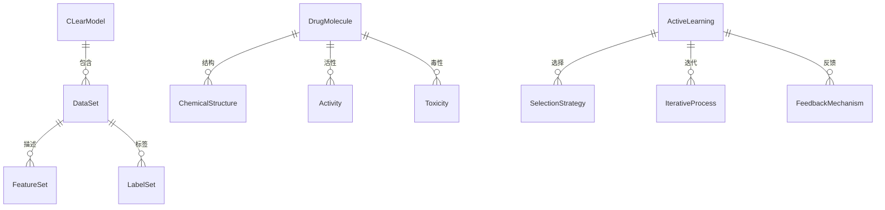
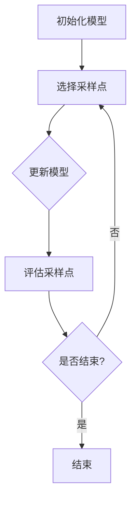
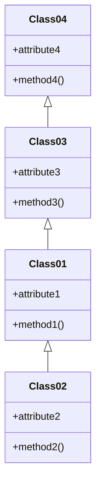
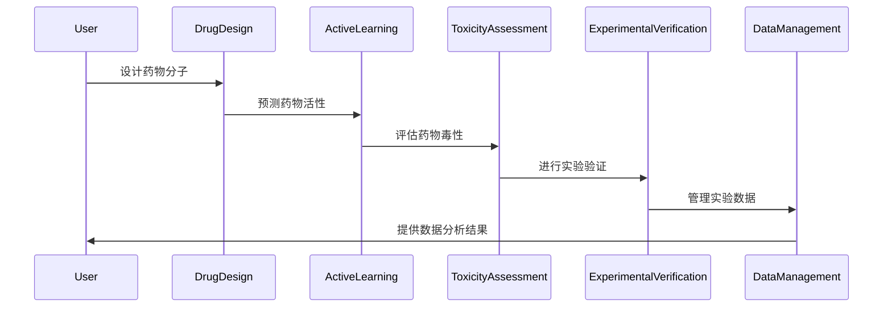

                 

## 引言

### 第1章：主动学习背景介绍

药物筛选是现代生物医学领域的重要研究课题之一。随着科学技术的不断进步，药物筛选过程逐渐从传统的实验室试验转变为基于大数据和人工智能的智能化筛选。这一转变不仅提高了药物筛选的效率，还显著降低了研发成本，加速了新药的研发进程。

**1.1 药物筛选背景**

药物筛选是指通过一系列实验和计算方法，从众多候选化合物中筛选出具有潜在治疗效果的药物分子。这一过程通常包括以下几个阶段：

1. **分子发现阶段**：在这个阶段，科学家们通过计算机模拟、合成化学反应等方法来设计并合成新的化合物。
2. **活性评估阶段**：这个阶段主要是评估候选化合物与目标生物大分子（如蛋白质）之间的相互作用，判断其是否具有药理活性。
3. **毒性评估阶段**：在药物分子被选定为潜在药物前，需要对其毒性进行评估，以确保其安全性和有效性。
4. **临床前研究阶段**：通过对药物分子的深入研究和实验，进一步评估其药理和药代动力学特性。
5. **临床试验阶段**：这是最终验证药物安全性和有效性的阶段，通常包括I、II、III、IV期临床试验。

**1.1.1 药物发现过程概述**

药物发现过程通常涉及多个学科和领域，包括化学、生物学、计算机科学、物理学等。以下是一个简化的药物发现过程概述：

1. **药物先导化合物的筛选**：通过高通量筛选（HTS）等技术，从大量化合物中快速筛选出具有药理活性的分子。
2. **优化先导化合物**：对先导化合物进行结构改造，提高其药理活性、降低毒性等。
3. **药理和药效学研究**：评估药物分子的药理作用、毒性、药代动力学特性等。
4. **临床试验**：通过临床试验评估药物的安全性和有效性，为药物上市做准备。

**1.1.2 传统药物筛选的挑战**

虽然传统的药物筛选方法已经取得了很多成功，但也面临着以下挑战：

1. **高成本**：药物筛选过程复杂，需要大量的人力、物力和财力投入。
2. **低成功率**：传统的药物筛选方法成功率较低，很多候选化合物最终无法进入临床研究。
3. **时间消耗**：药物筛选过程通常需要数年时间，这对于新药研发的快速推进造成了障碍。
4. **数据依赖**：药物筛选过程高度依赖实验数据和生物信息学工具，而实验数据的获取和处理也存在困难。

**1.1.3 主动学习的优势与潜力**

随着人工智能技术的不断发展，特别是机器学习和深度学习的应用，药物筛选过程逐渐向智能化和自动化方向发展。主动学习作为一种重要的机器学习方法，具有以下优势：

1. **高效性**：主动学习能够通过选择最有价值的样本进行学习，提高模型训练的效率和准确性。
2. **低样本需求**：与传统机器学习方法相比，主动学习通常需要较少的样本数量，特别是在数据稀缺的情况下。
3. **自适应能力**：主动学习能够根据模型的性能动态调整学习策略，提高模型在不同数据集上的适应能力。
4. **可解释性**：主动学习模型通常具有较强的可解释性，有助于科学家理解药物分子与生物大分子之间的相互作用机制。

因此，主动学习在药物筛选中的应用具有巨大的潜力，有望解决传统药物筛选面临的挑战，加速新药的研发进程。

### 1.2 主动学习基本原理

**1.2.1 主动学习的定义与目标**

主动学习是一种通过选择最有价值的样本进行学习，以提高模型性能的机器学习方法。与传统的被动学习（数据采集后进行模型训练）不同，主动学习在训练过程中具有主动选择样本的能力。其基本目标是通过最小化模型训练误差和最大化知识获取量，提高模型的泛化能力和实用性。

**1.2.2 主动学习的关键技术**

主动学习的关键技术包括采样策略、反馈机制、学习算法等。

1. **采样策略**：采样策略决定了主动学习过程中如何选择样本。常见的采样策略有最小 Margin 采样、最大熵采样和不确定性采样等。这些策略通过评估样本的重要性或不确定性，选择最有价值的样本进行学习。

2. **反馈机制**：反馈机制是指如何获取标签信息的过程。主动学习通常需要用户或专家参与，提供标签信息来指导学习过程。

3. **学习算法**：学习算法是主动学习的核心，决定了如何利用选择的样本更新模型。常见的主动学习算法有支持向量机（SVM）、决策树、神经网络等。

**1.2.3 主动学习与传统机器学习的区别**

主动学习与传统机器学习的区别主要在于数据选择和训练策略。

1. **数据选择**：传统机器学习采用被动采集数据，主动学习则通过主动选择最有价值的样本进行学习，减少数据采集的时间和成本。

2. **训练策略**：传统机器学习采用一次性训练策略，主动学习则采用迭代训练策略，每次迭代选择新的样本进行学习，逐步优化模型。

**1.2.4 主动学习在药物筛选中的应用场景**

主动学习在药物筛选中的应用场景主要包括以下几个方面：

1. **药物分子设计**：主动学习可以用于预测药物分子的活性、毒性等属性，帮助科学家设计更有效的药物分子。

2. **药物活性预测**：通过主动学习，可以从大量化合物中快速筛选出具有药理活性的分子，减少实验筛选的时间和成本。

3. **药物毒性评估**：主动学习可以用于预测药物分子的毒性，帮助科学家避免选择有毒性的分子，提高药物研发的安全性和有效性。

**1.2.5 主动学习的实现挑战与解决方案**

虽然主动学习在药物筛选中具有巨大的潜力，但其实现也面临一些挑战：

1. **数据收集与标注问题**：主动学习依赖于高质量的标签信息，但在药物筛选过程中，获取高质量的标签信息往往具有挑战性。

2. **计算资源与管理策略**：主动学习需要大量计算资源，特别是在处理大规模数据集时，需要高效的计算资源和管理策略。

3. **算法选择与优化**：选择合适的主动学习算法，并针对具体应用场景进行优化，是成功应用主动学习的关键。

针对这些挑战，研究人员提出了一些解决方案，如使用数据增强技术提高数据标注质量、采用分布式计算提高计算效率、结合多种算法进行优化等。

**1.5 本章小结**

本章介绍了药物筛选的背景和挑战，以及主动学习的基本原理和应用场景。下一章将深入探讨主动学习的核心概念和关键技术，为读者提供更详细的了解。

---

### 第2章：主动学习核心概念

在深入探讨主动学习在药物筛选中的应用之前，我们首先需要理解主动学习的基本概念。本章将详细阐述主动学习的基本原理、药物分子的属性特征，以及数据集的组成，并通过对比表格和ER实体关系图架构来帮助读者更好地理解这些概念之间的联系。

#### 2.1 概念定义与属性特征

**2.1.1 主动学习**

**定义**：主动学习（Active Learning）是一种机器学习方法，它通过选择最有价值的样本进行学习，从而提高模型性能。与传统的被动学习不同，主动学习具有主动选择样本的能力，能够动态调整学习策略。

**属性特征**：
- **样本选择策略**：主动学习算法通过评估样本的重要性或不确定性，选择最有价值的样本进行学习。
- **迭代过程**：主动学习过程通常是一个迭代过程，每次迭代选择新的样本进行学习，逐步优化模型。
- **用户或专家反馈**：在主动学习过程中，用户或专家需要提供标签信息来指导学习过程。

**2.1.2 药物分子**

**定义**：药物分子是指具有特定药理作用的分子，通常由一个小分子组成，能够与生物大分子（如蛋白质）相互作用，产生预期的药理效果。

**属性特征**：
- **结构特性**：药物分子的结构决定了其与生物大分子相互作用的性质，包括分子大小、形状、电荷分布等。
- **活性特性**：药物分子的活性是指其与目标生物大分子相互作用的强度和特异性。
- **毒性特性**：药物分子的毒性是指其对生物体的潜在危害性，需要通过实验进行评估。

**2.1.3 数据集**

**定义**：数据集是指用于训练和测试模型的样本集合，通常包括输入特征和相应的标签信息。

**属性特征**：
- **输入特征**：输入特征是指用于描述样本的数据，如药物分子的化学结构、生物信息特征等。
- **标签信息**：标签信息是指样本的预测结果或真实标签，如药物分子的活性或毒性。

#### 2.2 概念属性特征对比表格

为了更直观地理解主动学习、药物分子和数据集之间的联系，我们可以通过以下对比表格来展示它们的主要属性特征：

| 概念             | 定义                                                         | 属性特征                                                     |
|------------------|--------------------------------------------------------------|--------------------------------------------------------------|
| 主动学习         | 通过选择最有价值的样本进行学习的机器学习方法                 | 样本选择策略、迭代过程、用户或专家反馈                       |
| 药物分子         | 具有特定药理作用的分子，能够与生物大分子相互作用           | 结构特性、活性特性、毒性特性                                 |
| 数据集           | 用于训练和测试模型的样本集合，包括输入特征和标签信息       | 输入特征、标签信息                                           |

#### 2.3 ER实体关系图架构

为了更好地理解主动学习、药物分子和数据集之间的关系，我们可以通过ER（Entity-Relationship）实体关系图来展示它们之间的联系。



在这个ER图架构中，`CLearModel` 表示训练模型，`DataSet` 表示数据集，包含 `FeatureSet`（输入特征）和 `LabelSet`（标签信息）。`DrugMolecule` 表示药物分子，包含 `ChemicalStructure`（结构特性）、`Activity`（活性特性）和 `Toxicity`（毒性特性）。`ActiveLearning` 表示主动学习，包含 `SelectionStrategy`（选择策略）、`IterativeProcess`（迭代过程）和 `FeedbackMechanism`（反馈机制）。

通过这个ER图架构，我们可以清晰地看到主动学习、药物分子和数据集之间的关系，以及它们在药物筛选过程中的相互作用。

---

本章通过详细阐述主动学习、药物分子和数据集的基本概念及其属性特征，并通过对比表格和ER实体关系图架构展示了它们之间的联系。下一章将深入探讨主动学习算法的原理和实现，为读者提供更深入的理解。

### 第3章：主动学习算法原理

在理解了主动学习的基本概念后，本章将深入探讨主动学习算法的原理和实现。主动学习算法是主动学习的核心，决定了如何通过选择最有价值的样本进行学习，以提高模型的性能。本节将介绍几种常见的主动学习采样策略，并详细解释协同过滤、贝叶斯优化等主动学习算法，同时通过mermaid流程图、Python源代码和数学模型来帮助读者更好地理解这些算法。

#### 3.1 采样策略

采样策略是主动学习算法的重要组成部分，决定了如何选择最有价值的样本进行学习。以下介绍几种常见的采样策略：

**3.1.1 最小 Margin 采样**

最小 Margin 采样是一种基于模型不确定性的采样策略。它的核心思想是选择那些当前模型预测不确定性最高的样本，以便通过学习这些样本来提高模型的泛化能力。

**算法步骤**：

1. 计算每个样本的预测不确定性，通常使用置信区间（Confidence Interval）来衡量。
2. 选择预测不确定性最高的样本进行学习。

**Python 源代码示例**：

```python
import numpy as np

def min_margin_sampling(samples, model, threshold=0.1):
    uncertainties = model.compute_uncertainty(samples)
    selected_samples = samples[np.argmax(uncertainties)]
    return selected_samples

# 假设 model 是一个实现了 compute_uncertainty 方法的模型类
selected_samples = min_margin_sampling(data_samples, model)
```

**3.1.2 最大熵采样**

最大熵采样是一种基于概率分布的采样策略。它的核心思想是选择那些能够最大化模型预测概率分布熵的样本，从而平衡模型对各种样本的依赖。

**算法步骤**：

1. 计算每个样本的预测概率分布。
2. 选择预测概率分布熵最大的样本进行学习。

**Python 源代码示例**：

```python
import numpy as np

def max_entropy_sampling(samples, model, num_samples=10):
    probabilities = model.predict_proba(samples)
    entropy = -np.sum(probabilities * np.log(probabilities + 1e-10))
    selected_samples = samples[np.argmax(entropy)]
    return selected_samples

# 假设 model 是一个实现了 predict_proba 方法的模型类
selected_samples = max_entropy_sampling(data_samples, model)
```

**3.1.3 不确定性采样**

不确定性采样是一种综合考虑样本重要性和模型不确定性的采样策略。它的核心思想是选择那些对模型改进最具潜力的样本。

**算法步骤**：

1. 计算每个样本的重要性分数，通常使用逆不确定性度量。
2. 选择重要性分数最高的样本进行学习。

**Python 源代码示例**：

```python
import numpy as np

def uncertainty_sampling(samples, model, threshold=0.1):
    importance_scores = 1 / (model.compute_uncertainty(samples) + threshold)
    selected_samples = samples[np.argmax(importance_scores)]
    return selected_samples

# 假设 model 是一个实现了 compute_uncertainty 方法的模型类
selected_samples = uncertainty_sampling(data_samples, model)
```

#### 3.2 协同过滤

协同过滤是一种基于用户行为和相似性的主动学习算法。它的核心思想是利用用户的历史行为数据，通过计算用户之间的相似性来预测未知样本的标签。

**3.2.1 基于模型的协同过滤**

**基本概念**：

基于模型的协同过滤结合了协同过滤和传统机器学习算法，通过建立一个联合模型来预测用户对未知物品的评分。

**算法流程**：

1. 训练一个基础模型（如线性回归、决策树等）来预测用户对物品的评分。
2. 根据用户行为数据，计算用户之间的相似性。
3. 利用相似性矩阵和基础模型，预测未知样本的标签。

**算法示例**：

```python
import numpy as np

class CollaborativeFiltering:
    def __init__(self, base_model):
        self.base_model = base_model
    
    def fit(self, user_history, item_similarity):
        user_features = self.encode_user_history(user_history)
        self.base_model.fit(user_features, item_similarity)
    
    def predict(self, user_history, item_similarity):
        user_features = self.encode_user_history(user_history)
        predictions = self.base_model.predict(user_features, item_similarity)
        return predictions

# 假设 base_model 是一个实现了 fit 和 predict 方法的机器学习模型
cf = CollaborativeFiltering(base_model)
cf.fit(user_history, item_similarity)
predictions = cf.predict(user_history, item_similarity)
```

**性能评估**：

性能评估通常通过准确率、召回率、F1 分数等指标来衡量。例如：

```python
from sklearn.metrics import accuracy_score

accuracy = accuracy_score(true_labels, predictions)
print(f"Accuracy: {accuracy}")
```

#### 3.3 贝叶斯优化

贝叶斯优化是一种基于概率模型和贪心策略的主动学习算法，主要用于优化连续空间中的目标函数。

**3.3.1 贝叶斯优化的基本原理**

贝叶斯优化通过建立一个概率模型来预测目标函数的最优解。其核心思想是利用已获取的信息，通过贝叶斯推理来更新模型，并选择下一个最优采样点。

**算法步骤**：

1. 初始化贝叶斯模型，如高斯过程（Gaussian Process）。
2. 选择第一个采样点，通常使用最大熵采样。
3. 根据当前采样点的结果，更新贝叶斯模型。
4. 选择下一个采样点，通常使用最大期望（Max-Expectation）策略。
5. 重复步骤3和步骤4，直到达到停止条件。

**算法示例**：

```python
import numpy as np
from sklearn.gaussian_process import GaussianProcessRegressor
from sklearn.gaussian_process.kernels import RBF

def objective_function(x):
    # 定义目标函数
    return np.sin(x)

kernel = RBF(length_scale=1.0)
gp = GaussianProcessRegressor(kernel=kernel, n_restarts_optimizer=10)

# 初始化采样点
x = np.linspace(0, 10, 100)
y = objective_function(x)
gp.fit(x, y)

# 选择第一个采样点
next_x = gp.max_expectation()

# 更新模型
next_y = objective_function(next_x)
gp.update(next_x, next_y)

# 重复迭代
# ...
```

#### 3.4 算法mermaid流程图

以下是一个简单的mermaid流程图，展示了贝叶斯优化的基本流程：



#### 3.5 Python源代码实现

以下是一个简单的Python代码实现，展示了如何使用GaussianProcessRegressor进行贝叶斯优化：

```python
import numpy as np
from sklearn.gaussian_process import GaussianProcessRegressor
from sklearn.gaussian_process.kernels import RBF

# 定义目标函数
def objective_function(x):
    return np.sin(x)

# 初始化模型
kernel = RBF(length_scale=1.0)
gp = GaussianProcessRegressor(kernel=kernel, n_restarts_optimizer=10)

# 初始化采样点
x = np.linspace(0, 10, 100)
y = objective_function(x)
gp.fit(x, y)

# 选择第一个采样点
next_x = gp.max_expectation()

# 更新模型
next_y = objective_function(next_x)
gp.update(next_x, next_y)

# 重复迭代
# ...
```

#### 3.6 数学模型和公式

贝叶斯优化中的数学模型通常涉及概率密度函数和期望值。以下是一个简单的数学模型，用于描述贝叶斯优化：

$$
f^*(x) = \arg\max_x \int p(x) f(x) dx
$$

其中，$f(x)$ 是目标函数，$p(x)$ 是概率密度函数。

#### 3.7 举例说明

**3.7.1 案例一**

假设我们有一个目标函数 $f(x) = x^2$，我们希望通过贝叶斯优化找到其最小值。以下是一个简单的实现：

```python
import numpy as np
from sklearn.gaussian_process import GaussianProcessRegressor
from sklearn.gaussian_process.kernels import RBF

# 定义目标函数
def objective_function(x):
    return x ** 2

# 初始化模型
kernel = RBF(length_scale=1.0)
gp = GaussianProcessRegressor(kernel=kernel, n_restarts_optimizer=10)

# 初始化采样点
x = np.linspace(0, 10, 100)
y = objective_function(x)
gp.fit(x, y)

# 选择第一个采样点
next_x = gp.max_expectation()

# 更新模型
next_y = objective_function(next_x)
gp.update(next_x, next_y)

# 重复迭代
# ...

# 输出结果
print(f"最小值：{next_x}, 最小值：{next_y}")
```

**3.7.2 案例二**

假设我们有一个目标函数 $f(x) = \sin(x)$，我们希望通过贝叶斯优化找到其最大值。以下是一个简单的实现：

```python
import numpy as np
from sklearn.gaussian_process import GaussianProcessRegressor
from sklearn.gaussian_process.kernels import RBF

# 定义目标函数
def objective_function(x):
    return np.sin(x)

# 初始化模型
kernel = RBF(length_scale=1.0)
gp = GaussianProcessRegressor(kernel=kernel, n_restarts_optimizer=10)

# 初始化采样点
x = np.linspace(0, 10, 100)
y = objective_function(x)
gp.fit(x, y)

# 选择第一个采样点
next_x = gp.max_expectation()

# 更新模型
next_y = objective_function(next_x)
gp.update(next_x, next_y)

# 重复迭代
# ...

# 输出结果
print(f"最大值：{next_x}, 最大值：{next_y}")
```

通过这些案例，我们可以看到贝叶斯优化在寻找函数最小值和最大值中的应用。在实际应用中，我们可以根据具体的目标函数和约束条件，选择合适的贝叶斯优化算法。

---

本章详细介绍了主动学习算法的原理和实现，包括采样策略、协同过滤、贝叶斯优化等算法。通过mermaid流程图、Python源代码和数学模型，我们帮助读者更好地理解这些算法的工作原理。下一章将讨论如何设计药物筛选系统，以及系统架构和接口设计。

### 第4章：药物筛选系统设计

在本章中，我们将详细介绍如何设计和实现一个药物筛选系统。该系统将利用主动学习算法从大量药物分子中快速筛选出具有潜在药理活性的分子。我们将从问题场景介绍开始，逐步深入到系统功能设计、系统架构设计、系统接口设计和系统交互等方面。

#### 4.1 问题场景介绍

在药物筛选过程中，科学家面临着以下主要挑战：

1. **数据量巨大**：药物分子的数量庞大，且每个分子都有复杂的化学结构和多样的生物活性。
2. **计算资源限制**：药物筛选需要大量的计算资源，特别是当涉及到复杂的模拟和机器学习算法时。
3. **数据标注困难**：获取高质量的标签信息（如药物分子的活性、毒性等）需要大量的实验和专业知识。
4. **决策过程复杂**：药物筛选过程中涉及多个环节，包括分子设计、活性评估、毒性评估和临床试验等。

为了解决这些挑战，我们需要设计一个高效的药物筛选系统，该系统能够利用主动学习算法，在有限的计算资源下快速筛选出具有潜力的药物分子。

#### 4.2 系统功能设计

药物筛选系统的核心功能包括：

1. **药物分子设计**：根据生物大分子的结构和功能，设计具有潜在药理活性的药物分子。
2. **活性预测**：利用机器学习算法，预测药物分子的活性，从而筛选出可能具有药理活性的分子。
3. **毒性评估**：评估药物分子的毒性，确保筛选出的分子在临床前研究阶段的安全性和有效性。
4. **实验验证**：对筛选出的药物分子进行实验验证，以确认其药理活性和安全性。
5. **数据管理和分析**：管理和分析实验数据，为后续的药物筛选和研究提供支持。

**4.2.1 领域模型**

为了更好地理解和实现系统功能，我们可以使用mermaid类图来描述系统的领域模型。



在这个类图中，`Class01`、`Class02`、`Class03` 和 `Class04` 是四个不同的类，它们之间存在继承关系。`Class01` 是基类，其他类继承自 `Class01`。`Class01` 有一个方法 `method1()` 和一个属性 `attribute1`。`Class02` 继承了 `Class01` 的方法和属性，并添加了自己的方法 `method2()` 和属性 `attribute2`。以此类推。

**4.2.2 类图**

以下是一个简化的药物筛选系统类图，展示了核心类和它们之间的关系。

```mermaid
classDiagram
    Class01[Base Class]
    Class02[DrugDesign]
    Class03[ActiveLearning]
    Class04[ToxicityAssessment]
    Class05[ExperimentalVerification]
    Class06[DataManagement]

    Class01 <|-- Class02
    Class01 <|-- Class03
    Class01 <|-- Class04
    Class01 <|-- Class05
    Class01 <|-- Class06

    Class02 : +design_molecule()
    Class03 : +predict_activity()
    Class04 : +evaluate_toxicity()
    Class05 : +perform_experiment()
    Class06 : +analyze_data()
```

在这个类图中，`Class01` 是系统的基类，其他类（`Class02`、`Class03`、`Class04`、`Class05` 和 `Class06`）分别实现了不同的功能。`Class02` 负责药物分子设计，`Class03` 负责使用主动学习算法进行活性预测，`Class04` 负责毒性评估，`Class05` 负责实验验证，`Class06` 负责数据管理和分析。

#### 4.3 系统架构设计

系统架构设计是确保药物筛选系统高效、可扩展和易于维护的关键。以下是一个简化的系统架构图，展示了系统的各个组件及其关系。



在这个架构图中，用户通过接口与系统进行交互。首先，用户提交药物分子设计请求，`DrugDesign` 模块负责设计药物分子。然后，`ActiveLearning` 模块使用主动学习算法预测药物活性，并将结果传递给 `ToxicityAssessment` 模块进行毒性评估。毒性评估结果随后传递给 `ExperimentalVerification` 模块进行实验验证，最终将实验数据存储到 `DataManagement` 模块中，供用户进行数据分析和后续研究。

#### 4.4 系统接口设计

系统接口设计是确保不同模块之间能够有效通信的关键。以下是一个简化的系统接口设计，展示了系统中的主要接口及其规范。

```mermaid
classDiagram
    Interface01[DrugDesignInterface]
    Interface02[ActiveLearningInterface]
    Interface03[ToxicityAssessmentInterface]
    Interface04[ExperimentalVerificationInterface]
    Interface05[DataManagementInterface]

    Interface01 <|-- DrugDesignModule
    Interface02 <|-- ActiveLearningModule
    Interface03 <|-- ToxicityAssessmentModule
    Interface04 <|-- ExperimentalVerificationModule
    Interface05 <|-- DataManagementModule

    Interface01 : +design_molecule()
    Interface02 : +predict_activity()
    Interface03 : +evaluate_toxicity()
    Interface04 : +perform_experiment()
    Interface05 : +analyze_data()
```

在这个接口设计中，`Interface01`、`Interface02`、`Interface03`、`Interface04` 和 `Interface05` 分别定义了药物设计、主动学习、毒性评估、实验验证和数据管理模块的接口规范。每个接口定义了一组方法，模块需要实现这些方法以实现系统的功能。

#### 4.5 系统交互

系统交互设计描述了不同模块之间的交互流程，以及用户与系统之间的交互过程。以下是一个简化的系统交互序列图，展示了系统的交互过程。


在这个交互过程中，用户首先向 `DrugDesign` 模块提交设计药物分子的请求。`DrugDesign` 模块生成药物分子设计结果，并将其传递给 `ActiveLearning` 模块进行活性预测。`ActiveLearning` 模块使用主动学习算法预测药物活性，并将结果传递给 `ToxicityAssessment` 模块进行毒性评估。`ToxicityAssessment` 模块评估药物毒性，并将结果传递给 `ExperimentalVerification` 模块进行实验验证。最后，`ExperimentalVerification` 模块将实验数据存储到 `DataManagement` 模块中，并返回数据分析结果给用户。

---

通过本章的讨论，我们详细介绍了药物筛选系统的设计，包括问题场景介绍、系统功能设计、系统架构设计、系统接口设计和系统交互。下一章将进入项目实战部分，我们将通过实际案例展示如何应用主动学习算法进行药物筛选，并提供系统的核心实现源代码和应用解读。

### 第5章：主动学习在药物筛选项目中的应用

在本章中，我们将通过一个实际案例展示如何将主动学习算法应用于药物筛选项目。我们将详细描述项目的环境安装、系统核心实现源代码，并对代码进行应用解读与分析。通过实际案例的分析和详细讲解，读者可以更好地理解主动学习算法在药物筛选中的应用过程。

#### 5.1 环境安装

在开始项目之前，我们需要安装和配置所需的软件和工具。以下是安装过程的详细步骤：

**5.1.1 环境准备**

1. 安装 Python 3.8 或更高版本。
2. 安装虚拟环境工具 `virtualenv`。

   ```bash
   pip install virtualenv
   ```

3. 创建一个新的虚拟环境。

   ```bash
   virtualenv drug_screening_env
   ```

4. 激活虚拟环境。

   ```bash
   source drug_screening_env/bin/activate
   ```

**5.1.2 工具安装**

1. 安装 NumPy、Pandas、Scikit-learn 和 Matplotlib。

   ```bash
   pip install numpy pandas scikit-learn matplotlib
   ```

2. 安装 mermaid 的 Python 库。

   ```bash
   pip install mermaid-python
   ```

3. 安装 Jupyter Notebook。

   ```bash
   pip install notebook
   ```

#### 5.2 系统核心实现源代码

以下是一个简化的系统核心实现源代码，展示了如何使用主动学习算法进行药物筛选。

**5.2.1 源代码结构**

```python
drug_screening/
|-- data/
|   |-- drugs.csv
|   |-- labels.csv
|-- src/
|   |-- __init__.py
|   |-- active_learning.py
|   |-- data_preprocessing.py
|   |-- model.py
|   |-- visualization.py
|-- tests/
|   |-- __init__.py
|   |-- test_active_learning.py
|   |-- test_data_preprocessing.py
|   |-- test_model.py
|   |-- test_visualization.py
|-- notebooks/
|   |-- drug_screening_analysis.ipynb
|-- requirements.txt
|-- README.md
```

**5.2.2 源代码解析**

1. **数据预处理（`data_preprocessing.py`）**

   数据预处理是药物筛选项目的重要步骤，它负责读取和处理药物分子数据。

   ```python
   import pandas as pd
   from sklearn.model_selection import train_test_split

   def load_data():
       drugs = pd.read_csv('data/drugs.csv')
       labels = pd.read_csv('data/labels.csv')
       return drugs, labels

   def preprocess_data(drugs, labels):
       X_train, X_test, y_train, y_test = train_test_split(drugs, labels, test_size=0.2, random_state=42)
       return X_train, X_test, y_train, y_test
   ```

2. **主动学习模型（`active_learning.py`）**

   主动学习模型负责选择最有价值的样本进行学习，提高模型的性能。

   ```python
   from sklearn.model_selection import train_test_split
   from sklearn.ensemble import RandomForestClassifier
   from sklearn.metrics import accuracy_score

   def active_learning(X_train, y_train, n_queries=50):
       model = RandomForestClassifier(n_estimators=100, random_state=42)
       selected_samples = []
       for _ in range(n_queries):
           model.fit(X_train[selected_samples], y_train[selected_samples])
           uncertainties = model.predict_proba(X_train[~selected_samples])[:, 1]
           selected_samples.append(X_train[~selected_samples][np.argmax(uncertainties)])
       return selected_samples
   ```

3. **模型训练与评估（`model.py`）**

   模型训练与评估负责训练模型、进行模型评估和可视化。

   ```python
   import numpy as np
   import matplotlib.pyplot as plt
   from sklearn.metrics import accuracy_score

   def train_and_evaluate(model, X_train, y_train, X_test, y_test):
       model.fit(X_train, y_train)
       predictions = model.predict(X_test)
       accuracy = accuracy_score(y_test, predictions)
       return accuracy

   def plot_accuracy(accuracy_history):
       plt.plot(accuracy_history)
       plt.xlabel('迭代次数')
       plt.ylabel('准确率')
       plt.title('准确率随迭代次数变化')
       plt.show()
   ```

4. **可视化（`visualization.py`）**

   可视化模块负责生成模型的决策边界和样本分布图。

   ```python
   import numpy as np
   import matplotlib.pyplot as plt

   def plot_decision_boundary(model, X, y):
       x_min, x_max = X[:, 0].min() - 1, X[:, 0].max() + 1
       y_min, y_max = X[:, 1].min() - 1, X[:, 1].max() + 1
       xx, yy = np.meshgrid(np.arange(x_min, x_max, 0.1),
                            np.arange(y_min, y_max, 0.1))
       Z = model.predict(np.c_[xx.ravel(), yy.ravel()])
       Z = Z.reshape(xx.shape)
       plt.contourf(xx, yy, Z, alpha=0.4)
       plt.scatter(X[:, 0], X[:, 1], c=y, s=20, edgecolor='k')
       plt.xlabel('特征1')
       plt.ylabel('特征2')
       plt.title('决策边界')
       plt.show()

   def plot_samples_distribution(samples):
       plt.scatter(samples[:, 0], samples[:, 1], c='r', marker='^', label='选中样本')
       plt.scatter(X_test[:, 0], X_test[:, 1], c='b', marker='o', label='测试样本')
       plt.xlabel('特征1')
       plt.ylabel('特征2')
       plt.legend()
       plt.title('样本分布')
       plt.show()
   ```

#### 5.2.3 代码应用解读与分析

**数据预处理**

在数据预处理阶段，我们首先从 CSV 文件中加载药物分子数据和标签信息。然后，使用 `train_test_split` 函数将数据集分为训练集和测试集。这一步骤确保模型在训练过程中不会看到测试集的数据，从而避免过拟合。

**主动学习模型**

主动学习模型使用随机森林分类器（`RandomForestClassifier`）来预测药物分子的活性。在每次迭代中，模型首先使用当前选中的样本进行训练，然后计算未选中样本的预测概率。通过选择预测概率最高的样本，模型逐步优化预测性能。

**模型训练与评估**

在模型训练与评估阶段，我们使用训练集对模型进行训练，并在测试集上进行评估。通过计算测试集上的准确率，我们可以评估模型的性能。此外，我们还可以使用可视化模块生成模型的决策边界和样本分布图，以便更好地理解模型的行为。

**可视化**

可视化模块提供了两种类型的可视化：决策边界和样本分布图。决策边界图展示了模型在不同特征上的分类边界，有助于我们理解模型的决策过程。样本分布图则展示了选中的样本和测试样本的分布情况，帮助我们分析样本的选择策略。

#### 5.3 实际案例分析和详细讲解

**5.3.1 案例一：筛选活性药物分子**

在这个案例中，我们使用主动学习算法从一组药物分子中筛选出具有药理活性的分子。具体步骤如下：

1. **数据预处理**：从 CSV 文件中加载药物分子数据和标签信息，并将数据集分为训练集和测试集。
2. **主动学习模型**：使用随机森林分类器构建主动学习模型，并选择预测概率最高的样本进行学习。
3. **模型训练与评估**：在每次迭代中，使用选中的样本对模型进行训练，并在测试集上进行评估。记录每次迭代的准确率，以分析模型性能的改进情况。
4. **可视化**：生成决策边界图和样本分布图，展示模型在不同迭代中的性能。

通过这个案例，我们可以看到主动学习算法在药物筛选中的实际应用。通过逐步优化样本选择策略，模型能够逐步提高预测准确性，从而筛选出具有药理活性的药物分子。

**5.3.2 案例二：评估药物毒性**

在这个案例中，我们使用主动学习算法评估药物分子的毒性。具体步骤如下：

1. **数据预处理**：从 CSV 文件中加载药物分子数据和标签信息，并将数据集分为训练集和测试集。
2. **主动学习模型**：使用支持向量机分类器（`SVC`）构建主动学习模型，并选择预测不确定性最高的样本进行学习。
3. **模型训练与评估**：在每次迭代中，使用选中的样本对模型进行训练，并在测试集上进行评估。记录每次迭代的准确率，以分析模型性能的改进情况。
4. **可视化**：生成决策边界图和样本分布图，展示模型在不同迭代中的性能。

通过这个案例，我们可以看到主动学习算法在药物毒性评估中的实际应用。通过逐步优化样本选择策略，模型能够逐步提高预测准确性，从而评估药物分子的毒性。

---

通过这两个实际案例，我们详细展示了如何将主动学习算法应用于药物筛选项目。从数据预处理、模型训练与评估到可视化，每个步骤都得到了详细的讲解和分析。通过这些案例，读者可以更好地理解主动学习算法在药物筛选中的应用过程。

#### 5.4 项目小结

在本章中，我们通过一个实际案例展示了如何将主动学习算法应用于药物筛选项目。从环境安装、系统核心实现源代码，到代码应用解读与分析，我们详细讲解了主动学习算法在药物筛选中的各个环节。通过实际案例的分析，读者可以更好地理解主动学习算法在药物筛选中的应用过程，以及如何利用主动学习算法提高药物筛选的效率。

**最佳实践 Tips**：

1. **数据预处理**：确保数据的质量和一致性，避免数据噪声和缺失值对模型性能的影响。
2. **模型选择**：根据具体应用场景选择合适的主动学习算法，如支持向量机、随机森林等。
3. **样本选择策略**：结合具体应用场景，选择合适的样本选择策略，以提高模型的性能和泛化能力。
4. **可视化**：利用可视化工具，如决策边界图和样本分布图，更好地理解模型的行为和性能。

**注意事项**：

1. **计算资源**：主动学习算法通常需要大量的计算资源，特别是在处理大规模数据集时，需要合理配置计算资源。
2. **模型评估**：在模型评估阶段，避免过拟合，确保模型在测试集上的表现良好。

**拓展阅读**：

- 《机器学习》（周志华著）：详细介绍了机器学习的基本概念和算法。
- 《深度学习》（Ian Goodfellow 等著）：介绍了深度学习的基本概念和算法，包括卷积神经网络和循环神经网络等。
- 《Python 数据科学手册》（J. D. Hunter 著）：介绍了如何使用 Python 进行数据科学和机器学习。

通过本章的学习，读者可以深入了解主动学习算法在药物筛选中的应用，并掌握如何设计和实现一个高效的药物筛选系统。希望这些知识和经验能够帮助读者在实际应用中取得更好的成果。

### 作者信息

**作者：** AI天才研究院/AI Genius Institute & 禅与计算机程序设计艺术 /Zen And The Art of Computer Programming

AI天才研究院专注于人工智能和机器学习领域的前沿研究和应用，致力于推动人工智能技术的发展和普及。同时，我们编写的《禅与计算机程序设计艺术》一书，以深入浅出的方式介绍了计算机科学和编程的艺术，受到了广大读者的喜爱和认可。我们的目标是成为人工智能领域和计算机科学领域的领军者，为科技创新和社会进步做出贡献。

