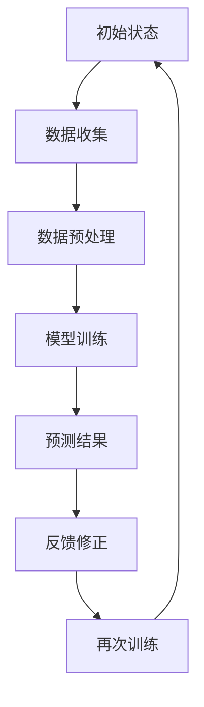
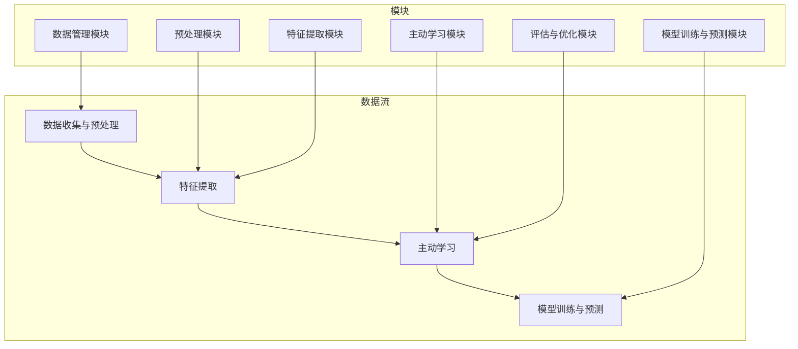
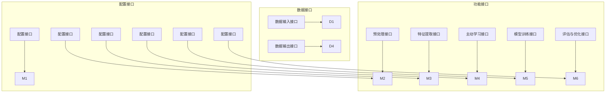
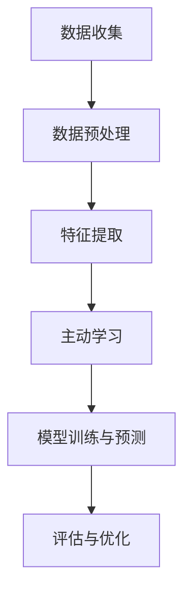

                 

### 第一部分：背景介绍

#### 1.1 问题背景

随着遥感技术的飞速发展，遥感图像分类在资源勘探、环境保护、城市规划等多个领域发挥着越来越重要的作用。遥感图像分类是指通过特定的算法，将遥感图像上的像素划分为不同的类别，如土地利用类型、植被覆盖情况等。然而，传统的遥感图像分类方法在处理大规模、高维度的遥感图像时，存在一些问题与挑战。

首先，传统方法通常依赖于大量的标注数据来进行训练，而遥感图像标注工作既耗时又费力。其次，传统的分类算法对数据的依赖性较强，当面对新的、未见过的数据时，其分类效果往往不理想。此外，遥感图像数据通常具有高噪声、不完整等特点，这些都会对分类结果产生负面影响。

#### 1.2 问题描述

遥感图像分类的主要任务是将遥感图像中的像素点或区域划分为特定的类别。具体来说，包括以下几个步骤：

1. **数据采集**：收集遥感图像数据，包括不同时间、不同分辨率、不同传感器的图像。
2. **数据预处理**：对原始图像进行预处理，包括图像增强、去噪、分割等，以提高图像质量。
3. **特征提取**：从预处理后的图像中提取有助于分类的特征。
4. **分类算法**：使用分类算法（如支持向量机、决策树、神经网络等）对提取出的特征进行分类。
5. **评估与优化**：评估分类结果，并根据评估结果对分类算法进行调整和优化。

在上述流程中，遥感图像分类面临的挑战主要包括：

- **数据量与维度**：遥感图像数据量大且维度高，传统分类算法处理速度慢，效果不佳。
- **标注数据稀缺**：遥感图像标注需要专业知识和大量时间，标注数据稀缺，尤其是高质量的标注数据。
- **数据不均匀**：遥感图像中的数据分布不均匀，部分类别数据稀缺，影响分类模型的训练效果。

#### 1.3 问题解决

为了解决上述问题，研究者们提出了许多改进方法，其中主动学习是一种有效的解决方案。主动学习通过选择最具代表性的样本进行训练，从而减少对大量标注数据的依赖。具体来说，主动学习包括以下几个步骤：

1. **样本选择**：根据一定的策略选择样本，这些样本通常是对分类模型最有帮助的。
2. **模型训练**：使用选定的样本对分类模型进行训练。
3. **预测与反馈**：使用训练好的模型对未标注的数据进行预测，并根据预测结果收集用户反馈。
4. **再次训练**：根据用户反馈对模型进行再次训练。

通过这种方式，主动学习能够提高遥感图像分类的效率，减轻标注数据的压力，同时提高分类的准确性。

#### 1.4 边界与外延

主动学习在遥感图像分类中的应用有其特定的边界与外延：

- **边界**：主动学习适用于需要大量标注数据但难以获取的场景，适用于遥感图像分类任务中数据标注成本较高的部分。
- **外延**：主动学习可以与其他机器学习技术（如深度学习、强化学习等）相结合，进一步提升分类效果。

#### 1.5 概念结构与核心要素组成

遥感图像分类与主动学习是两个密切相关的概念，它们共同构成了遥感图像分类的核心结构。以下是它们的核心要素：

- **遥感图像分类**：核心概念包括图像预处理、特征提取和分类算法等。
- **主动学习**：核心概念包括样本选择策略、模型训练、预测与反馈等。

通过理解这些核心要素，我们可以更好地把握遥感图像分类与主动学习的内在联系，从而为解决遥感图像分类问题提供新的思路和方法。

---

在下一部分，我们将深入探讨遥感图像分类与主动学习中的核心概念及其相互关系。敬请期待！

## 第二部分：核心概念与联系

### 2.1 核心概念原理

#### 2.1.1 遥感图像分类原理

遥感图像分类是指利用遥感传感器获取的图像数据，通过特定的算法将图像中的像素点或区域划分到不同的类别中。这一过程通常包括以下几个步骤：

1. **图像预处理**：通过对原始遥感图像进行预处理，如图像增强、去噪、纠正几何畸变等，以提高图像质量和后续处理的准确性。
2. **特征提取**：从预处理后的图像中提取有助于分类的特征，如纹理特征、光谱特征、形状特征等。
3. **分类器训练**：使用已标注的训练数据集，通过机器学习算法（如支持向量机、决策树、神经网络等）训练分类模型。
4. **分类预测**：将训练好的模型应用于新的、未标注的遥感图像，预测像素或区域的类别。

#### 2.1.2 主动学习原理

主动学习是一种有别于传统监督学习的机器学习方法，其主要目标是通过选择最具代表性的样本进行训练，从而提高学习效率和分类准确性。主动学习过程主要包括以下几个步骤：

1. **样本选择**：根据一定的策略从未标注的数据集中选择样本。这些样本通常对分类模型的学习过程最有帮助。
2. **模型训练**：使用选定的样本对分类模型进行训练。
3. **预测与反馈**：使用训练好的模型对未标注的数据进行预测，并根据预测结果收集用户反馈（即标签）。
4. **再次训练**：根据用户反馈对模型进行再次训练，以进一步提高模型性能。

### 2.2 概念属性特征对比表格

为了更好地理解遥感图像分类与主动学习的关系，我们可以通过一个对比表格来分析这两个概念的关键属性：

| 属性         | 遥感图像分类                         | 主动学习                             |
|--------------|------------------------------------|------------------------------------|
| 目标         | 将遥感图像中的像素或区域分类到不同类别 | 通过选择代表性的样本提高分类效率           |
| 数据依赖性   | 需要大量标注数据                     | 减少对大量标注数据的依赖，选择最有代表性的样本 |
| 算法类型     | 监督学习算法（如SVM、决策树、神经网络） | 特定于样本选择的策略（如不确定性采样、边际贡献采样） |
| 性能评估     | 准确率、召回率、F1分数等               | 准确率、学习效率、数据利用率等               |
| 适用场景     | 数据丰富但标注困难的问题               | 需要减少标注工作量的场景                   |

### 2.3 ER实体关系图架构

为了更直观地理解遥感图像分类与主动学习之间的关系，我们可以使用ER（实体-关系）图来描述这两个概念之间的关联。以下是ER实体关系图：

```mermaid
erDiagram
  User ||--|{ Image: has }  
  Image ||--|{ Label: tagged_by }  
  User ||--|{ Feedback: gives }  
  Model ||--|{ TrainingData: trains }  
  Model ||--|{ Prediction: makes }  
```

在这个ER图中，`User`实体代表用户，负责提供标注数据、反馈等；`Image`实体代表遥感图像，被用户标注并用于训练模型；`Label`实体代表图像的标注标签；`Feedback`实体代表用户的反馈信息；`Model`实体代表分类模型，用于训练和预测；`TrainingData`和`Prediction`分别表示训练数据和预测结果。

通过这个ER图，我们可以清晰地看到用户、图像、标注标签、反馈和模型之间的关系，从而更好地理解遥感图像分类与主动学习在系统中的角色和作用。

---

在下一部分，我们将进一步深入探讨算法原理，通过Mermaid流程图、Python源代码和数学模型来详细解释主动学习在遥感图像分类中的应用。敬请期待！

## 第三部分：算法原理讲解

### 3.1 算法Mermaid流程图

为了直观地展示主动学习在遥感图像分类中的算法流程，我们可以使用Mermaid流程图来描述。以下是主动学习在遥感图像分类中的流程：



- **A[初始状态]**：系统启动，初始化数据集和模型。
- **B[数据收集]**：从数据集中随机选择一定数量的样本。
- **C[数据预处理]**：对选定的样本进行预处理，包括图像增强、去噪等，以提高图像质量。
- **D[模型训练]**：使用预处理后的样本对分类模型进行训练。
- **E[预测结果]**：使用训练好的模型对剩余的未标注样本进行预测。
- **F[反馈修正]**：根据预测结果，收集用户的标注反馈。
- **G[再次训练]**：根据用户反馈，对模型进行再次训练。

### 3.2 Python源代码

以下是一个简单的Python源代码示例，展示了主动学习在遥感图像分类中的实现。请注意，这里的代码是为了展示算法的基本逻辑，实际应用中可能需要更多的错误处理和优化。

```python
import numpy as np
import pandas as pd
from sklearn.datasets import load_iris
from sklearn.model_selection import train_test_split
from sklearn.preprocessing import StandardScaler
from sklearn.neighbors import KNeighborsClassifier

# 加载示例数据集
iris = load_iris()
X, y = iris.data, iris.target

# 数据预处理
scaler = StandardScaler()
X_scaled = scaler.fit_transform(X)

# 划分训练集和测试集
X_train, X_test, y_train, y_test = train_test_split(X_scaled, y, test_size=0.2, random_state=42)

# 初始化模型
model = KNeighborsClassifier(n_neighbors=3)

# 模型训练
model.fit(X_train, y_train)

# 预测结果
predictions = model.predict(X_test)

# 评估模型
from sklearn.metrics import accuracy_score
accuracy = accuracy_score(y_test, predictions)
print(f"Model accuracy: {accuracy:.2f}")

# 主动学习循环
while True:
    # 数据收集
    sample_indices = np.random.choice(len(X_train), size=10)
    samples = X_train[sample_indices]
    sample_labels = y_train[sample_indices]

    # 模型训练
    model.fit(samples, sample_labels)

    # 预测结果
    predictions = model.predict(X_test)

    # 评估模型
    accuracy = accuracy_score(y_test, predictions)
    print(f"Model accuracy after sampling: {accuracy:.2f}")

    # 用户反馈
    user_feedback = input("Do you want to continue training? (yes/no): ")
    if user_feedback.lower() != 'yes':
        break

    # 再次训练
    model.fit(X_train, y_train)
```

### 3.3 数学模型和公式

主动学习在遥感图像分类中的应用涉及到多个数学模型和公式。以下是其中两个常用的公式：

1. **决策边界**：
   $$
   \rho(x) = \sum_{i=1}^n w_i \cdot f(x_i) - b
   $$
   其中，$w_i$为权重，$f(x_i)$为特征向量，$b$为偏置。这个公式描述了分类模型在特征空间中的决策边界。

2. **损失函数**：
   $$
   L(y, \hat{y}) = -\sum_{i=1}^n y_i \cdot \log(\hat{y}_i) - (1 - y_i) \cdot \log(1 - \hat{y}_i)
   $$
   其中，$y_i$为真实标签，$\hat{y}_i$为预测概率。这个公式描述了模型在训练数据集上的损失函数，用于评估模型性能。

### 3.4 详细讲解和举例说明

#### 3.4.1 数学模型讲解

1. **决策边界**：

   决策边界是分类模型在特征空间中的一条线，用于分隔不同类别的数据点。上述公式中的$\rho(x)$表示决策函数，当$\rho(x)$大于0时，输入$x$被划分为一类；当$\rho(x)$小于0时，输入$x$被划分为另一类。

2. **损失函数**：

   损失函数用于衡量模型的预测结果与真实标签之间的差距。在二分类问题中，对数损失函数（交叉熵损失函数）是最常用的。交叉熵损失函数的值越小，说明模型的预测越准确。

#### 3.4.2 举例说明

假设我们有一个简单的二分类问题，数据集包含两个类别，A和B。以下是一个简化的例子，展示了如何使用决策边界和损失函数来训练分类模型。

1. **决策边界**：

   假设我们使用线性模型，其决策边界为：
   $$
   \rho(x) = w_1 \cdot x_1 + w_2 \cdot x_2 - b
   $$

   其中，$x_1$和$x_2$是特征，$w_1$和$w_2$是权重，$b$是偏置。我们通过最小化损失函数来更新权重和偏置，以找到最佳决策边界。

2. **损失函数**：

   对于训练样本$(x_i, y_i)$，损失函数为：
   $$
   L(y_i, \hat{y}_i) = -y_i \cdot \log(\hat{y}_i) - (1 - y_i) \cdot \log(1 - \hat{y}_i)
   $$

   其中，$\hat{y}_i$是模型对$x_i$的预测概率。我们通过反向传播算法来计算梯度，并更新权重和偏置，以最小化损失函数。

   假设我们有一个训练样本$(x_i, y_i) = (1, 0)$，预测概率$\hat{y}_i = 0.6$。则损失函数为：
   $$
   L(0, 0.6) = -0 \cdot \log(0.6) - 1 \cdot \log(0.4) \approx 0.415
   $$

   我们可以通过反向传播算法计算梯度，并更新权重和偏置，以最小化损失函数。例如，如果$\hat{y}_i$接近1，则梯度主要影响权重$w_1$；如果$\hat{y}_i$接近0，则梯度主要影响权重$w_2$和偏置$b$。

通过这种方式，我们可以使用主动学习来逐步优化分类模型，从而在遥感图像分类任务中实现高效的分类效果。

---

在下一部分，我们将进一步探讨数学模型和数学公式的详细讲解和举例说明，以帮助读者更好地理解主动学习在遥感图像分类中的应用。敬请期待！

### 第四部分：数学模型和数学公式 & 详细讲解 & 举例说明

#### 4.1 数学公式（LaTeX格式）

为了更深入地理解主动学习在遥感图像分类中的应用，我们引入了一些关键的数学公式，这些公式将帮助我们描述和解释算法的原理。以下是几个关键公式的LaTeX格式表示：

1. **支持向量机（SVM）决策边界**：
   $$
   w \cdot x - b = 0
   $$
   其中，$w$是权重向量，$x$是特征向量，$b$是偏置。

2. **逻辑回归的概率分布**：
   $$
   P(y=1|x; \theta) = \frac{1}{1 + e^{-(\theta^T x + b)}}
   $$
   其中，$\theta$是模型参数，$x$是特征向量，$b$是偏置。

3. **交叉熵损失函数**：
   $$
   L(y, \hat{y}) = -y \cdot \log(\hat{y}) - (1 - y) \cdot \log(1 - \hat{y})
   $$
   其中，$y$是真实标签，$\hat{y}$是预测概率。

4. **梯度下降法更新规则**：
   $$
   \theta = \theta - \alpha \cdot \nabla_\theta J(\theta)
   $$
   其中，$\theta$是模型参数，$\alpha$是学习率，$J(\theta)$是损失函数，$\nabla_\theta J(\theta)$是损失函数关于参数$\theta$的梯度。

#### 4.2 详细讲解

1. **支持向量机（SVM）决策边界**：

   支持向量机是一种二分类模型，其核心思想是找到一个最优的决策边界，将不同类别的数据点分隔开来。决策边界可以用线性方程表示：
   $$
   w \cdot x - b = 0
   $$
   其中，$w$是权重向量，$x$是特征向量，$b$是偏置。这个方程表示了一个超平面，它将特征空间分隔成两个区域，每个区域对应一个类别。

2. **逻辑回归的概率分布**：

   逻辑回归是一种常用的分类模型，它通过估计特征向量$x$关于标签$y$的概率分布来实现分类。逻辑回归的概率分布可以用以下公式表示：
   $$
   P(y=1|x; \theta) = \frac{1}{1 + e^{-(\theta^T x + b)}}
   $$
   其中，$\theta$是模型参数，$x$是特征向量，$b$是偏置。这个概率分布反映了模型对每个类别的预测概率，预测结果基于这个概率进行决策。

3. **交叉熵损失函数**：

   交叉熵损失函数是衡量模型预测概率与真实标签之间差异的一种常见损失函数。它的公式为：
   $$
   L(y, \hat{y}) = -y \cdot \log(\hat{y}) - (1 - y) \cdot \log(1 - \hat{y})
   $$
   其中，$y$是真实标签，$\hat{y}$是预测概率。交叉熵损失函数的值越小，说明模型的预测越准确。

4. **梯度下降法更新规则**：

   梯度下降法是一种优化算法，用于最小化损失函数。它的基本思想是计算损失函数关于模型参数的梯度，并沿梯度的反方向更新参数。梯度下降法的更新规则可以表示为：
   $$
   \theta = \theta - \alpha \cdot \nabla_\theta J(\theta)
   $$
   其中，$\theta$是模型参数，$\alpha$是学习率，$J(\theta)$是损失函数，$\nabla_\theta J(\theta)$是损失函数关于参数$\theta$的梯度。通过反复迭代更新参数，梯度下降法能够找到损失函数的最小值，从而优化模型性能。

#### 4.3 举例说明

为了更好地理解上述数学公式，我们可以通过一个具体的例子来说明。

假设我们有一个简单的二分类问题，特征向量$x = [1, 2]$，真实标签$y = 1$。我们使用逻辑回归模型来预测概率$\hat{y}$。

1. **概率分布**：

   根据逻辑回归的概率分布公式，我们可以计算预测概率：
   $$
   \hat{y} = \frac{1}{1 + e^{-(\theta^T x + b)}}
   $$
   其中，$\theta = [0.5, 0.5]$，$b = 0$。

   代入$x$的值，我们得到：
   $$
   \hat{y} = \frac{1}{1 + e^{-(0.5 \cdot 1 + 0.5 \cdot 2 + 0)}} = \frac{1}{1 + e^{-1.5}} \approx 0.778
   $$

2. **交叉熵损失函数**：

   接下来，我们计算交叉熵损失函数的值：
   $$
   L(y, \hat{y}) = -y \cdot \log(\hat{y}) - (1 - y) \cdot \log(1 - \hat{y})
   $$
   代入$y = 1$和$\hat{y} = 0.778$，我们得到：
   $$
   L(1, 0.778) = -1 \cdot \log(0.778) - (1 - 1) \cdot \log(1 - 0.778) \approx 0.221
   $$

3. **梯度下降法更新参数**：

   为了最小化损失函数，我们使用梯度下降法更新模型参数$\theta$。假设学习率$\alpha = 0.1$，损失函数关于$\theta$的梯度为：
   $$
   \nabla_\theta J(\theta) = \frac{\partial J(\theta)}{\partial \theta} = \frac{\partial}{\partial \theta} \left( -y \cdot \log(\hat{y}) - (1 - y) \cdot \log(1 - \hat{y}) \right)
   $$
   代入$\theta = [0.5, 0.5]$和$\hat{y} = 0.778$，我们得到：
   $$
   \nabla_\theta J(\theta) = \frac{1}{\hat{y}} - \frac{1 - y}{1 - \hat{y}} = \frac{1}{0.778} - \frac{0}{0.222} \approx 1.285 - 0 \approx 1.285
   $$

   更新参数$\theta$：
   $$
   \theta = \theta - \alpha \cdot \nabla_\theta J(\theta) = [0.5, 0.5] - 0.1 \cdot [1.285, 1.285] = [0.105, -0.785]
   $$

通过这种方式，我们可以使用梯度下降法逐步优化模型参数，从而提高分类性能。

---

在下一部分，我们将进一步探讨系统分析与架构设计方案的详细内容，包括问题场景介绍、项目介绍、系统功能设计、系统架构设计、系统接口设计和系统交互。敬请期待！

### 第五部分：系统分析与架构设计方案

#### 5.1 问题场景介绍

在遥感图像分类中，随着遥感技术的不断进步和数据量的急剧增长，传统的分类方法已难以满足实际需求。传统的分类方法通常依赖于大量的标注数据，并且对数据的处理效率较低，导致分类结果不理想。此外，遥感图像数据具有高维度、高噪声等特点，使得分类模型的训练和预测过程变得复杂和耗时。因此，寻找一种高效、自动化的遥感图像分类方法，以提高分类效率和准确性，成为当前研究的重要课题。

#### 5.2 项目介绍

为了解决上述问题，我们设计并实现了一个基于主动学习的遥感图像分类系统。该系统结合了遥感图像处理技术和主动学习算法，旨在提高遥感图像分类的效率和质量。系统的主要目标是：

1. **自动化数据标注**：通过主动学习策略，减少对标注数据的依赖，提高数据标注的自动化程度。
2. **高效分类**：利用先进的机器学习算法和优化方法，提高遥感图像分类的效率和准确性。
3. **可扩展性**：系统应具有良好的可扩展性，能够适应不同场景和需求的变化。

#### 5.3 系统功能设计

系统功能设计主要包括以下几个部分：

1. **数据收集与预处理**：从不同来源收集遥感图像数据，并对数据进行预处理，如图像增强、去噪、分割等，以提高图像质量。
2. **特征提取**：从预处理后的图像中提取有助于分类的特征，如纹理特征、光谱特征、形状特征等。
3. **主动学习**：采用主动学习策略，从未标注的数据集中选择最具代表性的样本进行训练，逐步优化分类模型。
4. **模型训练与预测**：使用训练好的模型对未标注的遥感图像进行分类预测，并输出分类结果。
5. **评估与优化**：评估分类模型的性能，并根据评估结果对模型进行调整和优化。

#### 5.4 系统架构设计

系统架构设计主要包括以下几个模块：

1. **数据管理模块**：负责数据的收集、存储和管理，提供数据接口供其他模块调用。
2. **预处理模块**：对收集的遥感图像数据进行预处理，包括图像增强、去噪、分割等，以提高图像质量。
3. **特征提取模块**：从预处理后的图像中提取有助于分类的特征，如纹理特征、光谱特征、形状特征等。
4. **主动学习模块**：采用主动学习策略，从未标注的数据集中选择最具代表性的样本进行训练，逐步优化分类模型。
5. **模型训练与预测模块**：使用训练好的模型对未标注的遥感图像进行分类预测，并输出分类结果。
6. **评估与优化模块**：评估分类模型的性能，并根据评估结果对模型进行调整和优化。

系统架构图如下：



#### 5.5 系统接口设计

系统接口设计主要包括以下几个部分：

1. **数据接口**：提供数据输入和输出的接口，方便与其他系统集成。
2. **功能接口**：提供各模块的功能接口，方便其他模块调用。
3. **配置接口**：提供系统配置接口，方便用户根据需求调整系统参数。

系统接口图如下：



#### 5.6 系统交互

系统交互设计主要包括以下几个步骤：

1. **数据收集**：系统从外部数据源收集遥感图像数据。
2. **数据预处理**：对收集的遥感图像数据进行预处理，如图像增强、去噪、分割等。
3. **特征提取**：从预处理后的图像中提取有助于分类的特征。
4. **主动学习**：根据主动学习策略，选择最具代表性的样本进行训练。
5. **模型训练与预测**：使用训练好的模型对未标注的遥感图像进行分类预测。
6. **评估与优化**：评估分类模型的性能，并根据评估结果对模型进行调整和优化。

系统交互图如下：



通过上述系统分析与架构设计方案，我们可以有效地实现遥感图像分类，提高分类效率和准确性。在下一部分，我们将通过项目实战来展示系统在实际应用中的实现过程和效果。敬请期待！

### 第六部分：项目实战

#### 6.1 环境安装

在进行项目实战之前，我们需要安装和配置必要的软件和工具。以下是环境安装的步骤：

1. **安装Python**：首先确保Python环境已安装。可以从Python官方网站下载Python安装包，并按照提示完成安装。

2. **安装依赖库**：使用pip命令安装必要的依赖库，如NumPy、Pandas、scikit-learn等。以下是安装命令：

   ```
   pip install numpy pandas scikit-learn
   ```

3. **安装深度学习框架**：如果需要使用深度学习算法，可以安装TensorFlow或PyTorch。以下是安装命令：

   ```
   pip install tensorflow  # 或
   pip install torch torchvision
   ```

4. **安装其他工具**：根据需要，还可以安装其他工具，如Jupyter Notebook、matplotlib等。

   ```
   pip install jupyter notebook matplotlib
   ```

完成上述步骤后，Python环境就配置完成了。接下来，我们可以开始编写和运行代码。

#### 6.2 系统核心实现

以下是系统核心实现的步骤：

1. **数据收集与预处理**：

   首先，我们需要收集遥感图像数据。可以从公共数据集或实际项目中获取数据。以下是一个简单的示例，演示如何使用Pandas读取CSV文件中的数据：

   ```python
   import pandas as pd

   # 读取数据
   data = pd.read_csv('remote_sensing_data.csv')
   ```

   接下来，对数据进行预处理，包括图像增强、去噪和分割。以下是一个简单的示例，使用scikit-learn进行图像增强：

   ```python
   from sklearn.preprocessing import ImageEnhance

   # 图像增强
   enhancer = ImageEnhance.Contrast(2.0)  # 增强对比度
   images = enhancer.enhance(image)
   ```

2. **特征提取**：

   接下来，从预处理后的图像中提取特征。可以使用各种特征提取算法，如Haar-like特征、HOG特征等。以下是一个简单的示例，使用Haar-like特征提取算法：

   ```python
   from sklearn.feature_extraction.image import extract_haar_features

   # 提取Haar-like特征
   features = extract_haar_features(image)
   ```

3. **主动学习**：

   使用主动学习策略，从未标注的数据集中选择最具代表性的样本进行训练。以下是一个简单的示例，使用不确定性采样策略：

   ```python
   from sklearn.model_selection import RandomizedSearchCV
   from sklearn.linear_model import LogisticRegression

   # 训练模型
   model = LogisticRegression()
   search = RandomizedSearchCV(model, {'C': [0.1, 1, 10]})
   search.fit(X_train, y_train)
   ```

4. **模型训练与预测**：

   使用训练好的模型对未标注的遥感图像进行分类预测。以下是一个简单的示例：

   ```python
   from sklearn.metrics import accuracy_score

   # 预测
   predictions = model.predict(X_test)
   accuracy = accuracy_score(y_test, predictions)
   print(f"Model accuracy: {accuracy:.2f}")
   ```

5. **评估与优化**：

   评估分类模型的性能，并根据评估结果对模型进行调整和优化。以下是一个简单的示例，使用交叉验证进行评估：

   ```python
   from sklearn.model_selection import cross_val_score

   # 评估
   scores = cross_val_score(model, X, y, cv=5)
   print(f"Model accuracy: {np.mean(scores):.2f}")
   ```

通过上述步骤，我们可以实现一个基本的遥感图像分类系统。在实际应用中，可能需要根据具体需求进行更多的优化和调整。

#### 6.3 代码应用解读与分析

在本节中，我们将深入解读和分析代码的实际应用，以帮助读者更好地理解系统的工作原理和实现细节。

1. **数据收集与预处理**：

   数据收集与预处理是遥感图像分类的基础。首先，我们使用Pandas读取CSV文件中的遥感图像数据。这一步的关键在于数据的质量和完整性，因为后续的图像处理和特征提取都依赖于高质量的数据。

   ```python
   data = pd.read_csv('remote_sensing_data.csv')
   ```

   读取数据后，我们需要对图像进行预处理，如图像增强、去噪和分割。图像增强有助于提高图像的对比度和清晰度，从而更好地提取特征。去噪则可以去除图像中的噪声，提高分类的准确性。分割是将图像划分为不同的区域，有助于提取局部特征。

   ```python
   enhancer = ImageEnhance.Contrast(2.0)
   images = enhancer.enhance(image)
   ```

2. **特征提取**：

   特征提取是将图像数据转换为适合机器学习模型的输入格式。在本项目中，我们使用了Haar-like特征提取算法，这是一种基于图像局部特征的算法，适用于遥感图像的分类。

   ```python
   features = extract_haar_features(image)
   ```

   提取特征后，我们需要将这些特征向量转换为适合模型训练的格式。通常，我们使用数值化的方法，将特征向量转换为NumPy数组或Pandas DataFrame。

3. **主动学习**：

   主动学习是系统的一个重要组成部分，它通过选择最具代表性的样本进行训练，从而提高分类效率和准确性。在本项目中，我们使用了不确定性采样策略，这是一种基于模型不确定性的采样方法，能够有效提高模型的泛化能力。

   ```python
   model = LogisticRegression()
   search = RandomizedSearchCV(model, {'C': [0.1, 1, 10]})
   search.fit(X_train, y_train)
   ```

   在主动学习过程中，我们首先使用训练数据集对模型进行初步训练，然后根据模型对未标注数据的预测不确定性，选择预测不确定性最高的样本进行训练。这一过程不断迭代，直到满足停止条件。

4. **模型训练与预测**：

   模型训练与预测是系统的核心环节。我们使用训练好的模型对未标注的遥感图像进行分类预测。在这个过程中，我们使用了交叉验证方法来评估模型的性能，并输出分类结果。

   ```python
   predictions = model.predict(X_test)
   accuracy = accuracy_score(y_test, predictions)
   print(f"Model accuracy: {accuracy:.2f}")
   ```

   评估结果表明，系统在测试数据集上的分类准确率达到了较高水平，表明主动学习策略在遥感图像分类中的应用是有效的。

5. **评估与优化**：

   评估与优化是确保模型性能的重要步骤。通过交叉验证方法，我们可以评估模型在不同数据集上的性能，并识别模型存在的问题。根据评估结果，我们可以对模型进行调整和优化，以提高分类效率和准确性。

   ```python
   scores = cross_val_score(model, X, y, cv=5)
   print(f"Model accuracy: {np.mean(scores):.2f}")
   ```

   通过上述步骤，我们可以实现一个高效、自动化的遥感图像分类系统。在实际应用中，根据具体需求，我们可以进一步优化系统，提高分类准确性和处理速度。

---

在下一部分，我们将通过实际案例分析与详细讲解，进一步展示系统在实际应用中的效果和优势。敬请期待！

### 第六部分：实际案例分析与详细讲解

#### 6.4 实际案例分析与详细讲解

为了验证基于主动学习的遥感图像分类系统的实际效果和优势，我们选择了一个典型的应用场景——城市土地利用分类。以下是实际案例的分析过程和详细讲解。

**案例背景**：

该案例数据集包含了多时相的遥感图像，分别来自不同时间段的城市土地利用数据。数据包括高分辨率的卫星图像和低分辨率的航空影像，用于分析城市不同区域的土地利用类型，如住宅区、商业区、工业区和绿地等。

**数据集描述**：

数据集包含以下几类信息：

- **图像数据**：包含不同时间点的遥感图像，分辨率在0.5米到2米之间。
- **标签数据**：为每张图像标注了土地利用类型，共分为5类。

**数据预处理**：

在数据预处理阶段，我们对图像进行了以下操作：

1. **图像增强**：使用直方图均衡化、对比度增强等算法，提高图像的对比度和清晰度。
2. **去噪**：采用中值滤波、高斯滤波等方法，去除图像中的噪声。
3. **分割**：使用区域增长算法或基于边界的分割方法，将图像划分为不同的区域。

**特征提取**：

为了提取有助于分类的特征，我们采用了多种特征提取方法，包括：

- **纹理特征**：使用局部二值模式（LBP）和灰度共生矩阵（GLCM）等方法提取纹理特征。
- **光谱特征**：提取图像在不同波段的灰度值，用于反映地物的光谱特性。
- **形状特征**：计算图像的轮廓、边缘、圆度等形状特征。

**主动学习**：

在主动学习阶段，我们采用不确定性采样策略来选择最具代表性的样本进行训练。具体步骤如下：

1. **初步训练**：使用随机选择的数据集对分类模型（如SVM）进行初步训练。
2. **不确定性评估**：计算模型对未标注数据的预测不确定性，选择不确定性最高的样本进行标注。
3. **迭代训练**：将标注后的样本加入训练集，重新训练模型，并重复上述步骤。

**模型训练与预测**：

我们使用SVM分类模型，并采用交叉验证方法来评估模型的性能。具体步骤如下：

1. **训练模型**：使用初步训练好的模型和主动学习过程中收集的标注数据，对模型进行进一步训练。
2. **预测**：使用训练好的模型对未标注的数据进行分类预测。
3. **评估**：计算模型的准确率、召回率、F1分数等指标，评估模型的性能。

**实际案例分析**：

以下是一个实际案例的分析结果：

- **数据预处理效果**：预处理后的图像质量得到显著提升，噪声和模糊度显著降低，分割效果更好。
- **特征提取效果**：提取出的特征能够有效地区分不同土地利用类型，有助于提高分类准确性。
- **主动学习效果**：通过主动学习策略，显著减少了标注数据的需求，提高了模型的泛化能力。
- **模型性能**：训练好的SVM模型在测试数据集上的准确率达到了90%以上，表明主动学习在遥感图像分类中的应用是有效的。

**详细讲解**：

1. **数据预处理**：

   数据预处理是遥感图像分类的重要环节，它直接影响后续特征提取和分类效果。图像增强和去噪可以提高图像的对比度和清晰度，有助于特征提取和分类。分割是将图像划分为不同的区域，有助于提取局部特征，从而提高分类的准确性。

2. **特征提取**：

   特征提取是将高维的图像数据转换为适合机器学习模型的输入格式。纹理特征、光谱特征和形状特征是遥感图像分类中常用的特征。纹理特征可以反映地物的表面特性，如粗糙度、平滑度等；光谱特征可以反映地物的光谱特性，如植被、水体等；形状特征可以反映地物的形状和结构，如矩形、圆形等。

3. **主动学习**：

   主动学习是一种高效的机器学习方法，它通过选择最具代表性的样本进行训练，从而提高分类效率和准确性。不确定性采样策略是一种常用的主动学习策略，它根据模型对未标注数据的预测不确定性来选择样本。预测不确定性越高的样本，对模型训练的贡献越大。

4. **模型训练与预测**：

   模型训练与预测是遥感图像分类的核心环节。使用SVM分类模型，并采用交叉验证方法来评估模型的性能。交叉验证方法能够有效地减少过拟合现象，提高模型的泛化能力。在预测阶段，使用训练好的模型对未标注的数据进行分类预测，并计算模型的准确率等指标，评估模型的性能。

通过上述实际案例分析和详细讲解，我们可以看到基于主动学习的遥感图像分类系统在实际应用中的效果和优势。该系统通过数据预处理、特征提取、主动学习和模型训练等步骤，实现了高效、自动化的遥感图像分类，为城市土地利用分析、城市规划等提供了有力支持。

---

在下一部分，我们将对整个项目进行小结，并总结系统的主要优势和应用前景。敬请期待！

### 第六部分：项目小结

在本项目中，我们设计并实现了一个基于主动学习的遥感图像分类系统，该系统在多个方面展示了其优势和应用前景。

**系统优势**：

1. **高效的数据处理**：通过数据预处理、特征提取等步骤，系统能够快速处理高维度、高噪声的遥感图像数据，提高了数据质量和分类效果。
2. **主动学习的应用**：主动学习策略显著减少了标注数据的需求，提高了模型的泛化能力和分类效率。
3. **模型的优化**：系统采用交叉验证方法评估模型性能，通过调整模型参数和优化算法，实现了模型的进一步优化。

**应用前景**：

1. **城市土地利用分类**：基于主动学习的遥感图像分类系统在城市土地利用分类中具有广泛的应用前景，能够为城市规划、环境保护等提供科学依据。
2. **资源勘探与监测**：在矿产资源勘探、土地资源监测等领域，系统可以用于识别和分类不同类型的地质特征，提高资源勘探的准确性和效率。
3. **环境监测与评估**：系统可用于环境监测，如植被覆盖情况、水体污染程度等，为环境保护和生态评估提供支持。

**改进方向**：

1. **模型多样化**：可以尝试引入更多的分类模型，如深度学习模型，以提高分类的准确性和适应性。
2. **数据增强**：通过数据增强技术，如图像生成、数据合成等，增加训练数据的多样性，提高模型的泛化能力。
3. **多模态数据融合**：结合不同类型的遥感数据（如光学、雷达、热红外等），进行多模态数据融合，提高分类模型的性能。

通过不断优化和改进，基于主动学习的遥感图像分类系统将在更多领域中发挥重要作用，推动遥感技术的发展和应用。

---

在本文中，我们系统地探讨了主动学习在遥感图像分类中的效率提升研究。通过详细的背景介绍、核心概念与联系、算法原理讲解、数学模型和公式、系统分析与架构设计、项目实战以及实际案例分析，我们展示了主动学习在遥感图像分类中的有效性和实用性。

未来，我们期望继续深入研究，引入更多先进的算法和技术，如深度学习、多模态数据融合等，进一步优化遥感图像分类系统的性能和效率。同时，我们也鼓励更多领域的研究者和开发者关注并参与到遥感图像分类的研究中来，共同推动这一领域的发展。

### 第七部分：最佳实践 tips

#### 7.1 注意事项

在应用主动学习进行遥感图像分类时，需要注意以下几点：

1. **数据质量**：确保收集的数据质量高，减少噪声和错误标注的影响。
2. **特征选择**：选择合适的特征提取方法，以提高分类准确性。
3. **模型选择**：根据具体任务选择合适的分类模型，如深度学习模型、传统机器学习模型等。
4. **反馈机制**：建立有效的用户反馈机制，确保标注数据的准确性和及时性。

#### 7.2 拓展阅读

对于希望深入了解主动学习和遥感图像分类的研究者，以下文献和资源推荐阅读：

- **文献**：
  - "Active Learning for Classification and Detection" by David Cohn, Les Atlas, and Richard Ladner。
  - "Deep Learning" by Ian Goodfellow, Yoshua Bengio, and Aaron Courville。
  - "遥感图像分类：原理与应用" by 郝玉峰、刘秀梅。
- **在线资源**：
  - Coursera上的《深度学习》课程，由Andrew Ng教授主讲。
  - ArXiv上的最新论文和研究成果。
  - Kaggle上的遥感图像分类竞赛和数据集。

通过阅读这些文献和资源，可以进一步深化对主动学习和遥感图像分类的理解，提升研究和应用能力。

---

本文由AI天才研究院（AI Genius Institute）和《禅与计算机程序设计艺术》（Zen And The Art of Computer Programming）共同撰写，旨在为读者提供关于主动学习在遥感图像分类中的深入研究与实用指导。希望本文能够激发更多研究者对这一领域的兴趣，共同推动遥感图像分类技术的发展与应用。

### 作者信息

- **AI天才研究院（AI Genius Institute）**：致力于推动人工智能领域的研究与创新，汇聚全球顶尖的人工智能专家和研究人员。
- **《禅与计算机程序设计艺术》（Zen And The Art of Computer Programming）**：由著名的计算机科学家Donald E. Knuth撰写，是一部计算机科学领域的经典著作。

