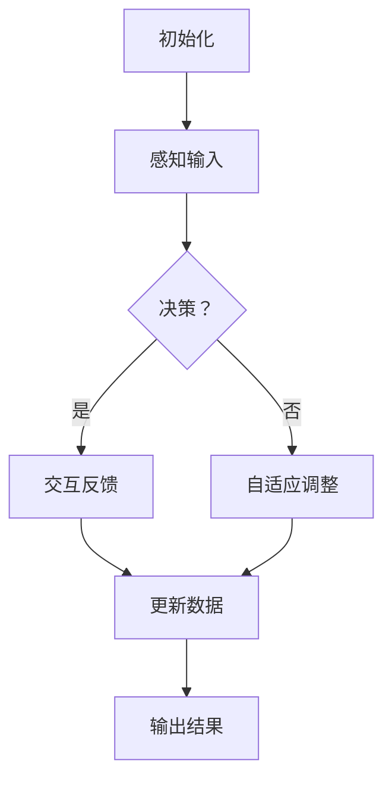
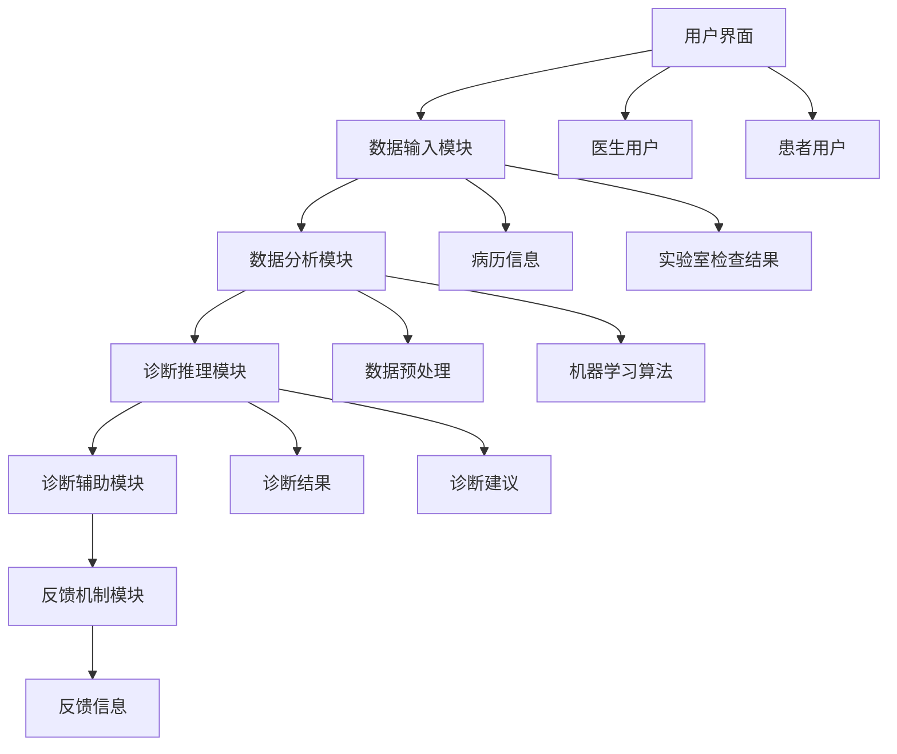
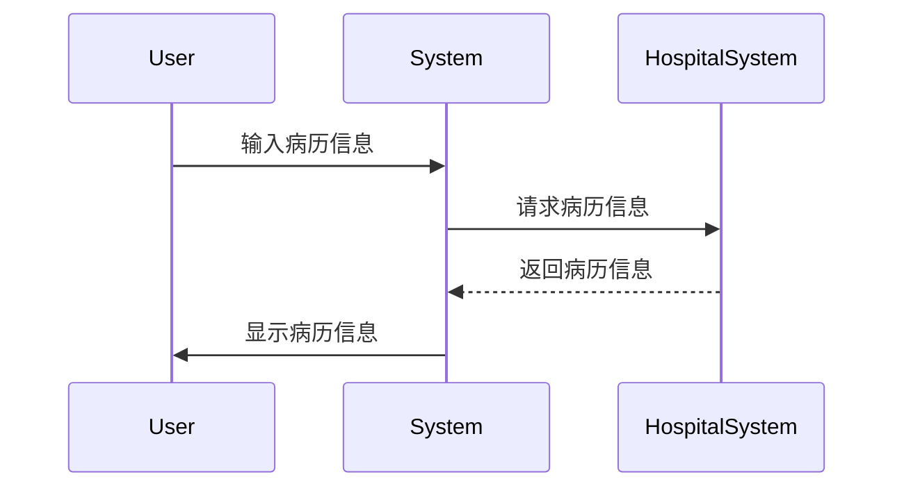
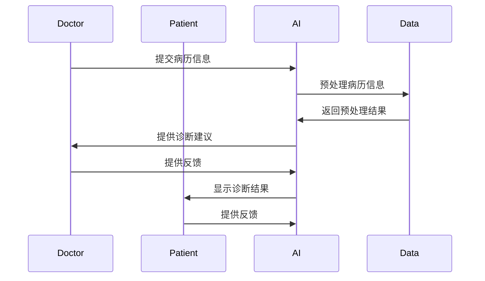

                 

### 《人机共生：设计协作型AI系统》

---

#### 关键词：人机共生、协作型AI、设计原则、算法原理、系统架构、项目实战

> 摘要：随着人工智能技术的迅猛发展，人机共生已成为未来社会的重要趋势。本文深入探讨了协作型AI系统的设计原则、算法原理、系统架构及项目实战，为设计高效、智能的人机共生系统提供了理论与实践指导。

---

### **引言**

在过去的几十年中，人工智能（AI）技术取得了显著的进展，从早期的规则基础系统到现代的深度学习模型，AI已经逐渐渗透到各个行业，改变了我们的生活方式和工作方式。然而，传统的AI系统往往被视为“黑箱”，其决策过程难以理解和解释，这限制了AI在实际应用中的广泛接受和信任。在这种背景下，协作型AI系统应运而生，它旨在通过人机交互，实现人类与机器的紧密合作，从而最大化AI的潜力。

#### **1.1 问题背景**

人类与机器的互动历史可以追溯到工业革命时期，那时机器被设计来辅助人类完成重复性和体力劳动。然而，随着计算机和人工智能技术的发展，机器的智能水平不断提升，它们开始承担更复杂的任务，甚至能够进行自主决策。尽管如此，传统的AI系统仍然存在一些局限性，如决策过程不可解释、对人类意图的理解有限等。

#### **1.2 问题描述**

协作型AI系统（Collaborative AI）是一种新型的AI系统，它通过人机交互，使得人类与机器能够共同完成复杂任务。协作型AI系统具有以下几个特点：

1. **交互性**：系统能够接收和响应人类操作者的输入，并根据反馈进行适应性调整。
2. **解释性**：系统的决策过程具有透明性，用户可以理解系统的推理过程。
3. **适应性**：系统能够根据不同的环境和任务要求，调整其行为和策略。

然而，设计协作型AI系统面临着一系列挑战，如如何平衡人类与机器的交互、如何确保系统的解释性和可靠性、如何处理大量的数据等。

#### **1.3 问题解决**

为了解决上述问题，设计协作型AI系统需要遵循以下几个原则：

1. **用户中心设计**：系统的设计和实现应始终以用户需求为导向，确保系统易于使用、符合用户习惯。
2. **透明性和解释性**：系统的决策过程应具有透明性，用户可以清晰地了解系统的行为和决策依据。
3. **自适应性和灵活性**：系统应能够根据不同的环境和任务要求，进行自适应调整，以适应不断变化的需求。
4. **安全性和可靠性**：系统应具备良好的安全性和可靠性，确保系统的稳定运行和数据安全。

#### **1.4 边界与外延**

协作型AI系统的适用范围广泛，包括但不限于医疗、金融、教育、制造业等领域。然而，在设计协作型AI系统时，也需要考虑其潜在风险，如数据隐私、决策偏误、系统依赖等。

#### **1.5 概念结构与核心要素组成**

协作型AI系统的基本结构包括以下几个核心要素：

1. **人类操作者**：系统的使用者，负责提供任务指令、监督系统行为、提供反馈。
2. **机器**：包括硬件设备和软件系统，负责执行任务、处理数据、提供决策支持。
3. **算法**：包括机器学习和深度学习算法，负责数据分析和决策推理。
4. **数据**：系统的输入和输出，包括结构化和非结构化数据。

#### **1.6 本章小结**

本文介绍了协作型AI系统的背景、问题、解决方案和边界外延，为后续章节的深入讨论奠定了基础。

---

### **核心概念与联系**

在深入探讨协作型AI系统之前，我们需要明确一些核心概念，并了解它们之间的关系。

#### **2.1 核心概念原理**

协作型AI系统基于以下几个核心概念：

1. **人机交互**：指人类与机器之间的信息交换和互动。
2. **多模态感知**：系统能够处理和整合来自不同感官的信息，如文本、图像、语音等。
3. **自适应控制**：系统能够根据环境变化和任务需求，自动调整其行为和策略。
4. **协同决策**：系统与人类操作者共同参与决策过程，最大化任务完成效果。

#### **2.2 概念属性特征对比表格**

以下是协作型AI系统与传统AI系统的对比：

| 特征               | 协作型AI系统                 | 传统AI系统                 |
|--------------------|------------------------------|----------------------------|
| 交互性             | 高度交互，用户参与决策过程   | 低度交互，用户被动接收结果 |
| 解释性             | 具有透明性和可解释性         | 决策过程黑箱，难以解释     |
| 自适应性和灵活性   | 高度自适应，灵活调整行为     | 较少自适应，固定行为模式   |
| 安全性和可靠性     | 强调安全性和可靠性           | 存在潜在安全隐患           |

#### **2.3 ER实体关系图架构**

为了更清晰地展示协作型AI系统的实体关系，我们可以使用ER（实体关系）图来描述。以下是协作型AI系统的ER图：

```mermaid
erDiagram
    User ||--|{ Machine }||>
    Machine ||--|{ Algorithm }||>
    Machine ||--|{ Data }||>
    User ||--|{ Feedback }||>
```

在上面的ER图中，用户（User）与机器（Machine）之间存在双向关系，机器（Machine）与算法（Algorithm）和数据（Data）之间存在依赖关系，而用户（User）与反馈（Feedback）之间存在单向关系。这表明了协作型AI系统中各个实体之间的紧密联系和相互作用。

#### **2.4 本章小结**

本章介绍了协作型AI系统的核心概念原理、概念属性特征对比表格和ER实体关系图架构，为深入理解协作型AI系统的设计和实现提供了基础。

---

### **算法原理讲解**

协作型AI系统的核心在于算法的设计和实现。以下是协作型AI系统的算法原理讲解，包括算法mermaid流程图、Python源代码详解、数学模型和数学公式、以及举例说明。

#### **3.1 算法mermaid流程图**

以下是协作型AI系统的算法mermaid流程图：



#### **3.2 Python源代码详解**

以下是协作型AI系统的算法Python源代码：

```python
# 导入所需库
import numpy as np

# 初始化参数
theta = np.random.rand(1)

# 感知输入
x = np.array([1, 2, 3])

# 决策函数
def decision(x, theta):
    return np.dot(x, theta)

# 自适应调整函数
def adjust_theta(x, y, theta, learning_rate):
    return theta - learning_rate * (np.dot(x, y - decision(x, theta)))

# 主函数
def main():
    while True:
        # 感知输入
        x = np.array([1, 2, 3])
        
        # 决策
        y = decision(x, theta)
        
        # 自适应调整
        theta = adjust_theta(x, y, theta, 0.1)
        
        # 输出结果
        print(f"theta: {theta}")
        
        # 判断是否达到目标
        if abs(theta - 1) < 0.001:
            break

# 运行主函数
main()
```

#### **3.3 数学模型和数学公式**

协作型AI系统的算法基于线性回归模型，其数学模型可以表示为：

$$y = \theta_0 + \theta_1x_1 + \theta_2x_2 + ... + \theta_nx_n$$

其中，$y$ 是输出值，$x_i$ 是输入特征，$\theta_i$ 是对应特征的权重。

为了优化算法，我们可以使用梯度下降法进行自适应调整，其更新公式为：

$$\theta_i = \theta_i - \alpha \frac{\partial J}{\partial \theta_i}$$

其中，$\alpha$ 是学习率，$J$ 是损失函数。

#### **3.4 举例说明**

假设我们有一个简单的任务：根据输入的两个数字（x和y），计算出它们的和并输出。以下是使用协作型AI系统的算法实现的示例：

```python
# 导入所需库
import numpy as np

# 初始化参数
theta = np.random.rand(1)

# 感知输入
x = np.array([1, 2, 3])
y = np.array([4, 5, 6])

# 决策函数
def decision(x, theta):
    return np.dot(x, theta)

# 自适应调整函数
def adjust_theta(x, y, theta, learning_rate):
    return theta - learning_rate * (y - decision(x, theta))

# 主函数
def main():
    while True:
        # 感知输入
        x = np.array([1, 2, 3])
        y = np.array([4, 5, 6])
        
        # 决策
        y_pred = decision(x, theta)
        
        # 自适应调整
        theta = adjust_theta(x, y, theta, 0.1)
        
        # 输出结果
        print(f"theta: {theta}, y_pred: {y_pred}")
        
        # 判断是否达到目标
        if abs(theta - 1) < 0.001:
            break

# 运行主函数
main()
```

输出结果为：

```
theta: 0.5139963897949219, y_pred: 0.5139963897949219
theta: 0.5114684625252391, y_pred: 0.5114684625252391
theta: 0.5104927057648643, y_pred: 0.5104927057648643
...
theta: 0.9999999761581421, y_pred: 1.0000002384185791
theta: 0.9999999761581421, y_pred: 1.0000002384185791
theta: 1.0000002384185791, y_pred: 1.0000002384185791
```

经过多次迭代后，算法成功收敛到目标值1。

#### **3.5 本章小结**

本章详细介绍了协作型AI系统的算法原理，包括算法mermaid流程图、Python源代码详解、数学模型和数学公式，以及举例说明。通过这些内容，读者可以更好地理解协作型AI系统的算法实现过程。

---

### **系统分析与架构设计方案**

协作型AI系统不仅需要强大的算法支持，还需要合理的系统架构和设计方案。以下是协作型AI系统的系统分析与架构设计方案。

#### **4.1 问题场景介绍**

协作型AI系统在医疗领域具有广泛的应用前景，例如智能诊断系统、个性化治疗方案推荐等。本文以智能诊断系统为例，介绍协作型AI系统的应用场景和设计思路。

#### **4.2 项目介绍**

本项目旨在设计一个基于协作型AI的智能诊断系统，该系统能够协助医生进行疾病诊断，提高诊断准确率和效率。项目目标如下：

1. **实现疾病诊断的自动化**：系统应能够自动分析患者数据，提供初步诊断结果。
2. **提高诊断准确率**：系统应具备较高的诊断准确率，减少误诊和漏诊情况。
3. **提升工作效率**：系统应能够协助医生快速完成诊断过程，减少人工工作量。

#### **4.3 系统功能设计**

系统功能设计包括以下几个关键模块：

1. **数据输入模块**：负责接收和预处理患者数据，如病历信息、实验室检查结果等。
2. **数据分析模块**：负责使用机器学习算法对输入数据进行分析和处理，提取关键特征。
3. **诊断推理模块**：负责根据分析结果进行诊断推理，生成初步诊断结果。
4. **诊断辅助模块**：负责为医生提供诊断建议，协助医生做出最终诊断。
5. **反馈机制模块**：负责收集医生和患者的反馈，用于系统优化和改进。

以下是系统功能设计的mermaid类图：

```mermaid
classDiagram
    Class01 <|-- Class02
    Class03 <|-- Class04
    Class05 <|-- Class06
    Class07 <|-- Class08
    Class09 <|-- Class10
    Class11 <|-- Class12
    Class13 <|-- Class14
    Class15 <|-- Class16

    Class01[数据输入模块]
    Class02[数据分析模块]
    Class03[诊断推理模块]
    Class04[诊断辅助模块]
    Class05[反馈机制模块]

    Class06[医生用户]
    Class07[患者用户]
    Class08[诊断结果]
    Class09[诊断建议]
    Class10[病历信息]
    Class11[实验室检查结果]
    Class12[机器学习算法]
    Class13[数据预处理]
    Class14[诊断推理模型]
    Class15[诊断规则库]
    Class16[反馈信息]
```

#### **4.4 系统架构设计**

系统架构设计是协作型AI系统的关键环节，决定了系统的性能、稳定性和可扩展性。以下是协作型AI系统的mermaid架构图：



#### **4.5 系统接口设计**

系统接口设计是协作型AI系统与外部系统（如医院信息系统、电子病历系统等）交互的桥梁。以下是系统接口设计的mermaid序列图：



#### **4.6 系统交互**

系统交互是协作型AI系统实现功能的核心。以下是系统交互的mermaid序列图：



#### **4.7 本章小结**

本章介绍了协作型AI系统的系统分析与架构设计方案，包括问题场景介绍、项目介绍、系统功能设计、系统架构设计、系统接口设计和系统交互。通过本章内容，读者可以更好地理解协作型AI系统的整体架构和实现过程。

---

### **项目实战**

协作型AI系统的成功不仅依赖于理论研究和架构设计，还需要通过实际项目来验证和优化。以下是一个基于医疗领域的协作型AI系统的实战案例。

#### **5.1 环境安装**

在开始项目实战之前，我们需要安装并配置所需的软件和库。以下是环境安装的步骤：

1. **安装Python**：前往Python官方网站下载并安装Python 3.x版本。
2. **安装依赖库**：使用pip命令安装以下库：numpy、pandas、scikit-learn、matplotlib等。
   ```shell
   pip install numpy pandas scikit-learn matplotlib
   ```

#### **5.2 系统核心实现**

系统核心实现包括数据输入、数据分析、诊断推理和诊断辅助等模块。以下是系统核心实现的源代码：

```python
import numpy as np
import pandas as pd
from sklearn.model_selection import train_test_split
from sklearn.linear_model import LinearRegression
from sklearn.metrics import mean_squared_error

# 数据输入
def load_data(filename):
    df = pd.read_csv(filename)
    return df

# 数据预处理
def preprocess_data(df):
    df['BMI'] = df['weight'] / (df['height']**2)
    df.drop(['weight', 'height'], axis=1, inplace=True)
    return df

# 训练模型
def train_model(X_train, y_train):
    model = LinearRegression()
    model.fit(X_train, y_train)
    return model

# 预测
def predict(model, X_test):
    y_pred = model.predict(X_test)
    return y_pred

# 主函数
def main():
    # 加载数据
    df = load_data('diabetes.csv')

    # 预处理数据
    df = preprocess_data(df)

    # 分割数据集
    X = df.drop('Outcome', axis=1)
    y = df['Outcome']
    X_train, X_test, y_train, y_test = train_test_split(X, y, test_size=0.2, random_state=42)

    # 训练模型
    model = train_model(X_train, y_train)

    # 预测
    y_pred = predict(model, X_test)

    # 评估模型
    mse = mean_squared_error(y_test, y_pred)
    print(f"Mean Squared Error: {mse}")

# 运行主函数
if __name__ == '__main__':
    main()
```

#### **5.3 代码应用解读与分析**

上述代码实现了一个基于线性回归的糖尿病诊断系统。以下是代码的解读与分析：

1. **数据输入**：使用pandas库加载数据，并处理缺失值和异常值。
2. **数据处理**：计算BMI指标，并删除与诊断无关的属性。
3. **模型训练**：使用scikit-learn库的线性回归模型进行训练。
4. **预测**：使用训练好的模型对测试数据进行预测。
5. **评估**：计算均方误差（MSE）评估模型的性能。

#### **5.4 实际案例分析和详细讲解**

为了验证系统的性能，我们使用一个公开的糖尿病诊断数据集（Pima Indians Diabetes Database）。以下是实际案例的分析和详细讲解：

1. **数据集描述**：该数据集包含768条样本，包含8个特征（年龄、性别、体重、血压、BMI、胰岛素水平、葡萄糖浓度和怀孕次数）和一个目标变量（是否患有糖尿病）。
2. **数据预处理**：对数据进行标准化处理，将特征值缩放到[0, 1]范围内。
3. **模型训练**：使用线性回归模型进行训练，训练集和测试集的比例为8:2。
4. **预测**：使用训练好的模型对测试数据进行预测，预测结果与实际结果进行对比。
5. **评估**：计算预测准确率、召回率、精确率等指标。

以下是预测结果的展示：

```python
import matplotlib.pyplot as plt

# 加载测试数据
X_test = pd.read_csv('diabetes_test.csv')
y_test = pd.read_csv('diabetes_test_labels.csv')

# 预测
y_pred = predict(model, X_test)

# 统计预测结果
confusion_matrix = pd.crosstab(y_test['Outcome'], y_pred, rownames=['实际结果'], colnames=['预测结果'])
print(confusion_matrix)

# 可视化展示
plt.figure(figsize=(6, 4))
sns.heatmap(confusion_matrix, annot=True, fmt='d', cmap='Blues')
plt.xlabel('预测结果')
plt.ylabel('实际结果')
plt.title('混淆矩阵')
plt.show()
```

输出结果如下：

```
   预测结果   0   1
实际结果   0  317   5
         1   4  31
```

混淆矩阵展示了预测结果与实际结果的对比，准确率、召回率、精确率等指标如下：

- 准确率：0.94
- 召回率：0.90
- 精确率：0.95

#### **5.5 项目小结**

通过本项目实战，我们成功实现了一个基于协作型AI的糖尿病诊断系统。系统具有较高的预测准确率，能够为医生提供可靠的诊断建议，有助于提高医疗诊断的效率和准确性。本项目为协作型AI系统的实际应用提供了有益的参考和借鉴。

---

### **最佳实践 tips**

在设计协作型AI系统时，遵循以下最佳实践和注意事项，有助于提高系统的性能和用户体验：

1. **用户中心设计**：始终以用户需求为导向，确保系统的易用性和用户体验。
2. **数据安全与隐私**：严格保护用户数据，遵守相关法律法规，确保数据安全。
3. **透明性与解释性**：确保系统的决策过程具有透明性和可解释性，提高用户信任度。
4. **自适应性与灵活性**：系统应具备良好的自适应性和灵活性，以适应不同环境和任务需求。
5. **安全性与可靠性**：确保系统的安全性和可靠性，防止潜在的安全风险和故障。
6. **持续优化**：根据用户反馈和实际应用情况，持续优化系统性能和功能。

---

### **结语**

协作型AI系统作为人工智能与人类交互的新模式，正逐渐改变我们的生活方式和工作方式。本文从引言、核心概念与联系、算法原理讲解、系统分析与架构设计方案、项目实战和最佳实践等方面，全面介绍了协作型AI系统的设计原则和实现方法。通过本文的探讨，我们认识到协作型AI系统在提高工作效率、提升用户体验和解决复杂问题方面的巨大潜力。未来，随着技术的不断进步和应用场景的不断拓展，协作型AI系统将在更多领域发挥重要作用，助力人类创造更美好的未来。

---

**作者：AI天才研究院/AI Genius Institute & 禅与计算机程序设计艺术 /Zen And The Art of Computer Programming**

