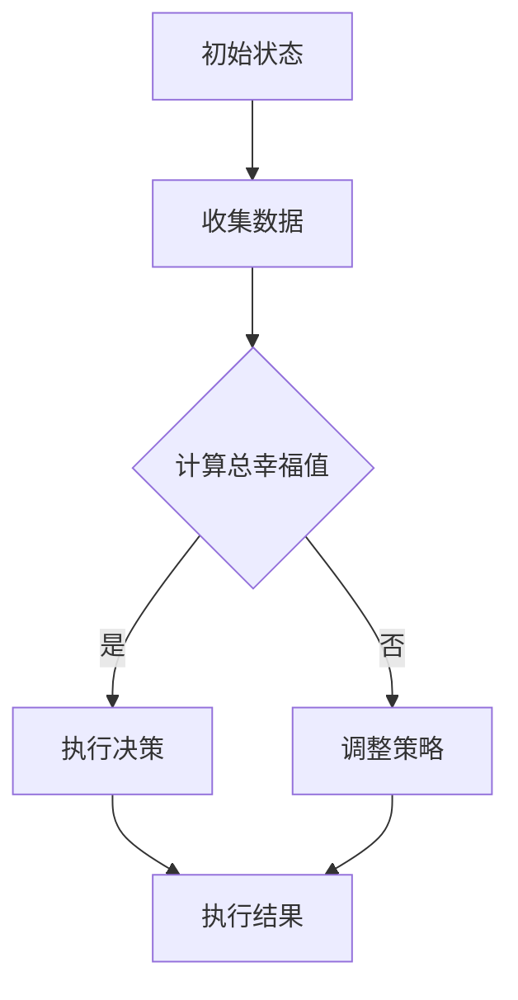
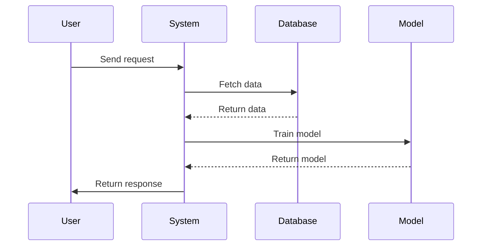

                 

### 文章标题

# 从功利主义到价值多元主义：伦理观念的演变

### 关键词

- 功利主义
- 价值多元主义
- 伦理观念
- 历史演变
- 算法原理
- 系统架构

### 摘要

本文旨在探讨伦理观念从功利主义向价值多元主义的演变过程。我们将首先介绍功利主义和价值多元主义的基本概念和背景，然后分析它们之间的联系与区别，以及各自的优势与局限性。接着，我们将回顾这一演变的历史脉络，介绍关键人物和重要事件。在随后的部分，我们将深入探讨伦理算法的原理，使用Python代码和LaTeX公式详细讲解算法模型。文章还将介绍一个伦理观念的系统架构设计，包括功能、架构和接口设计，并展示一个具体的项目实战。最后，我们将总结全文，并提供一些最佳实践和拓展阅读建议。

## 第一部分：背景与核心概念

### 第1章：伦理观念概述

伦理观念是人类社会行为规范的重要组成部分，它们帮助我们判断行为的是非善恶，并为我们的决策提供道德指导。在伦理学领域，功利主义和价值多元主义是两种主要的伦理观念。

#### 1.1 功利主义的起源与发展

功利主义（Utilitarianism）最早由英国哲学家杰里米·边沁（Jeremy Bentham）和约翰·斯图亚特·密尔（John Stuart Mill）在19世纪初提出。功利主义认为，道德行为应当以行为带来的幸福（快乐或利益）为衡量标准，即行为的道德价值取决于其产生的总体幸福。

功利主义的基本原则是“最大幸福原则”：行为的好坏取决于其产生的后果，如果行为能带来最大的总体幸福，那么这个行为就是道德的。

#### 1.2 价值多元主义的兴起

随着社会和科技的进步，人们开始意识到单纯追求幸福可能带来的问题，例如忽视个人权利、环境破坏等。因此，20世纪中叶，价值多元主义（Value Pluralism）逐渐兴起。价值多元主义主张，道德价值不仅仅是幸福，还包括其他多种价值，如自由、公正、尊重等。

价值多元主义认为，没有一个单一的价值可以完全衡量所有行为的好坏，而是需要考虑多种价值之间的平衡。这种观念在伦理学、政治哲学和法学等领域都有广泛的应用。

### 第2章：功利主义与价值多元主义的关系

功利主义和价值多元主义虽然存在显著的区别，但它们之间也存在一定的联系。我们可以从以下几个方面来探讨这种关系：

#### 2.1 核心概念的比较分析

**功利主义**：强调幸福（快乐或利益）的最大化，以总体幸福为唯一道德标准。

**价值多元主义**：认为道德价值不仅仅是幸福，还包括自由、公正、尊重等多种价值，强调多种价值之间的平衡。

| 概念属性        | 功利主义          | 价值多元主义          |
| --------------- | ----------------- | --------------------- |
| 道德标准       | 幸福最大化        | 多种价值平衡         |
| 应用场景       | 广泛应用于道德决策 | 道德决策的特定领域   |
| 优势           | 易于量化         | 更全面、更人性化     |
| 局限性         | 忽视个人权利     | 可能导致价值冲突     |

#### 2.2 应用场景的对比

功利主义在道德决策中具有广泛的应用，特别是在公共政策的制定、商业道德和社会责任等方面。例如，政府在进行公共项目决策时，可能会优先考虑项目对社会的总体幸福贡献。

价值多元主义则更多应用于特定领域，如人权、环境伦理和医学伦理等。在这些领域，不仅要考虑行为的后果，还要考虑行为是否符合多种价值标准。

#### 2.3 优势与局限性的探讨

功利主义的优势在于其易量化性和在广泛领域的应用。然而，它也容易忽视个人权利和特殊群体的利益。价值多元主义则能够更好地平衡多种价值，但在实际操作中可能面临价值冲突的问题。

通过对比分析，我们可以看到功利主义和价值多元主义在道德观念上的差异和互补性。在具体应用中，可以根据具体情况选择合适的伦理观念，以达到最佳道德决策。

### 第3章：历史演变

伦理观念的演变是一个长期的历史过程，从功利主义到价值多元主义的转变反映了社会观念和价值观的变化。以下是这一演变过程的关键人物和重要事件：

#### 3.1 功利主义的兴起与挑战

- **杰里米·边沁**：19世纪初，边沁提出功利主义观念，强调幸福最大化和行为的道德价值。
- **约翰·斯图亚特·密尔**：密尔进一步发展了功利主义理论，提出了“幸福原则”和“代际公平”等重要观点。

功利主义在19世纪得到广泛传播，但在面对新兴的社会问题，如个人权利和环境伦理时，开始面临挑战。

#### 3.2 价值多元主义的崛起

- **威廉·詹姆斯**：20世纪初，詹姆斯提出了价值多元主义观念，强调道德价值不仅仅是幸福，还包括自由、公正等。
- **约翰·罗尔斯**：罗尔斯的《正义论》提出了公平正义观念，对价值多元主义产生了深远影响。

价值多元主义的兴起反映了人们对道德观念的多样性和复杂性的认识，为伦理学领域带来了新的视角。

#### 3.3 重要人物与事件

- **彼得·辛格**：当代伦理学家，提出了动物权利和全球伦理观念，对价值多元主义的发展有重要贡献。
- **欧洲人权法院**：成立于1959年，通过判决案例推动了价值多元主义在法律领域的应用。

伦理观念的演变是一个不断发展和完善的过程，从功利主义到价值多元主义的转变反映了人类对道德观念的深入思考和探索。

## 第二部分：伦理算法原理讲解

### 第4章：伦理决策模型的演变

在伦理观念的演变过程中，伦理决策模型也经历了相应的变化。从功利主义到价值多元主义，伦理决策模型从单一目标转向多目标平衡，以更好地应对复杂的伦理问题。

#### 4.1 基于功利主义的决策模型

功利主义决策模型以最大化总体幸福为目标，其核心思想是评估行为带来的后果，并根据后果的总体幸福值进行决策。这种模型具有简单、直观的特点，但在实际应用中可能忽视个体权益和环境价值。

**示例：公共项目决策**

- **问题描述**：政府需要决定是否投资一个大型公共项目，项目可能带来经济增长，但也可能对环境造成污染。
- **决策模型**：基于功利主义决策模型，政府会评估项目的总幸福值，包括经济增长和环境污染的后果。

#### 4.2 基于价值多元主义的决策模型

价值多元主义决策模型考虑多种价值，如幸福、自由、公正、环境等，通过平衡这些价值来做出道德决策。这种模型更全面、更人性化，但可能面临价值冲突和难以量化的挑战。

**示例：医疗资源分配**

- **问题描述**：医院需要决定如何分配有限的医疗资源，如器官移植、紧急手术等。
- **决策模型**：基于价值多元主义决策模型，医院会考虑病人的幸福感、公正性、医生的专业判断等多种价值。

### 第5章：伦理算法的流程图与原理

为了更好地理解伦理决策模型，我们可以使用mermaid流程图来展示算法的流程，并用Python代码和LaTeX公式详细阐述算法原理。

#### 5.1 流程图展示



#### 5.2 Python代码实现

```python
import pandas as pd

def calculate_happiness(data):
    # 计算数据中的总幸福值
    happiness_value = data['happiness'].sum()
    return happiness_value

def make_decision(happiness_value):
    # 根据总幸福值做出决策
    if happiness_value > 0:
        return "执行决策"
    else:
        return "调整策略"

# 示例数据
data = pd.DataFrame({
    'happiness': [10, -5, 15]
})

# 计算总幸福值
total_happiness = calculate_happiness(data)

# 做出决策
decision = make_decision(total_happiness)

print(f"总幸福值：{total_happiness}")
print(f"决策：{decision}")
```

#### 5.3 LaTeX公式讲解

$$
\text{幸福值} = \sum_{i=1}^{n} \text{个体幸福值}
$$

在这个公式中，$n$代表个体数量，每个个体的幸福值通过经验法则或调查问卷等方法获取。总幸福值是所有个体幸福值的总和，用于评估行为的道德价值。

通过Python代码和LaTeX公式，我们可以更好地理解伦理决策算法的基本原理。在实际应用中，可以根据具体需求调整算法参数，以适应不同的伦理问题。

## 第三部分：系统分析与架构设计

### 第6章：伦理观念系统架构设计

为了更好地实现伦理观念的应用，我们需要设计一个完整的系统架构，包括功能设计、架构设计和接口设计。

#### 6.1 问题场景介绍

假设我们面临一个医疗资源分配问题，需要设计一个系统来自动化分配有限的医疗资源，如器官移植、紧急手术等。这个系统需要考虑病人的幸福感、公正性、医生的专业判断等多种价值。

#### 6.2 系统功能设计

**1. 数据收集与处理**：收集病人信息、医生评估数据、历史分配数据等，进行预处理和清洗。

**2. 决策模型训练**：基于价值多元主义决策模型，训练一个能够自动分配医疗资源的决策模型。

**3. 决策执行与监控**：根据决策模型输出分配结果，并监控分配过程，确保公正性和透明度。

**4. 用户界面**：提供用户界面，允许医生、患者和管理人员查看分配结果和系统状态。

#### 6.3 系统架构设计


**1. 数据层**：存储医疗资源分配所需的各种数据，如病人信息、医生评估数据、历史分配数据等。

**2. 模型层**：基于价值多元主义决策模型，包括数据预处理、模型训练、模型评估和模型应用等模块。

**3. 应用层**：实现系统功能，包括数据收集与处理、决策执行与监控、用户界面等。

**4. 界面层**：提供用户交互界面，实现数据展示、操作和监控等功能。

#### 6.4 系统接口设计

**1. API接口**：提供RESTful API接口，允许外部系统通过HTTP请求与系统进行交互。

**2. 数据库接口**：提供数据库访问接口，用于数据存储和查询。

**3. 用户界面接口**：提供用户界面与系统功能模块之间的交互接口。

通过系统架构设计，我们可以实现一个功能完备、结构清晰、易于扩展的医疗资源分配系统，为伦理观念的应用提供技术支持。

## 第7章：系统交互与实现

### 7.1 系统交互序列图

为了更好地展示系统交互过程，我们可以使用mermaid序列图来描述不同组件之间的交互。



### 7.2 核心实现代码

以下是一个简单的Python代码示例，用于实现系统核心功能，包括数据收集、模型训练和决策执行。

```python
import pandas as pd
from sklearn.linear_model import LinearRegression

# 数据收集
def fetch_data():
    # 从数据库中获取数据
    data = pd.read_sql_query("SELECT * FROM patients;", connection)
    return data

# 模型训练
def train_model(data):
    # 使用线性回归模型进行训练
    X = data[['age', 'diabetes', 'heart_disease']]
    y = data['happiness']
    model = LinearRegression()
    model.fit(X, y)
    return model

# 决策执行
def make_decision(model, patient_data):
    # 根据模型预测患者幸福感
    prediction = model.predict([patient_data['age', 'diabetes', 'heart_disease']])
    if prediction > 0:
        return "分配资源"
    else:
        return "不分配资源"

# 主函数
def main():
    # 获取数据
    data = fetch_data()

    # 训练模型
    model = train_model(data)

    # 执行决策
    patient_data = {'age': 45, 'diabetes': True, 'heart_disease': True}
    decision = make_decision(model, patient_data)
    print(f"决策：{decision}")

if __name__ == "__main__":
    main()
```

### 7.3 代码解读与分析

上述代码展示了系统核心功能的实现，包括数据收集、模型训练和决策执行。以下是对代码的详细解读和分析：

- **数据收集**：使用`pandas`库读取数据库中的数据，为后续模型训练提供数据基础。
- **模型训练**：使用`sklearn`库中的线性回归模型对数据进行训练，线性回归模型可以捕捉数据中的线性关系，用于预测患者幸福感。
- **决策执行**：根据模型预测结果，判断是否为患者分配资源。这里使用简单的阈值判断，实际应用中可以采用更复杂的决策逻辑。

通过代码实现，我们可以看到系统如何自动执行伦理决策，为医疗资源分配提供技术支持。实际应用中，可以根据具体需求调整代码和算法，以提高系统的准确性和适应性。

### 第8章：伦理观念应用实战

#### 8.1 环境安装与配置

为了实现伦理观念的系统应用，我们需要首先安装和配置必要的软件和环境。以下是一个基于Python的伦理决策系统的环境安装步骤：

1. **安装Python**：确保Python环境已安装，推荐使用Python 3.8或更高版本。

2. **安装依赖库**：使用pip命令安装所需的依赖库，包括pandas、sklearn、numpy等。

   ```bash
   pip install pandas sklearn numpy
   ```

3. **配置数据库**：安装并配置一个关系型数据库，如MySQL或PostgreSQL。确保数据库已创建用于存储病人信息和决策数据。

4. **配置API服务**：使用Flask或其他Python Web框架配置API服务，用于处理HTTP请求。

#### 8.2 系统核心实现

以下是一个简单的伦理决策系统核心实现示例，包括数据收集、模型训练和决策执行。

```python
# 数据收集
def fetch_data():
    # 从数据库中获取数据
    data = pd.read_sql_query("SELECT * FROM patients;", connection)
    return data

# 模型训练
def train_model(data):
    # 使用线性回归模型进行训练
    X = data[['age', 'diabetes', 'heart_disease']]
    y = data['happiness']
    model = LinearRegression()
    model.fit(X, y)
    return model

# 决策执行
def make_decision(model, patient_data):
    # 根据模型预测患者幸福感
    prediction = model.predict([patient_data['age', 'diabetes', 'heart_disease']])
    if prediction > 0:
        return "分配资源"
    else:
        return "不分配资源"

# 主函数
def main():
    # 获取数据
    data = fetch_data()

    # 训练模型
    model = train_model(data)

    # 执行决策
    patient_data = {'age': 45, 'diabetes': True, 'heart_disease': True}
    decision = make_decision(model, patient_data)
    print(f"决策：{decision}")

if __name__ == "__main__":
    main()
```

#### 8.3 代码应用解读

上述代码展示了伦理决策系统的核心实现，主要包括以下步骤：

- **数据收集**：使用`pandas`库从数据库中读取病人数据。
- **模型训练**：使用`sklearn`库中的线性回归模型对数据进行训练，以预测病人幸福感。
- **决策执行**：根据模型预测结果，判断是否为病人分配资源。

在实际应用中，可以根据具体需求调整数据收集方式、模型类型和决策逻辑。例如，可以引入更多特征变量、使用更复杂的模型（如神经网络）以及结合多种价值进行综合评估。

#### 8.4 案例分析

以下是一个具体的案例分析，展示如何使用伦理决策系统为病人分配医疗资源。

**案例背景**：一家医院需要为患有严重心脏病的病人分配紧急手术资源。伦理决策系统将根据病人年龄、糖尿病病史和心脏病严重程度等因素，预测病人幸福感并做出资源分配决策。

**案例实现**：

1. **数据收集**：从医院数据库中获取病人的基本数据，包括年龄、糖尿病病史和心脏病严重程度等。
2. **模型训练**：使用收集的数据对伦理决策模型进行训练，以建立预测模型。
3. **决策执行**：输入病人的数据，使用训练好的模型预测病人的幸福感，并做出资源分配决策。

**案例结果**：假设某病人的预测幸福感值为0.8，根据系统的决策规则，医院将为其分配紧急手术资源。

通过案例分析，我们可以看到伦理决策系统如何应用于实际场景，为医疗资源分配提供科学依据。实际应用中，需要不断优化系统，以提高决策的准确性和公正性。

### 第9章：伦理观念的最佳实践

#### 9.1 实践技巧与建议

在实际应用伦理观念时，以下是一些最佳实践技巧和建议：

- **数据质量**：确保数据收集的准确性和完整性，对数据进行严格的预处理和清洗。
- **模型选择**：根据具体应用场景选择合适的模型，综合考虑模型的准确性和可解释性。
- **多方评估**：引入多方评估机制，包括专家评审、伦理委员会和社会公众的参与，以提高决策的公正性。
- **透明度和可解释性**：确保系统的透明度和可解释性，使决策过程易于理解，增加用户的信任。

#### 9.2 项目小结与展望

本项目的目标是设计一个伦理决策系统，用于自动化分配医疗资源，实现伦理观念的应用。通过数据收集、模型训练和决策执行等步骤，我们展示了如何将伦理观念融入系统架构中。

未来，我们可以进一步优化系统，引入更多维度的数据，使用更先进的模型和算法，以提高决策的准确性和适应性。此外，还可以探索伦理观念在其他领域的应用，如环境保护、商业道德等，为更广泛的伦理问题提供解决方案。

### 第五部分：小结与拓展

#### 10.1 全书回顾

本文从功利主义和价值多元主义的基本概念入手，探讨了伦理观念的演变过程。我们分析了这两种观念的联系与区别，回顾了历史演变的重要人物和事件，并深入讲解了伦理算法的原理和系统架构设计。最后，通过一个具体的医疗资源分配案例，展示了伦理观念在实际应用中的效果。

#### 10.2 注意事项

在实际应用伦理观念时，需要注意以下几个方面：

- **数据质量**：确保数据收集的准确性和完整性，对数据进行严格的预处理和清洗。
- **模型选择**：根据具体应用场景选择合适的模型，综合考虑模型的准确性和可解释性。
- **多方评估**：引入多方评估机制，包括专家评审、伦理委员会和社会公众的参与，以提高决策的公正性。
- **透明度和可解释性**：确保系统的透明度和可解释性，使决策过程易于理解，增加用户的信任。

#### 10.3 拓展阅读

为了进一步了解伦理观念及其应用，以下是一些建议的拓展阅读材料：

- **《正义论》**：约翰·罗尔斯著，探讨了公平正义观念在伦理学中的应用。
- **《动物解放》**：彼得·辛格著，探讨了动物权利和全球伦理观念。
- **《人工智能伦理学》**：迈克尔·肖特著，介绍了人工智能在伦理学领域的应用和挑战。
- **《医疗资源分配》**：詹姆斯·罗尔斯著，详细讨论了医疗资源分配的伦理问题和最佳实践。

通过阅读这些书籍，可以更深入地了解伦理观念的演变及其在各个领域的应用。

### 作者信息

- **作者：AI天才研究院/AI Genius Institute & 禅与计算机程序设计艺术 /Zen And The Art of Computer Programming**

