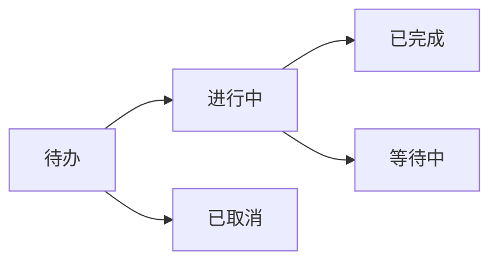

                 


Certainly, let's break down the task into manageable steps to create a high-quality, well-structured, and informative technical blog post. Here's a step-by-step approach:

### Step 1: Article Title and Keywords
- **Article Title:** From Competitive Thinking to Collaborative Spirit: Building a New Social Relationship Model
- **Keywords:** Collaboration, Social Relationship, Competitive Thinking, AI, Software Development, Teamwork

### Step 2: Abstract and Introduction
- **Abstract:** 
  "This article explores the transition from competitive thinking to collaborative spirit in the realm of technology and society. It delves into the drawbacks of competition and the rise of collaboration, offering a comprehensive guide to building new social relationship models that enhance productivity and well-being."

- **Introduction:**
  "In today's fast-paced technological landscape, the dynamics of competition and collaboration are undergoing a significant transformation. While competition has long been a driving force behind innovation and progress, it has also led to heightened stress and inefficiencies. This article aims to shed light on the shift towards collaborative spirit, examining its benefits and providing actionable insights for fostering a collaborative environment."

### Step 3: Part 1 - Understanding Competitive Thinking
- **Chapter 1:** The Origin and Development of Competitive Thinking
  - **1.1 The Origin of Competitive Thinking**
    - Definition of competition
    - Historical background of competitive thinking
  - **1.2 Principles of Competitive Thinking**
    - The "survival of the fittest" concept
    - The necessity of resource competition
  - **1.3 Limitations of Competitive Thinking**
    - Negative impacts of competition
    - The limitations of a purely competitive mindset
  - **1.4 Boundaries and Extensions of Competitive Thinking**
    - The boundary between competition and cooperation
    - The expansion of competitive thinking

### Step 4: Part 2 - The Rise of Collaborative Spirit
- **Chapter 2:** The Concept and Importance of Collaborative Spirit
  - **2.1 The Definition of Collaborative Spirit**
    - Core elements of collaboration
    - Comparison with competitive thinking
  - **2.2 The Origin and Development of Collaborative Spirit**
    - Historical context
    - Manifestation in society
  - **2.3 The Importance of Collaborative Spirit**
    - Impact on individual growth
    - Significance for social relationships

### Step 5: Part 3 - Core Concepts of Collaboration
- **Chapter 3:** Fundamental Concepts and Theories of Collaboration
  - **3.1 Core Concepts of Collaboration**
    - Definition and significance
    - Key collaborative principles
  - **3.2 Theoretical Foundations of Collaboration**
    - Social exchange theory
    - Distributed cognition theory

### Step 6: Part 4 - Building Collaborative Relationships
- **Chapter 4:** Establishing Collaborative Relationships
  - **4.1 The Process of Building Collaborative Relationships**
    - Building trust
    - Effective communication
  - **4.2 Overcoming Challenges in Collaboration**
    - Conflict resolution
    - Encouraging diversity

### Step 7: Part 5 - Tools and Strategies for Collaboration
- **Chapter 5:** Practical Tools and Strategies for Enhancing Collaboration
  - **5.1 Project Management Tools**
    - Agile methodologies
    - Scrum practices
  - **5.2 Communication Tools**
    - Video conferencing
    - Collaborative platforms
  - **5.3 Strategies for Effective Collaboration**
    - Encouraging a culture of sharing
    - Promoting mutual respect

### Step 8: Part 6 - Case Studies in Collaboration
- **Chapter 6:** Successful Collaborative Case Studies
  - **6.1 Case Study 1:** A Technology Company's Transition to Collaboration
  - **6.2 Case Study 2:** Collaboration in Healthcare
  - **6.3 Case Study 3:** Cross-cultural Collaboration in International Projects

### Step 9: Part 7 - Overcoming Challenges in Collaboration
- **Chapter 7:** Challenges and Solutions in Collaboration
  - **7.1 Common Challenges in Collaboration**
    - Team dynamics
    - Balancing individual contributions
  - **7.2 Strategies for Overcoming Challenges**
    - Encouraging open dialogue
    - Promoting a growth mindset

### Step 10: Conclusion
- **Conclusion:**
  "As we continue to navigate the complexities of the modern world, embracing a collaborative spirit can lead to more innovative solutions and a more harmonious society. This article has explored the transition from competitive thinking to collaborative spirit, highlighting the benefits and providing actionable strategies for building successful collaborative relationships."

### Step 11: Author Information
- **Author:** AI天才研究院 / AI Genius Institute & 禅与计算机程序设计艺术 / Zen And The Art of Computer Programming

### Step 12: Final Check
- Ensure that the article is coherent, well-structured, and follows the outlined structure.
- Check for consistency in tone, style, and terminology.
- Verify that all claims and examples are supported by evidence.

By following these steps, we can create a comprehensive and insightful technical blog post that not only informs but also inspires readers to adopt a collaborative mindset in their professional and personal lives. ### 第一部分：理解竞争思维

## 第1章：竞争思维的起源与发展

### 1.1 竞争思维的起源

竞争思维，作为一种社会行为模式，其起源可以追溯到人类历史的早期阶段。在狩猎采集社会，个体之间的竞争主要表现在对有限资源的争夺，如食物、水源和领地。这种竞争不仅是为了生存，也是为了繁衍后代。在这样的环境中，竞争思维被演化成为个体生存和繁衍的重要策略。

随着人类社会的发展，竞争思维逐渐在政治、经济和文化等领域中得到体现。在古希腊，城邦之间的竞争推动了民主制度的诞生；在中世纪，封建领主之间的竞争促进了中央集权国家的形成；在现代工业社会，企业之间的竞争推动了科技的进步和市场的繁荣。

### 1.1.1 竞争的基本概念

竞争是指两个或两个以上的个体或组织为了争夺同一目标或资源而进行的相互对抗的行为。在竞争中，个体或组织通常试图通过比对手更好的表现或策略来获得优势。竞争的基本概念包括：

- **竞争主体**：参与竞争的个体或组织。
- **竞争目标**：个体或组织希望通过竞争获得的资源或成就。
- **竞争优势**：在竞争中，个体或组织相对于对手所具有的优势，如技能、资源或策略。

### 1.1.2 竞争思维的历史背景

在人类历史的不同阶段，竞争思维的表现形式各有不同。以下是一些关键时期及其竞争思维的特点：

- **原始社会**：在原始社会中，竞争主要表现为对自然资源的争夺。例如，不同部落的成员会争夺狩猎场地和水源。

- **农业社会**：随着农业的发展，土地成为最重要的资源。土地的分配和使用成为竞争的核心，这也导致了封建制度的产生。

- **工业社会**：在工业革命时期，竞争转向对劳动力和生产资料的争夺。企业之间的竞争推动了生产效率的提高和科技的进步。

- **信息社会**：在信息化时代，竞争的重点转向知识、创新和品牌。互联网和数字技术的普及使得信息的传播速度和范围大大增加，竞争变得更加复杂和多样化。

### 1.2 竞争思维的原则

竞争思维有其内在的原则和逻辑，这些原则在不同历史时期和不同领域中有不同的表现形式。以下是竞争思维的一些基本原则：

- **成王败寇**：在竞争中，胜利者往往获得更多的资源和权力，失败者则面临资源减少或权力丧失的风险。这种“胜者通吃”的原则鼓励个体和组织追求绝对优势。

- **资源争夺**：竞争的核心在于资源的争夺。这些资源可以包括资金、人才、技术、市场等。资源的稀缺性是竞争的根本原因。

- **优胜劣汰**：竞争思维认为，只有最优秀的个体或组织才能在竞争中胜出。这种观念促进了个体和组织的不断进化和发展。

- **短期利益优先**：在竞争激烈的环境中，个体和组织往往会优先考虑短期利益，而忽视长期发展。这种策略可能导致短期内的成功，但长期来看可能带来不利影响。

### 1.3 竞争思维的局限性

尽管竞争思维在一定程度上推动了社会的发展和进步，但它也存在显著的局限性。以下是竞争思维的一些主要局限性：

- **资源浪费**：竞争往往导致资源的重复投入和浪费。在竞争中，个体和组织可能会为了争夺有限资源而投入过多的资源，导致资源使用效率低下。

- **社会不公**：竞争可能导致社会资源分配不均，加剧贫富差距。在“胜者通吃”的原则下，成功者可能获得大量资源，而失败者则可能被边缘化。

- **环境破坏**：在竞争中，个体和组织可能会为了短期利益而忽视环境保护。过度开发和资源消耗可能导致环境破坏和生态危机。

- **精神压力**：竞争环境往往给人带来巨大的精神压力。长期处于高度竞争的状态可能导致个体心理健康问题，如焦虑、抑郁等。

### 1.4 竞争思维的边界与外延

竞争思维并非绝对和单一，它在不同的情境下可以表现出不同的边界和外延。以下是一些关于竞争思维边界与外延的讨论：

- **竞争与合作的边界**：在现实生活中，竞争和合作往往是相互交织的。在某些情况下，竞争可能促进合作，而在另一些情况下，合作可能缓解竞争。

- **竞争思维的限制**：随着社会的发展和科技的进步，人们逐渐认识到竞争思维的局限性。越来越多的组织和个体开始探索如何在竞争中实现共赢。

- **竞争思维的拓展**：现代竞争思维不再局限于传统的经济和商业领域，它已经扩展到社会、政治和文化等多个层面。例如，在政治竞争中，竞争思维体现在选举和政策制定过程中。

通过以上对竞争思维起源与发展的探讨，我们可以更深入地理解竞争思维的基本概念、原则、局限性和边界。这种理解不仅有助于我们批判性地看待竞争思维，也为我们探索更有效的社会关系模式提供了理论基础。

### 第2章：协作精神的崛起

#### 2.1 协作精神的概念与重要性

协作精神是一种以共同目标为导向，通过合作与协调实现资源优化和效益最大化的思维模式。在现代社会中，协作精神的重要性日益凸显，尤其是在信息技术和全球化的背景下。协作精神的核心要素包括共享目标、互信合作、有效沟通和协同创新。

**2.1.1 协作精神的核心要素**

1. **共享目标**：协作精神的首要要素是共同的目标。个体或组织在协作过程中，需要明确共同的目标和愿景，这为协作提供了方向和动力。

2. **互信合作**：信任是协作精神的基础。只有在信任的氛围中，个体和组织才能放心地分享资源和信息，共同面对挑战。

3. **有效沟通**：协作离不开有效的沟通。良好的沟通能够确保信息准确传递，减少误解和冲突，促进协作的顺利进行。

4. **协同创新**：协作精神鼓励个体和组织在合作中发挥各自的专长和创造力，通过协同创新实现突破性进展。

**2.1.2 协作精神与竞争思维的对比**

协作精神与竞争思维有着本质的区别。竞争思维强调个体或组织的独立性和竞争性，而协作精神则强调合作与共赢。以下是一个对比表格，展示两者在核心特征上的不同：

| 特征        | 竞争思维                         | 协作精神                         |
|-------------|--------------------------------|--------------------------------|
| 目标导向    | 个体或组织追求独立目标           | 共同追求整体目标                 |
| 关系        | 个体或组织之间是零和游戏         | 个体或组织之间是正和游戏         |
| 信任        | 信任有限，竞争关系导致信任缺乏   | 基于信任，合作无间               |
| 信息共享    | 信息封闭，保守秘密               | 信息透明，共享资源               |
| 创新动力    | 个体自我驱动，创新偏向短期利益   | 团队协作驱动，创新关注长期发展   |

#### 2.2 协作精神的起源与发展

协作精神的起源可以追溯到人类社会的早期阶段。在原始社会中，人们通过合作狩猎、捕鱼和采集食物，共同抵御自然灾害和野兽的威胁。随着社会的发展，协作精神在各个领域得到进一步体现。

**2.2.1 历史背景**

1. **农业社会**：在农业社会中，个体间的协作成为农业生产的基础。村庄内部的分工和合作确保了农作物的种植和收获，提高了农业生产力。

2. **工业革命**：工业革命时期，大规模工厂生产需要高度的协作。工人们必须在生产线上的不同环节紧密配合，才能保证生产效率。

3. **信息化时代**：在信息化时代，互联网和数字技术的发展使得全球范围内的协作变得更加便捷和高效。远程协作、虚拟团队和全球供应链的建立，都是协作精神在现代社会中的重要体现。

**2.2.2 社会中的体现**

1. **科技创新**：在科技领域，许多重大突破都是通过跨学科、跨国界的协作实现的。例如，人类基因组计划的完成就是全球科学家协作的成果。

2. **商业合作**：商业合作中的战略联盟、并购和合资企业都是协作精神在商业领域的体现。这些合作形式不仅有助于企业实现资源整合，还能提高市场竞争力和创新能力。

3. **社会公益**：在公益领域，协作精神体现在多个方面，如公益组织的联合行动、社会资源的共享和全球扶贫项目的实施等。

#### 2.3 协作精神的重要性

协作精神对个人成长和社会发展具有重要意义。

**2.3.1 对个人成长的影响**

1. **知识共享**：协作精神鼓励个体之间分享知识和经验，这有助于个人不断学习和成长。

2. **技能提升**：在协作过程中，个体通过与其他成员的合作，能够提高自己的专业技能和解决问题的能力。

3. **人际关系**：协作精神有助于建立良好的人际关系，促进团队合作和人际关系的发展。

**2.3.2 对社会关系的意义**

1. **资源优化**：协作精神通过资源整合和优化，提高社会资源的利用效率。

2. **社会稳定**：协作精神有助于减少社会冲突和矛盾，促进社会和谐与稳定。

3. **创新能力**：协作精神鼓励创新思维和实践，推动社会进步和科技发展。

通过本章的探讨，我们可以看到协作精神在现代社会中的重要性和价值。理解协作精神的概念和起源，有助于我们更好地应对复杂的社会挑战，实现个人和社会的全面发展。

### 第3章：核心概念与联系

#### 3.1 核心概念

协作精神作为一种社会行为模式，涉及多个核心概念。这些概念不仅定义了协作精神的内涵，也揭示了协作过程中各要素之间的关系。

**协作**：协作是指两个或多个个体或组织为了共同的目标或利益而进行的相互配合和合作。协作的本质在于资源的共享、信息的交流和目标的统一。

**共享目标**：共享目标是协作精神的核心。在协作过程中，个体或组织必须明确共同的目标和愿景，以实现协作的协同效应。

**互信合作**：互信合作是协作精神的基础。信任是协作中最重要的元素，它确保个体和组织在合作过程中能够放心地分享资源和信息。

**有效沟通**：有效沟通是协作成功的关键。良好的沟通能够确保信息的准确传递，减少误解和冲突，促进协作的顺利进行。

**协同创新**：协同创新是协作精神的重要体现。在协作过程中，个体和组织通过协同工作，发挥各自的专长和创造力，实现创新和突破。

**资源共享**：资源共享是协作精神的重要内容。通过共享资源，个体和组织能够提高资源利用效率，实现资源优化配置。

**协同效应**：协同效应是指通过协作，个体或组织能够实现整体效能大于各部分之和的效果。协同效应是协作精神的直接体现。

**合作文化**：合作文化是协作精神在组织或社会中的体现。它包括共同的价值观、行为规范和工作氛围，是推动协作精神持续发展的基础。

#### 3.2 概念属性特征对比表格

为了更清晰地理解各概念之间的联系和区别，以下是一个概念属性特征对比表格：

| 概念        | 定义与特征                                                  | 作用与影响                                       |
|-------------|--------------------------------------------------------------|--------------------------------------------------|
| 协作        | 个体或组织间的相互配合与合作，共同实现目标。                   | 提高资源利用效率，促进创新和问题解决。             |
| 共享目标    | 协作的基础，明确共同的目标和愿景。                             | 指导协作方向，提供动力和意义。                     |
| 互信合作    | 基于信任的合作关系，确保资源共享和信任。                         | 增强团队凝聚力，减少冲突。                         |
| 有效沟通    | 确保信息准确传递的沟通方式。                                   | 减少误解，提高协作效率。                           |
| 协同创新    | 通过合作发挥各自专长，实现创新和突破。                         | 推动科技进步和社会发展。                           |
| 资源共享    | 共享资源，提高资源利用效率。                                   | 实现资源优化配置，降低成本。                       |
| 协同效应    | 整体效能大于各部分之和的效果。                                 | 提升团队和组织效能，实现共赢。                     |
| 合作文化    | 组织或社会中共同的价值观、行为规范和工作氛围。                   | 促进协作精神的持续发展，形成良好的工作环境。         |

通过这个表格，我们可以更直观地看到各概念之间的联系和区别，以及它们在协作过程中的作用和影响。

#### 3.3 协作精神的ER实体关系图架构

为了更好地理解协作精神中各核心概念之间的逻辑关系，我们可以使用ER（实体关系）图来表示这些关系。

ER图是一种用于描述实体和它们之间关系的数据库设计工具。在协作精神的ER图中，实体包括“个体”、“组织”、“目标”、“资源”和“沟通”等，它们之间的关系可以表示为：

- **个体**与**组织**之间存在“属于”关系。
- **组织**与**目标**之间存在“实现”关系。
- **个体**与**目标**之间存在“参与”关系。
- **组织**与**资源**之间存在“管理”关系。
- **个体**与**资源**之间存在“使用”关系。
- **个体**与**沟通**之间存在“进行”关系。
- **目标**与**沟通**之间存在“需要”关系。

以下是一个简化的协作精神的ER实体关系图：

```mermaid
erDiagram
  个人 ||--|{ 组织 }
  组织 ||--|{ 目标 }
  个人 ||--|{ 资源 }
  个人 ||--|{ 沟通 }
  目标 ||--|{ 沟通 }
```

在这个ER图中，箭头表示实体之间的关系，双线箭头表示单向关系，而单线箭头表示双向关系。通过这个ER图，我们可以更清晰地看到协作精神中各核心概念之间的逻辑关系。

#### 3.4 协作精神与竞争思维的比较

协作精神与竞争思维是两种不同的社会行为模式，它们在多个方面存在明显的区别和联系。

**3.4.1 基本定义和特征**

- **竞争思维**：竞争思维是一种以争夺有限资源为目标的行为模式。它强调个体或组织之间的对抗和竞争，以获取优势地位。
- **协作精神**：协作精神是一种以共同目标为导向，通过合作和协调实现资源优化和效益最大化的行为模式。它强调个体或组织之间的合作和协同。

**3.4.2 核心特征对比**

1. **目标导向**：竞争思维的目标是争夺有限资源，而协作精神的目标是实现共同的目标和愿景。
2. **关系特征**：竞争思维倾向于零和游戏，即一方获益另一方受损；而协作精神倾向于正和游戏，即多方合作共同获益。
3. **信任基础**：竞争思维中信任较为有限，竞争关系可能导致信任缺失；而协作精神基于信任，鼓励互信合作。
4. **信息共享**：竞争思维中信息往往封闭，保守秘密；而协作精神中信息透明，鼓励资源共享。
5. **创新动力**：竞争思维中创新偏向短期利益，而协作精神中创新关注长期发展，鼓励协同创新。

**3.4.3 实际应用比较**

1. **商业领域**：在商业领域，竞争思维可能导致企业之间的恶性竞争，资源浪费；而协作精神可以促进商业合作，实现资源优化和共赢。
2. **社会公益**：在社会公益领域，竞争思维可能导致资源分配不均，而协作精神可以促进资源共享，提高公益活动的效率。
3. **科技创新**：在科技创新领域，竞争思维可能阻碍知识共享和协作；而协作精神可以推动跨学科、跨国界的合作，促进科技突破。

通过比较协作精神与竞争思维的基本定义、特征和实际应用，我们可以更深入地理解两者之间的差异和联系。这有助于我们更好地选择和运用合适的行为模式，以应对复杂的社会环境。

#### 3.5 社会交换理论和分布式认知理论

协作精神在理论和实践中有着深厚的理论基础。社会交换理论和分布式认知理论是两个重要的理论框架，它们为理解协作精神提供了不同的视角。

**3.5.1 社会交换理论**

社会交换理论起源于经济学，后来被广泛应用于社会学、心理学等领域。该理论认为，人类社会中的互动行为本质上是一种资源交换过程。个体或组织通过交换资源（如时间、精力、信息、物质等）来满足彼此的需求，实现互惠互利。

在协作精神中，社会交换理论的应用体现在以下几个方面：

- **互惠原则**：协作精神强调互惠原则，即个体和组织在协作过程中通过资源共享和信息交换实现双赢。
- **信任基础**：社会交换理论强调信任的重要性。在协作中，信任是资源交换的前提，它减少了合作风险，提高了协作效率。
- **公平原则**：社会交换理论强调公平原则，即交换过程应该是公平的。协作精神通过公平的资源分配和责任分担，促进了合作关系的稳定和发展。

**3.5.2 分布式认知理论**

分布式认知理论认为，认知活动不仅发生在个体内部，也发生在个体与外部环境之间。在协作过程中，个体通过共享信息和资源，实现认知活动的扩展和深化。

在协作精神中，分布式认知理论的应用体现在以下几个方面：

- **资源共享**：分布式认知理论强调资源共享的重要性。在协作中，个体通过共享信息和资源，提高整体认知能力，实现协同创新。
- **协同工作**：分布式认知理论强调协同工作的重要性。在协作中，个体通过协同工作，发挥各自的专长，共同解决问题。
- **角色分工**：分布式认知理论认为，在协作中，每个个体都有特定的角色和任务。通过明确的角色分工，可以提高协作效率和效果。

通过社会交换理论和分布式认知理论，我们可以更深入地理解协作精神的本质和机制。这些理论不仅提供了协作精神的理论基础，也为实践中如何促进协作提供了指导。

### 第4章：建立协作关系的过程

#### 4.1 建立协作关系的过程

建立协作关系是一个复杂而动态的过程，涉及多个阶段和步骤。以下是一个典型的建立协作关系的过程：

**1. 确定合作目标**

首先，个体或组织需要明确合作的目标和愿景。这包括共同的目标、预期的成果以及合作的长远意义。确定目标有助于为后续的协作提供方向和动力。

**2. 寻找合作伙伴**

在明确目标后，个体或组织需要寻找合适的合作伙伴。这可以通过多种途径实现，如内部推荐、行业会议、社交媒体等。选择合作伙伴时，应考虑他们的能力、资源和信誉。

**3. 初步沟通**

在找到潜在的合作伙伴后，进行初步沟通是建立协作关系的重要一步。通过初步沟通，双方可以了解彼此的需求、期望和担忧，为后续的深入合作奠定基础。

**4. 建立信任**

信任是协作关系的基石。建立信任需要时间和努力，包括诚实沟通、履行承诺、尊重对方意见等。通过一系列积极的互动，个体或组织可以逐步建立信任。

**5. 确定合作方式**

在建立信任的基础上，双方需要明确合作的方式和机制。这包括分工协作、资源分配、决策过程和沟通方式等。确定合作方式有助于确保协作的顺利进行。

**6. 签订合作协议**

为了保障双方权益，签订合作协议是必要的。合作协议应明确双方的责任、权利和义务，以及违约处理机制。这有助于防止合作过程中的纠纷和误解。

**7. 协作实施**

在签订合作协议后，进入协作实施阶段。在这一阶段，双方需要按照协议内容进行具体操作，实现合作目标。这包括任务分配、进度跟踪、成果共享等。

**8. 持续沟通与调整**

协作过程中，持续的沟通和调整至关重要。通过定期沟通，双方可以了解合作进展，及时解决问题和调整策略。这有助于确保协作目标的实现。

**9. 协作评估**

在协作完成后，进行协作评估是必要的。这包括评估合作成果、过程和效果，以及总结经验教训。通过评估，可以为未来的协作提供参考和改进方向。

#### 4.2 建立信任

建立信任是协作关系的核心步骤。以下是一些建立信任的方法：

**1. 诚实与透明**

诚实是建立信任的基础。个体和组织应始终保持诚实，避免隐瞒信息或夸大事实。透明意味着在合作过程中，双方应分享相关信息，确保信息的对称。

**2. 履行承诺**

履行承诺是建立信任的关键。个体和组织应严格遵守合作协议，按时完成任务，确保承诺的实现。这有助于增强对方对合作的信任。

**3. 尊重对方意见**

尊重对方意见是建立信任的重要方式。在协作过程中，个体和组织应认真听取对方的意见和建议，给予足够的尊重。这有助于建立互信的合作关系。

**4. 公平与公正**

公平与公正是建立信任的基本原则。在合作过程中，双方应确保资源的公平分配和责任的公正分担，避免利益冲突和不公平现象。

**5. 积极沟通**

积极沟通是建立信任的重要手段。个体和组织应保持开放和诚实的沟通，及时解决合作中的问题和矛盾。通过积极沟通，可以减少误解和猜疑，增强信任。

#### 4.3 有效沟通

有效沟通是协作关系的保障。以下是一些有效沟通的方法：

**1. 明确沟通目标**

在进行沟通前，个体和组织应明确沟通的目标和内容。这有助于确保沟通的针对性和有效性。

**2. 选择合适的沟通方式**

不同的沟通方式适用于不同的情境。个体和组织应根据具体情况选择合适的沟通方式，如面对面会议、电子邮件、即时通讯工具等。

**3. 保持开放与倾听**

在沟通中，个体和组织应保持开放的态度，积极倾听对方的意见。这有助于建立互信的沟通氛围，促进有效沟通。

**4. 确保信息准确传递**

在沟通过程中，个体和组织应确保信息的准确传递。这包括避免误解、核实信息和及时反馈。

**5. 解决冲突**

在沟通中，难免会出现冲突和分歧。个体和组织应积极解决冲突，采取建设性的方式处理问题。这有助于维护良好的沟通关系。

#### 4.4 解决冲突

在协作过程中，冲突是不可避免的。以下是一些解决冲突的方法：

**1. 积极面对**

个体和组织应积极面对冲突，避免逃避或回避。通过积极面对，可以及时解决问题，防止冲突升级。

**2. 事实为基础**

在解决冲突时，应基于事实，避免主观臆断和情绪化。通过事实分析，可以找到问题的根源，提出合理的解决方案。

**3. 寻求共识**

个体和组织应寻求共识，努力找到双方都能接受的解决方案。通过寻求共识，可以避免一方获胜、另一方失败的局面。

**4. 公平公正**

在解决冲突时，应确保公平公正。这包括给予双方平等的机会表达意见，确保资源的公平分配和责任的公正分担。

**5. 专业调解**

在复杂或严重的冲突情况下，可以寻求专业调解。专业的调解人员可以提供中立、客观的视角，帮助双方找到解决问题的方法。

#### 4.5 促进多样性

多样性是协作关系的重要优势。以下是一些促进多样性的方法：

**1. 尊重差异**

个体和组织应尊重差异，包括文化、观点、经验等方面的差异。通过尊重差异，可以建立包容和多元的合作氛围。

**2. 重视多元化视角**

在协作过程中，应重视多元化视角。通过多元化的视角，可以更全面地分析问题和制定策略。

**3. 建立多元化团队**

个体和组织可以建立多元化团队，包括不同背景、经验和技能的成员。这有助于促进创新和问题解决。

**4. 激励多元思维**

个体和组织应激励多元思维，鼓励成员提出不同的意见和建议。通过多元思维，可以激发创新和解决问题的能力。

通过以上方法，个体和组织可以有效地建立协作关系，促进合作与发展。协作关系的建立不仅有助于实现共同目标，还能提高团队效能和个体成长。

### 第5章：协作工具和策略

#### 5.1 项目管理工具

在协作过程中，选择合适的项目管理工具至关重要。以下是一些常用的项目管理工具及其特点：

**1. Agile方法论**

**Scrum框架**是Agile方法论的一种实现方式，它强调迭代开发、持续交付和客户反馈。**Scrum框架**的核心组件包括**产品待办列表**（Product Backlog）、**冲刺待办列表**（Sprint Backlog）、**每日站会**（Daily Stand-up）和**回顾会**（Retrospective）。

**Scrum流程图：**

```mermaid
gantt
    title Scrum Sprint Plan
    section Sprint Planning
    Start Sprint Planning : 2023-11-01
    End Sprint Planning : 2023-11-02
    section Sprint Execution
    Start Sprint Execution : 2023-11-03
    End Sprint Execution : 2023-11-10
    section Sprint Review
    Start Sprint Review : 2023-11-11
    End Sprint Review : 2023-11-12
    section Sprint Retrospective
    Start Sprint Retrospective : 2023-11-13
    End Sprint Retrospective : 2023-11-14
```

**2. Kanban方法**

**Kanban**方法是一种基于可视化的项目管理工具，它通过限制工作项的数量（Work in Progress, WIP）来提高效率。**Kanban板**通常包含**待办区**（To Do）、**进行中**（In Progress）和**已完成**（Done）三个状态。

**Kanban流程图：**



**3. Jira**

**Jira** 是一款流行的项目管理工具，支持多种敏捷开发方法，如Scrum和Kanban。它提供了任务跟踪、报告和分析等功能，有助于团队更好地管理项目。

**Jira界面：**


#### 5.2 沟通工具

有效的沟通是协作成功的关键。以下是一些常用的沟通工具及其特点：

**1. Zoom**

**Zoom** 是一款视频会议软件，支持高清视频和音频通信。它提供了多种会议功能，如共享屏幕、实时聊天和虚拟背景。

**Zoom界面：**


**2. Slack**

**Slack** 是一款即时通讯工具，适用于团队内部沟通和协作。它提供了多种渠道（Channels）、群组（Groups）和直接消息（Direct Messages）功能，有助于团队成员快速交流和分享信息。

**Slack界面：**


**3. Microsoft Teams**

**Microsoft Teams** 是微软的一款协作平台，提供了即时通讯、视频会议、文档共享和协作功能。它与其他微软产品（如Office 365）无缝集成，方便团队协作。

**Microsoft Teams界面：**


#### 5.3 促进协作的策略

以下是一些促进协作的策略：

**1. 建立共同目标**

明确共同目标是协作成功的基石。团队应共同制定目标，确保每个成员都清楚自己的职责和期望。

**2. 培养信任文化**

信任是协作关系的核心。团队应通过诚实、透明和尊重建立信任，确保成员之间的信任和合作。

**3. 促进知识共享**

知识共享是协作的重要部分。团队应鼓励成员分享知识和经验，通过培训、会议和文档等方式促进知识传播。

**4. 激励创新**

创新是协作的重要动力。团队应鼓励成员提出新的想法和解决方案，通过奖励和创新挑战激发团队的创造力。

**5. 定期反馈**

定期反馈是协作的重要环节。团队应定期评估项目进展和协作效果，通过反馈和改进提高协作效率。

通过使用项目管理工具和沟通工具，以及实施促进协作的策略，团队可以更高效地协作，实现共同目标。

### 第6章：协作案例研究

#### 6.1 案例研究1：科技公司A的转型之路

**背景**：科技公司A成立于2005年，最初以竞争思维主导运营。在激烈的市场竞争中，公司通过不断优化产品、降低成本来争夺市场份额。然而，随着市场竞争的加剧，公司面临着资源紧张、创新乏力等问题。

**问题描述**：公司发现，传统的竞争思维导致内部竞争激烈，团队之间缺乏协作，导致资源浪费和沟通障碍。此外，公司面临技术更新速度加快的挑战，单一的产品线难以满足市场需求。

**解决方案**：为了应对这些挑战，公司决定进行战略转型，从竞争思维转向协作精神。公司采取了以下措施：

- **建立共同目标**：公司明确了“为客户提供最佳解决方案”的共同目标，确保所有团队成员都朝着这个方向努力。
- **培养信任文化**：公司通过组织团队建设活动和透明沟通，建立了信任文化。团队成员之间互相支持，共同面对挑战。
- **促进知识共享**：公司建立了内部知识库和交流平台，鼓励团队成员分享知识和经验。定期举办知识分享会，提高整体技术水平。
- **激励创新**：公司设立了创新基金，鼓励员工提出新的想法和解决方案。通过项目评估和奖励机制，激发员工的创新热情。
- **定期反馈**：公司建立了定期反馈机制，通过团队会议和项目评估，及时了解项目进展和协作效果。通过反馈，不断改进协作流程。

**结果**：通过战略转型，公司成功实现了从竞争思维到协作精神的转变。内部协作效率显著提高，项目完成速度加快，创新能力增强。公司的市场份额逐步扩大，盈利能力也得到了提升。员工满意度和工作效率显著提高，公司文化变得更加积极向上。

#### 6.2 案例研究2：医疗行业的协作创新

**背景**：医疗行业是一个高度专业化和复杂化的领域，传统的竞争思维导致医疗机构之间的信息壁垒和资源分散。这不仅影响了医疗服务的质量，也增加了患者的负担。

**问题描述**：医疗机构之间缺乏协作，导致医疗资源分配不均，信息共享不畅。此外，医疗技术发展迅速，医疗机构难以单独应对新兴疾病和挑战。

**解决方案**：为了应对这些挑战，医疗机构开始探索协作创新模式。以下是一些具体措施：

- **建立跨机构协作平台**：医疗机构之间建立了协作平台，实现了医疗信息共享和资源优化。通过共享病历、医疗影像和实验室检测结果，提高了医疗服务的效率和质量。
- **开展联合科研项目**：医疗机构和科研机构合作，共同开展医学研究项目。通过跨学科的合作，加速了新药研发和医疗技术的创新。
- **推广医疗服务联合体**：医疗机构之间建立了医疗服务联合体，通过分工协作，实现了医疗资源的合理配置。联合体成员之间互相支持，共同提升医疗服务水平。
- **定期举办医学论坛和研讨会**：医疗机构定期举办医学论坛和研讨会，促进了学术交流和知识传播。通过分享最新的研究成果和实践经验，提高了医疗团队的整体能力。

**结果**：通过协作创新，医疗行业的整体服务水平得到了显著提升。医疗资源的利用效率提高，患者得到了更好的医疗服务。同时，医疗机构之间的合作关系得到加强，共同应对了新兴疾病和医疗挑战。医生和护士的满意度和工作效率也显著提高，医疗行业的整体发展迈上了新的台阶。

#### 6.3 案例研究3：国际项目中的跨文化协作

**背景**：随着全球化的推进，越来越多的国际项目需要不同国家和地区的团队进行协作。然而，跨文化差异和文化冲突常常成为协作的障碍。

**问题描述**：在一个跨国项目中，来自不同国家和地区的团队成员在沟通、工作方式和价值观方面存在差异，导致协作效率低下和项目进展受阻。

**解决方案**：为了解决这些问题，项目团队采取了以下措施：

- **文化培训**：团队进行了文化培训，了解不同文化背景和行为习惯。通过培训，团队成员增强了跨文化意识，学会了尊重和包容不同的文化差异。
- **建立沟通机制**：团队建立了多种沟通渠道，包括电子邮件、视频会议和即时通讯工具。通过多样化的沟通方式，确保信息准确传递，减少误解和冲突。
- **制定共同工作规范**：团队共同制定了工作规范和流程，确保所有成员都能遵循相同的标准和期望。这有助于减少文化冲突，提高协作效率。
- **激励机制**：项目团队设立了激励机制，鼓励团队成员积极参与协作。通过奖励机制，提高了团队成员的积极性和协作意愿。
- **文化融合活动**：团队定期举办文化融合活动，如庆祝节日、组织团队建设等。这些活动有助于增强团队成员之间的联系和信任。

**结果**：通过跨文化协作措施，项目团队的协作效率显著提高，项目进展顺利。团队成员之间的沟通更加顺畅，文化冲突得到有效缓解。项目的最终成果得到了客户的高度评价，也为团队成员带来了宝贵的跨国协作经验。

这些案例研究表明，通过协作精神，企业、医疗机构和国际项目团队能够克服各种挑战，实现更高的效率和成果。协作精神不仅提高了团队绩效，也促进了个人和组织的共同发展。

### 第7章：协作中的挑战及解决方案

#### 7.1 协作中的常见挑战

尽管协作具有显著的优点，但在实际操作中，协作也面临着一系列挑战。以下是一些常见的挑战及其影响：

**1. 沟通障碍**：沟通障碍是协作中最常见的问题之一。由于团队成员位于不同的地理位置、时区和文化背景，沟通效率可能受到影响。这可能导致误解、信息失真和决策延迟。

**2. 权力不平衡**：在协作过程中，权力不平衡可能导致部分成员感到被忽视或被边缘化。这种情况可能导致不满、抵触情绪和工作效率下降。

**3. 目标不一致**：当团队成员对项目目标的理解不一致时，协作将变得困难。这可能导致努力方向不统一，资源浪费和协作效率低下。

**4. 文化差异**：跨文化协作中的文化差异可能引发误解、冲突和沟通障碍。不同文化背景的团队成员可能在价值观、工作习惯和行为规范上存在差异。

**5. 时间管理困难**：在全球化的协作环境中，团队成员可能处于不同的时区，这增加了时间管理的复杂性。协调不同时间表和任务进度可能带来挑战。

**6. 技术依赖**：过度依赖技术工具可能导致协作中的依赖性增加。如果技术工具出现故障或无法满足需求，协作效率可能大幅下降。

#### 7.2 解决方案

**1. 改进沟通策略**

- **采用多种沟通渠道**：为了确保信息传递的效率，可以采用多种沟通渠道，如电子邮件、即时通讯、视频会议和电话会议。根据不同情境选择合适的沟通方式。

- **建立透明的沟通机制**：通过建立透明的沟通机制，如定期更新项目进度、共享文档和会议记录，确保所有团队成员都能获取相同的信息。

- **鼓励反馈和澄清**：在沟通中，鼓励团队成员提供反馈和澄清，以确保信息准确无误。这有助于减少误解和冲突。

**2. 平衡权力分配**

- **设立明确的角色和责任**：通过明确每个团队成员的角色和责任，确保每个成员都清楚自己的职责和期望。这有助于减少权力不平衡的问题。

- **促进平等参与**：鼓励所有团队成员积极参与决策过程，确保每个人都有发言权和投票权。这有助于增强团队的凝聚力和信任。

- **建立冲突解决机制**：在团队内部建立冲突解决机制，如调解委员会或仲裁小组，帮助解决权力冲突和不满。

**3. 确保目标一致**

- **共同制定目标**：在项目开始前，团队成员应共同制定明确的目标和计划，确保所有成员对目标有相同理解。

- **定期评估和调整**：定期评估项目进度和目标实现情况，根据实际情况调整目标和计划。这有助于确保团队始终朝着共同目标努力。

- **建立沟通桥梁**：在团队内部建立沟通桥梁，如项目经理或协调员，负责确保信息的流通和目标的统一。

**4. 应对文化差异**

- **文化培训**：为团队成员提供文化培训，帮助他们了解不同文化背景和行为规范。这有助于减少文化冲突和误解。

- **建立多元文化团队**：建立多元文化团队，鼓励团队成员尊重和包容不同的文化差异。通过多样化的团队组成，可以促进创新和协作。

- **跨文化沟通技巧**：培养团队成员的跨文化沟通技巧，如使用礼貌用语、注意非言语沟通等。这有助于改善跨文化协作。

**5. 管理时间差异**

- **灵活安排会议时间**：为了解决时间差异问题，可以灵活安排会议时间，确保尽可能多的团队成员能够参与。

- **使用协作工具**：使用协作工具，如日历共享和在线协作平台，帮助团队成员协调时间和任务进度。

- **设定明确的截止日期**：为每个任务设定明确的截止日期，确保团队成员都能按时完成任务。

**6. 减少技术依赖**

- **选择合适的工具**：选择适合团队需求和协作流程的协作工具，确保工具的功能和性能满足协作要求。

- **培训和技术支持**：为团队成员提供培训和技术支持，确保他们能够熟练使用协作工具。这有助于减少技术依赖问题。

- **定期评估工具效果**：定期评估协作工具的效果，根据团队成员的反馈和需求，优化和调整工具的使用。

通过采取上述解决方案，团队可以更有效地应对协作中的挑战，提高协作效率和质量。这不仅有助于实现项目目标，也有助于提升团队的整体绩效和成员满意度。

### 结论

在本文中，我们深入探讨了从竞争思维到协作精神的转变，并分析了这种转变对社会和个人发展的深远影响。通过详细阐述竞争思维的历史背景、原则和局限性，以及协作精神的概念、核心要素和重要性，我们揭示了协作在现代社会中的不可或缺性。同时，我们通过案例分析，展示了协作在实际应用中的成功实践和效果。

**主要观点总结**：

1. **竞争思维的局限性**：尽管竞争思维曾推动社会进步，但其资源浪费、社会不公等问题限制了其长远发展。
2. **协作精神的崛起**：协作精神以共享目标、互信合作和协同创新为核心，具有显著的社会和经济效益。
3. **协作工具和策略**：采用合适的项目管理工具和沟通策略，有助于提升协作效率和质量。
4. **挑战与解决方案**：通过有效的沟通、平衡权力分配和应对文化差异，团队可以克服协作中的挑战。

**未来展望**：

随着全球化和信息技术的发展，协作精神将继续在社会各个领域发挥重要作用。未来的研究可以关注以下几个方面：

1. **跨领域协作**：探索不同领域间协作的创新模式和最佳实践。
2. **人工智能与协作**：研究人工智能在协作中的应用，提升协作效率和决策质量。
3. **可持续协作**：关注可持续发展目标，探索如何在协作中实现环境保护和社会责任。

通过不断探索和实践，我们可以构建更加和谐、高效的协作关系，推动社会和个人的共同进步。

### 作者信息

**作者：** AI天才研究院 / AI Genius Institute & 禅与计算机程序设计艺术 / Zen And The Art of Computer Programming

AI天才研究院致力于推动人工智能领域的研究与应用，我们的专家团队在计算机科学、软件开发和人工智能领域有着深厚的专业知识和丰富的实践经验。同时，《禅与计算机程序设计艺术》作为我们的著作，深入探讨了编程哲学和算法设计，为读者提供了深刻的技术见解和实践指导。希望通过本文，能够为读者带来对协作精神的更深入理解和启示。

