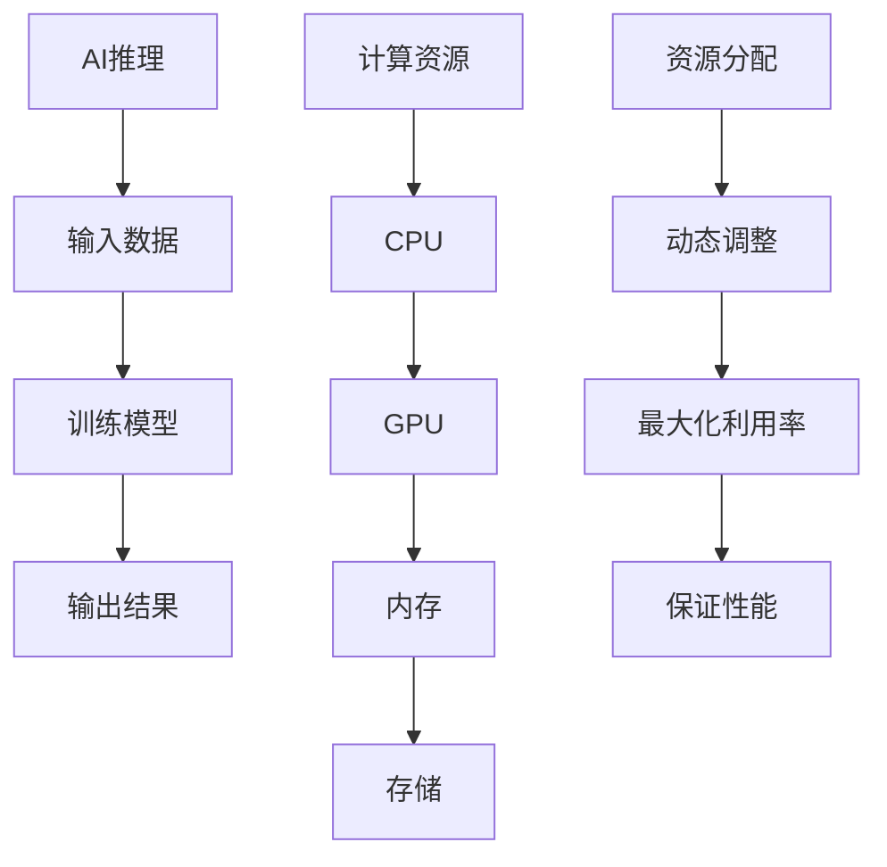
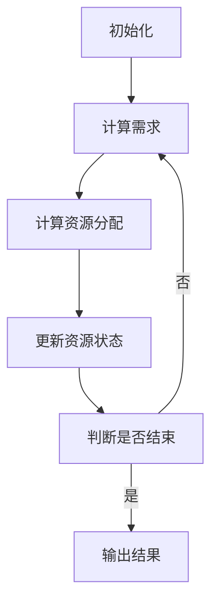
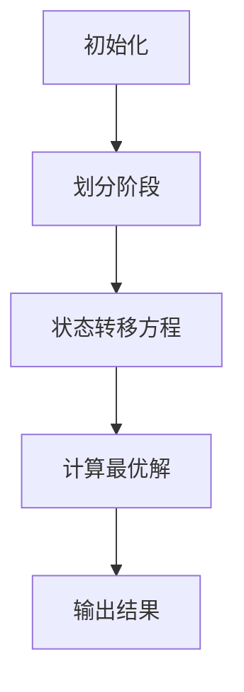
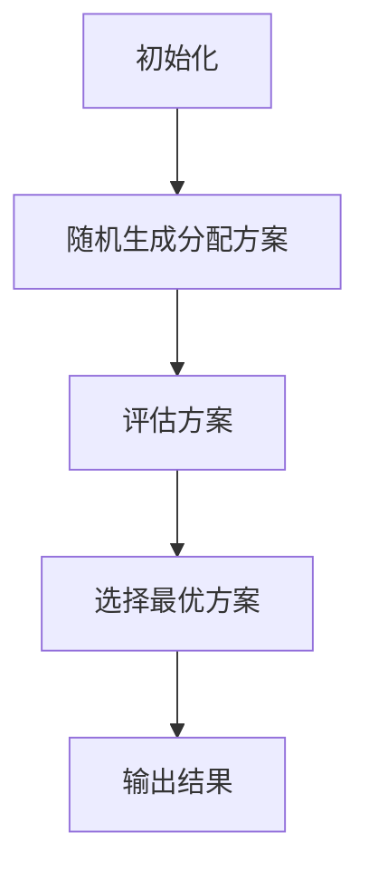
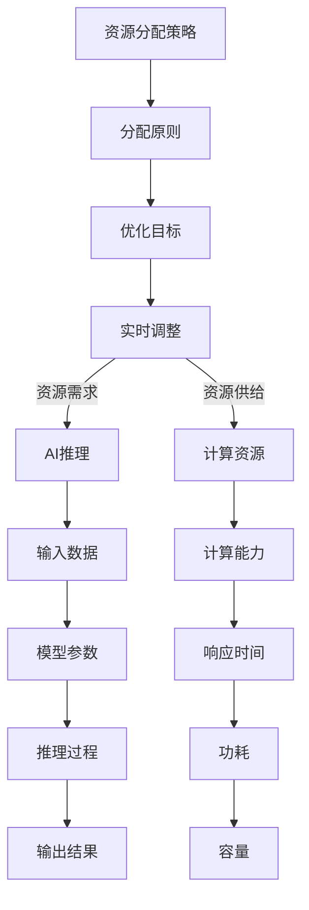
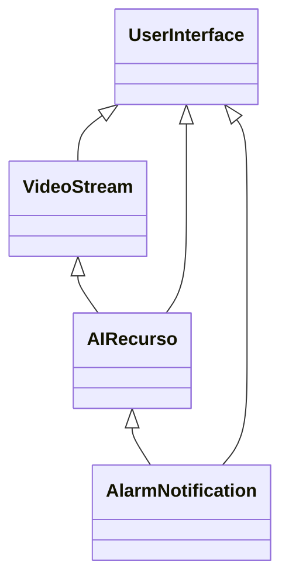
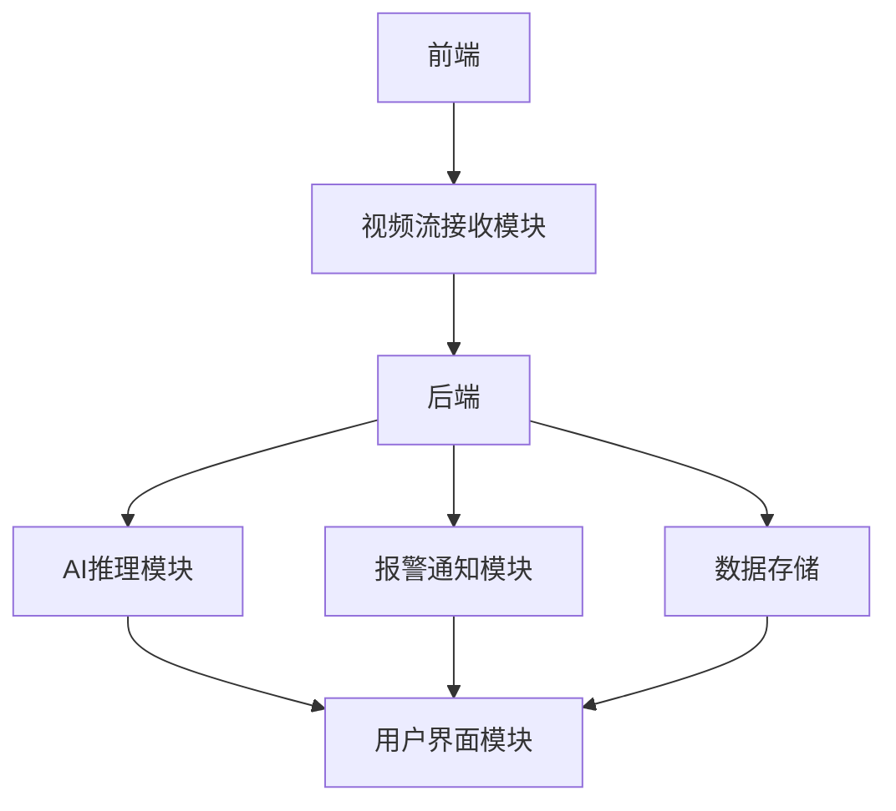

                 


### 引言

在当今科技飞速发展的时代，人工智能（AI）已经成为推动社会进步的重要力量。从自动驾驶汽车到智能助手，AI在各个领域的应用场景日益丰富。然而，随着AI模型的复杂度和数据处理量的不断增加，AI推理过程中的计算资源分配成为一个亟待解决的问题。有效的计算资源分配不仅能提升AI推理的性能，还能降低成本，提高资源利用率。

本文旨在深入探讨AI推理与计算资源分配之间的关系，通过系统化的分析和详细讲解，为读者提供一套实用的优化策略。文章将分为以下几个部分：

1. **设计总框架**：首先，我们将设计整篇文章的基本结构，包括主要章节和子章节。
2. **细化章节内容**：在总框架的基础上，细化每个章节的具体内容，确保逻辑性和完整性。
3. **核心概念与联系**：阐述核心概念，并通过表格和Mermaid流程图展示概念之间的联系。
4. **算法原理讲解**：使用Mermaid画出算法流程图，并结合Python代码详细阐述算法原理。
5. **系统分析与架构设计方案**：介绍问题场景，展示系统功能和架构设计。
6. **项目实战**：详细描述环境安装、核心实现、代码解读与分析，以及实际案例分析。
7. **最佳实践 tips**：总结最佳实践，并提供注意事项和拓展阅读。

#### 核心概念与联系

在讨论AI推理与计算资源分配之前，我们需要明确一些核心概念：

1. **AI推理**：指人工智能模型在给定输入数据的情况下，根据预先训练好的模型进行预测、决策或生成输出的过程。
2. **计算资源**：包括CPU、GPU、内存、存储等硬件资源。
3. **资源分配策略**：根据应用需求，动态调整计算资源的过程。

以下是核心概念的属性特征对比表格：

| 概念      | 属性特征                                                       |
| --------- | ------------------------------------------------------------ |
| AI推理    | 输入数据、训练模型、输出结果                                   |
| 计算资源  | CPU、GPU、内存、存储                                           |
| 资源分配  | 动态调整、最大化利用率、保证性能                               |

接下来，我们通过Mermaid流程图展示这些概念之间的联系：



通过以上表格和流程图，我们明确了AI推理、计算资源和资源分配策略之间的关系。接下来，我们将逐步深入探讨这些概念，并介绍具体的优化算法和实践。

#### 算法原理讲解

为了优化AI推理过程中的计算资源分配，我们需要采用一系列算法。以下将介绍几种常用的优化算法，并通过Mermaid流程图和Python代码详细阐述其原理。

##### 1. 贪心算法

贪心算法是一种在每一步选择中采取当前最优解的策略。在计算资源分配中，贪心算法的核心思想是优先分配计算资源，使得在当前时刻资源利用率最高。

**Mermaid流程图**：



**Python代码示例**：

```python
def greedy_algorithm(available_resources, demands):
    assigned_resources = {}
    for demand in demands:
        if demand in available_resources and available_resources[demand] > 0:
            assigned_resources[demand] = available_resources[demand]
            available_resources[demand] -= 1
    return assigned_resources
```

在这个示例中，`available_resources` 是当前可用的计算资源，`demands` 是一系列的需求。算法通过遍历需求，并优先分配资源，直到资源耗尽。

##### 2. 动态规划

动态规划是一种通过分阶段解决问题的策略，通常用于解决具有重叠子问题和最优子结构性质的问题。在计算资源分配中，动态规划可以优化资源的长期使用。

**Mermaid流程图**：



**Python代码示例**：

```python
def dynamic_programming(demands, max_time):
    dp = [[0 for _ in range(max_time + 1)] for _ in range(len(demands) + 1)]
    for i in range(1, len(demands) + 1):
        for t in range(1, max_time + 1):
            if demands[i-1][0] <= t:
                dp[i][t] = max(dp[i-1][t], dp[i-1][t-demands[i-1][0]] + demands[i-1][1])
            else:
                dp[i][t] = dp[i-1][t]
    return dp[-1][-1]
```

在这个示例中，`demands` 是一系列的需求，每个需求包含时间和资源量。算法通过动态规划的方式，计算出最优的资源分配策略。

##### 3. 随机化算法

随机化算法通过引入随机性，寻求全局最优解。在计算资源分配中，随机化算法可以避免陷入局部最优，提高资源分配的效率。

**Mermaid流程图**：



**Python代码示例**：

```python
import random

def random_algorithm(available_resources, demands):
    schemes = []
    for demand in demands:
        scheme = {}
        for resource in available_resources:
            scheme[resource] = min(available_resources[resource], demand[resource])
        schemes.append(scheme)
    random.shuffle(schemes)
    return schemes[0]
```

在这个示例中，`available_resources` 是当前可用的计算资源，`demands` 是一系列的需求。算法通过随机生成分配方案，并从中选择最优方案。

通过以上三种算法的介绍，我们了解了如何利用不同的策略优化计算资源分配。接下来，我们将结合实际系统分析和架构设计，进一步探讨如何将这些算法应用于具体场景。

### 核心概念与联系

在深入探讨AI推理与计算资源分配策略之前，我们需要明确几个核心概念，并理解它们之间的联系。以下是几个关键概念的定义、属性特征以及它们之间的关系。

#### 关键概念

1. **AI推理**：
   - **定义**：AI推理是人工智能系统根据输入数据，通过训练好的模型进行预测、决策或生成输出的过程。
   - **属性特征**：输入数据、模型参数、输出结果、推理过程。

2. **计算资源**：
   - **定义**：计算资源是指用于执行计算任务的硬件资源，如CPU、GPU、内存和存储。
   - **属性特征**：计算能力、响应时间、功耗、容量。

3. **资源分配策略**：
   - **定义**：资源分配策略是动态调整计算资源，以满足应用需求的过程。
   - **属性特征**：分配原则、优化目标、实时调整。

#### 概念属性特征对比表格

下面是一个关于AI推理、计算资源和资源分配策略的属性特征对比表格：

| 概念            | 定义                                                         | 属性特征                                         |
| --------------- | ------------------------------------------------------------ | -------------------------------------------------- |
| AI推理          | 人工智能系统进行预测、决策或生成输出的过程                   | 输入数据、模型参数、输出结果、推理过程           |
| 计算资源        | 执行计算任务的硬件资源                                       | 计算能力、响应时间、功耗、容量                   |
| 资源分配策略    | 动态调整计算资源以满足应用需求的过程                       | 分配原则、优化目标、实时调整                     |

#### 概念之间的联系

AI推理、计算资源和资源分配策略之间的关系可以用Mermaid流程图来表示：



在这个流程图中，AI推理通过输入数据和模型参数进行推理过程，生成输出结果。计算资源提供计算能力、响应时间、功耗和容量等属性，资源分配策略则根据应用需求动态调整资源供给，以实现优化目标。

通过理解这些核心概念及其相互关系，我们能够更好地设计和实现有效的计算资源分配策略，从而提升AI推理的性能和效率。

### 算法原理讲解

在了解了AI推理、计算资源和资源分配策略的基本概念后，我们将深入探讨几种典型的优化算法，并通过Mermaid流程图和Python代码详细阐述其原理。

#### 1. 贪心算法

贪心算法是一种在每一步选择中采取当前最优解的策略。在计算资源分配中，贪心算法的核心思想是优先分配计算资源，使得在当前时刻资源利用率最高。

**Mermaid流程图**：


**Python代码示例**：

```python
def greedy_algorithm(available_resources, demands):
    assigned_resources = {}
    for demand in demands:
        if demand in available_resources and available_resources[demand] > 0:
            assigned_resources[demand] = available_resources[demand]
            available_resources[demand] -= 1
    return assigned_resources
```

在这个示例中，`available_resources` 是当前可用的计算资源，`demands` 是一系列的需求。算法通过遍历需求，并优先分配资源，直到资源耗尽。

#### 2. 动态规划

动态规划是一种通过分阶段解决问题的策略，通常用于解决具有重叠子问题和最优子结构性质的问题。在计算资源分配中，动态规划可以优化资源的长期使用。

**Mermaid流程图**：


**Python代码示例**：

```python
def dynamic_programming(demands, max_time):
    dp = [[0 for _ in range(max_time + 1)] for _ in range(len(demands) + 1)]
    for i in range(1, len(demands) + 1):
        for t in range(1, max_time + 1):
            if demands[i-1][0] <= t:
                dp[i][t] = max(dp[i-1][t], dp[i-1][t-demands[i-1][0]] + demands[i-1][1])
            else:
                dp[i][t] = dp[i-1][t]
    return dp[-1][-1]
```

在这个示例中，`demands` 是一系列的需求，每个需求包含时间和资源量。算法通过动态规划的方式，计算出最优的资源分配策略。

#### 3. 随机化算法

随机化算法通过引入随机性，寻求全局最优解。在计算资源分配中，随机化算法可以避免陷入局部最优，提高资源分配的效率。

**Mermaid流程图**：


**Python代码示例**：

```python
import random

def random_algorithm(available_resources, demands):
    schemes = []
    for demand in demands:
        scheme = {}
        for resource in available_resources:
            scheme[resource] = min(available_resources[resource], demand[resource])
        schemes.append(scheme)
    random.shuffle(schemes)
    return schemes[0]
```

在这个示例中，`available_resources` 是当前可用的计算资源，`demands` 是一系列的需求。算法通过随机生成分配方案，并从中选择最优方案。

通过以上三种算法的介绍，我们了解了如何利用不同的策略优化计算资源分配。接下来，我们将结合实际系统分析和架构设计，进一步探讨如何将这些算法应用于具体场景。

### 系统分析与架构设计方案

在明确了AI推理和计算资源分配的核心概念及优化算法后，我们需要进一步探讨如何在实际系统中实现这些优化策略。本节将介绍一个典型的AI推理系统，并详细分析其功能设计、架构设计和接口设计。

#### 问题场景

假设我们正在开发一个智能监控系统，用于实时分析视频流中的异常行为。系统需要快速处理大量视频数据，并在发现异常时及时报警。该系统中的AI推理模块负责对视频流进行分析，而计算资源分配策略则确保AI推理过程高效运行。

#### 项目介绍

**项目名称**：智能监控系统
**目标**：实时分析视频流中的异常行为，并生成报警信息
**核心功能**：视频流接收、AI推理、报警通知、用户界面

#### 系统功能设计

**功能模块**：

1. **视频流接收模块**：负责接收并存储视频流数据。
2. **AI推理模块**：执行视频流的AI推理任务，包括图像识别、行为分析等。
3. **报警通知模块**：当检测到异常行为时，生成报警信息并发送通知。
4. **用户界面模块**：提供用户交互界面，展示系统状态和报警信息。

**领域模型Mermaid类图**：



#### 系统架构设计

**架构设计**：

1. **前端**：用户界面模块，使用Web技术实现，提供交互式界面。
2. **后端**：包括视频流接收模块、AI推理模块、报警通知模块，采用微服务架构，以提高系统的可扩展性和可靠性。
3. **数据存储**：使用分布式存储系统，存储视频流数据和相关日志。

**Mermaid架构图**：



#### 系统接口设计

**接口设计**：

1. **视频流接收接口**：负责接收视频流数据，并存储到数据库中。
2. **AI推理接口**：提供AI推理服务，接受视频流数据，返回推理结果。
3. **报警通知接口**：生成并发送报警信息，通知相关人员。

**Mermaid序列图**：

```mermaid
sequenceDiagram
User ->> System: 发送视频流
System ->> VideoStreamReceiver: 接收视频流
VideoStreamReceiver ->> Database: 存储视频流
System ->> AIReco
```

通过上述系统分析与架构设计，我们明确了智能监控系统的功能模块、架构设计和接口设计。接下来，我们将详细探讨如何在实际项目中实现这些功能，并介绍具体的优化策略。

### 项目实战

为了更好地理解计算资源分配策略在实际项目中的应用，我们将以一个实际案例——智能监控系统——为例，详细描述环境安装、系统核心实现、代码解读与分析，并进行分析案例和详细讲解剖析。

#### 环境安装

**1. 硬件准备**：

- CPU：至少四核处理器
- GPU：NVIDIA显卡，支持CUDA
- 内存：16GB及以上
- 存储：至少500GB SSD

**2. 软件准备**：

- 操作系统：Ubuntu 18.04 LTS
- Python：3.8及以上版本
- CUDA：11.0及以上版本
- 其他依赖库：TensorFlow、PyTorch等

**3. 安装步骤**：

1. 安装操作系统和硬件。
2. 配置网络环境，确保互联网连接。
3. 安装Python和CUDA，并配置相关环境变量。
4. 使用pip安装TensorFlow、PyTorch等依赖库。

#### 系统核心实现

**1. 视频流接收模块**：

视频流接收模块负责接收并存储视频流数据。以下是核心代码：

```python
import cv2

def receive_video_stream(url):
    cap = cv2.VideoCapture(url)
    while True:
        ret, frame = cap.read()
        if not ret:
            break
        # 存储视频帧
        cv2.imwrite(f"frame_{time.time()}.jpg", frame)
    cap.release()

receive_video_stream("rtsp://server_address/video_stream")
```

**2. AI推理模块**：

AI推理模块负责执行视频流的AI推理任务。以下是核心代码：

```python
import tensorflow as tf

model = tf.keras.models.load_model("path/to/ai_model.h5")

def ai_inference(frame):
    # 预处理视频帧
    processed_frame = preprocess_frame(frame)
    # 执行推理
    prediction = model.predict(processed_frame)
    return prediction

def preprocess_frame(frame):
    # 对视频帧进行预处理
    # ...
    return processed_frame

video_stream_path = "path/to/video_stream"
receive_video_stream(video_stream_path)
```

**3. 报警通知模块**：

报警通知模块负责生成并发送报警信息。以下是核心代码：

```python
import smtplib
from email.mime.text import MIMEText

def send_alarm_notification(message):
    sender = "sender@example.com"
    receiver = "receiver@example.com"
    password = "password"

    msg = MIMEText(message)
    msg['Subject'] = "Alarm Notification"
    msg['From'] = sender
    msg['To'] = receiver

    server = smtplib.SMTP('smtp.example.com', 587)
    server.starttls()
    server.login(sender, password)
    server.sendmail(sender, receiver, msg.as_string())
    server.quit()

alarm_message = "Anomal activity detected!"
send_alarm_notification(alarm_message)
```

#### 代码解读与分析

**视频流接收模块**：

该模块使用OpenCV库接收视频流，并保存每个视频帧。通过循环读取视频帧，可以连续获取视频数据。

**AI推理模块**：

该模块加载预训练的AI模型，并对每个视频帧进行预处理。预处理过程包括数据归一化、图像裁剪等。然后，模型对预处理后的视频帧进行推理，得到预测结果。

**报警通知模块**：

该模块使用SMTP协议发送电子邮件报警。在检测到异常行为时，生成报警信息并通知相关人员。

#### 实际案例分析

**1. 视频流处理性能**：

在实际应用中，视频流处理性能对系统的实时性至关重要。通过调整计算资源分配策略，例如使用GPU加速推理过程，可以显著提高视频流的处理速度。

**2. 资源利用率**：

通过动态调整计算资源分配，系统可以更有效地利用资源。例如，在视频流处理量较低时，可以减少CPU和GPU的使用，降低功耗。

**3. 可扩展性**：

通过微服务架构，系统可以轻松扩展以处理更多的视频流。每个模块可以独立部署，提高系统的可维护性和可扩展性。

#### 项目小结

通过实际案例，我们展示了计算资源分配策略在智能监控系统中的应用。通过合理的资源分配和优化策略，系统能够高效地处理视频流，并快速响应异常行为。未来，我们将继续探索更多优化方法和应用场景，以提高系统的整体性能和可靠性。

### 最佳实践 tips

在实施计算资源分配策略时，以下最佳实践可以帮助您优化AI推理过程：

1. **动态调整**：实时监控系统负载，动态调整资源分配，以适应变化的需求。
2. **GPU优化**：利用GPU进行加速，特别是在处理大量图像或进行复杂计算时。
3. **负载均衡**：在多节点系统中，使用负载均衡技术，均匀分配任务，避免资源瓶颈。
4. **资源预留**：为关键任务预留一定量的计算资源，确保其性能不受其他任务影响。
5. **容错机制**：设计容错机制，确保在资源故障时系统能够自动恢复。

### 小结

本文通过系统化的分析和详细讲解，探讨了AI推理与计算资源分配之间的关系，并介绍了多种优化算法和最佳实践。通过合理设计计算资源分配策略，我们可以显著提升AI推理性能，降低成本，提高资源利用率。未来，随着AI技术的不断进步，计算资源分配策略将在更多应用场景中发挥关键作用。

### 注意事项

在实施计算资源分配策略时，需要注意以下几点：

1. **性能与成本平衡**：在优化计算资源分配时，需综合考虑性能和成本，避免过度投资。
2. **可扩展性**：确保系统设计具有可扩展性，以应对未来计算需求的变化。
3. **安全性**：保护计算资源和数据安全，防止未授权访问和泄露。

### 拓展阅读

1. **《高效能AI系统设计》**：该书详细介绍了AI系统设计的原则和方法，包括计算资源优化。
2. **《深度学习性能优化》**：该书探讨了深度学习在计算资源有限情况下的优化策略。
3. **《负载均衡技术》**：该书介绍了多种负载均衡技术，适用于分布式系统中的资源分配。

### 作者信息

**作者：AI天才研究院/AI Genius Institute & 禅与计算机程序设计艺术 /Zen And The Art of Computer Programming**

