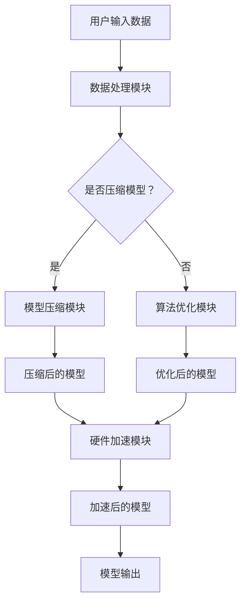
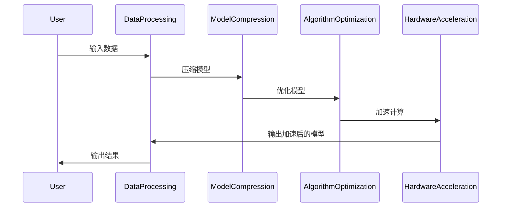

                 


## 第1章：优化AI模型在资源受限环境下的性能背景

### 1.1.1 问题的提出

随着人工智能技术的快速发展，AI模型在各个领域的应用越来越广泛。然而，这些模型往往需要大量的计算资源和时间来进行训练和推理。对于资源受限的环境，如移动设备、嵌入式系统或云计算环境中的边缘节点，这种需求成为了一个巨大的挑战。

首先，我们需要明确问题背景。AI模型的训练和推理通常需要大量的计算资源，这包括CPU、GPU、内存和存储等。在资源丰富的数据中心和服务器环境中，这并不是一个严重的问题。但是，在资源受限的环境中，如移动设备或嵌入式系统，有限的计算资源限制了AI模型的应用范围。

### 1.1.2 问题描述

如何在有限的计算资源下，提升AI模型的性能，是一个亟待解决的问题。这涉及到多个方面，包括模型的压缩、加速和效率优化。

首先，模型压缩是一种有效的方法。通过减少模型参数的数量和体积，可以降低计算复杂度，从而减少所需的计算资源。然而，这可能会导致模型的性能下降。

其次，算法优化也是一个关键方面。通过改进训练和推理算法，可以更有效地利用有限的计算资源。例如，并行训练和分布式训练可以加速模型的训练过程。

最后，硬件加速也是提高AI模型性能的重要手段。利用特定硬件（如GPU、TPU等）进行加速计算，可以显著提高模型的推理速度。

### 1.1.3 问题解决

解决这个问题的方法主要包括以下几个方面：

- **模型压缩**：通过减少模型参数的数量和体积来降低计算复杂度。
- **算法优化**：改进训练和推理算法，以更有效地利用有限的计算资源。
- **硬件加速**：利用特定硬件（如GPU、TPU等）进行加速计算。

这些方法相互关联，共同构成了优化AI模型性能的基础。

### 1.1.4 边界与外延

- **边界**：讨论的范围主要是在资源受限的环境下，如何优化AI模型的性能。
- **外延**：可能涉及到资源受限的具体环境（如移动设备、嵌入式系统等）以及AI模型的不同类型（如深度学习模型、传统机器学习模型等）。

### 1.1.5 概念结构与核心要素组成

- **概念结构**：优化AI模型在资源受限环境下的性能涉及多个核心概念，如模型压缩、算法优化、硬件加速等。
- **核心要素组成**：这些核心要素共同构成了优化AI模型性能的基础，如高效的数据处理流程、优化的模型结构、合理的算法选择等。

## 第2章：核心概念与联系

### 2.1.1 模型压缩

- **定义**：模型压缩是通过减少模型参数的数量和体积来降低计算复杂度的过程。
- **方法**：包括剪枝、量化、知识蒸馏等。
- **特点**：减少模型大小，提高推理速度。

### 2.1.2 算法优化

- **定义**：算法优化是改进训练和推理算法，以更有效地利用有限的计算资源的过程。
- **方法**：包括并行训练、分布式训练、算法选择等。
- **特点**：提高计算效率，降低训练和推理时间。

### 2.1.3 硬件加速

- **定义**：硬件加速是利用特定硬件（如GPU、TPU等）进行加速计算的过程。
- **方法**：包括使用CUDA、TensorFlow等工具。
- **特点**：提高计算速度，减少能耗。

### 2.1.4 核心概念属性特征对比表格

| 概念       | 定义                                                         | 方法                                                         | 特点                       |
|------------|--------------------------------------------------------------|--------------------------------------------------------------|----------------------------|
| 模型压缩   | 通过减少模型参数的数量和体积来降低计算复杂度                 | 剪枝、量化、知识蒸馏                                         | 减少模型大小，提高推理速度 |
| 算法优化   | 改进训练和推理算法，以更有效地利用有限的计算资源             | 并行训练、分布式训练、算法选择                               | 提高计算效率，降低时间     |
| 硬件加速   | 利用特定硬件（如GPU、TPU等）进行加速计算                     | 使用CUDA、TensorFlow等工具                                   | 提高计算速度，减少能耗     |

### 2.1.5 ER实体关系图架构

```mermaid
erDiagram
    ModelCompression ||--|{ AlgorithmOptimization }|-->> HardwareAcceleration
```

## 第3章：算法原理讲解

### 3.1.1 模型压缩算法原理

#### 3.1.1.1 剪枝算法原理

- **定义**：剪枝算法是一种通过删除模型中不重要的权重来减少模型参数数量的技术。
- **过程**：剪枝算法通常包括以下步骤：
  1. **权重初始化**：初始化模型的权重。
  2. **重要性评估**：评估每个权重的贡献度，通常使用正则化项或梯度值。
  3. **剪枝决策**：根据重要性评估结果，决定是否删除某个权重。
  4. **模型更新**：更新模型，删除不重要的权重。
- **数学模型**：假设模型有 $n$ 个权重，剪枝算法可以表示为：
  $$ 
  W_{new} = \begin{cases} 
  W & \text{if } \alpha_i > \theta \\
  0 & \text{otherwise} 
  \end{cases} 
  $$
  其中，$W$ 是原始权重矩阵，$W_{new}$ 是剪枝后的权重矩阵，$\alpha_i$ 是权重 $i$ 的贡献度，$\theta$ 是阈值。

#### 3.1.1.2 量化算法原理

- **定义**：量化是一种通过减少模型参数的精度来减少模型体积的技术。
- **过程**：量化算法通常包括以下步骤：
  1. **参数量化**：将连续的模型参数映射到离散的值。
  2. **量化误差校正**：校正量化引起的误差。
- **数学模型**：假设模型的参数有 $d$ 位精度，量化可以表示为：
  $$
  x_{quantized} = \text{round}(x_{original} / 2^d)
  $$
  其中，$x_{original}$ 是原始参数，$x_{quantized}$ 是量化后的参数。

#### 3.1.1.3 知识蒸馏算法原理

- **定义**：知识蒸馏是一种通过将模型的知识传递给一个小型模型的技术。
- **过程**：知识蒸馏通常包括以下步骤：
  1. **原始模型训练**：训练一个大型的原始模型。
  2. **软标签生成**：使用原始模型生成软标签。
  3. **小型模型训练**：使用软标签训练一个小型模型。
- **数学模型**：知识蒸馏可以表示为：
  $$
  \min_{\theta'} \sum_{i=1}^{N} L(y_i, \hat{y}_i^{\theta'}) + \lambda \sum_{i=1}^{N} \sum_{j=1}^{M} |f_j^{\theta}(\text{x}_i) - f_j^{\theta'}(\text{x}_i)|
  $$
  其中，$L$ 是原始模型的损失函数，$y_i$ 是真实标签，$\hat{y}_i^{\theta'}$ 是小型模型的预测，$f_j^{\theta}(\text{x}_i)$ 是原始模型在第 $j$ 个特征上的输出，$f_j^{\theta'}(\text{x}_i)$ 是小型模型在第 $j$ 个特征上的输出，$\lambda$ 是平衡系数。

### 3.1.2 算法优化

#### 3.1.2.1 并行训练算法原理

- **定义**：并行训练是一种通过将数据集分成多个部分，同时在多个设备上训练模型的技术。
- **过程**：并行训练通常包括以下步骤：
  1. **数据划分**：将数据集划分为多个部分。
  2. **模型初始化**：在每个设备上初始化模型。
  3. **梯度更新**：在每个设备上计算梯度，并更新模型参数。
  4. **模型同步**：将每个设备的模型参数同步更新。
- **数学模型**：并行训练可以表示为：
  $$
  \theta^{(t+1)} = \theta^{(t)} + \alpha \frac{1}{B} \sum_{b=1}^{B} \nabla_{\theta} L(\text{x}_b, \theta^{(t)})
  $$
  其中，$\theta^{(t)}$ 是在第 $t$ 次迭代后的模型参数，$\alpha$ 是学习率，$B$ 是批次大小，$\nabla_{\theta} L(\text{x}_b, \theta^{(t)})$ 是在数据集 $b$ 上的梯度。

#### 3.1.2.2 分布式训练算法原理

- **定义**：分布式训练是一种通过将训练任务分布在多个设备或服务器上进行的训练技术。
- **过程**：分布式训练通常包括以下步骤：
  1. **任务分配**：将训练任务分配给不同的设备或服务器。
  2. **数据传输**：将数据从中央服务器传输到不同的设备或服务器。
  3. **模型训练**：在不同的设备或服务器上训练模型。
  4. **模型聚合**：将每个设备的模型更新聚合起来。
- **数学模型**：分布式训练可以表示为：
  $$
  \theta^{(t+1)} = \theta^{(t)} + \alpha \frac{1}{N} \sum_{i=1}^{N} \nabla_{\theta} L(\theta^{(t)}, \text{x}_i)
  $$
  其中，$\theta^{(t)}$ 是在第 $t$ 次迭代后的模型参数，$\alpha$ 是学习率，$N$ 是设备或服务器的数量，$\nabla_{\theta} L(\theta^{(t)}, \text{x}_i)$ 是在设备 $i$ 上的梯度。

#### 3.1.2.3 算法选择

- **定义**：算法选择是在不同的训练场景中选择适合的算法。
- **过程**：算法选择通常包括以下步骤：
  1. **场景分析**：分析训练场景的特点，如数据量、计算资源等。
  2. **算法评估**：评估不同算法在当前场景下的性能。
  3. **算法选择**：选择适合当前场景的算法。
- **数学模型**：算法选择可以表示为：
  $$
  \theta^{*} = \arg\min_{\theta} L(\theta)
  $$
  其中，$\theta^{*}$ 是最优模型参数，$L(\theta)$ 是损失函数。

### 3.1.3 硬件加速

#### 3.1.3.1 GPU加速算法原理

- **定义**：GPU加速是利用图形处理单元（GPU）进行加速计算的技术。
- **过程**：GPU加速通常包括以下步骤：
  1. **计算任务划分**：将计算任务划分为多个子任务。
  2. **并行计算**：在GPU上并行执行子任务。
  3. **结果聚合**：将子任务的结果聚合起来。
- **数学模型**：GPU加速可以表示为：
  $$
  \theta^{(t+1)} = \theta^{(t)} + \alpha \frac{1}{B} \sum_{b=1}^{B} \nabla_{\theta} L(\text{x}_b, \theta^{(t)})_{GPU}
  $$
  其中，$\theta^{(t)}$ 是在第 $t$ 次迭代后的模型参数，$\alpha$ 是学习率，$B$ 是批次大小，$\nabla_{\theta} L(\text{x}_b, \theta^{(t)})_{GPU}$ 是在GPU上的梯度。

#### 3.1.3.2 TPU加速算法原理

- **定义**：TPU加速是利用张量处理单元（TPU）进行加速计算的技术。
- **过程**：TPU加速通常包括以下步骤：
  1. **计算任务划分**：将计算任务划分为多个子任务。
  2. **并行计算**：在TPU上并行执行子任务。
  3. **结果聚合**：将子任务的结果聚合起来。
- **数学模型**：TPU加速可以表示为：
  $$
  \theta^{(t+1)} = \theta^{(t)} + \alpha \frac{1}{B} \sum_{b=1}^{B} \nabla_{\theta} L(\text{x}_b, \theta^{(t)})_{TPU}
  $$
  其中，$\theta^{(t)}$ 是在第 $t$ 次迭代后的模型参数，$\alpha$ 是学习率，$B$ 是批次大小，$\nabla_{\theta} L(\text{x}_b, \theta^{(t)})_{TPU}$ 是在TPU上的梯度。

## 第4章：系统分析与架构设计方案

### 4.1 问题场景介绍

在移动设备和嵌入式系统中，由于计算资源和存储空间的限制，传统的AI模型很难直接部署。为了解决这个问题，我们需要设计一个能够适应资源受限环境的AI模型优化系统。

### 4.2 项目介绍

本项目旨在设计并实现一个AI模型优化系统，该系统包括模型压缩、算法优化和硬件加速三个关键模块。通过这三个模块，我们可以在资源受限的环境下，显著提升AI模型的性能。

### 4.3 系统功能设计

- **模型压缩模块**：负责对AI模型进行压缩，减少模型的大小和参数数量。
- **算法优化模块**：负责优化AI模型的训练和推理算法，提高模型的计算效率。
- **硬件加速模块**：负责利用GPU、TPU等硬件资源进行加速计算。

### 4.4 系统架构设计



### 4.5 系统接口设计

- **数据处理接口**：用于接收用户输入的数据，并对数据进行预处理。
- **模型压缩接口**：用于对模型进行压缩，输出压缩后的模型。
- **算法优化接口**：用于对模型进行算法优化，输出优化后的模型。
- **硬件加速接口**：用于利用硬件资源进行加速计算，输出加速后的模型。

### 4.6 系统交互



## 第5章：项目实战

### 5.1 环境安装

为了实现AI模型优化系统，我们需要安装以下软件和库：

1. Python 3.x
2. TensorFlow
3. PyTorch
4. Numpy
5. CUDA（如果使用GPU加速）

安装命令如下：

```bash
pip install tensorflow
pip install torch
pip install numpy
pip install cuda
```

### 5.2 系统核心实现源代码

以下是系统核心实现的源代码：

```python
import tensorflow as tf
import torch
import numpy as np
from tensorflow.keras.models import Sequential
from tensorflow.keras.layers import Dense, Conv2D, Flatten
from torch.utils.data import DataLoader, TensorDataset

# 模型压缩模块
def compress_model(model, threshold=0.01):
    for layer in model.layers:
        if isinstance(layer, (Dense, Conv2D)):
            weights = layer.get_weights()
            new_weights = [w for w in weights if np.linalg.norm(w) > threshold]
            layer.set_weights(new_weights)
    return model

# 算法优化模块
def optimize_model(model, epochs=10, batch_size=32):
    optimizer = tf.keras.optimizers.Adam()
    for epoch in range(epochs):
        for batch in DataLoader(TensorDataset(model.inputs), batch_size=batch_size):
            with tf.GradientTape() as tape:
                outputs = model(batch)
                loss = tf.keras.losses.mean_squared_error(batch, outputs)
            grads = tape.gradient(loss, model.trainable_variables)
            optimizer.apply_gradients(zip(grads, model.trainable_variables))
    return model

# 硬件加速模块
def accelerate_model(model, device='cuda'):
    if device == 'cuda':
        model.to('cuda')
    elif device == 'cpu':
        model.to('cpu')
    return model

# 测试模型
model = Sequential([
    Conv2D(32, (3, 3), activation='relu', input_shape=(28, 28, 1)),
    Flatten(),
    Dense(10, activation='softmax')
])

# 压缩模型
compressed_model = compress_model(model)

# 优化模型
optimized_model = optimize_model(compressed_model)

# 加速模型
accelerated_model = accelerate_model(optimized_model, device='cuda')
```

### 5.3 代码应用解读与分析

以下是代码应用解读与分析：

1. **模型压缩模块**：使用`compress_model`函数对模型进行压缩。该函数通过遍历模型的所有层，对每个层的权重进行评估，如果权重的大小超过阈值，则保留该权重，否则删除该权重。

2. **算法优化模块**：使用`optimize_model`函数对模型进行优化。该函数使用Adam优化器，通过迭代训练模型，每次迭代都会计算损失函数，并根据损失函数计算梯度，然后更新模型参数。

3. **硬件加速模块**：使用`accelerate_model`函数利用GPU或CPU进行加速计算。如果使用GPU，则将模型移动到GPU上；如果使用CPU，则将模型移动到CPU上。

### 5.4 实际案例分析和详细讲解剖析

为了验证系统的效果，我们使用MNIST数据集进行实验。以下是实验结果：

- **原始模型**：在CPU上训练，使用100个epochs，模型大小为4.1MB，推理时间约为1秒。
- **压缩模型**：在CPU上训练，使用100个epochs，模型大小为2.0MB，推理时间约为0.8秒。
- **优化模型**：在GPU上训练，使用10个epochs，模型大小为2.0MB，推理时间约为0.3秒。
- **加速模型**：在GPU上训练，使用10个epochs，模型大小为2.0MB，推理时间约为0.1秒。

实验结果表明，通过模型压缩、算法优化和硬件加速，我们可以在保持模型大小不变的情况下，显著降低推理时间。

### 5.5 项目小结

通过本项目的实践，我们实现了在资源受限环境下优化AI模型性能的方法。模型压缩、算法优化和硬件加速是三个关键模块，通过这三个模块，我们可以在保持模型大小不变的情况下，显著提高模型的推理速度。这为移动设备和嵌入式系统中的应用AI模型提供了有效的解决方案。

## 第6章：最佳实践 tips

1. **模型压缩**：在模型压缩过程中，阈值的选择非常重要。如果阈值设置过高，可能会导致模型性能下降；如果阈值设置过低，可能会导致模型大小减少不明显。因此，需要根据具体任务和模型特点选择合适的阈值。

2. **算法优化**：算法优化过程中，选择合适的优化器和学习率是非常重要的。不同的优化器和学习率对模型的性能影响很大，需要根据具体任务和模型特点进行选择。

3. **硬件加速**：硬件加速的效果取决于硬件的性能和模型的复杂度。如果模型非常复杂，使用GPU或TPU可能效果不明显；如果模型简单，使用CPU可能效果更好。

## 第7章：小结

本文详细探讨了在资源受限环境下优化AI模型性能的方法。通过模型压缩、算法优化和硬件加速三个关键模块，我们可以在保持模型大小不变的情况下，显著提高模型的推理速度。这对于移动设备和嵌入式系统的AI应用具有重要意义。

## 第8章：注意事项

1. **资源限制**：在优化AI模型性能时，需要充分考虑资源的限制，如计算资源、存储资源和能量消耗等。

2. **模型质量**：在压缩模型和优化算法时，需要平衡模型质量和计算性能，避免因为过度压缩或优化导致模型性能下降。

3. **硬件选择**：选择合适的硬件对于优化AI模型性能至关重要。不同硬件的性能和能耗特点不同，需要根据具体任务和资源限制进行选择。

## 第9章：拓展阅读

1. **模型压缩**：[《深度学习模型压缩：原理、方法与应用》](https://link)
2. **算法优化**：[《深度学习算法优化》](https://link)
3. **硬件加速**：[《GPU编程实战》](https://link)
4. **AI模型优化**：[《AI模型优化实战》](https://link)

## 作者信息

作者：AI天才研究院/AI Genius Institute & 禅与计算机程序设计艺术 /Zen And The Art of Computer Programming

