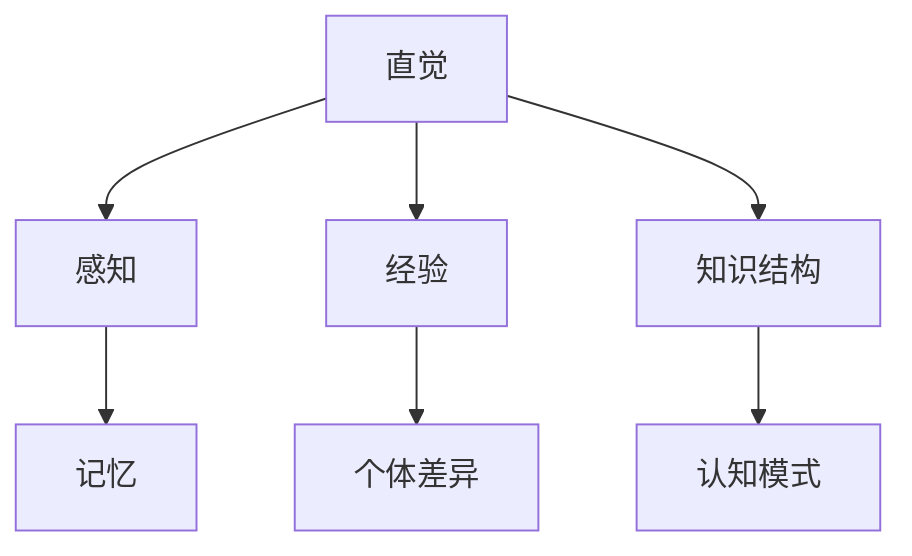

                 

### 前言

在信息技术飞速发展的今天，我们不仅需要依靠逻辑和理性去理解和解决问题，更需要开启内在的直觉智慧，去感知和应对复杂多变的现实世界。直觉，这个看似模糊、难以捉摸的心理现象，实则蕴藏着巨大的潜能和价值。本文旨在探讨直觉的概念、心理学基础，以及在日常生活中的应用和挑战，并最终总结出如何通过实践培养和提升直觉的能力，从而在个人成长、工作和人际交往中发挥其独特的作用。

### 第1章：直觉的哲学探讨

#### 1.1 直觉的概念与哲学思考

直觉（Intuition）一词源于拉丁语“intuere”，意为“看入、观察”。在哲学领域，直觉被看作是超越常规逻辑和理性思考的一种认知方式。亚里士多德曾提出直觉是知识的直接来源，它与理智结合，构成了人类认知的完整过程。在现代哲学中，直觉被重新审视，被视为一种非语言、非逻辑的认知形式，它在决策、创新和艺术创作中发挥着至关重要的作用。

#### 1.1.1 直觉的哲学视角

直觉的哲学视角主要围绕以下几个方面展开：

1. **直觉与理性的关系**：理性强调逻辑推理和系统分析，而直觉则依赖于直觉思维和直接洞察。在哲学上，直觉与理性并非对立，而是互补的。直觉为理性提供洞见和灵感，而理性则对直觉进行验证和深化。

2. **直觉的知识性**：哲学上对直觉的知识性存在争议。一方面，直觉被看作是直接的、非推理的知识形式；另一方面，也有观点认为直觉依赖于背景知识和经验，因此并非完全超越理性。

3. **直觉的哲学应用**：在道德哲学中，直觉被用来探索道德原则和道德判断；在认识论中，直觉被用来探究知识的本质和获取方式。

#### 1.1.2 直觉与理性

直觉与理性之间的关系是一个复杂而深远的话题。理性强调逻辑性、系统性和可验证性，而直觉则更加迅速、直接和本能。以下是直觉与理性之间的几个关键点：

1. **互补性**：直觉和理性各有优势，互补使用可以更全面地理解世界。直觉提供快速洞察和预判，而理性则负责深入分析和验证。

2. **平衡**：在决策和创新过程中，需要平衡直觉和理性的作用。过度依赖直觉可能导致盲目决策，而过度依赖理性则可能错失机遇。

3. **整合**：通过反思和理性分析，我们可以整合直觉的洞见和理性的推理，形成更加全面和深入的认知。

#### 1.2 直觉的历史发展

直觉的概念和历史发展可以追溯到古代哲学和科学。在古希腊，亚里士多德和柏拉图都探讨了直觉的重要性。中世纪时期，直觉被视为信仰和启示的直接体验。直到近代，随着科学方法的发展，直觉开始被重新审视和研究。

1. **古代哲学对直觉的认识**：古代哲学家如苏格拉底和亚里士多德认为直觉是知识的直接来源，与理智相互补充。

2. **近代心理学对直觉的研究**：19世纪末，心理学开始对直觉进行科学实验和研究。威廉·詹姆斯（William James）等心理学家提出了直觉的概念，并试图解释直觉的心理机制。

#### 1.3 直觉在现代社会中的地位

在现代社会，直觉的地位日益凸显。随着信息技术的发展，人们对复杂系统的理解和决策需要更加迅速和准确的直觉能力。

1. **直觉在决策中的作用**：直觉可以帮助我们在短时间内做出有效的决策，特别是在不确定和紧急情况下。

2. **直觉在创新思维中的应用**：直觉激发创新思维，为新的想法和解决方案提供灵感。

### 第2章：直觉心理学研究

#### 2.1 直觉心理学的基本理论

直觉心理学是研究直觉现象的科学，它试图解释直觉的产生机制、作用方式以及个体差异。

#### 2.1.1 直觉心理学的定义

直觉心理学将直觉视为一种快速、无意识的认知过程，它依赖于个体的经验、知识结构和认知模式。直觉不是纯粹的感觉或本能，而是基于长期积累的经验和知识的一种认知方式。

#### 2.1.2 直觉的心理机制

直觉的心理机制包括以下几个关键点：

1. **模式识别**：直觉依赖于快速识别和匹配大脑中的已有模式和当前情境。

2. **背景知识**：直觉依赖于个体的背景知识和经验，这些知识在直觉判断中起到了关键作用。

3. **信息压缩**：直觉能够将复杂的信息进行压缩和简化，以便快速做出判断。

#### 2.2 直觉与认知心理学的关系

直觉与认知心理学有着密切的关系。认知心理学研究人类思维和感知的过程，而直觉则是其中一种重要的认知形式。

1. **直觉与感知的关系**：感知是直觉的基础，直觉依赖于感知系统对信息的处理和解释。

2. **直觉与记忆的关系**：记忆是直觉的重要来源，直觉判断往往依赖于对过往经验和记忆的调用。

#### 2.3 直觉能力的发展与培养

直觉能力并非天生，而是在个体成长过程中逐步发展和培养的。

1. **直觉能力的个体差异**：不同个体在直觉能力上存在差异，这主要受到遗传、环境、教育和经验的影响。

2. **培养直觉的方法与策略**：通过以下方法可以培养和提高直觉能力：

   - **经验积累**：多接触新事物，积累丰富的经验。
   - **刻意练习**：通过特定练习来增强直觉能力，如思维训练、决策练习等。
   - **反思与验证**：对直觉判断进行反思和验证，以提高直觉的准确性。

### 第3章：直觉在日常生活中的应用

#### 3.1 直觉在个人决策中的作用

直觉在个人决策中发挥着重要作用，特别是在复杂、不确定的情况下。直觉可以帮助我们快速评估信息，做出有效决策。

1. **直觉与判断力**：直觉提高了我们的判断力，使我们能够迅速识别潜在的风险和机会。

2. **直觉与选择**：直觉帮助我们在众多选项中快速做出选择，节省决策时间。

#### 3.2 直觉在工作与职业生涯中的应用

直觉在工作与职业生涯中同样重要，特别是在领导力和创新方面。

1. **直觉在领导力培养中的应用**：领导者需要具备敏锐的直觉，以快速洞察团队动态和市场需求。

2. **直觉在创新与创业中的应用**：创新和创业往往涉及未知和不确定性，直觉可以帮助创业者迅速找到创新点。

#### 3.3 直觉在人际交往中的作用

直觉在人际交往中起到关键作用，特别是在理解他人情感和意图方面。

1. **直觉与情商**：直觉提高了我们的情商，使我们能够更好地理解和回应他人的情感。

2. **直觉与人际沟通**：直觉帮助我们更准确地把握沟通的时机和方式，提高沟通效果。

### 第4章：直觉的挑战与误区

#### 4.1 直觉的局限性与风险

尽管直觉在许多情境下具有优势，但它也存在局限性和风险。

1. **直觉的不确定性**：直觉往往基于有限的信息，因此存在一定的不确定性。

2. **直觉的误导性**：直觉可能受到偏见和错误信息的影响，导致错误判断。

#### 4.2 直觉误用的案例与反思

直觉误用可能导致严重的后果，因此我们需要对直觉进行反思和验证。

1. **直觉误用的现象**：例如，过度依赖直觉导致盲目决策，或因直觉偏差而产生误解。

2. **直觉误用的后果**：直觉误用可能导致决策失误、沟通障碍和人际关系紧张。

#### 4.3 如何提高直觉的质量

为了提高直觉的质量，我们需要采取以下措施：

1. **直觉的验证与反思**：对直觉判断进行验证和反思，以减少错误。

2. **直觉与理性的平衡**：在决策过程中，平衡直觉和理性的作用，避免单一依赖。

### 第5章：直觉的实践指南

#### 5.1 直觉感知的技巧

提高直觉感知能力是培养直觉的关键。以下是一些实践技巧：

1. **提高直觉感知的方法**：例如，通过冥想和专注练习来增强感知能力。

2. **直觉感知的实践**：在日常活动中，尝试培养对信息的敏锐感知。

#### 5.2 直觉思维的培养

直觉思维是直觉能力的重要组成部分。以下是一些培养直觉思维的方法：

1. **直觉思维的训练**：通过思维游戏和决策练习来培养直觉思维。

2. **直觉思维的应用**：在工作和生活中，积极运用直觉思维来解决问题。

#### 5.3 直觉行动的策略

直觉行动需要我们在直觉判断的基础上进行有效行动。以下是一些直觉行动的策略：

1. **直觉行动的决策**：在做出决策时，结合直觉和理性分析。

2. **直觉行动的实践**：在日常工作和生活中，尝试运用直觉行动来应对挑战。

### 第6章：直觉的未来与潜力

#### 6.1 直觉与未来科技

随着科技的发展，直觉在人工智能和未来科技中具有广阔的应用前景。

1. **直觉与人工智能**：人工智能需要结合直觉来提高决策和创新能力。

2. **直觉在科技发展中的潜在应用**：例如，在医疗诊断、自动驾驶等领域，直觉可以提供重要的洞见。

#### 6.2 直觉在心灵成长中的角色

直觉在心灵成长中发挥着关键作用，帮助个体实现内在和平和自我实现。

1. **直觉与灵性成长**：直觉与灵性体验密切相关，可以帮助个体探索更高的意识层面。

2. **直觉与内在和平**：通过直觉，个体可以更好地理解自己，实现内心的和谐与平静。

#### 6.3 直觉的无限潜力

直觉具有无限的潜力，可以在各个领域发挥重要作用。

1. **直觉的无限可能性**：直觉可以激发创新的思维，推动科技进步和社会发展。

2. **直觉的未来展望**：随着对直觉研究的深入，直觉将在更多领域得到应用，发挥更大的作用。

### 第7章：直觉的力量——心灵与行动的和谐

#### 7.1 直觉与自我认知

直觉帮助个体深入理解自己，实现自我认知和自我实现。

1. **直觉与自我探索**：直觉引导个体探索内在世界，发现自我潜能。

2. **直觉与自我实现**：直觉帮助个体追求个人目标和理想，实现自我价值。

#### 7.2 直觉与人际关系

直觉在人际交往中发挥着重要作用，帮助个体建立和谐的人际关系。

1. **直觉与同理心**：直觉提高了我们的情商，使我们更能够理解和关爱他人。

2. **直觉与和谐相处**：直觉帮助我们更准确地把握人际沟通的时机和方式，实现和谐相处。

#### 7.3 直觉与生活艺术

直觉在生活艺术中发挥着独特的作用，帮助我们欣赏美、追求美好。

1. **直觉与生活美学**：直觉提高了我们对美的感知和欣赏能力。

2. **直觉与心灵修养**：直觉帮助我们在日常生活中保持内心的平静和宁静。

### 结尾：直觉的力量——开启内在智慧之路

直觉是人类智慧的宝贵财富，通过培养和提升直觉能力，我们可以开启内在智慧，实现个人成长和社会进步。

1. **直觉的力量总结**：直觉在决策、创新、人际交往和生活艺术中发挥着重要作用。

2. **直觉实践的心得与体会**：通过实践直觉，我们能够更好地理解自己和世界，实现内心的和谐与平静。

3. **展望未来：直觉的无限可能**：随着对直觉研究的深入，直觉将在更多领域得到应用，发挥更大的作用。

### 作者信息

作者：AI天才研究院/AI Genius Institute & 禅与计算机程序设计艺术 /Zen And The Art of Computer Programming

### 附录

**核心概念与联系表格**：

| 核心概念 | 概念属性 | 对比特征 |
| -------- | -------- | -------- |
| 直觉 | 快速、直接、无意识的认知过程 | 基于经验、知识结构、感知信息 |
| 理性 | 逻辑推理、系统分析、可验证性 | 精确、详细、系统性 |
| 判断力 | 快速评估、识别风险和机会 | 基于直觉、经验、理性分析 |

**ER实体关系图架构**：

通过本文，我们探讨了直觉的概念、心理学基础、日常应用、挑战以及实践指南，揭示了直觉在个人成长和社会进步中的巨大潜力。希望读者能够通过实践直觉，开启内在智慧，实现更高层次的自我认知和生活艺术。

