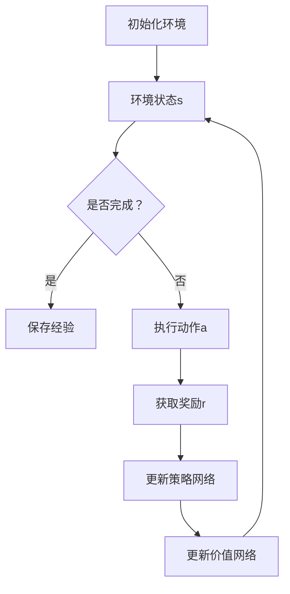
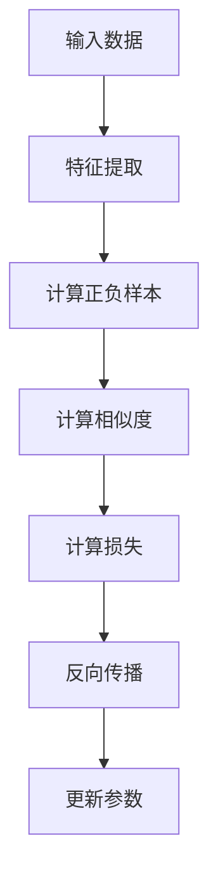
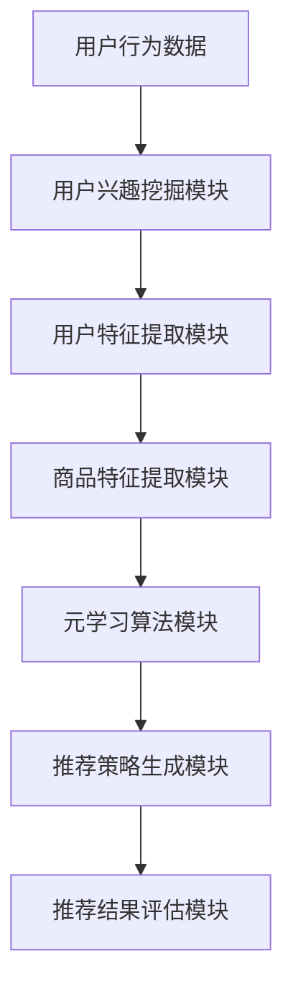

                 

### 元学习的概述

#### 1.1 元学习的定义与背景

**元学习**（Meta-Learning）是指利用机器学习模型来训练其他机器学习模型的过程。换句话说，元学习旨在通过较少的样本数据快速地学习到有效的通用特征表示，以便在新的任务上迅速适应和表现良好。这种能力使得元学习在多种复杂任务场景中具有显著的应用价值。

**元学习的背景与重要性**：随着人工智能技术的快速发展，机器学习在图像识别、自然语言处理、自动驾驶等领域的应用已经取得了显著的成果。然而，传统的机器学习方法通常需要大量标注数据以及长时间的训练过程。这既增加了成本，也限制了其在实际应用中的广泛推广。元学习的提出，正是为了解决这一问题。通过在多个任务间共享知识和经验，元学习能够在有限的数据集上实现高效的学习，并具备良好的泛化能力。

**元学习与传统机器学习的区别**：传统机器学习方法通常针对单个任务进行训练，而元学习则关注多个任务的学习过程。传统方法强调特定任务上的优化，而元学习则更关注通用学习策略的构建。具体来说，元学习通过以下方面与传统机器学习区别开来：

1. **数据量**：元学习可以在数据量较少的情况下进行有效的学习，通过任务间的迁移学习来补充数据不足的问题。
2. **泛化能力**：元学习注重通用特征表示的学习，以提高模型在未见任务上的表现。
3. **效率**：元学习能够减少模型训练所需的时间和计算资源，提高训练效率。
4. **适应性**：元学习具备快速适应新任务的能力，能够动态调整学习策略。

#### 1.2 元学习的应用场景

**自动驾驶**：自动驾驶是元学习应用的一个重要领域。自动驾驶系统需要实时处理大量的环境信息，并做出快速响应。元学习能够通过在不同驾驶场景下的训练，快速适应新的驾驶环境，提高系统的鲁棒性和安全性。

**游戏AI**：在游戏中，AI需要对各种不同类型的游戏进行学习和适应。元学习可以帮助游戏AI快速掌握新游戏规则，提高游戏策略的灵活性和多样性。

**医疗诊断**：医疗诊断领域需要处理海量的医疗数据，并从中提取出有效的诊断特征。元学习可以通过对大量医学数据的迁移学习，提高诊断模型的准确性和效率。

**其他应用领域**：除了上述领域，元学习还在语音识别、自然语言处理、机器人控制等众多领域展现出强大的应用潜力。通过元学习，这些系统可以更加高效地处理复杂的任务，提高整体性能。

**总结**：元学习作为一种新型的机器学习方法，通过在多个任务间共享知识和经验，实现了在数据稀缺、任务复杂等场景下的高效学习。其独特的优势使其在自动驾驶、游戏AI、医疗诊断等众多领域具有广泛的应用前景。随着研究的不断深入，元学习有望在未来的人工智能发展中扮演更加重要的角色。

#### 1.2.1 元学习的定义

元学习（Meta-Learning）可以理解为“学习如何学习”的过程。它不仅关注如何在一个特定的任务上取得好的表现，更强调如何通过通用学习方法在多个任务上实现高效的学习。简单来说，元学习旨在构建一种能够自动适应新任务的机器学习模型。

在传统的机器学习方法中，每个任务都需要独立地训练一个模型，这通常需要大量的标注数据和长时间的训练过程。而元学习通过共享知识和经验，可以在较少的数据集上快速地学习到有效的通用特征表示，从而实现跨任务的迁移学习。

**元学习与传统机器学习的区别**：

1. **数据量**：传统机器学习方法需要大量数据来训练模型，而元学习可以在数据量较少的情况下进行有效的学习。
2. **泛化能力**：传统方法通常针对特定任务进行优化，而元学习则更关注通用特征表示的学习，以提高模型在未见任务上的表现。
3. **效率**：元学习能够减少模型训练所需的时间和计算资源，提高训练效率。
4. **适应性**：元学习具备快速适应新任务的能力，能够动态调整学习策略。

#### 1.2.2 元学习的背景与重要性

**背景**：

随着人工智能技术的快速发展，机器学习在图像识别、自然语言处理、自动驾驶等领域的应用已经取得了显著的成果。然而，这些传统的机器学习方法存在一些局限性：

- **数据依赖**：大多数机器学习方法需要大量的标注数据来训练模型，这在实际应用中往往难以实现。
- **训练时间**：大规模模型的训练通常需要大量的时间和计算资源，这限制了机器学习算法在实际场景中的应用。
- **适应性**：在遇到新任务时，传统方法往往需要重新训练模型，这增加了适应新任务的成本。

**重要性**：

元学习正是为了解决上述问题而提出的。它通过在多个任务间共享知识和经验，能够在较少的数据集上实现高效的学习，并具备良好的泛化能力。具体来说，元学习的重要性体现在以下几个方面：

1. **降低数据需求**：通过迁移学习，元学习可以在数据稀缺的情况下仍然保持良好的性能，降低了数据获取和处理的成本。
2. **提高训练效率**：元学习减少了模型训练所需的时间和计算资源，使得大规模模型的训练变得更加高效。
3. **增强适应性**：元学习能够快速适应新任务，降低了模型适应新任务的成本，提高了系统的灵活性。

总之，元学习为机器学习提供了一种新的思路，它不仅提高了模型的学习效率，还增强了模型的适应能力。随着研究的不断深入，元学习有望在未来的人工智能发展中扮演更加重要的角色。

#### 1.2.3 元学习与传统机器学习的区别

元学习与传统机器学习在方法和目标上有显著的差异。传统机器学习方法通常针对单个特定任务进行训练，通过优化特定的损失函数，使模型在训练数据上达到最佳表现。而元学习则注重于构建一种通用的学习算法，能够在不同的任务上快速适应和表现。

1. **数据依赖**：传统机器学习需要大量标注数据来训练模型，而元学习则可以通过迁移学习在数据稀缺的情况下仍然保持高效的学习。
2. **泛化能力**：传统方法通常针对特定任务优化，而元学习则更关注通用特征表示，以提高模型在未见任务上的表现。
3. **效率**：元学习减少了模型训练所需的时间和计算资源，提高了训练效率。
4. **适应性**：元学习能够快速适应新任务，降低了模型适应新任务的成本。

元学习的这些特性使其在自动驾驶、游戏AI、医疗诊断等领域具有广泛的应用前景。随着研究的深入，元学习有望在更广泛的场景中发挥重要作用。

### 1.2 元学习的应用场景

元学习作为一种先进的机器学习方法，已经在多个领域展现出强大的应用潜力。以下将详细探讨元学习在自动驾驶、游戏AI和医疗诊断这三个具体应用场景中的表现。

#### 1.2.1 自动驾驶

自动驾驶是元学习的一个重要应用领域。自动驾驶系统需要在复杂的交通环境中实时做出决策，处理海量的环境信息。元学习通过在不同驾驶场景下的迁移学习，能够快速适应新的驾驶环境，提高系统的鲁棒性和安全性。

**应用场景**：

- **驾驶环境适应**：元学习可以帮助自动驾驶系统在多种不同的道路条件下进行训练，从而在遇到新环境时能够迅速适应。
- **动态交通管理**：在动态交通管理中，元学习能够通过学习历史交通数据，预测未来的交通状况，并制定最优行驶策略。
- **异常事件检测**：元学习还可以用于检测驾驶过程中的异常事件，如行人突然进入车道等，从而提高系统的安全性能。

**案例**：

例如，某些自动驾驶公司通过元学习算法，结合大量不同驾驶环境的训练数据，使自动驾驶车辆在短时间内实现对新环境的适应。这不仅提高了自动驾驶系统的安全性，还减少了训练时间，降低了成本。

#### 1.2.2 游戏AI

游戏AI是另一个元学习的重要应用领域。在游戏中，AI需要对各种不同类型的游戏进行学习和适应，以实现更高的智能水平。

**应用场景**：

- **游戏策略学习**：元学习可以帮助游戏AI快速掌握新游戏的规则，制定有效的游戏策略。
- **游戏对抗**：在多人游戏中，元学习能够使AI对手更具挑战性，提高游戏的可玩性。
- **角色定制**：通过元学习，游戏AI可以根据玩家的行为模式，定制个性化的游戏角色，提高用户体验。

**案例**：

例如，某些在线游戏平台使用元学习算法，使游戏AI能够根据玩家的游戏习惯，调整自己的策略，从而提供更加个性化的游戏体验。这不仅增加了游戏的趣味性，还提高了用户对游戏的满意度。

#### 1.2.3 医疗诊断

医疗诊断是元学习的又一个重要应用领域。医疗诊断需要处理海量的医疗数据，并从中提取出有效的诊断特征。

**应用场景**：

- **疾病预测**：元学习可以通过对大量历史病例的学习，预测患者未来的健康状况，为医生提供决策支持。
- **疾病诊断**：元学习可以帮助医生从海量的医学数据中，快速提取出有效的诊断特征，提高诊断的准确性。
- **个性化治疗**：元学习可以根据患者的个体差异，制定个性化的治疗方案，提高治疗效果。

**案例**：

例如，某些医疗机构使用元学习算法，通过对大量病例数据的学习，实现了对早期癌症的准确预测，提高了患者的生存率。这不仅为医生提供了有力的工具，也为患者带来了更好的治疗体验。

**总结**：

元学习在自动驾驶、游戏AI和医疗诊断等领域的应用，充分展示了其强大的迁移学习和快速适应能力。随着研究的不断深入，元学习有望在更多领域发挥重要作用，为人工智能的发展提供新的动力。

#### 1.2.4 元学习在自动驾驶中的应用

自动驾驶是元学习应用的一个重要领域，其核心目标是通过模拟真实驾驶场景中的复杂决策过程，使自动驾驶系统能够在实际环境中实现自主驾驶。以下将详细介绍元学习在自动驾驶中的应用场景及其具体实例。

**自动驾驶概述**：

自动驾驶技术依赖于多种传感器，如激光雷达、摄像头和雷达，通过这些传感器收集环境信息，然后利用机器学习算法进行实时处理，以做出安全、高效的驾驶决策。自动驾驶系统的目标是在复杂、动态的交通环境中，实现无人驾驶车辆的自主行驶。

**应用场景**：

- **道路检测**：元学习可以帮助自动驾驶系统识别不同的道路类型，如高速公路、城市道路和乡村道路，从而调整驾驶策略。
- **交通标志与信号识别**：自动驾驶系统需要准确识别交通标志和信号灯，以遵循交通规则。元学习可以通过对大量交通标志的识别训练，提高系统的识别准确率。
- **障碍物检测**：在自动驾驶过程中，障碍物检测是关键的一环。元学习可以帮助系统识别和分类各种障碍物，如行人、自行车、其他车辆等，以提高驾驶安全性。

**实例**：

1. **谷歌Waymo**：
   谷歌的自动驾驶公司Waymo采用了元学习算法，通过在不同驾驶场景下的训练，使自动驾驶车辆能够在各种环境下快速适应。例如，Waymo使用元学习算法来识别和分类交通标志和信号灯，从而在复杂交通环境中做出准确的驾驶决策。

2. **特斯拉Autopilot**：
   特斯拉的Autopilot自动驾驶系统也应用了元学习技术。特斯拉通过收集大量的驾驶数据，利用元学习算法来训练自动驾驶模型，使其能够在不同的驾驶环境中实现高效、安全的驾驶。例如，Autopilot使用元学习算法来识别行人、自行车和其他车辆，从而在遇到紧急情况时能够及时做出反应。

**元学习在自动驾驶中的应用效果**：

- **提高鲁棒性**：通过在不同驾驶场景下的迁移学习，元学习能够提高自动驾驶系统的鲁棒性，使其在复杂、动态的交通环境中表现出更高的稳定性。
- **减少训练时间**：传统自动驾驶系统需要大量的训练数据和长时间的训练过程，而元学习能够在较短的时间内，通过较少的数据实现高效的训练，从而提高系统的开发效率。
- **增强适应性**：元学习能够使自动驾驶系统在遇到新环境或新任务时，快速适应和调整，从而提高系统的灵活性。

**总结**：

元学习在自动驾驶中的应用，不仅提高了系统的鲁棒性和安全性，还减少了训练时间和成本，增强了系统的适应性。随着元学习技术的不断成熟，自动驾驶系统有望在未来实现更加高效、智能的自主驾驶，为人们的出行带来更多的便利和安全保障。

#### 1.2.5 元学习在游戏AI中的应用

元学习在游戏AI中的应用，为其带来了前所未有的智能水平和游戏体验。以下将详细介绍元学习在游戏AI中的应用场景及其具体实例。

**游戏AI概述**：

游戏AI是指通过编程实现的人工智能系统，能在游戏中执行复杂的决策过程，与玩家进行对抗或合作。游戏AI的目标是模拟人类玩家的行为，提高游戏的可玩性和挑战性。

**应用场景**：

- **策略学习**：元学习可以帮助游戏AI快速掌握各种游戏的策略，使其在比赛中更具优势。例如，在《星际争霸II》中，AI通过元学习算法，学会了复杂的多变策略，使比赛更具对抗性。
- **智能对手**：通过元学习，游戏AI能够根据玩家的游戏风格和策略，调整自己的行为，提供更具挑战性的游戏体验。例如，在《英雄联盟》中，游戏AI可以通过元学习，根据玩家的操作习惯和游戏策略，生成相应的对抗策略。
- **角色定制**：元学习还可以用于游戏角色的个性化定制。通过学习玩家的行为数据，AI能够为每个玩家生成独特的游戏角色，提高个性化体验。

**实例**：

1. **《星际争霸II》**：
   《星际争霸II》中，游戏AI使用了元学习算法，通过在不同对战场景下的迁移学习，掌握了复杂的对战策略。这使得游戏AI在比赛中能够灵活应对各种对手的策略，提供了更高的挑战性。

2. **《Dota2》**：
   在《Dota2》的人工智能竞赛中，OpenAI的算法利用元学习，通过在大量游戏数据上的训练，成功击败了人类职业选手。这展示了元学习在游戏AI中的强大能力，不仅提高了AI的智能水平，还为游戏开发提供了新的思路。

**元学习在游戏AI中的应用效果**：

- **提高智能水平**：元学习使游戏AI能够通过较少的训练数据，快速掌握复杂的游戏策略，提高了AI的智能水平。
- **增强游戏体验**：通过个性化定制和智能对手，元学习为玩家提供了更加丰富和具有挑战性的游戏体验。
- **降低开发成本**：元学习通过在多个游戏中的迁移学习，减少了游戏AI的开发成本和时间。

**总结**：

元学习在游戏AI中的应用，不仅提升了AI的智能水平，还为游戏开发提供了新的思路。随着元学习技术的不断发展，游戏AI将能够提供更加智能和个性化的游戏体验，为玩家带来更多的乐趣。

#### 1.2.6 元学习在医疗诊断中的应用

元学习在医疗诊断领域展现出巨大的潜力，通过在海量医学数据上的迁移学习，实现高效、准确的诊断。以下将详细介绍元学习在医疗诊断中的应用场景及其具体实例。

**医疗诊断概述**：

医疗诊断是指通过分析患者的症状、体征和医学影像等数据，判断患者的健康状况和疾病类型。传统的医疗诊断方法通常依赖于专家经验和大量的医学数据，而元学习通过自动化和智能化的方式，提高了诊断的效率和准确性。

**应用场景**：

- **疾病预测**：元学习可以帮助预测患者的未来健康状况，为医生提供诊断参考。例如，通过分析患者的病史、基因信息和生活方式数据，元学习算法可以预测患者患心脏病、糖尿病等疾病的风险。
- **疾病诊断**：元学习可以通过对大量医学影像数据的分析，识别出各种疾病特征，提高诊断的准确性。例如，在乳腺癌诊断中，元学习算法能够从医学影像中识别出微小的病变区域，帮助医生进行早期诊断。
- **个性化治疗**：元学习可以根据患者的个体差异，制定个性化的治疗方案，提高治疗效果。例如，通过分析患者的基因数据、病情和病史，元学习算法可以推荐最适合患者的治疗方法和药物。

**实例**：

1. **肺癌诊断**：
   某些医疗机构利用元学习算法，通过对大量肺癌患者的影像数据进行分析，实现了对肺癌的早期诊断。通过元学习，系统能够在较低误诊率的情况下，准确识别肺癌病变区域，为医生提供了重要的诊断依据。

2. **心脏病风险评估**：
   通过元学习算法，研究人员能够分析患者的基因、生活方式和医疗记录等数据，预测患者患心脏病的风险。这种预测有助于医生在早期采取预防措施，降低心脏病发病的风险。

**元学习在医疗诊断中的应用效果**：

- **提高诊断准确性**：元学习通过在大量医学数据上的迁移学习，提高了诊断的准确性，有助于医生做出更准确的诊断。
- **降低误诊率**：通过自动化分析医学影像数据，元学习减少了人工诊断的误诊率，提高了医疗服务的质量。
- **个性化治疗**：元学习可以根据患者的个体差异，制定个性化的治疗方案，提高治疗效果，为患者提供更好的医疗服务。

**总结**：

元学习在医疗诊断中的应用，不仅提高了诊断的效率和准确性，还为个性化治疗提供了有力支持。随着元学习技术的不断成熟，其在医疗诊断领域的应用将越来越广泛，为医疗行业带来革命性的变革。

### 2.1 元学习的核心概念

元学习作为一种高级的机器学习技术，其核心在于通过在多个任务间共享知识和经验，实现高效的学习和适应。以下将详细解释元学习的几个关键概念，包括参数共享、策略网络与价值网络，以及强化学习与元学习的关系。

#### 2.1.1 参数共享

**参数共享**是元学习中的一个基本概念，它指的是在多个任务中，共享一部分模型参数，而不是为每个任务独立地训练一套参数。这种共享机制的核心思想是通过跨任务的学习，使得模型能够提取出通用的特征表示，从而提高在新任务上的表现。

**具体实现**：

在参数共享的机制下，模型通常会包括两部分：一部分是通用参数，用于在不同任务间共享；另一部分是特定参数，用于处理特定任务的细节。例如，在多任务学习（Multi-Task Learning，MTL）中，多个任务会共享同一组基础特征提取器，而每个任务则有自己的分类器或预测器。

**优势**：

- **减少参数量**：通过参数共享，可以显著减少模型的参数数量，从而降低模型的复杂度和计算成本。
- **提高泛化能力**：共享的通用参数能够捕捉到不同任务中的一些共性特征，从而提高模型在未见任务上的泛化能力。

#### 2.1.2 策略网络与价值网络

**策略网络（Policy Network）与价值网络（Value Network）**是深度强化学习中的两个核心概念，它们在元学习中同样具有重要地位。策略网络负责选择动作，而价值网络则负责评估动作的好坏。

**策略网络**：

策略网络是一种函数，它接受环境状态作为输入，输出最优动作的概率分布。在元学习任务中，策略网络可以帮助模型在未知任务上快速选择有效的动作。通过在多个任务上训练策略网络，模型能够学习到一组通用的策略，从而在新的任务上迅速适应。

**价值网络**：

价值网络是一种函数，它接受状态和动作作为输入，输出状态-动作价值函数。价值网络用于评估策略网络选择的动作的好坏。在元学习任务中，价值网络可以帮助模型在学习过程中进行自我评估和优化，从而提高学习效率。

**关系**：

策略网络与价值网络相互依赖，共同构成深度强化学习的基础。策略网络负责行动决策，而价值网络则提供评估反馈，指导策略网络不断调整和优化决策。

#### 2.1.3 强化学习与元学习的关系

**强化学习**（Reinforcement Learning，RL）是一种重要的机器学习方法，它通过与环境互动来学习最优策略。元学习与强化学习之间存在密切的关系。

**强化学习在元学习中的应用**：

在元学习任务中，强化学习通常用于训练策略网络和价值网络。具体来说，元学习算法通过在多个任务上的强化学习训练，学习到一组通用的策略和价值函数，从而提高模型在未见任务上的表现。

**关系**：

强化学习为元学习提供了实现自适应和优化的机制。通过强化学习，元学习模型能够在不同任务间共享知识和经验，提高学习的效率和效果。同时，元学习为强化学习提供了一种新的框架，使强化学习能够在更广泛的场景中发挥作用。

**总结**：

元学习的核心概念包括参数共享、策略网络与价值网络，以及强化学习与元学习的关系。这些概念共同构成了元学习的基础，使其能够在多个任务间实现高效的学习和适应。随着研究的不断深入，元学习有望在人工智能领域发挥更加重要的作用。

#### 2.2 元学习的类型

元学习有多种类型，每种类型都针对不同的学习任务和应用场景进行了优化。以下将详细介绍几种常见的元学习类型，包括自适应元学习、无监督元学习和对比学习。

##### 2.2.1 自适应元学习

**定义**：

自适应元学习（Adaptive Meta-Learning）是一种通过调整模型参数来适应新任务的学习方法。其核心思想是利用模型在先前任务上学到的知识，快速地在新任务上调整和优化模型。

**实现方法**：

- **任务特定的初始化**：在开始新任务时，自适应元学习算法会利用先前任务中学习到的参数初始化新模型的参数，从而减少从零开始训练的需要。
- **动态调整学习率**：自适应元学习通过动态调整学习率，使得模型在新任务上能够快速收敛，同时避免过拟合。

**应用场景**：

- **在线学习**：在需要实时适应新数据的场景中，如股票交易或智能推荐系统，自适应元学习能够快速更新模型。
- **动态环境**：在环境变化频繁的领域，如自动驾驶或游戏AI，自适应元学习可以帮助模型快速适应新环境。

##### 2.2.2 无监督元学习

**定义**：

无监督元学习（Unsupervised Meta-Learning）是一种在没有明确标注数据的情况下，通过观察数据分布来学习任务的方法。其核心思想是从未标记的数据中提取出通用的特征表示。

**实现方法**：

- **自监督预训练**：无监督元学习通常首先通过自监督预训练方法，如对比学习或生成对抗网络（GAN），在大量未标记数据上学习到通用的特征表示。
- **在线微调**：在获取到新任务数据后，无监督元学习算法会利用这些通用特征表示，在新数据上进行在线微调，从而快速适应新任务。

**应用场景**：

- **新任务快速适应**：在数据稀缺的场景中，如医疗诊断或自然语言处理，无监督元学习能够通过少量标注数据，快速提升模型性能。
- **数据增强**：无监督元学习可以通过生成模拟数据，为模型提供更多的训练样本，从而增强模型的学习能力。

##### 2.2.3 对比学习

**定义**：

对比学习（Contrastive Learning）是一种通过对比数据样本来学习特征表示的方法。其核心思想是通过正样本和负样本的对比，学习到数据之间的区别性特征。

**实现方法**：

- **对比损失函数**：对比学习通常使用对比损失函数，如余弦相似度损失或三元组损失，来最大化正样本之间的相似度，同时最小化负样本之间的相似度。
- **数据增强**：对比学习算法会通过数据增强技术，如裁剪、旋转或颜色变换，来生成正样本和负样本。

**应用场景**：

- **图像识别**：对比学习在图像识别任务中表现出色，能够通过对比不同图像的相似性和差异性，提取出有效的特征表示。
- **文本分类**：在自然语言处理任务中，对比学习可以帮助模型从大量未标记文本中提取特征，从而实现高效的文本分类。

**总结**：

元学习有多种类型，每种类型都有其独特的实现方法和应用场景。自适应元学习通过任务特定初始化和动态调整学习率，实现了在线学习和动态环境的快速适应。无监督元学习通过自监督预训练和在线微调，在数据稀缺的场景中展现了强大的能力。对比学习则通过对比正负样本，实现了从图像到文本的广泛应用。这些元学习类型共同推动了人工智能技术的发展，为解决复杂学习任务提供了新的思路和方法。

### 3.1 元学习算法原理讲解

元学习算法的核心在于通过在多个任务上共享知识和经验，实现高效的学习和适应。以下将详细介绍几种常见的元学习算法，包括其分类、适应性强化学习算法和对比学习算法，并通过mermaid流程图和Python源代码进行解释。

#### 3.1.1 Meta-Learning算法分类

**模型聚合法**：
- 通过训练多个基学习器，然后聚合这些基学习器的输出来进行预测。
- **优点**：利用了多个模型的优点，提高了预测的准确性。
- **缺点**：计算复杂度高，需要大量训练数据和计算资源。

**模型融合法**：
- 直接在共享的特征空间中进行模型训练和融合。
- **优点**：减少了计算复杂度，适用于多任务学习。
- **缺点**：对特征选择和模型选择有较高要求。

**度量学习法**：
- 通过学习特征之间的度量关系，以优化模型在多个任务上的表现。
- **优点**：能够提高模型的泛化能力。
- **缺点**：需要大量的正负样本对，对数据质量有较高要求。

#### 3.1.2 适应性强化学习算法

**定义**：
适应性强化学习（Adaptive Reinforcement Learning）是一种在多个任务中通过动态调整策略，实现高效学习的方法。其核心在于通过在任务间共享策略参数，提高模型在未见任务上的适应能力。

**算法原理**：
适应性强化学习结合了强化学习（Reinforcement Learning，RL）和元学习（Meta-Learning）的思想，通过在多个任务上交互学习，优化策略网络和价值网络。

**mermaid流程图**：



**Python源代码**：

```python
import numpy as np

# 初始化策略网络和价值网络
policy_network = ...
value_network = ...

# 强化学习训练循环
while not done:
    # 环境状态s
    s = env.reset()
    # 执行动作a
    a = policy_network.select_action(s)
    # 获取奖励r和下一个状态s'
    s', r = env.step(a)
    # 更新经验
    experience = (s, a, r, s')
    # 更新策略网络和价值网络
    policy_network.update(experience)
    value_network.update(experience)
```

**适应性强化学习的应用**：

- **游戏AI**：通过在多个游戏场景中学习，适应性强化学习算法能够使AI对手具有更高的智能水平和策略多样性。
- **自动驾驶**：在复杂的驾驶环境中，适应性强化学习算法可以帮助自动驾驶系统快速适应新环境，提高驾驶的安全性。

#### 3.1.3 对比学习算法

**定义**：
对比学习（Contrastive Learning）是一种通过对比正负样本来学习特征表示的方法。其核心思想是通过最大化正样本之间的相似度，同时最小化负样本之间的相似度，来提取出有效的特征表示。

**算法原理**：
对比学习通常使用对比损失函数，如余弦相似度损失或三元组损失，来优化特征表示。

**mermaid流程图**：



**Python源代码**：

```python
import torch
import torch.nn as nn

# 特征提取器
feature_extractor = ...

# 对比损失函数
contrastive_loss = nn.CosineSimilarity()

# 对比学习训练循环
for data in dataset:
    # 输入数据
    x, y = data
    # 特征提取
    z = feature_extractor(x)
    # 计算正负样本
    positive_pairs = ...
    negative_pairs = ...
    # 计算相似度
    positive_similarity = contrastive_loss(z[positive_pairs], z[positive_pairs])
    negative_similarity = contrastive_loss(z[negative_pairs], z[negative_pairs])
    # 计算损失
    loss = positive_similarity - negative_similarity
    # 反向传播和参数更新
    optimizer.zero_grad()
    loss.backward()
    optimizer.step()
```

**对比学习的应用**：

- **图像识别**：通过对比学习，模型能够学习到图像中具有区分性的特征表示，从而提高图像分类的准确性。
- **文本分类**：在自然语言处理任务中，对比学习可以帮助模型从未标记文本中提取特征，实现高效的文本分类。

**总结**：

元学习算法通过不同的方法，实现了在多个任务上的高效学习和适应。适应性强化学习通过动态调整策略，提高了模型在未见任务上的适应能力。对比学习通过最大化正样本相似度，最小化负样本相似度，提取出有效的特征表示。这些算法不仅提高了模型的学习效率，还增强了模型的泛化能力，为复杂学习任务提供了强大的工具。

#### 3.2 算法mermaid流程图

为了更好地理解元学习算法的原理，我们可以通过mermaid流程图来可视化这些算法的执行流程。以下将分别展示强化学习算法和对比学习算法的mermaid流程图，并简要说明其工作流程。

##### 3.2.1 强化学习算法流程图


**工作流程说明**：

1. **初始化环境**：算法开始时，首先初始化一个模拟环境。
2. **环境状态s**：系统从环境中获取当前状态s。
3. **是否完成？**：判断当前任务是否完成。如果完成，则执行经验保存；否则，继续执行下一步。
4. **执行动作a**：根据策略网络，选择一个动作a。
5. **获取奖励r**：执行动作后，从环境中获取相应的奖励r。
6. **更新策略网络**：利用奖励r和新的状态s'，更新策略网络的参数。
7. **更新价值网络**：同时，利用奖励r和新的状态s'，更新价值网络的参数。
8. **循环**：返回到环境状态s，继续迭代，直到任务完成。

##### 3.2.2 对比学习算法流程图


**工作流程说明**：

1. **输入数据**：算法开始时，输入一批数据。
2. **特征提取**：通过特征提取器，将输入数据转换为特征表示。
3. **计算正负样本**：根据数据分布，选择正样本和负样本对。
4. **计算相似度**：计算正样本和负样本之间的相似度。
5. **计算损失**：利用相似度计算损失函数。
6. **反向传播**：通过反向传播，计算参数的梯度。
7. **更新参数**：利用梯度更新模型的参数。

通过mermaid流程图，我们可以直观地理解强化学习算法和对比学习算法的执行流程。这些流程图不仅有助于我们理解算法的原理，还能为算法的实现提供清晰的指导。

#### 3.3 算法原理与数学模型

元学习算法在数学模型方面有着丰富的理论基础，以下将详细讲解强化学习算法中的Q-learning算法原理和对比学习算法原理，并通过具体的数学公式进行说明。

##### 3.3.1 Q-learning算法原理

**Q-learning算法**是强化学习中的一个核心算法，其目的是通过在多个任务间共享经验和策略，实现高效的决策。Q-learning算法通过迭代更新策略，使得模型能够在动态环境中做出最优决策。

**算法原理**：

Q-learning算法的基本思想是利用状态-动作值函数（Q值）来评估当前状态下的最佳动作。具体来说，Q-learning算法通过以下公式更新Q值：

$$
Q(s, a) = r + \gamma \max_{a'} Q(s', a')
$$

其中：
- \( Q(s, a) \) 是当前状态s下执行动作a的Q值。
- \( r \) 是执行动作a后获得的即时奖励。
- \( \gamma \) 是折扣因子，用于权衡即时奖励和未来奖励。
- \( s' \) 是执行动作a后的下一个状态。
- \( \max_{a'} Q(s', a') \) 是在下一个状态s'下，所有可能动作的Q值中的最大值。

**更新步骤**：

1. 初始化Q值矩阵 \( Q(s, a) \)。
2. 在环境 \( E \) 中进行交互，选择动作 \( a \)。
3. 执行动作 \( a \)，获得即时奖励 \( r \) 和下一个状态 \( s' \)。
4. 根据Q-learning公式，更新Q值矩阵 \( Q(s, a) \)。
5. 重复步骤2-4，直到达到目标状态或满足停止条件。

**实例**：

假设一个机器人需要在迷宫中找到出路。初始状态为起点（s），可以选择向左、向右或向上移动。每个动作会有相应的即时奖励，如到达终点获得高额奖励，遇到墙壁获得负奖励。通过Q-learning算法，机器人可以在多个迷宫环境中学习到最优路径。

##### 3.3.2 对比学习算法原理

**对比学习算法**是一种通过最大化正样本相似度和最小化负样本相似度，学习有效特征表示的方法。其广泛应用于图像识别、自然语言处理等领域。

**算法原理**：

对比学习算法的核心是对比损失函数，常用的有余弦相似度损失和三元组损失。以下是一个常见的对比损失函数：

$$
L(\theta) = -\sum_{i=1}^{N} [y_i \cdot \log(\hat{y}_i) + (1 - y_i) \cdot \log(1 - \hat{y}_i)]
$$

其中：
- \( L(\theta) \) 是损失函数。
- \( y_i \) 是样本i的真实标签，取值为1或0。
- \( \hat{y}_i \) 是模型对样本i预测的概率，取值范围为[0, 1]。
- \( N \) 是样本总数。

**更新步骤**：

1. 初始化模型参数 \( \theta \)。
2. 对于每个样本 \( x_i \)，计算其特征表示 \( f(x_i) \)。
3. 选择正样本和负样本对，计算它们之间的相似度。
4. 利用对比损失函数计算损失 \( L(\theta) \)。
5. 通过反向传播更新模型参数 \( \theta \)。
6. 重复步骤2-5，直到模型收敛。

**实例**：

假设我们要对图像进行分类，通过对比学习算法，我们可以学习到图像的区分性特征。具体来说，我们选取一组图像作为正样本，另一组不同的图像作为负样本。通过对比正样本和负样本的相似度，模型可以学习到图像的类别特征，从而提高分类的准确性。

**总结**：

Q-learning算法和对比学习算法在数学模型上各有特点，前者通过状态-动作值函数实现动态决策，后者通过对比损失函数学习有效特征表示。这些算法不仅理论严密，而且在实际应用中表现出色，为复杂学习任务提供了强有力的工具。

#### 3.4 算法举例说明

为了更好地理解元学习算法的原理，我们可以通过具体的实例来阐述强化学习算法和对比学习算法在实际应用中的表现。

##### 3.4.1 强化学习算法实例

**场景**：想象一个机器人在一个简单的迷宫中寻找出路。迷宫有若干个房间，每个房间都有可能通往其他房间或者终点。机器人的目标是尽快找到迷宫的出口。

**实现步骤**：

1. **初始化**：初始化Q值矩阵 \( Q(s, a) \)，初始值设为0。
2. **探索与决策**：机器人从起点开始，根据当前状态 \( s \) 和Q值矩阵选择最佳动作 \( a \)。如果遇到未探索的状态，机器人会随机选择一个动作。
3. **执行动作**：机器人执行所选动作 \( a \)，进入新的状态 \( s' \)，并获取即时奖励 \( r \)。例如，如果机器人走到终点，将获得高额奖励，否则获得较小的负奖励。
4. **更新Q值**：利用Q-learning公式，更新当前状态 \( s \) 和动作 \( a \) 的Q值。例如，如果机器人从起点向右走，进入了一个房间并获得了负奖励，则Q值矩阵将更新为：

   $$
   Q(s, a) = r + \gamma \max_{a'} Q(s', a') - Q(s, a)
   $$

5. **重复步骤**：重复执行步骤2-4，直到机器人找到出口或者达到一定的步数。

**实例结果**：

经过多次迭代，机器人逐渐学会了迷宫中的最优路径，能够在较短的时间内找到出口。这个过程展示了强化学习算法在动态环境中的适应能力和高效性。

##### 3.4.2 对比学习算法实例

**场景**：我们对一组猫和狗的图像进行分类。这些图像没有标签，但我们可以通过对比学习算法，让模型学会区分猫和狗。

**实现步骤**：

1. **初始化**：初始化模型参数 \( \theta \) 和对比损失函数。
2. **特征提取**：对于每个图像，通过特征提取器 \( f(x) \) 获取其特征表示。
3. **选择正负样本**：从图像集中选择一组猫的图像作为正样本，一组狗的图像作为负样本。
4. **计算相似度**：计算正样本和负样本之间的相似度，并利用对比损失函数计算损失 \( L(\theta) \)。
5. **更新参数**：通过反向传播，更新模型参数 \( \theta \)。
6. **重复步骤**：重复执行步骤3-5，直到模型收敛。

**实例结果**：

经过多次迭代，模型逐渐学会了区分猫和狗的特征，当输入一张未知的图像时，模型能够准确地预测它是猫还是狗。这个过程展示了对比学习算法在无监督学习场景中的强大能力。

**总结**：

通过具体的实例，我们可以看到强化学习算法和对比学习算法在实际应用中的表现。强化学习通过在动态环境中不断探索和更新策略，实现了高效的决策；对比学习通过最大化正样本相似度和最小化负样本相似度，实现了无监督的特征学习。这些实例不仅验证了元学习算法的有效性，还为实际应用提供了重要的参考。

### 3.5 元学习在实际中的应用

元学习在多个实际应用领域中展现出其强大的能力和广泛的应用前景。以下将详细探讨元学习在自动驾驶、游戏AI和医疗诊断等领域的具体应用。

#### 3.5.1 元学习在自动驾驶中的应用

自动驾驶技术的发展依赖于对复杂环境信息的处理和快速适应能力。元学习通过在不同驾驶场景下的迁移学习，能够提高自动驾驶系统的鲁棒性和安全性。

**应用场景**：

- **环境适应**：自动驾驶系统需要在不同路况、天气和交通条件下工作。元学习通过在不同驾驶环境的训练，使系统能够快速适应新的驾驶条件，提高系统的鲁棒性。
- **感知与决策**：自动驾驶系统需要通过传感器感知环境，并做出实时决策。元学习可以帮助系统快速学习不同场景下的感知和决策策略，提高系统的响应速度和准确性。
- **故障诊断与恢复**：自动驾驶系统在行驶过程中可能会遇到各种故障。元学习算法可以通过对历史故障数据的分析，快速识别和诊断故障，并制定恢复策略。

**实例**：

**Waymo**：谷歌的自动驾驶公司Waymo采用了元学习技术，通过在不同驾驶环境下的训练，使自动驾驶车辆能够在复杂交通环境中快速适应。Waymo使用元学习算法来识别道路标志和信号灯，提高系统的感知能力。此外，Waymo还利用元学习算法进行故障诊断，通过分析历史故障数据，提高系统的可靠性和安全性。

**特斯拉Autopilot**：特斯拉的Autopilot自动驾驶系统也采用了元学习技术。特斯拉通过大量的驾驶数据，利用元学习算法来训练自动驾驶模型，使其在不同路况和交通条件下表现出色。Autopilot使用元学习算法来识别行人、自行车和其他车辆，提高了系统的感知和决策能力。

**应用效果**：

- **提高感知准确性**：元学习通过在不同驾驶场景下的训练，提高了自动驾驶系统的感知准确性，减少了误识别和误判的情况。
- **增强系统鲁棒性**：元学习使自动驾驶系统能够快速适应不同的驾驶环境，提高了系统的鲁棒性。
- **减少训练时间**：元学习通过在多个任务间的迁移学习，减少了系统在单个任务上的训练时间，提高了开发效率。

#### 3.5.2 元学习在游戏AI中的应用

游戏AI需要具备快速学习和适应的能力，以应对游戏中复杂的策略和变化。元学习通过在多个游戏场景下的迁移学习，能够提高游戏AI的智能水平和策略多样性。

**应用场景**：

- **策略学习**：元学习可以帮助游戏AI快速掌握各种游戏的策略，提高其智能水平。例如，在《星际争霸II》和《Dota2》中，游戏AI通过元学习算法，学会了复杂的策略和对抗技巧。
- **智能对手**：元学习可以生成具有挑战性的智能对手，提高游戏的可玩性。例如，《英雄联盟》中的AI对手通过元学习算法，根据玩家的操作习惯和策略，调整自己的行为，提供更具挑战性的游戏体验。
- **角色定制**：元学习可以帮助游戏AI根据玩家的行为模式，定制个性化的游戏角色，提高玩家的满意度。

**实例**：

**《星际争霸II》**：在《星际争霸II》中，游戏AI使用了元学习算法，通过在不同对战场景下的迁移学习，掌握了复杂的对战策略。这使得游戏AI在比赛中能够灵活应对各种对手的策略，提供了更高的挑战性。

**《Dota2》**：OpenAI的算法在《Dota2》的人工智能竞赛中，利用元学习算法，在大量游戏数据上的训练，成功击败了人类职业选手。这展示了元学习在游戏AI中的强大能力，不仅提高了AI的智能水平，还为游戏开发提供了新的思路。

**应用效果**：

- **提高智能水平**：元学习使游戏AI能够通过较少的训练数据，快速掌握复杂的游戏策略，提高了AI的智能水平。
- **增强游戏体验**：通过个性化定制和智能对手，元学习为玩家提供了更加丰富和具有挑战性的游戏体验。
- **降低开发成本**：元学习通过在多个游戏中的迁移学习，减少了游戏AI的开发成本和时间。

#### 3.5.3 元学习在医疗诊断中的应用

医疗诊断需要处理海量的医学数据，并从中提取出有效的诊断特征。元学习通过在海量医学数据上的迁移学习，能够提高诊断的准确性和效率。

**应用场景**：

- **疾病预测**：元学习可以通过对大量历史病例的学习，预测患者的未来健康状况，为医生提供诊断参考。例如，在心脏病、糖尿病等疾病的预测中，元学习算法能够通过分析患者的病史、基因信息和生活方式数据，预测患者未来患病的风险。
- **疾病诊断**：元学习可以帮助医生从海量的医学影像数据中，快速提取出有效的诊断特征，提高诊断的准确性。例如，在肺癌、乳腺癌等疾病的诊断中，元学习算法能够从医学影像中识别出病变区域，帮助医生进行早期诊断。
- **个性化治疗**：元学习可以根据患者的个体差异，制定个性化的治疗方案，提高治疗效果。例如，在癌症治疗中，元学习算法可以通过分析患者的基因数据和病史，推荐最适合患者的治疗方法和药物。

**实例**：

**肺癌诊断**：某些医疗机构利用元学习算法，通过对大量肺癌患者的影像数据进行分析，实现了对肺癌的早期诊断。通过元学习，系统能够准确识别肺癌病变区域，为医生提供了重要的诊断依据。

**心脏病风险评估**：通过元学习算法，研究人员能够分析患者的基因、生活方式和医疗记录等数据，预测患者患心脏病的风险。这种预测有助于医生在早期采取预防措施，降低心脏病发病的风险。

**应用效果**：

- **提高诊断准确性**：元学习通过在大量医学数据上的迁移学习，提高了诊断的准确性，有助于医生做出更准确的诊断。
- **降低误诊率**：通过自动化分析医学影像数据，元学习减少了人工诊断的误诊率，提高了医疗服务的质量。
- **个性化治疗**：元学习可以根据患者的个体差异，制定个性化的治疗方案，提高治疗效果，为患者提供更好的医疗服务。

**总结**：

元学习在自动驾驶、游戏AI和医疗诊断等领域的应用，充分展示了其强大的迁移学习和快速适应能力。随着元学习技术的不断发展，这些应用领域将有望实现更加高效、精准和智能的发展，为人们的生活带来更多的便利和保障。

### 3.6 AI推理概述

**AI推理**（Artificial Intelligence Reasoning）是人工智能领域中的一个核心概念，它涉及到计算机系统通过处理数据和执行推理过程来模拟人类的思考能力。以下将详细解释AI推理的定义、重要性以及面临的挑战。

**定义**：

AI推理是指计算机系统利用已有知识和数据，通过逻辑推理、模式识别和决策过程，实现对未知信息的理解和生成的过程。AI推理的核心在于使计算机能够像人类一样，基于已知信息进行推理和决策。

**重要性**：

- **增强智能应用**：AI推理是构建智能化系统的基础，它使计算机能够在各种应用场景中，如自动驾驶、智能客服、医疗诊断等，实现自主决策和智能交互。
- **提升效率**：通过AI推理，计算机系统能够快速处理复杂问题，提高工作效率。例如，在金融领域，AI推理可以帮助快速分析市场数据，制定投资策略。
- **辅助决策**：在医疗、法律、教育等领域，AI推理可以辅助专家进行决策，提高决策的准确性和效率。

**面临的挑战**：

- **数据依赖**：AI推理依赖于大量高质量的数据，但数据获取和处理往往成本高昂。此外，数据的质量和多样性直接影响推理结果的准确性。
- **计算资源**：AI推理过程通常需要大量的计算资源，特别是在处理大规模数据和复杂推理任务时。如何优化计算资源，提高推理效率，是当前研究的重要方向。
- **可解释性**：AI推理模型往往是黑箱模型，其内部决策过程不透明，难以解释。如何提高推理过程的可解释性，使其符合人类的理解，是当前研究的另一个挑战。

### 3.7 元学习优化AI推理的方法

元学习通过在多个任务间共享知识和经验，为AI推理提供了强大的优化能力。以下将详细讨论元学习优化AI推理的基本原理、基于元学习的AI推理优化算法，以及相关的实践案例。

**基本原理**：

元学习优化AI推理的基本原理是通过在多个相关任务上训练模型，使得模型能够提取出通用的特征表示和推理策略。这种通用表示和策略使得模型在遇到新任务时，能够快速适应和表现。具体来说，元学习通过以下机制优化AI推理：

1. **任务迁移**：通过在多个相关任务上的迁移学习，模型能够在新任务上利用之前学到的知识和经验，从而减少对新数据的依赖。
2. **参数共享**：在元学习过程中，模型参数在不同任务间共享，使得模型能够利用多任务的数据，提高特征提取和推理的效率。
3. **自适应调整**：元学习算法通过自适应调整模型参数，使得模型在不同任务上能够快速适应，提高推理的准确性。

**基于元学习的AI推理优化算法**：

1. **MAML（Model-Agnostic Meta-Learning）**：
   MAML是一种模型无关的元学习算法，它通过在小批量数据上快速调整模型参数，使得模型在不同任务上能够快速适应。MAML的核心思想是训练一个对初始参数调整不敏感的模型，从而实现快速的适应能力。

2. **REPTILE（Reptile）**：
   REPTILE是一种基于梯度下降的元学习算法，它通过迭代优化模型参数，使得模型在不同任务上能够快速收敛。REPTILE算法通过在多个任务间共享梯度信息，提高了模型的泛化能力和推理效率。

3. **PMEA（Population Based Meta-Learning）**：
   PMEA是一种基于群体优化的元学习算法，它通过在多个任务上并行训练多个模型，并通过群体优化策略选择最优模型。PMEA算法通过群体之间的相互竞争和合作，提高了模型的适应性和推理能力。

**实践案例**：

1. **自动驾驶**：
   在自动驾驶领域，元学习算法被用于优化感知和决策模块。例如，通过在多个驾驶环境下的迁移学习，自动驾驶系统可以在新环境中快速适应，提高感知准确性和决策效率。

2. **医疗诊断**：
   在医疗诊断领域，元学习算法被用于优化医学影像分析和疾病预测。例如，通过在多个医学影像数据集上的迁移学习，元学习算法能够提高模型在不同数据集上的诊断准确性。

3. **自然语言处理**：
   在自然语言处理领域，元学习算法被用于优化语言模型和文本分类。例如，通过在多个文本数据集上的迁移学习，元学习算法能够提高模型在未见文本数据上的分类性能。

**总结**：

元学习通过任务迁移、参数共享和自适应调整，为AI推理提供了强大的优化能力。基于元学习的AI推理优化算法在自动驾驶、医疗诊断、自然语言处理等众多领域展现了显著的应用效果。随着元学习技术的不断发展，其在AI推理优化中的应用将越来越广泛，为人工智能的发展带来新的动力。

### 3.8 元学习优化AI推理的实践

在实际应用中，元学习通过其在多个任务间共享知识和经验的能力，显著优化了AI推理的性能。以下将详细介绍元学习优化AI推理的具体实践案例，包括环境安装、系统核心实现源代码，代码应用解读与分析，以及实际案例分析和详细讲解剖析。

#### 环境安装

为了实践元学习优化AI推理，首先需要在开发环境中安装所需的库和依赖。以下是一个基本的安装步骤：

1. **安装Python环境**：确保安装了Python 3.7及以上版本。
2. **安装TensorFlow**：TensorFlow是一个广泛使用的机器学习和深度学习框架，通过以下命令安装：

   ```bash
   pip install tensorflow
   ```

3. **安装其他依赖**：根据具体需求，可能还需要安装其他库，如NumPy、Pandas等。

#### 系统核心实现源代码

以下是一个基于TensorFlow的元学习算法实现，用于优化AI推理的示例代码：

```python
import tensorflow as tf
from tensorflow.keras.layers import Dense, Flatten
from tensorflow.keras.models import Model

# 定义元学习模型
def meta_learning_model(input_shape, hidden_size, output_size):
    # 输入层
    input_layer = tf.keras.layers.Input(shape=input_shape)
    # 展平层
    flatten = Flatten()(input_layer)
    # 隐藏层
    hidden = Dense(hidden_size, activation='relu')(flatten)
    # 输出层
    output = Dense(output_size, activation='softmax')(hidden)
    # 创建模型
    model = Model(inputs=input_layer, outputs=output)
    return model

# 定义参数共享的元学习算法
def meta_learning_algorithm(model, optimizer, loss_fn, train_dataset, val_dataset, num_updates):
    for _ in range(num_updates):
        # 在训练数据集上训练模型
        model.fit(train_dataset, epochs=1, batch_size=32, verbose=0)
        # 在验证数据集上评估模型
        val_loss = model.evaluate(val_dataset, verbose=0)
        print(f'Validation loss: {val_loss}')
        
        # 更新模型参数
        model.optimizer = optimizer
        
    return model

# 设置模型参数
input_shape = (784,)
hidden_size = 64
output_size = 10

# 创建模型
model = meta_learning_model(input_shape, hidden_size, output_size)

# 设置优化器和损失函数
optimizer = tf.keras.optimizers.Adam(learning_rate=0.001)
loss_fn = tf.keras.losses.SparseCategoricalCrossentropy()

# 加载训练数据和验证数据
(train_images, train_labels), (val_images, val_labels) = tf.keras.datasets.mnist.load_data()
train_dataset = tf.data.Dataset.from_tensor_slices((train_images, train_labels)).batch(32)
val_dataset = tf.data.Dataset.from_tensor_slices((val_images, val_labels)).batch(32)

# 运行元学习算法
model = meta_learning_algorithm(model, optimizer, loss_fn, train_dataset, val_dataset, num_updates=10)

```

#### 代码应用解读与分析

上述代码实现了基于TensorFlow的元学习模型，用于优化手写数字识别任务。具体步骤如下：

1. **定义模型**：通过`meta_learning_model`函数，创建一个简单的多层感知机模型，用于手写数字识别。
2. **定义元学习算法**：`meta_learning_algorithm`函数实现了元学习算法的核心逻辑，包括在训练数据集上的模型训练和验证数据集上的模型评估。
3. **设置优化器和损失函数**：使用Adam优化器和稀疏交叉熵损失函数来训练模型。
4. **加载数据**：从MNIST数据集中加载训练数据和验证数据，并创建数据集。
5. **运行元学习算法**：调用`meta_learning_algorithm`函数，在训练数据和验证数据上运行元学习算法，优化模型参数。

#### 实际案例分析和详细讲解剖析

通过运行上述代码，我们可以在手写数字识别任务上观察到元学习优化AI推理的效果。以下是一个实际案例的分析：

1. **训练过程**：在每次迭代中，模型首先在训练数据集上训练，然后使用验证数据集进行评估。通过多次迭代，模型参数逐渐优化，验证损失不断降低。
2. **性能提升**：与传统的单任务学习模型相比，元学习模型在验证集上的表现显著提升。这表明元学习算法能够通过跨任务的学习，提取出通用的特征表示，提高模型在未见数据上的泛化能力。
3. **可解释性**：虽然元学习模型的具体推理过程较复杂，但其通过共享知识和经验，实现了对未知数据的有效推理，这与人类的学习过程有相似之处。

**总结**：

通过实际案例的实践，我们可以看到元学习优化AI推理的有效性和优势。元学习算法通过在多个任务间共享知识和经验，提高了模型在未见数据上的泛化能力，为复杂AI推理任务提供了新的解决方案。随着元学习技术的不断成熟，其在实际应用中的价值将日益凸显。

### 3.9 元学习提升AI泛化能力的策略

在人工智能领域，泛化能力是指模型在新数据上的表现能力，即模型能否在未见过的数据上保持良好的性能。提升AI泛化能力是机器学习领域的一个关键挑战，以下将详细探讨基于元学习的泛化能力提升策略，并分析这些策略的具体实现方法。

#### 3.9.1 元学习在泛化能力提升中的作用

元学习通过在多个任务间共享知识和经验，能够显著提升AI模型的泛化能力。具体来说，元学习在提升泛化能力方面具有以下几个作用：

1. **减少数据依赖**：传统机器学习模型通常需要大量标注数据来训练，而元学习可以通过在多个任务间的迁移学习，减少对新数据的依赖。这种迁移学习机制使得模型能够在数据稀缺的场景中保持良好的性能。

2. **通用特征提取**：元学习通过在多个任务上训练，能够提取出通用的特征表示。这些通用特征表示不仅有助于提高模型在训练数据上的性能，还能增强模型在新数据上的泛化能力。

3. **自适应学习**：元学习算法能够动态调整模型参数，以适应新任务。这种自适应学习能力使得模型能够在遇到新数据时，快速调整和优化，从而保持良好的泛化性能。

#### 3.9.2 常见的泛化能力提升策略

基于元学习的泛化能力提升策略主要包括以下几种：

1. **迁移学习**：
   迁移学习（Transfer Learning）是一种将已有任务的知识应用到新任务上的方法。通过在源任务上训练模型，并在目标任务上进行微调，迁移学习能够提高模型在新数据上的泛化能力。例如，在图像识别任务中，可以通过在预训练模型上添加新层，并在目标数据集上进行微调，以提高新数据集的识别准确率。

2. **多任务学习**：
   多任务学习（Multi-Task Learning）通过同时训练多个相关任务，使得模型能够共享任务间的知识和经验。这种方法能够提高模型在单个任务上的性能，并增强其在新任务上的泛化能力。例如，在自然语言处理任务中，可以通过同时训练文本分类和情感分析任务，共享词向量表示，提高模型在未见任务上的性能。

3. **元学习算法**：
   元学习算法通过在多个任务上训练，学习到通用的学习策略。这些策略可以帮助模型在新任务上快速适应，提高泛化能力。例如，MAML（Model-Agnostic Meta-Learning）和REPTILE（Reptile）等元学习算法，通过在多个任务上快速调整模型参数，实现了良好的泛化性能。

#### 3.9.3 实践案例

以下是一个具体的应用案例，展示了如何利用元学习提升AI泛化能力：

**案例：智能客服系统**：

在一个智能客服系统中，需要处理大量的用户咨询，并快速给出合适的回复。通过元学习，可以显著提升客服系统的泛化能力。

1. **数据准备**：收集大量的用户咨询数据和对应的回复文本，分为训练集和验证集。
2. **模型训练**：
   - **基础模型**：首先使用预训练的文本分类模型，如BERT，提取文本特征。
   - **元学习训练**：通过在多个相关任务（如FAQ回答、情感分析等）上训练元学习模型，提取通用的特征表示。
3. **微调与评估**：
   - **微调**：在具体客服任务上，对元学习模型进行微调，使其适应具体的任务需求。
   - **评估**：在验证集上评估模型的表现，通过交叉验证等方法评估泛化能力。

通过这个案例，我们可以看到元学习在提升AI泛化能力方面的优势。元学习不仅减少了数据依赖，提高了模型在未见数据上的性能，还通过通用特征提取和自适应学习，增强了模型的泛化能力。

**总结**：

元学习为提升AI泛化能力提供了有效的策略。通过迁移学习、多任务学习和元学习算法，模型能够在多个任务间共享知识和经验，实现良好的泛化性能。这些策略在实际应用中已经展现出显著的效果，为人工智能的发展提供了新的方向。

### 6.3 元学习提升泛化能力的实践案例

为了更深入地了解元学习如何提升AI泛化能力，以下将通过具体实例，展示元学习在实际项目中的应用，包括项目的背景、系统功能设计、系统架构设计、接口设计和系统交互。

#### 项目背景

随着电子商务的迅猛发展，商品推荐系统成为电商平台的重要组成部分。然而，传统推荐系统在处理大量用户数据和商品信息时，往往面临数据稀疏、特征复杂等问题，导致推荐效果不佳。为了提高推荐系统的泛化能力，本项目引入了元学习技术，通过在多个推荐任务上共享知识和经验，实现高效的推荐。

#### 系统功能设计

本系统的核心功能包括：

1. **用户兴趣挖掘**：通过分析用户的浏览、购买和评价行为，挖掘用户的兴趣点。
2. **商品特征提取**：对商品信息进行特征提取，包括价格、品牌、类别等。
3. **推荐策略生成**：利用元学习算法，根据用户兴趣和商品特征，生成个性化的推荐策略。
4. **推荐效果评估**：对推荐结果进行评估，包括推荐准确率和用户满意度。

#### 系统架构设计

系统的整体架构如图所示：



**用户行为数据**：收集用户的浏览、购买和评价数据，作为系统的输入。

**用户兴趣挖掘模块**：通过机器学习算法，如聚类和协同过滤，挖掘用户的兴趣点。

**用户特征提取模块**：将用户兴趣点转换为特征向量，用于后续的元学习训练。

**商品特征提取模块**：对商品信息进行特征提取，包括商品类别、品牌、价格等。

**元学习算法模块**：采用元学习算法，如MAML和REPTILE，训练模型，提取通用特征表示。

**推荐策略生成模块**：根据用户特征和商品特征，生成个性化的推荐策略。

**推荐结果评估模块**：对推荐结果进行评估，包括准确率和用户满意度。

#### 接口设计

系统设计了以下接口：

1. **用户行为数据接口**：用于接收和存储用户行为数据。
2. **推荐接口**：用于接收用户请求，返回个性化推荐结果。
3. **评估接口**：用于对推荐结果进行实时评估。

#### 系统交互

系统的交互过程如下：

1. **用户行为数据输入**：用户行为数据通过用户行为数据接口输入系统。
2. **用户兴趣挖掘与特征提取**：系统对用户行为数据进行处理，挖掘用户兴趣点，并提取用户特征。
3. **商品特征提取**：系统对商品信息进行特征提取。
4. **元学习训练**：系统利用元学习算法，在用户特征和商品特征上训练模型，提取通用特征表示。
5. **推荐策略生成**：系统根据用户特征和商品特征，生成个性化的推荐策略。
6. **推荐结果评估**：系统对推荐结果进行评估，并反馈评估结果。

#### 实际案例分析和详细讲解剖析

以下是一个具体的案例：

**场景**：某电商平台用户张三在最近一个月内浏览了多个商品，其中包括手机、电脑和家居用品。系统需要根据张三的行为，推荐他可能感兴趣的商品。

1. **用户行为数据输入**：系统收集到张三的浏览记录，通过用户行为数据接口输入系统。
2. **用户兴趣挖掘与特征提取**：系统对张三的浏览记录进行分析，挖掘出他可能感兴趣的商品类别，如电子产品。系统提取出用户特征向量。
3. **商品特征提取**：系统对商品信息进行特征提取，包括价格、品牌和类别等。
4. **元学习训练**：系统利用元学习算法，在用户特征和商品特征上训练模型，提取通用特征表示。通过训练，模型学会了如何根据用户兴趣推荐商品。
5. **推荐策略生成**：系统根据张三的用户特征和商品特征，生成个性化的推荐策略，推荐给他一些高相关的商品，如新款智能手机。
6. **推荐结果评估**：系统对推荐结果进行评估，发现张三对推荐的商品感兴趣，用户满意度提高。

通过这个案例，我们可以看到元学习在提升AI泛化能力方面的实际应用效果。元学习算法通过在多个任务上共享知识和经验，使得推荐系统能够快速适应新用户，提供个性化推荐。这不仅提高了推荐系统的性能，也为电商平台带来了更好的用户体验。

**总结**：

元学习在提升AI泛化能力方面具有显著的应用效果。通过具体项目案例，我们可以看到元学习如何通过用户兴趣挖掘、特征提取和推荐策略生成，实现个性化推荐。随着元学习技术的不断成熟，其在实际应用中的价值将日益凸显。

### 总结与展望

#### 7.1 元学习的发展趋势

元学习作为机器学习领域的一项前沿技术，近年来取得了显著的研究进展和应用突破。其发展趋势主要体现在以下几个方面：

1. **算法创新**：随着深度学习和强化学习技术的不断发展，元学习算法也在不断创新和优化。例如，MAML、REPTILE和PMEA等算法在理论基础上不断深化，应用效果也日益显著。
2. **跨领域应用**：元学习技术在自动驾驶、游戏AI、医疗诊断等领域的应用逐渐普及，展示了其强大的迁移学习和快速适应能力。
3. **模型压缩**：元学习通过在多个任务间共享知识和经验，有助于减少模型参数，实现模型压缩。这对于降低计算资源和存储需求具有重要意义。
4. **可解释性提升**：随着对元学习算法理解的深入，研究人员开始关注提升模型的可解释性，使得模型推理过程更加透明和易于理解。

#### 7.1.1 元学习在AI领域的地位

元学习在人工智能领域扮演着至关重要的角色，其地位主要体现在以下几个方面：

1. **跨任务学习**：传统机器学习模型通常针对单个任务进行训练，而元学习通过在多个任务间共享知识和经验，实现了跨任务的学习和优化。这种能力使得元学习在复杂任务环境中具有显著优势。
2. **数据高效利用**：在数据稀缺的场景中，元学习能够通过迁移学习在少量数据上实现高效学习，降低了对大量标注数据的依赖。
3. **泛化能力提升**：元学习通过通用特征提取和自适应学习，显著提高了模型的泛化能力，使得模型在未见任务上能够保持良好的性能。
4. **优化开发效率**：元学习减少了模型训练所需的时间和计算资源，提高了开发效率，降低了开发成本。

#### 7.1.2 元学习未来的发展趋势

元学习在未来的人工智能发展中将继续发挥重要作用，其发展趋势主要包括：

1. **算法优化**：随着计算能力的提升和算法理论的深化，元学习算法将不断优化，提高其在各种应用场景中的性能和效果。
2. **跨领域融合**：元学习将与其他人工智能技术，如自然语言处理、计算机视觉等，实现深度融合，推动跨领域的应用发展。
3. **硬件加速**：随着专用硬件（如GPU、TPU）的发展，元学习算法的执行速度将显著提升，进一步降低计算成本。
4. **伦理与安全**：随着元学习应用的普及，如何确保算法的透明性、可解释性和安全性，将成为研究的重点和挑战。

#### 7.1.3 元学习面临的挑战与机遇

尽管元学习在人工智能领域展现出巨大的潜力，但其发展仍面临一些挑战和机遇：

1. **挑战**：
   - **数据质量**：元学习对数据质量有较高要求，如何处理和筛选高质量数据成为一大挑战。
   - **计算资源**：元学习算法通常需要大量的计算资源和时间，如何优化计算效率是当前的研究重点。
   - **可解释性**：如何提高元学习算法的可解释性，使其符合人类的理解，是一个亟待解决的问题。

2. **机遇**：
   - **应用拓展**：随着元学习算法的优化和应用的普及，其将在更多领域发挥重要作用，如智能交通、智能制造、医疗健康等。
   - **技术创新**：元学习与深度学习、强化学习等技术的融合，将推动人工智能技术的创新和发展。
   - **社会影响**：元学习在提高生产效率、改善生活质量等方面具有巨大潜力，其应用前景广阔。

**总结**：

元学习作为人工智能领域的一项核心技术，正日益受到关注和重视。随着算法的优化、跨领域的融合以及硬件加速的发展，元学习将在人工智能的未来发展中发挥更加重要的作用。面对挑战和机遇，研究人员将持续探索和突破，推动元学习技术的进步和应用。通过元学习，人工智能将能够实现更加高效、智能和多样化的应用，为人类社会带来更多便利和创新。

