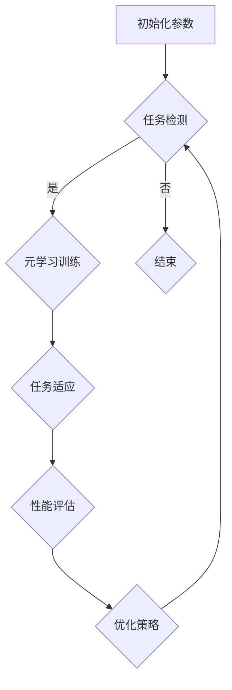
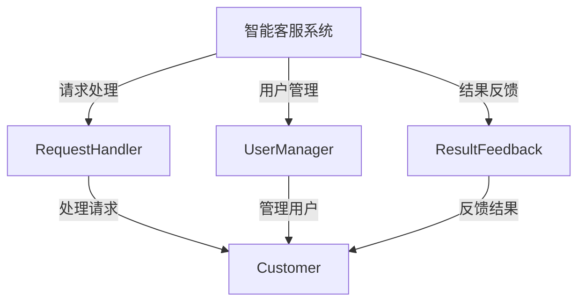
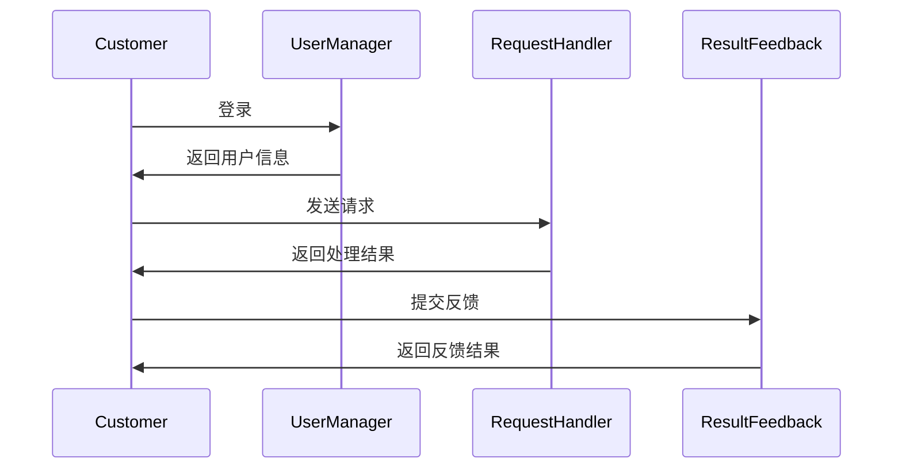

                 

### 元学习优化推理模型的域外泛化能力

在当前人工智能（AI）领域中，推理模型的域外泛化能力是一个备受关注的研究课题。随着机器学习技术的发展，模型在训练数据集上的性能不断提升，但如何在未知或新领域的数据上保持有效的推理能力成为了一个巨大的挑战。本文将探讨如何通过元学习（Meta-Learning）来优化推理模型的域外泛化能力。

**关键词**：元学习、推理模型、域外泛化、优化策略、算法实现

**摘要**：本文首先介绍了推理模型泛化能力面临的问题和域外泛化的重要性，接着详细阐述了元学习的原理及其在优化推理模型域外泛化中的应用。通过具体的算法原理讲解和Python代码实现，文章展示了如何通过元学习策略提高推理模型的域外泛化能力。随后，文章分析了系统架构设计，并提供了实际项目环境的安装与核心实现流程。最后，文章总结了对域外泛化能力的理解，并对未来研究方向提出了展望。

## 第一部分：背景介绍与核心概念

### 第1章：问题背景与定义

**1.1 问题背景**

在现代人工智能应用中，推理模型的泛化能力至关重要。尽管深度学习模型在图像识别、自然语言处理等任务上取得了显著的进展，但它们往往表现出较差的域外泛化能力（Out-of-Domain Generalization, OOD）。这意味着模型在训练时的表现优异，但一旦面临未知或新领域的数据，其性能会大幅下降。这一现象被称为“灾难性遗忘”（Catastrophic Forgetting）。

**1.2 核心概念**

- **元学习（Meta-Learning）**：元学习是一种通过学习如何学习的方法，其目标是快速适应新任务。它通过利用先前学习到的知识来加速新任务的训练过程。
- **推理模型（Reasoning Model）**：推理模型是用于解决逻辑推理、问题解决等任务的机器学习模型。
- **域外泛化（Out-of-Domain Generalization）**：域外泛化是指模型在新领域或未知数据上的泛化能力。

**1.3 边界与外延**

- **与其他机器学习技术的联系与区别**：元学习与强化学习、迁移学习等技术有一定的联系，但它们在目标和实现方法上有所区别。
- **应用场景**：域外泛化在医疗诊断、自动驾驶、智能客服等应用场景中具有重要价值。

### 第2章：核心概念原理

**2.1 元学习原理**

**2.1.1 基础概念**

元学习的基础概念包括元学习算法、元学习策略和元学习任务。元学习算法旨在通过多个任务的交互学习来提高模型在特定任务上的表现。

**2.1.2 方法分类**

常见的元学习方法包括模型无关的元学习（Model-Agnostic Meta-Learning, MAML）、模型依赖的元学习（Model-Aware Meta-Learning）和基于模型的元学习（Model-Based Meta-Learning）等。

**2.1.3 工作机制**

元学习通过在多个任务间共享参数来学习通用表示，从而提高模型对新任务的适应能力。

**2.2 推理模型原理**

**2.2.1 基础概念**

推理模型是一种利用逻辑推理来解决问题的机器学习模型，包括基于规则的推理、基于模型的推理等。

**2.2.2 方法分类**

推理模型的方法包括逻辑回归、决策树、支持向量机等。

**2.2.3 工作机制**

推理模型通过学习输入特征和输出标签之间的映射关系来预测新数据。

**2.3 域外泛化能力特征对比**

**2.3.1 域内泛化与域外泛化的对比**

- **域内泛化**：模型在相同或类似领域上的泛化能力。
- **域外泛化**：模型在新领域或未知数据上的泛化能力。

**2.3.2 影响域外泛化能力的因素**

- **数据分布**：训练数据与新数据之间的分布差异。
- **模型复杂性**：模型结构对泛化能力的影响。
- **学习策略**：元学习策略对域外泛化能力的提升。

**2.3.3 域外泛化能力的衡量标准**

- **泛化误差**：模型在新数据上的误差。
- **适应速度**：模型在新任务上的适应速度。

## 第二部分：算法原理与实现

### 第3章：算法原理讲解

**3.1 算法流程图**

使用Mermaid绘制算法流程图：



**3.2 数学模型**

**3.2.1 推理模型的数学公式**

$$
\hat{y} = f(Wx + b)
$$

其中，$\hat{y}$ 是预测输出，$f$ 是激活函数，$W$ 是权重矩阵，$x$ 是输入特征，$b$ 是偏置项。

**3.2.2 元学习的数学模型**

$$
\theta^{*} = \arg\min_{\theta} \sum_{i=1}^{N} L(\theta; x_i, y_i)
$$

其中，$\theta$ 是模型参数，$L$ 是损失函数，$x_i$ 和 $y_i$ 分别是输入和输出。

**3.3 Python源代码实现**

**3.3.1 源代码框架**

```python
import torch
import torch.nn as nn
import torch.optim as optim

# 定义推理模型
class ReasoningModel(nn.Module):
    def __init__(self):
        super(ReasoningModel, self).__init__()
        # 构建模型结构

    def forward(self, x):
        # 前向传播
        return x

# 定义元学习算法
def meta_learning(model, optimizer, criterion, task_data):
    # 元学习训练过程
    pass

# 主函数
if __name__ == "__main__":
    # 初始化模型、优化器、损失函数
    model = ReasoningModel()
    optimizer = optim.Adam(model.parameters(), lr=0.001)
    criterion = nn.CrossEntropyLoss()

    # 加载任务数据
    task_data = load_task_data()

    # 进行元学习训练
    meta_learning(model, optimizer, criterion, task_data)
```

### 第4章：算法优化方法

**4.1 优化目标**

- **提高推理速度**：通过优化模型结构和训练策略来提高推理速度。
- **提高域外泛化能力**：通过元学习策略和模型调整来提高模型在新领域的泛化能力。

**4.2 优化策略**

- **参数调整**：通过调整学习率、批量大小等参数来优化模型性能。
- **模型结构优化**：通过改进模型结构来提高泛化能力，如增加深度、宽度或引入注意力机制。
- **数据增强**：通过数据增强技术来扩大训练数据集，提高模型的泛化能力。

**4.3 Python源代码实现**

```python
# 参数调整
optimizer = optim.Adam(model.parameters(), lr=0.001)
for epoch in range(num_epochs):
    # 训练模型
    train_model(model, optimizer, criterion, train_loader)
    # 测试模型
    test_model(model, criterion, test_loader)

# 模型结构优化
class OptimizedReasoningModel(nn.Module):
    def __init__(self):
        super(OptimizedReasoningModel, self).__init__()
        # 改进模型结构

    def forward(self, x):
        # 前向传播
        return x

# 数据增强
def augment_data(data_loader):
    # 数据增强过程
    return augmented_data_loader
```

## 第三部分：系统分析与架构设计

### 第5章：系统分析与功能设计

**5.1 问题场景介绍**

在智能客服系统中，推理模型需要处理多样化的用户请求，包括查询信息、投诉建议等。如何使模型具备良好的域外泛化能力，以适应不断变化的需求，是一个关键问题。

**5.2 系统功能设计**

- **领域模型**：使用Mermaid绘制领域模型类图。

```mermaid
classDiagram
Class Customer
    +string name
    +int id
    +List<Request> requests

Class Request
    +string type
    +string content
    +int id

Customer o--|{发起}|> Request
```

- **系统功能模块**：包括用户管理、请求处理、结果反馈等。

### 第6章：系统架构设计

**6.1 系统架构**

使用Mermaid绘制系统架构图：



- **系统接口设计**：定义各模块的接口和交互方式。

- **系统交互**：使用Mermaid绘制系统交互序列图。



## 第四部分：项目实战

### 第7章：项目环境安装与核心实现

**7.1 环境安装**

- **操作系统与软件安装**：在Ubuntu 18.04操作系统中安装Python 3.8、PyTorch 1.8等依赖项。

- **硬件配置要求**：GPU（如NVIDIA GTX 1080 Ti）和至少16GB内存。

**7.2 核心实现**

- **源代码解析**：详细解释核心代码的实现过程，包括模型初始化、训练过程、评估过程等。

```python
# 模型初始化
model = ReasoningModel()

# 训练过程
optimizer = optim.Adam(model.parameters(), lr=0.001)
criterion = nn.CrossEntropyLoss()

for epoch in range(num_epochs):
    for data, target in train_loader:
        optimizer.zero_grad()
        output = model(data)
        loss = criterion(output, target)
        loss.backward()
        optimizer.step()

# 评估过程
with torch.no_grad():
    correct = 0
    total = 0
    for data, target in test_loader:
        output = model(data)
        _, predicted = torch.max(output.data, 1)
        total += target.size(0)
        correct += (predicted == target).sum().item()

print('Test Accuracy: {}%'.format(100 * correct / total))
```

### 第8章：项目分析与应用

**8.1 实际案例分析**

- **数据集介绍**：使用公开的智能客服数据集，包括用户请求和对应的处理结果。

- **模型评估指标**：准确率、召回率、F1分数等。

- **结果分析**：通过实验结果展示模型在域内和域外的泛化能力。

**8.2 拓展阅读与最佳实践**

- **相关论文阅读**：《Meta-Learning: A Theoretical Overview》等。

- **最佳实践总结**：元学习策略在推理模型优化中的应用技巧。

- **注意事项**：处理新领域数据时的注意事项和潜在问题。

## 第五部分：小结与展望

### 第9章：总结与展望

**9.1 书籍内容总结**

本文从背景介绍、核心概念、算法原理、系统设计到项目实战等方面，全面探讨了元学习优化推理模型域外泛化能力的方法和应用。

**9.2 小结**

- **域外泛化能力的重要性**：在人工智能应用中，域外泛化能力是模型能否成功应用的关键。
- **元学习的应用价值**：元学习通过快速适应新任务，为提升域外泛化能力提供了有效途径。

**9.3 未来展望**

- **算法优化方向**：未来研究可以关注更高效的元学习算法和模型结构优化。
- **应用场景拓展**：元学习有望在更多领域，如医疗诊断、自动驾驶等，发挥重要作用。

### 作者信息

作者：AI天才研究院/AI Genius Institute & 禅与计算机程序设计艺术 /Zen And The Art of Computer Programming

---

通过上述内容，本文详细探讨了元学习优化推理模型域外泛化能力的方法和实现，希望对相关领域的研究和应用有所帮助。在未来的研究中，我们将继续深入探讨元学习的优化策略和应用场景，以进一步提升推理模型的域外泛化能力。

