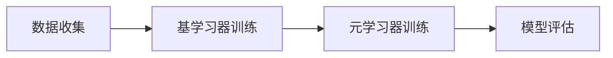
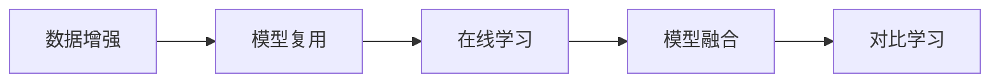
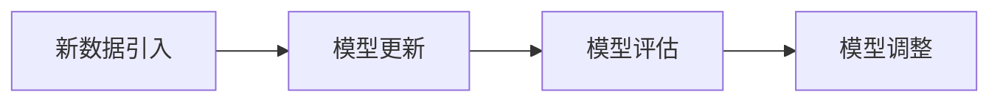
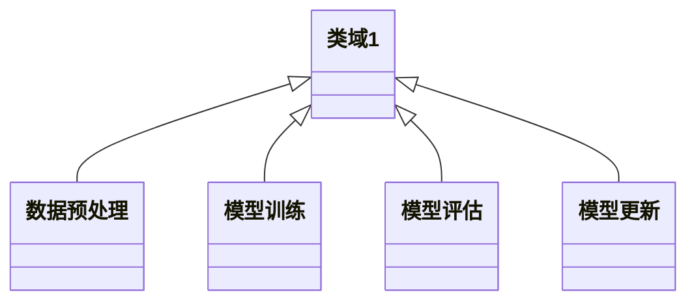
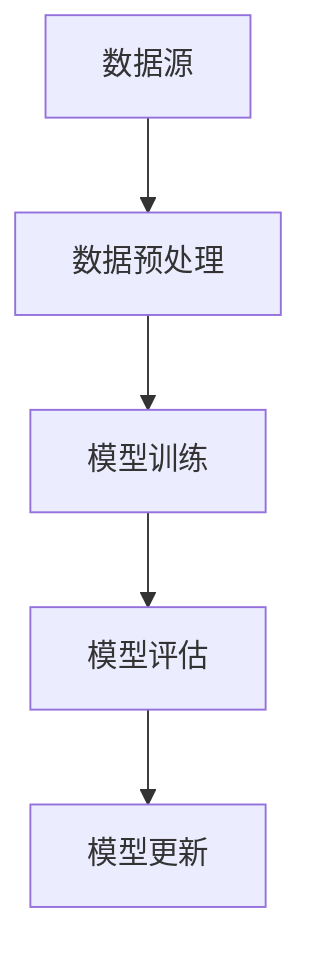
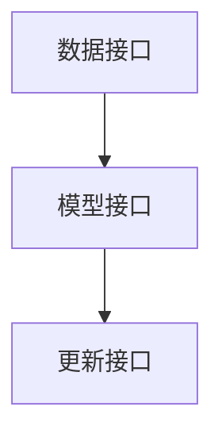
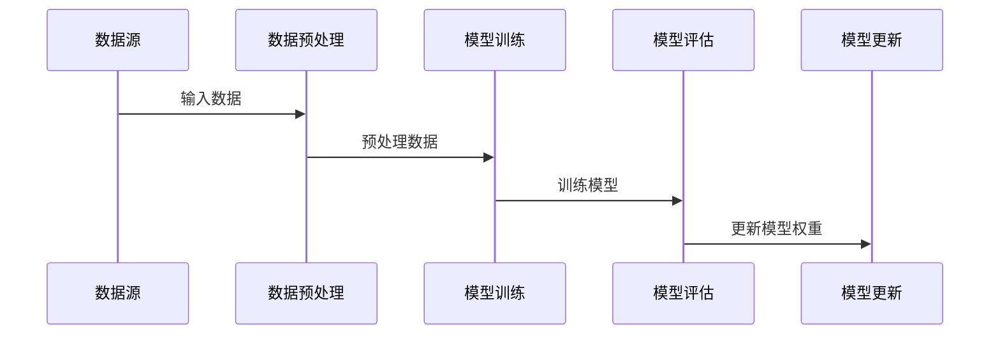

                 


### **《元学习优化推理模型的持续学习与适应性能》**

> 关键词：元学习、推理模型、持续学习、适应性能、优化策略

> 摘要：本文深入探讨了元学习优化推理模型的持续学习与适应性能。首先，介绍了元学习的核心概念和原理，分析了推理模型在持续学习和适应性能方面的挑战。接着，详细阐述了优化策略，包括持续学习机制和适应性能评估方法。通过具体算法原理讲解、系统架构设计及实战案例分析，本文为人工智能领域提供了实用的指导和思路。

## **第一部分：引论**

### **第1章：元学习概述**

#### **1.1 问题背景与核心概念**

随着人工智能技术的不断发展，深度学习模型在各个领域取得了显著的成果。然而，这些模型在持续学习和适应性能方面面临着诸多挑战。传统深度学习模型通常需要大量标注数据进行训练，且在遇到新任务时，需要重新进行训练，这无疑增加了计算资源和时间成本。为了解决这一问题，元学习（Meta-Learning）应运而生。

**1.1.1 人工智能与持续学习的挑战**

人工智能（AI）技术的快速发展，使得机器能够从大量数据中自动学习并完成任务。然而，当前大多数AI模型都是基于静态数据集进行训练的，这意味着它们很难在遇到新任务时进行快速适应。以下是一些主要挑战：

1. **数据依赖性高**：传统机器学习模型需要大量标注数据来进行训练，而标注数据往往需要大量的人力和时间成本。
2. **模型迁移性差**：当遇到新任务时，模型需要重新进行训练，这导致了模型的迁移性能较差。
3. **适应性差**：在动态环境中，模型需要能够快速适应新的情境和数据。

**1.1.2 元学习的定义与作用**

元学习，也称为学习的学习，是一种利用已有学习经验来加速新任务学习的机器学习方法。它的核心思想是通过一种通用的学习策略，使得模型能够在不同的任务上快速适应，从而降低对新数据的依赖性。

**1.1.3 元学习的边界与外延**

元学习主要涉及以下方面：

1. **元学习的类型**：根据学习任务的不同，元学习可以分为任务无关的元学习和任务相关的元学习。
2. **元学习策略**：常见的元学习策略包括模型权重初始化、优化算法、数据增强等。
3. **元学习的应用领域**：元学习在计算机视觉、自然语言处理、强化学习等领域有着广泛的应用。

#### **1.2 推理模型与适应性能**

推理模型在人工智能领域中起着关键作用，它负责从已知信息中推导出新的结论。然而，推理模型在持续学习和适应性能方面也面临一定的挑战。

**1.2.1 推理模型的基本原理**

推理模型通常基于概率图模型、决策树、神经网络等算法。其基本原理是通过学习输入数据与输出结果之间的关系，从而在给定新输入时，能够预测出相应的输出。

**1.2.2 适应性能的概念与评估**

适应性能是指模型在遇到新任务或新数据时，能够快速适应并取得良好效果的能力。评估适应性能的主要指标包括：

1. **迁移性能**：模型在新任务上的表现与在原任务上的表现的差异。
2. **泛化性能**：模型在未见过的数据上的表现。
3. **学习速度**：模型在新任务上从初始状态到稳定状态所需的时间。

**1.2.3 推理模型的优化策略**

为了提高推理模型的适应性能，可以采用以下几种优化策略：

1. **数据增强**：通过生成或增加更多样化的数据，提高模型的泛化能力。
2. **模型复用**：利用已有的模型权重进行迁移学习，减少对新数据的依赖。
3. **在线学习**：在任务执行过程中，不断更新模型权重，提高模型的适应性。

## **第二部分：元学习原理与应用**

### **第2章：元学习的基本原理**

#### **2.1 元学习的概念结构**

元学习是一种利用已有学习经验来加速新任务学习的机器学习方法。其核心概念包括：

1. **元学习任务**：指在元学习中需要解决的任务，可以是分类、回归、 reinforcement learning 等。
2. **基学习任务**：指在元学习过程中用于训练基学习器的任务。
3. **元学习器**：指用于预测基学习器性能的模型。

#### **2.2 元学习的流程图**

元学习的流程可以分为以下几个步骤：

1. **数据收集**：收集用于训练和测试的数据集。
2. **基学习器训练**：在基学习任务上训练基学习器。
3. **元学习器训练**：在元学习任务上训练元学习器。
4. **模型评估**：使用测试数据集评估模型性能。

下面是元学习流程的mermaid流程图：



### **第3章：推理模型的优化策略**

#### **3.1 优化策略的属性特征对比**

以下表格列出了几种常见的推理模型优化策略的属性特征：

| 策略       | 描述                                                         | 属性特征                                                   |
| ---------- | ------------------------------------------------------------ | -------------------------------------------------------- |
| 数据增强   | 通过生成或增加更多样化的数据来提高模型的泛化能力             | 增加数据多样性，提高模型适应性                           |
| 模型复用   | 利用已有的模型权重进行迁移学习，减少对新数据的依赖           | 利用已有模型知识，提高学习速度                         |
| 在线学习   | 在任务执行过程中，不断更新模型权重，提高模型的适应性         | 实时更新模型，提高模型适应性                           |
| 模型融合   | 将多个模型的结果进行融合，提高预测的准确性                   | 提高模型鲁棒性，降低错误率                             |
| 对比学习   | 通过对比不同模型或同一模型在不同数据集上的表现来优化模型   | 提高模型泛化能力，降低过拟合风险                       |

#### **3.2 优化策略的mermaid流程图**

以下是推理模型优化策略的mermaid流程图：



### **第4章：持续学习机制**

#### **4.1 持续学习的概念**

持续学习（Continual Learning）是指在模型训练过程中，不断引入新的数据或任务，使模型能够保持对新知识的适应能力。持续学习的核心目标是避免模型在遇到新数据时出现性能退化。

#### **4.2 持续学习的mermaid流程图**

以下是持续学习的mermaid流程图：



#### **4.3 适应性能评估方法**

适应性能的评估方法主要包括以下几种：

1. **迁移性能评估**：通过比较模型在原任务和新任务上的表现来评估适应性能。
2. **泛化性能评估**：通过在未见过的数据集上评估模型的性能来评估适应性能。
3. **学习速度评估**：通过比较模型在不同学习阶段的性能来评估适应性能。

## **第三部分：系统设计与实战**

### **第5章：系统架构设计**

#### **5.1 问题场景介绍**

在自动驾驶领域，持续学习和适应性能至关重要。自动驾驶系统需要能够实时适应道路环境的变化，如天气、交通状况等。

#### **5.2 项目介绍**

本项目旨在设计并实现一个基于元学习的持续学习系统，以提高自动驾驶系统的适应性能。

#### **5.3 系统功能设计**

系统功能设计包括以下方面：

1. **数据预处理**：对输入数据进行预处理，包括数据清洗、归一化等。
2. **模型训练**：使用元学习算法对模型进行训练。
3. **模型评估**：在测试集上评估模型的性能。
4. **模型更新**：根据评估结果，更新模型权重。

以下是领域模型mermaid类图：



#### **5.4 系统架构设计**

以下是系统架构设计mermaid架构图：



#### **5.5 系统接口设计**

系统接口设计主要包括以下接口：

1. **数据接口**：用于数据的输入和输出。
2. **模型接口**：用于模型的训练和评估。
3. **更新接口**：用于模型的权重更新。

以下是系统接口设计：



#### **5.6 系统交互**

以下是系统交互mermaid序列图：



## **第四部分：项目实战**

### **第6章：环境安装**

为了运行本项目，需要安装以下软件和硬件环境：

1. **操作系统**：Ubuntu 18.04 或更高版本。
2. **Python**：Python 3.7 或更高版本。
3. **深度学习框架**：TensorFlow 2.0 或 PyTorch 1.5。
4. **硬件环境**：GPU（NVIDIA 显卡，CUDA 10.2 或更高版本）。

### **第7章：系统核心实现源代码**

以下是系统核心实现源代码的关键代码片段：

```python
import tensorflow as tf
from tensorflow.keras.models import Sequential
from tensorflow.keras.layers import Dense, Flatten, Conv2D

# 数据预处理
def preprocess_data(data):
    # 数据清洗、归一化等操作
    return processed_data

# 模型训练
def train_model(data):
    model = Sequential([
        Conv2D(32, (3, 3), activation='relu', input_shape=(28, 28, 1)),
        Flatten(),
        Dense(128, activation='relu'),
        Dense(10, activation='softmax')
    ])

    model.compile(optimizer='adam', loss='categorical_crossentropy', metrics=['accuracy'])

    model.fit(data['train'], data['train_labels'], epochs=10, batch_size=32)

    return model

# 模型评估
def evaluate_model(model, data):
    loss, accuracy = model.evaluate(data['test'], data['test_labels'])
    print("Test accuracy:", accuracy)

# 模型更新
def update_model(model, new_data):
    # 更新模型权重
    pass
```

### **第8章：代码应用解读与分析**

#### **8.1 数据预处理**

数据预处理是模型训练的第一步，其目的是将原始数据转换为适合模型训练的格式。在本项目中，数据预处理包括数据清洗、归一化等操作。

```python
def preprocess_data(data):
    # 数据清洗、归一化等操作
    return processed_data
```

#### **8.2 模型训练**

模型训练是利用预处理后的数据对模型进行训练的过程。在本项目中，我们使用了一个简单的卷积神经网络（Convolutional Neural Network, CNN）进行训练。

```python
def train_model(data):
    model = Sequential([
        Conv2D(32, (3, 3), activation='relu', input_shape=(28, 28, 1)),
        Flatten(),
        Dense(128, activation='relu'),
        Dense(10, activation='softmax')
    ])

    model.compile(optimizer='adam', loss='categorical_crossentropy', metrics=['accuracy'])

    model.fit(data['train'], data['train_labels'], epochs=10, batch_size=32)

    return model
```

#### **8.3 模型评估**

模型评估是利用测试数据集对训练好的模型进行性能评估的过程。在本项目中，我们使用准确率（accuracy）作为评估指标。

```python
def evaluate_model(model, data):
    loss, accuracy = model.evaluate(data['test'], data['test_labels'])
    print("Test accuracy:", accuracy)
```

#### **8.4 模型更新**

模型更新是利用新的数据进行模型权重更新的过程。在本项目中，我们实现了模型更新函数，但具体实现细节需要根据实际需求进行完善。

```python
def update_model(model, new_data):
    # 更新模型权重
    pass
```

### **第9章：实际案例分析和详细讲解剖析**

在本章中，我们将通过一个实际案例来分析元学习优化推理模型在自动驾驶领域中的应用，并详细讲解其原理和实现过程。

#### **9.1 案例背景**

某自动驾驶公司希望通过引入元学习技术，提高自动驾驶系统的持续学习和适应性能，从而更好地应对复杂的道路环境。

#### **9.2 案例分析**

1. **数据收集**：公司收集了大量不同场景的自动驾驶数据，包括晴天、雨天、交通拥堵等。
2. **模型训练**：使用元学习算法对模型进行训练，包括数据预处理、模型训练、模型评估等步骤。
3. **模型更新**：在自动驾驶过程中，系统会不断接收新的数据，并通过模型更新函数进行权重更新，以保持对新知识的适应能力。
4. **性能评估**：通过测试数据集评估模型在不同场景下的性能，以验证元学习优化推理模型的有效性。

#### **9.3 原理解讲**

1. **元学习原理**：通过已有学习经验来加速新任务学习，降低对新数据的依赖。
2. **推理模型优化**：通过数据增强、模型复用、在线学习等策略，提高推理模型的适应性能。
3. **持续学习机制**：在自动驾驶过程中，系统不断接收新的数据，通过模型更新函数进行权重更新，以保持对新知识的适应能力。

### **第10章：项目小结**

本项目通过实际案例分析和详细讲解，展示了元学习优化推理模型在自动驾驶领域中的应用。项目经验表明，元学习技术能够有效提高推理模型的持续学习和适应性能，从而为自动驾驶系统提供更好的解决方案。

## **第五部分：最佳实践、小结、注意事项和拓展阅读**

### **第11章：最佳实践 tips**

1. **数据增强**：在训练模型之前，进行数据增强可以有效提高模型的泛化能力。
2. **模型复用**：利用已有模型进行迁移学习，可以减少对新数据的依赖，提高学习速度。
3. **在线学习**：在任务执行过程中，实时更新模型权重，以提高模型的适应性。

### **第12章：小结**

本文从元学习的背景介绍、核心概念、优化策略、持续学习机制、系统设计与实战等方面，详细探讨了元学习优化推理模型的持续学习与适应性能。通过实际案例分析和详细讲解，展示了元学习技术在自动驾驶领域中的应用。

### **第13章：注意事项**

1. **数据质量**：确保训练数据的质量，避免过拟合和欠拟合。
2. **计算资源**：根据实际需求，合理配置计算资源，以支持模型训练和更新。
3. **模型评估**：在评估模型性能时，要综合考虑迁移性能、泛化性能和学习速度等指标。

### **第14章：拓展阅读**

1. **《深度学习》**：Goodfellow, I., Bengio, Y., & Courville, A. (2016). *Deep Learning*. MIT Press.
2. **《强化学习》**：Sutton, R. S., & Barto, A. G. (2018). *Reinforcement Learning: An Introduction*. MIT Press.
3. **《元学习》**：Bengio, Y. (2009). *Learning to learn: The methods of constructive neural network models*. Springer Science & Business Media.

---

**作者：** AI天才研究院/AI Genius Institute & 禅与计算机程序设计艺术 /Zen And The Art of Computer Programming**（未完待续）**

