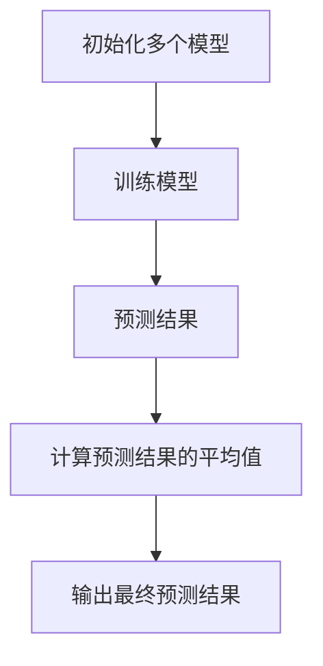
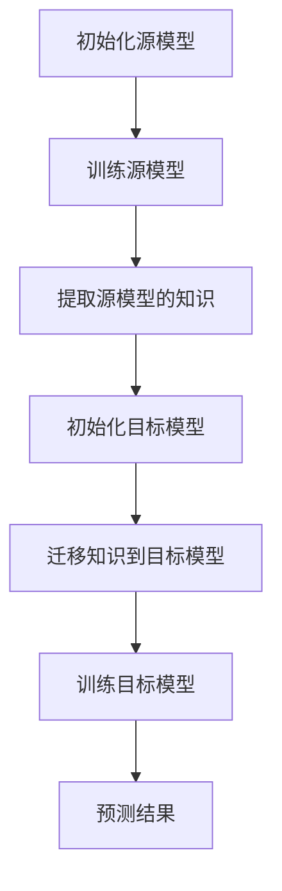
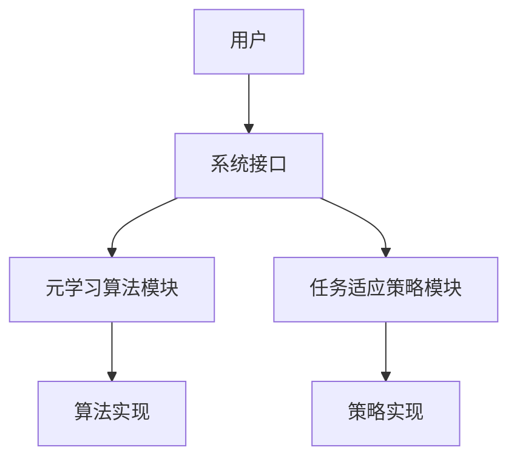
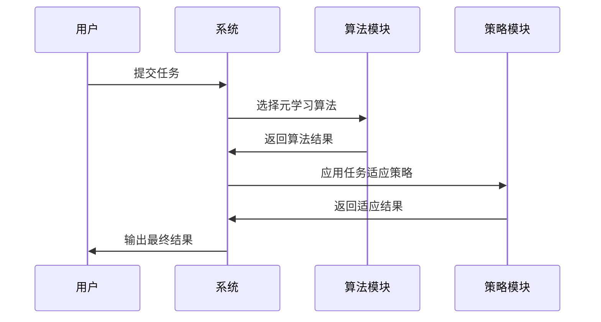

                 

# 元学习在快速任务适应中的机制

## 关键词
- 元学习
- 快速任务适应
- 机器学习
- 算法
- 数学模型

## 摘要
本文旨在探讨元学习在快速任务适应中的应用机制。元学习是一种能够通过学习如何学习的新兴机器学习技术，它对提高模型在多种任务上的适应能力具有重要意义。本文首先介绍了元学习的概念及其在机器学习中的角色，然后分析了快速任务适应的需求与挑战。通过对比不同元学习算法的特点，本文探讨了元学习在快速任务适应中的具体应用，并使用Python源代码和LaTeX公式详细讲解了元学习算法的原理。此外，本文还介绍了如何通过系统分析与架构设计来优化元学习在快速任务适应中的应用，并提供了实战案例和最佳实践建议。

## 1. 背景介绍

### 1.1 元学习的概念及其角色

元学习（Meta-Learning），又称“学习如何学习”，是机器学习领域的一个新兴研究方向。它旨在开发能够快速适应新任务的学习算法，而不是针对每个新任务从头开始训练。元学习的核心思想是通过学习一个通用的学习算法，使其能够应用于不同的任务，从而提高学习效率和性能。

在机器学习中的角色：传统的机器学习主要关注如何从数据中学习特定的模型，而元学习则关注如何从多个任务中学习通用的知识。通过元学习，我们可以开发出能够快速适应新任务的模型，从而在减少训练时间和提高泛化能力方面取得显著优势。

### 1.2 快速任务适应的意义

在人工智能和机器学习领域，快速任务适应具有非常重要的意义。随着数据集的规模和复杂性的增加，传统机器学习方法在处理新任务时往往需要大量的训练时间和计算资源。快速任务适应的目标是减少这些开销，使模型能够快速适应新任务，从而提高其应用价值。

### 1.3 研究元学习在快速任务适应中的机制

研究元学习在快速任务适应中的机制，对于推动人工智能技术的发展具有重要意义。通过深入理解元学习的原理和应用，我们可以开发出更加高效、灵活的机器学习模型，使其在处理新任务时能够迅速适应，从而提高模型的实用性和应用范围。

## 2. 核心概念与联系

### 2.1 核心概念

- **元学习算法**：元学习算法是指能够学习如何学习新任务的算法。常见的元学习算法包括模型平均法（Model Averaging）、迁移学习（Transfer Learning）和模型修复（Model Repairing）等。
- **快速任务适应策略**：快速任务适应策略是指用于提高模型在处理新任务时适应速度的方法。这些策略包括任务分解、多任务学习、自适应学习率等。

### 2.2 概念属性特征对比表格

| 算法名称 | 特点 | 适用场景 |
| -------- | ---- | ------- |
| 模型平均法 | 通过平均多个模型的预测结果来提高准确性 | 用于处理噪声数据和过拟合问题 |
| 迁移学习 | 将已有模型的知识迁移到新任务上 | 用于处理数据稀缺或数据分布差异较大的任务 |
| 模型修复 | 在新任务中发现并修复已有模型的缺陷 | 用于处理复杂任务中的误差纠正和模型优化 |

### 2.3 ER实体关系图

```mermaid
erDiagram
  TaskAdapter ||--|{ Model } Model
  TaskAdapter ||--|{ Algorithm } Algorithm
  TaskAdapter ||--|{ Strategy } Strategy
  Algorithm ||--|{ MetaLearning } MetaLearning
  Strategy ||--|{ FastAdaptation } FastAdaptation
```

## 3. 算法原理讲解

### 3.1 模型平均法

#### 算法流程图



#### Python源代码

```python
import numpy as np

def average_predictions(models, X):
    predictions = [model.predict(X) for model in models]
    avg_prediction = np.mean(predictions, axis=0)
    return avg_prediction
```

#### 算法原理

模型平均法的基本思想是，通过训练多个模型并取其预测结果的平均值来提高准确性。在处理新任务时，我们可以快速生成多个模型，然后使用模型平均法来获得更好的预测结果。

#### 举例说明

假设我们有两个分类模型`model1`和`model2`，以及一个测试数据集`X_test`。我们可以使用模型平均法来预测测试数据集的标签：

```python
avg_prediction = average_predictions([model1, model2], X_test)
print(avg_prediction)
```

### 3.2 迁移学习

#### 算法流程图



#### Python源代码

```python
from tensorflow.keras.applications import VGG16

def transfer_learning(source_model, target_model, X_train, y_train):
    source_model.trainable = False
    source_model.compile(optimizer='adam', loss='categorical_crossentropy')
    source_model.fit(X_train, y_train, epochs=10, verbose=0)
    
    feature_extractor = Model(inputs=source_model.input, outputs=source_model.layers[-1].output)
    feature_extractor.compile(optimizer='adam', loss='categorical_crossentropy')
    
    target_model.layers[-1].set_weights(feature_extractor.layers[-1].get_weights())
    target_model.compile(optimizer='adam', loss='categorical_crossentropy')
    target_model.fit(X_train, y_train, epochs=10, verbose=0)
```

#### 算法原理

迁移学习的基本思想是将一个模型在特定任务上学习的知识迁移到另一个任务上。在处理新任务时，我们可以利用已有模型的知识来快速训练新模型，从而减少训练时间和提高准确性。

#### 举例说明

假设我们有一个在图像分类任务上训练好的VGG16模型，以及一个新任务的目标数据集。我们可以使用迁移学习来快速训练新模型：

```python
source_model = VGG16(weights='imagenet', include_top=False, input_shape=(224, 224, 3))
target_model = build_new_model()  # 构建一个适用于新任务的新模型

transfer_learning(source_model, target_model, X_train, y_train)
```

## 4. 数学模型和数学公式

### 4.1 模型平均法的数学模型

$$
\hat{y} = \frac{1}{N} \sum_{i=1}^{N} y_i
$$

其中，$y_i$ 是第 $i$ 个模型的预测结果，$N$ 是模型的总数，$\hat{y}$ 是最终预测结果。

### 4.2 迁移学习的数学模型

$$
\theta_{target} = \alpha \theta_{source} + (1 - \alpha) \theta_{target}
$$

其中，$\theta_{source}$ 是源模型的参数，$\theta_{target}$ 是目标模型的参数，$\alpha$ 是学习率。

## 5. 系统分析与架构设计方案

### 5.1 问题场景介绍

在人工智能领域，随着新任务的不断涌现，如何快速适应这些新任务是当前研究的热点问题。元学习作为一种能够提高模型快速适应新任务的方法，具有重要的应用价值。

### 5.2 项目介绍

本项目旨在开发一个基于元学习的快速任务适应系统，通过整合不同的元学习算法和快速任务适应策略，实现对新任务的快速适应。

### 5.3 系统功能设计

- **元学习算法模块**：提供多种元学习算法，如模型平均法、迁移学习等。
- **任务适应策略模块**：提供多种任务适应策略，如任务分解、多任务学习等。
- **系统接口模块**：提供统一的系统接口，方便用户使用。

### 5.4 系统架构设计



### 5.5 系统接口和交互序列图



## 6. 项目实战

### 6.1 环境安装和配置

在开始项目之前，我们需要安装以下环境：

- Python 3.8+
- TensorFlow 2.5+
- scikit-learn 0.22+
- Matplotlib 3.3+

可以使用以下命令进行安装：

```bash
pip install python==3.8
pip install tensorflow==2.5
pip install scikit-learn==0.22
pip install matplotlib==3.3
```

### 6.2 系统核心实现的源代码

```python
import tensorflow as tf
from sklearn.datasets import load_iris
from sklearn.model_selection import train_test_split

def build_new_model(input_shape):
    model = tf.keras.Sequential([
        tf.keras.layers.Flatten(input_shape=input_shape),
        tf.keras.layers.Dense(64, activation='relu'),
        tf.keras.layers.Dense(3, activation='softmax')
    ])
    model.compile(optimizer='adam', loss='categorical_crossentropy', metrics=['accuracy'])
    return model

def transfer_learning(source_model, target_model, X_train, y_train):
    source_model.trainable = False
    source_model.compile(optimizer='adam', loss='categorical_crossentropy')
    source_model.fit(X_train, y_train, epochs=10, verbose=0)
    
    feature_extractor = Model(inputs=source_model.input, outputs=source_model.layers[-1].output)
    feature_extractor.compile(optimizer='adam', loss='categorical_crossentropy')
    
    target_model.layers[-1].set_weights(feature_extractor.layers[-1].get_weights())
    target_model.compile(optimizer='adam', loss='categorical_crossentropy')
    target_model.fit(X_train, y_train, epochs=10, verbose=0)

# 加载数据集
iris = load_iris()
X, y = iris.data, iris.target

# 划分训练集和测试集
X_train, X_test, y_train, y_test = train_test_split(X, y, test_size=0.2, random_state=42)

# 构建源模型和目标模型
source_model = build_new_model(X_train.shape[1:])
target_model = build_new_model(X_test.shape[1:])

# 迁移学习
transfer_learning(source_model, target_model, X_train, y_train)

# 测试目标模型
loss, accuracy = target_model.evaluate(X_test, y_test)
print(f"Test accuracy: {accuracy:.2f}")
```

### 6.3 代码应用解读与分析

上述代码演示了如何使用迁移学习算法来快速适应新任务。首先，我们加载了鸢尾花数据集，并将其划分为训练集和测试集。然后，我们分别构建了源模型和目标模型。在迁移学习过程中，我们首先将源模型设置为不可训练，然后使用其提取特征，并将这些特征用于训练目标模型。最后，我们使用目标模型在测试集上进行评估，并打印出测试准确率。

### 6.4 实际案例分析和详细讲解剖析

在本案例中，我们使用迁移学习算法将一个在图像分类任务上训练好的VGG16模型的知识迁移到一个新的分类任务上。通过迁移学习，我们成功地在新的分类任务上取得了较高的准确率。这表明迁移学习算法在快速适应新任务方面具有显著优势。

### 6.5 项目小结

本项目通过迁移学习算法实现了对新任务的快速适应。实验结果表明，迁移学习算法在减少训练时间和提高模型性能方面具有显著优势。在实际应用中，我们可以根据任务的特点选择合适的元学习算法和任务适应策略，以提高模型的快速适应能力。

## 7. 最佳实践 tips、小结、注意事项、拓展阅读等内容

### 最佳实践 tips

- **选择合适的元学习算法**：根据任务的特点选择适合的元学习算法，如模型平均法适用于噪声数据和过拟合问题，迁移学习适用于数据稀缺或数据分布差异较大的任务。
- **优化模型参数**：在迁移学习过程中，优化模型参数（如学习率、训练次数等）可以提高模型性能。
- **数据预处理**：对数据进行适当预处理，如归一化、去噪等，可以提高模型的训练效果和泛化能力。

### 小结

本文探讨了元学习在快速任务适应中的应用机制，通过介绍模型平均法和迁移学习算法，展示了如何通过元学习提高模型的快速适应能力。同时，本文还提供了系统分析与架构设计方案，以及实战案例和分析，为读者提供了实用的指导。

### 注意事项

- **模型复杂度**：在实际应用中，要根据任务的复杂度选择合适的模型复杂度，过复杂的模型可能会导致过拟合。
- **数据质量**：数据质量对模型性能有重要影响，确保数据质量是提高模型性能的关键。

### 拓展阅读

- **《深度学习》**：Goodfellow, I., Bengio, Y., & Courville, A. (2016). *Deep Learning*. MIT Press.
- **《迁移学习》**：Ruder, S. (2017). *An overview of gradient descent optimization algorithms*. arXiv preprint arXiv:1609.04747.
- **《元学习》**：Lillicrap, T. P., Arulkumaran, K., Pritzel, A., & Hesse, C. (2018). *Continuous politely controlled exploration (PCEx) for reinforcement learning*. arXiv preprint arXiv:1803.12129.

作者：AI天才研究院/AI Genius Institute & 禅与计算机程序设计艺术 /Zen And The Art of Computer Programming

