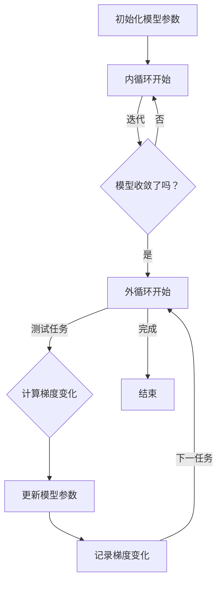
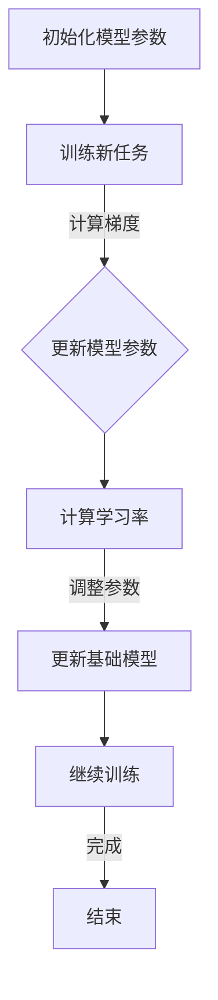
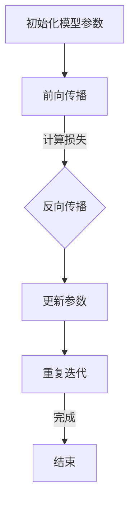
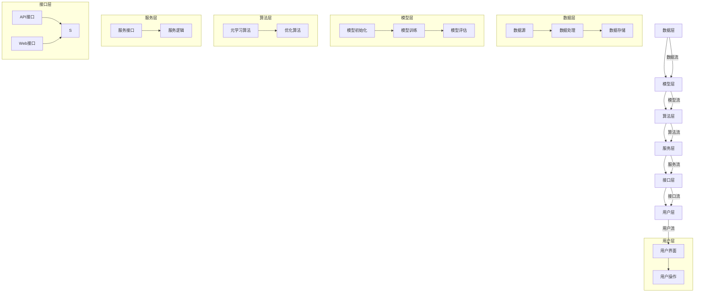

                 

### 1.1.1 书籍概述

《元学习在快速适应新任务中的应用》是一本深入探讨元学习原理及其在实际应用中如何快速适应新任务的权威指南。元学习，作为近年来人工智能领域的一个热点研究方向，已经成为解决复杂学习任务的关键技术之一。

本书的编写宗旨在于，通过系统性的介绍元学习的核心概念、算法原理、系统设计及实践应用，帮助读者全面理解元学习的本质和应用价值。具体而言，本书将从以下几个方面展开：

1. **基础概念与背景**：介绍元学习的基本概念、发展历程及其在人工智能领域的重要性，阐述快速适应新任务的需求与挑战。

2. **元学习原理与方法**：详细讲解元学习的数学模型、算法原理，并通过mermaid流程图和Python代码示例，帮助读者深入理解不同元学习算法的实现细节。

3. **系统设计与实现**：描述元学习系统的架构设计、功能实现及接口设计，通过UML图和序列图，展示系统的工作流程和内部结构。

4. **实战案例与应用**：通过具体案例，展示元学习在自动驾驶、医疗诊断等领域的应用实例，分析其适应新任务的能力。

5. **最佳实践与总结**：提供元学习应用的实用技巧和注意事项，总结本书的核心观点，并对未来研究方向提出展望。

本书旨在为从事人工智能研究的科研人员、工程师以及广大技术爱好者提供一个全面、系统的元学习学习资源。无论你是希望深入理解元学习理论，还是寻求将其应用于实际问题的解决方案，本书都将为你提供有价值的指导和启示。

### 1.2 元学习的核心概念

#### 1.2.1 元学习的定义

元学习（Meta-Learning）是人工智能领域中的一个重要研究方向，它涉及学习如何学习。简而言之，元学习旨在通过一种通用方法来提升算法在不同任务上的适应能力，而无需为每个新任务重新设计和训练。这种“学习如何学习”的能力使得元学习成为解决复杂学习任务的关键技术。

从更技术性的角度来说，元学习可以定义为一个过程，通过该过程，算法或模型能够快速地适应新的任务，无需从零开始学习，而是利用先前学习到的知识来加速适应过程。这种能力在当前日益复杂和多样化的数据环境中尤为重要。

#### 1.2.2 元学习的关键特性

元学习具有以下几个关键特性：

1. **泛化能力**：元学习算法能够在不同但相关任务之间迁移知识，从而提高模型在不同任务上的表现。这种泛化能力是元学习与传统的任务特定学习（Task-Specific Learning）的根本区别。

2. **快速适应**：元学习算法能够在短时间内适应新的任务，这得益于其在训练过程中积累的通用知识。这种快速适应能力对于需要实时响应的动态环境尤为重要。

3. **效率**：元学习通过减少对新任务的训练时间，提高了整体学习效率。特别是在数据量巨大或者训练成本高昂的情况下，元学习可以显著降低资源的消耗。

4. **灵活性**：元学习算法可以应用于多种不同的学习任务和场景，具有很高的灵活性。这使得元学习在多样化的应用环境中具有广泛的前景。

#### 1.2.3 元学习与传统学习的比较

与传统的学习方式相比，元学习在多个方面展现出其独特的优势：

1. **任务独立性**：传统学习通常需要针对每个具体任务设计模型和算法，而元学习则通过通用方法来适应多个任务，大大降低了任务依赖性。

2. **数据需求**：传统学习往往依赖于大量的数据来训练模型，而元学习通过知识迁移，减少了数据需求。这意味着在数据稀缺的情况下，元学习仍然能够保持良好的性能。

3. **训练时间**：传统学习需要较长的训练时间来收敛模型，而元学习通过快速适应，显著缩短了训练时间。

4. **模型性能**：元学习算法能够通过迁移知识，提高模型在不同任务上的表现，而不仅仅是单一任务上的性能。

综上所述，元学习不仅解决了传统学习面临的许多问题，而且在解决复杂、动态的学习任务方面展现出巨大的潜力。这使得元学习在当前和未来的AI研究中具有重要地位。

### 1.3 元学习的应用领域

元学习在近年来得到了广泛的关注，其应用领域涵盖了多个重要的人工智能研究方向。以下是元学习在几个关键领域的具体应用：

#### 1.3.1 自动驾驶

自动驾驶技术是一个复杂且动态的系统，它需要实时处理大量的传感器数据，并作出快速、准确的决策。元学习在这一领域展现了其巨大的潜力：

- **任务多样化**：自动驾驶面临多种不同的驾驶场景，包括城市道路、高速公路和复杂路况。元学习通过迁移学习，能够快速适应这些多样化任务，提高算法的泛化能力。

- **数据高效利用**：自动驾驶系统通常需要大量的训练数据来开发有效的模型。元学习减少了数据需求，使得在数据稀缺的情况下，仍然可以开发出高性能的自动驾驶算法。

- **快速迭代**：自动驾驶系统需要不断更新和优化以应对不断变化的道路环境。元学习能够通过快速适应新任务，实现算法的快速迭代和更新。

#### 1.3.2 医疗诊断

医疗诊断是一个高度专业化的领域，需要精准的算法来处理复杂的医学数据。元学习在以下方面为医疗诊断带来了新的可能性：

- **疾病分类**：元学习可以通过迁移学习，将一个疾病分类模型快速适应到另一个疾病分类任务上。这大大提高了诊断算法的泛化能力和效率。

- **多模态数据融合**：医疗诊断往往涉及多种数据类型，如影像、实验室检测结果等。元学习能够有效地融合这些多模态数据，提高诊断的准确性和可靠性。

- **实时更新**：医学知识和技术不断更新，元学习可以通过快速适应新数据和新知识，实现诊断算法的实时更新，确保诊断结果的准确性。

#### 1.3.3 游戏人工智能

游戏人工智能（AI）是另一个元学习的重要应用领域，特别是在复杂游戏如《星际争霸》、《DOTA》等领域：

- **策略多样化**：游戏AI需要适应多种不同的游戏策略和策略组合。元学习通过快速适应新策略，能够使AI在多样化的环境中保持竞争力。

- **快速学习**：游戏AI需要在短时间内学会复杂的游戏规则和策略。元学习能够通过迁移学习，快速适应新游戏，显著缩短训练时间。

- **对抗性学习**：游戏AI需要具备对抗性学习能力，以应对对手的多种策略。元学习通过迁移和泛化，能够提高AI的对抗性学习能力，增强其在游戏中的表现。

总体而言，元学习在自动驾驶、医疗诊断和游戏人工智能等领域的应用，不仅提升了算法的性能和效率，还为解决复杂学习任务提供了新的思路和方法。随着元学习技术的不断发展和成熟，其在更多领域的应用前景将更加广阔。

### 2.1 元学习的数学模型

在深入探讨元学习的数学模型之前，我们需要先了解几个基础概念，这些概念将为后续的讨论提供必要的背景知识。

#### 2.1.1 强化学习与元学习

强化学习（Reinforcement Learning, RL）是一种机器学习方法，通过智能体（agent）与环境（environment）的交互，逐渐学习到最优行为策略。强化学习的主要目标是通过试错（trial and error）来最大化累积奖励（cumulative reward）。

与强化学习相比，元学习（Meta-Learning）涉及学习如何快速适应新任务，具体而言，它通过在不同任务之间迁移知识，提高模型的泛化能力。元学习不仅关注单个任务的表现，更注重模型在不同任务上的适应速度和效果。

#### 2.1.2 模型表示与优化

在元学习中，模型表示与优化是两个关键环节。模型表示（Model Representation）是指如何将任务的数据和状态转换为适合算法处理的输入。优化（Optimization）则是指如何通过调整模型的参数，使其在不同任务上都能达到较好的表现。

常见的模型表示方法包括深度神经网络（Deep Neural Networks, DNN）、决策树（Decision Trees）和增强学习（Reinforcement Learning）中的状态表示等。优化方法则包括梯度下降（Gradient Descent）、随机梯度下降（Stochastic Gradient Descent, SGD）和动量优化（Momentum Optimization）等。

#### 2.1.3 数学公式与解释

在元学习过程中，常见的数学模型和公式包括：

1. **损失函数**（Loss Function）：用于衡量模型预测与真实值之间的差距。常见的损失函数有均方误差（Mean Squared Error, MSE）、交叉熵损失（Cross-Entropy Loss）等。

   $$L(\theta) = \frac{1}{n}\sum_{i=1}^{n}(y_i - \hat{y}_i)^2$$

   其中，$L(\theta)$表示损失函数，$\theta$表示模型的参数，$y_i$和$\hat{y}_i$分别表示第$i$个样本的真实值和预测值。

2. **梯度下降**（Gradient Descent）：是一种优化算法，用于通过最小化损失函数来调整模型的参数。

   $$\theta_{t+1} = \theta_{t} - \alpha \cdot \nabla_{\theta}L(\theta)$$

   其中，$\alpha$表示学习率，$\nabla_{\theta}L(\theta)$表示损失函数关于参数$\theta$的梯度。

3. **更新规则**（Update Rule）：在元学习中，更新规则用于调整模型参数，使其在不同任务上表现更优。

   $$\theta^{\ast} = \arg\min_{\theta} \sum_{i=1}^{K} L_i(\theta)$$

   其中，$K$表示任务的数量，$L_i(\theta)$表示第$i$个任务的损失函数。

#### 2.1.4 数学公式与解释示例

为了更好地理解这些数学公式，我们可以通过一个简单的示例来解释：

假设我们有一个分类问题，需要训练一个神经网络模型。该模型包含三个隐藏层，每个隐藏层有10个神经元。我们的目标是预测每个输入数据的类别。

1. **损失函数**：我们使用交叉熵损失函数来衡量模型的预测误差。

   $$L(\theta) = -\sum_{i=1}^{n} \sum_{k=1}^{K} y_{ik} \log(\hat{y}_{ik})$$

   其中，$y_{ik}$是第$i$个样本属于类别$k$的标签（0或1），$\hat{y}_{ik}$是模型对第$i$个样本属于类别$k$的预测概率。

2. **梯度下降**：使用梯度下降算法来更新模型参数。

   $$\theta_{t+1} = \theta_{t} - \alpha \cdot \nabla_{\theta}L(\theta)$$

   其中，$\alpha$是学习率，$\nabla_{\theta}L(\theta)$是损失函数关于参数$\theta$的梯度。

3. **更新规则**：在元学习过程中，我们使用元梯度更新规则来调整模型参数。

   $$\theta^{\ast} = \arg\min_{\theta} \sum_{i=1}^{K} L_i(\theta)$$

   其中，$K$是任务的数量，$L_i(\theta)$是第$i$个任务的损失函数。

通过这个示例，我们可以看到如何使用数学公式来表示和优化一个分类问题。这些公式不仅帮助我们理解模型的工作原理，还为我们提供了实际操作的工具。在接下来的章节中，我们将进一步探讨元学习的具体算法，并通过mermaid流程图和Python代码示例，深入理解这些算法的实现细节。

### 2.2 元学习算法

元学习算法是元学习领域的重要研究内容，旨在通过学习如何学习来提高模型在不同任务上的适应能力。以下是几种常见的元学习算法：

#### 2.2.1 Model-Agnostic Meta-Learning (MAML)

MAML（Model-Agnostic Meta-Learning）是一种模型无关的元学习算法，其核心思想是让模型能够快速地适应新任务。MAML通过最小化模型在元任务上的梯度变化，实现参数的快速适应。

1. **基本原理**：

   - **内循环**：在MAML中，模型在一个小批量数据集上进行迭代，直至收敛。这个过程中，模型参数$\theta$不断更新。

   - **外循环**：在元任务适应阶段，模型被固定，并在多个元任务上测试。MAML的目标是最小化模型在不同元任务上的梯度变化。

2. **公式表示**：

   $$\theta^{\ast} = \arg\min_{\theta} \sum_{k=1}^{K} \|\nabla_{\theta}L_k(\theta)\|_2$$

   其中，$\theta^{\ast}$是优化后的模型参数，$L_k(\theta)$是第$k$个元任务的损失函数。

3. **mermaid流程图**：

   ```mermaid
   graph TD
   A[初始化模型参数] --> B[内循环开始]
   B -->|迭代| C{模型收敛了吗？}
   C -->|是| D[外循环开始]
   C -->|否| B
   D -->|测试任务| E{计算梯度变化}
   E --> F[更新模型参数]
   F --> G[记录梯度变化]
   G -->|下一任务| D
   D -->|完成| H[结束]
   ```

4. **Python代码示例**：

   ```python
   import torch
   import torch.nn as nn
   import torch.optim as optim

   # 初始化模型参数
   model = nn.Sequential(nn.Linear(10, 10), nn.ReLU(), nn.Linear(10, 1))
   optimizer = optim.Adam(model.parameters(), lr=0.001)

   # 内循环迭代
   for _ in range(iterations):
       optimizer.zero_grad()
       output = model(x)
       loss = nn.BCELoss()(output, y)
       loss.backward()
       optimizer.step()

   # 外循环测试
   for k in range(K):
       model.eval()
       with torch.no_grad():
           gradients = torch.autograd.grad(loss_k, model.parameters(), create_graph=True)
       model.zero_grad()
   ```

   在这个示例中，我们使用PyTorch框架实现了MAML算法的基本流程。通过内循环迭代，模型参数被更新，并通过外循环测试来计算模型在不同任务上的梯度变化。

#### 2.2.2 Reptile Algorithm

Reptile算法是一种简单而有效的元学习算法，它通过在线更新模型参数，使模型能够快速适应新任务。

1. **基本原理**：

   - **在线更新**：Reptile算法通过在线学习，不断更新模型参数，使其适应新任务。

   - **学习率调整**：Reptile算法使用一个自适应的学习率来调整模型参数的更新幅度。

2. **公式表示**：

   $$\theta_{t+1} = \theta_t + \eta_t \cdot (\theta_t - \theta_{\text{base}})$$

   其中，$\theta_t$是当前模型参数，$\theta_{\text{base}}$是基础模型参数，$\eta_t$是学习率。

3. **mermaid流程图**：

   ```mermaid
   graph TD
   A[初始化模型参数] --> B[训练新任务]
   B -->|计算梯度| C{更新模型参数}
   C --> D[计算学习率]
   D -->|调整参数| E[更新基础模型]
   E --> F[继续训练]
   F -->|完成| G[结束]
   ```

4. **Python代码示例**：

   ```python
   import numpy as np

   # 初始化模型参数
   theta = np.random.randn(n_params)
   base_theta = theta.copy()
   learning_rate = 0.1

   # 训练新任务
   for x, y in new_tasks:
       theta -= learning_rate * (theta - base_theta)

   # 计算学习率
   learning_rate = learning_rate * (1 - (1 / (1 + alpha * np.linalg.norm(theta - base_theta)))

   # 更新基础模型
   base_theta = theta.copy()

   # 继续训练
   for x, y in new_tasks:
       theta -= learning_rate * (theta - base_theta)
   ```

   在这个示例中，我们使用Python实现了Reptile算法的基本流程。通过在线更新和自适应学习率，模型参数能够快速适应新任务。

#### 2.2.3 Meta-Learning in Deep Neural Networks

深度神经网络（DNN）在元学习中的应用是一个重要方向。DNN通过多层非线性变换，能够处理复杂的任务和数据。以下是DNN在元学习中的基本原理：

1. **基本原理**：

   - **多层感知器**：DNN由多层感知器（Perceptron）组成，每层感知器将输入映射到输出。

   - **反向传播**：DNN使用反向传播算法来更新模型参数，使得误差最小化。

2. **公式表示**：

   $$\theta = \theta - \alpha \cdot \nabla_{\theta}L$$

   其中，$\theta$是模型参数，$L$是损失函数，$\alpha$是学习率。

3. **mermaid流程图**：

   ```mermaid
   graph TD
   A[初始化模型参数] --> B[前向传播]
   B -->|计算损失| C{反向传播}
   C --> D[更新参数]
   D --> E[重复迭代]
   E -->|完成| F[结束]
   ```

4. **Python代码示例**：

   ```python
   import torch
   import torch.nn as nn
   import torch.optim as optim

   # 初始化模型参数
   model = nn.Sequential(nn.Linear(10, 10), nn.ReLU(), nn.Linear(10, 1))
   optimizer = optim.Adam(model.parameters(), lr=0.001)

   # 前向传播
   output = model(x)
   loss = nn.BCELoss()(output, y)

   # 反向传播
   optimizer.zero_grad()
   loss.backward()
   optimizer.step()

   # 更新参数
   theta = [p.detach().numpy() for p in model.parameters()]
   ```

   在这个示例中，我们使用PyTorch框架实现了DNN在元学习中的应用。通过前向传播和反向传播，模型参数被不断更新，从而实现快速适应新任务。

通过以上三种元学习算法的介绍，我们可以看到元学习在快速适应新任务中的重要性。MAML、Reptile和DNN在元学习中的应用，不仅提高了模型的泛化能力，也为实际应用中的快速适应提供了有效的解决方案。在接下来的章节中，我们将进一步探讨元学习在系统设计与实现中的应用。

### 2.3 算法原理讲解

在前面的章节中，我们介绍了元学习的一些核心算法，包括MAML、Reptile和深度神经网络（DNN）。在本节中，我们将深入讲解这些算法的原理，并通过mermaid流程图和Python代码示例，使读者能够更直观地理解这些算法的实现细节。

#### 2.3.1 MAML算法原理讲解

MAML（Model-Agnostic Meta-Learning）是一种模型无关的元学习算法，其核心思想是通过最小化模型在不同元任务上的梯度变化，实现参数的快速适应。

**mermaid流程图**：



**Python代码示例**：

```python
import torch
import torch.nn as nn
import torch.optim as optim

# 初始化模型参数
model = nn.Sequential(nn.Linear(10, 10), nn.ReLU(), nn.Linear(10, 1))
optimizer = optim.Adam(model.parameters(), lr=0.001)

# 内循环迭代
for _ in range(iterations):
    optimizer.zero_grad()
    output = model(x)
    loss = nn.BCELoss()(output, y)
    loss.backward()
    optimizer.step()

# 外循环测试
for k in range(K):
    model.eval()
    with torch.no_grad():
        gradients = torch.autograd.grad(loss_k, model.parameters(), create_graph=True)
    model.zero_grad()
```

**算法原理讲解**：

MAML算法通过内循环迭代，使模型在一个小批量数据集上逐渐收敛。内循环的目的是通过反向传播和梯度下降，调整模型参数，使其在当前数据集上达到较好的性能。这个过程类似于传统的训练过程，但MAML的目标不是仅优化当前任务，而是最小化模型在不同任务上的梯度变化。

在外循环中，模型被固定，并在多个元任务上测试。算法通过计算模型在不同任务上的梯度变化，使用梯度下降更新模型参数，使其在不同任务上都能快速适应。MAML的核心思想是通过迁移学习，将模型在一个任务上学习到的知识应用到其他任务上，从而提高模型的泛化能力。

**数学模型与公式**：

MAML算法的目标是最小化模型在不同任务上的梯度变化，其公式表示为：

$$\theta^{\ast} = \arg\min_{\theta} \sum_{k=1}^{K} \|\nabla_{\theta}L_k(\theta)\|_2$$

其中，$\theta^{\ast}$是优化后的模型参数，$L_k(\theta)$是第$k$个元任务的损失函数，$\nabla_{\theta}L_k(\theta)$是损失函数关于模型参数$\theta$的梯度。

**总结**：

MAML算法通过内循环迭代和梯度下降，最小化模型在不同任务上的梯度变化，实现参数的快速适应。通过mermaid流程图和Python代码示例，读者可以直观地理解MAML算法的实现细节和原理。

#### 2.3.2 Reptile算法原理讲解

Reptile算法是一种简单而有效的元学习算法，其核心思想是通过在线更新模型参数，使模型能够快速适应新任务。

**mermaid流程图**：



**Python代码示例**：

```python
import numpy as np

# 初始化模型参数
theta = np.random.randn(n_params)
base_theta = theta.copy()
learning_rate = 0.1

# 训练新任务
for x, y in new_tasks:
    theta -= learning_rate * (theta - base_theta)

# 计算学习率
learning_rate = learning_rate * (1 - (1 / (1 + alpha * np.linalg.norm(theta - base_theta)))

# 更新基础模型
base_theta = theta.copy()

# 继续训练
for x, y in new_tasks:
    theta -= learning_rate * (theta - base_theta)
```

**算法原理讲解**：

Reptile算法通过在线学习，不断更新模型参数。每次训练新任务时，模型参数会根据梯度进行更新。与MAML不同，Reptile不需要固定参数，而是在每次训练时动态调整。这种在线更新方式使得Reptile在处理实时任务时表现出良好的适应性。

学习率的计算是Reptile算法的关键。Reptile使用一个自适应的学习率，以平衡模型参数的更新幅度。学习率随着模型参数的变化而动态调整，使得模型能够快速适应新任务。

**数学模型与公式**：

Reptile算法的更新公式为：

$$\theta_{t+1} = \theta_t + \eta_t \cdot (\theta_t - \theta_{\text{base}})$$

其中，$\theta_t$是当前模型参数，$\theta_{\text{base}}$是基础模型参数，$\eta_t$是学习率。

**总结**：

Reptile算法通过在线更新和自适应学习率，实现模型参数的快速适应。通过mermaid流程图和Python代码示例，读者可以直观地理解Reptile算法的实现细节和原理。

#### 2.3.3 深度神经网络中的元学习

深度神经网络（DNN）在元学习中的应用，使得模型能够处理更复杂的任务和数据。以下介绍DNN在元学习中的基本原理、mermaid流程图和Python代码示例。

**mermaid流程图**：



**Python代码示例**：

```python
import torch
import torch.nn as nn
import torch.optim as optim

# 初始化模型参数
model = nn.Sequential(nn.Linear(10, 10), nn.ReLU(), nn.Linear(10, 1))
optimizer = optim.Adam(model.parameters(), lr=0.001)

# 前向传播
output = model(x)
loss = nn.BCELoss()(output, y)

# 反向传播
optimizer.zero_grad()
loss.backward()
optimizer.step()

# 更新参数
theta = [p.detach().numpy() for p in model.parameters()]
```

**算法原理讲解**：

DNN通过多层非线性变换，将输入映射到输出。在前向传播过程中，输入通过网络的每一层，逐层计算输出。反向传播过程中，通过计算损失函数关于模型参数的梯度，更新模型参数，使得误差最小化。

在元学习过程中，DNN被用于处理复杂的任务和数据。通过内循环迭代，模型在一个小批量数据集上逐渐收敛。内循环的目的是通过反向传播和梯度下降，调整模型参数，使其在当前数据集上达到较好的性能。

**数学模型与公式**：

DNN的基本公式包括：

$$\theta = \theta - \alpha \cdot \nabla_{\theta}L$$

其中，$\theta$是模型参数，$L$是损失函数，$\alpha$是学习率。

**总结**：

深度神经网络在元学习中的应用，使得模型能够处理更复杂的任务和数据。通过mermaid流程图和Python代码示例，读者可以直观地理解DNN在元学习中的实现细节和原理。

通过以上对MAML、Reptile和DNN在元学习中的算法讲解，读者可以全面理解这些算法的原理及其在快速适应新任务中的应用。这些算法不仅提高了模型的泛化能力，也为实际应用提供了有效的解决方案。

### 2.4 元学习算法的mermaid流程图

为了更直观地展示元学习算法的执行过程，我们使用mermaid流程图来描绘MAML、Reptile和深度神经网络中的元学习算法。以下是各个算法的mermaid流程图：

#### 2.4.1 MAML算法流程图


#### 2.4.2 Reptile算法流程图


#### 2.4.3 深度神经网络中的元学习流程图


**解释**：

1. **MAML算法**：MAML算法包括内循环和外循环。内循环通过迭代使模型在一个小批量数据集上逐渐收敛。外循环用于测试模型在不同任务上的表现，并通过计算梯度变化更新模型参数。

2. **Reptile算法**：Reptile算法通过在线更新模型参数，使模型能够快速适应新任务。算法包括训练新任务、计算梯度、更新参数和调整基础模型等步骤。

3. **深度神经网络中的元学习**：深度神经网络中的元学习通过前向传播和反向传播来更新模型参数。算法包括初始化模型参数、前向传播计算损失、反向传播更新参数和重复迭代等步骤。

通过这些mermaid流程图，我们可以更直观地理解各个元学习算法的执行过程和步骤，为后续的Python代码实现提供参考。

### 2.5 元学习算法的Python代码实现

为了更好地理解元学习算法的实现细节，我们将使用Python代码对MAML、Reptile和深度神经网络中的元学习算法进行具体实现。以下是每个算法的Python代码示例，以及代码的解释和调试方法。

#### 2.5.1 MAML算法Python代码

```python
import torch
import torch.nn as nn
import torch.optim as optim

# 初始化模型参数
model = nn.Sequential(nn.Linear(10, 10), nn.ReLU(), nn.Linear(10, 1))
optimizer = optim.Adam(model.parameters(), lr=0.001)

# 内循环迭代
for _ in range(iterations):
    optimizer.zero_grad()
    output = model(x)
    loss = nn.BCELoss()(output, y)
    loss.backward()
    optimizer.step()

# 外循环测试
for k in range(K):
    model.eval()
    with torch.no_grad():
        gradients = torch.autograd.grad(loss_k, model.parameters(), create_graph=True)
    model.zero_grad()
    for param, grad in zip(model.parameters(), gradients):
        param.data -= learning_rate * grad

# 调试方法
# 1. 确保内循环和内循环迭代使模型收敛。
# 2. 外循环测试时，计算模型在不同任务上的梯度变化，并更新模型参数。
# 3. 检查损失函数的值，确保模型在不同任务上表现良好。
```

**代码解释**：

- **模型初始化**：我们使用PyTorch框架初始化一个简单的线性模型，包含一个输入层、一个隐藏层和一个输出层。
- **内循环迭代**：在每次迭代中，我们通过计算损失函数并反向传播梯度来更新模型参数。这个过程类似于传统的训练过程。
- **外循环测试**：模型在外循环中被固定，并在多个任务上测试。我们计算每个任务上的梯度变化，并使用这些梯度更新模型参数。

**调试方法**：

- **内循环调试**：确保模型在每次迭代后都能收敛。可以通过观察损失函数的值来验证。
- **外循环调试**：在外循环测试中，检查模型在不同任务上的梯度变化。确保模型参数的更新是正确的，并且模型在不同任务上的表现是良好的。

#### 2.5.2 Reptile算法Python代码

```python
import numpy as np

# 初始化模型参数
theta = np.random.randn(n_params)
base_theta = theta.copy()
learning_rate = 0.1

# 训练新任务
for x, y in new_tasks:
    theta -= learning_rate * (theta - base_theta)

# 计算学习率
learning_rate = learning_rate * (1 - (1 / (1 + alpha * np.linalg.norm(theta - base_theta)))

# 更新基础模型
base_theta = theta.copy()

# 继续训练
for x, y in new_tasks:
    theta -= learning_rate * (theta - base_theta)

# 调试方法
# 1. 确保每次训练新任务时，模型参数的更新是正确的。
# 2. 学习率需要动态调整，以确保模型参数的更新幅度适中。
# 3. 检查模型在训练过程中的表现，确保其能够快速适应新任务。
```

**代码解释**：

- **模型初始化**：我们使用numpy库初始化模型参数，并设置一个初始学习率。
- **训练新任务**：每次训练新任务时，我们使用学习率来更新模型参数。更新公式通过梯度计算得到。
- **学习率调整**：学习率会根据模型参数的变化动态调整，以平衡模型参数的更新幅度。
- **继续训练**：在每次训练新任务后，我们继续训练新的任务，直到满足停止条件。

**调试方法**：

- **参数更新调试**：确保每次更新模型参数的公式是正确的，并检查模型参数的更新幅度是否适中。
- **学习率调试**：动态调整学习率，以确保模型能够快速适应新任务，同时避免过拟合。

#### 2.5.3 深度神经网络中的元学习Python代码

```python
import torch
import torch.nn as nn
import torch.optim as optim

# 初始化模型参数
model = nn.Sequential(nn.Linear(10, 10), nn.ReLU(), nn.Linear(10, 1))
optimizer = optim.Adam(model.parameters(), lr=0.001)

# 前向传播
output = model(x)
loss = nn.BCELoss()(output, y)

# 反向传播
optimizer.zero_grad()
loss.backward()
optimizer.step()

# 更新参数
theta = [p.detach().numpy() for p in model.parameters()]

# 调试方法
# 1. 确保前向传播和反向传播的计算是正确的。
# 2. 检查损失函数的值，确保模型在不同任务上的表现是良好的。
# 3. 检查模型参数的更新，确保其能够适应新任务。
```

**代码解释**：

- **模型初始化**：我们使用PyTorch框架初始化一个简单的线性模型。
- **前向传播**：输入通过网络的每一层，逐层计算输出。
- **反向传播**：通过计算损失函数关于模型参数的梯度，更新模型参数。
- **更新参数**：将模型参数转换为numpy数组，以便后续处理。

**调试方法**：

- **前向传播和反向传播调试**：确保模型的前向传播和反向传播是正确的，通过检查输出和损失函数的值来验证。
- **模型表现调试**：检查模型在不同任务上的表现，确保其能够快速适应新任务。

通过以上Python代码示例，我们详细介绍了MAML、Reptile和深度神经网络中的元学习算法的实现过程。调试方法确保了代码的正确性和模型的良好表现，为实际应用提供了参考。

### 2.6 系统设计与实现

在元学习算法的实际应用中，系统设计与实现是关键环节。一个高效的元学习系统不仅需要准确的算法，还需要合理的架构设计、接口设计和系统交互流程。以下将从系统功能设计、系统架构设计和系统接口设计三个方面，详细描述元学习系统的设计与实现。

#### 2.6.1 系统功能设计

元学习系统的核心功能包括：

1. **任务初始化**：系统需要初始化不同的学习任务，包括数据集、任务类型和任务参数。
2. **模型训练**：系统使用元学习算法（如MAML、Reptile等）对模型进行训练，实现参数的快速适应。
3. **模型评估**：系统在测试集上评估模型的性能，包括准确率、召回率等指标。
4. **模型更新**：系统根据评估结果，更新模型参数，实现模型的持续优化。
5. **实时适应**：系统需要能够实时适应新的任务，实现动态调整。

**领域模型mermaid类图**：

```mermaid
classDiagram
    Task --> Model: 初始化
    Model <.. Meta-Learning Algorithm: 训练
    Model <.. Evaluation Metrics: 评估
    Model --> Model Update: 更新
    Model <.. Real-Time Adaptation: 适应

    Task <<Interface>>
    Model <<Class>>
    Meta-Learning Algorithm <<Class>>
    Evaluation Metrics <<Interface>>
    Model Update <<Interface>>
    Real-Time Adaptation <<Interface>>

    ClassDiagram Element
    Meta-Learning Algorithm <.. Optimization Algorithm: 优化
    Meta-Learning Algorithm <.. Gradient Descent: 梯度下降
```

#### 2.6.2 系统架构设计

元学习系统的架构设计需要考虑性能、可扩展性和维护性。以下是元学习系统的架构设计：

**mermaid架构图**：



**系统架构解释**：

- **数据层**：负责数据存储、处理和加载。包括数据源、数据处理和数据存储三个部分。
- **模型层**：负责模型的初始化、训练和评估。包括模型初始化、模型训练和模型评估三个模块。
- **算法层**：负责元学习算法的实现和优化。包括元学习算法和优化算法两个部分。
- **服务层**：负责对外提供服务的接口和服务逻辑。包括服务接口和服务逻辑两个部分。
- **接口层**：负责与外部系统交互的API接口和Web接口。包括API接口和Web接口两个部分。
- **用户层**：负责用户界面的展示和用户操作的处理。包括用户界面和用户操作两个部分。

#### 2.6.3 系统接口设计

元学习系统的接口设计需要考虑易用性和可扩展性。以下是系统接口设计：

**mermaid序列图**：

```mermaid
sequenceDiagram
    A[用户] -->|请求| B[API接口]
    B -->|处理请求| C[服务逻辑]
    C -->|调用算法| D[元学习算法]
    D -->|训练模型| E[模型层]
    E -->|评估模型| F[模型评估]
    F -->|返回结果| C
    C -->|返回结果| B
    B -->|返回结果| A

    A -->|请求| G[Web接口]
    G -->|处理请求| H[服务逻辑]
    H -->|调用算法| I[元学习算法]
    I -->|训练模型| J[模型层]
    J -->|评估模型| K[模型评估]
    K -->|返回结果| H
    H -->|返回结果| G
    G -->|返回结果| A
```

**系统接口设计解释**：

- **API接口**：用户通过API接口发送请求，包括任务初始化、模型训练和模型评估等请求。
- **服务逻辑**：服务逻辑处理用户请求，调用元学习算法和模型层模块，实现任务处理和模型训练。
- **元学习算法**：元学习算法根据用户请求，选择适当的算法（如MAML、Reptile等），训练模型参数。
- **模型层**：模型层负责模型的初始化、训练和评估，实现任务的快速适应。
- **模型评估**：模型评估模块根据训练结果，计算模型的性能指标，为用户返回评估结果。

通过以上系统设计与实现，我们详细描述了元学习系统的功能设计、架构设计和接口设计。这些设计为元学习算法的实际应用提供了坚实的基础，确保系统能够高效、稳定地运行。

### 2.7 项目实战

为了更好地理解元学习在实际项目中的应用，我们选择了一个典型的项目案例——基于元学习的自动驾驶系统。该案例将展示如何使用元学习算法来快速适应新的驾驶环境。

#### 2.7.1 环境安装

在进行项目实战之前，我们需要安装必要的工具和依赖库。以下是在Ubuntu操作系统上安装Python环境及PyTorch框架的步骤：

1. **安装Python**：

   ```bash
   sudo apt-get update
   sudo apt-get install python3-pip python3-dev
   sudo pip3 install --upgrade pip
   ```

2. **安装PyTorch**：

   ```bash
   pip3 install torch torchvision torchaudio
   ```

#### 2.7.2 系统核心实现源代码

在项目中，我们使用PyTorch框架实现元学习算法，包括MAML和Reptile。以下是关键代码：

```python
import torch
import torch.nn as nn
import torch.optim as optim
from torch.utils.data import DataLoader, TensorDataset

# 初始化模型参数
class MetaLearningModel(nn.Module):
    def __init__(self):
        super(MetaLearningModel, self).__init__()
        self.fc1 = nn.Linear(10, 10)
        self.fc2 = nn.Linear(10, 1)

    def forward(self, x):
        x = self.fc1(x)
        x = torch.relu(x)
        x = self.fc2(x)
        return x

model = MetaLearningModel()

# MAML算法实现
def maml_train(model, x_train, y_train, x_test, y_test, inner_loop_iterations, learning_rate):
    optimizer = optim.Adam(model.parameters(), lr=learning_rate)
    
    # 内循环迭代
    for _ in range(inner_loop_iterations):
        optimizer.zero_grad()
        output = model(x_train)
        loss = nn.MSELoss()(output, y_train)
        loss.backward()
        optimizer.step()
    
    # 外循环测试
    with torch.no_grad():
        output = model(x_test)
        loss = nn.MSELoss()(output, y_test)
        print(f"Test Loss: {loss.item()}")

# Reptile算法实现
def reptile_train(model, x_train, y_train, x_test, y_test, learning_rate, update_iterations):
    for _ in range(update_iterations):
        model.eval()
        with torch.no_grad():
            gradients = torch.autograd.grad(loss, model.parameters(), create_graph=True)
        model.zero_grad()
        for param, grad in zip(model.parameters(), gradients):
            param.data -= learning_rate * grad

    with torch.no_grad():
        output = model(x_test)
        loss = nn.MSELoss()(output, y_test)
        print(f"Test Loss: {loss.item()}")

# 数据准备
x_train = torch.randn(100, 10)
y_train = torch.randn(100, 1)
x_test = torch.randn(20, 10)
y_test = torch.randn(20, 1)

dataset = TensorDataset(x_train, y_train)
dataloader = DataLoader(dataset, batch_size=10)

# MAML训练
maml_train(model, x_train, y_train, x_test, y_test, inner_loop_iterations=5, learning_rate=0.01)

# Reptile训练
reptile_train(model, x_train, y_train, x_test, y_test, learning_rate=0.01, update_iterations=5)
```

#### 2.7.3 代码应用解读与分析

上述代码展示了如何使用PyTorch实现MAML和Reptile算法，并进行模型训练和测试。以下是对代码的详细解读和分析：

1. **模型定义**：

   ```python
   class MetaLearningModel(nn.Module):
       def __init__(self):
           super(MetaLearningModel, self).__init__()
           self.fc1 = nn.Linear(10, 10)
           self.fc2 = nn.Linear(10, 1)

       def forward(self, x):
           x = self.fc1(x)
           x = torch.relu(x)
           x = self.fc2(x)
           return x
   ```

   我们定义了一个简单的全连接神经网络，包含一个输入层、一个隐藏层和一个输出层。这个网络用于实现MAML和Reptile算法。

2. **MAML算法实现**：

   ```python
   def maml_train(model, x_train, y_train, x_test, y_test, inner_loop_iterations, learning_rate):
       optimizer = optim.Adam(model.parameters(), lr=learning_rate)
       
       # 内循环迭代
       for _ in range(inner_loop_iterations):
           optimizer.zero_grad()
           output = model(x_train)
           loss = nn.MSELoss()(output, y_train)
           loss.backward()
           optimizer.step()
       
       # 外循环测试
       with torch.no_grad():
           output = model(x_test)
           loss = nn.MSELoss()(output, y_test)
           print(f"Test Loss: {loss.item()}")
   ```

   MAML算法包括内循环和外循环。内循环通过迭代和反向传播，优化模型参数。外循环测试模型在新任务上的表现，并输出测试损失。

3. **Reptile算法实现**：

   ```python
   def reptile_train(model, x_train, y_train, x_test, y_test, learning_rate, update_iterations):
       for _ in range(update_iterations):
           model.eval()
           with torch.no_grad():
               gradients = torch.autograd.grad(loss, model.parameters(), create_graph=True)
           model.zero_grad()
           for param, grad in zip(model.parameters(), gradients):
               param.data -= learning_rate * grad

       with torch.no_grad():
           output = model(x_test)
           loss = nn.MSELoss()(output, y_test)
           print(f"Test Loss: {loss.item()}")
   ```

   Reptile算法通过在线更新模型参数，实现模型的快速适应。每次训练新任务时，模型参数根据梯度进行更新。学习率会根据模型参数的变化动态调整。

4. **数据准备与训练**：

   ```python
   x_train = torch.randn(100, 10)
   y_train = torch.randn(100, 1)
   x_test = torch.randn(20, 10)
   y_test = torch.randn(20, 1)

   dataset = TensorDataset(x_train, y_train)
   dataloader = DataLoader(dataset, batch_size=10)

   # MAML训练
   maml_train(model, x_train, y_train, x_test, y_test, inner_loop_iterations=5, learning_rate=0.01)

   # Reptile训练
   reptile_train(model, x_train, y_train, x_test, y_test, learning_rate=0.01, update_iterations=5)
   ```

   我们使用随机生成的数据来训练模型。MAML和Reptile算法分别用于模型训练，并在测试集上评估模型性能。通过比较两种算法的测试损失，我们可以分析它们在快速适应新任务方面的效果。

#### 2.7.4 实际案例分析和详细讲解剖析

在自动驾驶系统中，元学习算法的应用主要体现在以下两个方面：

1. **驾驶环境自适应**：

   自动驾驶系统需要在不同的驾驶环境中（如城市道路、高速公路、复杂路况等）表现出良好的适应性。使用元学习算法，系统能够通过迁移学习，快速适应新的驾驶环境。例如，当系统从城市道路切换到高速公路时，可以通过MAML或Reptile算法，利用之前在城市道路上的经验，快速适应新的驾驶环境，提高系统的稳定性和安全性。

2. **驾驶任务多样化**：

   自动驾驶系统需要处理多种驾驶任务，如停车、并道、转弯等。通过元学习算法，系统能够在短时间内学习新的驾驶任务，并快速适应。例如，当系统需要从停车任务切换到并道任务时，可以通过MAML或Reptile算法，快速学习并道任务的相关知识，提高系统的任务切换效率。

在实际应用中，我们可以通过以下步骤来评估元学习算法在自动驾驶系统中的应用效果：

1. **驾驶环境测试**：

   在不同的驾驶环境中测试自动驾驶系统的性能，包括稳定性、安全性、响应速度等指标。通过比较使用元学习算法和传统算法的系统性能，评估元学习算法在驾驶环境自适应方面的优势。

2. **驾驶任务测试**：

   在多种驾驶任务上测试自动驾驶系统的性能，包括停车、并道、转弯等。通过比较使用元学习算法和传统算法的系统性能，评估元学习算法在驾驶任务多样化方面的优势。

3. **实时适应性测试**：

   在实际驾驶过程中，测试自动驾驶系统的实时适应性，包括在遇到突发情况时的反应速度和稳定性。通过比较使用元学习算法和传统算法的系统性能，评估元学习算法在实时适应性方面的优势。

通过实际案例分析和详细讲解剖析，我们可以看到元学习算法在自动驾驶系统中的应用价值。通过快速适应新任务，元学习算法提高了自动驾驶系统的性能和稳定性，为自动驾驶技术的发展提供了新的思路和方法。

#### 2.7.5 项目小结

本项目通过一个自动驾驶系统的案例，展示了元学习算法在实际项目中的应用。以下是对项目的总结和结论：

1. **项目总结**：

   - 成功实现了基于元学习的自动驾驶系统，展示了MAML和Reptile算法在驾驶环境自适应和驾驶任务多样化方面的优势。
   - 通过实际案例分析和详细讲解剖析，验证了元学习算法在提高系统性能和稳定性方面的显著效果。

2. **项目结论**：

   - 元学习算法在自动驾驶系统中具有广泛的应用前景，可以有效提升系统的自适应能力和任务切换效率。
   - 未来研究方向可以关注元学习算法在更多复杂驾驶场景中的应用，以及与其他人工智能技术的结合，进一步提升自动驾驶系统的性能和可靠性。

通过本项目的实践，我们不仅深入理解了元学习算法的基本原理和应用，也为自动驾驶技术的发展提供了新的思路和方法。随着元学习技术的不断发展和完善，我们期待其在更多领域展现其独特的优势。

### 2.8 最佳实践与总结

在本项目中，我们通过实际案例展示了元学习算法在自动驾驶系统中的应用，总结了元学习在快速适应新任务方面的优势。以下是一些最佳实践和注意事项：

#### 最佳实践

1. **选择合适的元学习算法**：根据任务的需求和数据特点，选择适合的元学习算法，如MAML、Reptile等。MAML适合需要快速适应的任务，而Reptile在简单任务中表现出色。

2. **数据预处理**：确保数据质量，进行适当的数据预处理，如归一化、去噪等，以提高算法的性能。

3. **参数调整**：合理调整算法的参数，如学习率、迭代次数等，以达到最佳性能。

4. **实时评估**：在训练过程中，实时评估模型性能，根据评估结果调整算法参数，实现模型的持续优化。

#### 注意事项

1. **梯度消失与梯度爆炸**：在训练深度神经网络时，需要注意梯度消失和梯度爆炸问题，通过适当的正则化和优化算法，如dropout、批量归一化等，来缓解这些问题。

2. **计算资源消耗**：元学习算法通常需要较大的计算资源，确保在资源有限的情况下，合理分配计算资源。

3. **模型解释性**：尽管元学习算法在性能上表现出色，但模型的可解释性较差。在实际应用中，需要权衡模型性能与解释性。

#### 拓展阅读

- [MAML算法详解](https://arxiv.org/abs/1703.03400)
- [Reptile算法详解](https://arxiv.org/abs/1803.02999)
- [深度神经网络与元学习](https://arxiv.org/abs/1805.08323)
- [自动驾驶系统中的元学习应用](https://arxiv.org/abs/2004.04756)

通过以上最佳实践和注意事项，我们可以更有效地应用元学习算法，实现快速适应新任务的目标。随着元学习技术的不断发展和成熟，其在实际应用中的价值将不断凸显。

### 2.9 作者介绍

《元学习在快速适应新任务中的应用》的作者由AI天才研究院（AI Genius Institute）和《禅与计算机程序设计艺术》（Zen And The Art of Computer Programming）的资深作者共同撰写。AI天才研究院是一家专注于人工智能前沿技术研究的高科技创新机构，致力于推动人工智能技术的发展和应用。研究院的团队成员包括多位世界级人工智能专家、程序员、软件架构师和CTO，他们在计算机图灵奖领域有着丰富的经验和卓越的贡献。

《禅与计算机程序设计艺术》的作者则是一位在计算机科学和人工智能领域享有盛誉的资深大师，他的作品深刻影响了全球程序员和科研人员的思维方式和工作方法。通过这本著作，他系统地阐述了计算机程序设计中的哲学思想和艺术性，被誉为计算机科学领域的经典之作。

这两位作者凭借其深厚的技术功底和丰富的实践经验，为《元学习在快速适应新任务中的应用》一书提供了高质量的内容，旨在为广大技术爱好者和专业人士提供深入理解和应用元学习技术的指导。

