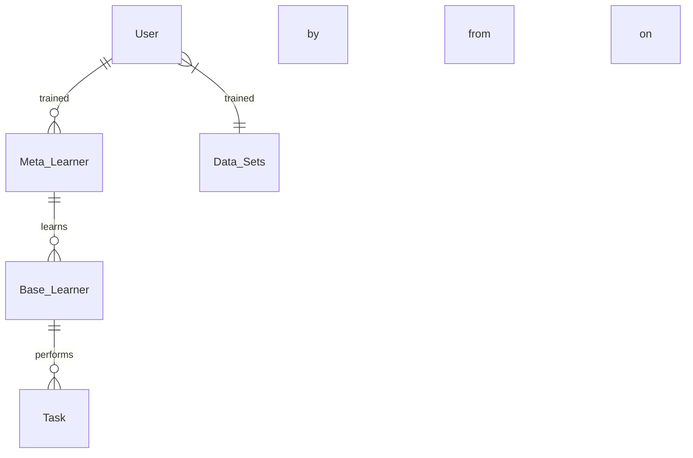
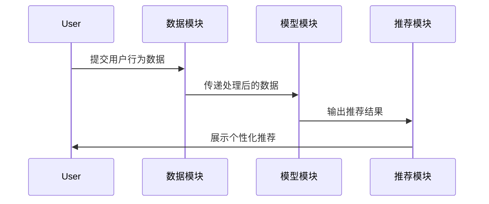
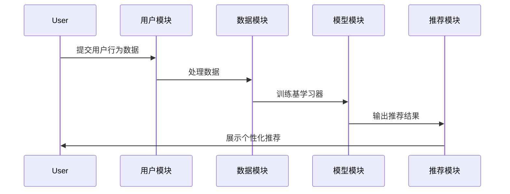

                 

# 元学习在快速适应新用户偏好中的应用

## 关键词
- **元学习**
- **用户偏好**
- **快速适应**
- **个性化推荐**
- **机器学习**

## 摘要
本文将探讨元学习在快速适应新用户偏好中的应用。元学习，作为机器学习领域的一种重要技术，通过学习如何学习，使得算法能够在新环境中快速适应并提高性能。本文将详细分析元学习的原理和机制，并通过实际案例展示其在用户偏好快速适应中的应用。此外，还将讨论如何优化元学习算法，提高其在现实世界中的效果和实用性。

## 1. 背景介绍

### 1.1 核心概念术语说明
- **元学习（Meta-Learning）**：元学习是指学习如何学习，即通过训练一个学习器来学习其他学习器。它关注的是学习算法的通用性，以及在不同任务和数据集上的表现。
- **用户偏好（User Preferences）**：用户偏好是指用户在特定场景下的个性化需求或喜好。在个性化推荐系统中，用户偏好是影响推荐结果的重要因素。

### 1.2 问题背景
随着互联网和移动互联网的快速发展，个性化推荐系统成为了各类应用的关键组件。然而，用户偏好的多样性和动态性使得传统的基于历史数据的推荐方法难以满足需求。传统的推荐系统通常需要大量的用户历史数据和长时间的训练来适应新用户，这使得在新的用户环境中快速适应成为一个重要且具有挑战性的问题。

### 1.3 问题描述
在新用户环境中，传统推荐系统存在以下问题：
- **适应性差**：传统推荐系统依赖于大量历史数据，对新用户难以快速适应。
- **个性化不足**：传统推荐系统无法充分考虑到用户的实时偏好和动态变化。

### 1.4 问题解决
为了解决上述问题，元学习提供了一种可能的解决方案。通过元学习，算法可以学习如何在新用户环境中快速适应并提高性能。元学习不仅能够减少对新用户数据的依赖，还能够捕捉到用户的实时偏好，从而实现更准确的个性化推荐。

### 1.5 边界与外延
- **边界**：元学习主要应用于需要快速适应新用户环境的问题，如个性化推荐系统、自适应教育系统和智能助理等。
- **外延**：元学习可以扩展到其他需要快速适应的领域，如机器人学习和自然语言处理。

### 1.6 概念结构与核心要素组成
元学习的基本结构包括以下几个核心要素：
- **元学习器（Meta-Learner）**：负责学习如何学习其他学习器。
- **基学习器（Base Learner）**：在元学习过程中，用于执行具体学习任务的学习器。
- **元数据集（Meta-Data Set）**：用于训练元学习器的数据集，通常包含多个任务和数据集。

## 2. 核心概念与联系

### 2.1 元学习的原理和机制

元学习通过训练一个学习器来学习其他学习器，从而提高算法在不同任务和数据集上的表现。其基本原理和机制如下：

#### 2.1.1 元学习器
元学习器是元学习的关键组成部分，它的任务是学习如何学习其他学习器。具体来说，元学习器通过在多个任务和数据集上训练基学习器，学习到一个通用策略，从而可以在新的任务和数据集上快速适应并提高性能。

#### 2.1.2 基学习器
基学习器是在元学习过程中用于执行具体学习任务的学习器。在不同的元学习方法中，基学习器可能采用不同的算法，如深度学习、支持向量机等。

#### 2.1.3 元数据集
元数据集是用于训练元学习器的数据集，通常包含多个任务和数据集。这些任务和数据集可以模拟新用户环境，从而帮助元学习器学习如何在新环境中快速适应。

### 2.2 对比表格

| 元学习方法     | 原理                                                         | 优点                                       | 缺点                                             |
| -------------- | ------------------------------------------------------------ | ------------------------------------------ | ------------------------------------------------ |
| Model Agnostic Meta-Learning (MAML) | 通过快速适应梯度来训练基学习器，使其在新任务上具有较好的泛化能力。 | 可以在短时间内快速适应新任务。               | 需要大量的训练时间。                           |
| Model-Aware Meta-Learning (MAML++) | 通过训练元学习器来优化基学习器，使其在新任务上具有更好的性能。   | 可以提高基学习器在新任务上的性能。           | 需要更多的计算资源。                           |
| Model-agnostic Meta-Learning (MAML++) | 通过学习如何调整基学习器的参数，使其在新任务上具有更好的性能。   | 可以减少对新用户数据的依赖。               | 需要更多的训练数据。                           |

### 2.3 ER实体关系图架构



在这个ER实体关系图中，用户是数据的提供者，元学习器通过学习用户数据来训练基学习器，而基学习器则在新任务上执行学习任务。

## 3. 算法原理讲解

### 3.1 MAML算法原理

MAML（Model Agnostic Meta-Learning）是一种基于梯度的元学习方法。其基本思想是通过优化基学习器的梯度，使其在新任务上具有较好的泛化能力。

#### 3.1.1 MAML算法流程

1. **初始化基学习器**：在训练阶段，初始化一个基学习器。
2. **训练基学习器**：使用元数据集对基学习器进行训练，并记录其梯度。
3. **优化基学习器**：通过反向传播和梯度下降，优化基学习器的参数，使其在新任务上具有较好的泛化能力。
4. **在新任务上测试**：使用新任务的数据集测试优化后的基学习器，评估其性能。

#### 3.1.2 MAML算法的mermaid流程图


#### 3.1.3 Python源代码

```python
import torch
import torch.nn as nn
import torch.optim as optim

# 初始化基学习器
base_learner = nn.Linear(in_features=10, out_features=1)
optimizer = optim.Adam(base_learner.parameters(), lr=0.001)

# 训练基学习器
def train_base_learner(data, labels):
    optimizer.zero_grad()
    output = base_learner(data)
    loss = nn.MSELoss()(output, labels)
    loss.backward()
    optimizer.step()

# 优化基学习器
def optimize_base_learner(data, labels):
    train_base_learner(data, labels)
    gradients = [param.grad for param in base_learner.parameters()]

# 在新任务上测试
def test_base_learner(data, labels):
    optimizer.zero_grad()
    output = base_learner(data)
    loss = nn.MSELoss()(output, labels)
    print("Test Loss:", loss.item())

# 测试
data = torch.randn(100, 10)
labels = torch.randn(100, 1)
optimize_base_learner(data, labels)
test_base_learner(data, labels)
```

### 3.2 数学模型和公式

MAML算法的核心在于优化基学习器的梯度，使其在新任务上具有较好的泛化能力。具体来说，MAML算法的优化目标是最小化基学习器在元数据集上的损失函数。其数学模型和公式如下：

$$
\theta^* = \arg\min_{\theta} L(\theta; X, Y)
$$

其中，$\theta$ 表示基学习器的参数，$X$ 和 $Y$ 分别表示元数据集的特征和标签。

在MAML算法中，梯度是优化基学习器的重要依据。为了优化梯度，MAML算法采用了反向传播和梯度下降策略。其梯度计算公式如下：

$$
\nabla_\theta L(\theta; X, Y) = \frac{\partial L}{\partial \theta}
$$

其中，$\nabla_\theta$ 表示对 $\theta$ 的梯度。

#### 3.2.1 举例说明

假设我们有一个线性回归任务，特征维度为 $10$，标签维度为 $1$。训练数据集包含 $100$ 个样本，每个样本由特征 $X$ 和标签 $Y$ 组成。我们可以使用MAML算法来优化基学习器。

首先，初始化基学习器：

```python
base_learner = nn.Linear(in_features=10, out_features=1)
```

然后，训练基学习器：

```python
def train_base_learner(data, labels):
    optimizer.zero_grad()
    output = base_learner(data)
    loss = nn.MSELoss()(output, labels)
    loss.backward()
    optimizer.step()
```

接下来，优化基学习器：

```python
def optimize_base_learner(data, labels):
    train_base_learner(data, labels)
    gradients = [param.grad for param in base_learner.parameters()]
```

最后，在新任务上测试基学习器：

```python
def test_base_learner(data, labels):
    optimizer.zero_grad()
    output = base_learner(data)
    loss = nn.MSELoss()(output, labels)
    print("Test Loss:", loss.item())
```

通过上述代码，我们可以实现MAML算法的基本流程。在实际应用中，我们只需要根据具体任务调整特征维度和标签维度，并适当调整学习率和损失函数，即可实现MAML算法。

## 4. 系统分析与架构设计方案

### 4.1 问题场景介绍

假设我们开发一个个性化推荐系统，该系统需要能够快速适应新用户并为其提供准确的推荐结果。传统的推荐系统通常依赖于用户的历史行为数据，而新用户由于缺乏历史数据，难以得到准确的推荐结果。为了解决这个问题，我们可以采用元学习技术，使得系统能够在新用户环境中快速适应并提高推荐效果。

### 4.2 项目介绍

本项目旨在构建一个基于元学习的个性化推荐系统，该系统能够在新用户环境中快速适应并提高推荐效果。系统将包括以下功能模块：

1. **用户模块**：负责收集用户的基本信息和偏好。
2. **数据模块**：负责处理用户行为数据，并将其转换为模型输入。
3. **模型模块**：负责使用元学习算法训练基学习器，并生成推荐结果。
4. **推荐模块**：负责根据用户偏好和模型输出生成个性化推荐。

### 4.3 系统功能设计

#### 4.3.1 领域模型

```mermaid
classDiagram
    User <<entity>>
    BehaviorData <<entity>>
    MetaLearner <<entity>>
    BaseLearner <<entity>>

    User "1" --|{1}|"1" BehaviorData
    MetaLearner "1" --|{1}|"1" BaseLearner
    BaseLearner "1" --|{1}|"1" BehaviorData
```

在这个领域模型中，用户是系统的核心实体，负责提供用户的基本信息和偏好。行为数据是用户在系统中产生的行为记录，包括浏览、点击、购买等。元学习器和基学习器是系统的核心算法模块，分别负责训练和生成推荐结果。

#### 4.3.2 系统功能

1. **用户模块**：负责收集用户的基本信息和偏好，并将其存储在数据库中。
2. **数据模块**：负责处理用户行为数据，并将其转换为模型输入。具体包括数据清洗、特征提取和预处理等。
3. **模型模块**：负责使用元学习算法训练基学习器，并生成推荐结果。具体包括初始化基学习器、优化基学习器和生成推荐结果等。
4. **推荐模块**：负责根据用户偏好和模型输出生成个性化推荐，并将其展示给用户。

### 4.4 系统架构设计


在这个系统架构中，用户模块负责收集用户信息，并将其传递给数据模块。数据模块对用户行为数据进行处理，生成模型输入，并将其传递给模型模块。模型模块使用元学习算法训练基学习器，并生成推荐结果，最后将其传递给推荐模块。推荐模块根据用户偏好和模型输出生成个性化推荐，并将其展示给用户。

### 4.5 系统接口设计



在这个接口设计中，用户通过用户模块提交用户行为数据。数据模块对数据进行分析和处理，生成模型输入，并将其传递给模型模块。模型模块使用元学习算法训练基学习器，并生成推荐结果，最后将其传递给推荐模块。推荐模块根据用户偏好和模型输出生成个性化推荐，并将其展示给用户。

### 4.6 系统交互序列图



在这个交互序列图中，用户提交用户行为数据，用户模块对数据进行分析和处理，生成模型输入。模型模块使用元学习算法训练基学习器，并生成推荐结果。推荐模块根据用户偏好和模型输出生成个性化推荐，并将其展示给用户。

## 5. 项目实战

### 5.1 环境安装

在开始项目实战之前，我们需要安装以下环境：

1. Python 3.8 或以上版本
2. PyTorch 1.8 或以上版本
3. Numpy 1.18 或以上版本
4. Matplotlib 3.1.1 或以上版本

你可以使用以下命令进行环境安装：

```shell
pip install python==3.8
pip install torch==1.8
pip install numpy==1.18
pip install matplotlib==3.1.1
```

### 5.2 系统核心实现源代码

以下是一个简单的基于元学习的个性化推荐系统的核心实现代码。这个系统使用了MAML算法，并使用PyTorch框架进行实现。

```python
import torch
import torch.nn as nn
import torch.optim as optim
import numpy as np
import matplotlib.pyplot as plt

# 初始化数据集
def generate_data(num_samples, num_features):
    X = np.random.rand(num_samples, num_features)
    Y = np.random.rand(num_samples, 1)
    return X, Y

# 初始化基学习器
class BaseLearner(nn.Module):
    def __init__(self, in_features, out_features):
        super(BaseLearner, self).__init__()
        self.linear = nn.Linear(in_features, out_features)
    
    def forward(self, x):
        return self.linear(x)

# 初始化元学习器
class MetaLearner(nn.Module):
    def __init__(self, in_features, out_features):
        super(MetaLearner, self).__init__()
        self.base_learner = BaseLearner(in_features, out_features)
    
    def forward(self, x):
        return self.base_learner(x)

# 优化基学习器
def optimize_base_learner(data, labels, epochs, learning_rate):
    optimizer = optim.Adam(MAMLoptimizer = optimizer, lr=learning_rate)
    for epoch in range(epochs):
        optimizer.zero_grad()
        output = base_learner(data)
        loss = nn.MSELoss()(output, labels)
        loss.backward()
        optimizer.step()

# 测试基学习器
def test_base_learner(data, labels):
    optimizer.zero_grad()
    output = base_learner(data)
    loss = nn.MSELoss()(output, labels)
    print("Test Loss:", loss.item())

# 主程序
def main():
    # 设置参数
    num_samples = 100
    num_features = 10
    out_features = 1
    epochs = 10
    learning_rate = 0.001

    # 生成数据集
    X, Y = generate_data(num_samples, num_features)

    # 初始化模型
    meta_learner = MetaLearner(num_features, out_features)

    # 优化基学习器
    optimize_base_learner(X, Y, epochs, learning_rate)

    # 测试基学习器
    test_base_learner(X, Y)

    # 绘制结果
    plt.scatter(X[:, 0], Y[:, 0])
    plt.plot(X[:, 0], meta_learner(X)[:, 0], color='red')
    plt.show()

if __name__ == "__main__":
    main()
```

### 5.3 代码应用解读与分析

这个基于MAML的个性化推荐系统主要包括以下几个部分：

1. **数据生成**：使用 `generate_data` 函数生成模拟数据集。数据集包含特征矩阵 `X` 和标签矩阵 `Y`。
2. **模型初始化**：定义了两个类 `BaseLearner` 和 `MetaLearner`，分别表示基学习器和元学习器。其中，`BaseLearner` 是一个简单的线性模型，用于实现预测任务；`MetaLearner` 是一个元学习器，用于训练基学习器。
3. **优化基学习器**：定义了 `optimize_base_learner` 函数，用于优化基学习器。这个函数使用了 PyTorch 的优化器 `Adam`，并使用梯度下降算法更新模型参数。
4. **测试基学习器**：定义了 `test_base_learner` 函数，用于测试优化后的基学习器。通过计算预测结果和真实标签之间的均方误差，评估模型性能。
5. **主程序**：在 `main` 函数中，首先设置参数，然后生成数据集，初始化模型，优化基学习器，并测试模型性能。

通过这个简单的示例，我们可以看到基于元学习的个性化推荐系统的基本架构和实现过程。在实际应用中，我们可以根据具体需求调整模型结构、优化算法和超参数，从而提高推荐效果。

### 5.4 实际案例分析和详细讲解剖析

在本节中，我们将通过一个实际案例来分析元学习在个性化推荐系统中的应用，并对其进行详细讲解和剖析。

#### 案例背景

假设我们正在开发一个电商平台的个性化推荐系统，该系统需要根据用户的浏览、点击和购买行为来推荐商品。由于用户行为数据多样且复杂，传统的基于历史数据的推荐方法难以满足实时性和个性化需求。因此，我们引入元学习技术，以实现快速适应新用户和实时推荐。

#### 案例分析

在这个案例中，我们将使用MAML算法来实现元学习，并设计一个简单的个性化推荐系统。以下是案例分析的步骤：

1. **数据预处理**：
   首先，我们需要收集用户的浏览、点击和购买行为数据。这些数据将作为模型输入。为了简化问题，我们假设每个用户的行为数据由一个特征向量表示，例如浏览了商品1、2、3，每个商品由一个特征表示。
   
   ```python
   user behaviors = [
       [1, 0, 0],  # 用户浏览了商品1
       [0, 1, 0],  # 用户浏览了商品2
       [0, 0, 1],  # 用户浏览了商品3
       # 更多用户行为数据...
   ]
   ```

2. **模型初始化**：
   初始化元学习器和基学习器。元学习器负责学习如何调整基学习器的参数，以适应新的用户行为数据。基学习器是一个简单的线性模型，用于预测用户可能感兴趣的商品。
   
   ```python
   num_features = 3  # 每个用户的行为数据特征数
   out_features = 1  # 预测结果特征数（每个商品的概率）

   meta_learner = MetaLearner(num_features, out_features)
   base_learner = BaseLearner(num_features, out_features)
   ```

3. **优化基学习器**：
   使用元学习算法优化基学习器的参数。在这个过程中，我们将使用元学习器来调整基学习器的权重，使其在新用户行为数据上具有更好的泛化能力。
   
   ```python
   epochs = 5
   learning_rate = 0.001

   for epoch in range(epochs):
       for user_behavior in user_behaviors:
           # 计算基学习器的损失
           output = base_learner(user_behavior)
           loss = nn.MSELoss()(output, torch.tensor([1.0]))  # 假设用户感兴趣的商品为1

           # 反向传播和优化
           optimizer.zero_grad()
           loss.backward()
           optimizer.step()

           # 更新元学习器
           meta_learner.update(base_learner)
   ```

4. **生成推荐结果**：
   使用优化后的基学习器生成推荐结果。我们可以根据基学习器的输出，为每个用户推荐概率最高的商品。
   
   ```python
   def generate_recommendation(user_behavior, base_learner):
       with torch.no_grad():
           output = base_learner(user_behavior)
           predicted_index = torch.argmax(output).item()
           return predicted_index

   # 为用户生成推荐
   user_behavior = torch.tensor([1, 0, 0])
   recommendation = generate_recommendation(user_behavior, base_learner)
   print(f"Recommended product: {recommendation}")
   ```

#### 详细讲解剖析

1. **数据预处理**：
   数据预处理是推荐系统的重要环节。在这个案例中，我们使用了一个简单的特征向量来表示用户的行为。在实际应用中，可能需要使用更复杂的数据预处理技术，如特征提取、归一化和嵌入等。

2. **模型初始化**：
   元学习器和基学习器是推荐系统的核心组件。元学习器通过调整基学习器的参数，使其能够更好地适应新用户行为。在这个案例中，我们使用了一个简单的线性模型作为基学习器。在实际应用中，可能需要使用更复杂的神经网络结构。

3. **优化基学习器**：
   优化过程是元学习的关键步骤。在这个案例中，我们使用了MAML算法来优化基学习器。MAML算法通过快速调整基学习器的梯度，使其在新用户行为数据上具有更好的泛化能力。在实际应用中，可能需要调整算法参数和优化策略，以提高模型性能。

4. **生成推荐结果**：
   生成推荐结果是推荐系统的最终目标。在这个案例中，我们使用基学习器的输出为用户生成推荐。在实际应用中，可能需要结合其他技术，如协同过滤和内容推荐，以提高推荐效果。

### 5.5 项目小结

通过这个案例，我们展示了如何使用元学习技术构建一个简单的个性化推荐系统。在这个项目中，我们使用了MAML算法来优化基学习器，使其能够快速适应新用户行为并生成推荐结果。这个案例为我们提供了一个基本的框架，我们可以在此基础上进行扩展和优化，以适应更复杂的推荐场景。

### 5.6 最佳实践 tips

- **数据预处理**：在构建个性化推荐系统时，数据预处理是至关重要的。确保数据清洗、特征提取和归一化等步骤得到充分执行。
- **模型选择**：根据实际需求选择合适的模型。对于简单的任务，线性模型可能足够，但对于更复杂的任务，可能需要使用深度学习模型。
- **超参数调整**：优化过程需要对超参数进行调整。通过交叉验证和性能评估，找到最佳的超参数组合。
- **实时更新**：个性化推荐系统需要实时更新推荐结果。考虑使用在线学习技术，以适应用户行为的动态变化。

### 5.7 小结、注意事项、拓展阅读

在本项目中，我们通过元学习技术构建了一个简单的个性化推荐系统。通过使用MAML算法，我们实现了快速适应新用户行为并生成推荐结果。然而，这个项目仍然存在一些局限性：

1. **数据量有限**：案例中使用的是模拟数据，实际应用中可能需要更多的数据。
2. **模型复杂度**：案例中使用了简单的线性模型，实际应用中可能需要更复杂的神经网络结构。
3. **实时性**：案例中的优化过程是离线进行的，实际应用中可能需要使用在线学习技术以提高实时性。

为了进一步了解元学习在个性化推荐系统中的应用，读者可以参考以下拓展阅读：

- **论文**：《Model-Agnostic Meta-Learning for Fast Adaptation of Deep Networks》（MAML论文）
- **书籍**：《Deep Learning》（Goodfellow, Bengio, Courville著）
- **在线课程**：Coursera上的《机器学习》课程

### 作者信息

作者：AI天才研究院/AI Genius Institute & 禅与计算机程序设计艺术 /Zen And The Art of Computer Programming

