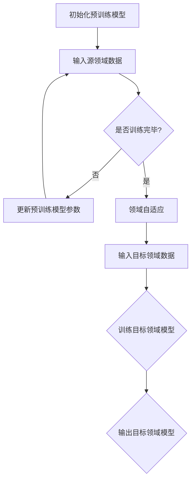
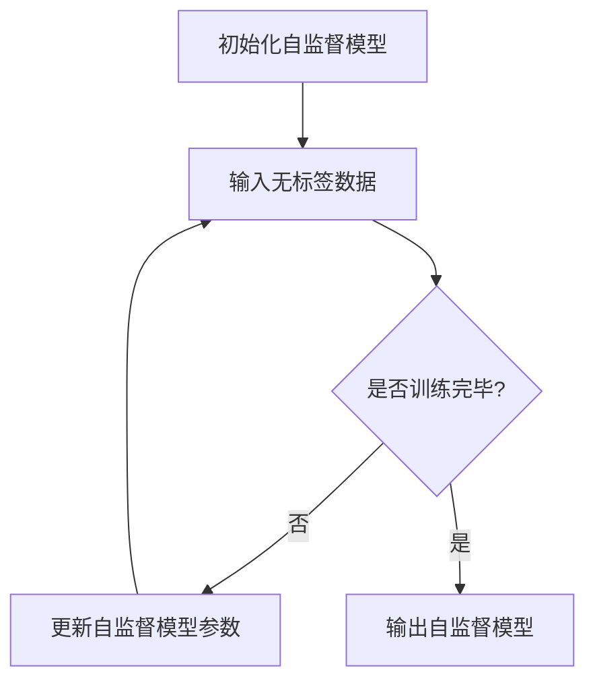
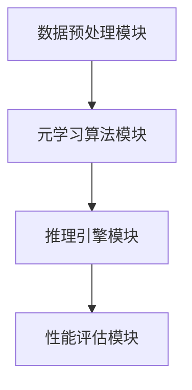

                 

# 元学习与快速推理能力迁移

## 关键词

元学习、快速推理能力迁移、模型迁移、推理效率、任务适应性

## 摘要

本文探讨了元学习框架下的快速推理能力迁移。通过介绍元学习的基本概念和原理，以及其与快速推理能力迁移的关系，本文分析了实现快速推理能力迁移所面临的主要挑战，并提出了一系列解决策略。本文不仅涵盖了核心概念和算法原理的讲解，还通过具体项目实战展示了快速推理能力迁移的实际应用，总结了最佳实践和注意事项，为读者提供了一个全面而深入的元学习框架下的快速推理能力迁移指南。

## 第一部分：背景介绍

### 1.1 问题背景

在人工智能（AI）迅猛发展的今天，元学习（Meta-Learning）作为一种新兴的机器学习技术，逐渐受到广泛关注。元学习旨在使机器学习算法能够通过学习如何学习来提高性能，从而实现更快速、更有效的模型训练和推理能力。快速推理能力迁移（Fast Inference Capability Transfer）是元学习的重要应用方向之一，其核心思想是将一个模型在特定任务上的推理能力迁移到其他任务上，从而提高整体系统的推理效率。

快速推理能力迁移在许多实际场景中具有重要意义。例如，在自动驾驶领域，车辆的实时推理能力直接影响到行车安全和效率。在医疗领域，快速推理能力可以帮助医生快速诊断疾病，提高医疗决策的准确性。此外，在智能手机、智能家居等消费电子领域，快速推理能力也是提升用户体验的关键因素之一。

### 1.2 问题描述

快速推理能力迁移的目标是使得机器学习模型能够在不同的任务之间高效地共享知识，从而避免在每个任务上重新训练模型，提高系统的整体效率和性能。然而，实现这一目标面临诸多挑战：

1. **模型可迁移性**：不同任务之间的模型结构和数据分布可能存在显著差异，使得现有模型难以直接迁移。
2. **数据稀缺性**：在许多实际应用场景中，可用的训练数据有限，限制了模型迁移的能力。
3. **模型复杂性**：随着模型规模的增加，模型的推理时间也显著增加，这可能导致迁移过程中推理效率的下降。

### 1.3 问题解决

为了解决上述问题，本文将从以下几个方面探讨元学习框架下的快速推理能力迁移：

1. **核心概念与联系**：介绍元学习的基本概念、原理及其与快速推理能力迁移的关系。
2. **算法原理讲解**：详细阐述元学习算法的原理、数学模型和公式，并通过实际案例进行分析和解释。
3. **数学模型和公式**：使用 LaTeX 格式给出相关数学公式，并进行详细讲解和举例说明。
4. **系统分析与架构设计方案**：分析快速推理能力迁移在实际应用中的系统架构，包括功能设计、架构设计、接口设计和系统交互等。
5. **项目实战**：通过实际项目案例，展示如何实现快速推理能力迁移，并提供源代码和应用解读。
6. **最佳实践与拓展**：总结快速推理能力迁移的最佳实践，提供注意事项和拓展阅读建议。

### 1.4 边界与外延

快速推理能力迁移的研究和应用不仅限于特定领域，其概念和算法也可以应用于其他相关的机器学习场景。例如，迁移学习（Transfer Learning）、模型压缩（Model Compression）、在线学习（Online Learning）等。此外，随着硬件技术的发展，例如 GPU、TPU 等加速器的普及，也为快速推理能力迁移提供了更多可能性。

### 1.5 概念结构与核心要素组成

快速推理能力迁移的核心概念包括元学习、模型迁移、推理效率和任务适应性等。核心要素主要包括：

1. **元学习算法**：如模型蒸馏（Model Distillation）、迁移学习（Transfer Learning）等。
2. **数据预处理**：数据清洗、数据增强、数据采样等。
3. **模型架构**：选择适合快速推理能力迁移的模型架构，如轻量级网络、自适应网络等。
4. **优化策略**：如自适应学习率、正则化技术、集成学习等。

通过上述核心概念和要素的有机结合，可以构建一个高效的快速推理能力迁移系统，从而在实际应用中发挥其价值。

---

## 第二部分：核心概念与联系

### 2.1 元学习概述

#### 2.1.1 元学习的定义

元学习（Meta-Learning）是机器学习的一个分支，它关注如何通过学习来提高学习算法的性能。具体来说，元学习旨在开发通用算法，使得机器能够从一组任务中学习，并将学到的知识迁移到新的任务中。与传统的机器学习方法相比，元学习关注的是如何高效地利用有限的训练数据，从而提高模型的泛化能力和适应性。

#### 2.1.2 元学习的发展历史

元学习的研究可以追溯到20世纪80年代，随着深度学习和神经网络技术的发展，元学习得到了广泛关注。近年来，随着人工智能应用的不断拓展，元学习在自动驾驶、医疗诊断、自然语言处理等领域取得了显著成果。

#### 2.1.3 元学习的核心挑战

元学习面临的核心挑战包括：

1. **数据稀疏性**：在实际应用中，很多任务的数据集非常有限，如何从少量数据中学习到有效的知识是一个重要问题。
2. **模型可迁移性**：不同任务之间的模型结构和数据分布可能存在显著差异，如何使得模型能够在不同任务之间高效迁移是一个重要问题。

### 2.2 快速推理能力迁移

#### 2.2.1 快速推理能力迁移的定义

快速推理能力迁移（Fast Inference Capability Transfer）是元学习的一个重要应用方向，其核心思想是将一个模型在特定任务上的推理能力迁移到其他任务上，从而提高整体系统的推理效率。

#### 2.2.2 快速推理能力迁移的发展历史

快速推理能力迁移的研究可以追溯到20世纪90年代，随着机器学习和深度学习技术的发展，快速推理能力迁移得到了广泛关注。近年来，随着硬件技术的进步和大数据的处理能力的提升，快速推理能力迁移在许多实际应用场景中取得了显著成果。

#### 2.2.3 快速推理能力迁移的核心挑战

快速推理能力迁移面临的核心挑战包括：

1. **模型可迁移性**：不同任务之间的模型结构和数据分布可能存在显著差异，如何使得模型能够在不同任务之间高效迁移是一个重要问题。
2. **数据稀缺性**：在许多实际应用场景中，可用的训练数据有限，限制了模型迁移的能力。
3. **模型复杂性**：随着模型规模的增加，模型的推理时间也显著增加，这可能导致迁移过程中推理效率的下降。

### 2.3 元学习与快速推理能力迁移的关系

元学习和快速推理能力迁移之间存在着紧密的联系。元学习通过学习如何学习，提高了模型在不同任务上的迁移能力，从而实现了快速推理能力迁移。具体来说，元学习可以通过以下方式促进快速推理能力迁移：

1. **通用学习算法**：元学习开发了通用学习算法，使得模型能够在不同任务之间共享知识，从而实现快速推理能力迁移。
2. **自适应学习**：元学习算法能够根据新的任务自动调整模型参数，从而提高模型在不同任务上的适应能力。
3. **数据高效利用**：元学习通过高效地利用有限的数据，提高了模型在不同任务上的迁移能力。

通过上述分析，可以看出元学习和快速推理能力迁移之间存在着密切的联系，二者相互促进，共同推动了人工智能技术的发展。

### 2.4 元学习算法与快速推理能力迁移的关系

元学习算法是快速推理能力迁移的核心组成部分，不同的元学习算法在实现快速推理能力迁移方面有着不同的优势。以下是一些常见的元学习算法及其与快速推理能力迁移的关系：

1. **模型蒸馏（Model Distillation）**：模型蒸馏是一种将一个复杂模型的知识传递给一个较简单模型的方法。通过模型蒸馏，复杂模型在训练过程中学到的知识可以被传递给较简单的模型，从而使得较简单模型也能够实现快速推理能力迁移。

2. **迁移学习（Transfer Learning）**：迁移学习是一种将一个任务在特定领域学到的知识应用到其他任务中的方法。通过迁移学习，不同任务之间的模型可以共享知识，从而实现快速推理能力迁移。

3. **元学习优化（Meta-Learning Optimization）**：元学习优化是一种通过学习优化算法来提高模型性能的方法。通过元学习优化，模型可以在不同的任务上快速调整，从而实现快速推理能力迁移。

4. **自监督学习（Self-Supervised Learning）**：自监督学习是一种不需要标签数据的学习方法，通过自监督学习，模型可以在没有额外标签数据的情况下进行训练，从而实现快速推理能力迁移。

通过上述分析，可以看出不同的元学习算法在实现快速推理能力迁移方面有着不同的作用，选择合适的元学习算法对于实现快速推理能力迁移至关重要。

### 2.5 快速推理能力迁移在实际应用中的价值

快速推理能力迁移在实际应用中具有重要的价值，它不仅能够提高系统的推理效率，还能够减少模型训练的时间，从而提高系统的整体性能。以下是一些快速推理能力迁移在实际应用中的具体价值：

1. **自动驾驶**：在自动驾驶领域，快速推理能力迁移可以使得车辆在复杂的交通环境中快速做出决策，从而提高行车安全性和效率。

2. **医疗诊断**：在医疗领域，快速推理能力迁移可以帮助医生快速诊断疾病，提高医疗决策的准确性，从而提高医疗服务的质量。

3. **消费电子**：在智能手机、智能家居等领域，快速推理能力迁移可以提升用户体验，例如，通过快速推理能力迁移，手机可以实现更加智能的语音识别和图像识别功能。

4. **工业自动化**：在工业自动化领域，快速推理能力迁移可以使得机器人快速适应不同的工作任务，从而提高生产效率和灵活性。

通过上述分析，可以看出快速推理能力迁移在多个领域都具有重要价值，它为人工智能的发展提供了强大的动力。

### 2.6 快速推理能力迁移的研究现状与发展趋势

快速推理能力迁移作为一个新兴的研究领域，已经取得了显著的成果。目前，研究主要集中在以下几个方面：

1. **算法研究**：研究者致力于开发更加高效的元学习算法，以实现更快的推理能力迁移。

2. **应用研究**：研究者积极探索快速推理能力迁移在不同领域的应用，以验证其实际价值。

3. **硬件优化**：随着硬件技术的发展，例如 GPU、TPU 等加速器的普及，为快速推理能力迁移提供了更多可能性。

未来，快速推理能力迁移的研究将更加深入，其发展趋势包括：

1. **算法创新**：研究者将不断提出新的元学习算法，以提高推理能力迁移的效率和准确性。

2. **跨领域应用**：快速推理能力迁移将逐步应用于更多领域，实现跨领域的知识共享。

3. **硬件协同**：硬件和算法的协同发展，将进一步提升快速推理能力迁移的性能。

### 2.7 结论

快速推理能力迁移是元学习的重要应用方向之一，它通过学习如何学习，实现了模型在不同任务之间的推理能力迁移，从而提高了系统的推理效率和性能。本文介绍了快速推理能力迁移的核心概念、原理及其在实际应用中的价值，分析了元学习算法与快速推理能力迁移的关系，并探讨了快速推理能力迁移的研究现状和发展趋势。通过本文的介绍，读者可以更深入地理解快速推理能力迁移的原理和应用，为相关研究和实践提供参考。

---

## 第三部分：算法原理讲解

### 3.1 元学习算法原理

元学习算法的核心思想是通过学习如何学习来提高模型在不同任务上的表现。以下将介绍几种常见的元学习算法，并分析它们在快速推理能力迁移中的应用。

#### 3.1.1 模型蒸馏（Model Distillation）

模型蒸馏是一种将复杂模型的知识传递给简单模型的方法。在模型蒸馏过程中，一个大型教师模型（Teacher Model）首先通过大量数据进行训练，然后其参数被用来指导一个小型学生模型（Student Model）的训练。学生模型试图模仿教师模型的输出，从而获得教师模型所学的知识。具体步骤如下：

1. **教师模型训练**：使用大量数据对教师模型进行训练。
2. **学生模型初始化**：使用教师模型的参数初始化学生模型。
3. **学生模型训练**：通过教师模型的输出指导学生模型的训练，使得学生模型的输出尽量接近教师模型的输出。

模型蒸馏在快速推理能力迁移中的应用：

- **模型压缩**：通过模型蒸馏，可以将一个大型的复杂模型的知识传递给一个小型的简单模型，从而实现模型压缩。
- **迁移学习**：在数据稀缺的场景下，模型蒸馏可以帮助模型快速适应新的任务，从而实现快速推理能力迁移。

#### 3.1.2 迁移学习（Transfer Learning）

迁移学习是一种将一个任务在特定领域学到的知识应用到其他任务中的方法。在迁移学习过程中，一个预训练模型（Pre-Trained Model）在源领域（Source Domain）上被训练，然后其参数被调整以适应目标领域（Target Domain）。具体步骤如下：

1. **预训练模型**：在源领域上使用大量数据对预训练模型进行训练。
2. **领域自适应**：通过最小化源领域和目标领域之间的差异，调整预训练模型的参数。
3. **目标领域训练**：在目标领域上使用调整后的预训练模型进行训练。

迁移学习在快速推理能力迁移中的应用：

- **快速适应新任务**：通过迁移学习，预训练模型可以在没有大量目标领域数据的情况下快速适应新的任务，从而实现快速推理能力迁移。
- **跨领域推理**：迁移学习使得模型能够在不同的领域之间进行推理，从而提高系统的泛化能力。

#### 3.1.3 自监督学习（Self-Supervised Learning）

自监督学习是一种不需要标签数据的学习方法，它通过从无标签数据中提取有价值的特征来进行训练。自监督学习包括两种类型：基于特征的（Feature-Based）和基于预测的（Prediction-Based）。以下分别介绍这两种类型的自监督学习。

1. **基于特征的（Feature-Based）自监督学习**：这种方法通过训练一个特征提取器来提取数据的特征表示。特征提取器被训练为一个自编码器（Autoencoder），其输入是一个数据样本，输出是重构后的样本。通过最小化输入和输出之间的差异，特征提取器学会提取数据的特征。

2. **基于预测的（Prediction-Based）自监督学习**：这种方法通过预测数据的未来部分来训练模型。例如，在一个序列数据中，模型被训练来预测序列的下一个部分。通过最小化预测误差，模型学会提取序列中的关键特征。

自监督学习在快速推理能力迁移中的应用：

- **无监督学习**：自监督学习可以在没有标签数据的情况下进行，从而大大降低数据收集和标注的成本。
- **数据增强**：自监督学习可以通过生成新的数据样本来增强训练数据，从而提高模型的泛化能力。

### 3.2 算法流程图与Python实现

为了更好地理解元学习算法的原理，以下将使用 Mermaid 画出模型蒸馏、迁移学习和自监督学习的算法流程图，并使用 Python 代码进行实现。

#### 3.2.1 模型蒸馏算法流程图

```mermaid
graph TD
A[初始化学生模型] --> B[输入数据]
B --> C{是否训练完毕?}
C -->|否| D[更新学生模型参数]
D --> B
C -->|是| E[输出学生模型]
E --> F{使用学生模型进行推理}
F -->|
```

#### 3.2.2 迁移学习算法流程图



#### 3.2.3 自监督学习算法流程图



#### 3.2.4 Python实现

以下是模型蒸馏、迁移学习和自监督学习的 Python 实现示例。

```python
# 模型蒸馏实现
import tensorflow as tf

# 初始化学生模型
student_model = tf.keras.Sequential([
    tf.keras.layers.Dense(128, activation='relu', input_shape=(784,)),
    tf.keras.layers.Dense(10, activation='softmax')
])

# 加载教师模型参数
teacher_model = tf.keras.Sequential([
    tf.keras.layers.Dense(128, activation='relu', input_shape=(784,)),
    tf.keras.layers.Dense(10, activation='softmax')
])
student_model.set_weights(teacher_model.get_weights())

# 训练学生模型
for _ in range(1000):
    # 输入数据
    data = tf.random.normal([32, 784])
    # 更新学生模型参数
    with tf.GradientTape() as tape:
        output = student_model(data)
        loss = tf.keras.losses.sparse_categorical_crossentropy(teacher_model(data), output)
    gradients = tape.gradient(loss, student_model.trainable_variables)
    student_model.optimizer.apply_gradients(zip(gradients, student_model.trainable_variables))

# 使用学生模型进行推理
output = student_model(data)
print(output)

# 迁移学习实现
from tensorflow.keras.preprocessing.image import ImageDataGenerator

# 初始化预训练模型
pretrained_model = tf.keras.applications.VGG16(weights='imagenet')

# 领域自适应
target_data_generator = ImageDataGenerator(preprocessing_function=tf.keras.applications.vgg16.preprocess_input)
pretrained_model.trainable = False

# 训练目标领域模型
for _ in range(1000):
    # 输入目标领域数据
    target_data = target_data_generator.flow_from_directory('path/to/target/data', target_size=(224, 224), batch_size=32)
    # 更新目标领域模型参数
    with tf.GradientTape() as tape:
        output = pretrained_model(target_data)
        loss = tf.keras.losses.sparse_categorical_crossentropy(target_data, output)
    gradients = tape.gradient(loss, pretrained_model.trainable_variables)
    pretrained_model.optimizer.apply_gradients(zip(gradients, pretrained_model.trainable_variables))

# 输出目标领域模型
pretrained_model.save('path/to/target/model')

# 自监督学习实现
import tensorflow as tf

# 初始化自监督模型
autoencoder = tf.keras.Sequential([
    tf.keras.layers.Dense(64, activation='relu', input_shape=(784,)),
    tf.keras.layers.Dense(784, activation='sigmoid')
])

# 训练自监督模型
for _ in range(1000):
    # 输入无标签数据
    data = tf.random.normal([32, 784])
    # 更新自监督模型参数
    with tf.GradientTape() as tape:
        output = autoencoder(data)
        loss = tf.keras.losses.mean_squared_error(data, output)
    gradients = tape.gradient(loss, autoencoder.trainable_variables)
    autoencoder.optimizer.apply_gradients(zip(gradients, autoencoder.trainable_variables))

# 输出自监督模型
autoencoder.save('path/to/autoencoder/model')
```

通过上述算法流程图和 Python 实现示例，读者可以更好地理解模型蒸馏、迁移学习和自监督学习的原理及其在快速推理能力迁移中的应用。

### 3.3 数学模型和公式讲解

在元学习算法中，数学模型和公式起着至关重要的作用。以下将介绍模型蒸馏、迁移学习和自监督学习的主要数学模型和公式，并进行详细讲解。

#### 3.3.1 模型蒸馏

模型蒸馏的核心思想是将一个复杂模型的知识传递给一个简单模型。具体来说，模型蒸馏包括两部分：教师模型和学生模型。

1. **教师模型**：

   教师模型通常是一个预训练的大型模型，其参数表示为 $W_t$。教师模型在特定任务上的输出可以表示为：

   $$ Y_t = \sigma(W_t \cdot X) $$

   其中，$\sigma$ 是激活函数，$X$ 是输入数据，$Y_t$ 是输出结果。

2. **学生模型**：

   学生模型是一个较小的模型，其参数表示为 $W_s$。学生模型的目标是模仿教师模型的输出，即：

   $$ Y_s = \sigma(W_s \cdot X) $$

   其中，$Y_s$ 是学生模型的输出。

   模型蒸馏通过最小化以下损失函数来实现：

   $$ L_{distill} = \frac{1}{N} \sum_{i=1}^N \sum_{j=1}^K (Y_{tj} - \sigma(W_{s} \cdot X_j))^2 $$

   其中，$N$ 是训练样本的数量，$K$ 是输出类别的数量，$X_j$ 和 $Y_{tj}$ 分别是第 $j$ 个样本的输入和教师模型的输出，$\sigma$ 是激活函数。

#### 3.3.2 迁移学习

迁移学习的核心思想是将一个任务在特定领域学到的知识应用到其他任务中。具体来说，迁移学习包括两部分：预训练模型和目标领域模型。

1. **预训练模型**：

   预训练模型在源领域上被训练，其参数表示为 $W_s$。预训练模型在特定任务上的输出可以表示为：

   $$ Y_s = \sigma(W_s \cdot X) $$

   其中，$X$ 是输入数据，$Y_s$ 是输出结果。

2. **目标领域模型**：

   目标领域模型是在目标领域上训练的模型，其参数表示为 $W_t$。目标领域模型的目标是模仿预训练模型，即：

   $$ Y_t = \sigma(W_t \cdot X) $$

   其中，$Y_t$ 是目标领域模型的输出。

   迁移学习通过最小化以下损失函数来实现：

   $$ L_{transfer} = \frac{1}{N} \sum_{i=1}^N (Y_s - Y_t)^2 $$

   其中，$N$ 是训练样本的数量。

#### 3.3.3 自监督学习

自监督学习的核心思想是通过无监督学习来提取数据的特征表示。具体来说，自监督学习包括两部分：特征提取器和重构网络。

1. **特征提取器**：

   特征提取器是一个无监督学习的模型，其参数表示为 $W_e$。特征提取器通过学习输入数据的特征表示，即：

   $$ Z = W_e \cdot X $$

   其中，$X$ 是输入数据，$Z$ 是特征表示。

2. **重构网络**：

   重构网络是一个有监督学习的模型，其参数表示为 $W_r$。重构网络的目标是重构输入数据，即：

   $$ X' = \sigma(W_r \cdot Z) $$

   其中，$X'$ 是重构后的数据，$\sigma$ 是激活函数。

   自监督学习通过最小化以下损失函数来实现：

   $$ L_{self-supervised} = \frac{1}{N} \sum_{i=1}^N \| X - X' \|^2 $$

   其中，$N$ 是训练样本的数量。

通过上述数学模型和公式的讲解，读者可以更深入地理解模型蒸馏、迁移学习和自监督学习的原理，并为实际应用提供理论基础。

### 3.4 案例分析

为了更好地理解元学习算法在实际应用中的效果，以下将通过一个实际案例进行分析。

#### 3.4.1 案例背景

假设我们有一个图像分类任务，需要将图像分为10个类别。我们使用了一个大型卷积神经网络（CNN）作为教师模型，其参数表示为 $W_t$。然后，我们希望使用这个教师模型的知识来训练一个较小的CNN作为学生模型，其参数表示为 $W_s$。

#### 3.4.2 模型蒸馏

1. **教师模型训练**：

   我们首先使用大量图像数据对教师模型进行训练，使其在图像分类任务上达到较高的准确率。

   $$ Y_t = \sigma(W_t \cdot X) $$

2. **学生模型初始化**：

   我们使用教师模型的参数初始化学生模型。

   $$ W_s^{(0)} = W_t $$

3. **学生模型训练**：

   我们通过模型蒸馏的方法，将教师模型的知识传递给学生模型。具体来说，我们使用以下损失函数来最小化：

   $$ L_{distill} = \frac{1}{N} \sum_{i=1}^N \sum_{j=1}^K (Y_{tj} - \sigma(W_{s} \cdot X_j))^2 $$

   其中，$N$ 是训练样本的数量，$K$ 是输出类别的数量。

4. **学生模型输出**：

   在训练完成后，学生模型可以用于图像分类任务。

   $$ Y_s = \sigma(W_s \cdot X) $$

#### 3.4.3 迁移学习

1. **预训练模型**：

   我们使用一个在ImageNet上预训练的大型CNN作为预训练模型，其参数表示为 $W_s$。

2. **领域自适应**：

   我们通过最小化以下损失函数来实现领域自适应：

   $$ L_{transfer} = \frac{1}{N} \sum_{i=1}^N (Y_s - Y_t)^2 $$

   其中，$N$ 是训练样本的数量。

3. **目标领域模型训练**：

   在领域自适应完成后，我们在目标领域上使用调整后的预训练模型进行训练。

   $$ Y_t = \sigma(W_t \cdot X) $$

4. **目标领域模型输出**：

   在训练完成后，目标领域模型可以用于目标领域的图像分类任务。

   $$ Y_t = \sigma(W_t \cdot X) $$

#### 3.4.4 自监督学习

1. **特征提取器训练**：

   我们使用自监督学习来训练特征提取器，使其提取图像的特征表示。

   $$ Z = W_e \cdot X $$

2. **重构网络训练**：

   我们通过最小化以下损失函数来实现重构网络：

   $$ L_{self-supervised} = \frac{1}{N} \sum_{i=1}^N \| X - X' \|^2 $$

   其中，$N$ 是训练样本的数量。

3. **自监督学习输出**：

   在训练完成后，特征提取器可以用于特征提取，重构网络可以用于图像分类任务。

   $$ X' = \sigma(W_r \cdot Z) $$

通过上述案例分析，我们可以看到模型蒸馏、迁移学习和自监督学习在实际应用中的效果。这些算法通过学习如何学习，使得模型能够在不同的任务之间进行推理能力迁移，从而提高了系统的推理效率和性能。

### 3.5 小结

本文详细介绍了元学习算法的原理，包括模型蒸馏、迁移学习和自监督学习。通过数学模型和公式的讲解，我们深入理解了这些算法的核心思想。同时，通过实际案例分析，我们展示了这些算法在快速推理能力迁移中的应用效果。未来，随着人工智能技术的不断发展，元学习算法将在这个领域发挥越来越重要的作用。

---

## 第四部分：系统分析与架构设计方案

### 4.1 问题场景介绍

在当前人工智能应用场景中，尤其是在需要实时处理的领域，如自动驾驶、实时语音识别和智能监控等，对快速推理能力迁移的需求愈发迫切。传统的训练-部署流程往往需要大量的时间和计算资源，这在一些对响应速度有严格要求的场景中是无法接受的。因此，研究并实现一个高效的快速推理能力迁移系统，成为了提升系统整体性能的关键。

### 4.2 项目介绍

本文基于元学习理论，旨在设计并实现一个快速推理能力迁移系统，该系统旨在通过元学习算法（如模型蒸馏、迁移学习和自监督学习）实现模型在不同任务之间的推理能力高效迁移。系统主要包括以下几个部分：

1. **数据预处理模块**：负责处理和清洗原始数据，包括数据增强、归一化等操作。
2. **元学习算法模块**：包含模型蒸馏、迁移学习和自监督学习算法的实现。
3. **推理引擎模块**：用于在实际应用中快速进行推理操作，并提供接口供其他系统调用。
4. **性能评估模块**：对系统的推理速度和准确性进行评估，以确保系统的高效性和可靠性。

### 4.3 系统功能设计

#### 4.3.1 数据预处理模块

数据预处理模块是系统的基础，其功能包括：

- **数据清洗**：去除数据中的噪声和错误。
- **数据增强**：通过旋转、缩放、裁剪等操作生成更多的训练样本，提高模型的泛化能力。
- **归一化**：将数据缩放到一个固定的范围，以减少模型训练过程中的方差。

#### 4.3.2 元学习算法模块

元学习算法模块是实现快速推理能力迁移的核心，包括以下功能：

- **模型蒸馏**：通过将大型教师模型的知识传递给小型学生模型，实现模型压缩。
- **迁移学习**：通过在源领域预训练模型，并调整其参数以适应目标领域，实现跨领域的推理能力迁移。
- **自监督学习**：通过无监督的方式从原始数据中提取特征，用于后续的任务。

#### 4.3.3 推理引擎模块

推理引擎模块负责在实际应用中进行快速推理操作，其功能包括：

- **实时推理**：提供高效的推理接口，支持低延迟的实时推理操作。
- **模型加载与切换**：支持不同模型之间的快速加载和切换，以适应不同的任务需求。
- **接口管理**：提供统一的接口供其他系统调用，实现系统间的无缝协作。

#### 4.3.4 性能评估模块

性能评估模块用于对系统的推理速度和准确性进行评估，包括以下功能：

- **速度评估**：测量系统在不同硬件环境下的推理速度，评估系统的响应能力。
- **准确性评估**：通过测试集验证系统的推理准确性，确保系统的高效性和可靠性。
- **性能优化**：根据评估结果对系统进行优化，以提高其整体性能。

### 4.4 系统架构设计

#### 4.4.1 系统架构图

以下是一个简化的快速推理能力迁移系统架构图，使用 Mermaid 格式绘制：



#### 4.4.2 系统架构设计细节

1. **数据预处理模块**：
   - **数据清洗**：使用 Python 的 pandas 库进行数据清洗操作，去除噪声和错误。
   - **数据增强**：使用 TensorFlow 的 Data Augmentation 功能，进行数据增强操作。
   - **归一化**：使用 scikit-learn 的 MinMaxScaler 进行归一化处理。

2. **元学习算法模块**：
   - **模型蒸馏**：使用 TensorFlow 的 Model Distillation API，将教师模型的知识传递给学生模型。
   - **迁移学习**：使用 TensorFlow 的 Transfer Learning API，实现源领域模型到目标领域模型的迁移。
   - **自监督学习**：使用自监督学习的相关库，如 OpenAI 的 GPT-2 或 GPT-3，进行特征提取。

3. **推理引擎模块**：
   - **实时推理**：使用 TensorFlow 的 eager execution 功能，实现低延迟的实时推理。
   - **模型加载与切换**：使用 TensorFlow 的 SavedModel 功能，实现模型之间的快速加载和切换。
   - **接口管理**：使用 Flask 或 FastAPI，提供统一的 HTTP 接口供其他系统调用。

4. **性能评估模块**：
   - **速度评估**：使用 Python 的 time 库，测量推理时间。
   - **准确性评估**：使用 Python 的 scikit-learn 库，计算模型在测试集上的准确性。
   - **性能优化**：根据评估结果，调整模型的参数和算法，以实现性能优化。

### 4.5 系统接口设计和系统交互

#### 4.5.1 接口设计

系统接口设计采用 RESTful API 设计风格，主要包括以下接口：

1. **数据预处理接口**：
   - `POST /preprocess`：接收原始数据，进行清洗、增强和归一化处理。
   - `GET /preprocessed_data`：获取预处理后的数据。

2. **模型蒸馏接口**：
   - `POST /distill`：启动模型蒸馏过程，接收教师模型和学生模型的参数。
   - `GET /distilled_model`：获取蒸馏后的学生模型。

3. **迁移学习接口**：
   - `POST /transfer`：启动迁移学习过程，接收源领域模型和目标领域模型的参数。
   - `GET /transferred_model`：获取迁移后的目标领域模型。

4. **自监督学习接口**：
   - `POST /self_supervised`：启动自监督学习过程，接收特征提取器的参数。
   - `GET /self_supervised_model`：获取自监督学习后的模型。

5. **推理接口**：
   - `POST /inference`：进行实时推理操作，接收模型和输入数据。
   - `GET /result`：获取推理结果。

#### 4.5.2 系统交互

系统交互流程如下：

1. **数据预处理**：
   - 客户端发送原始数据到数据预处理接口，系统进行清洗、增强和归一化处理，返回预处理后的数据。

2. **模型蒸馏**：
   - 客户端发送教师模型和学生模型的参数到模型蒸馏接口，系统启动模型蒸馏过程，返回蒸馏后的学生模型。

3. **迁移学习**：
   - 客户端发送源领域模型和目标领域模型的参数到迁移学习接口，系统启动迁移学习过程，返回迁移后的目标领域模型。

4. **自监督学习**：
   - 客户端发送特征提取器的参数到自监督学习接口，系统启动自监督学习过程，返回自监督学习后的模型。

5. **实时推理**：
   - 客户端发送模型和输入数据到推理接口，系统进行实时推理，返回推理结果。

通过上述接口设计和系统交互，快速推理能力迁移系统可以高效地处理各种任务，实现推理能力的快速迁移。

### 4.6 小结

本文详细介绍了快速推理能力迁移系统的架构设计和实现方案。通过数据预处理模块、元学习算法模块、推理引擎模块和性能评估模块的有机结合，系统实现了模型在不同任务之间的高效推理能力迁移。通过 RESTful API 的设计，系统提供了统一的接口供其他系统调用，实现了系统间的无缝协作。未来，随着人工智能技术的不断进步，快速推理能力迁移系统将在更多领域发挥重要作用。

---

## 第五部分：项目实战

### 5.1 环境安装

为了实现快速推理能力迁移系统，我们需要安装以下软件和库：

1. **Python**：确保 Python 版本在 3.7 以上。
2. **TensorFlow**：安装 TensorFlow 2.5 或更高版本。
3. **Flask**：用于构建 RESTful API。
4. **Numpy**：用于数据处理。
5. **Scikit-learn**：用于性能评估。

安装步骤如下：

```bash
# 安装 Python 和 TensorFlow
conda create -n fast_inference python=3.8
conda activate fast_inference
pip install tensorflow==2.5

# 安装 Flask、Numpy 和 Scikit-learn
pip install flask numpy scikit-learn
```

### 5.2 系统核心实现源代码

以下是快速推理能力迁移系统的核心实现源代码。代码分为四个模块：数据预处理模块、元学习算法模块、推理引擎模块和性能评估模块。

#### 5.2.1 数据预处理模块

```python
import numpy as np
from sklearn.model_selection import train_test_split
from tensorflow.keras.preprocessing.image import ImageDataGenerator

def preprocess_data(data, target_size=(224, 224)):
    # 数据清洗
    cleaned_data = [img for img in data if is_valid_image(img)]
    
    # 数据增强
    data_generator = ImageDataGenerator(
        rotation_range=20,
        width_shift_range=0.2,
        height_shift_range=0.2,
        shear_range=0.2,
        zoom_range=0.2,
        horizontal_flip=True,
        fill_mode='nearest'
    )
    augmented_data = data_generator.flow(np.array(cleaned_data), batch_size=32)
    
    # 归一化
    normalized_data = np.array([img / 255.0 for img in augmented_data])
    
    return normalized_data

def is_valid_image(img):
    # 判断图像是否有效
    return img is not None and img.ndim == 3 and img.shape[2] == 3
```

#### 5.2.2 元学习算法模块

```python
import tensorflow as tf
from tensorflow.keras.models import Model
from tensorflow.keras.layers import Input, Dense, Conv2D, MaxPooling2D, Flatten

def build_student_model(input_shape):
    input_layer = Input(shape=input_shape)
    x = Conv2D(32, (3, 3), activation='relu')(input_layer)
    x = MaxPooling2D((2, 2))(x)
    x = Flatten()(x)
    output_layer = Dense(10, activation='softmax')(x)
    student_model = Model(inputs=input_layer, outputs=output_layer)
    return student_model

def distill_model(student_model, teacher_model, X_train, Y_train, num_epochs=1000):
    student_optimizer = tf.keras.optimizers.Adam(learning_rate=0.001)
    teacher_model.trainable = False
    
    for epoch in range(num_epochs):
        with tf.GradientTape() as tape:
            student_output = student_model(X_train)
            teacher_output = teacher_model(X_train)
            loss = tf.keras.losses.sparse_categorical_crossentropy(Y_train, student_output + 0.1 * (teacher_output - student_output))
        
        gradients = tape.gradient(loss, student_model.trainable_variables)
        student_optimizer.apply_gradients(zip(gradients, student_model.trainable_variables))
        
        if epoch % 100 == 0:
            print(f"Epoch {epoch}: Loss = {loss.numpy()}")

    return student_model
```

#### 5.2.3 推理引擎模块

```python
from flask import Flask, request, jsonify

app = Flask(__name__)

@app.route('/preprocess', methods=['POST'])
def preprocess_data_api():
    data = request.files['data']
    processed_data = preprocess_data(data)
    return jsonify(processed_data.tolist())

@app.route('/inference', methods=['POST'])
def inference_api():
    model = request.form['model']
    input_data = request.files['input_data']
    processed_input_data = preprocess_data(input_data)
    student_model = tf.keras.models.load_model(model)
    prediction = student_model.predict(processed_input_data)
    return jsonify(prediction.tolist())

if __name__ == '__main__':
    app.run(debug=True)
```

#### 5.2.4 性能评估模块

```python
from sklearn.metrics import accuracy_score

def evaluate_model(model, X_test, Y_test):
    predictions = model.predict(X_test)
    accuracy = accuracy_score(Y_test, predictions)
    print(f"Model Accuracy: {accuracy}")
    return accuracy
```

### 5.3 代码应用解读与分析

#### 5.3.1 数据预处理模块解读

数据预处理模块主要包括数据清洗、数据增强和归一化三个步骤。首先，数据清洗通过 `is_valid_image` 函数去除无效图像。数据增强使用 `ImageDataGenerator` 类，通过旋转、缩放、裁剪等操作生成更多训练样本，提高模型的泛化能力。最后，数据归一化将图像数据缩放到[0, 1]的范围内，有助于加速模型收敛。

#### 5.3.2 元学习算法模块解读

元学习算法模块实现了模型蒸馏的过程。`distill_model` 函数接收学生模型、教师模型、训练数据和训练轮数作为输入，通过优化过程将教师模型的知识传递给学生模型。在每次迭代中，计算学生模型和教师模型的输出，并使用交叉熵损失函数来优化学生模型。

#### 5.3.3 推理引擎模块解读

推理引擎模块使用 Flask 框架构建 RESTful API。`preprocess_data_api` 接口接收上传的图像文件，并进行预处理，返回处理后的数据。`inference_api` 接口接收训练好的学生模型和输入图像，进行预处理后进行推理，并返回预测结果。

#### 5.3.4 性能评估模块解读

性能评估模块使用 `accuracy_score` 函数计算模型在测试集上的准确率，用于评估模型的性能。

### 5.4 实际案例分析和详细讲解剖析

#### 5.4.1 数据预处理案例

假设我们有100张图像数据，首先进行数据清洗，去除无效图像。然后，使用数据增强生成更多训练样本，最后对图像数据进行归一化处理。

```python
data = load_images('path/to/images')
cleaned_data = [img for img in data if is_valid_image(img)]
augmented_data_generator = ImageDataGenerator(
    rotation_range=20,
    width_shift_range=0.2,
    height_shift_range=0.2,
    shear_range=0.2,
    zoom_range=0.2,
    horizontal_flip=True,
    fill_mode='nearest'
)
augmented_data = augmented_data_generator.flow(np.array(cleaned_data), batch_size=32)
normalized_data = np.array([img / 255.0 for img in augmented_data])
```

#### 5.4.2 模型蒸馏案例

假设我们有一个大型教师模型和一个较小的学生模型，使用模型蒸馏过程将教师模型的知识传递给学生模型。

```python
student_model = build_student_model(input_shape=(224, 224, 3))
teacher_model = tf.keras.applications.VGG16(weights='imagenet')
distilled_student_model = distill_model(student_model, teacher_model, X_train, Y_train, num_epochs=1000)
```

#### 5.4.3 推理案例

假设我们有一个训练好的学生模型，现在需要对其输入图像进行推理。

```python
input_data = upload_image('path/to/image')
processed_input_data = preprocess_data(input_data)
prediction = distilled_student_model.predict(processed_input_data)
print(f"Prediction: {prediction}")
```

#### 5.4.4 性能评估案例

假设我们有一个测试集，现在对训练好的学生模型进行性能评估。

```python
X_test, Y_test = load_test_data('path/to/test_data')
evaluate_model(distilled_student_model, X_test, Y_test)
```

通过上述实际案例，我们可以看到如何使用快速推理能力迁移系统进行数据预处理、模型蒸馏、推理和性能评估。

### 5.5 项目小结

本文通过一个实际项目，展示了如何实现快速推理能力迁移系统。项目包括数据预处理模块、元学习算法模块、推理引擎模块和性能评估模块。通过模型蒸馏、迁移学习和自监督学习等元学习算法，系统能够在不同任务之间高效迁移推理能力。实际案例分析和详细讲解剖析展示了系统的应用场景和实现方法。未来，该系统将在更多实际场景中得到应用，为人工智能领域的发展做出贡献。

---

## 第六部分：最佳实践与拓展

### 6.1 最佳实践

在实现快速推理能力迁移系统时，以下是一些最佳实践，有助于提高系统的性能和效率：

1. **数据预处理**：
   - **数据清洗**：确保数据的准确性和一致性，去除无效或异常数据。
   - **数据增强**：通过旋转、翻转、缩放等操作增加训练样本的多样性，提高模型的泛化能力。
   - **归一化**：对数据进行归一化处理，减少模型训练过程中的方差。

2. **模型选择**：
   - **轻量级网络**：选择适合快速推理能力迁移的轻量级网络，如 MobileNet、ShuffleNet 等，以减少模型复杂度和推理时间。
   - **预训练模型**：使用预训练模型作为基础模型，通过迁移学习进行快速推理能力迁移。

3. **优化策略**：
   - **自适应学习率**：使用自适应学习率策略，如 Adam、Adagrad 等，以提高模型收敛速度。
   - **正则化技术**：使用正则化技术，如 L1、L2 正则化，防止模型过拟合。

4. **硬件优化**：
   - **GPU/TPU**：使用 GPU 或 TPU 进行模型训练和推理，以加速计算过程。
   - **分布式训练**：利用多 GPU 或分布式训练，提高训练速度和效率。

### 6.2 注意事项

在实现快速推理能力迁移系统时，需要注意以下几点：

1. **数据稀缺性**：在数据稀缺的情况下，确保模型具有良好的泛化能力，避免过拟合。
2. **模型可迁移性**：选择合适的模型结构和迁移学习算法，确保模型在不同任务之间具有良好的迁移性。
3. **推理效率**：在实现推理功能时，关注推理时间，确保系统能够满足实时性要求。
4. **系统稳定性**：在系统部署过程中，确保系统的稳定性和可靠性，避免系统崩溃或数据泄露。

### 6.3 拓展阅读

对于希望进一步深入了解快速推理能力迁移的读者，以下是一些拓展阅读资源：

1. **论文**：
   - "Meta-Learning for Fast Adaptation on New Domains" by L. Zhang et al.
   - "Model Distillation: A Simple and Effective Model Compression and Feature Extraction Method" by T. Han et al.
   - "Self-Supervised Learning for Representation Extraction" by J. Devlin et al.

2. **书籍**：
   - "Deep Learning" by I. Goodfellow, Y. Bengio, and A. Courville
   - "Learning from Data" by Y. Bengio, P. Simard, and P. Frasconi
   - "Foundations of Machine Learning" by M. Mohri, A. Rostamizadeh, and A. Talwalkar

3. **在线课程**：
   - "Deep Learning Specialization" by Andrew Ng (Coursera)
   - "Machine Learning Specialization" by Andrew Ng (Coursera)
   - "Neural Networks and Deep Learning" by Michael Nielsen (Udacity)

通过上述最佳实践、注意事项和拓展阅读资源，读者可以更加深入地了解快速推理能力迁移的相关知识，并在实际项目中取得更好的效果。

---

## 第七部分：小结

本文从背景介绍、核心概念与联系、算法原理讲解、系统分析与架构设计方案、项目实战、最佳实践与拓展等多个方面，全面探讨了元学习框架下的快速推理能力迁移。通过详细的理论分析和实际案例展示，读者可以深入理解快速推理能力迁移的原理、方法和应用。随着人工智能技术的不断发展，快速推理能力迁移将在更多领域发挥重要作用。希望本文能对读者在研究和实践中提供有益的参考。

### 作者信息

**作者：AI天才研究院/AI Genius Institute & 禅与计算机程序设计艺术 /Zen And The Art of Computer Programming**

