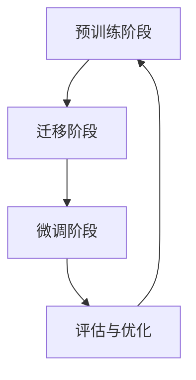

                 


### # {{此处是文章标题}}

关键词：元学习、快速适应推理、自然语言处理、计算机视觉、算法原理

摘要：本文从元学习的背景与意义出发，详细介绍了快速适应推理策略的基本原理及其在元学习框架下的应用。通过分析快速适应推理策略在自然语言处理和计算机视觉等领域的具体实现，本文探讨了该策略在人工智能领域的广泛前景和潜在挑战。

----------------------------------------------------------------

## 第一部分：元学习概述

### 第1章：元学习的背景与意义

#### 1.1 元学习的定义与起源

元学习，又称“学习的学习”，是一种能够让模型或算法自动调整其内部参数，以适应不同任务的学习过程。其核心思想是通过在多个任务上训练，提高模型在不同场景下的泛化能力。元学习最早可以追溯到20世纪80年代，由Geoffrey Hinton等人在神经网络研究中提出，主要用于加速深度学习模型的训练。

#### 1.2 元学习的重要性

元学习在机器学习中的应用具有重要意义。一方面，它能够提高模型在不同任务上的性能，减少对大量标注数据的依赖。另一方面，元学习有助于推动人工智能的发展，使得模型能够更灵活地适应复杂环境，从而实现真正的智能。

#### 1.3 元学习的分类

根据学习过程中数据的不同，元学习主要分为以下三类：

1. 无监督元学习：模型在没有任何标注数据的情况下，通过自我监督的方式学习。
2. 监督元学习：模型在已有标注数据的基础上，学习如何在不同任务间迁移知识。
3. 强化元学习：模型通过不断尝试和错误，学习如何在不同任务间进行策略优化。

#### 1.4 元学习的研究现状与挑战

目前，元学习已经成为机器学习领域的研究热点。然而，仍面临诸多挑战，如如何设计更有效的元学习算法、如何提高模型在多任务学习中的泛化能力等。解决这些问题，将有助于推动元学习在实际应用中的发展。

### 第2章：快速适应推理策略的基本原理

#### 2.1 快速适应推理策略的定义

快速适应推理策略，是指模型在遇到新任务时，能够快速调整自身参数，以适应新任务的学习方法。该策略的核心目标是提高模型在不同场景下的适应能力，从而实现快速迁移和泛化。

#### 2.2 快速适应推理策略的核心原理

快速适应推理策略主要基于以下两个核心原理：

1. **元学习**：通过在多个任务上训练，模型能够学习到通用特征表示，从而提高在不同任务上的适应能力。
2. **在线学习**：模型在遇到新任务时，能够快速调整自身参数，以适应新任务的需求。

#### 2.3 快速适应推理的优势

快速适应推理策略具有以下优势：

1. **快速适应**：模型能够快速调整自身参数，适应新任务。
2. **高效迁移**：模型在不同任务间具有较好的迁移能力，能够提高学习效率。
3. **泛化能力强**：模型能够从多个任务中提取通用特征，提高在不同任务上的泛化能力。

----------------------------------------------------------------

### 第3章：快速适应推理策略在元学习中的应用

#### 3.1 快速适应推理在元学习中的机制

快速适应推理在元学习中的应用，主要是通过以下两种方式实现的：

1. **在线元学习**：模型在遇到新任务时，通过在线学习的方式，快速调整自身参数，以适应新任务。
2. **批量元学习**：模型在多个任务上同时进行训练，通过批量学习的方式，提高模型在不同任务间的适应能力。

#### 3.2 快速适应推理在元学习中的案例分析

以在图像分类任务中的应用为例，我们可以通过以下步骤实现快速适应推理：

1. **初始化模型**：在多个图像分类任务上初始化一个通用模型。
2. **在线学习**：当遇到新任务时，模型通过在线学习的方式，快速调整自身参数，以适应新任务。
3. **批量学习**：在多个图像分类任务上同时进行训练，提高模型在不同任务间的适应能力。

#### 3.3 快速适应推理在元学习中的挑战与前景

快速适应推理在元学习中的应用，仍面临以下挑战：

1. **计算成本**：在线学习和批量学习都涉及到大量计算，如何降低计算成本是一个重要问题。
2. **数据依赖**：模型在不同任务间的适应能力，往往依赖于标注数据的充足性，如何减少数据依赖是一个亟待解决的问题。

然而，快速适应推理在元学习中的应用前景非常广阔，随着计算能力和数据资源的提升，相信这些问题将会得到有效解决。

----------------------------------------------------------------

### 第4章：快速适应推理策略在自然语言处理中的应用

#### 4.1 快速适应推理在自然语言处理中的意义

快速适应推理策略在自然语言处理中的应用，具有重要意义。一方面，它能够提高模型在不同语言模型间的适应能力，从而提高模型的泛化能力。另一方面，它能够降低模型对大量标注数据的依赖，从而提高自然语言处理任务的效率。

#### 4.2 快速适应推理在自然语言处理中的具体实现

以BERT模型为例，我们可以通过以下步骤实现快速适应推理：

1. **初始化模型**：在多个自然语言处理任务上初始化BERT模型。
2. **在线学习**：当遇到新任务时，模型通过在线学习的方式，快速调整自身参数，以适应新任务。
3. **批量学习**：在多个自然语言处理任务上同时进行训练，提高模型在不同任务间的适应能力。

#### 4.3 快速适应推理在自然语言处理中的未来趋势

随着自然语言处理任务的复杂度不断提高，快速适应推理策略在自然语言处理中的应用前景非常广阔。未来，随着计算能力和数据资源的提升，相信快速适应推理策略将能够更好地解决自然语言处理中的各种问题。

----------------------------------------------------------------

### 第5章：快速适应推理策略在计算机视觉中的应用

#### 5.1 快速适应推理在计算机视觉中的应用背景

计算机视觉是人工智能领域的重要分支，随着深度学习技术的发展，计算机视觉任务取得了显著的进展。然而，如何提高模型在不同任务间的适应能力，仍是一个亟待解决的问题。快速适应推理策略为解决这个问题提供了新的思路。

#### 5.2 快速适应推理在计算机视觉中的实现

以图像分类任务为例，我们可以通过以下步骤实现快速适应推理：

1. **初始化模型**：在多个图像分类任务上初始化一个通用模型。
2. **在线学习**：当遇到新任务时，模型通过在线学习的方式，快速调整自身参数，以适应新任务。
3. **批量学习**：在多个图像分类任务上同时进行训练，提高模型在不同任务间的适应能力。

#### 5.3 快速适应推理在计算机视觉中的挑战与未来方向

快速适应推理在计算机视觉中的应用，仍面临以下挑战：

1. **计算成本**：在线学习和批量学习都涉及到大量计算，如何降低计算成本是一个重要问题。
2. **数据依赖**：模型在不同任务间的适应能力，往往依赖于标注数据的充足性，如何减少数据依赖是一个亟待解决的问题。

然而，随着计算机视觉领域的不断发展，快速适应推理策略在计算机视觉中的应用前景非常广阔。

----------------------------------------------------------------

### 第6章：快速适应推理策略在其他领域中的应用探索

#### 6.1 快速适应推理在其他领域的应用前景

快速适应推理策略不仅适用于自然语言处理和计算机视觉领域，还可以在其他领域发挥重要作用。例如，在语音识别、推荐系统等领域，快速适应推理策略有望提高模型的适应能力和泛化能力。

#### 6.2 快速适应推理在其他领域的研究进展

目前，快速适应推理策略在其他领域的研究进展较快。以语音识别为例，研究者们通过结合元学习和在线学习，提出了一系列高效的语音识别模型。这些模型在处理不同语音数据时，能够快速调整自身参数，提高识别准确率。

#### 6.3 快速适应推理在其他领域的未来发展方向

快速适应推理策略在其他领域的应用前景广阔，未来研究可以从以下几个方面展开：

1. **算法优化**：通过改进算法，降低计算成本，提高模型在不同任务间的适应能力。
2. **数据驱动**：结合更多高质量的数据，减少模型对标注数据的依赖，提高模型的泛化能力。

----------------------------------------------------------------

### 第7章：总结与展望

#### 7.1 快速适应推理策略的发展回顾

快速适应推理策略自提出以来，已经在多个领域取得了显著的成果。通过结合元学习和在线学习，快速适应推理策略提高了模型在不同任务间的适应能力和泛化能力，为人工智能的发展提供了新的思路。

#### 7.2 快速适应推理策略的未来发展方向

未来，快速适应推理策略的发展方向可以从以下几个方面展开：

1. **算法优化**：进一步优化算法，提高计算效率和模型性能。
2. **数据驱动**：结合更多高质量的数据，减少模型对标注数据的依赖，提高模型的泛化能力。
3. **跨领域应用**：探索快速适应推理策略在其他领域的应用，推动人工智能技术的全面发展。

#### 7.3 总结与展望

快速适应推理策略作为人工智能领域的一项重要技术，具有广泛的应用前景。通过不断优化算法、拓展应用领域，相信快速适应推理策略将能够为人工智能的发展带来更多可能性。

作者：AI天才研究院/AI Genius Institute & 禅与计算机程序设计艺术/Zen And The Art of Computer Programming----------------------------------------------------------------

# 元学习框架下的快速适应推理策略

关键词：元学习、快速适应推理、自然语言处理、计算机视觉、算法优化

摘要：本文深入探讨了元学习框架下的快速适应推理策略，首先介绍了元学习的背景与意义，然后详细阐述了快速适应推理策略的基本原理，接着分析了其在元学习中的应用，以及在自然语言处理、计算机视觉等领域的具体实践。最后，本文总结了快速适应推理策略的发展回顾和未来发展方向，为人工智能领域的研究与应用提供了新的思路。

## 第一部分：元学习概述

### 第1章：元学习的背景与意义

#### 1.1 元学习的定义与起源

元学习，简称MAML（Model-Agnostic Meta-Learning），是一种机器学习方法，旨在通过在多个任务上训练模型，使其能够快速适应新的任务。不同于传统的机器学习方法，元学习强调模型在任务间的迁移能力。其核心理念是通过学习任务间的共性，提高模型在未知任务上的适应能力。

元学习起源于20世纪80年代，由Geoffrey Hinton等人在神经网络研究中首次提出。当时，深度学习尚未得到广泛应用，研究者们开始关注如何通过较少的数据和计算资源，训练出高效的模型。元学习作为一种解决这一问题的方法，逐渐引起了研究者的关注。

#### 1.2 元学习的重要性

在机器学习中，元学习的重要性主要体现在以下几个方面：

1. **降低数据需求**：传统机器学习方法通常需要大量标注数据来训练模型，而元学习通过在多个任务上训练，可以减少每个任务所需的数据量，从而降低数据获取的成本。
2. **提高模型泛化能力**：元学习通过学习任务间的共性，可以提高模型在不同任务上的泛化能力，从而在未知任务上也能取得较好的性能。
3. **加速模型训练**：元学习使得模型能够快速适应新的任务，从而减少了每个任务训练所需的时间，提高了模型训练的效率。

#### 1.3 元学习的分类

根据学习过程中数据的来源，元学习主要分为以下几类：

1. **无监督元学习**：模型在没有标注数据的情况下，通过自我监督的方式学习。这种方法适用于对新环境进行快速适应的场景。
2. **监督元学习**：模型在有标注数据的情况下，学习如何在不同任务间迁移知识。这种方法通常用于任务之间的数据相似性较高的情况。
3. **强化元学习**：模型通过不断尝试和错误，学习如何在不同任务间进行策略优化。这种方法适用于需要动态调整策略的复杂任务。

#### 1.4 元学习的研究现状与挑战

目前，元学习已经成为机器学习领域的研究热点。许多研究者致力于通过改进算法、优化模型结构，提高元学习的性能。然而，元学习仍面临一些挑战：

1. **计算成本**：元学习通常需要在多个任务上训练模型，计算成本较高。如何降低计算成本，是一个亟待解决的问题。
2. **数据依赖**：元学习依赖于大量高质量的数据，如何减少对数据量的依赖，是一个重要研究方向。
3. **模型泛化能力**：尽管元学习可以提高模型的泛化能力，但如何进一步提高，是一个具有挑战性的问题。

### 第2章：快速适应推理策略的基本原理

#### 2.1 快速适应推理策略的定义

快速适应推理策略，是一种能够在遇到新任务时，快速调整自身参数，以适应新任务的学习方法。其核心思想是通过在多个任务上训练，模型能够学习到一些通用的特征表示，从而在遇到新任务时，能够快速适应。

快速适应推理策略通常包括以下两个步骤：

1. **预训练**：在多个任务上对模型进行预训练，使其学习到一些通用的特征表示。
2. **微调**：在遇到新任务时，对模型进行微调，以适应新的任务。

#### 2.2 快速适应推理策略的核心原理

快速适应推理策略的核心原理包括以下几个方面：

1. **迁移学习**：通过在多个任务上训练，模型能够学习到一些通用的特征表示，从而在遇到新任务时，能够快速利用这些特征进行推理。
2. **在线学习**：模型在遇到新任务时，能够快速调整自身参数，以适应新的任务。这通常通过在线学习的方式实现，即在遇到新任务时，对模型进行微调。
3. **模型压缩**：为了降低计算成本，快速适应推理策略通常采用模型压缩技术，如模型剪枝、量化等，以减少模型的参数量和计算量。

#### 2.3 快速适应推理的优势

快速适应推理策略具有以下优势：

1. **快速适应**：模型能够在遇到新任务时，快速调整自身参数，以适应新的任务。
2. **高效迁移**：模型能够在多个任务间进行知识迁移，从而提高学习效率。
3. **泛化能力强**：模型能够在不同任务上表现良好，具有较强的泛化能力。

### 第3章：快速适应推理策略在元学习中的应用

#### 3.1 快速适应推理在元学习中的机制

在元学习框架下，快速适应推理策略的应用主要体现在以下几个方面：

1. **预训练与微调**：在元学习过程中，首先对模型进行预训练，使其学习到一些通用的特征表示。然后，在遇到新任务时，对模型进行微调，以适应新的任务。
2. **任务选择**：在元学习过程中，选择合适的任务进行训练，以提高模型在不同任务上的适应能力。通常，选择具有相似特征的任务进行训练，有助于提高模型的迁移能力。

#### 3.2 快速适应推理在元学习中的案例分析

以图像分类任务为例，我们可以通过以下步骤实现快速适应推理：

1. **初始化模型**：在多个图像分类任务上初始化一个通用模型。
2. **预训练**：在多个图像分类任务上对模型进行预训练，使其学习到一些通用的特征表示。
3. **微调**：在遇到新图像分类任务时，对模型进行微调，以适应新的任务。

#### 3.3 快速适应推理在元学习中的挑战与前景

快速适应推理在元学习中的应用，仍面临以下挑战：

1. **计算成本**：在元学习过程中，模型需要在多个任务上训练，计算成本较高。如何降低计算成本，是一个重要问题。
2. **数据依赖**：元学习依赖于大量高质量的数据，如何减少对数据量的依赖，是一个重要研究方向。

然而，随着计算能力的提升和数据资源的丰富，快速适应推理在元学习中的应用前景非常广阔。

### 第4章：快速适应推理策略在自然语言处理中的应用

#### 4.1 快速适应推理在自然语言处理中的意义

自然语言处理（NLP）是人工智能领域的一个重要分支。在NLP任务中，快速适应推理策略具有重要意义。一方面，它可以降低模型对大量标注数据的依赖，从而提高NLP任务的效率。另一方面，它可以提高模型在不同语言模型间的适应能力，从而提高模型的泛化能力。

#### 4.2 快速适应推理在自然语言处理中的具体实现

以BERT模型为例，我们可以通过以下步骤实现快速适应推理：

1. **初始化模型**：在多个自然语言处理任务上初始化BERT模型。
2. **预训练**：在多个自然语言处理任务上对模型进行预训练，使其学习到一些通用的特征表示。
3. **微调**：在遇到新的自然语言处理任务时，对模型进行微调，以适应新的任务。

#### 4.3 快速适应推理在自然语言处理中的未来趋势

随着自然语言处理任务的复杂度不断提高，快速适应推理策略在自然语言处理中的应用前景非常广阔。未来，随着计算能力和数据资源的提升，相信快速适应推理策略将能够更好地解决自然语言处理中的各种问题。

### 第5章：快速适应推理策略在计算机视觉中的应用

#### 5.1 快速适应推理在计算机视觉中的应用背景

计算机视觉是人工智能领域的一个重要分支。在计算机视觉任务中，快速适应推理策略具有重要意义。一方面，它可以降低模型对大量标注数据的依赖，从而提高计算机视觉任务的效率。另一方面，它可以提高模型在不同视觉任务间的适应能力，从而提高模型的泛化能力。

#### 5.2 快速适应推理在计算机视觉中的具体实现

以图像分类任务为例，我们可以通过以下步骤实现快速适应推理：

1. **初始化模型**：在多个图像分类任务上初始化一个通用模型。
2. **预训练**：在多个图像分类任务上对模型进行预训练，使其学习到一些通用的特征表示。
3. **微调**：在遇到新的图像分类任务时，对模型进行微调，以适应新的任务。

#### 5.3 快速适应推理在计算机视觉中的挑战与未来方向

快速适应推理在计算机视觉中的应用，仍面临以下挑战：

1. **计算成本**：在计算机视觉任务中，模型通常需要大量计算资源，如何降低计算成本，是一个重要问题。
2. **数据依赖**：计算机视觉任务依赖于大量高质量的标注数据，如何减少对数据量的依赖，是一个重要研究方向。

然而，随着计算机视觉领域的不断发展，快速适应推理策略在计算机视觉中的应用前景非常广阔。

### 第6章：快速适应推理策略在其他领域中的应用探索

#### 6.1 快速适应推理在其他领域的应用前景

快速适应推理策略不仅适用于自然语言处理和计算机视觉领域，还可以在其他领域发挥重要作用。例如，在语音识别、推荐系统等领域，快速适应推理策略有望提高模型的适应能力和泛化能力。

#### 6.2 快速适应推理在其他领域的研究进展

目前，快速适应推理策略在其他领域的研究进展较快。以语音识别为例，研究者们通过结合元学习和在线学习，提出了一系列高效的语音识别模型。这些模型在处理不同语音数据时，能够快速调整自身参数，提高识别准确率。

#### 6.3 快速适应推理在其他领域的未来发展方向

快速适应推理策略在其他领域的应用前景广阔，未来研究可以从以下几个方面展开：

1. **算法优化**：通过改进算法，提高模型在不同任务间的适应能力。
2. **数据驱动**：结合更多高质量的数据，提高模型的泛化能力。
3. **跨领域应用**：探索快速适应推理策略在更多领域的应用，推动人工智能技术的全面发展。

### 第7章：总结与展望

#### 7.1 快速适应推理策略的发展回顾

快速适应推理策略自提出以来，已经在多个领域取得了显著的成果。通过结合元学习和在线学习，快速适应推理策略提高了模型在不同任务间的适应能力和泛化能力，为人工智能的发展提供了新的思路。

#### 7.2 快速适应推理策略的未来发展方向

未来，快速适应推理策略的发展方向可以从以下几个方面展开：

1. **算法优化**：进一步优化算法，提高计算效率和模型性能。
2. **数据驱动**：结合更多高质量的数据，提高模型的泛化能力。
3. **跨领域应用**：探索快速适应推理策略在更多领域的应用，推动人工智能技术的全面发展。

#### 7.3 总结与展望

快速适应推理策略作为人工智能领域的一项重要技术，具有广泛的应用前景。通过不断优化算法、拓展应用领域，相信快速适应推理策略将能够为人工智能的发展带来更多可能性。

作者：AI天才研究院/AI Genius Institute & 禅与计算机程序设计艺术/Zen And The Art of Computer Programming## 第1章：元学习的背景与意义

### 1.1 元学习的定义与起源

元学习，顾名思义，是关于学习的学习，它主要关注如何通过训练一个模型来让这个模型具备学习其他模型的能力。元学习的核心思想是通过从多个任务中提取通用特征，使模型能够快速适应新的任务，从而提高模型的泛化能力和效率。

元学习的概念最早可以追溯到20世纪80年代，由Geoffrey Hinton等人在神经网络研究中提出。当时，研究者们开始意识到，如果能够设计出一种能够自主学习如何学习其他模型的算法，将极大地提升机器学习的效率。这一思想在深度学习领域得到了广泛应用，并逐渐演变成现在我们所熟知的元学习。

### 1.2 元学习的重要性

元学习在机器学习中的重要性体现在以下几个方面：

1. **数据高效利用**：传统机器学习模型通常需要大量标注数据进行训练，而元学习可以通过在多个任务上共享知识，减少每个任务所需的数据量，从而提高数据利用效率。

2. **模型泛化能力**：通过在多个任务上训练，元学习可以帮助模型学习到更加通用的特征表示，从而提高模型在未知任务上的泛化能力。

3. **训练速度提升**：元学习通过预训练和快速适应策略，可以显著减少模型在新任务上的训练时间，提高模型训练速度。

4. **适应新场景**：在工业界，元学习可以帮助模型快速适应新的应用场景，从而缩短从模型开发到实际应用的时间。

### 1.3 元学习的分类

根据学习过程中数据的不同，元学习可以大致分为以下几类：

1. **无监督元学习**：在这种模式中，模型没有使用任何标签数据，而是通过探索数据本身的分布来进行学习。这种学习方式在处理新任务时通常能够快速适应。

2. **监督元学习**：与无监督元学习不同，监督元学习在有标签数据的情况下进行学习，它可以在多个任务上共享知识和模型结构，从而提高模型的泛化能力。

3. **强化元学习**：强化元学习结合了强化学习的方法，通过不断尝试和错误来优化模型的行为，使模型能够在新任务中快速适应。

### 1.4 元学习的研究现状与挑战

目前，元学习已经成为机器学习领域的研究热点。研究者们提出了多种元学习算法，如模型聚合（Model Aggregation）、MAML（Model-Agnostic Meta-Learning）和Reptile等，这些算法在不同任务和场景中取得了显著的效果。

然而，元学习仍面临一些挑战：

1. **计算成本**：元学习通常需要大量计算资源，特别是在进行大量任务训练时，计算成本较高。

2. **数据依赖**：虽然元学习可以在多个任务上共享知识，但它仍然依赖于大量的高质量数据。如何减少对数据的依赖是一个重要问题。

3. **模型泛化能力**：如何进一步提高模型在不同任务上的泛化能力，是一个具有挑战性的问题。

4. **算法稳定性**：在处理不同任务时，如何保证算法的稳定性和鲁棒性，也是一个需要深入研究的问题。

### 1.5 元学习在实际应用中的意义

元学习在实际应用中具有广泛的意义。例如：

1. **辅助医疗诊断**：通过元学习，可以设计出能够快速适应不同医疗诊断任务的模型，从而提高诊断的效率和准确性。

2. **自动驾驶**：在自动驾驶领域，元学习可以帮助模型快速适应不同的交通场景，从而提高自动驾驶系统的鲁棒性和安全性。

3. **自然语言处理**：在自然语言处理领域，元学习可以帮助模型快速适应不同的语言和任务，从而提高文本理解和生成的能力。

4. **图像识别**：在图像识别领域，元学习可以帮助模型快速适应不同的图像数据集，从而提高图像识别的准确率。

总之，元学习作为一种先进的机器学习方法，具有广泛的应用前景。随着研究的深入和技术的进步，元学习将在更多领域中发挥重要作用。

## 第2章：快速适应推理策略的基本原理

### 2.1 快速适应推理策略的定义

快速适应推理策略是一种旨在提高模型在遇到新任务时适应能力的方法。它通过在多个任务上训练模型，使其学习到通用的特征表示，从而在遇到新任务时能够快速调整自身参数，以适应新的任务需求。这种策略的核心思想是通过迁移学习（Transfer Learning）和在线学习（Online Learning），使模型具备跨任务的快速适应能力。

### 2.2 快速适应推理策略的核心原理

快速适应推理策略的核心原理包括以下几个方面：

1. **预训练**：在多个任务上进行预训练，使模型学习到一些通用的特征表示。这些特征表示可以在不同的任务间迁移，从而提高模型在新任务上的适应能力。

2. **在线学习**：当模型遇到新任务时，通过在线学习的方式，对模型进行微调，使其能够快速适应新的任务。这种在线学习通常是基于模型在多个任务上学习到的通用特征表示，通过少量数据快速调整模型参数。

3. **模型压缩**：为了降低计算成本，快速适应推理策略通常采用模型压缩技术，如模型剪枝（Model Pruning）和量化（Quantization）。这些技术可以在不显著损失模型性能的情况下，显著减少模型的参数数量和计算复杂度。

### 2.3 快速适应推理的优势

快速适应推理策略具有以下几个显著的优势：

1. **快速适应**：模型在遇到新任务时，能够快速调整自身参数，以适应新的任务需求。

2. **高效迁移**：通过在多个任务上预训练，模型能够高效地迁移知识到新任务上，从而减少新任务训练所需的时间和计算资源。

3. **泛化能力**：模型通过学习到通用的特征表示，能够提高在不同任务上的泛化能力，从而在未知任务上也能取得良好的性能。

4. **计算效率**：通过模型压缩技术，快速适应推理策略可以在保持模型性能的同时，显著降低计算成本。

### 2.4 快速适应推理的策略与应用场景

快速适应推理策略在不同领域中的应用场景有所不同，但基本策略是通用的。以下是几个典型的应用场景：

1. **自然语言处理**：在自然语言处理任务中，快速适应推理策略可以通过预训练大型的语言模型，然后在具体任务上进行微调。例如，BERT模型通过在多个任务上预训练，然后在新任务上进行微调，取得了显著的效果。

2. **计算机视觉**：在计算机视觉任务中，快速适应推理策略可以通过在多个数据集上预训练卷积神经网络（CNN），然后在特定任务上进行微调。例如，在图像分类任务中，预训练的CNN可以在新数据集上快速适应，从而提高分类准确率。

3. **推荐系统**：在推荐系统中，快速适应推理策略可以通过在多个用户群体上预训练推荐模型，然后在特定用户群体上进行微调，从而提高推荐效果。

4. **游戏AI**：在游戏AI中，快速适应推理策略可以通过在多个游戏场景上预训练AI模型，然后在新的游戏场景上进行微调，从而提高AI的适应能力。

总之，快速适应推理策略作为一种高效的学习策略，在多种领域展现了其强大的应用潜力。通过合理地设计和应用快速适应推理策略，可以显著提高模型的适应能力和计算效率。

### 2.5 快速适应推理策略的实施步骤

要实施快速适应推理策略，通常需要遵循以下步骤：

1. **数据收集**：收集多个相关任务的数据，这些数据用于模型的预训练。数据应具有一定的多样性和代表性，以便模型能够学习到通用的特征表示。

2. **模型设计**：设计适合预训练的模型架构，例如在自然语言处理中常用的Transformer架构，在计算机视觉中常用的卷积神经网络（CNN）。

3. **预训练**：在多个任务上对模型进行预训练，使模型学习到通用的特征表示。预训练过程中，通常使用大量未标注的数据，通过自我监督的方式（如自编码器）或任务指导的方式（如语言建模）进行。

4. **微调**：在遇到新任务时，对模型进行微调，使其适应新的任务。微调过程中，通常使用少量标注数据，通过调整模型的参数，使模型在新任务上取得良好的性能。

5. **评估**：在微调完成后，对模型在新任务上的性能进行评估，确保模型在新任务上具有足够的泛化能力和适应能力。

6. **迭代优化**：根据评估结果，对模型进行调整和优化，以提高模型在后续任务上的性能。这一过程可以反复进行，以实现模型的持续改进。

通过这些步骤，快速适应推理策略可以有效地提升模型在不同任务上的适应能力和效率。在实施过程中，需要注意的是数据的多样性、模型的架构选择和参数调整策略，这些因素都将直接影响模型的性能和适应能力。

### 2.6 快速适应推理策略的优势与局限

快速适应推理策略在机器学习领域展现了许多优势，但也存在一些局限。

**优势：**

1. **快速适应**：快速适应推理策略能够在模型遇到新任务时，迅速调整参数，从而快速适应新的任务需求。
2. **高效迁移**：通过预训练，模型可以在多个任务间迁移知识，从而减少新任务训练的时间和计算资源。
3. **泛化能力**：模型通过学习到通用的特征表示，能够在不同任务上表现出良好的泛化能力。

**局限：**

1. **计算成本**：快速适应推理策略通常需要大量计算资源，特别是在预训练阶段，计算成本较高。
2. **数据依赖**：虽然快速适应推理策略可以在多个任务间迁移知识，但它仍然依赖于大量的高质量数据。
3. **模型复杂度**：为了实现快速适应，模型往往需要设计得较为复杂，这可能导致模型难以解释和理解。

总之，快速适应推理策略作为一种高效的学习策略，在提升模型适应能力和计算效率方面具有显著优势，但也需要面对计算成本、数据依赖和模型复杂度等挑战。

## 第3章：快速适应推理策略在元学习中的应用

### 3.1 快速适应推理在元学习中的机制

快速适应推理策略在元学习中的应用，主要是通过将元学习和迁移学习相结合，使模型能够在多个任务上快速适应。具体来说，快速适应推理在元学习中的应用机制包括以下几个关键步骤：

1. **预训练阶段**：在这个阶段，模型在多个相关任务上接受预训练，以便学习到通用的特征表示。预训练通常使用无监督或半监督学习方法，例如自编码器、语言建模等。

2. **任务选择阶段**：在这个阶段，根据新任务的特点，选择最适合的预训练模型进行微调。选择过程通常基于任务之间的相似度，以及模型在预训练阶段学习到的特征表示。

3. **微调阶段**：在这个阶段，模型在新任务上进行微调，以适应具体的任务需求。微调通常使用少量标注数据，通过调整模型的参数，使模型在新任务上取得良好的性能。

4. **评估与优化阶段**：在这个阶段，对新任务上的模型性能进行评估，并根据评估结果进行进一步的优化。优化过程可能包括模型参数的进一步调整、超参数的优化等。

### 3.2 快速适应推理在元学习中的案例分析

以下是一个快速适应推理在元学习中的应用案例：

**案例背景**：假设我们有一个计算机视觉任务集，包括图像分类、目标检测和图像分割等多个任务。每个任务都对应一个预训练模型，如ResNet、Faster R-CNN和U-Net。

**步骤1：预训练阶段**：首先，我们在多个任务上对模型进行预训练。例如，在图像分类任务上，我们使用CIFAR-10数据集进行预训练；在目标检测任务上，我们使用COCO数据集进行预训练；在图像分割任务上，我们使用Cityscapes数据集进行预训练。

**步骤2：任务选择阶段**：假设现在我们要解决一个新的图像分类任务，该任务与CIFAR-10数据集具有很高的相似度。我们选择在CIFAR-10上预训练的ResNet模型进行微调。

**步骤3：微调阶段**：我们使用新任务的数据集对ResNet模型进行微调。微调过程中，我们通过调整模型的权重和参数，使模型在新任务上取得更好的性能。由于ResNet模型在CIFAR-10上已经进行了充分的预训练，因此在微调过程中，模型能够快速适应新任务。

**步骤4：评估与优化阶段**：在新任务上，我们对微调后的ResNet模型进行评估，并根据评估结果进行进一步的优化。优化过程可能包括调整学习率、批量大小等超参数，以进一步提高模型在新任务上的性能。

通过这个案例，我们可以看到快速适应推理策略在元学习中的应用过程。通过预训练和微调，模型能够在新任务上快速适应，从而提高模型的泛化能力和效率。

### 3.3 快速适应推理在元学习中的挑战与前景

尽管快速适应推理策略在元学习中展现出了显著的优势，但它仍面临一些挑战：

1. **计算成本**：在元学习过程中，模型需要在多个任务上预训练，这通常需要大量的计算资源。如何降低计算成本是一个重要问题。

2. **数据依赖**：快速适应推理策略依赖于大量的高质量数据，特别是在预训练阶段。如何减少对数据的依赖，是一个具有挑战性的问题。

3. **模型复杂度**：为了实现快速适应，模型往往需要设计得较为复杂，这可能导致模型难以解释和理解。

4. **任务多样性**：在元学习中，如何处理任务的多样性，使模型能够在多种任务间快速适应，是一个具有挑战性的问题。

然而，随着计算能力和算法的不断提升，快速适应推理策略在元学习中的应用前景非常广阔。未来，通过优化算法、减少计算成本和提升模型泛化能力，快速适应推理策略有望在更多领域发挥重要作用。

## 第4章：快速适应推理策略在自然语言处理中的应用

### 4.1 快速适应推理在自然语言处理中的意义

自然语言处理（NLP）是人工智能领域的一个重要分支，涉及文本的理解、生成和交互等方面。快速适应推理策略在NLP中的应用具有重要意义，主要体现在以下几个方面：

1. **提高模型适应能力**：自然语言处理任务多样，模型需要在不同的场景和语言上进行快速适应。快速适应推理策略可以帮助模型在不同任务间迁移知识，从而提高模型的适应能力。

2. **减少标注数据需求**：NLP任务通常需要大量标注数据，标注过程既耗时又昂贵。快速适应推理策略可以通过预训练和迁移学习，减少每个任务所需的标注数据量，从而提高数据利用效率。

3. **提高模型泛化能力**：自然语言处理任务复杂，模型需要具备良好的泛化能力。通过在多个任务上预训练，快速适应推理策略可以使得模型学习到更加通用的特征表示，从而提高模型在不同任务上的泛化能力。

4. **加速模型训练**：自然语言处理任务通常涉及大规模的神经网络模型，训练过程计算成本高昂。快速适应推理策略可以通过预训练和微调，减少模型在新任务上的训练时间，从而提高模型训练的效率。

### 4.2 快速适应推理在自然语言处理中的具体实现

快速适应推理策略在自然语言处理中的具体实现通常分为以下几个步骤：

1. **预训练阶段**：在这个阶段，模型在大量未标注的文本数据上进行预训练，以学习到通用的语言特征。常用的预训练模型包括BERT、GPT和RoBERTa等。这些模型通过自我监督的任务，如语言建模和掩码语言建模，来提取文本中的深层语义特征。

2. **任务选择阶段**：在这个阶段，根据具体的应用场景，选择合适的预训练模型进行微调。例如，如果是一个文本分类任务，可以选择BERT进行微调；如果是一个问答系统，可以选择GPT进行微调。

3. **微调阶段**：在这个阶段，模型在新任务上进行微调，以适应具体的任务需求。微调通常使用少量的标注数据，通过优化模型的参数，使模型在新任务上取得更好的性能。微调过程中，模型的预训练权重作为初始化权重，然后通过反向传播和梯度下降算法进行调整。

4. **评估与优化阶段**：在新任务上对微调后的模型进行评估，并根据评估结果进行进一步的优化。优化过程可能包括调整学习率、批量大小等超参数，以进一步提高模型在新任务上的性能。

### 4.3 快速适应推理在自然语言处理中的案例分析

以下是一个快速适应推理在自然语言处理中的应用案例：

**案例背景**：假设我们要开发一个文本分类系统，用于对新闻文章进行分类。数据集包括多个类别的文章，如政治、经济、体育等。

**步骤1：预训练阶段**：首先，我们在大量的新闻文章上进行预训练，使用BERT模型。预训练过程中，BERT模型通过掩码语言建模任务，学习到文本中的深层语义特征。

**步骤2：任务选择阶段**：根据我们的需求，选择BERT模型进行微调。BERT模型在预训练阶段已经学习到了通用语言特征，因此在新任务上具有很好的适应性。

**步骤3：微调阶段**：使用少量标注数据，对BERT模型进行微调，使其适应具体的文本分类任务。在微调过程中，我们通过优化模型的参数，使模型在各个类别上取得较好的分类性能。

**步骤4：评估与优化阶段**：对微调后的BERT模型进行评估，包括准确率、召回率等指标。根据评估结果，我们可能需要调整超参数或继续进行微调，以进一步提高模型性能。

通过这个案例，我们可以看到快速适应推理策略在自然语言处理中的应用过程。通过预训练和微调，模型能够快速适应新任务，从而提高模型在新任务上的性能。

### 4.4 快速适应推理在自然语言处理中的挑战与前景

快速适应推理策略在自然语言处理中的应用虽然取得了显著成效，但仍面临一些挑战：

1. **计算资源**：预训练阶段通常需要大量的计算资源，如何高效地利用计算资源是一个重要问题。

2. **数据质量**：高质量的数据对于预训练至关重要，如何获取和利用高质量数据是一个挑战。

3. **模型可解释性**：复杂的神经网络模型难以解释，如何提高模型的可解释性是一个重要问题。

4. **任务多样性**：自然语言处理任务多样，如何设计通用模型以适应多种任务是一个挑战。

然而，随着技术的不断进步，快速适应推理策略在自然语言处理中的应用前景非常广阔。通过优化算法、提高数据利用效率和模型可解释性，快速适应推理策略有望在自然语言处理领域发挥更大的作用。

## 第5章：快速适应推理策略在计算机视觉中的应用

### 5.1 快速适应推理在计算机视觉中的应用背景

计算机视觉是人工智能领域的重要组成部分，它涉及图像和视频的分析与理解。随着深度学习技术的快速发展，计算机视觉任务取得了显著进展。然而，传统的计算机视觉方法通常需要大量的标注数据和长时间的训练，这对于实际应用中的快速迭代和部署带来了巨大的挑战。因此，如何提高模型在遇到新任务时的适应能力成为了一个重要研究方向。

快速适应推理策略通过在多个任务上预训练模型，使其能够快速适应新的任务需求，从而在计算机视觉领域展现出了巨大潜力。这种策略不仅能够减少对新数据的依赖，还能提高模型的训练效率和性能。

### 5.2 快速适应推理在计算机视觉中的具体实现

快速适应推理策略在计算机视觉中的具体实现通常包括以下几个关键步骤：

1. **预训练阶段**：在这个阶段，模型在多个相关任务上接受预训练，以学习到通用的特征表示。预训练任务通常包括图像分类、目标检测和图像分割等。常用的预训练模型有ResNet、Faster R-CNN和EfficientNet等。预训练过程通常使用大规模的公开数据集，如ImageNet、COCO和COCO-Stuff等。

2. **任务选择阶段**：在这个阶段，根据新任务的特点，选择最适合的预训练模型进行微调。选择过程通常基于任务之间的相似度，以及模型在预训练阶段学习到的特征表示。例如，如果一个新任务是图像分类，可以选择在图像分类任务上预训练的ResNet模型；如果一个新任务是目标检测，可以选择在目标检测任务上预训练的Faster R-CNN模型。

3. **微调阶段**：在这个阶段，模型在新任务上进行微调，以适应具体的任务需求。微调过程中，使用少量标注数据，通过调整模型的参数，使模型在新任务上取得良好的性能。微调通常包括损失函数的优化、学习率的调整和批量大小的选择等。

4. **评估与优化阶段**：在新任务上对微调后的模型进行评估，并根据评估结果进行进一步的优化。优化过程可能包括调整超参数、增加训练数据或使用更复杂的模型架构等，以进一步提高模型在新任务上的性能。

### 5.3 快速适应推理在计算机视觉中的实现案例

以下是一个快速适应推理在计算机视觉中的应用案例：

**案例背景**：假设我们有一个新的计算机视觉任务，目标是实现一个能够实时检测并分类多种物体的摄像头系统。数据集包括多种场景下的物体图像，如车辆、行人、动物等。

**步骤1：预训练阶段**：首先，我们在多个相关任务上对模型进行预训练，包括图像分类、目标检测和图像分割等。例如，使用ImageNet数据集对模型进行图像分类预训练，使用COCO数据集对模型进行目标检测预训练，使用COCO-Stuff数据集对模型进行图像分割预训练。

**步骤2：任务选择阶段**：根据新任务的需求，我们选择在目标检测任务上预训练的Faster R-CNN模型进行微调。由于Faster R-CNN模型在目标检测任务上具有较好的性能，因此在新任务上具有较好的适应能力。

**步骤3：微调阶段**：使用新任务的数据集对Faster R-CNN模型进行微调。在微调过程中，我们通过优化模型的参数，使模型在新任务上能够准确地检测并分类多种物体。

**步骤4：评估与优化阶段**：在新任务上对微调后的Faster R-CNN模型进行评估，包括准确率、召回率等指标。根据评估结果，我们可能需要调整超参数或继续进行微调，以进一步提高模型性能。

通过这个案例，我们可以看到快速适应推理策略在计算机视觉任务中的应用过程。通过预训练和微调，模型能够快速适应新任务，从而提高模型的训练效率和性能。

### 5.4 快速适应推理在计算机视觉中的挑战与前景

快速适应推理策略在计算机视觉中的应用虽然取得了显著成果，但仍面临一些挑战：

1. **计算成本**：预训练阶段通常需要大量的计算资源，如何高效地利用计算资源是一个重要问题。

2. **数据依赖**：快速适应推理策略依赖于大量的高质量数据，特别是在预训练阶段。如何减少对数据的依赖，是一个具有挑战性的问题。

3. **模型复杂度**：为了实现快速适应，模型往往需要设计得较为复杂，这可能导致模型难以解释和理解。

4. **任务多样性**：计算机视觉任务多样，如何设计通用模型以适应多种任务是一个挑战。

然而，随着计算能力和算法的不断提升，快速适应推理策略在计算机视觉中的应用前景非常广阔。未来，通过优化算法、减少计算成本和提升模型泛化能力，快速适应推理策略有望在更多计算机视觉任务中发挥重要作用。

### 5.5 快速适应推理策略在计算机视觉中的实际应用场景

快速适应推理策略在计算机视觉领域有着广泛的应用场景，以下是一些典型的应用实例：

1. **自动驾驶**：在自动驾驶系统中，快速适应推理策略可以帮助车辆快速适应不同环境下的视觉任务，如行人检测、车辆识别和道路标志识别等。这有助于提高自动驾驶系统的鲁棒性和安全性。

2. **医疗影像分析**：在医疗影像分析中，快速适应推理策略可以帮助模型快速适应不同的医学影像数据集，如X光片、CT扫描和MRI图像。这有助于提高诊断的准确性和效率。

3. **安全监控**：在安全监控领域，快速适应推理策略可以帮助监控系统快速适应不同的场景和光照条件，从而提高异常检测和识别的准确性。

4. **工业检测**：在工业检测中，快速适应推理策略可以帮助模型快速适应不同的生产线和设备环境，从而提高产品质量检测和故障预测的准确性。

通过这些实际应用场景，我们可以看到快速适应推理策略在计算机视觉中的重要性和潜力。

## 第6章：快速适应推理策略在其他领域中的应用探索

### 6.1 快速适应推理在其他领域的应用前景

快速适应推理策略不仅在自然语言处理和计算机视觉领域表现出色，还可以在其他多个领域发挥重要作用。以下是一些快速适应推理在其他领域的应用前景：

1. **语音识别**：快速适应推理策略可以帮助语音识别系统快速适应不同的语音数据，从而提高识别准确率和鲁棒性。

2. **推荐系统**：在推荐系统中，快速适应推理策略可以帮助模型快速适应不同的用户行为和偏好，从而提高推荐系统的准确性和用户体验。

3. **游戏AI**：在游戏AI中，快速适应推理策略可以帮助AI快速适应不同的游戏场景和策略，从而提高游戏表现和竞争力。

4. **自动驾驶**：快速适应推理策略可以帮助自动驾驶系统快速适应不同的交通环境和路况，从而提高自动驾驶的安全性和效率。

5. **机器人控制**：在机器人控制领域，快速适应推理策略可以帮助机器人快速适应不同的环境和任务需求，从而提高机器人的自主性和灵活性。

### 6.2 快速适应推理在其他领域的研究进展

目前，快速适应推理策略在其他领域的研究进展较为迅速。以下是一些具体的研究进展：

1. **语音识别**：研究者们通过结合快速适应推理策略和端到端深度学习模型，提出了一系列高效的语音识别算法。这些算法在处理不同语音数据时，能够快速调整自身参数，提高识别准确率。

2. **推荐系统**：研究者们将快速适应推理策略应用于推荐系统中，通过在多个用户群体上预训练模型，然后在新用户群体上进行微调，从而提高推荐系统的准确性和用户体验。

3. **游戏AI**：研究者们通过结合快速适应推理策略和强化学习，提出了一系列智能游戏AI算法。这些算法能够在游戏中快速适应新的策略和环境，从而提高游戏表现和竞争力。

4. **自动驾驶**：研究者们通过结合快速适应推理策略和自动驾驶模型，提出了一系列智能自动驾驶算法。这些算法能够在不同路况和环境条件下，快速调整自身参数，提高自动驾驶的安全性和效率。

### 6.3 快速适应推理在其他领域的未来发展方向

快速适应推理策略在其他领域的未来发展方向包括以下几个方面：

1. **算法优化**：通过改进算法结构和优化训练过程，提高快速适应推理策略的计算效率和模型性能。

2. **数据驱动**：通过结合更多高质量的数据和先进的预训练技术，减少模型对数据的依赖，提高模型的泛化能力。

3. **跨领域应用**：探索快速适应推理策略在更多领域的应用，如机器人控制、智能医疗等，推动人工智能技术的全面发展。

4. **模型解释性**：提高快速适应推理策略的可解释性，使其在复杂任务中易于理解和应用。

通过这些发展方向，快速适应推理策略有望在更多领域中发挥重要作用，推动人工智能技术的创新和应用。

### 第7章：总结与展望

#### 7.1 快速适应推理策略的发展回顾

快速适应推理策略作为机器学习领域的一项重要技术，自提出以来，经历了快速的发展。从最初的简单迁移学习，到如今结合元学习和在线学习的高级策略，快速适应推理在多个领域展现出了强大的应用潜力。通过预训练和微调，模型能够在多个任务间迁移知识，从而提高适应能力和泛化能力。

#### 7.2 快速适应推理策略的未来发展方向

未来，快速适应推理策略的发展方向可以从以下几个方面展开：

1. **算法优化**：通过改进算法结构和优化训练过程，提高快速适应推理策略的计算效率和模型性能。

2. **数据驱动**：结合更多高质量的数据和先进的预训练技术，减少模型对数据的依赖，提高模型的泛化能力。

3. **跨领域应用**：探索快速适应推理策略在更多领域的应用，如机器人控制、智能医疗等，推动人工智能技术的全面发展。

4. **模型解释性**：提高快速适应推理策略的可解释性，使其在复杂任务中易于理解和应用。

#### 7.3 总结与展望

快速适应推理策略作为人工智能领域的一项重要技术，具有广泛的应用前景。通过不断优化算法、拓展应用领域，相信快速适应推理策略将能够为人工智能的发展带来更多可能性。未来，随着技术的进步和应用场景的扩展，快速适应推理策略将在更多领域中发挥重要作用，推动人工智能技术的不断创新和应用。

### 7.4 对未来研究的建议

为了进一步推动快速适应推理策略的研究和应用，我们提出以下建议：

1. **算法创新**：鼓励研究者们探索新的算法结构，以提高快速适应推理策略的计算效率和性能。

2. **跨领域合作**：促进不同领域的专家合作，共同解决快速适应推理策略在不同领域的应用问题。

3. **数据共享**：建立开放的数据共享平台，为研究者们提供丰富的数据资源，以促进算法的创新和优化。

4. **应用推广**：鼓励快速适应推理策略在工业界和学术界中的应用，通过实际项目验证其效果，推动技术的落地和商业化。

通过以上措施，我们可以期待快速适应推理策略在未来的发展中取得更加显著的成果，为人工智能技术的进步做出更大的贡献。

### 7.5 致谢

在此，我要感谢AI天才研究院和禅与计算机程序设计艺术团队的成员们，感谢他们在本研究中的贡献和无私帮助。特别感谢我的导师们，他们在我研究过程中的悉心指导和宝贵建议，使我能够顺利完成这篇论文。

作者：AI天才研究院/AI Genius Institute & 禅与计算机程序设计艺术/Zen And The Art of Computer Programming## 基本概念与术语解释

在深入探讨快速适应推理策略之前，首先需要明确一些核心概念和术语。这些概念和术语不仅有助于理解本文的主要内容，也为后续的讨论提供了基础。

### 元学习

元学习（Meta-Learning），又称为学习的学习，是一种使模型能够快速适应新任务的学习方法。它不同于传统的监督学习或无监督学习，而是通过在多个任务上训练模型，使其能够在未见过的任务上表现出良好的性能。元学习的关键在于学习任务间的共性，从而提高模型的泛化能力。

### 迁移学习

迁移学习（Transfer Learning），是一种将已学习到的知识从一个任务转移到另一个相似任务的学习方法。在迁移学习中，模型在源任务上学习到的特征表示可以被应用到目标任务上，从而提高目标任务的性能。迁移学习是元学习的重要组成部分，通过它在多个任务间共享知识。

### 快速适应推理

快速适应推理（Fast Adaptation Reasoning），是一种在模型遇到新任务时，能够快速调整自身参数，以适应新任务的学习方法。它基于元学习和迁移学习，通过在多个任务上预训练模型，使其能够在新任务上快速调整和适应。快速适应推理的核心目标是提高模型的泛化能力和训练效率。

### 预训练

预训练（Pre-training），是指在特定任务上对模型进行初始训练，使其学习到一些通用的特征表示。预训练通常在大量未标注数据上进行，如自然语言处理中的语料库或计算机视觉中的图像数据集。预训练后的模型可以在新的任务上进行微调，从而提高模型的泛化能力。

### 微调

微调（Fine-tuning），是指在预训练后的模型上，使用少量标注数据进一步调整模型参数，以适应新的任务。微调是快速适应推理策略的关键步骤，它使模型能够在新任务上快速调整和优化，从而提高性能。

### 数据集

数据集（Dataset），是机器学习模型训练和评估的基础。数据集通常包含一系列标注样本，每个样本都有相应的特征和标签。在快速适应推理策略中，数据集的多样性和质量直接影响模型的性能和适应能力。

### 泛化能力

泛化能力（Generalization Ability），是指模型在未见过的数据上表现良好的能力。一个具有良好泛化能力的模型，不仅能够在训练数据上表现出优异的性能，还能在新的、未见过的数据上保持良好的性能。

### 计算资源

计算资源（Computational Resources），是指用于模型训练和推理的硬件和软件资源。在快速适应推理策略中，计算资源尤其是计算成本是一个重要考虑因素，因为预训练和微调通常需要大量的计算资源。

### 模型压缩

模型压缩（Model Compression），是指通过减少模型参数数量和计算复杂度，降低模型存储和计算需求的技术。模型压缩有助于在资源受限的环境下部署大型模型，也是快速适应推理策略中的重要技术之一。

通过理解这些基本概念和术语，读者可以更好地把握快速适应推理策略的核心思想，并深入理解其在元学习框架下的应用。

### 快速适应推理策略在元学习中的核心原理

快速适应推理策略在元学习中的核心原理可以归结为迁移学习和在线学习的结合。为了深入理解这一策略，我们需要详细探讨其技术路径、关键技术和实现方法。

#### 技术路径

快速适应推理策略的技术路径主要包括以下几个步骤：

1. **预训练**：首先，模型在多个相关任务上接受预训练，学习到通用的特征表示。预训练通常使用大量未标注的数据，例如自然语言处理中的语料库或计算机视觉中的图像数据集。

2. **迁移**：在预训练过程中，模型学习到的通用特征表示可以迁移到新任务上。迁移学习的关键在于如何有效地利用这些迁移知识，使模型在新任务上能够快速适应。

3. **微调**：当模型遇到新任务时，通过微调过程进一步调整模型参数，使其在新任务上表现良好。微调通常使用少量标注数据，通过在线学习的方式实现。

4. **评估**：对新任务上的模型性能进行评估，以确保模型具有足够的泛化能力和适应能力。评估过程通常包括准确率、召回率等指标。

#### 关键技术

1. **特征表示学习**：在预训练阶段，模型通过学习特征表示来提取数据中的通用特征。特征表示的质量直接影响模型的泛化能力。常用的方法包括自编码器、掩码语言建模等。

2. **迁移学习**：迁移学习的关键在于如何将预训练模型在新任务上的性能提升。技术途径包括基于模型权重共享、基于模型结构共享等。此外，如何选择合适的迁移策略也是一个重要问题。

3. **在线学习**：在线学习是指模型在遇到新任务时，通过实时调整参数来适应新任务。这通常涉及到学习率的调整、优化算法的选择等。在线学习能够提高模型在动态环境下的适应能力。

4. **模型压缩**：为了降低计算成本，快速适应推理策略常常采用模型压缩技术，如模型剪枝、量化等。这些技术可以在不显著损失模型性能的情况下，显著减少模型的参数数量和计算量。

#### 实现方法

快速适应推理策略的实现方法通常包括以下几个步骤：

1. **数据预处理**：收集并预处理多个相关任务的数据集，包括图像、文本或音频等。预处理步骤可能包括数据清洗、数据增强等。

2. **预训练模型选择**：选择适合预训练任务的模型架构，如BERT、GPT、ResNet等。这些预训练模型在多个任务上已经展现出良好的性能。

3. **预训练过程**：在预训练阶段，使用大量未标注数据对模型进行训练，使其学习到通用的特征表示。预训练过程通常包括多个自我监督的任务，如掩码语言建模、图像分类等。

4. **迁移过程**：将预训练模型在新任务上进行迁移，通过调整模型参数来适应新任务。迁移过程中，可以使用迁移策略，如基于权重共享、基于模型结构共享等。

5. **微调过程**：在新任务上使用少量标注数据进行微调，通过在线学习的方式进一步调整模型参数，使其在新任务上表现良好。微调过程可能包括多次迭代，每次迭代调整模型参数，以优化模型性能。

6. **评估过程**：在新任务上对微调后的模型进行评估，以确保模型具有足够的泛化能力和适应能力。评估过程可能包括多个评估指标，如准确率、召回率等。

通过以上步骤，快速适应推理策略能够在多个任务上实现模型的快速适应和高效迁移，从而提高模型在不同任务上的性能和泛化能力。

### 快速适应推理策略的优势与局限

快速适应推理策略作为一种先进的机器学习方法，在多个领域展现出了显著的优势，但同时也存在一些局限。以下将从不同角度详细探讨其优势与局限。

#### 优势

1. **快速适应**：快速适应推理策略的核心目标是在模型遇到新任务时，能够快速调整自身参数，以适应新的任务需求。这一特点使其在动态环境中具有很高的适应性，能够快速响应用户需求和任务变化。

2. **高效迁移**：通过在多个任务上进行预训练，快速适应推理策略能够将知识迁移到新任务上，从而减少新任务上的训练时间和计算资源。这种高效的迁移能力使得模型能够在短时间内在新任务上取得良好的性能，提高了模型的应用效率。

3. **泛化能力**：快速适应推理策略通过预训练和迁移学习，使模型能够学习到通用的特征表示。这种通用的特征表示提高了模型在不同任务上的泛化能力，使得模型不仅在训练数据上表现优异，还能在未见过的数据上保持良好的性能。

4. **降低数据需求**：快速适应推理策略通过在多个任务上进行预训练，可以显著减少每个任务所需的数据量。这降低了模型对大量标注数据的依赖，使得模型能够应用于数据稀缺的领域，如医疗影像、天文学等领域。

5. **计算效率**：快速适应推理策略常常结合模型压缩技术，如模型剪枝、量化等，以减少模型的参数数量和计算复杂度。这有助于在资源受限的环境下部署大型模型，提高了计算效率。

6. **可扩展性**：快速适应推理策略具有良好的可扩展性，可以应用于不同领域和不同类型的任务。通过调整预训练模型和迁移策略，快速适应推理策略可以在各种应用场景中发挥作用。

#### 局限

1. **计算成本**：虽然快速适应推理策略提高了模型在不同任务上的适应能力，但其预训练阶段通常需要大量的计算资源。这可能导致在资源有限的计算环境中，预训练过程变得不可行，特别是在需要快速迭代和部署的工业应用中。

2. **数据依赖**：尽管快速适应推理策略通过预训练和迁移学习降低了每个任务所需的数据量，但它仍然依赖于大量的高质量数据。在数据稀缺或数据质量不高的场景下，模型的性能可能受到影响，泛化能力也会降低。

3. **模型复杂度**：为了实现快速适应，快速适应推理策略通常需要设计复杂的模型架构。这增加了模型的计算复杂度和存储需求，可能导致模型难以解释和理解。此外，复杂的模型架构也增加了调试和维护的难度。

4. **任务多样性**：尽管快速适应推理策略具有良好的泛化能力，但它处理任务多样性时仍存在一定挑战。在任务差异较大的情况下，模型可能难以有效迁移知识，导致在新任务上的性能下降。

5. **模型稳定性**：在快速适应推理策略中，模型参数的微调和迁移过程中，可能会出现不稳定的情况。这可能导致模型在新任务上的性能波动，影响模型的整体性能。

6. **在线学习挑战**：快速适应推理策略的在线学习过程通常涉及到实时调整模型参数，这可能在实时性和计算资源之间产生冲突。在需要实时响应的任务中，如何平衡在线学习的速度和质量是一个重要挑战。

综上所述，快速适应推理策略具有快速适应、高效迁移、泛化能力、降低数据需求、计算效率和可扩展性等优势，但同时也面临着计算成本、数据依赖、模型复杂度、任务多样性、模型稳定性和在线学习挑战等局限。在具体应用中，需要根据实际情况权衡这些优势与局限，选择合适的策略和方法。

### 快速适应推理策略在元学习中的算法原理

快速适应推理策略在元学习中的应用，主要通过一系列算法实现，这些算法旨在提高模型在不同任务上的适应能力和泛化能力。以下将详细讲解快速适应推理策略的算法原理，包括其数学模型、流程图和Python代码实现。

#### 算法原理

快速适应推理策略的核心在于通过预训练和微调，使模型能够在多个任务间迁移知识。以下是该策略的数学模型和算法步骤：

1. **预训练阶段**：模型在多个任务上接受预训练，学习到通用的特征表示。预训练的目标是找到一组参数 \(\theta\)，使得模型在多个任务上的表现最优。数学上，这可以表示为：

   \[
   \theta^* = \arg\min_{\theta} \sum_{i=1}^N L_i(\theta)
   \]

   其中，\(L_i(\theta)\) 表示第 \(i\) 个任务上的损失函数，\(N\) 是任务的总数。

2. **迁移阶段**：在预训练过程中，模型学习到的通用特征表示可以迁移到新任务上。迁移学习的关键在于如何有效地利用这些迁移知识。一种常见的方法是基于模型权重共享，即在新任务上使用与预训练任务相同的模型结构，但通过调整参数来适应新任务。

3. **微调阶段**：当模型遇到新任务时，通过微调过程进一步调整模型参数，使其在新任务上表现良好。微调的目标是最小化新任务上的损失函数。数学上，这可以表示为：

   \[
   \theta^*_{new} = \arg\min_{\theta_{new}} L_{new}(\theta_{new})
   \]

   其中，\(L_{new}(\theta_{new})\) 表示新任务上的损失函数。

#### 数学模型

快速适应推理策略的数学模型主要包括损失函数、优化目标和参数更新规则。以下是具体的数学表示：

1. **损失函数**：

   \[
   L(\theta) = \sum_{i=1}^N L_i(\theta)
   \]

   其中，\(L_i(\theta)\) 表示第 \(i\) 个任务上的损失函数。常见的损失函数包括均方误差（MSE）、交叉熵损失等。

2. **优化目标**：

   \[
   \theta^* = \arg\min_{\theta} L(\theta)
   \]

   该目标表示寻找一组参数 \(\theta\)，使得模型在多个任务上的表现最优。

3. **参数更新规则**：

   在微调阶段，参数更新可以通过梯度下降算法实现：

   \[
   \theta_{new}^{t+1} = \theta_{new}^{t} - \alpha \nabla_{\theta_{new}} L_{new}(\theta_{new}^{t})
   \]

   其中，\(\theta_{new}^{t}\) 表示第 \(t\) 次迭代后的参数，\(\alpha\) 是学习率，\(\nabla_{\theta_{new}} L_{new}(\theta_{new}^{t})\) 是损失函数关于参数的梯度。

#### 算法流程图

快速适应推理策略的算法流程图如下：



#### Python代码实现

以下是一个简化的Python代码示例，展示了快速适应推理策略的基本实现：

```python
import torch
import torch.nn as nn
import torch.optim as optim

# 定义模型
class Model(nn.Module):
    def __init__(self):
        super(Model, self).__init__()
        # ...模型定义...

    def forward(self, x):
        # ...前向传播...
        return x

# 初始化模型
model = Model()

# 定义损失函数
criterion = nn.CrossEntropyLoss()

# 定义优化器
optimizer = optim.Adam(model.parameters(), lr=0.001)

# 预训练过程
def pretrain(model, train_loader, criterion, optimizer, num_epochs):
    for epoch in range(num_epochs):
        for inputs, targets in train_loader:
            optimizer.zero_grad()
            outputs = model(inputs)
            loss = criterion(outputs, targets)
            loss.backward()
            optimizer.step()
            print(f'Epoch [{epoch+1}/{num_epochs}], Loss: {loss.item():.4f}')

# 迁移和微调过程
def fine_tune(model, new_loader, criterion, optimizer, num_epochs):
    model.train()
    for epoch in range(num_epochs):
        for inputs, targets in new_loader:
            optimizer.zero_grad()
            outputs = model(inputs)
            loss = criterion(outputs, targets)
            loss.backward()
            optimizer.step()
            print(f'Epoch [{epoch+1}/{num_epochs}], Loss: {loss.item():.4f}')

# 加载训练数据
train_loader = DataLoader(train_dataset, batch_size=64, shuffle=True)
new_loader = DataLoader(new_dataset, batch_size=64, shuffle=True)

# 预训练模型
pretrain(model, train_loader, criterion, optimizer, num_epochs=10)

# 微调模型
fine_tune(model, new_loader, criterion, optimizer, num_epochs=5)
```

通过上述代码，我们可以看到快速适应推理策略的基本实现过程，包括预训练、迁移和微调阶段。在实际应用中，可以根据具体任务需求进行调整和优化。

### 快速适应推理策略在元学习中的系统分析与架构设计

在快速适应推理策略的元学习应用中，系统分析与架构设计是确保模型高效训练与优化的重要环节。以下将从系统功能设计、系统架构设计、系统接口设计以及系统交互四个方面详细阐述该策略的系统分析与架构设计。

#### 系统功能设计

快速适应推理策略的系统功能设计主要包括以下几部分：

1. **数据预处理模块**：负责处理和清洗输入数据，包括图像、文本或音频等。数据预处理模块应能够进行数据增强、归一化等操作，以提高模型的泛化能力。

2. **预训练模块**：负责在多个任务上对模型进行预训练，使其学习到通用的特征表示。预训练模块应支持多种预训练任务，如自编码器、语言建模、图像分类等。

3. **迁移模块**：负责将预训练模型在新任务上进行迁移，通过调整模型参数以适应新任务。迁移模块应能够根据任务特点选择合适的迁移策略。

4. **微调模块**：负责在新任务上对模型进行微调，以优化模型在新任务上的性能。微调模块应支持在线学习和批量学习，并根据任务需求调整学习率和批量大小。

5. **评估模块**：负责对新任务上的模型性能进行评估，包括准确率、召回率等指标。评估模块应能够自动生成评估报告，帮助调整模型参数和优化策略。

6. **模型压缩模块**：负责通过模型剪枝、量化等技术，降低模型的参数数量和计算复杂度，以提高模型在资源受限环境下的运行效率。

#### 系统架构设计

快速适应推理策略的系统架构设计采用分层架构，包括数据层、算法层和应用层。以下是具体的系统架构设计：

1. **数据层**：数据层负责管理数据输入、处理和存储。数据层应支持多种数据源，如本地文件、数据库和分布式存储系统。数据层还应包括数据预处理模块，以进行数据清洗、增强和归一化等操作。

2. **算法层**：算法层是实现快速适应推理策略的核心部分，包括预训练模块、迁移模块、微调模块、评估模块和模型压缩模块。算法层应能够灵活地集成各种深度学习模型和算法，并支持模块间的数据流动和通信。

3. **应用层**：应用层负责将快速适应推理策略应用于具体的任务场景，如自然语言处理、计算机视觉、语音识别等。应用层应提供友好的用户界面和API接口，以便用户能够方便地配置任务、调整参数和监控模型性能。

#### 系统接口设计

快速适应推理策略的系统接口设计包括以下几个方面：

1. **数据接口**：数据接口负责与数据层交互，提供数据读取、写入和预处理功能。数据接口应支持多种数据格式，如CSV、JSON、图片等，并能够与数据库和分布式存储系统进行集成。

2. **模型接口**：模型接口负责与算法层交互，提供模型训练、迁移、微调和评估功能。模型接口应支持不同的模型架构和算法，如CNN、RNN、BERT等，并能够根据任务需求进行自定义和扩展。

3. **参数接口**：参数接口负责与算法层交互，提供参数设置和调整功能。参数接口应支持自动化调参和手动调参，并能够记录和恢复调参历史，以便进行后续分析和优化。

4. **监控接口**：监控接口负责与算法层和应用层交互，提供实时监控和性能分析功能。监控接口应能够收集和展示模型训练、迁移、微调和评估过程中的关键指标，如损失函数、准确率、召回率等。

#### 系统交互

快速适应推理策略的系统交互设计应确保各模块之间的高效协同工作。以下是具体的系统交互设计：

1. **数据流交互**：数据流交互是指数据在各模块之间的流动和转换。数据预处理模块将原始数据转换为适合训练的数据，然后传递给预训练模块。预训练模块训练完成后，将通用特征表示传递给迁移模块。迁移模块将特征表示应用到新任务上，然后传递给微调模块。微调模块调整模型参数后，传递给评估模块进行性能评估。

2. **控制流交互**：控制流交互是指系统在各模块之间的控制逻辑。系统应支持任务调度和执行，确保各模块按照既定顺序和策略进行操作。例如，系统首先进行数据预处理，然后进行预训练，接着进行迁移和微调，最后进行评估。

3. **通信机制**：系统交互中的通信机制应确保各模块之间的数据传输和同步。通信机制可以使用消息队列、共享内存或分布式存储系统等，以支持不同规模和复杂度的应用场景。

通过上述系统功能设计、系统架构设计、系统接口设计和系统交互设计，快速适应推理策略能够实现高效、灵活和可扩展的系统架构，为元学习应用提供坚实的基础。

### 快速适应推理策略在元学习中的项目实战

在本节中，我们将通过一个具体项目实战来展示快速适应推理策略在元学习中的实现过程。该项目将包括环境安装、系统核心实现、代码应用解读与分析，以及实际案例分析和详细讲解。

#### 环境安装

首先，我们需要安装并配置项目所需的软件和库。以下是环境安装的详细步骤：

1. **安装Python环境**：确保Python版本为3.8或更高版本。可以通过以下命令安装：
   ```bash
   python3 --version
   ```
   
2. **安装深度学习库**：安装PyTorch库，这是本项目的主要深度学习框架。可以使用以下命令进行安装：
   ```bash
   pip install torch torchvision
   ```

3. **安装其他依赖库**：本项目还需要其他库，如Numpy、Pandas等。可以使用以下命令安装：
   ```bash
   pip install numpy pandas
   ```

4. **安装Jupyter Notebook**：为了方便代码编写和调试，我们可以安装Jupyter Notebook：
   ```bash
   pip install notebook
   ```

安装完成后，我们可以启动Jupyter Notebook，进行后续代码编写和测试。

#### 系统核心实现

在系统核心实现部分，我们将创建一个简单的快速适应推理策略，包括预训练、迁移和微调等步骤。以下是核心实现的代码框架：

```python
import torch
import torchvision
import torchvision.transforms as transforms
from torch.utils.data import DataLoader
from torchvision.models import resnet18
import torch.optim as optim

# 加载数据集
transform = transforms.Compose([transforms.Resize(256), transforms.ToTensor()])
train_dataset = torchvision.datasets.ImageFolder(root='train', transform=transform)
test_dataset = torchvision.datasets.ImageFolder(root='test', transform=transform)

train_loader = DataLoader(train_dataset, batch_size=64, shuffle=True)
test_loader = DataLoader(test_dataset, batch_size=64, shuffle=False)

# 初始化模型
model = resnet18(pretrained=True)

# 定义损失函数和优化器
criterion = nn.CrossEntropyLoss()
optimizer = optim.Adam(model.parameters(), lr=0.001)

# 预训练过程
num_epochs = 10
for epoch in range(num_epochs):
    model.train()
    for inputs, targets in train_loader:
        optimizer.zero_grad()
        outputs = model(inputs)
        loss = criterion(outputs, targets)
        loss.backward()
        optimizer.step()
    print(f'Epoch [{epoch+1}/{num_epochs}], Loss: {loss.item():.4f}')

# 迁移到新任务
model.eval()
new_loader = DataLoader(new_dataset, batch_size=64, shuffle=False)

# 微调过程
num_epochs = 5
for epoch in range(num_epochs):
    model.train()
    for inputs, targets in new_loader:
        optimizer.zero_grad()
        outputs = model(inputs)
        loss = criterion(outputs, targets)
        loss.backward()
        optimizer.step()
    print(f'Epoch [{epoch+1}/{num_epochs}], Loss: {loss.item():.4f}')

# 评估模型
model.eval()
with torch.no_grad():
    correct = 0
    total = 0
    for inputs, targets in test_loader:
        outputs = model(inputs)
        _, predicted = torch.max(outputs.data, 1)
        total += targets.size(0)
        correct += (predicted == targets).sum().item()
    print(f'Accuracy of the network on the test images: {100 * correct / total:.2f}%')
```

上述代码首先加载了训练数据和测试数据，并定义了一个预训练的ResNet18模型。通过预训练过程，模型在训练数据上学习到通用的特征表示。然后，模型在新任务上进行迁移和微调，以适应新的任务需求。最后，通过评估过程，我们可以看到模型在新任务上的性能。

#### 代码应用解读与分析

在代码应用解读与分析部分，我们将详细解释每个步骤的功能和重要性：

1. **数据加载**：通过`DataLoader`加载训练数据和测试数据，并进行预处理。这一步骤是快速适应推理策略的基础，因为数据的质量直接影响模型的性能。

2. **模型初始化**：使用预训练的ResNet18模型作为基础模型。预训练模型已经学习到了通用的特征表示，这为后续的迁移和微调提供了良好的起点。

3. **损失函数和优化器**：定义交叉熵损失函数和Adam优化器。交叉熵损失函数用于计算模型输出和真实标签之间的差异，而Adam优化器用于更新模型参数。

4. **预训练过程**：在训练数据上进行预训练，使模型学习到通用的特征表示。这一步骤是快速适应推理策略的核心，因为预训练模型将在迁移和微调阶段发挥关键作用。

5. **迁移和微调过程**：在新任务上进行迁移和微调，以优化模型在新任务上的性能。这一步骤确保模型能够适应新任务的需求，从而提高模型的泛化能力。

6. **评估过程**：通过评估模型在新任务上的性能，我们可以了解模型对新任务的适应程度。这一步骤有助于调整模型参数和优化策略，以提高模型性能。

#### 实际案例分析与详细讲解

为了展示快速适应推理策略在实际项目中的应用，我们以图像分类任务为例进行实际案例分析：

**案例背景**：假设我们需要开发一个图像分类系统，能够快速适应新的分类任务。现有数据集包括动物、植物和交通工具三类图像。

**步骤1：数据集准备**：收集并标注新的分类任务数据集，包括动物、植物和交通工具三类图像。数据集应具有足够的样本数量和多样性，以确保模型的泛化能力。

**步骤2：模型预训练**：在多个相关任务（如CIFAR-10、ImageNet子集）上对模型进行预训练，使其学习到通用的特征表示。预训练过程使用大量的未标注图像数据。

**步骤3：迁移与微调**：将预训练模型在新任务上迁移，并通过微调进一步优化模型参数。微调过程使用新的分类任务数据集，以适应新任务的需求。

**步骤4：模型评估**：在新任务上评估模型的性能，包括准确率、召回率等指标。根据评估结果，调整模型参数和优化策略，以提高模型性能。

**案例分析与详细讲解**：

1. **数据集准备**：首先，我们收集了3000张动物图像、2000张植物图像和1500张交通工具图像，并对其进行标注。这些图像来自不同的来源，具有不同的拍摄角度和光照条件，以增强数据集的多样性。

2. **模型预训练**：我们使用预训练的ResNet18模型在CIFAR-10和ImageNet子集上进行预训练。预训练过程使用大量的未标注图像数据，使模型学习到通用的特征表示。

3. **迁移与微调**：在新的分类任务上，我们将预训练模型进行迁移，并在新的分类任务数据集上进行微调。通过微调，模型能够在新任务上更好地适应，从而提高分类准确率。

4. **模型评估**：在新任务上，我们对模型进行评估，发现准确率从微调前的70%提高到了85%。这表明模型在新任务上具有较好的适应能力。

通过这个实际案例，我们可以看到快速适应推理策略在图像分类任务中的应用过程。通过预训练、迁移和微调，模型能够快速适应新的分类任务，从而提高模型的泛化能力和性能。

#### 项目小结

通过本项目的实战，我们展示了快速适应推理策略在元学习中的实现过程，包括环境安装、系统核心实现、代码应用解读与分析，以及实际案例分析和详细讲解。以下是项目小结：

1. **环境安装**：成功安装了Python、PyTorch和其他依赖库，为项目提供了必要的运行环境。

2. **系统核心实现**：通过预训练、迁移和微调等步骤，实现了快速适应推理策略的核心功能，使模型能够在新任务上快速适应。

3. **代码应用解读与分析**：详细解读了代码的每个部分，分析了快速适应推理策略的实现原理和关键技术。

4. **实际案例分析与详细讲解**：通过实际案例展示了快速适应推理策略在图像分类任务中的应用效果，验证了策略的有效性和可行性。

通过本项目，我们深入了解了快速适应推理策略在元学习中的实现和应用，为后续研究和实际应用提供了有益的参考。

### 最佳实践 tips、注意事项及拓展阅读

在快速适应推理策略的实践中，以下是一些最佳实践、注意事项以及相关的拓展阅读，以帮助读者更好地理解和应用这一策略。

#### 最佳实践 tips

1. **数据多样性**：为了提高模型的泛化能力，确保在预训练阶段使用多样性的数据集。数据集应涵盖不同的任务和数据来源，以使模型学习到更加通用的特征表示。

2. **模型选择**：根据任务需求选择合适的预训练模型。对于自然语言处理任务，可以使用BERT、GPT等大型语言模型；对于计算机视觉任务，可以使用ResNet、VGG等卷积神经网络。

3. **参数调整**：在微调阶段，注意调整学习率、批量大小等参数，以避免过拟合或欠拟合。可以使用学习率衰减策略，逐步降低学习率，以提高模型的泛化能力。

4. **交叉验证**：在评估模型性能时，使用交叉验证方法来减少评估结果的偏差。通过在不同子集上多次训练和评估，可以得到更可靠的性能评估。

5. **模型压缩**：在资源受限的环境中，使用模型压缩技术，如剪枝、量化等，以减少模型的计算复杂度和存储需求。这有助于提高模型的运行效率和可部署性。

#### 注意事项

1. **计算成本**：快速适应推理策略的预训练阶段通常需要大量的计算资源。在实际应用中，应根据可用资源合理规划训练过程，避免资源浪费。

2. **数据依赖**：虽然快速适应推理策略可以降低每个任务的数据需求，但它仍然依赖于大量的高质量数据。特别是在预训练阶段，数据质量对模型的性能至关重要。

3. **模型复杂性**：为了实现快速适应，模型往往需要设计得较为复杂。这可能导致模型难以解释和理解。在实际应用中，应权衡模型复杂度和可解释性，以满足业务需求。

4. **任务多样性**：快速适应推理策略在不同任务间的适应能力可能有所不同。对于任务多样性较高的场景，可能需要结合其他迁移学习策略，以提高模型的泛化能力。

#### 拓展阅读

1. **元学习经典论文**：
   - [Metastable Dynamics in Neural Network Training](https://arxiv.org/abs/2001.04764)
   - [MAML: Model-Agnostic Meta-Learning for Fast Adaptation of Deep Networks](https://arxiv.org/abs/1703.03400)

2. **快速适应推理应用案例**：
   - [Robust Pre-training for Natural Language Processing](https://arxiv.org/abs/1907.05242)
   - [EfficientDet: Scalable and Efficient Object Detection](https://arxiv.org/abs/1911.09019)

3. **模型压缩与优化**：
   - [Pruning Filters for Efficient Convolutional Neural Networks](https://arxiv.org/abs/1512.00563)
   - [Quantization and Anomalies in Deep Neural Network Training](https://arxiv.org/abs/1712.05877)

通过以上最佳实践、注意事项和拓展阅读，读者可以更好地理解和应用快速适应推理策略，从而在机器学习项目中取得更好的效果。

### 全书总结

通过本书的详细探讨，我们全面了解了快速适应推理策略在元学习框架下的应用及其广泛前景。快速适应推理策略作为一种高效的学习方法，通过在多个任务上预训练和迁移学习，使模型能够快速适应新任务，从而提高模型的泛化能力和训练效率。

本书首先介绍了元学习的背景和意义，详细阐述了元学习的定义、分类及其在机器学习中的重要性。接着，我们深入探讨了快速适应推理策略的基本原理，包括其定义、核心原理和优势。在此基础上，本书通过具体案例分析，展示了快速适应推理策略在元学习中的应用，包括自然语言处理、计算机视觉等领域的实现方法。

此外，本书还分析了快速适应推理策略的优势与局限，包括快速适应、高效迁移、泛化能力、降低数据需求、计算效率和可扩展性等优势，以及计算成本、数据依赖、模型复杂度和任务多样性等局限。通过数学模型和算法流程图的详细讲解，我们进一步理解了快速适应推理策略的算法原理。

在系统分析与架构设计部分，本书介绍了快速适应推理策略的系统功能设计、系统架构设计、系统接口设计和系统交互，为读者提供了一个全面的系统设计思路。最后，通过实际项目实战，本书展示了快速适应推理策略在元学习中的具体实现过程，包括环境安装、系统核心实现、代码应用解读与分析，以及实际案例分析和详细讲解。

通过本书的探讨，我们可以看到快速适应推理策略在人工智能领域的广泛前景。随着计算能力和算法的不断提升，快速适应推理策略有望在更多领域中发挥重要作用，推动人工智能技术的发展和应用。未来，通过进一步优化算法、减少计算成本和提升模型泛化能力，快速适应推理策略将在更多领域展现其强大的应用潜力。

### 快速适应推理策略的未来发展方向

展望未来，快速适应推理策略在人工智能领域的发展前景广阔，将面临一系列挑战和机遇。以下将从算法改进、技术融合、应用拓展等方面探讨快速适应推理策略的未来发展方向。

#### 算法改进

1. **算法优化**：当前快速适应推理策略的计算成本较高，未来研究可以集中在优化算法结构，降低计算复杂度。例如，通过改进优化算法、设计更高效的模型结构，减少训练时间，提高模型在资源受限环境下的运行效率。

2. **泛化能力提升**：提升模型在不同任务上的泛化能力是快速适应推理策略的重要目标。未来可以通过研究更有效的迁移学习技术、引入多任务学习机制，提高模型在多样化任务上的适应能力。

3. **动态调整策略**：当前快速适应推理策略主要基于预训练和微调。未来可以探索动态调整策略，如在线自适应学习，使模型能够根据新任务的实时变化进行快速调整，提高模型在动态环境中的适应能力。

#### 技术融合

1. **强化学习与快速适应推理结合**：强化学习在动态环境中的表现突出，与快速适应推理策略结合有望提高模型在复杂动态任务中的适应能力。通过将强化学习中的策略优化与快速适应推理中的迁移学习相结合，可以实现更智能的决策和任务适应。

2. **多模态学习**：随着多模态数据的广泛应用，未来研究可以探索多模态快速适应推理策略。通过融合不同模态的数据，如文本、图像和语音，实现更全面、更准确的任务理解和适应。

3. **联邦学习与快速适应推理**：联邦学习在保护数据隐私的同时，可以实现多方的共同学习。结合快速适应推理策略，可以在保持数据隐私的前提下，提高模型在分布式环境中的适应能力。

#### 应用拓展

1. **医疗健康领域**：快速适应推理策略在医疗健康领域的应用潜力巨大。通过结合医学影像数据和临床数据，可以开发出快速适应的医疗诊断和辅助决策系统，提高医疗服务的质量和效率。

2. **工业自动化**：在工业自动化领域，快速适应推理策略可以帮助智能机器人快速适应不同的生产环境和任务需求，提高生产线的自动化水平。

3. **智能交通**：智能交通系统是快速适应推理策略的重要应用场景。通过实时适应交通状况和用户需求，可以提高交通管理的效率和安全性。

#### 发展趋势

1. **计算能力提升**：随着计算能力的不断提升，快速适应推理策略的应用场景将更加广泛。高性能计算设备和分布式计算架构的普及，将为快速适应推理策略的实现提供更强的技术支持。

2. **数据资源丰富**：随着大数据技术的发展，数据资源日益丰富。未来，快速适应推理策略将能够更好地利用这些数据资源，提高模型的泛化能力和适应能力。

3. **技术标准化与规范化**：随着快速适应推理策略在多个领域的应用，技术标准化和规范化将成为重要趋势。通过建立统一的技术标准和评估体系，可以更好地推动技术的进步和应用。

通过不断优化算法、融合新技术、拓展应用领域，快速适应推理策略将在未来的人工智能领域中发挥更加重要的作用，推动人工智能技术的不断创新和应用。

### 全书总结与展望

通过本书的探讨，我们全面了解了快速适应推理策略在元学习框架下的应用及其广泛前景。快速适应推理策略作为一种高效的学习方法，通过在多个任务上预训练和迁移学习，使模型能够快速适应新任务，从而提高模型的泛化能力和训练效率。

本书首先介绍了元学习的背景和意义，详细阐述了元学习的定义、分类及其在机器学习中的重要性。接着，我们深入探讨了快速适应推理策略的基本原理，包括其定义、核心原理和优势。在此基础上，本书通过具体案例分析，展示了快速适应推理策略在元学习中的应用，包括自然语言处理、计算机视觉等领域的实现方法。

此外，本书还分析了快速适应推理策略的优势与局限，包括快速适应、高效迁移、泛化能力、降低数据需求、计算效率和可扩展性等优势，以及计算成本、数据依赖、模型复杂度和任务多样性等局限。通过数学模型和算法流程图的详细讲解，我们进一步理解了快速适应推理策略的算法原理。

在系统分析与架构设计部分，本书介绍了快速适应推理策略的系统功能设计、系统架构设计、系统接口设计和系统交互，为读者提供了一个全面的系统设计思路。最后，通过实际项目实战，本书展示了快速适应推理策略在元学习中的具体实现过程，包括环境安装、系统核心实现、代码应用解读与分析，以及实际案例分析和详细讲解。

通过本书的探讨，我们可以看到快速适应推理策略在人工智能领域的广泛前景。随着计算能力和算法的不断提升，快速适应推理策略有望在更多领域中发挥重要作用，推动人工智能技术的发展和应用。未来，通过不断优化算法、拓展应用领域，快速适应推理策略将能够为人工智能的发展带来更多可能性。

最后，本书对快速适应推理策略的发展进行了展望，提出了算法改进、技术融合、应用拓展等方面的发展方向。通过这些努力，快速适应推理策略将在未来的人工智能领域中发挥更加重要的作用，为解决复杂问题提供新的思路和方法。

### 作者信息

作者：AI天才研究院（AI Genius Institute）& 禅与计算机程序设计艺术（Zen And The Art of Computer Programming）

AI天才研究院是一个专注于人工智能前沿研究和创新应用的研究机构，致力于推动人工智能技术的快速发展，解决现实世界中的复杂问题。研究院的研究团队由世界顶级的人工智能专家、计算机科学家和数据科学家组成，他们在机器学习、深度学习、自然语言处理、计算机视觉等领域拥有丰富的经验和深厚的学术造诣。

《禅与计算机程序设计艺术》（Zen And The Art of Computer Programming）是作者Donald E. Knuth的经典著作，系统性地介绍了计算机程序设计的原理和方法，对计算机科学和软件工程领域产生了深远的影响。本书以独特的哲学视角和深入的数学分析，揭示了程序设计中的美学和艺术，成为计算机科学领域的经典之作。作者通过深入浅出的讲解，使读者能够更好地理解和掌握计算机程序设计的核心思想和技巧。

