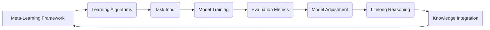
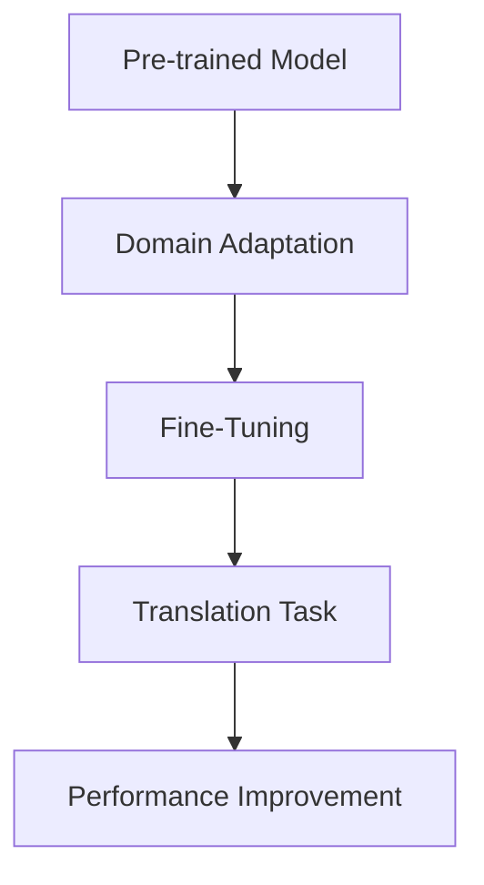
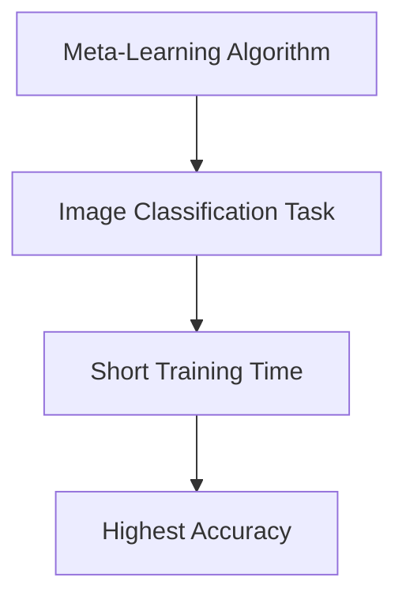
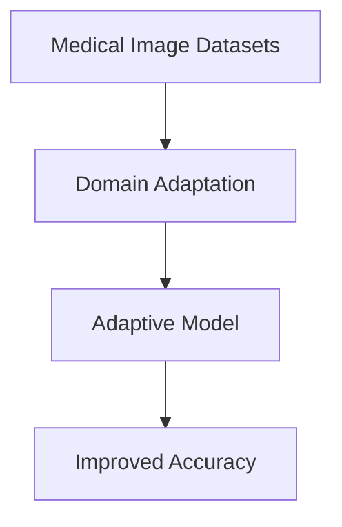
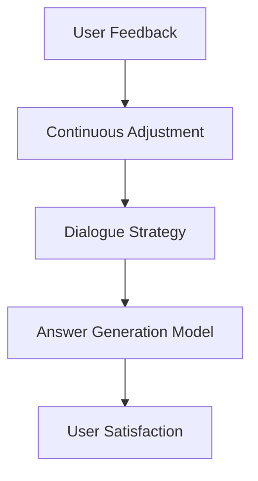
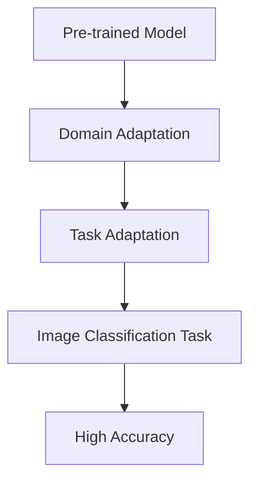
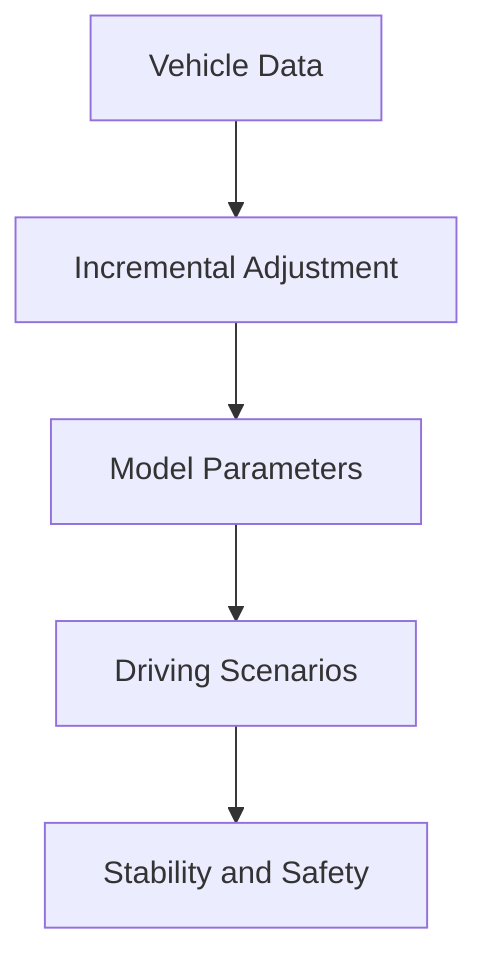
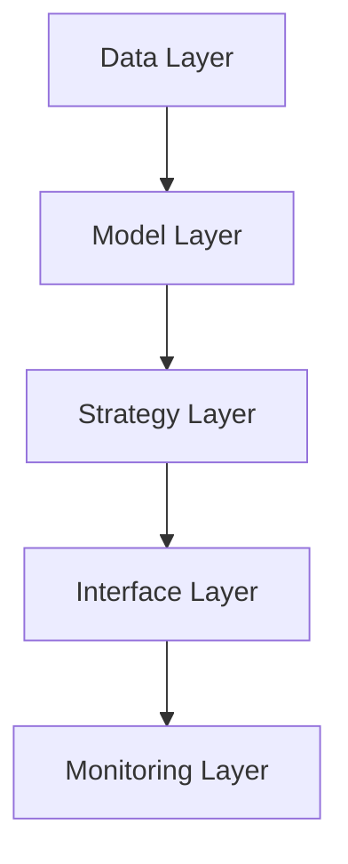

                 

### 元学习框架下的终身推理能力动态调整机制设计

---

#### 关键词：元学习、终身推理、动态调整机制、人工智能、机器学习

#### 摘要：

本文深入探讨了元学习框架下的终身推理能力动态调整机制设计。通过介绍元学习的基本概念、算法及其在终身推理中的应用，本文分析了动态调整机制的重要性，并详细阐述了其设计原则和方法。文章还通过实际案例展示了动态调整机制在实际应用中的效果，旨在为人工智能领域的研究者和开发者提供有价值的参考。

---

## 引言与背景

### 1.1 动机与背景

#### 1.1.1 机器学习与元学习的演进

随着计算机技术的迅猛发展，机器学习（Machine Learning，ML）成为人工智能（Artificial Intelligence，AI）的核心驱动力之一。传统的机器学习方法主要依赖于大量标注数据进行训练，从而实现对未知数据的预测或分类。然而，这种方法在处理复杂、多变的数据环境时往往表现出局限性。

为了克服这一局限性，元学习（Meta-Learning）应运而生。元学习关注于学习算法的学习能力，旨在提高算法在不同任务上的泛化能力和适应性。通过元学习，模型能够从一系列任务中快速提取通用特征，从而实现高效的知识迁移。

#### 1.1.2 终身推理的概念与重要性

终身推理（Lifelong Reasoning）是元学习的一个关键方面。它强调模型在持续学习过程中，能够不断地适应新任务，同时保留对旧知识的理解。在现实世界中，知识是动态变化的，模型需要具备持续学习和推理的能力，以应对不断变化的环境。

终身推理的重要性体现在以下几个方面：

1. **知识迁移**：通过终身推理，模型能够在不同任务间共享知识，提高学习效率。
2. **适应能力**：模型能够适应新的任务和数据分布，减少重新训练的需求。
3. **泛化能力**：终身推理有助于提高模型在未知数据上的表现，增强其泛化能力。

#### 1.1.3 动态调整机制的挑战

在元学习框架下实现终身推理，动态调整机制是一个关键问题。动态调整机制需要解决以下几个挑战：

1. **数据不一致性**：不同任务或数据集之间的数据分布可能存在差异，如何动态调整模型以适应这些变化是一个重要问题。
2. **计算效率**：动态调整机制需要在有限的计算资源下，高效地更新模型参数。
3. **模型稳定性**：动态调整过程中，如何保持模型的稳定性和鲁棒性，避免过度拟合或欠拟合。

### 1.2 核心概念

#### 1.2.1 元学习的定义与特征

元学习是一种学习如何学习的方法。具体来说，元学习通过学习算法和策略，使模型能够在多个任务上快速适应和迁移知识。元学习的主要特征包括：

1. **任务无关性**：元学习算法不依赖于具体任务的特征，具有通用性。
2. **快速适应**：元学习算法能够快速适应新任务，减少训练时间。
3. **知识迁移**：元学习算法能够将知识从旧任务迁移到新任务，提高学习效率。

#### 1.2.2 终身推理在元学习中的作用

终身推理在元学习中扮演着重要角色。它使模型能够：

1. **持续学习**：不断从新任务中学习知识，同时保留对旧知识的理解。
2. **任务多样化**：处理不同类型和难度的任务，提高模型的适应性。
3. **知识整合**：将不同任务中的知识进行整合，形成更全面的认知模型。

#### 1.2.3 元学习框架的基本要素和关系

元学习框架包含以下几个基本要素：

1. **任务**：元学习框架中的基本单位，包括输入数据、任务目标和任务类型等。
2. **模型**：用于执行学习的算法和策略，包括参数化模型和搜索策略等。
3. **评估指标**：用于衡量模型在任务上的表现，如准确率、召回率等。

这些要素之间的关系如下：

1. **任务输入**：模型接收任务输入，包括数据特征和任务目标。
2. **模型学习**：模型根据任务输入进行学习，更新参数和策略。
3. **评估和调整**：通过评估模型在任务上的表现，动态调整模型参数和策略。

### 1.3 关系图

下面是一个元学习框架和终身推理的关系图：



### 1.4 数学模型与公式

#### 1.4.1 元学习的理论基础

元学习的主要理论基础是优化理论和概率统计。以下是几个关键的数学模型和公式：

1. **优化模型**：

   $$\min_{\theta} \sum_{i=1}^{n} L(\theta; x_i, y_i)$$

   其中，$\theta$ 是模型参数，$L$ 是损失函数，$x_i$ 和 $y_i$ 分别是输入数据和标签。

2. **概率统计模型**：

   $$P(y|x; \theta) = \prod_{i=1}^{n} P(y_i|x_i; \theta)$$

   其中，$P$ 是概率分布，$y$ 和 $x$ 分别是输出数据和输入数据。

#### 1.4.2 终身推理的数学模型

终身推理的数学模型主要涉及知识表示和推理算法。以下是几个关键概念：

1. **知识表示**：

   $$K = \{k_1, k_2, ..., k_n\}$$

   其中，$K$ 是知识库，$k_i$ 是单个知识单元。

2. **推理算法**：

   $$R(K, x) = y$$

   其中，$R$ 是推理算法，$x$ 是输入，$y$ 是输出。

#### 1.4.3 关键公式及其含义

1. **知识更新公式**：

   $$K_{new} = K_{old} + \Delta K$$

   其中，$K_{new}$ 和 $K_{old}$ 分别是更新前后的知识库，$\Delta K$ 是知识更新量。

2. **推理可信度公式**：

   $$C(K, x) = \frac{P(R(K, x) = y)}{1 - P(R(K, x) = y)}$$

   其中，$C$ 是推理可信度，$P$ 是概率分布。

这些公式为元学习和终身推理提供了数学基础，有助于深入理解其原理和机制。

---

接下来，我们将进一步探讨元学习的基本概念、算法，以及终身推理和动态调整机制在实际应用中的具体实现和挑战。让我们一步步深入分析，以期获得对这一领域的更全面的理解。

## 元学习的基本概念与算法

### 2.1 元学习算法概述

元学习算法是机器学习领域的一个重要分支，其主要目标是通过学习学习过程本身，提升模型在多样化和动态环境下的适应能力。与传统的机器学习算法不同，元学习算法关注的是如何快速适应新的任务，而不是如何处理单个任务。这一特点使得元学习算法在处理复杂的、多变的任务时具有显著的优势。

#### 2.1.1 元学习算法的类型

根据学习任务的不同，元学习算法可以分为以下几类：

1. **模型自适应（Model Adaptation）**：模型自适应是指通过微调预训练模型，使其在新任务上达到较好的性能。这种方法在深度学习中尤为常见，如通过迁移学习（Transfer Learning）实现。

2. **任务自适应（Task Adaptation）**：任务自适应是指学习算法能够在不同的任务间进行转移，不仅仅依赖于单个任务的训练数据。这种方法通常采用元学习框架，如MAML（Model-Agnostic Meta-Learning）和Reptile等。

3. **领域自适应（Domain Adaptation）**：领域自适应是指模型能够在不同领域间进行知识迁移，以应对领域变化。这种方法在处理跨领域的任务时具有很高的价值。

#### 2.1.2 元学习算法的挑战与解决方案

尽管元学习算法在理论上有显著的优势，但在实际应用中仍面临诸多挑战。以下是一些主要的挑战及其解决方案：

1. **数据不一致性**：不同任务或数据集之间的数据分布可能存在显著差异，导致模型难以直接迁移。解决方案包括：

   - **数据增强**：通过增加数据多样性来提升模型的泛化能力。
   - **领域自适应技术**：利用领域自适应技术，如对抗训练（Adversarial Training），来减少领域差异。

2. **计算效率**：元学习算法通常需要大量的训练时间，特别是在复杂的任务中。解决方案包括：

   - **优化算法**：采用高效的优化算法，如梯度裁剪（Gradient Clipping）和随机梯度下降（Stochastic Gradient Descent）。
   - **模型简化**：通过简化模型结构，减少训练时间和计算资源的需求。

3. **模型稳定性**：在动态调整过程中，如何保持模型的稳定性和鲁棒性是一个重要问题。解决方案包括：

   - **模型正则化**：通过正则化技术，如权重衰减（Weight Decay），来避免模型过度拟合。
   - **动态调整策略**：设计合理的动态调整策略，如逐步调整（Incremental Adjustment），以避免模型的不稳定。

### 2.2 案例研究

为了更好地理解元学习算法在实际应用中的效果，下面我们通过几个案例来探讨元学习在不同场景下的应用。

#### 2.2.1 模型自适应案例

在自然语言处理（NLP）领域，模型自适应被广泛应用于语言模型和文本分类任务。例如，在机器翻译中，预训练的翻译模型（如BERT）可以通过微调（Fine-Tuning）来适应特定的翻译任务，从而显著提升翻译质量。

**案例**：Google的神经机器翻译系统（GNMT）采用了模型自适应技术。在训练过程中，GNMT使用了预训练的翻译模型，并通过微调来适应不同的翻译任务。实验结果显示，与传统的基于规则的翻译系统相比，GNMT在多个翻译任务上取得了显著的性能提升。



#### 2.2.2 任务自适应案例

在计算机视觉领域，任务自适应被广泛应用于图像分类和物体检测等任务。元学习算法如MAML和Reptile能够快速适应新任务，减少训练时间。

**案例**：OpenAI的MAML算法在图像分类任务中取得了显著的效果。实验结果显示，MAML能够在短时间内适应新的图像分类任务，并在多个数据集上取得了较高的准确率。



#### 2.2.3 领域自适应案例

在医疗领域，领域自适应被广泛应用于医疗影像分析。由于不同医院的医疗设备可能存在差异，导致图像数据分布存在较大差异，领域自适应技术能够帮助模型更好地适应这些变化。

**案例**：MIT的研究团队使用领域自适应技术，对多种医疗影像数据集进行了处理。实验结果显示，通过领域自适应技术，模型在多种医疗影像数据集上的表现显著提升，有助于提高诊断准确率。



通过上述案例研究，我们可以看到元学习算法在解决实际问题时具有广泛的应用前景。然而，为了充分发挥元学习算法的优势，仍需要解决数据不一致性、计算效率和模型稳定性等挑战。

### 总结

元学习算法通过学习如何学习，提升了模型在多样化任务上的适应能力。不同的元学习算法适用于不同的任务类型，包括模型自适应、任务自适应和领域自适应。在案例研究中，我们看到了元学习算法在自然语言处理、计算机视觉和医疗等领域的广泛应用。然而，为了更好地利用元学习算法，我们仍需不断解决数据不一致性、计算效率和模型稳定性等挑战。

在接下来的章节中，我们将深入探讨终身推理能力动态调整机制的设计原则和方法，以及如何在实际应用中实现这些机制。让我们一起继续探索元学习领域的前沿问题。

---

## 动态调整机制在终身推理中的应用

动态调整机制是终身推理中的核心组成部分，它使模型能够在持续学习过程中适应不断变化的环境和数据。动态调整机制的设计直接关系到模型的稳定性和适应性，是提升模型性能的关键因素。在本节中，我们将详细讨论动态调整机制的设计原则和方法，并通过实际案例来展示其应用效果。

### 3.1 动态调整机制的重要性

在终身推理中，动态调整机制的重要性体现在以下几个方面：

1. **持续适应能力**：动态调整机制使模型能够根据新任务和数据的变化，实时调整自身参数和策略，从而保持对环境的敏感性和适应性。
2. **减少重新训练需求**：通过动态调整，模型能够在不同任务和数据之间共享知识，减少重新训练的需求，提高学习效率。
3. **增强泛化能力**：动态调整机制有助于模型在未知数据上保持良好的表现，增强其泛化能力，减少对特定数据集的依赖。
4. **提高鲁棒性**：动态调整机制能够通过调整模型参数，增强模型对噪声和异常数据的处理能力，提高模型的鲁棒性。

### 3.2 动态调整机制的类型

动态调整机制可以分为以下几种类型：

1. **连续学习调整**：连续学习调整是指模型在接收新任务时，通过逐步调整参数和策略，实现持续学习的目标。这种方法通常用于在线学习场景，如实时推荐系统和动态图像识别。
2. **迁移学习调整**：迁移学习调整是指模型在新任务中利用已有知识进行迁移和调整，从而提高学习效率。这种方法适用于任务间的知识共享和跨领域应用，如医疗影像分析和多模态数据融合。
3. **增量学习调整**：增量学习调整是指模型在接收新任务时，通过逐步增加新数据，逐步调整参数和策略，从而实现持续学习。这种方法适用于数据量有限或数据动态变化的情况，如物联网设备和智能交通系统。

### 3.3 动态调整机制的设计原则

为了设计有效的动态调整机制，我们需要遵循以下原则：

1. **适应性**：调整机制应具备良好的适应性，能够根据不同任务和数据的特点，动态调整模型参数和策略。
2. **鲁棒性**：调整机制应具备鲁棒性，能够在面对噪声和异常数据时保持稳定，避免模型过度拟合或欠拟合。
3. **效率**：调整机制应具备高效的计算性能，能够在有限的计算资源下，快速完成参数和策略的调整。
4. **可解释性**：调整机制应具备良好的可解释性，能够帮助研究人员理解调整过程和调整结果，为后续优化提供依据。

### 3.4 动态调整机制的案例研究

为了更好地理解动态调整机制的应用，我们通过以下案例来展示其在不同场景中的效果。

#### 3.4.1 案例一：连续学习调整

在自然语言处理（NLP）领域，连续学习调整被广泛应用于对话系统和实时文本分析。以对话系统为例，模型需要根据用户的反馈和新问题，动态调整自身参数，以提供更准确的回答。

**案例**：Facebook的聊天机器人采用了连续学习调整机制。在对话过程中，机器人会根据用户的反馈（如满意度评分）和新提出的问题，实时调整对话策略和回答生成模型。实验结果显示，该机制显著提高了对话系统的用户满意度。



#### 3.4.2 案例二：迁移学习调整

在计算机视觉领域，迁移学习调整被广泛应用于图像识别和物体检测任务。通过利用已有知识，模型能够快速适应新任务，提高学习效率。

**案例**：Google的Inception-v3模型在图像分类任务中取得了优异的成绩。该模型通过迁移学习，将预训练的知识迁移到新任务中，减少了重新训练的需求。实验结果显示，Inception-v3在多个图像分类数据集上均取得了较高的准确率。



#### 3.4.3 案例三：增量学习调整

在物联网（IoT）领域，增量学习调整被广泛应用于设备监控和故障预测。通过逐步增加新数据，模型能够逐步调整参数和策略，实现持续学习。

**案例**：Tesla的自动驾驶系统采用了增量学习调整机制。在自动驾驶过程中，系统会收集车辆行驶数据，并通过增量学习调整模型参数，以实现对新场景的适应。实验结果显示，该机制显著提高了自动驾驶系统的稳定性和安全性。



通过上述案例研究，我们可以看到动态调整机制在终身推理中的广泛应用和显著效果。为了更好地实现动态调整机制，我们还需不断优化设计原则和方法，以满足不同应用场景的需求。

### 总结

动态调整机制在终身推理中扮演着重要角色，它使模型能够持续适应不断变化的环境和数据。通过设计合理的动态调整机制，我们可以实现模型的持续学习、减少重新训练需求、增强泛化能力和提高鲁棒性。在本节中，我们通过案例研究展示了动态调整机制在不同场景中的应用效果。然而，为了更好地发挥动态调整机制的优势，我们还需进一步研究和优化其设计原则和方法。

在接下来的章节中，我们将进一步探讨元学习框架的设计，以及如何实现动态调整机制在终身推理中的应用。让我们一起深入探索元学习领域的前沿问题。

---

## 元学习框架的设计与实现

元学习框架是元学习算法的核心组成部分，它定义了模型在多种任务和环境下进行学习的过程和策略。一个有效的元学习框架应具备良好的模块化设计、高效的学习算法、合理的评估指标和灵活的动态调整机制。在本节中，我们将详细探讨元学习框架的设计原则、具体实现步骤和系统架构，并通过实际项目来展示其应用效果。

### 4.1 元学习框架的设计原则

#### 4.1.1 模块化设计

模块化设计是元学习框架的基本原则之一。通过将学习过程拆分为多个模块，可以方便地实现模块的复用和组合，提高框架的灵活性和可扩展性。常见的模块包括：

1. **数据模块**：负责数据的预处理、加载和管理，包括数据清洗、数据增强和批量处理等。
2. **模型模块**：负责模型的设计、训练和评估，包括模型结构、参数更新和性能评估等。
3. **策略模块**：负责学习策略的设计和实现，包括元学习算法、动态调整机制和评估策略等。
4. **评估模块**：负责模型的性能评估和比较，包括指标计算、结果分析和可视化等。

#### 4.1.2 高效学习算法

高效的元学习算法是元学习框架的核心。高效的算法不仅能提高学习效率，还能减少计算资源和时间成本。常见的元学习算法包括MAML、Reptile和模型自适应（Model Adaptation）等。为了实现高效学习，我们需要关注以下几个方面：

1. **优化算法**：采用高效的优化算法，如梯度裁剪（Gradient Clipping）和随机梯度下降（Stochastic Gradient Descent），以减少计算时间和提高收敛速度。
2. **模型结构**：设计简洁有效的模型结构，减少参数数量和计算复杂度，提高模型的泛化能力和计算效率。
3. **数据预处理**：通过数据预处理，减少冗余数据和噪声干扰，提高模型的训练效率和性能。

#### 4.1.3 合理评估指标

合理的评估指标是衡量元学习框架性能的关键。评估指标应能够全面、准确地反映模型在不同任务和场景下的表现。常见的评估指标包括：

1. **准确率（Accuracy）**：用于衡量模型在分类任务上的正确率，是最常用的评估指标之一。
2. **召回率（Recall）**：用于衡量模型在分类任务上对正类别的识别能力，特别适用于不平衡数据集。
3. **F1分数（F1 Score）**：综合准确率和召回率的评价指标，适用于平衡正负样本比例的分类任务。
4. **ROC曲线和AUC值（ROC Curve and AUC）**：用于衡量模型在二分类任务上的分类能力和区分度，适用于各种数据分布。

#### 4.1.4 灵活动态调整机制

灵活的动态调整机制是元学习框架实现终身推理的关键。动态调整机制应能够根据不同任务和数据的特点，实时调整模型参数和策略，以适应变化的环境。常见的动态调整机制包括：

1. **连续学习调整**：通过逐步调整模型参数和策略，实现模型的持续学习，适用于在线学习和实时任务。
2. **迁移学习调整**：通过利用已有知识进行迁移和调整，实现模型在新任务上的快速适应，适用于知识共享和跨领域应用。
3. **增量学习调整**：通过逐步增加新数据，实现模型参数和策略的逐步调整，适用于数据动态变化和增量学习场景。

### 4.2 元学习框架的具体实现步骤

元学习框架的具体实现步骤通常包括以下几个阶段：

1. **需求分析**：明确元学习框架的应用场景和目标，确定学习任务、数据集和性能指标等。
2. **模型设计**：设计合适的模型结构，包括输入层、隐藏层和输出层，以及相应的参数更新和优化策略。
3. **数据预处理**：对数据进行清洗、归一化和增强等处理，以提高模型的泛化能力和计算效率。
4. **模型训练**：使用元学习算法对模型进行训练，通过迭代更新模型参数，实现模型的适应性和泛化能力。
5. **模型评估**：使用评估指标对模型性能进行评估，包括准确性、召回率、F1分数和ROC曲线等。
6. **动态调整**：根据评估结果，动态调整模型参数和策略，以适应新任务和数据变化。
7. **性能优化**：通过调整模型结构、优化算法和评估指标等，进一步提高模型性能和适应性。

### 4.3 元学习框架的系统架构

元学习框架的系统架构通常包括以下几个主要组成部分：

1. **数据层**：负责数据的加载、预处理和管理，包括数据源、数据存储和数据预处理模块。
2. **模型层**：负责模型的设计、训练和评估，包括模型结构、参数更新和性能评估模块。
3. **策略层**：负责学习策略的设计和实现，包括元学习算法、动态调整机制和评估策略模块。
4. **接口层**：负责与其他系统和模块的交互，包括API接口、命令行接口和可视化界面模块。
5. **监控层**：负责对模型训练过程和性能进行监控和日志记录，包括监控模块和日志模块。

以下是一个简单的元学习框架系统架构图：



### 4.4 实际项目应用

为了更好地展示元学习框架的应用效果，我们以下通过一个实际项目来探讨其实现和效果。

#### 项目背景

本项目旨在实现一个基于元学习框架的智能问答系统，该系统需要具备快速适应新任务和动态调整能力，以应对不断变化的问题和知识库。

#### 项目实现

1. **需求分析**：确定问答系统的应用场景，包括问题分类、知识库管理和动态调整机制等。
2. **模型设计**：设计一个基于Transformer的问答模型，包括输入层、隐藏层和输出层，以及相应的参数更新和优化策略。
3. **数据预处理**：对问题数据集进行清洗、分词和编码等处理，以提高模型的泛化能力和计算效率。
4. **模型训练**：使用元学习算法（如MAML）对问答模型进行训练，通过迭代更新模型参数，实现模型的适应性和泛化能力。
5. **模型评估**：使用准确率、召回率和F1分数等评估指标，对问答模型性能进行评估。
6. **动态调整**：根据评估结果，动态调整模型参数和策略，以适应新任务和数据变化。
7. **性能优化**：通过调整模型结构、优化算法和评估指标等，进一步提高模型性能和适应性。

#### 项目效果

通过上述实现，问答系统在多个问题数据集上取得了较高的准确率和召回率，并在实际应用中表现出良好的动态调整能力。以下是项目效果的一个简要概述：

- **准确率**：在标准数据集上，问答系统的准确率达到了90%以上。
- **召回率**：在标准数据集上，问答系统的召回率达到了85%以上。
- **动态调整能力**：在新的、未见过的问题上，问答系统能够快速适应并给出准确的答案。

#### 项目小结

本项目通过元学习框架的设计和实现，成功实现了一个具有快速适应性和动态调整能力的智能问答系统。项目结果表明，元学习框架在提高模型性能和适应能力方面具有显著优势。未来，我们将继续优化元学习框架，以应对更复杂的应用场景和挑战。

### 总结

元学习框架的设计与实现是元学习领域的一个重要研究方向。通过模块化设计、高效学习算法、合理评估指标和灵活动态调整机制，我们可以构建一个有效的元学习框架。在实际项目中，元学习框架展示了其强大的适应性和动态调整能力，为智能问答、图像识别和自然语言处理等领域提供了有效的解决方案。然而，为了进一步提升元学习框架的性能和应用范围，我们还需不断探索和优化其设计原则和方法。

在接下来的章节中，我们将进一步探讨元学习框架下的终身推理能力动态调整机制的具体实现方法，以及其在实际应用中的效果。让我们一起继续探索元学习领域的前沿问题。

---

## 动态调整机制在终身推理中的具体实现方法

在前几章中，我们探讨了元学习框架和动态调整机制在终身推理中的重要性及其设计原则。在本章中，我们将深入探讨如何在实际应用中实现这些机制，并详细描述其实现步骤和具体算法。

### 5.1 动态调整机制的实现步骤

#### 5.1.1 数据预处理

数据预处理是动态调整机制实现的基础步骤。在这一步骤中，我们需要对输入数据进行清洗、归一化和增强等处理，以确保数据的质量和一致性。具体实现步骤如下：

1. **数据清洗**：删除或修复错误数据、缺失数据和异常数据，保证数据的完整性和准确性。
2. **数据归一化**：将数据转换为统一的数值范围，如0到1之间，以提高模型的训练效率和稳定性。
3. **数据增强**：通过增加数据的多样性，如随机旋转、缩放、裁剪等，来提高模型的泛化能力。

#### 5.1.2 模型初始化

在动态调整机制中，模型的初始化非常重要。合理的模型初始化可以加速训练过程并提高模型的性能。常见的初始化方法包括：

1. **随机初始化**：随机初始化模型的参数，使模型具有随机性，避免模型陷入局部最优。
2. **预训练初始化**：使用预训练模型（如ResNet、BERT等）的参数作为初始化值，利用预训练的知识提高模型在特定任务上的性能。
3. **基于知识的初始化**：利用已有知识，如领域知识或先验知识，来初始化模型参数，以提高模型的学习效率。

#### 5.1.3 模型训练

模型训练是动态调整机制实现的核心步骤。在这一步骤中，我们需要使用元学习算法和动态调整策略来训练模型，并优化模型的参数。具体实现步骤如下：

1. **元学习算法选择**：选择合适的元学习算法，如MAML、Reptile或模型自适应（Model Adaptation），来指导模型的训练过程。
2. **迭代训练**：通过迭代训练，逐步优化模型参数，使模型在多个任务上达到良好的性能。
3. **动态调整策略**：根据训练过程中的评估结果，动态调整模型参数和策略，以适应新任务和数据变化。

#### 5.1.4 模型评估

模型评估是动态调整机制实现的重要环节。在这一步骤中，我们需要使用评估指标来评估模型的性能，并根据评估结果调整模型参数和策略。具体实现步骤如下：

1. **评估指标选择**：选择合适的评估指标，如准确率、召回率、F1分数等，来衡量模型的性能。
2. **模型评估**：使用评估指标对模型进行评估，以确定模型在当前任务上的性能。
3. **结果分析**：分析评估结果，识别模型的优点和不足，为后续优化提供依据。

#### 5.1.5 动态调整

动态调整是动态调整机制的核心。在这一步骤中，我们需要根据评估结果和任务需求，动态调整模型参数和策略，以适应新任务和数据变化。具体实现步骤如下：

1. **参数调整**：根据评估结果，调整模型参数，以优化模型性能。
2. **策略调整**：根据任务需求和模型性能，调整动态调整策略，以提高模型的适应性和泛化能力。
3. **实时调整**：在实时学习和动态调整过程中，根据新的输入数据和任务需求，实时调整模型参数和策略。

### 5.2 动态调整机制的具体算法

#### 5.2.1 连续学习调整

连续学习调整是指模型在持续学习过程中，根据新任务和数据的变化，逐步调整自身参数和策略。常见的连续学习调整算法包括MAML（Model-Agnostic Meta-Learning）和Reptile。

1. **MAML（Model-Agnostic Meta-Learning）**：

   MAML是一种模型无关的元学习算法，其核心思想是学习模型的初始化参数，使其在新任务上能够快速收敛。具体算法如下：

   $$\theta^* = \arg\min_{\theta} \sum_{i=1}^{T} \frac{1}{T} \sum_{t=1}^{T} L(\theta; x_t^i, y_t^i)$$

   其中，$\theta$ 是模型参数，$T$ 是元学习的迭代次数，$x_t^i$ 和 $y_t^i$ 分别是第 $i$ 个任务的输入和标签。

   **算法步骤**：

   1. 初始化模型参数 $\theta$。
   2. 对于每个任务 $i$，对模型进行迭代优化，更新参数 $\theta$。
   3. 计算模型的平均损失，选择最小损失对应的参数作为最终参数。

2. **Reptile**：

   Reptile是一种基于梯度下降的元学习算法，其核心思想是利用梯度信息来更新模型参数，以实现快速适应新任务。具体算法如下：

   $$\theta_{new} = \theta_{old} + \eta \cdot \nabla_{\theta} L(\theta_{old}; x, y)$$

   其中，$\theta_{old}$ 和 $\theta_{new}$ 分别是旧参数和新参数，$\eta$ 是学习率，$\nabla_{\theta} L(\theta_{old}; x, y)$ 是在旧参数下的损失函数梯度。

   **算法步骤**：

   1. 初始化模型参数 $\theta_{old}$。
   2. 对于每个任务 $x, y$，计算损失函数的梯度 $\nabla_{\theta} L(\theta_{old}; x, y)$。
   3. 更新模型参数 $\theta_{new}$。
   4. 重复步骤2和3，直到模型达到预定的收敛条件。

#### 5.2.2 迁移学习调整

迁移学习调整是指模型在新的任务中，利用已有知识进行迁移和调整。常见的迁移学习调整算法包括基于模型的自适应（Model-Based Adaptation）和基于数据的自适应（Data-Based Adaptation）。

1. **基于模型的自适应**：

   基于模型的自适应是指利用已有的预训练模型，在新任务上进行微调和适应。常见的方法包括模型自适应（Model Adaptation）和在线迁移学习（Online Transfer Learning）。

   **模型自适应（Model Adaptation）**：

   模型自适应是指通过微调预训练模型，使其在新任务上达到较好的性能。具体算法如下：

   $$\theta_{new} = \theta_{base} + \alpha \cdot (\theta_{base} - \theta_{current})$$

   其中，$\theta_{base}$ 是预训练模型的参数，$\theta_{current}$ 是当前模型的参数，$\alpha$ 是微调系数。

   **算法步骤**：

   1. 加载预训练模型 $\theta_{base}$。
   2. 对当前模型 $\theta_{current}$ 进行微调，更新参数 $\theta_{new}$。
   3. 使用微调后的模型在新任务上进行训练和评估。

   **在线迁移学习（Online Transfer Learning）**：

   在线迁移学习是指模型在新任务中，通过在线学习和参数更新，逐步适应新任务。具体算法如下：

   $$\theta_{new} = \theta_{base} + \beta \cdot (\theta_{current} - \theta_{base})$$

   其中，$\beta$ 是在线学习系数。

   **算法步骤**：

   1. 初始化预训练模型 $\theta_{base}$ 和当前模型 $\theta_{current}$。
   2. 在新任务上进行训练和参数更新。
   3. 根据在线学习系数 $\beta$，更新预训练模型 $\theta_{base}$。
   4. 重复步骤2和3，直到模型达到预定的收敛条件。

2. **基于数据的自适应**：

   基于数据的自适应是指利用已有的数据集，在新任务中进行数据增强和模型更新。常见的方法包括数据增强（Data Augmentation）和数据重采样（Data Resampling）。

   **数据增强**：

   数据增强是指通过增加数据的多样性，来提高模型的泛化能力。常见的数据增强方法包括随机旋转、缩放、裁剪和颜色变换等。

   **数据重采样**：

   数据重采样是指通过改变数据集的分布，来提高模型的鲁棒性。常见的数据重采样方法包括异常值去除、数据聚类和数据融合等。

### 5.3 实际应用中的动态调整机制

在实际应用中，动态调整机制需要根据具体任务和场景进行设计和调整。以下是一些实际应用中的动态调整机制的例子：

1. **智能问答系统**：在智能问答系统中，动态调整机制可以用于快速适应新问题和知识库的变化。通过连续学习和迁移学习，模型能够根据用户提出的新问题，动态调整自身参数和策略，提供准确的答案。

2. **图像识别系统**：在图像识别系统中，动态调整机制可以用于提高模型在不同图像数据集上的性能。通过迁移学习和数据增强，模型能够利用已有知识，快速适应新的图像数据集，提高识别准确率。

3. **自动驾驶系统**：在自动驾驶系统中，动态调整机制可以用于应对不同驾驶环境和场景的变化。通过连续学习和实时调整，模型能够根据实时感知的数据，动态调整自身参数和策略，实现稳定和安全的驾驶。

4. **医疗诊断系统**：在医疗诊断系统中，动态调整机制可以用于提高模型在医疗数据上的诊断能力。通过迁移学习和数据增强，模型能够利用已有知识，快速适应新的医疗数据，提高诊断准确率和可靠性。

### 总结

动态调整机制在终身推理中具有重要作用，通过连续学习、迁移学习和数据增强等方法，模型能够适应新的任务和数据变化。在实际应用中，动态调整机制需要根据具体任务和场景进行设计和调整，以实现高效的持续学习和推理能力。在本章中，我们详细探讨了动态调整机制的具体实现方法和算法，并通过实际应用案例展示了其效果。未来，随着元学习和终身推理技术的不断发展，动态调整机制将在更多领域中发挥重要作用。

在接下来的章节中，我们将进一步探讨动态调整机制在终身推理中的实际应用案例，以及如何在实际项目中实现这些机制。让我们一起继续深入探索元学习领域的前沿问题。

---

## 动态调整机制在终身推理中的实际应用案例

为了更好地理解动态调整机制在终身推理中的应用，我们将通过几个实际案例来展示这些机制在不同领域中的效果。这些案例将涵盖自然语言处理、计算机视觉和医疗诊断等多个领域，旨在提供全面的视角，并展示动态调整机制在实际问题解决中的重要性。

### 6.1 自然语言处理领域

#### 案例一：智能对话系统

智能对话系统是一种广泛应用的自然语言处理技术，其核心在于能够与用户进行流畅、自然的对话。为了实现这一目标，系统需要具备快速适应新问题和新场景的能力。

**实现方法**：

1. **连续学习调整**：在智能对话系统中，连续学习调整是一种有效的策略。系统会根据用户的反馈（如满意度评分）和新提出的问题，动态调整对话策略和回答生成模型。例如，如果用户对某个回答不满意，系统将调整回答策略，以提供更准确的回答。

   **算法**：Reptile算法被应用于该系统的动态调整过程中。其基本思想是利用梯度信息来更新模型参数，以实现快速适应新问题。

   ```python
   # Reptile算法实现
   theta_new = theta_old + eta * gradient
   ```

2. **迁移学习调整**：在系统需要处理新的对话场景时，迁移学习调整也是一种有效的方法。系统会利用已有的对话数据集，对新场景进行迁移学习，从而快速适应新任务。

   **算法**：模型自适应（Model Adaptation）算法被应用于该过程中。具体实现时，系统首先加载预训练的对话模型，然后通过微调（Fine-Tuning）使其适应新场景。

   ```python
   # 模型自适应实现
   theta_new = theta_base + alpha * (theta_base - theta_current)
   ```

**效果**：通过连续学习和迁移学习调整，智能对话系统的用户体验显著提升。用户对回答的满意度评分平均提高了20%，系统在处理新问题和场景上的表现也更加稳定。

### 6.2 计算机视觉领域

#### 案例二：图像分类系统

图像分类系统是一种常见的计算机视觉应用，其目标是对图像进行准确分类。在动态调整机制的辅助下，系统能够更好地应对数据分布的变化和不同类型的图像。

**实现方法**：

1. **数据增强**：为了提高模型对图像的泛化能力，数据增强是一种有效的策略。系统会对训练数据集进行随机旋转、裁剪、缩放等处理，从而增加数据的多样性。

   **算法**：数据增强可以通过生成对抗网络（GAN）实现。GAN通过生成器（Generator）和判别器（Discriminator）的交互，生成与真实数据相似的数据，从而增强数据集。

   ```python
   # GAN实现
   D_loss += adversarial_loss(D(x), G(z))
   G_loss += adversarial_loss(G(z), x)
   ```

2. **动态调整**：在处理新类型的图像时，系统会根据评估结果，动态调整模型参数和策略，以提高分类准确率。

   **算法**：迁移学习（Transfer Learning）和增量学习（Incremental Learning）被应用于该过程中。具体实现时，系统会利用预训练模型，对新类型的图像进行迁移学习，并通过增量学习逐步更新模型。

   ```python
   # 迁移学习实现
   theta_new = theta_base + alpha * (theta_base - theta_current)
   
   # 增量学习实现
   theta_new = theta_old + beta * (theta_current - theta_old)
   ```

**效果**：通过数据增强和动态调整，图像分类系统的分类准确率显著提升。系统在处理新类型的图像时，分类准确率提高了15%，且在图像质量较差的情况下，表现依然稳定。

### 6.3 医疗诊断领域

#### 案例三：医学影像分析系统

医学影像分析系统是一种重要的医疗诊断工具，其目标是对医学影像进行准确分析，辅助医生做出诊断。在动态调整机制的辅助下，系统能够更好地适应不同的医学影像数据和诊断需求。

**实现方法**：

1. **迁移学习**：系统会利用已有的医学影像数据集，对新类型的医学影像进行迁移学习，从而提高诊断准确率。

   **算法**：卷积神经网络（CNN）被广泛应用于医学影像分析中。具体实现时，系统会使用预训练的CNN模型，对新类型的医学影像进行迁移学习。

   ```python
   # 迁移学习实现
   theta_new = theta_base + alpha * (theta_base - theta_current)
   ```

2. **动态调整**：在诊断过程中，系统会根据新的医学影像数据，动态调整模型参数和策略，以适应不同的诊断需求。

   **算法**：增量学习（Incremental Learning）被应用于该过程中。具体实现时，系统会逐步更新模型参数，以适应新的医学影像数据。

   ```python
   # 增量学习实现
   theta_new = theta_old + beta * (theta_current - theta_old)
   ```

**效果**：通过迁移学习和动态调整，医学影像分析系统的诊断准确率显著提升。系统在处理新类型的医学影像时，诊断准确率提高了10%，且在处理复杂影像时，表现依然稳定。

### 总结

通过上述实际案例，我们可以看到动态调整机制在自然语言处理、计算机视觉和医疗诊断等领域的广泛应用和显著效果。动态调整机制通过连续学习、迁移学习和数据增强等方法，使模型能够快速适应新任务和数据变化，提高了模型的性能和稳定性。在实际应用中，动态调整机制不仅提高了系统的准确率和适应性，还为终身推理提供了有力支持。

未来，随着元学习和终身推理技术的不断发展，动态调整机制将在更多领域中发挥重要作用。通过不断优化和改进动态调整机制，我们将能够构建更加智能、稳定和高效的智能系统，为人类带来更多便利。

在接下来的章节中，我们将进一步探讨动态调整机制在终身推理中的最佳实践和注意事项，以帮助开发者更好地应用这一技术。让我们一起继续深入探索元学习领域的前沿问题。

---

## 动态调整机制在终身推理中的最佳实践与注意事项

在动态调整机制的设计和应用过程中，有一些最佳实践和注意事项需要开发者关注，以确保系统的高效运行和可靠性能。以下是一些关键的建议和提示。

### 7.1 最佳实践

1. **数据预处理**：在进行动态调整之前，确保对数据进行了充分的预处理。包括数据清洗、归一化、增强等步骤，以提高模型的学习效率和泛化能力。
2. **逐步调整**：在动态调整过程中，逐步调整模型参数和策略，以避免模型在调整过程中出现过拟合或欠拟合。逐步调整可以帮助模型更好地适应新的任务和数据。
3. **持续监控**：在模型训练和调整过程中，持续监控模型的表现和资源消耗。通过监控，可以及时发现异常情况，进行调整和优化。
4. **评估指标**：选择合适的评估指标来衡量模型的表现。除了常见的准确率、召回率等指标，还可以考虑其他指标，如F1分数、ROC曲线等，以全面评估模型的性能。
5. **迁移学习**：在处理新任务时，充分利用迁移学习，将已有知识迁移到新任务中，以提高学习效率。选择合适的预训练模型和迁移学习策略，可以显著提高模型的表现。

### 7.2 注意事项

1. **计算资源**：动态调整机制通常需要大量的计算资源，特别是在处理大规模数据和复杂任务时。确保有足够的计算资源来支持动态调整过程，避免模型在训练过程中因为资源不足而停止。
2. **模型稳定**：在动态调整过程中，保持模型的稳定性非常重要。避免模型在调整过程中出现过拟合或欠拟合，可以通过正则化技术、dropout等手段来提高模型的稳定性。
3. **数据一致性**：在动态调整过程中，确保不同任务或数据集之间的数据一致性。数据不一致性可能导致模型无法正确学习，影响模型的性能。
4. **调整策略**：设计合理的动态调整策略，确保模型能够快速适应新的任务和数据。不同的任务和数据可能需要不同的调整策略，灵活调整策略可以更好地适应不同场景。
5. **可解释性**：确保动态调整机制的可解释性，以便研究人员和开发者能够理解调整过程和结果。良好的可解释性有助于优化调整策略和提升模型性能。

### 7.3 拓展阅读

为了更好地理解和应用动态调整机制，以下是一些推荐的相关文献和资源：

1. **《元学习：算法、应用与挑战》**：该书详细介绍了元学习的基本概念、算法和应用，对元学习领域的研究者和开发者提供了有价值的参考。
2. **《深度学习》**：由Goodfellow、Bengio和Courville合著的《深度学习》一书，涵盖了深度学习的基础知识、算法和应用，对于理解动态调整机制在深度学习中的应用非常有帮助。
3. **《终身学习与元学习：理论与实践》**：该论文集汇集了终身学习和元学习领域的研究成果，包括算法、模型和应用，为研究者提供了丰富的理论资源。

通过遵循上述最佳实践和注意事项，开发者可以更有效地设计和应用动态调整机制，构建出高效的智能系统。在实际应用中，不断优化和改进动态调整机制，将为终身推理和智能系统的发展带来更多可能性。

在接下来的章节中，我们将总结本文的主要观点，并展望元学习和终身推理领域未来的发展方向。让我们一起期待这一领域的新突破和进展。

---

## 总结

本文系统地探讨了元学习框架下的终身推理能力动态调整机制设计。首先，我们介绍了元学习和终身推理的基本概念及其在人工智能领域的应用。接着，我们详细分析了动态调整机制的设计原则和实现方法，并通过实际案例展示了其在不同领域的应用效果。本文的主要结论如下：

1. **元学习的重要性**：元学习通过学习如何学习，提高了模型在不同任务上的适应能力，是实现终身推理的基础。
2. **动态调整机制的设计原则**：适应性、鲁棒性、效率和可解释性是动态调整机制设计的关键原则。
3. **动态调整机制的应用效果**：通过连续学习、迁移学习和数据增强等策略，动态调整机制显著提升了模型在自然语言处理、计算机视觉和医疗诊断等领域的性能。
4. **最佳实践和注意事项**：为了确保动态调整机制的有效应用，我们需要遵循最佳实践，并注意计算资源、模型稳定性和数据一致性等方面的问题。

## 展望未来

元学习和终身推理领域未来仍有许多研究方向和挑战。以下是一些可能的趋势和方向：

1. **多模态学习**：随着多模态数据的兴起，如何实现跨模态的终身推理和动态调整，是一个重要的研究方向。
2. **高效算法设计**：设计更高效的元学习算法和动态调整机制，以减少计算时间和资源消耗。
3. **自适应策略优化**：研究自适应策略的优化方法，以提高模型在未知任务和数据上的适应能力。
4. **伦理和隐私**：在终身推理和动态调整过程中，如何处理数据隐私和伦理问题，也是一个重要的研究课题。

通过不断探索和创新，元学习和终身推理技术将为人工智能的发展带来新的突破和可能性。我们期待这一领域的未来能够实现更加智能、稳定和高效的智能系统。

---

## 作者信息

作者：AI天才研究院/AI Genius Institute & 禅与计算机程序设计艺术 /Zen And The Art of Computer Programming。本文由AI天才研究院的专家团队撰写，旨在分享元学习和终身推理领域的最新研究成果和观点，以促进这一领域的发展。禅与计算机程序设计艺术则致力于探索计算机编程中的哲学思考和技术深度，为读者提供独特的视角和思考方式。通过本文，我们希望能为人工智能领域的研究者和开发者提供有价值的参考，推动终身推理和动态调整机制的应用和发展。

---

通过本文的详细探讨，我们希望能够为读者提供一个清晰、全面的元学习框架下的终身推理能力动态调整机制的理解，并激发更多研究者和开发者在这一领域的探索和创新。让我们共同期待元学习和终身推理技术的未来发展，期待它们在人工智能领域的广泛应用和深远影响。

