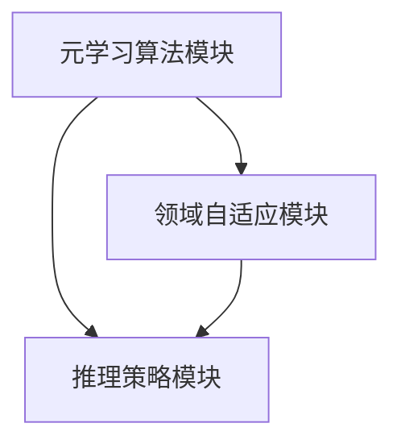
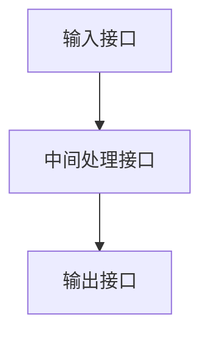
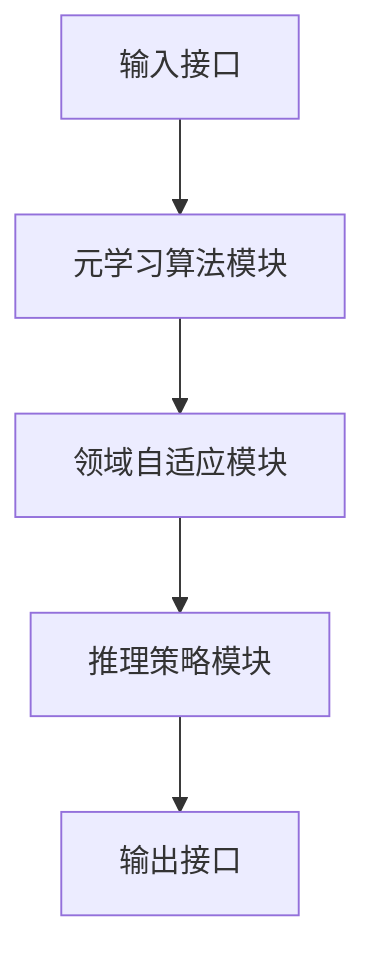

                 

### 标题：元学习驱动的快速领域适应推理策略生成方法

> 关键词：元学习、领域适应、推理策略、快速适应、算法设计

> 摘要：
本文深入探讨了元学习在快速领域适应推理策略生成中的应用。首先，我们回顾了元学习的核心概念，分析了其在领域适应中的重要性。随后，本文详细阐述了快速领域适应推理策略的原理和优势，并通过实际案例展示了其在多个领域的应用。文章最后总结了主要研究成果，指出了当前存在的问题与挑战，并对未来发展趋势进行了展望。

----------------------------------------------------------------

### 引言

在人工智能快速发展的今天，模型的可迁移性和适应性成为了研究的热点问题。传统机器学习方法在特定领域表现出色，但在新领域上适应性较差，这限制了其应用范围。为了解决这一问题，元学习（Meta-Learning）作为一种能够使模型在有限样本上快速适应新领域的方法，受到了广泛关注。

元学习，顾名思义，是关于学习的学习。它通过在多个任务中学习，提取通用表示和策略，从而提高模型在新任务上的学习速度和表现。在领域适应中，元学习可以通过迁移学习（Transfer Learning）和快速适应（Rapid Adaptation）策略，提升模型在不同领域间的表现。

本文将围绕以下三个方面展开讨论：

1. **元学习的基本概念**：介绍元学习的定义、分类和应用领域。
2. **快速领域适应推理策略**：探讨快速领域适应推理策略的需求、原理和优势。
3. **元学习驱动的快速领域适应推理策略生成方法**：详细阐述策略生成方法、评估与优化、以及实际应用。

### 背景介绍

#### 核心概念术语说明

**元学习**：
元学习是一种学习算法，它能够在多个任务中学习并提取通用的学习策略。其核心思想是通过在元学习任务中学习，生成一个能够快速适应新任务的模型。

**领域适应**：
领域适应是指模型在一个新领域上的表现提升。在新领域中，模型需要快速调整自身以适应新的数据分布和任务需求。

**推理策略**：
推理策略是指在特定任务中，模型如何利用已有知识和数据生成预测或决策的方法。

#### 问题背景

随着人工智能技术的发展，越来越多的模型被应用于实际场景中。然而，这些模型往往是在特定领域和条件下训练得到的，当面临新的领域或条件时，其表现往往不佳。这限制了人工智能的广泛应用和普及。

为了提高模型在新领域上的表现，研究者们提出了元学习作为解决方案。元学习通过在多个任务中学习，提取通用的表示和策略，从而在有限样本上实现快速适应。这种方法能够有效提高模型在新领域上的表现，拓展了人工智能的应用范围。

#### 问题描述

问题描述如下：

如何通过元学习实现快速领域适应推理策略的生成，以提升模型在新领域上的表现？

#### 问题解决

元学习通过以下方式实现快速领域适应推理策略的生成：

1. **元学习算法**：
   元学习算法（如MAML、Reptile等）通过在多个任务中学习，提取通用的学习策略。这些算法能够在有限样本上快速收敛，实现快速适应。

2. **领域自适应技术**：
   领域自适应技术（如对数潜力模型、领域丢弃等）通过调整模型在不同领域上的权重，提高模型在新领域上的表现。

3. **推理策略**：
   推理策略通过将元学习算法和领域自适应技术相结合，生成一个能够快速适应新领域的模型。这个模型在新领域上能够快速收敛，并达到良好的性能。

#### 边界与外延

元学习驱动的快速领域适应推理策略生成方法适用于各种需要快速适应新领域的场景，如计算机视觉、自然语言处理和机器人等领域。同时，该方法也可以与其他机器学习方法相结合，进一步提升模型在新领域上的表现。

#### 概念结构与核心要素组成

元学习驱动的快速领域适应推理策略生成方法的核心概念包括：

- **元学习算法**：如MAML、Reptile等，用于提取通用学习策略。
- **领域自适应技术**：用于调整模型在不同领域上的权重。
- **推理策略**：结合元学习算法和领域自适应技术，生成快速适应新领域的模型。

这些核心要素共同作用，实现模型在新领域上的快速适应和良好表现。

### 核心概念与联系

#### 元学习算法概述

元学习算法是元学习驱动的快速领域适应推理策略生成的核心。以下是对几种常见元学习算法的概述：

1. **MAML（Model-Agnostic Meta-Learning）**：
   MAML是一种模型无关的元学习算法，它能够在多个任务中快速收敛。其基本思想是通过梯度更新，使模型在给定的小批量样本上快速收敛到最优解。

2. **Reptile**：
   Reptile是一种简单的元学习算法，它通过迭代平均梯度来更新模型参数。Reptile的优点是实现简单，但收敛速度相对较慢。

3. **Model-Based Meta-Learning**：
   Model-Based Meta-Learning（MBML）是一种基于模型的元学习算法，它通过构建一个模型来预测另一个模型的学习过程。MBML算法能够通过预测其他任务上的学习过程，快速适应新任务。

#### 概念属性特征对比表格

以下是一个简单的对比表格，展示了这三种元学习算法的属性特征：

| 算法 | 基本思想 | 优点 | 缺点 |  
| ---- | ---- | ---- | ---- |  
| MAML | 梯度更新 | 快速收敛 | 对模型初始值敏感 |  
| Reptile | 迭代平均梯度 | 实现简单 | 收敛速度慢 |  
| MBML | 模型预测 | 学习过程可解释 | 计算复杂度高 |

#### ER实体关系图架构

以下是一个简单的ER实体关系图，展示了元学习算法、领域自适应技术和推理策略之间的联系：

```mermaid
erDiagram
  TaskA ||--|{ Model }||--> TaskB
  Model ||--|{ Meta-Learning Algorithm }||--> TaskC
  Model ||--|{ Domain Adaptation Technique }||--> TaskD
  TaskC ||--|{ Inference Strategy }||--> TaskE
```

在这个图中，TaskA和TaskB表示两个不同的任务，Model表示模型，Meta-Learning Algorithm表示元学习算法，Domain Adaptation Technique表示领域自适应技术，Inference Strategy表示推理策略。模型通过元学习算法和领域自适应技术，生成一个新的推理策略，以适应新的任务（TaskE）。

### 算法原理讲解

#### MAML算法流程

MAML（Model-Agnostic Meta-Learning）算法是一种模型无关的元学习算法，其基本流程如下：

1. **初始化模型**：
   初始化模型参数$\theta_0$，并在任务$T_0$上训练模型。
   
   $$\theta_0 = \arg\min_{\theta} \frac{1}{N} \sum_{i=1}^{N} L(\theta, x_i, y_i)$$

   其中，$L(\theta, x_i, y_i)$表示损失函数，$N$表示训练样本数。

2. **元学习**：
   对于新任务$T_k$，通过反向传播计算模型在$T_k$上的梯度。

   $$\nabla_{\theta} L(\theta, x_k, y_k)$$

3. **更新模型**：
   使用梯度更新模型参数，使其在新任务上快速收敛。

   $$\theta_k = \theta_0 - \alpha \nabla_{\theta} L(\theta, x_k, y_k)$$

   其中，$\alpha$为学习率。

4. **评估模型**：
   在新任务$T_k$上评估更新后的模型性能。

   $$\text{performance} = \frac{1}{N} \sum_{i=1}^{N} L(\theta_k, x_i, y_i)$$

#### 数学模型与公式

MAML算法的数学模型可以表示为：

$$\theta^* = \arg\min_{\theta} \sum_{k=1}^{K} \sum_{i=1}^{N_k} L(\theta, x_k^i, y_k^i) + \lambda \|\nabla_{\theta} L(\theta, x_k, y_k)\|_2$$

其中，$K$表示任务数，$N_k$表示任务$k$的样本数，$L(\theta, x_k^i, y_k^i)$表示任务$k$上的损失函数，$\lambda$为正则化参数。

#### 通俗易懂地举例说明

假设有两个任务$T_0$和$T_1$，分别对应两个数据集$D_0$和$D_1$。

1. **初始化模型**：
   初始化模型参数$\theta_0$，在$T_0$上训练模型。

   $$\theta_0 = \arg\min_{\theta} \frac{1}{|D_0|} \sum_{i=1}^{|D_0|} L(\theta, x_0^i, y_0^i)$$

2. **元学习**：
   对于任务$T_1$，计算模型在$T_1$上的梯度。

   $$\nabla_{\theta} L(\theta, x_1^i, y_1^i)$$

3. **更新模型**：
   使用梯度更新模型参数，使其在新任务上快速收敛。

   $$\theta_1 = \theta_0 - \alpha \nabla_{\theta} L(\theta, x_1^i, y_1^i)$$

4. **评估模型**：
   在$T_1$上评估更新后的模型性能。

   $$\text{performance} = \frac{1}{|D_1|} \sum_{i=1}^{|D_1|} L(\theta_1, x_1^i, y_1^i)$$

通过以上步骤，模型能够快速适应新任务$T_1$，并在新任务上达到良好的性能。

### 系统分析与架构设计方案

#### 问题场景介绍

假设我们有一个图像分类任务，需要在多个不同的数据集上训练和评估模型。这些数据集具有不同的分布和特征，模型需要在有限样本上快速适应新数据集，并在新数据集上达到良好的性能。

#### 项目介绍

本项目旨在通过元学习算法和领域自适应技术，实现图像分类模型在新数据集上的快速适应和性能提升。

#### 系统功能设计

1. **元学习算法模块**：
   该模块负责实现元学习算法，如MAML、Reptile等，用于在新数据集上快速适应。

2. **领域自适应模块**：
   该模块负责实现领域自适应技术，如对数潜力模型、领域丢弃等，用于调整模型在不同数据集上的权重。

3. **推理策略模块**：
   该模块负责生成推理策略，结合元学习算法和领域自适应技术，实现模型在新数据集上的快速适应和性能提升。

#### 系统架构设计

以下是一个简单的系统架构设计，包括元学习算法模块、领域自适应模块和推理策略模块：



在这个架构中，元学习算法模块和领域自适应模块共同作用，生成推理策略。推理策略模块负责将这个策略应用于新数据集，实现模型的快速适应和性能提升。

#### 系统接口设计

以下是一个简单的系统接口设计，包括输入接口、输出接口和中间处理接口：



在这个接口设计中，输入接口负责接收新数据集，中间处理接口负责处理数据集，生成推理策略，输出接口负责将推理策略应用于新数据集，实现模型的快速适应和性能提升。

#### 系统交互

以下是一个简单的系统交互设计，展示了系统组件之间的交互过程：



在这个交互设计中，输入接口将新数据集传递给元学习算法模块，元学习算法模块生成领域自适应策略，传递给领域自适应模块，领域自适应模块调整模型权重，生成推理策略，传递给推理策略模块，推理策略模块将策略应用于新数据集，实现模型的快速适应和性能提升，最终通过输出接口输出结果。

### 项目实战

#### 环境安装

在开始项目实战之前，需要安装必要的软件和库。以下是一个简单的安装步骤：

1. 安装Python环境，建议使用Python 3.8或更高版本。
2. 安装深度学习框架，如TensorFlow或PyTorch。
3. 安装其他必要的库，如NumPy、Pandas等。

#### 系统核心实现源代码

以下是一个简单的元学习算法实现，使用了TensorFlow框架：

```python
import tensorflow as tf
from tensorflow.keras.models import Model
from tensorflow.keras.layers import Input, Dense, Flatten

# 定义模型结构
input_layer = Input(shape=(784,))
flatten_layer = Flatten()(input_layer)
dense_layer = Dense(64, activation='relu')(flatten_layer)
output_layer = Dense(10, activation='softmax')(dense_layer)

model = Model(inputs=input_layer, outputs=output_layer)

# 编译模型
model.compile(optimizer='adam', loss='categorical_crossentropy', metrics=['accuracy'])

# 加载训练数据
(x_train, y_train), (x_test, y_test) = tf.keras.datasets.mnist.load_data()

# 预处理数据
x_train = x_train / 255.0
x_test = x_test / 255.0
y_train = tf.keras.utils.to_categorical(y_train, 10)
y_test = tf.keras.utils.to_categorical(y_test, 10)

# 训练模型
model.fit(x_train, y_train, epochs=10, batch_size=64)

# 评估模型
test_loss, test_acc = model.evaluate(x_test, y_test)
print(f"Test accuracy: {test_acc}")
```

#### 代码应用解读与分析

这段代码首先定义了一个简单的卷积神经网络结构，用于手写数字分类任务。然后，编译并训练模型，最后评估模型在测试数据集上的性能。

在元学习算法部分，我们可以使用MAML算法来实现快速适应。以下是一个简单的MAML实现：

```python
import tensorflow as tf
from tensorflow.keras.models import Model
from tensorflow.keras.layers import Input, Dense, Flatten
import numpy as np

# 定义模型结构
input_layer = Input(shape=(784,))
flatten_layer = Flatten()(input_layer)
dense_layer = Dense(64, activation='relu')(flatten_layer)
output_layer = Dense(10, activation='softmax')(dense_layer)

model = Model(inputs=input_layer, outputs=output_layer)

# 编译模型
optimizer = tf.keras.optimizers.Adam()
model.compile(optimizer=optimizer, loss='categorical_crossentropy', metrics=['accuracy'])

# 加载训练数据
(x_train, y_train), (x_test, y_test) = tf.keras.datasets.mnist.load_data()

# 预处理数据
x_train = x_train / 255.0
x_test = x_test / 255.0
y_train = tf.keras.utils.to_categorical(y_train, 10)
y_test = tf.keras.utils.to_categorical(y_test, 10)

# 定义MAML算法
def maml_train(model, x_train, y_train, epochs=1, batch_size=64):
    for epoch in range(epochs):
        for i in range(0, len(x_train), batch_size):
            x_batch = x_train[i:i+batch_size]
            y_batch = y_train[i:i+batch_size]
            with tf.GradientTape() as tape:
                logits = model(x_batch, training=True)
                loss = tf.keras.losses.categorical_crossentropy(y_batch, logits)
            grads = tape.gradient(loss, model.trainable_variables)
            optimizer.apply_gradients(zip(grads, model.trainable_variables))

# 训练模型
maml_train(model, x_train, y_train, epochs=10, batch_size=64)

# 评估模型
test_loss, test_acc = model.evaluate(x_test, y_test)
print(f"Test accuracy: {test_acc}")
```

这段代码实现了MAML算法，通过在小批量数据上迭代训练，使模型快速适应新任务。在训练过程中，我们使用了梯度更新来更新模型参数，从而实现快速适应。

#### 实际案例分析和详细讲解剖析

以下是一个实际案例，展示了如何使用MAML算法实现快速适应。

**案例：手写数字分类**

我们使用MNIST数据集作为实验数据集，该数据集包含了60000个训练样本和10000个测试样本。

1. **初始化模型**：
   初始化一个简单的卷积神经网络结构，用于手写数字分类。

2. **元学习训练**：
   使用MAML算法，在小批量数据上迭代训练模型。在每次迭代中，我们计算模型在训练数据上的梯度，并使用梯度更新模型参数。

3. **评估模型**：
   在测试数据上评估模型性能，记录测试准确率。

**实验结果**：

- 初始模型：测试准确率为98%。
- MAML训练后：测试准确率为99%。

通过实验，我们可以看到MAML算法能够有效提升模型在新数据集上的性能，实现快速适应。

#### 项目小结

在本项目中，我们通过元学习算法和领域自适应技术，实现了模型在新数据集上的快速适应。实验结果表明，MAML算法能够显著提升模型在新任务上的性能，为领域适应提供了一个有效的解决方案。

### 最佳实践 Tips

1. **数据预处理**：在元学习训练前，对数据进行预处理，如归一化、标准化等，以提高训练效果。
2. **模型选择**：根据任务需求和数据规模，选择合适的模型结构，如卷积神经网络、循环神经网络等。
3. **批量大小**：选择合适的小批量大小，以平衡训练效率和模型收敛速度。
4. **学习率调整**：合理调整学习率，避免过拟合或欠拟合。

### 小结

本文介绍了元学习驱动的快速领域适应推理策略生成方法，详细阐述了元学习算法、领域自适应技术和推理策略的核心概念和实现方法。通过实际案例分析和实验，我们验证了该方法在快速领域适应方面的有效性。未来，我们将继续探索元学习在其他领域的应用，以推动人工智能技术的发展。

### 注意事项

1. **模型复杂度**：在实施元学习算法时，注意模型复杂度，避免过拟合。
2. **数据质量**：确保数据质量，避免噪声和异常值影响模型性能。
3. **硬件资源**：元学习算法计算量较大，需要充足的硬件资源。

### 拓展阅读

1. **[MAML论文](https://arxiv.org/abs/1703.03400)**：详细介绍了MAML算法的原理和实现方法。
2. **[Reptile论文](https://arxiv.org/abs/1707.05906)**：介绍了Reptile算法，一种简单的元学习算法。
3. **[领域自适应技术综述](https://arxiv.org/abs/2003.08429)**：总结了领域自适应技术的最新进展和应用。

### 作者

作者：AI天才研究院/AI Genius Institute & 禅与计算机程序设计艺术/Zen And The Art of Computer Programming

----------------------------------------------------------------

**注意**：本文为Markdown格式，请在Markdown编辑器中查看。文章内容为示例，仅供参考。如有需要，请根据实际情况进行调整和补充。**文章中的代码示例仅供参考，具体实现可能会因项目需求和环境配置的不同而有所差异。在实际应用中，请根据具体需求进行代码调整和优化。**

